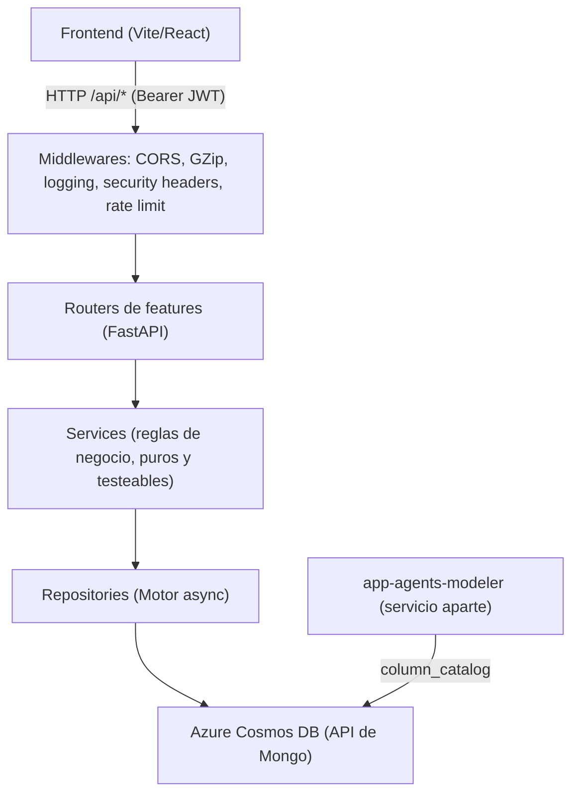
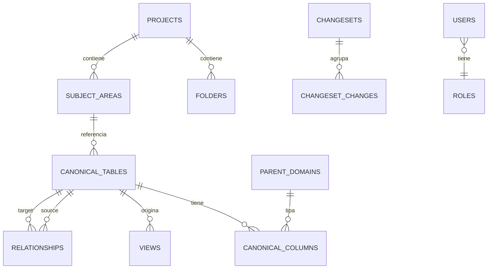
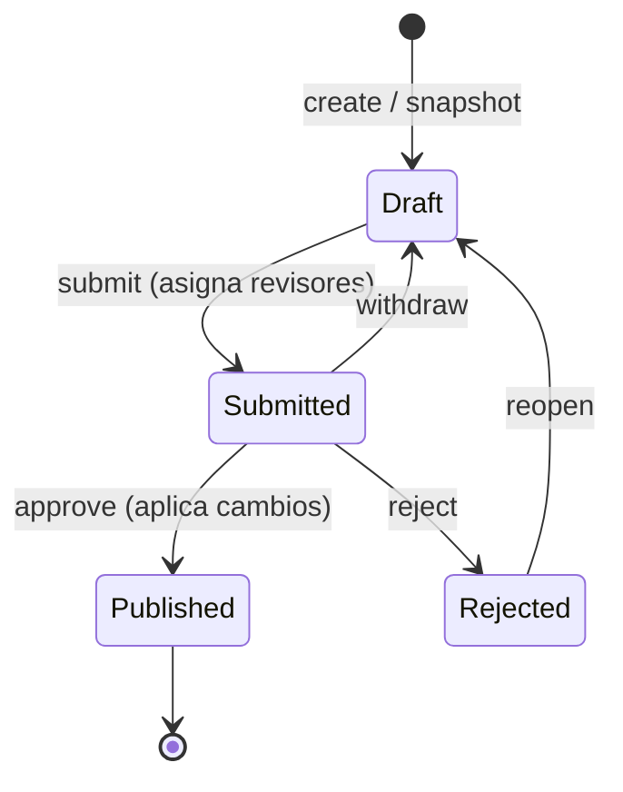
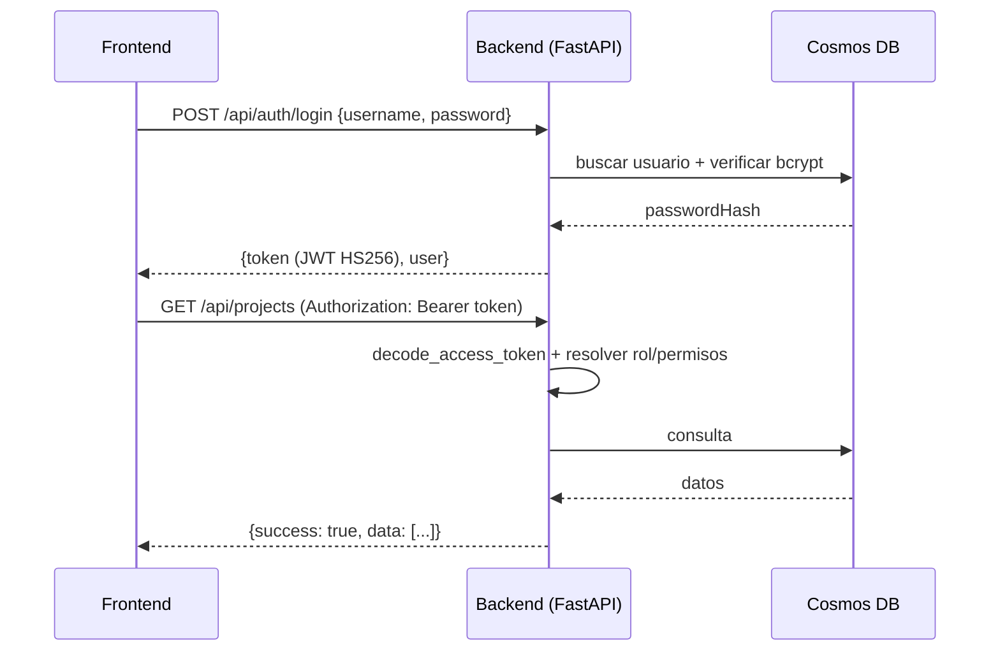

# Data Model Hub — Backend

Backend de plataforma de **Data Model Hub**, una plataforma de modelado de datos pensada para reemplazar a Erwin. Expone una API REST que administra proyectos, modelos (canvas de diagramas ER), un catálogo canónico de metadata (tablas, columnas, dominios, glosario, UDP), un flujo de gobernanza por *working copies* con aprobación (changesets), estándares de datos versionados, un motor de reporting sobre la metadata y administración de usuarios/roles (RBAC) con auditoría. Todo persiste en **Azure Cosmos DB (API de Mongo)**.

Este repositorio contiene **solo el backend de plataforma**. El agente de modelado conversacional vive en un servicio aparte (`app-agents-modeler`) y no forma parte de este MVP.

---

## Stack tecnológico

| Área | Tecnología |
|---|---|
| Lenguaje | Python 3.12 (en Databricks Apps el runtime es 3.11) |
| Framework web | FastAPI (>= 0.104) |
| Servidor ASGI | Uvicorn (`uvicorn[standard]`) |
| Base de datos | Azure Cosmos DB for MongoDB (vCore) |
| Driver DB | Motor (cliente async) + PyMongo (compatibilidad de tipos) |
| Validación / modelos | Pydantic v2 |
| Hash de contraseñas | bcrypt |
| Token de sesión | PyJWT (JWT firmado con HS256) |
| Parser SQL (reporting) | sqlglot |
| Rate limiting | slowapi |
| Compresión HTTP | GZip (middleware de Starlette) |
| Tests | pytest + httpx |
| Config por entorno | python-dotenv |

---

## Arquitectura

El backend es un **monolito modular** organizado en *vertical slices*: `app/core/` es la infraestructura compartida (no depende de features) y cada feature vive autocontenida en `app/features/<x>/` con su propio stack de capas.



Cada feature respeta las mismas capas:

| Archivo | Rol | Regla |
|---|---|---|
| `router.py` | Solo HTTP: parseo de request, envuelve con `ok(...)`. | Sin reglas de negocio ni DB directa. |
| `service.py` | Reglas de negocio y validación. | Funciones puras + orquestación async. |
| `repository.py` | CRUD sobre Cosmos (Motor). | Único lugar que toca la DB. |
| `schemas.py` | DTOs de request/response. | Pydantic. |
| `models.py` | Documentos persistidos. | `extra="ignore"` (invariante de round-trip). |

**Composition root** (`app/main.py`): la factory `create_app()` configura logging, el *lifespan* (abre/cierra la conexión Motor y asegura índices), los middlewares y monta los routers de todas las features. El entrypoint canónico es `app.main:app`.

Reglas que mantienen el monolito limpio (con tests de arquitectura que las hacen cumplir, en `tests/architecture/`):

1. **Cross-feature solo por el módulo público** de la otra feature (`from app.features.<x> import repository`), nunca por internos.
2. **El router lo monta el composition root**, evitando ciclos de importación.

### Invariante de persistencia (round-trip)

La lectura re-valida los documentos con Pydantic usando `extra="ignore"`. Por lo tanto, **un campo nuevo que se persiste necesita estar declarado en el `models.py` correspondiente**, o se descarta silenciosamente al releer.

---

## Modelo de datos (colecciones Cosmos)

El backend administra un conjunto de colecciones disjuntas de las del agente (que solo toca `column_catalog`). Comparten el mismo cluster y la misma base (`db_modeler` por defecto).



| Colección | Contenido |
|---|---|
| `projects` | Proyectos de modelado. |
| `folders` | Jerarquía del Model Explorer dentro de un proyecto. |
| `subject_areas` | Canvases (áreas temáticas): tablas incluidas + layout + drawings. |
| `canonical_tables` / `canonical_columns` | Catálogo canónico de metadata física. |
| `relationships` | Relaciones entre tablas (FK/joins). |
| `views` | Vistas asociadas a tablas. |
| `parent_domains` | Dominios padre (tipos semánticos) con cascada de propiedades. |
| `glossary_terms` | Glosario (términos lógico/físico, fisicalización). |
| `udp_definitions` | UDP: etiquetas key-value versionadas; sus valores se embeben en tablas/columnas (`udpValues`). |
| `changesets` | Cabeceras de working copies (estado, revisores, decisiones). |
| `changeset_changes` | Un documento por cambio (evita el límite de 2 MB/doc de Cosmos). |
| `naming_config` | Config de naming (separador/case) por scope. |
| `standards_versions` | Versiones inmutables de Data Standards (con `seq` único). |
| `users` / `roles` | Usuarios y matriz de permisos (RBAC data-driven). |
| `audit_log` | Auditoría de acciones (actor, acción, target, timestamp). |

Los índices se aseguran de forma idempotente al arrancar (`app/core/db/indexes.py`). Nota importante: **Cosmos DB en tier RU rechaza `.sort()` sobre campos no indexados**, por eso todos los campos por los que se ordena o pagina (p. ej. `physicalName`) están indexados. Los UDP usan un índice **wildcard** (`udpValues.$**`) para cubrir cualquier clave presente o futura sin DDL por clave.

---

## Features principales

| Feature | Prefijo | Qué hace |
|---|---|---|
| `health` | `/api/health` | Estado de la API + ping vivo a Cosmos. |
| `auth` | `/api/auth` | Login usuario/contraseña, logout y `me` (sesión + permisos). |
| `admin` | `/api/admin` | RBAC: usuarios, roles, matriz de permisos y auditoría. |
| `identity` | `/api` | Seam de identidad (`/me`, `/users`) conmutable local/Databricks. |
| `projects` | `/api` | Proyectos + subject areas (canvas): tablas, layout, drawings, diagrama. |
| `folders` | `/api` | Jerarquía de carpetas del Model Explorer. |
| `catalog` | `/api/catalog` | Catálogo canónico de tablas y columnas. |
| `relationships` | `/api/relationships` | CRUD de relaciones entre tablas. |
| `views` | `/api/views` | CRUD de vistas por tabla. |
| `domains` | `/api/domains` | Parent domains + impacto y propagación de cascada. |
| `glossary` | `/api/glossary` | Glosario + fisicalización/logicalización de nombres. |
| `udp` | `/api/udp` | Definiciones de UDP (etiquetas versionadas). |
| `data_standards` | `/api/standards` | Snapshot/apply/rollback de estándares versionados. |
| `changesets` | `/api/changesets` | Working copy + flujo de aprobación (+ `/api/versions`, `/api/requests`). |
| `summary` | `/api/summary` | Conteos del Home. |
| `reporting` | `/api/reporting` | Agregación tabular de metadata (solo lectura). |
| `reporting-query` | `/api/reporting` | Motor de consulta: QuerySpec, SQL, insights, reports, export CSV. |
| `settings` | `/api/settings` | `naming_config` por scope (separador/case). |

### Gobernanza: changesets (working copy + aprobación)

Los cambios al modelo publicado no se escriben directo: se hacen sobre un **working copy** (changeset) que atraviesa un flujo de aprobación. Solo al aprobar/publicar se aplican los cambios a las colecciones publicadas. Cada cambio se guarda como un documento individual en `changeset_changes` y se lee siempre vía `changesets.repository.changes_map`.



Reglas clave: solo el dueño edita su working copy en estado `draft`; una versión fuera de `draft` responde `409` a nuevos cambios; la colección destino debe estar en una whitelist de colecciones versionadas (`422` si no); un payload que no valida contra el modelo no entra al changeset (`422`).

### Motor de reporting

Dos capas de reporting sobre el catálogo canónico:

- **Agregación tabular** (`GET /api/reporting/tables`, `/columns`): solo lectura, con conteos server-side y proyección optimizada.
- **Motor de consulta** (`/api/reporting/query`, `/query/sql`, `/export`): expone un **Field Catalog** dinámico (campos estáticos + UDP), acepta un `QuerySpec` JSON o **SQL de texto** (parseado con sqlglot a `QuerySpec`), pagina por *keyset* a escala (probado con 400k columnas) y exporta CSV por streaming en memoria O(1). Incluye endpoints de *insights* (scorecard, cobertura de UDP, uso de dominios/glosario, relaciones) y CRUD de reports guardados.

---

## Autenticación y RBAC

Autenticación propia con **login usuario/contraseña** (bcrypt) que emite un **token de sesión JWT firmado con HS256** (PyJWT). La identidad de cada request sale del token (Bearer), no de headers. Existe además un *seam* de identidad conmutable (`AUTH_MODE=local|databricks`): en local usa un usuario fijo (con override `X-Dev-User` para probar aprobaciones); en Databricks podría derivar identidad de los headers del proxy SSO.



**RBAC data-driven**: los permisos viven en la colección `roles` (matriz editable desde Admin), no hardcodeados. El catálogo de permisos (en `app/features/auth/models.py`):

| Permiso | Significado |
|---|---|
| `model.view` | Ver modelo / canvas. |
| `model.edit` | Crear / editar tablas (working copy). |
| `review.decide` | Aprobar / rechazar solicitudes. |
| `publish` | Publicar a producción. |
| `export` | Exportar DDL / metadata. |
| `standards.edit` | Editar Data Standards (UDP / parent domains). |
| `admin.manage` | Administrar usuarios y permisos. |

Roles de referencia sembrados: `administrador`, `modelador`, `revisor`, `lector`. Las escrituras están gateadas por dependencias FastAPI reutilizables: `write_guard("<perm>")` (a nivel router: lecturas solo exigen sesión válida, escrituras exigen el permiso) y `require_permission("<perm>")`. Las acciones se registran en `audit_log` (best-effort; se omiten los guardados de canvas de alta frecuencia para no inundar el log).

### Postura de producción (fail-closed)

- `REQUIRE_AUTH=true`: una request sin token válido responde `401`; además se **ocultan** `/docs`, `/redoc` y `/openapi.json`.
- `assert_secure_config()` **impide arrancar** si `REQUIRE_AUTH=true` sigue usando el `SECRET_KEY` de desarrollo (con esa clave pública cualquiera forjaría un token admin).
- Rate limiting activo (login: `5/minute` por IP), security headers (`X-Content-Type-Options`, `X-Frame-Options`, `Referrer-Policy`, `Permissions-Policy`, HSTS solo sobre HTTPS), CORS con allowlist explícita y sin credenciales (token-first).

---

## Contrato de API

Todas las respuestas usan un sobre estándar:

```json
{ "success": true, "data": { } }
```

En error no controlado (`500`):

```json
{ "success": false, "error": "Error interno del servidor. Revisá los logs con el X-Request-ID." }
```

Cada respuesta trae un header `X-Request-ID` correlacionable con los logs. Endpoints (agrupados):

| Método | Ruta | Descripción |
|---|---|---|
| `GET` | `/api/health` | Estado + `db_connected`. |
| `POST` | `/api/auth/login` | Login → `{token, user}` (`401` si falla). |
| `POST` | `/api/auth/logout` | Cierra sesión. |
| `GET` | `/api/auth/me` | Usuario en sesión + permisos efectivos. |
| `GET/POST/PUT/DELETE` | `/api/admin/users[/{username}]` | CRUD de usuarios. |
| `GET/PUT/DELETE` | `/api/admin/roles[/{key}]` | Roles y matriz. |
| `GET` | `/api/admin/permissions` | Catálogo de permisos. |
| `GET` | `/api/admin/audit` | Auditoría. |
| `GET/POST/PUT/DELETE` | `/api/projects[/{pid}]` | CRUD de proyectos. |
| `GET` | `/api/projects/{pid}/subject-areas` | Canvases del proyecto. |
| `GET/POST/PUT/DELETE` | `/api/subject-areas[/{id}]` | CRUD de canvas. |
| `PUT` | `/api/subject-areas/{id}/tables` `/layout` `/drawings` | Contenido/posiciones del canvas. |
| `GET` | `/api/subject-areas/{id}/diagram` | Diagrama en una request (overlay de changeset opcional). |
| `GET/POST/PUT/PATCH/DELETE` | `/api/folders...` | Jerarquía de carpetas. |
| `GET/POST` | `/api/catalog/tables[/{id}/columns]` | Catálogo canónico. |
| `GET/POST/PUT/DELETE` | `/api/relationships[/{id}]` | Relaciones. |
| `GET/POST/PUT/DELETE` | `/api/views[/{id}]` | Vistas. |
| `GET/POST/PUT/DELETE` | `/api/domains[/{id}]` + `/impact` `/propagate` | Parent domains + cascada. |
| `GET/POST/PUT/DELETE` | `/api/glossary[/{id}]` + `/physicalize` `/logicalize` | Glosario. |
| `GET` | `/api/udp` | Definiciones de UDP. |
| `GET/POST` | `/api/standards/snapshot` `/versions` `/apply` `/rollback` | Data Standards. |
| `POST/GET` | `/api/changesets...` (`/snapshot`, `/{id}/changes`, `/diff`, `/submit`, `/approve`, `/reject`, ...) | Working copy + aprobación. |
| `GET` | `/api/versions` `/api/versions/published` `/api/requests` | Versiones y solicitudes (Home/Review). |
| `GET` | `/api/summary` | Conteos del Home. |
| `GET` | `/api/reporting/tables` `/columns` | Agregación tabular. |
| `GET/POST` | `/api/reporting/catalog` `/query` `/query/sql` `/export` `/insights/*` `/reports` | Motor de consulta. |
| `GET/PUT` | `/api/settings/naming[/{scope}]` | naming_config por scope. |

### Ejemplos

Health check:

```bash
curl http://localhost:8000/api/health
# → {"status":"ok","version":"1.0.0","db_connected":true}
```

Login y uso del token:

```bash
TOKEN=$(curl -s -X POST http://localhost:8000/api/auth/login \
  -H "Content-Type: application/json" \
  -d '{"username":"admin","password":"admin"}' | python3 -c "import sys,json;print(json.load(sys.stdin)['data']['token'])")

curl http://localhost:8000/api/projects -H "Authorization: Bearer $TOKEN"
```

Consulta al motor de reporting con SQL de texto:

```bash
curl -X POST http://localhost:8000/api/reporting/query/sql \
  -H "Authorization: Bearer $TOKEN" -H "Content-Type: application/json" \
  -d '{"text":"SELECT physicalName, dataType FROM columns WHERE dataType = '\''STRING'\'' LIMIT 50"}'
```

---

## Cómo correrlo localmente

Requisitos: Python 3.12 y una cadena de conexión a Azure Cosmos DB (API de Mongo).

```bash
cd backend-data-model-hub

# 1) Configuración
cp .env.example .env            # rellenar COSMOS_CONNECTION_STRING

# 2) Entorno virtual + dependencias
python3.12 -m venv .venv && source .venv/bin/activate
pip install -r requirements.txt          # runtime
pip install -r requirements-dev.txt      # + pytest/httpx (opcional, para tests)

# 3) Levantar la API (con reload)
uvicorn app.main:app --host 0.0.0.0 --port 8000 --reload

# 4) Verificar
curl http://localhost:8000/api/health
```

Con la app en modo desarrollo (`REQUIRE_AUTH` sin definir), la documentación interactiva queda disponible en `http://localhost:8000/docs`.

Bootstrap de datos (opcional, scripts en `scripts/`):

```bash
# Crea/actualiza el usuario admin/admin y los roles (idempotente, no borra nada)
.venv/bin/python scripts/create_admin.py

# Siembra data demo del modelo (respeta column_catalog del agente)
.venv/bin/python scripts/seed_modeler.py

# Prueba de estrés a escala (10k tablas / 400k columnas / 9k vistas)
.venv/bin/python scripts/seed_stress.py
```

---

## Variables de entorno

| Variable | Default | Descripción |
|---|---|---|
| `COSMOS_CONNECTION_STRING` | — (obligatoria) | Cadena de conexión a Cosmos DB (API de Mongo). |
| `COSMOS_DATABASE` | `db_modeler` | Base de datos. |
| `CORS_ORIGINS` | `http://localhost:3000,http://127.0.0.1:3000` | Orígenes del frontend permitidos (coma-separados). |
| `SECRET_KEY` | default inseguro de dev | Clave HMAC para firmar el JWT. Obligatoria en prod. |
| `REQUIRE_AUTH` | `false` | `true` en prod: exige token, oculta la doc y activa el fail-closed. |
| `ACCESS_TOKEN_TTL_MIN` | `720` (12 h) | Vida del token de acceso. |
| `AUTH_MODE` | `local` | Seam de identidad: `local` o `databricks`. |
| `ALLOWED_HOSTS` | — | Allowlist de hosts (activa `TrustedHostMiddleware` si se define). |
| `RATE_LIMIT_ENABLED` | — | Fuerza el rate limiting fuera de prod. |
| `LOG_FORMAT` | `pretty` | `pretty` (dev) o `json` (prod). |
| `LOG_LEVEL` | `INFO` | `DEBUG`/`INFO`/`WARNING`/`ERROR`/`CRITICAL`. |

---

## Estructura de carpetas

```
backend-data-model-hub/
  app/
    main.py                  # composition root: create_app() + lifespan + routers
    core/                    # infra compartida (no depende de features)
      config.py              # settings + assert_secure_config (fail-closed)
      logging.py  ratelimit.py  audit.py  security.py  models.py
      db/                    # client.py (Motor) + indexes.py (idempotentes)
      api/envelope.py        # ok({...})
      identity/              # seam local/databricks (Principal, dependencies)
      naming/                # engine de fisicalización
      versioning/            # overlay.py (overlay + diff, puros)
    features/<x>/            # router · service · repository · schemas · models
      health · auth · admin · identity · projects · folders · catalog ·
      relationships · views · domains · glossary · udp · data_standards ·
      changesets · summary · reporting (+ reporting/query) · settings
  tests/                     # pytest: core, features y architecture (guardrails)
  scripts/                   # create_admin · seed_modeler · seed_stress · migraciones
  doc/                       # documentación (ver índice abajo)
  requirements.txt  requirements-dev.txt  .env.example
  app.yaml  databricks.yml   # runtime + bundle de Databricks Apps
```

---

## Testing

Suite con **pytest** (+ httpx para el cliente async). Incluye tests unitarios de servicios puros, tests de rutas por feature y **tests de arquitectura** (`tests/architecture/`) que hacen cumplir los límites entre capas (`test_store_boundary.py`) y que las features legacy no reaparezcan (`test_no_legacy_features.py`).

```bash
.venv/bin/pytest            # toda la suite
.venv/bin/pytest tests/features/reporting -q
```

Los tests de identidad/permisos aprovechan `REQUIRE_AUTH=false` y el override `X-Dev-User` del seam local, por lo que no requieren montar una DB real para la mayoría de los casos.

---

## Despliegue

El backend está pensado para correr como servicio ASGI (entrypoint `app.main:app`) detrás de un proxy con TLS. Dos destinos soportados:

- **Databricks Apps** (destino primario). Definido por `app.yaml` (comando `uvicorn app.main:app`; Databricks inyecta host/puerto vía `UVICORN_HOST`/`UVICORN_PORT`) y el Asset Bundle `databricks.yml`. Los secretos (`COSMOS_CONNECTION_STRING`, `SECRET_KEY`) se resuelven desde un scope respaldado por Azure Key Vault con `valueFrom`. En prod se fija `REQUIRE_AUTH=true`, `LOG_FORMAT=json` y `CORS_ORIGINS` apuntando a la URL de la app frontend.
- **Azure App Service** (alternativa). Correr `uvicorn app.main:app --host 0.0.0.0 --port $PORT` y configurar las mismas variables de entorno como *App Settings*.

Checklist mínimo de producción, independientemente del destino:

- `REQUIRE_AUTH=true` y un `SECRET_KEY` aleatorio fuerte (p. ej. `openssl rand -hex 32`). Sin esto la app no arranca (fail-closed).
- `CORS_ORIGINS` con el origen exacto del frontend (sin comodines).
- `LOG_FORMAT=json` para logs estructurados.

### Consideraciones de base de datos (Azure Cosmos DB con API de Mongo)

- Misma cuenta/base que el agente (`db_modeler`), pero **colecciones disjuntas**: este backend nunca toca `column_catalog`.
- El cliente Motor usa timeouts explícitos (selección 15 s, conexión 10 s, socket 60 s) y `maxPoolSize=50` para no agotar el pool ante sockets colgados.
- Los índices se aseguran al arrancar y son idempotentes: se toleran `NamespaceExists` (48) y duplicate-key (11000). En tier RU, **ordenar/paginar exige índice** sobre el campo; los UDP usan índice wildcard.
- El rate limiting mantiene estado **en memoria por proceso**: en un despliegue multi-réplica conviene migrarlo a un backend Redis para que el límite sea global.

---

## Documentación

| Documento | Contenido |
|---|---|
| [`doc/arquitectura.md`](doc/arquitectura.md) | Arquitectura del backend, monolito modular y capas. |
| [`doc/esquema-datos.md`](doc/esquema-datos.md) | **Referencia completa de las colecciones** (campos, tipos, embebidos, índices, referencias) — insumo para migrar el esquema. |
| [`doc/api-contract.md`](doc/api-contract.md) | Contrato de la API: sobre estándar, endpoints y ejemplos. |
| [`doc/seguridad.md`](doc/seguridad.md) | Autenticación, RBAC, hardening y postura de producción. |
| [`doc/testing.md`](doc/testing.md) | Estrategia de tests y cómo correrlos. |
| [`doc/consideraciones-y-limites.md`](doc/consideraciones-y-limites.md) | Límites, escalabilidad y decisiones de diseño. |
| [`doc/despliegue.md`](doc/despliegue.md) | Dónde corre, variables de entorno y consideraciones de Cosmos. |
| [`doc/migracion-erwin.md`](doc/migracion-erwin.md) | Carga del modelo desde un XML de Erwin (scripts, mapeo, censo de lo no migrado). |
| [`doc/feature-architecture.md`](doc/feature-architecture.md) | Guía para agregar features sin romper los guardrails. |
