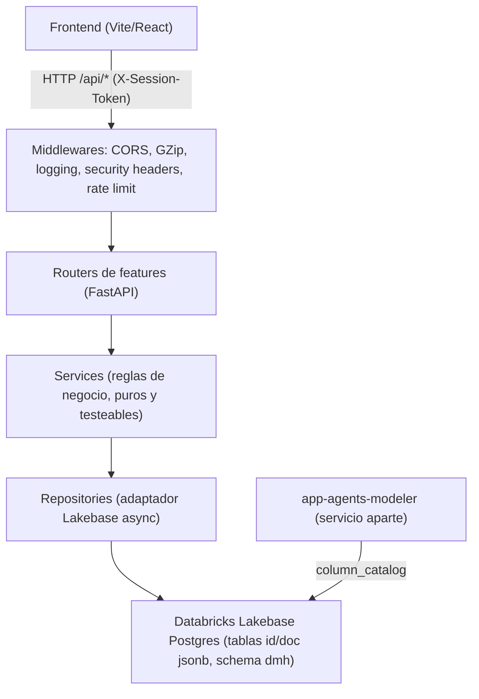
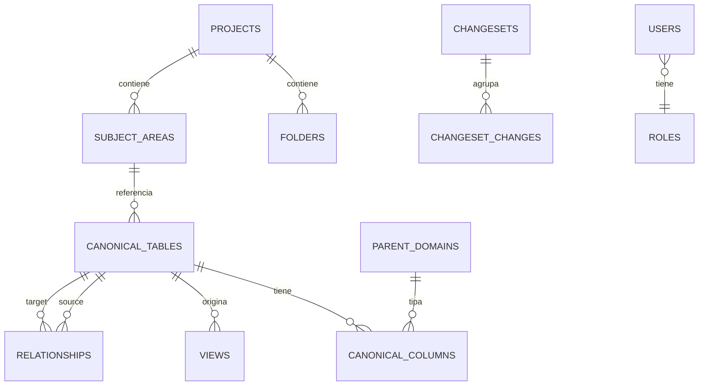
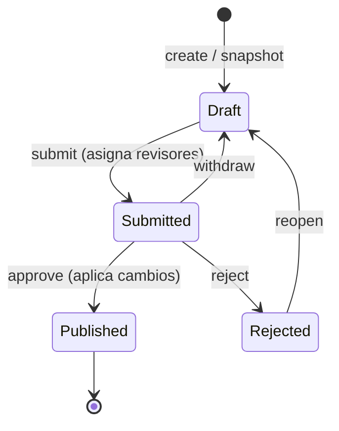
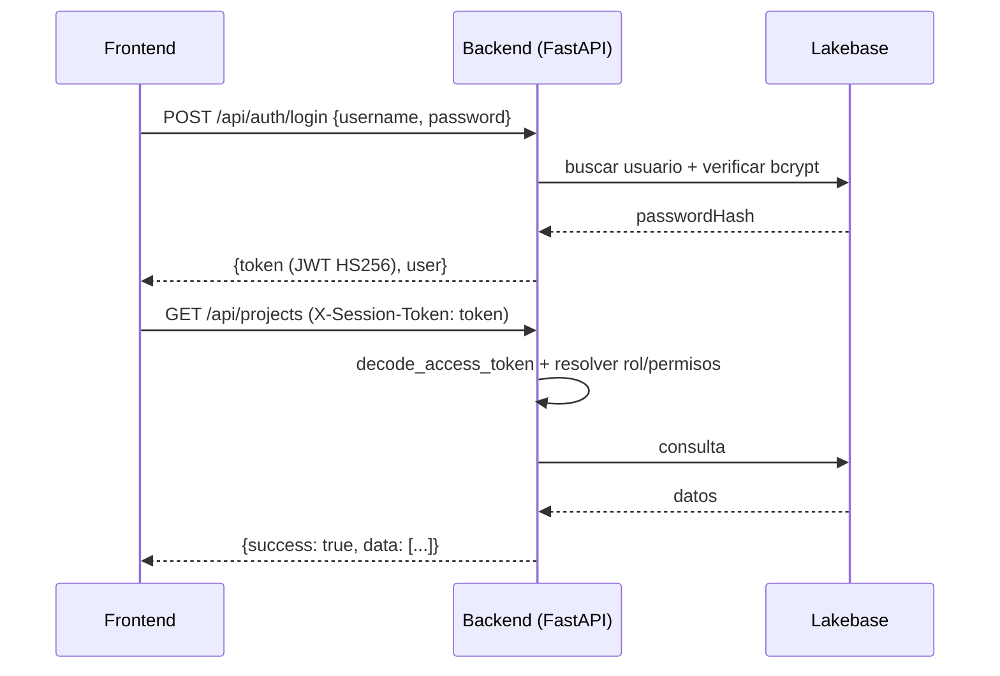

# Data Model Hub — Backend

Backend de plataforma de **Data Model Hub**, una plataforma de modelado de datos pensada para reemplazar a Erwin. Expone una API REST que administra proyectos, modelos (canvas de diagramas ER), un catálogo canónico de metadata (tablas, columnas, dominios, glosario, UDP), un flujo de gobernanza por *working copies* con aprobación (changesets), estándares de datos versionados, un motor de reporting sobre la metadata y administración de usuarios/roles (RBAC) con auditoría. Todo persiste en **Databricks Lakebase Postgres**, a través de un adaptador propio (`app/core/db/lakebase/`) que expone una superficie de consulta async con el vocabulario de operaciones/tipos de `pymongo` (`find`/`aggregate`/`bulk_write`, `ReturnDocument`, `UpdateOne`, `DuplicateKeyError`) sobre tablas `(id text PRIMARY KEY, doc jsonb)`.

Este repositorio contiene **solo el backend de plataforma**. El agente de modelado conversacional vive en un servicio aparte (`app-agents-modeler`) y no forma parte de este MVP.

---

## Stack tecnológico

| Área | Tecnología |
|---|---|
| Lenguaje | Python 3.12 (en Databricks Apps el runtime es 3.11; ambos funcionan) |
| Framework web | FastAPI (>= 0.104) |
| Servidor ASGI | Uvicorn (`uvicorn[standard]`) |
| Base de datos | Databricks Lakebase Postgres (tablas `(id text PRIMARY KEY, doc jsonb)` en el schema `dmh`) |
| Acceso a datos | Adaptador `app/core/db/lakebase/` sobre `asyncpg`; token OAuth acuñado con el service principal (`databricks-sdk`). `pymongo` aporta solo el vocabulario de tipos/operaciones que el adaptador emula (no conecta a Mongo). |
| Validación / modelos | Pydantic v2 |
| Hash de contraseñas | bcrypt |
| Token de sesión | PyJWT (JWT firmado con HS256) |
| Parser SQL (reporting) | sqlglot |
| Rate limiting | slowapi |
| Compresión HTTP | GZip (middleware de Starlette) |
| Tests | pytest + httpx |
| Config por entorno | python-dotenv |

---

## Arquitectura

El backend es un **monolito modular** organizado en *vertical slices*: `app/core/` es la infraestructura compartida (no depende de features) y cada feature vive autocontenida en `app/features/<x>/` con su propio stack de capas.



Cada feature respeta las mismas capas:

| Archivo | Rol | Regla |
|---|---|---|
| `router.py` | Solo HTTP: parseo de request, envuelve con `ok(...)`. | Sin reglas de negocio ni DB directa. |
| `service.py` | Reglas de negocio y validación. | Funciones puras + orquestación async. |
| `repository.py` | CRUD sobre Lakebase vía el adaptador (`get_db()`). | Único lugar que toca la DB. |
| `schemas.py` | DTOs de request/response. | Pydantic. |
| `models.py` | Documentos persistidos. | `extra="ignore"` (invariante de round-trip). |

**Composition root** (`app/main.py`): la factory `create_app()` configura logging, el *lifespan* (abre/cierra el pool de conexiones a Lakebase y asegura los índices), los middlewares y monta los routers de todas las features. El entrypoint canónico es `app.main:app`.

Reglas que mantienen el monolito limpio (con tests de arquitectura que las hacen cumplir, en `tests/architecture/`):

1. **Cross-feature solo por el módulo público** de la otra feature (`from app.features.<x> import repository`), nunca por internos.
2. **El router lo monta el composition root**, evitando ciclos de importación.
3. **El acceso a datos vive solo en los `repository.py`** (`test_store_boundary.py`), lo que mantiene el store confinado tras una superficie única (`get_db()`).

### Invariante de persistencia (round-trip)

La lectura re-valida los documentos con Pydantic usando `extra="ignore"`. Por lo tanto, **un campo nuevo que se persiste necesita estar declarado en el `models.py` correspondiente**, o se descarta silenciosamente al releer.

---

## Modelo de datos (colecciones en Lakebase)

Cada "colección" es una tabla `(id text PRIMARY KEY, doc jsonb)` en el schema `dmh` de `databricks_postgres`: el documento completo vive en `doc` y las igualdades por jsonpath se apoyan en un índice GIN `jsonb_path_ops` por tabla. El backend administra un conjunto de colecciones **disjuntas** de las del agente (que solo toca `column_catalog`).



Son **21 colecciones propias**: 19 se pre-crean al arrancar (`KNOWN_COLLECTIONS`) y 2 (`ddl_rules`, `ddl_ruleset_config`) se crean on-demand con la misma forma. La referencia campo por campo está en [`doc/esquema-datos.md`](doc/esquema-datos.md).

| Colección | Contenido |
|---|---|
| `projects` | Proyectos de modelado. |
| `folders` | Jerarquía del Model Explorer dentro de un proyecto. |
| `subject_areas` | Canvases (áreas temáticas): tablas incluidas + layout + drawings. |
| `schemas` | Esquemas físicos (namespace de tablas), versionados. |
| `canonical_tables` / `canonical_columns` | Catálogo canónico de metadata física. |
| `relationships` | Relaciones entre tablas (parent/child + `pairs`, FK/joins). |
| `views` | Vistas asociadas a tablas. |
| `parent_domains` | Dominios padre (tipos semánticos) con cascada de propiedades. |
| `glossary_terms` | Glosario (términos lógico/físico, fisicalización). |
| `udp_definitions` | UDP: etiquetas key-value versionadas; sus valores se embeben en tablas/columnas (`udpValues`). |
| `changesets` | Cabeceras de working copies (estado, revisores, decisiones). |
| `changeset_changes` | Un documento por cambio: el versionado por changesets trata cada cambio como su propio documento, lo que mantiene los updates JSONB chicos y permite diffs por slice. |
| `naming_config` | Config de naming (separador/case/longitud) por scope. |
| `standards_versions` | Versiones inmutables de Data Standards (con `seq` único — el único constraint UNIQUE del sistema). |
| `ddl_rules` / `ddl_ruleset_config` | Reglas de transformación del DDL exportado (DDL Export Rules); se crean on-demand. |
| `saved_reports` | Reports guardados del motor de consulta. |
| `users` / `roles` | Usuarios y matriz de permisos (RBAC data-driven). |
| `audit_log` | Auditoría de acciones (actor, acción, target, timestamp); append-only. |

Los índices se aseguran de forma idempotente al arrancar (`app/core/db/indexes.py`): reintentos concurrentes en el arranque no fallan. A escala (cientos de miles de columnas de la ingesta XML de Erwin) un orden o paginación por un campo sin índice sería un full-scan, por eso todos los campos por los que se ordena o pagina (p. ej. `physicalName`) están indexados. Los UDP usan un índice **wildcard** (`udpValues.$**`) para cubrir cualquier clave presente o futura sin DDL por clave.

---

## Features principales

Son **19 features** (directorios en `app/features/`). Algunas exponen más de un router: `changesets` monta además `versions` y `requests`; `reporting` monta además el `query` del motor de consulta — 22 routers en total.

| Feature | Prefijo | Qué hace |
|---|---|---|
| `health` | `/api/health` | Estado de la API + ping vivo a Lakebase (`db_connected`). |
| `auth` | `/api/auth` | Login usuario/contraseña, logout y `me` (sesión + permisos). |
| `admin` | `/api/admin` | RBAC: usuarios, roles, matriz de permisos y auditoría. |
| `identity` | `/api` | Seam de identidad (`/me`, `/users`) conmutable local/Databricks. |
| `projects` | `/api` | Proyectos + subject areas (canvas): tablas, layout, drawings, diagrama. |
| `folders` | `/api` | Jerarquía de carpetas del Model Explorer. |
| `schemas` | `/api/schemas` | Esquemas físicos versionados (rename propagado, guard de uso). |
| `catalog` | `/api/catalog` | Catálogo canónico de tablas y columnas. |
| `relationships` | `/api/relationships` | CRUD de relaciones entre tablas. |
| `views` | `/api/views` | CRUD de vistas por tabla. |
| `domains` | `/api/domains` | Parent domains + impacto y propagación de cascada. |
| `glossary` | `/api/glossary` | Glosario + fisicalización/logicalización de nombres. |
| `udp` | `/api/udp` | Definiciones de UDP (etiquetas versionadas). |
| `data_standards` | `/api/standards` | Snapshot/apply/rollback de estándares versionados. |
| `ddl_rules` | `/api/ddl-rules` | Reglas de transformación del DDL exportado (+ `POST /render`). |
| `changesets` | `/api/changesets` | Working copy + flujo de aprobación (+ `/api/versions`, `/api/requests`). |
| `summary` | `/api/summary` | Conteos del Home. |
| `reporting` | `/api/reporting` | Agregación tabular de metadata + motor de consulta (QuerySpec, SQL, insights, reports, export CSV). |
| `settings` | `/api/settings` | `naming_config` por scope (separador/case/longitud). |

### Gobernanza: changesets (working copy + aprobación)

Los cambios al modelo publicado no se escriben directo: se hacen sobre un **working copy** (changeset) que atraviesa un flujo de aprobación. Solo al aprobar/publicar se aplican los cambios a las colecciones publicadas. Cada cambio se guarda como un documento individual en `changeset_changes` y se lee siempre vía `changesets.repository.changes_map`.



Reglas clave: solo el dueño edita su working copy en estado `draft`; una versión fuera de `draft` responde `409` a nuevos cambios; la colección destino debe estar en una whitelist de colecciones versionadas (`422` si no); un payload que no valida contra el modelo no entra al changeset (`422`).

### Motor de reporting

Dos capas de reporting sobre el catálogo canónico:

- **Agregación tabular** (`GET /api/reporting/tables`, `/columns`): solo lectura, con conteos server-side y proyección optimizada.
- **Motor de consulta** (`/api/reporting/query`, `/query/sql`, `/export`): expone un **Field Catalog** dinámico (campos estáticos + UDP), acepta un `QuerySpec` JSON o **SQL de texto** (parseado con sqlglot a `QuerySpec`), pagina por *keyset* a escala (probado con 400k columnas) y exporta CSV por streaming en memoria O(1). Incluye endpoints de *insights* (scorecard, cobertura de UDP, uso de dominios/glosario, relaciones) y CRUD de reports guardados.

---

## Autenticación y RBAC

Autenticación propia con **login usuario/contraseña** (bcrypt) que emite un **token de sesión JWT firmado con HS256** (PyJWT). La identidad de cada request sale del token, no de headers. Existe además un *seam* de identidad conmutable (`AUTH_MODE=local|databricks`): en local usa un usuario fijo (con override `X-Dev-User` para probar aprobaciones); en Databricks el token de sesión propio viaja en el header `X-Session-Token`.



**RBAC data-driven**: los permisos viven en la colección `roles` (matriz editable desde Admin), no hardcodeados. El catálogo de permisos (en `app/features/auth/models.py`):

| Permiso | Significado |
|---|---|
| `model.view` | Ver modelo / canvas. |
| `model.edit` | Crear / editar tablas (working copy). |
| `review.decide` | Aprobar / rechazar solicitudes. |
| `publish` | Publicar a producción. |
| `rollback` | Revertir a una versión publicada previa. |
| `export` | Exportar DDL / metadata. |
| `standards.edit` | Editar Data Standards (UDP / parent domains). |
| `admin.manage` | Administrar usuarios y permisos. |

Roles de referencia sembrados: `administrador`, `modelador`, `revisor`, `lector`. Las escrituras están gateadas por dependencias FastAPI reutilizables: `write_guard("<perm>")` (a nivel router: lecturas solo exigen sesión válida, escrituras exigen el permiso) y `require_permission("<perm>")`. Las acciones se registran en `audit_log` (best-effort; se omiten los guardados de canvas de alta frecuencia para no inundar el log).

### Postura de producción (fail-closed)

- `REQUIRE_AUTH=true`: una request sin token válido responde `401`; además se **ocultan** `/docs`, `/redoc` y `/openapi.json`.
- `assert_secure_config()` **impide arrancar** si `REQUIRE_AUTH=true` sigue usando el `SECRET_KEY` de desarrollo (con esa clave pública cualquiera forjaría un token admin).
- Rate limiting activo (login: `5/minute` por IP), security headers (`X-Content-Type-Options`, `X-Frame-Options`, `Referrer-Policy`, `Permissions-Policy`, HSTS solo sobre HTTPS), CORS con allowlist/regex explícita. La auth es token-first, pero `allow_credentials=True` (la cookie del proxy SSO de Databricks Apps viaja con la request).

---

## Contrato de API

Todas las respuestas usan un sobre estándar:

```json
{ "success": true, "data": { } }
```

En error no controlado (`500`):

```json
{ "success": false, "error": "Error interno del servidor. Revisá los logs con el X-Request-ID." }
```

Cada respuesta trae un header `X-Request-ID` correlacionable con los logs. Endpoints (agrupados):

| Método | Ruta | Descripción |
|---|---|---|
| `GET` | `/api/health` | Estado + `db_connected`. |
| `POST` | `/api/auth/login` | Login → `{token, user}` (`401` si falla). |
| `POST` | `/api/auth/logout` | Cierra sesión. |
| `GET` | `/api/auth/me` | Usuario en sesión + permisos efectivos. |
| `GET/POST/PUT/DELETE` | `/api/admin/users[/{username}]` | CRUD de usuarios. |
| `GET/PUT/DELETE` | `/api/admin/roles[/{key}]` | Roles y matriz. |
| `GET` | `/api/admin/permissions` | Catálogo de permisos. |
| `GET` | `/api/admin/audit` | Auditoría. |
| `GET/POST/PUT/DELETE` | `/api/projects[/{pid}]` | CRUD de proyectos. |
| `GET` | `/api/projects/{pid}/subject-areas` | Canvases del proyecto. |
| `GET/POST/PUT/DELETE` | `/api/subject-areas[/{id}]` | CRUD de canvas. |
| `PUT` | `/api/subject-areas/{id}/tables` `/layout` `/drawings` | Contenido/posiciones del canvas. |
| `GET` | `/api/subject-areas/{id}/diagram` | Diagrama en una request (overlay de changeset opcional). |
| `GET/POST/PUT/PATCH/DELETE` | `/api/folders...` | Jerarquía de carpetas. |
| `GET/POST/PUT/DELETE` | `/api/schemas[/{id}]` | Esquemas físicos versionados. |
| `GET/POST` | `/api/catalog/tables[/{id}/columns]` `/columns` | Catálogo canónico. |
| `GET/POST/PUT/DELETE` | `/api/relationships[/{id}]` | Relaciones. |
| `GET/POST/PUT/DELETE` | `/api/views[/{id}]` | Vistas. |
| `GET/POST/PUT/DELETE` | `/api/domains[/{id}]` + `/impact` `/propagate` | Parent domains + cascada. |
| `GET/POST/PUT/DELETE` | `/api/glossary[/{id}]` + `/physicalize` `/logicalize` | Glosario. |
| `GET` | `/api/udp` | Definiciones de UDP. |
| `GET/POST` | `/api/standards/snapshot` `/versions` `/apply` `/rollback` | Data Standards. |
| `GET/POST/PUT/DELETE` | `/api/ddl-rules...` + `/render` | Reglas de transformación del DDL exportado. |
| `POST/GET` | `/api/changesets...` (`/snapshot`, `/{id}/changes`, `/diff`, `/submit`, `/approve`, `/reject`, ...) | Working copy + aprobación. |
| `GET` | `/api/versions` `/api/versions/published` `/api/requests` | Versiones y solicitudes (Home/Review). |
| `GET` | `/api/summary` | Conteos del Home. |
| `GET` | `/api/reporting/tables` `/columns` | Agregación tabular. |
| `GET/POST` | `/api/reporting/catalog` `/query` `/query/sql` `/export` `/insights/*` `/reports` | Motor de consulta. |
| `GET/PUT` | `/api/settings/naming[/{scope}]` | naming_config por scope. |

### Ejemplos

Health check:

```bash
curl http://localhost:8000/api/health
# → {"status":"ok","version":"1.0.0","db_connected":true}
```

Login y uso del token:

```bash
TOKEN=$(curl -s -X POST http://localhost:8000/api/auth/login \
  -H "Content-Type: application/json" \
  -d '{"username":"admin","password":"admin"}' | python3 -c "import sys,json;print(json.load(sys.stdin)['data']['token'])")

curl http://localhost:8000/api/projects -H "X-Session-Token: $TOKEN"
```

Consulta al motor de reporting con SQL de texto:

```bash
curl -X POST http://localhost:8000/api/reporting/query/sql \
  -H "X-Session-Token: $TOKEN" -H "Content-Type: application/json" \
  -d '{"text":"SELECT physicalName, dataType FROM columns WHERE dataType = '\''STRING'\'' LIMIT 50"}'
```

---

## Cómo correrlo localmente

Requisitos: Python 3.12 y acceso al workspace de Databricks (PAT) con el proyecto Lakebase creado (`dmh-proj/production/primary`).

```bash
cd backend-data-model-hub

# 1) Configuración
cp .env.example .env            # rellenar DATABRICKS_HOST / DATABRICKS_TOKEN / PGUSER

# 2) Entorno virtual + dependencias
python3.12 -m venv .venv && source .venv/bin/activate
pip install -r requirements.txt          # runtime
pip install -r requirements-dev.txt      # + pytest/httpx (opcional, para tests)

# 3) Levantar la API (con reload)
uvicorn app.main:app --host 0.0.0.0 --port 8000 --reload

# 4) Verificar
curl http://localhost:8000/api/health
```

Con la app en modo desarrollo (`REQUIRE_AUTH` sin definir), la documentación interactiva queda disponible en `http://localhost:8000/docs`.

Bootstrap de datos (scripts en `scripts/`):

```bash
# Crea/actualiza el usuario admin/admin y los roles (idempotente, no borra nada)
.venv/bin/python scripts/create_admin.py

# Carga un modelo desde un XML de Erwin a Lakebase (kit multi-archivo)
.venv/bin/python scripts/erwin_migration/...   # ver scripts/erwin_migration/README.md
```

---

## Variables de entorno

Todas se leen en `app/core/config.py`; lo específico del entorno entra por `.env` (dev) o por `app.yaml` (Apps). Tabla completa en `doc/despliegue.md` §3.

| Variable | Default | Descripción |
|---|---|---|
| `DATABRICKS_HOST` / `DATABRICKS_TOKEN` | `""` | Workspace + PAT (solo dev; en Apps el service principal autentica solo). |
| `LAKEBASE_ENDPOINT` | `""` (obligatoria) | Ruta lógica `projects/dmh-proj/branches/production/endpoints/primary`. |
| `PGHOST` | `""` (opcional) | Host físico `ep-…`; vacío → se resuelve solo desde el endpoint lógico. |
| `PGUSER` | `""` → `DATABRICKS_CLIENT_ID` | Rol PG: tu correo (dev) o el client ID del SP (Apps, automático). |
| `PGPORT` / `PGDATABASE` / `PGSSLMODE` / `LAKEBASE_PGSCHEMA` | `5432` / `databricks_postgres` / `require` / `dmh` | Constantes de producto. |
| `CORS_ORIGINS` | localhost:3000 (si no hay regex) | Orígenes exactos permitidos (coma-separados). |
| `CORS_ORIGIN_REGEX` | — | Regex de orígenes (prod: matchea el front en cualquier workspace). |
| `SECRET_KEY` | default inseguro de dev | Clave HMAC para firmar el JWT. Obligatoria en prod (desde el Key Vault vía `value_from`). |
| `REQUIRE_AUTH` | `false` | `true` en prod: exige token, oculta la doc y activa el fail-closed. |
| `ACCESS_TOKEN_TTL_MIN` | `720` (12 h) | Vida del token de acceso. |
| `AUTH_MODE` | `local` | Seam de identidad: `local` o `databricks`. |
| `ALLOWED_HOSTS` | — | Allowlist de hosts (activa `TrustedHostMiddleware` si se define). |
| `RATE_LIMIT_ENABLED` | — | Fuerza el rate limiting fuera de prod. |
| `LOG_FORMAT` | `pretty` | `pretty` (dev) o `json` (prod). |
| `LOG_LEVEL` | `INFO` | `DEBUG`/`INFO`/`WARNING`/`ERROR`/`CRITICAL`. |

---

## Estructura de carpetas

```
backend-data-model-hub/
  app/
    main.py                  # composition root: create_app() + lifespan + routers
    core/                    # infra compartida (no depende de features)
      config.py              # settings + assert_secure_config (fail-closed)
      logging.py  ratelimit.py  audit.py  security.py  models.py
      db/                    # client.py + indexes.py + lakebase/ (adaptador) + sync.py
      api/envelope.py        # ok({...})
      identity/              # seam local/databricks (Principal, dependencies)
      naming/                # engine de fisicalización
      versioning/            # overlay.py (overlay + diff, puros)
    features/<x>/            # router · service · repository · schemas · models
      health · auth · admin · identity · projects · folders · schemas ·
      catalog · relationships · views · domains · glossary · udp ·
      data_standards · ddl_rules · changesets · summary · reporting · settings
  tests/                     # pytest: core, features y architecture (guardrails)
  scripts/                   # create_admin · erwin_migration (kit XML→Lakebase)
  doc/                       # documentación (ver índice abajo)
  requirements.txt  requirements-dev.txt  .env.example
  app.yaml                   # command + env de runtime (Databricks Apps)
  databricks.yml             # bundle: variables por entorno + secreto + permisos
```

---

## Testing

Suite con **pytest** (+ httpx para el cliente async). Incluye tests unitarios de servicios puros, tests de rutas por feature y **tests de arquitectura** (`tests/architecture/`) que hacen cumplir los límites entre capas (`test_store_boundary.py`, que además **prohíbe** importar `motor`/`pymongo` fuera del adaptador) y que las features legacy no reaparezcan (`test_no_legacy_features.py`).

```bash
.venv/bin/pytest            # toda la suite
.venv/bin/pytest tests/features/reporting -q
```

Los tests de identidad/permisos aprovechan `REQUIRE_AUTH=false` y el override `X-Dev-User` del seam local, por lo que no requieren montar una DB real para la mayoría de los casos.

---

## Despliegue

El backend está pensado para correr como servicio ASGI (entrypoint `app.main:app`) detrás de un proxy con TLS. Dos destinos soportados:

- **Databricks Apps** (destino primario). El `command` (`uvicorn app.main:app`) y las `env` de runtime viven en el **`app.yaml`** de la raíz del repo, que Databricks lee en cada arranque (Databricks inyecta host/puerto vía `UVICORN_HOST`/`UVICORN_PORT`). El bundle `databricks.yml` aporta las `variables:` por entorno, el binding del secreto `session_secret` y los permisos; el bloque `config:` **no** se usa (el CLI lo ignora, bug `databricks/cli` #4901). La BD (Lakebase) NO usa secretos: la app acuña tokens OAuth con su service principal (rol PG one-time, doc 28 §11.3). El único secreto es `SECRET_KEY`, resuelto desde un scope respaldado por Azure Key Vault con `value_from`. En prod se fija `REQUIRE_AUTH=true`, `LOG_FORMAT=json` y `CORS_ORIGIN_REGEX` que matchea el front en cualquier workspace.
- **Azure App Service** (alternativa). Correr `uvicorn app.main:app --host 0.0.0.0 --port $PORT` y configurar las mismas variables de entorno como *App Settings*.

Checklist mínimo de producción, independientemente del destino:

- `REQUIRE_AUTH=true` y un `SECRET_KEY` aleatorio fuerte (p. ej. `openssl rand -hex 32`). Sin esto la app no arranca (fail-closed).
- `CORS_ORIGIN_REGEX` acotada al front de Apps (o `CORS_ORIGINS` con el origen exacto; nunca `*`).
- `LOG_FORMAT=json` para logs estructurados.

### Consideraciones de base de datos (Databricks Lakebase Postgres)

- Mismo Postgres que el agente, en el schema `dmh`, pero **colecciones disjuntas**: este backend nunca toca `column_catalog`.
- El adaptador (`app/core/db/lakebase/`) abre un pool `asyncpg` en el *lifespan*; el password de cada conexión es un token OAuth de ~1 hora que la app acuña con su service principal y rota. Si la conexión falla al arranque, un task de fondo reintenta con backoff.
- Los índices se aseguran al arrancar y son idempotentes: las igualdades por jsonpath se apoyan en el GIN `jsonb_path_ops` de cada tabla y el único constraint UNIQUE es `standards_versions.seq`. Ordenar/paginar a escala exige un índice por expresión sobre el campo (invariante de escala); los UDP usan el índice wildcard.
- El rate limiting mantiene estado **en memoria por proceso**: en un despliegue multi-réplica conviene migrarlo a un backend Redis para que el límite sea global.

---

## Documentación

| Documento | Contenido |
|---|---|
| [`doc/arquitectura.md`](doc/arquitectura.md) | Arquitectura del backend, monolito modular, capas y decisiones de escala. |
| [`doc/esquema-datos.md`](doc/esquema-datos.md) | **Referencia completa de las colecciones** (campos, tipos, embebidos, índices, referencias). |
| [`doc/api-contract.md`](doc/api-contract.md) | Contrato de la API: sobre estándar, endpoints y ejemplos. |
| [`doc/seguridad.md`](doc/seguridad.md) | Autenticación, RBAC, hardening y postura de producción. |
| [`doc/testing.md`](doc/testing.md) | Estrategia de tests y cómo correrlos. |
| [`doc/consideraciones-y-limites.md`](doc/consideraciones-y-limites.md) | Límites, escalabilidad y decisiones de diseño. |
| [`doc/despliegue.md`](doc/despliegue.md) | Dónde corre, variables de entorno y consideraciones de Lakebase. |
| [`doc/migracion-erwin.md`](doc/migracion-erwin.md) | Carga del modelo desde un XML de Erwin (scripts, mapeo, censo de lo no migrado). |
