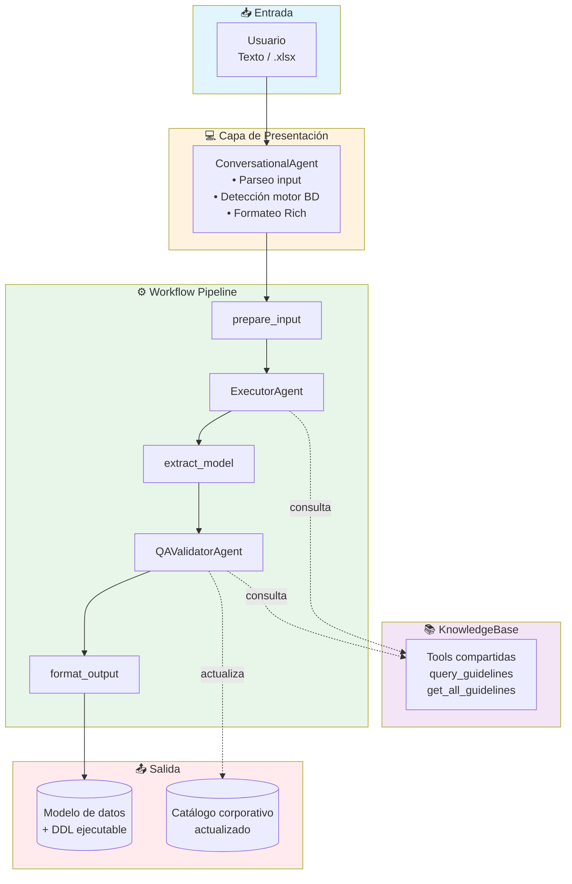

# 🏗️ Data Modeler Agent

Sistema multi-agente experto en modelamiento de datos construido con el **Microsoft Agent Framework** (Python 3.12). Genera modelos de datos profesionales, DDL ejecutable y reportes de calidad a partir de definiciones funcionales en lenguaje natural o archivos Excel.

> **Stack**: Microsoft Agent Framework · Azure AI Foundry · GPT-4o · Pydantic v2 · Rich CLI

---

## Características principales

- **Multi-agente**: pipeline orquestado con ExecutorAgent (generación) y QAValidatorAgent (validación).
- **5 motores de BD**: Databricks SQL, Cosmos DB, SQL Server, PostgreSQL, MySQL.
- **Gobierno de datos**: estandarización automática de nombres contra catálogo corporativo.
- **Input flexible**: texto libre, archivos `.xlsx` o combinación de ambos.
- **Lineamientos configurables**: naming conventions, tipos de dato, columnas de auditoría (JSON/XLSX/DOCX/PDF/TXT).
- **CLI multi-turno**: interfaz conversacional con Rich para refinamiento iterativo.

---

## Arquitectura



---

## Quick Start

```bash
# 1. Clonar y entrar al proyecto
cd agent-modeler

# 2. Crear entorno virtual (Python 3.12)
python3.12 -m venv .venv
source .venv/bin/activate

# 3. Instalar dependencias
pip install -r requirements.txt

# 4. Configurar credenciales
cp .env.example .env
# Editar .env con tus credenciales de Azure

# 5. Crear archivo de ejemplo (opcional)
python scripts/create_sample_xlsx.py

# 6. Ejecutar
python -m src.main
```

### Ejecutar API REST

```bash
# Iniciar servidor API (desarrollo)
uvicorn api.main:app --reload --host 0.0.0.0 --port 8000

# O ejecutar directamente
python api/main.py
```

Endpoints disponibles:
- `GET /health` — Health check
- `POST /model` — Generar modelo de datos
- `POST /parse-excel` — Parsear archivo Excel
- `GET /engines` — Listar motores soportados

### Usar script standalone chat.py

```bash
# Chat interactivo
python chat.py

# Solicitud única (no interactivo)
python chat.py -m "Crea tabla de productos con id, nombre, precio" -e postgresql
```

### Ejemplos de input

```
# Con archivo Excel
Modela las tablas del archivo data/sample_input.xlsx para databricks_sql

# Solo texto
Crea una tabla de productos con: id, nombre, precio, categoría, stock. Motor: postgresql

# Con relaciones
Crea tablas customers y orders. La tabla orders tiene FK hacia customers por customer_id. Motor: sqlserver
```

---

## Agentes y Tools

| Agente | Rol | Tools |
|--------|-----|-------|
| **ConversationalAgent** | Orquestador, UI multi-turno | `parse_excel_file` |
| **KnowledgeBaseAgent** | Lineamientos corporativos (como tools compartidas) | — |
| **ExecutorAgent** | Genera modelo de datos + DDL | `query_guidelines`, `get_all_guidelines` |
| **QAValidatorAgent** | Valida, estandariza, gobierno de datos | `search_column_catalog`, `add_column_to_catalog`, `get_full_column_catalog`, `query_guidelines` |

### Motores de BD soportados

| Motor | Dialecto | Características |
|-------|----------|-----------------|
| **databricks_sql** | Delta Lake SQL | `USING DELTA`, `STRING` en vez de `VARCHAR` |
| **cosmosdb** | NoSQL JSON | Container definition, partition key |
| **sqlserver** | T-SQL | `IDENTITY`, esquemas `[dbo]` |
| **postgresql** | PostgreSQL | `SERIAL`/`BIGSERIAL`, esquemas |
| **mysql** | MySQL | `AUTO_INCREMENT`, `ENGINE=InnoDB` |

---

## Estructura del proyecto

```
agent-modeler/
├── .env                              # Variables de entorno (no versionado)
├── .env.example                      # Template de configuración
├── requirements.txt                  # Dependencias Python
├── README.md
├── chat.py                           # �️ Script standalone para chat
├── api/                              # 🌐 API REST async
│   ├── __init__.py
│   └── main.py                       #   FastAPI endpoints
├── prompts/                          # 📝 System prompts (.prompty)
│   ├── executor.prompty
│   ├── qa_validator.prompty
│   └── conversational.prompty
├── doc/                              # 📚 Documentación detallada
│   ├── architecture.md
│   ├── agents.md
│   ├── tools.md
│   ├── workflow.md
│   ├── schemas.md
│   ├── configuration.md
│   └── usage.md
├── data/
│   ├── column_catalog.json
│   ├── sample_input.xlsx
│   └── guidelines/
│       └── modeling_guidelines.json
├── src/
│   ├── config.py
│   ├── schemas.py
│   ├── main.py
│   ├── tools/
│   │   ├── knowledge_base_tools.py
│   │   ├── excel_tools.py
│   │   └── catalog_tools.py
│   ├── agents/
│   │   ├── factory.py
│   │   └── instructions.py         # Carga prompts desde .prompty
│   └── workflow/
│       └── graph.py
└── scripts/
    ├── create_sample_xlsx.py
    └── test_pipeline_v2.py
```

---

## 📚 Documentación

| Documento | Descripción |
|-----------|-------------|
| [Arquitectura](doc/architecture.md) | Diseño del sistema, componentes, decisiones de arquitectura |
| [Agentes](doc/agents.md) | Roles, instrucciones, tools asignadas a cada agente |
| [Tools](doc/tools.md) | Referencia completa de cada tool con parámetros y ejemplos |
| [Workflow](doc/workflow.md) | Pipeline de modelamiento, flujo de datos, grafo dirigido |
| [Schemas](doc/schemas.md) | Modelos Pydantic: input, output, catálogo, QA report |
| [Configuración](doc/configuration.md) | Variables de entorno, credenciales Azure, rutas de datos |
| [Uso](doc/usage.md) | Guía de uso del CLI, ejemplos, comandos disponibles |

---

## Licencia

Proyecto interno — uso corporativo.
