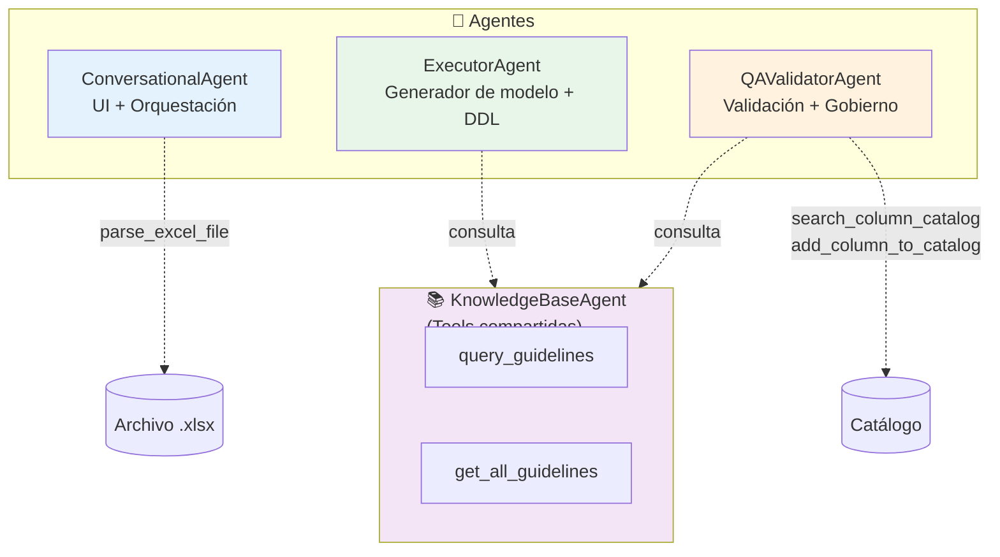
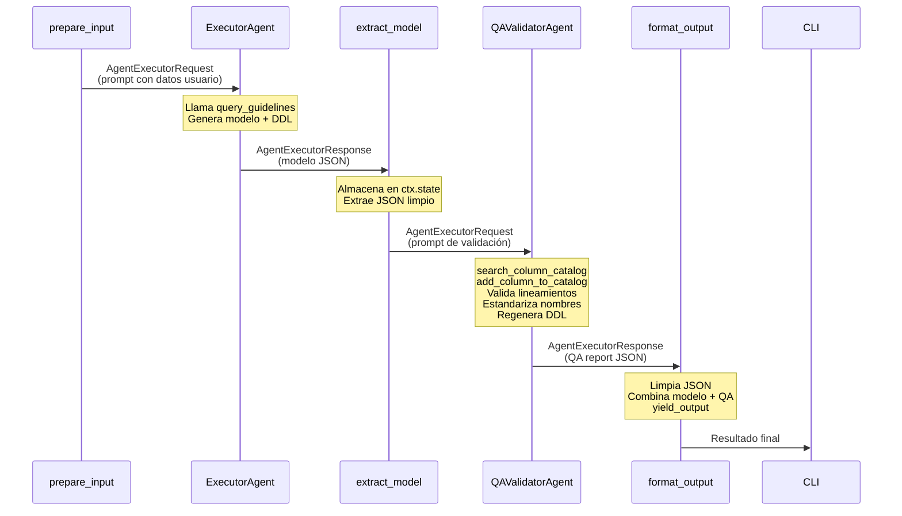

# Agentes del Sistema

## Visión general

El sistema cuenta con **4 agentes**, cada uno con un rol especializado. Tres de ellos son instancias de `Agent` del Microsoft Agent Framework; el cuarto (KnowledgeBaseAgent) se implementa como tools compartidas.



---

## 1. ConversationalAgent

**Archivo**: `src/agents/factory.py` → `create_conversational_agent()`

### Rol
Punto de contacto con el usuario. Maneja la conversación multi-turno, procesa archivos Excel y presenta resultados.

### Tools asignadas
| Tool | Descripción |
|------|-------------|
| `parse_excel_file` | Parsea archivos `.xlsx` extrayendo tablas y columnas |

### System prompt (resumen)
- Recibe solicitudes en lenguaje natural y/o archivos Excel.
- Presenta resultados de forma clara y profesional.
- Soporta refinamiento iterativo del modelo.
- Si el usuario no especifica motor, pregunta o usa el default.
- Siempre responde en español.

### Formato de presentación
1. Resumen ejecutivo del modelo
2. Tablas generadas con columnas y tipos
3. DDL por cada tabla
4. Reporte de QA
5. Diagrama de relaciones (textual)
6. Columnas nuevas agregadas al catálogo

---

## 2. ExecutorAgent

**Archivo**: `src/agents/factory.py` → `create_executor_agent()`

### Rol
Genera modelos de datos completos con DDL a partir de definiciones funcionales. Es el agente "generador" del pipeline.

### Tools asignadas
| Tool | Descripción |
|------|-------------|
| `query_guidelines` | Consulta lineamientos por tema específico |
| `get_all_guidelines` | Obtiene todos los lineamientos completos |
| `convert_to_markdown` | Convierte y procesa transparentemente lineamientos PDF o DOCX a texto estructurado (Markdown) |

### Proceso interno
1. **Recuperación de lineamientos**: llama OBLIGATORIAMENTE a `get_all_guidelines()`.
2. **Naming**: aplica prefijos y nomenclaturas dinámicas *estrictamente según lo consultado* de los lineamientos (ej., prefijos para entidades lógicas/físicas).
3. **Tipos de dato**: mapea el tipo sugerido funcional al dialecto del motor destino consultando la KB.
4. **Auditoría**: agrega columnas obligatorias (e.g. tipo `ts` para fechas de modificación o banderas logicas).  
5. **Fidelidad Estricta**: No se omite, une o borra NINGUNA columna del input del usuario.
6. **DDL**: genera SQL sintácticamente correcto para el motor.

### Formato de respuesta (JSON)
```json
{
  "tables": [
    {
      "table_name": "tbl_nombre",
      "columns": [
        {
          "column_name": "nombre_columna",
          "functional_definition": "descripción",
          "data_type": "TIPO_PARA_MOTOR",
          "is_nullable": true,
          "is_primary_key": false,
          "is_foreign_key": false,
          "fk_reference": null,
          "default_value": null,
          "constraints": []
        }
      ],
      "ddl": "CREATE TABLE ...",
      "notes": ""
    }
  ],
  "relationships": ["descripción de relaciones"],
  "engine": "motor_destino",
  "summary": "resumen del modelo"
}
```

### Dialectos SQL soportados

| Motor | Características DDL |
|-------|---------------------|
| `databricks_sql` | `USING DELTA`, `STRING` en vez de `VARCHAR`, sin `AUTO_INCREMENT` |
| `cosmosdb` | Container definition JSON, `partition key` |
| `sqlserver` | T-SQL, `IDENTITY(1,1)`, esquemas `[dbo]` |
| `postgresql` | `BIGSERIAL`, esquemas, `TIMESTAMP WITH TIME ZONE` |
| `mysql` | `AUTO_INCREMENT`, `ENGINE=InnoDB`, `DATETIME` |

---

## 3. QAValidatorAgent

**Archivo**: `src/agents/factory.py` → `create_qa_agent()`

### Rol
Valida el modelo generado contra lineamientos corporativos y catálogo de columnas. Aplica gobierno de datos estandarizando nombres y registrando columnas nuevas.

### Tools asignadas
| Tool | Descripción |
|------|-------------|
| `query_guidelines` | Consulta lineamientos para verificar cumplimiento |
| `search_column_catalog` | Busca columnas similares en el catálogo corporativo |
| `add_column_to_catalog` | Registra columnas nuevas en el catálogo |
| `get_full_column_catalog` | Obtiene el catálogo completo para validación integral |
| `convert_to_markdown` | Convierte lineamientos PDF o DOCX a Markdown para su lectura |

### Proceso de validación

#### A) Validación vs lineamientos
- Nombres en snake_case.
- Prefijos correctos según tipo semántico.
- Tipos de dato correctos para el motor.
- Presencia de columnas de auditoría.
- Presencia de clave primaria.
- Longitud de nombres dentro de límites (64 caracteres).

#### B) Estandarización de nombres y Jerarquía de Prioridad (crítico)
Para **cada columna** del modelo:
1. Llama a `search_column_catalog` con la definición funcional.
2. Jerarquía de resolución de conflictos:
   - **Prioridad 1**: Los lineamientos corporativos son la máxima autoridad. Si un nombre del catálogo contradice los lineamientos vigentes, se respetan los lineamientos.
   - **Prioridad 2**: Si hay un match del catálogo (similitud ≥ 0.5) y además CUMPLE los lineamientos, reemplaza con el nombre estandarizado encontrado en el catálogo.
3. Si no hay match (o no cumple) → acepta el nombre re-estructurado bajo las guías y llama a `add_column_to_catalog`.

#### C) Regenerar DDL
Si hubo correcciones de nombres, regenera el DDL completo con los nombres corregidos.

### Quality Score
Escala 0–100, compuesto por:
- **Cumplimiento de lineamientos**: 40%
- **Estandarización de nombres**: 40%
- **Completitud del modelo**: 20%

### Formato de respuesta (JSON)
```json
{
  "tables": [
    {
      "table_name": "tbl_nombre",
      "columns": ["... columnas corregidas ..."],
      "ddl": "DDL regenerado",
      "notes": ""
    }
  ],
  "qa_report": {
    "standardized_columns": [
      {
        "table_name": "tbl_x",
        "original_name": "nombre_original",
        "standardized_name": "nombre_corregido",
        "reason": "razón del cambio"
      }
    ],
    "guideline_violations": [
      {
        "table_name": "tbl_x",
        "column_name": "col_x",
        "violation": "descripción",
        "correction_applied": "corrección"
      }
    ],
    "new_catalog_entries": [
      {
        "column_name": "col_nueva",
        "functional_definition": "definición",
        "data_type": "TIPO",
        "table_name": "tbl_x"
      }
    ],
    "quality_score": 85,
    "summary": "Resumen del proceso de QA"
  }
}
```

---

## 4. KnowledgeBaseAgent (como Tools)

### Rol
Proporciona acceso a los lineamientos corporativos de modelamiento de datos. No es un agente independiente; sus funciones se exponen como tools que otros agentes invocan.

### Implementación
Definido en `src/tools/knowledge_base_tools.py`. Soporta múltiples formatos de fuente:

| Formato | Extensión | Método de carga |
|---------|-----------|-----------------|
| JSON | `.json` | `json.load()` — búsqueda por claves |
| Excel | `.xlsx` | `openpyxl` — cada pestaña como sección |
| Markdown | `.md` | Interpretación y búsqueda nativa de texto estructurado por el LLM |
| Word | `.docx` | Conversión a `.md` mediante `Docling` / `convert_to_markdown` |
| PDF | `.pdf` | Conversión a `.md` mediante `Docling` / `convert_to_markdown` |
| Texto | `.txt` | `Path.read_text()` — búsqueda por texto |

### Cache
Los lineamientos se cargan una sola vez y se mantienen en `_guidelines_cache` (variable global) para evitar I/O repetido.

### Tools expuestas
- **`query_guidelines(topic)`**: consulta por tema específico (e.g., `naming_conventions`, `audit_columns`, `databricks_sql`).
- **`get_all_guidelines()`**: retorna todos los lineamientos completos.

---

## Factoría de agentes

La función de creación de cada agente sigue un patrón consistente:

```python
def create_executor_agent(client: FoundryChatClient | None = None) -> Agent:
    if client is None:
        client = get_chat_client()
    return Agent(
        client=client,
        name="ExecutorAgent",
        instructions=EXECUTOR_AGENT_INSTRUCTIONS,
        tools=[query_guidelines, get_all_guidelines],
    )
```

Características:
- **Cliente compartido**: todos los agentes pueden compartir un mismo `FoundryChatClient`.
- **Cliente opcional**: si no se provee, la factoría crea uno nuevo.
- **Autenticación**: `ClientSecretCredential` con Service Principal de Azure.

---

## Interacción entre agentes

Los agentes **no se comunican directamente** entre sí. La comunicación ocurre a través del **workflow graph**:



El estado compartido (`WorkflowContext`) transporta `input_data`, `target_engine` y `generated_model` entre los nodos del grafo.
