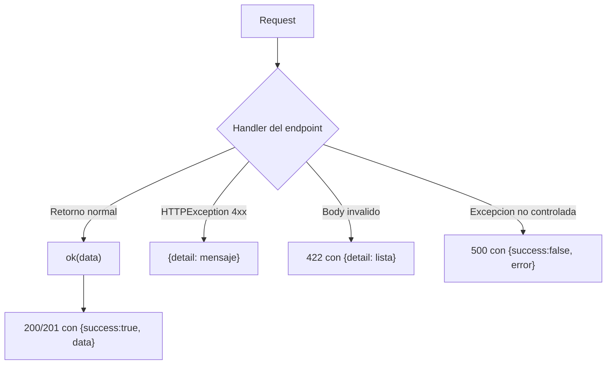
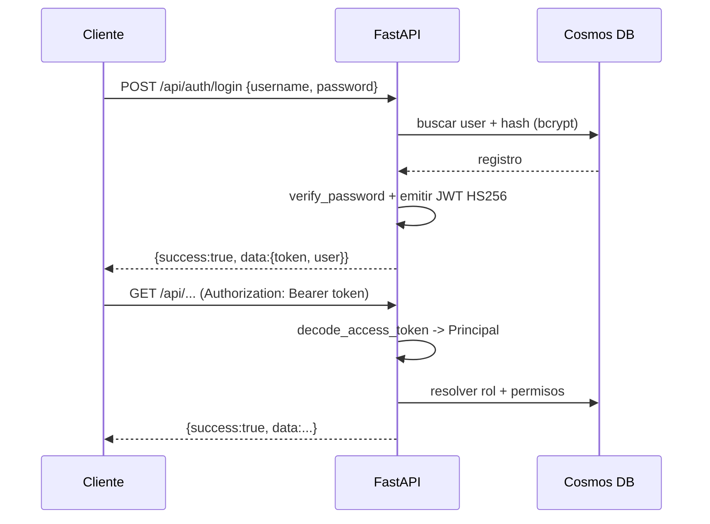
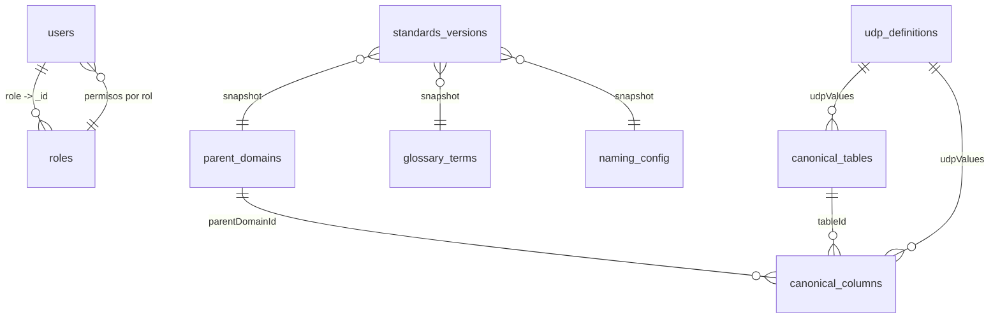
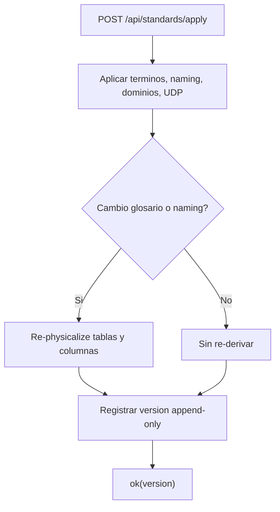
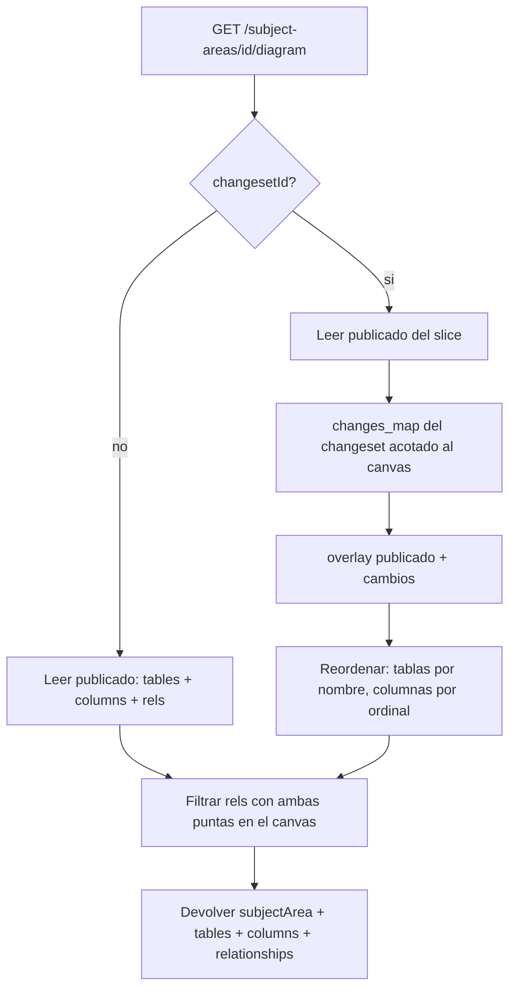
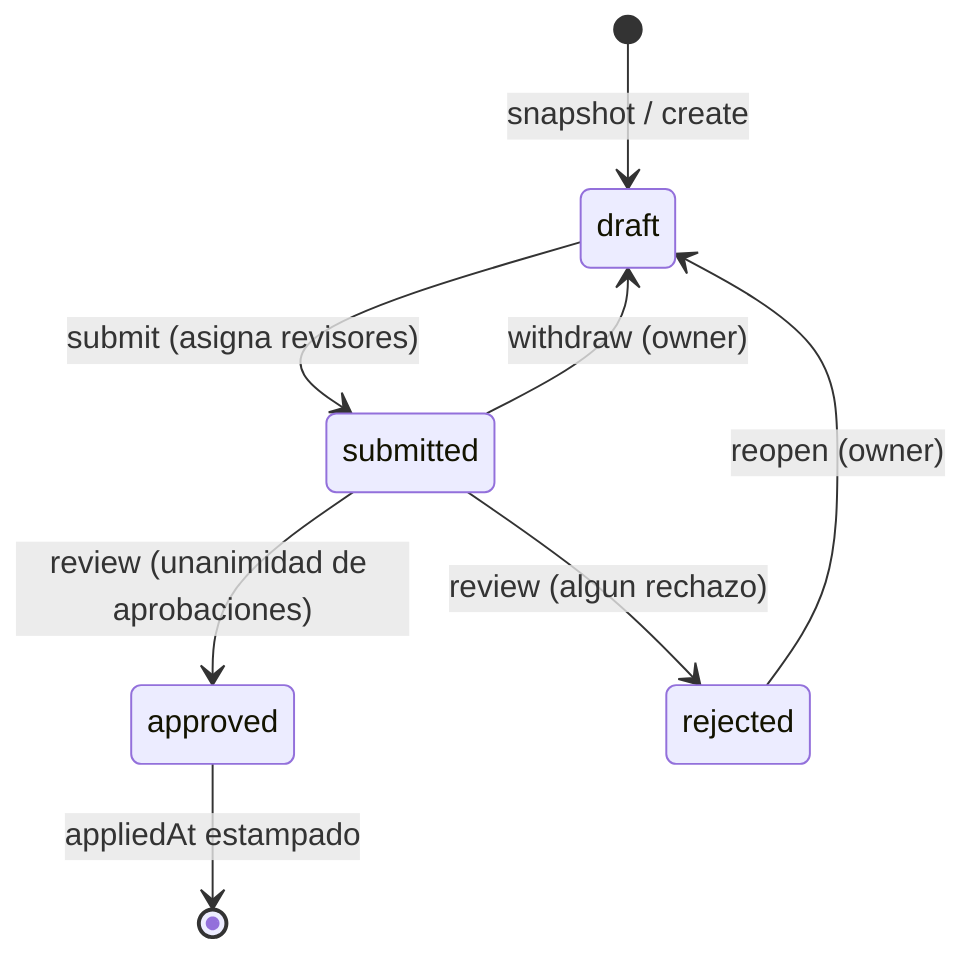
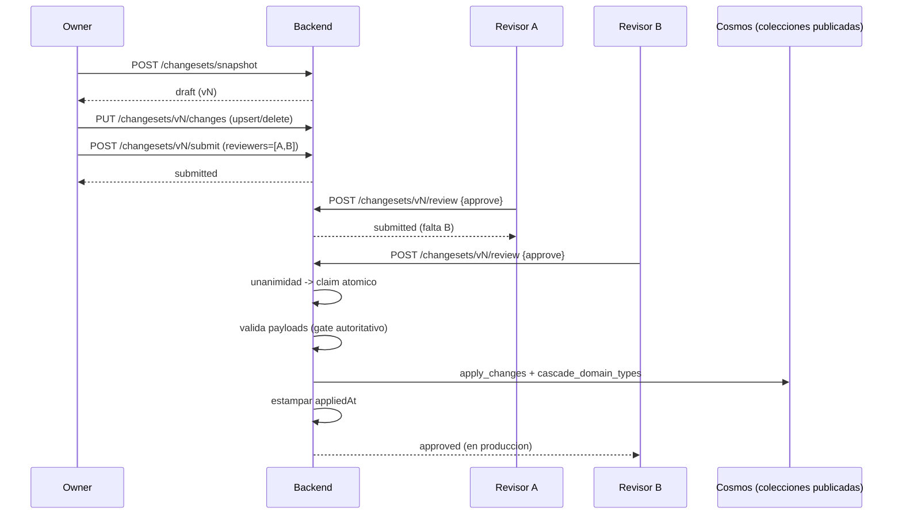
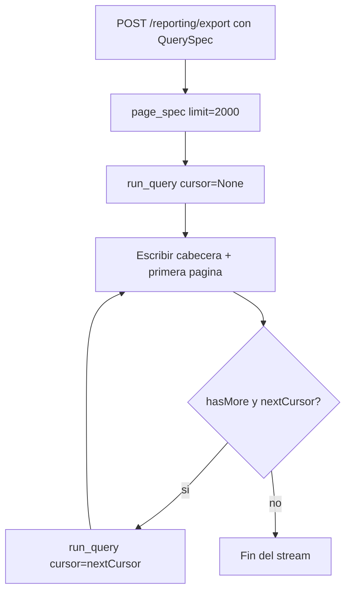
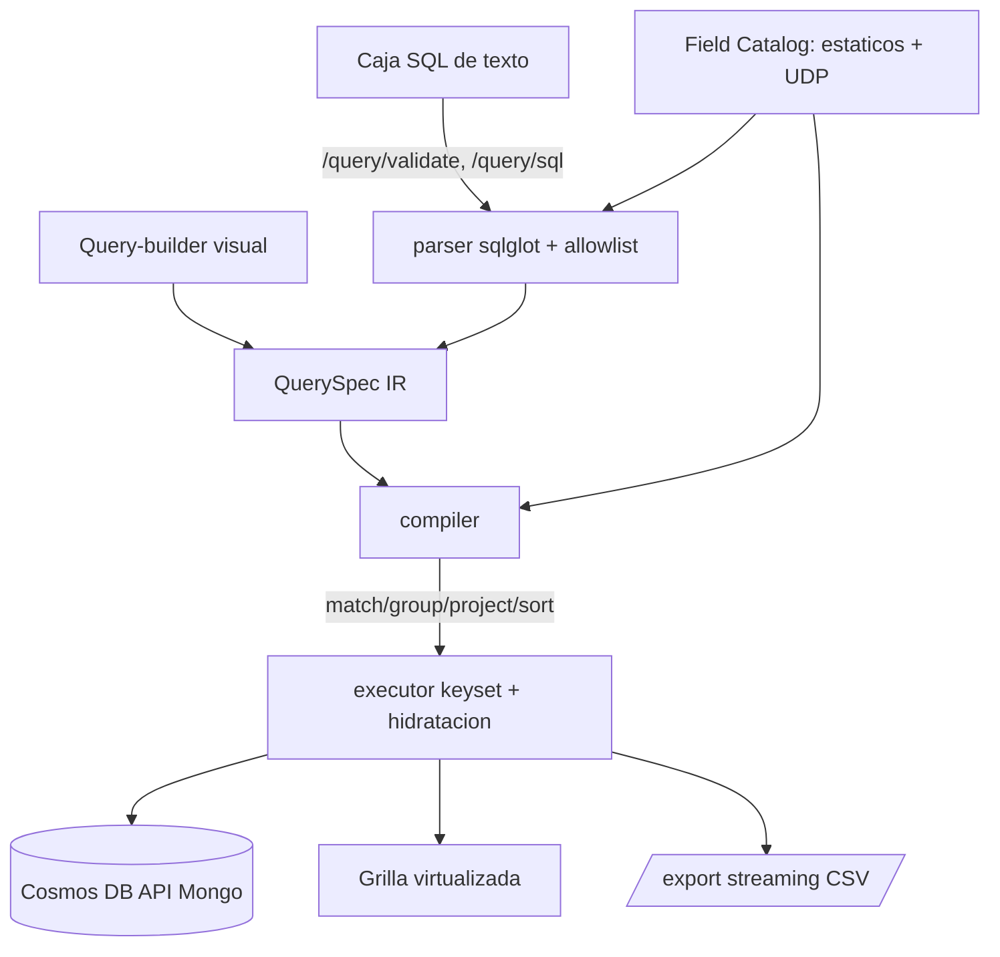

# Contrato de API — Data Model Hub Backend

Referencia completa de los endpoints de la API REST, dividida en dos partes por dominio. Todas las respuestas siguen el envelope estandar `{ "success": true, "data": ... }` o `{ "success": false, "error": "..." }`.

---

# Contrato de API — Parte 1

Auth, Admin, Identity, Catalog, Glossary, Domains, UDP, Data Standards y Settings del backend de plataforma (`backend-data-model-hub`, FastAPI + Motor sobre Azure Cosmos DB con API de Mongo).

Este documento describe, para cada endpoint del alcance de la Parte 1: propósito, método y ruta, parámetros/body con tipos, un ejemplo de invocación con `curl` y la respuesta esperada. Todo lo aquí documentado sale del código real de los routers, schemas, services y repositories de cada feature.

---

## 1. Convenciones generales

### 1.1 Envelope de respuesta

Todos los endpoints de éxito envuelven el resultado con el helper `ok()` (`app/core/api/envelope.py`):

```python
def ok(data: Any = None) -> dict[str, Any]:
    return {"success": True, "data": data}
```

Es decir, una respuesta correcta siempre tiene esta forma:

```json
{ "success": true, "data": <payload> }
```

donde `<payload>` puede ser un objeto, una lista, un valor escalar o `null`.

Los errores NO comparten una única forma; hay tres casos, según de dónde salgan:

| Origen del error | Status | Forma del cuerpo |
|---|---|---|
| Errores de negocio / autorización lanzados con `HTTPException` (401, 403, 404, 400, 429) | el status del caso | `{ "detail": "<mensaje>" }` |
| Validación del body por Pydantic/FastAPI | 422 | `{ "detail": [ { "loc": [...], "msg": "...", "type": "..." } ] }` |
| Excepción no controlada del servidor (Cosmos caído, doc inválido, etc.) | 500 | `{ "success": false, "error": "Error interno del servidor. Revisá los logs con el X-Request-ID." }` |

Solo el handler global de excepciones no controladas (`app/main.py`) produce el envelope de error `{ "success": false, "error": ... }`. Los `HTTPException` mantienen el formato estándar de FastAPI (`{ "detail": ... }`). El cliente debe considerar ambos.

Toda respuesta incluye el header `X-Request-ID` (12 hex) para correlacionar con los logs, más headers de seguridad (`X-Content-Type-Options: nosniff`, `X-Frame-Options: DENY`, `Referrer-Policy: no-referrer`, `Permissions-Policy`, y `Strict-Transport-Security` cuando la conexión es HTTPS).



### 1.2 Autenticación

La identidad sale de un token de sesión JWT (HS256) enviado en el header:

```
Authorization: Bearer <token>
```

El token se obtiene en `POST /api/auth/login`. Sus claims son `sub` (el username), `iat`, `exp`, más `email`, `name` y `role`. La vida por defecto es de 720 minutos (12 horas), configurable con `ACCESS_TOKEN_TTL_MIN`.

Resolución de la identidad por request (`app/core/identity/dependencies.py`):

- Si viene `Authorization: Bearer <token>` válido: la identidad sale de los claims.
- Si el token está presente pero es inválido o expiró: siempre 401 (no hay fallback; enviar una sesión rota es un intento de sesión, no un anónimo).
- Si NO viene token:
  - con `REQUIRE_AUTH=true` (postura de producción): 401 (login obligatorio);
  - con `REQUIRE_AUTH=false` (local/tests): se cae al seam de identidad (usuario fake local, o header `X-Dev-User` para actuar como otro usuario en desarrollo).



### 1.3 Modelo de permisos (RBAC)

Los permisos son data-driven: cada usuario tiene un rol y cada rol declara una matriz `permiso -> bool`. El catálogo de permisos (`app/features/auth/models.py`) es:

| Permiso | Significado |
|---|---|
| `model.view` | Ver modelo / Canvas |
| `model.edit` | Crear / editar tablas (working copy) |
| `review.decide` | Aprobar / rechazar solicitudes |
| `publish` | Publicar a producción |
| `export` | Exportar DDL / metadata |
| `standards.edit` | Editar Data Standards (Glossary, Parent Domains, UDP, naming) |
| `admin.manage` | Administrar usuarios y permisos |

Se aplican de dos maneras:

- `require_permission("<perm>")`: dependency por endpoint; exige el permiso siempre (403 si falta). Se usa en `admin`, en las escrituras de `glossary` y en `data_standards` (apply/rollback).
- `write_guard("<perm>")`: dependency a nivel de router que gatea por método: lecturas (GET/HEAD/OPTIONS) solo requieren sesión válida; escrituras (POST/PUT/PATCH/DELETE) exigen el permiso (403 si falta o el usuario está deshabilitado). Además audita la acción. Se usa en `catalog` (`model.edit`), `domains` (`standards.edit`) y `settings` (`standards.edit`).

Resumen de gating por router:

| Router | Gating |
|---|---|
| `auth` | login público; logout/me requieren sesión |
| `admin` | todos requieren `admin.manage` |
| `identity` | `/api/me` requiere sesión; `/api/users` abierto |
| `catalog` | `write_guard("model.edit")`: GET abierto a sesión, escrituras con permiso |
| `glossary` | GET/physicalize/logicalize abiertos; create/update/delete/rephysicalize requieren `standards.edit` |
| `domains` | `write_guard("standards.edit")`: GET e impact abiertos a sesión, escrituras con permiso |
| `udp` | `GET /api/udp` abierto |
| `data_standards` | snapshot/versions abiertos; apply/rollback requieren `standards.edit` |
| `settings` | `write_guard("standards.edit")`: GET abierto a sesión, PUT con permiso |

Nota: "abierto" significa que no exige un permiso puntual, pero igual pasa por la resolución de identidad global; con `REQUIRE_AUTH=true` sin token válido es 401 en cualquier ruta.

### 1.4 Rate limiting y lockout de login

`POST /api/auth/login` está limitado a 5 requests/minuto por IP (`slowapi`, estado en memoria por proceso). Al excederlo devuelve 429 con header `Retry-After`. El rate limiting solo se activa con `REQUIRE_AUTH=true` o `RATE_LIMIT_ENABLED=true` (en dev queda apagado para no frenar el desarrollo).

Además hay lockout de cuenta: tras 8 fallos de login consecutivos, la cuenta se bloquea 15 minutos (aunque las credenciales sean correctas). La verificación del hash se hace SIEMPRE (con un hash dummy si el usuario no existe) para no filtrar por timing qué usuarios existen.

### 1.5 Códigos de estado usados

| Status | Cuándo |
|---|---|
| 200 | Lectura o mutación correcta |
| 201 | Creación de recurso (POST de creación) |
| 400 | Regla de negocio violada (dejar el sistema sin admin, rol con usuarios, scope/case inválido) |
| 401 | Sin sesión válida (token ausente/inválido/expirado con `REQUIRE_AUTH`) |
| 403 | Sesión válida pero sin el permiso requerido |
| 404 | Recurso inexistente (usuario, rol, versión de estándares) |
| 422 | Body que no valida contra el schema |
| 429 | Rate limit del login excedido |
| 500 | Error interno no controlado |

---

## 2. Despliegue y entorno

### 2.1 Dónde corre

El backend es una app FastAPI (ASGI, servida con Uvicorn) pensada para correr en cualquiera de estos dos entornos gestionados:

- Azure App Service (plan Linux, contenedor o code deploy con Uvicorn/Gunicorn).
- Databricks Apps (detrás del proxy SSO de la plataforma).

No requiere infraestructura propia más allá de la base de datos y las variables de entorno. En despliegue multi-réplica conviene mover el rate limiting a un backend Redis (hoy el estado es en memoria por proceso, así que con varias réplicas el límite efectivo se multiplica).

### 2.2 Variables de entorno

| Variable | Propósito | Default |
|---|---|---|
| `COSMOS_CONNECTION_STRING` | Cadena de conexión a Azure Cosmos DB (API de Mongo) | `""` |
| `COSMOS_DATABASE` | Nombre de la base | `db_modeler` |
| `SECRET_KEY` | Clave HMAC para firmar el JWT de sesión (HS256). Obligatoria en producción | default inseguro de dev |
| `ACCESS_TOKEN_TTL_MIN` | Vida del token en minutos | `720` |
| `REQUIRE_AUTH` | `true` = login obligatorio (401 sin token); oculta `/docs`, `/redoc`, `/openapi.json` | `false` |
| `RATE_LIMIT_ENABLED` | Fuerza el rate limiting aunque `REQUIRE_AUTH` sea false | `false` |
| `AUTH_MODE` | `local` o `databricks` (seam de identidad de fallback) | `local` |
| `LOCAL_DEV_USER` / `LOCAL_DEV_USERNAME` / `LOCAL_DEV_DISPLAY_NAME` | Usuario fake del seam local | `dev@local` / `""` / `""` |
| `CORS_ORIGINS` | Allowlist de orígenes del frontend (coma-separada) | `http://localhost:3000,http://127.0.0.1:3000` |
| `ALLOWED_HOSTS` | Allowlist de hosts (TrustedHost) en producción | vacío (desactivado) |

Falla-cerrado importante: con `REQUIRE_AUTH=true` y `SECRET_KEY` en el default de desarrollo, la app NO arranca (`assert_secure_config`), porque con esa clave pública cualquiera forjaría un token de sesión admin.

### 2.3 Consideraciones de base de datos (Azure Cosmos DB, API de Mongo)

- Acceso async con Motor. La conexión se abre en el lifespan de la app y se cierra al parar.
- Colecciones tocadas por esta parte del contrato: `users`, `roles`, `audit_log`, `canonical_tables`, `canonical_columns`, `parent_domains`, `glossary_terms`, `udp_definitions`, `naming_config`, `standards_versions`.
- El `_id` es la clave natural en varias colecciones (`users._id == username`, `roles._id == role key`, `naming_config._id == scope`). Al serializar, el backend renombra `_id -> id` y descarta campos internos (`flgactive`, `deletedAt`, `updatedAt`, `createdAt`).
- Borrado lógico (soft-delete): las eliminaciones marcan `flgactive=false` en vez de borrar el documento; los listados filtran por `flgactive != false`.
- Los modelos se validan con `extra="ignore"`, por lo que campos no declarados en el modelo del documento se descartan al leer/escribir (relevante para entender por qué algún campo del body no aparece en la respuesta; ver Catalog).
- `.sort()` en Cosmos requiere índice sobre el campo ordenado (p. ej. `canonical_tables.physicalName` para la búsqueda con `limit`).
- `standards_versions` es append-only con `seq` monotónico e índice único en `seq` (reintento ante colisión concurrente).



---

## 3. Auth (`/api/auth`)

Prefijo del router: `/api/auth`.

### 3.1 POST /api/auth/login

Propósito: autenticar por usuario y contraseña; devuelve el token de sesión y el usuario enriquecido con rol y permisos. Público (sin token), pero limitado a 5/minuto por IP y con lockout de cuenta.

Body (`LoginBody`):

| Campo | Tipo | Requerido |
|---|---|---|
| `username` | string | sí |
| `password` | string | sí |

curl:

```bash
curl -s -X POST https://api.ejemplo.com/api/auth/login \
  -H "Content-Type: application/json" \
  -d '{"username": "ana", "password": "una-clave-segura"}'
```

Respuesta 200:

```json
{
  "success": true,
  "data": {
    "token": "eyJhbGciOiJIUzI1NiIsInR5cCI6IkpXVCJ9...",
    "user": {
      "username": "ana",
      "email": "ana@empresa.com",
      "name": "Ana Gomez",
      "role": "modelador",
      "roleName": "Modelador",
      "projectIds": [],
      "status": "active",
      "initials": "AG",
      "permissions": {
        "model.view": true,
        "model.edit": true,
        "review.decide": false,
        "publish": false,
        "export": true,
        "standards.edit": false,
        "admin.manage": false
      },
      "accessLevel": "edit"
    }
  }
}
```

`accessLevel` es derivado: `full` si tiene `admin.manage`; `edit` si tiene `model.edit`, `standards.edit` o `publish`; `read` en caso contrario.

Error 401 (credenciales incorrectas, cuenta deshabilitada o bloqueada):

```json
{ "detail": "Usuario o contraseña incorrectos." }
```

Error 429 (rate limit): cuerpo del handler de slowapi + header `Retry-After`.

### 3.2 POST /api/auth/logout

Propósito: cerrar sesión (registra el evento en auditoría). Requiere sesión válida. El token es stateless: la invalidación real es del lado del cliente (descartar el token); este endpoint solo audita.

Body: ninguno.

curl:

```bash
curl -s -X POST https://api.ejemplo.com/api/auth/logout \
  -H "Authorization: Bearer $TOKEN"
```

Respuesta 200:

```json
{ "success": true, "data": { "ok": true } }
```

### 3.3 GET /api/auth/me

Propósito: devolver el usuario en sesión enriquecido con rol y permisos efectivos (lo usa el frontend para el gating de UI). Requiere sesión válida. Si el actor en el token no está registrado en `users` (seam de dev), degrada al `Principal` básico.

Parámetros: ninguno.

curl:

```bash
curl -s https://api.ejemplo.com/api/auth/me \
  -H "Authorization: Bearer $TOKEN"
```

Respuesta 200 (usuario registrado): misma forma que `user` en el login.

```json
{
  "success": true,
  "data": {
    "username": "ana",
    "email": "ana@empresa.com",
    "name": "Ana Gomez",
    "role": "modelador",
    "roleName": "Modelador",
    "projectIds": [],
    "status": "active",
    "initials": "AG",
    "permissions": { "model.view": true, "model.edit": true, "review.decide": false, "publish": false, "export": true, "standards.edit": false, "admin.manage": false },
    "accessLevel": "edit"
  }
}
```

Respuesta 200 (actor no registrado, seam de dev): degrada al `Principal`.

```json
{
  "success": true,
  "data": { "email": "dev@local", "username": "dev", "display_name": "dev", "source": "local" }
}
```

---

## 4. Admin (`/api/admin`)

Prefijo del router: `/api/admin`. TODOS los endpoints requieren el permiso `admin.manage` (403 si falta).

Modelo de datos:

- Usuario (respuesta, sin `passwordHash`): `{ id, email, name, role, projectIds, status, initials }`. `status` es uno de `active | invited | disabled`.
- Rol: `{ id, name, description, permissions }`, donde `permissions` es un mapa `permiso -> bool` filtrado al catálogo conocido.

Guards de negocio (todos devuelven 400 con mensaje legible):

- No dejar el sistema sin ningún administrador activo (al cambiar rol/estado, borrar usuario o quitar `admin.manage` de un rol).
- No borrar un rol que tiene usuarios asignados.

### 4.1 GET /api/admin/users

Propósito: listar los usuarios (ordenados por nombre). Sin `passwordHash`.

curl:

```bash
curl -s https://api.ejemplo.com/api/admin/users \
  -H "Authorization: Bearer $ADMIN_TOKEN"
```

Respuesta 200:

```json
{
  "success": true,
  "data": [
    { "id": "ana", "email": "ana@empresa.com", "name": "Ana Gomez", "role": "modelador", "projectIds": [], "status": "active", "initials": "AG" },
    { "id": "beto", "email": "beto@empresa.com", "name": "Beto Diaz", "role": "revisor", "projectIds": ["p1"], "status": "active", "initials": "BD" }
  ]
}
```

### 4.2 POST /api/admin/users

Propósito: crear (o upsertear por username) un usuario. La contraseña se hashea con bcrypt; se computan las iniciales a partir del nombre.

Body (`UserCreate`):

| Campo | Tipo | Requerido | Notas |
|---|---|---|---|
| `username` | string | sí | clave (`_id`) |
| `email` | string | sí | |
| `name` | string | sí | |
| `role` | string | sí | key de un rol existente |
| `password` | string | sí | 10 a 128 caracteres |
| `projectIds` | string[] | no | default `[]` (vacío = todos) |
| `status` | string | no | default `active` |

curl:

```bash
curl -s -X POST https://api.ejemplo.com/api/admin/users \
  -H "Authorization: Bearer $ADMIN_TOKEN" \
  -H "Content-Type: application/json" \
  -d '{"username":"carla","email":"carla@empresa.com","name":"Carla Ruiz","role":"lector","password":"clave-larga-1"}'
```

Respuesta 201:

```json
{
  "success": true,
  "data": { "id": "carla", "email": "carla@empresa.com", "name": "Carla Ruiz", "role": "lector", "projectIds": [], "status": "active", "initials": "CR" }
}
```

### 4.3 PUT /api/admin/users/{username}

Propósito: actualizar un usuario. Todos los campos son opcionales; solo se aplican los enviados. `password` opcional (reset por el admin).

Path: `username` (string).

Body (`UserUpdate`, todos opcionales):

| Campo | Tipo | Notas |
|---|---|---|
| `email` | string | |
| `name` | string | recomputa iniciales |
| `role` | string | key de rol |
| `projectIds` | string[] | |
| `status` | string | `active | invited | disabled` |
| `password` | string | 10 a 128 si se envía |

curl:

```bash
curl -s -X PUT https://api.ejemplo.com/api/admin/users/carla \
  -H "Authorization: Bearer $ADMIN_TOKEN" \
  -H "Content-Type: application/json" \
  -d '{"role":"modelador","status":"active"}'
```

Respuesta 200: el usuario actualizado (misma forma que arriba).

```json
{
  "success": true,
  "data": { "id": "carla", "email": "carla@empresa.com", "name": "Carla Ruiz", "role": "modelador", "projectIds": [], "status": "active", "initials": "CR" }
}
```

Errores: 404 `{ "detail": "Usuario no encontrado." }`; 400 `{ "detail": "Ese cambio dejaría el sistema sin ningún administrador." }`.

### 4.4 DELETE /api/admin/users/{username}

Propósito: eliminar (soft-delete) un usuario. No permite borrar al último administrador.

Path: `username` (string).

curl:

```bash
curl -s -X DELETE https://api.ejemplo.com/api/admin/users/carla \
  -H "Authorization: Bearer $ADMIN_TOKEN"
```

Respuesta 200:

```json
{ "success": true, "data": { "id": "carla" } }
```

Errores: 404 `{ "detail": "Usuario no encontrado." }`; 400 `{ "detail": "No podés eliminar al último administrador del sistema." }`.

### 4.5 GET /api/admin/roles

Propósito: listar los roles con su matriz de permisos (ordenados por nombre).

curl:

```bash
curl -s https://api.ejemplo.com/api/admin/roles \
  -H "Authorization: Bearer $ADMIN_TOKEN"
```

Respuesta 200:

```json
{
  "success": true,
  "data": [
    {
      "id": "administrador",
      "name": "Administrador",
      "description": "Acceso total",
      "permissions": { "model.view": true, "model.edit": true, "review.decide": true, "publish": true, "export": true, "standards.edit": true, "admin.manage": true }
    },
    {
      "id": "lector",
      "name": "Lector",
      "description": "Solo lectura",
      "permissions": { "model.view": true, "model.edit": false, "review.decide": false, "publish": false, "export": false, "standards.edit": false, "admin.manage": false }
    }
  ]
}
```

### 4.6 PUT /api/admin/roles/{key}

Propósito: crear o actualizar (upsert) un rol y su matriz. Los permisos se sanean al catálogo conocido (keys desconocidas se descartan; valores coaccionados a bool). No permite un cambio que deje el sistema sin administrador.

Path: `key` (string) = slug estable del rol (`_id`).

Body (`RoleBody`):

| Campo | Tipo | Requerido |
|---|---|---|
| `name` | string | sí |
| `description` | string | no |
| `permissions` | objeto `{ [perm]: bool }` | no (default `{}`) |

curl:

```bash
curl -s -X PUT https://api.ejemplo.com/api/admin/roles/revisor \
  -H "Authorization: Bearer $ADMIN_TOKEN" \
  -H "Content-Type: application/json" \
  -d '{"name":"Revisor","description":"Aprueba solicitudes","permissions":{"model.view":true,"review.decide":true}}'
```

Respuesta 200:

```json
{
  "success": true,
  "data": {
    "id": "revisor",
    "name": "Revisor",
    "description": "Aprueba solicitudes",
    "permissions": { "model.view": true, "model.edit": false, "review.decide": true, "publish": false, "export": false, "standards.edit": false, "admin.manage": false }
  }
}
```

Error 400: `{ "detail": "Ese cambio en la matriz dejaría el sistema sin administrador." }`.

### 4.7 DELETE /api/admin/roles/{key}

Propósito: eliminar (soft-delete) un rol. No permite borrar un rol con usuarios asignados.

Path: `key` (string).

curl:

```bash
curl -s -X DELETE https://api.ejemplo.com/api/admin/roles/revisor \
  -H "Authorization: Bearer $ADMIN_TOKEN"
```

Respuesta 200:

```json
{ "success": true, "data": { "id": "revisor" } }
```

Errores: 404 `{ "detail": "Rol no encontrado." }`; 400 `{ "detail": "El rol tiene 3 usuario(s) asignado(s). Reasignalos antes de eliminarlo." }`.

### 4.8 GET /api/admin/permissions

Propósito: devolver el catálogo de permisos (columnas/filas de la matriz).

curl:

```bash
curl -s https://api.ejemplo.com/api/admin/permissions \
  -H "Authorization: Bearer $ADMIN_TOKEN"
```

Respuesta 200:

```json
{
  "success": true,
  "data": ["model.view", "model.edit", "review.decide", "publish", "export", "standards.edit", "admin.manage"]
}
```

### 4.9 GET /api/admin/audit

Propósito: leer el log de auditoría (más reciente primero).

Query params:

| Param | Tipo | Default | Rango |
|---|---|---|---|
| `limit` | int | 200 | 1 a 1000 |

curl:

```bash
curl -s "https://api.ejemplo.com/api/admin/audit?limit=50" \
  -H "Authorization: Bearer $ADMIN_TOKEN"
```

Respuesta 200 (cada entrada: `{ id, at, actor, action, target?, targetType?, meta? }`):

```json
{
  "success": true,
  "data": [
    { "id": "665f...", "at": "2026-07-06T14:03:11.220000+00:00", "actor": "ana", "action": "login" },
    { "id": "665e...", "at": "2026-07-06T13:59:02.010000+00:00", "actor": "root", "action": "admin.user.update", "target": "carla", "targetType": "user", "meta": { "changes": { "role": { "from": "lector", "to": "modelador" } }, "fields": ["email"], "passwordChanged": false } }
  ]
}
```

---

## 5. Identity (`/api`)

Prefijo del router: `/api`. Este router expone la identidad cruda del seam (distinto de `/api/auth/me`, que enriquece con rol y permisos).

### 5.1 GET /api/me

Propósito: devolver el `Principal` actual, resuelto por el seam según `AUTH_MODE`/token. Requiere sesión válida (con `REQUIRE_AUTH=true` sin token es 401). No enriquece con permisos.

curl:

```bash
curl -s https://api.ejemplo.com/api/me \
  -H "Authorization: Bearer $TOKEN"
```

Respuesta 200 (`Principal`: `{ email, username, display_name, source }`; `source` es `local | databricks | session`):

```json
{
  "success": true,
  "data": { "email": "ana@empresa.com", "username": "ana", "display_name": "Ana Gomez", "source": "session" }
}
```

### 5.2 GET /api/users

Propósito: lista fija de usuarios simulados (`{ id, name, initials }`) para el switch de actor y la asignación de revisores en modo local. Endpoint abierto (sin dependencia de auth).

curl:

```bash
curl -s https://api.ejemplo.com/api/users
```

Respuesta 200:

```json
{
  "success": true,
  "data": [
    { "id": "ana", "name": "Ana Gomez", "initials": "AG" },
    { "id": "beto", "name": "Beto Diaz", "initials": "BD" },
    { "id": "carla", "name": "Carla Ruiz", "initials": "CR" },
    { "id": "qa", "name": "QA Tester", "initials": "QT" },
    { "id": "mr", "name": "Model Reviewer", "initials": "MR" }
  ]
}
```

---

## 6. Catalog (`/api/catalog`)

Prefijo del router: `/api/catalog`. Router con `write_guard("model.edit")`: las lecturas requieren sesión; las escrituras requieren `model.edit`.

Es el pool canónico universal: tablas (`canonical_tables`) y columnas (`canonical_columns`, colección separada).

Forma de una tabla canónica en respuesta (`CanonicalTableDoc`, serializado con alias): `{ id, physicalName, logicalName, schema, udpValues }`. El campo `schema` es el alias de `sql_schema`. Nota: el body de creación acepta `description`, pero el modelo del documento no lo declara, por lo que `extra="ignore"` lo descarta y no aparece en la respuesta ni se persiste.

Forma de una columna canónica en respuesta (`CanonicalColumnDoc`): `{ id, tableId, physicalName, logicalName, parentDomainId, dataType, typeOverridden, isPrimaryKey, isForeignKey, isNullable, isPartition, description, ordinal, udpValues }`.

### 6.1 GET /api/catalog/tables

Propósito: listar el pool de tablas. Con `q`+`limit` hace búsqueda server-side (para los modales de catálogo a gran escala); sin parámetros, la lista completa.

Query params:

| Param | Tipo | Default | Notas |
|---|---|---|---|
| `q` | string | null | búsqueda por nombre físico/lógico (contains, case-insensitive) |
| `limit` | int | null | 1 a 500; capea el resultado y ordena por `physicalName` |

curl:

```bash
curl -s "https://api.ejemplo.com/api/catalog/tables?q=cliente&limit=20" \
  -H "Authorization: Bearer $TOKEN"
```

Respuesta 200:

```json
{
  "success": true,
  "data": [
    { "id": "t-001", "physicalName": "DIM_CLIENTE", "logicalName": "Dimension Cliente", "schema": "ventas", "udpValues": { "udp-clasif": "DAC" } },
    { "id": "t-002", "physicalName": "FACT_CLIENTE_SALDO", "logicalName": "Cliente Saldo", "schema": null, "udpValues": {} }
  ]
}
```

### 6.2 POST /api/catalog/tables

Propósito: crear una tabla canónica. Requiere `model.edit`. Si no se envía `physicalName`, se deriva del `logicalName` con el motor de naming (glosario + naming_config del scope `column`, ver Glossary/Settings).

Body (`CanonicalTableBody`):

| Campo | Tipo | Requerido | Notas |
|---|---|---|---|
| `logicalName` | string | sí | |
| `physicalName` | string | no | si falta, se deriva |
| `schema` | string | no | alias de `sql_schema` |
| `description` | string | no | aceptado pero no persistido (ver arriba) |
| `udpValues` | objeto `{ [udpDefId]: string }` | no | etiquetas UDP asignadas |

curl:

```bash
curl -s -X POST https://api.ejemplo.com/api/catalog/tables \
  -H "Authorization: Bearer $TOKEN" \
  -H "Content-Type: application/json" \
  -d '{"logicalName":"Dimension Producto","schema":"ventas","udpValues":{"udp-clasif":"NO DAC"}}'
```

Respuesta 201:

```json
{
  "success": true,
  "data": { "id": "b1e2...", "physicalName": "DIM_PRODUCTO", "logicalName": "Dimension Producto", "schema": "ventas", "udpValues": { "udp-clasif": "NO DAC" } }
}
```

### 6.3 GET /api/catalog/tables/{table_id}/columns

Propósito: listar las columnas de una tabla canónica (ordenadas por `ordinal`).

Path: `table_id` (string).

curl:

```bash
curl -s https://api.ejemplo.com/api/catalog/tables/t-001/columns \
  -H "Authorization: Bearer $TOKEN"
```

Respuesta 200:

```json
{
  "success": true,
  "data": [
    { "id": "c-01", "tableId": "t-001", "physicalName": "CLIENTE_ID", "logicalName": "Cliente Identificador", "parentDomainId": "dom-id", "dataType": "BIGINT", "typeOverridden": false, "isPrimaryKey": true, "isForeignKey": null, "isNullable": false, "isPartition": false, "description": "Clave del cliente", "ordinal": 0, "udpValues": {} },
    { "id": "c-02", "tableId": "t-001", "physicalName": "CLIENTE_NOMBRE", "logicalName": "Cliente Nombre", "parentDomainId": "dom-nombre", "dataType": "VARCHAR(120)", "typeOverridden": true, "isPrimaryKey": null, "isForeignKey": null, "isNullable": true, "isPartition": false, "description": null, "ordinal": 1, "udpValues": { "udp-pii": "true" } }
  ]
}
```

### 6.4 POST /api/catalog/tables/{table_id}/columns

Propósito: crear una columna canónica en la tabla. Requiere `model.edit`. Deriva `physicalName` del `logicalName` si no se envía, y resuelve `dataType`: si se manda `dataType`, gana como override manual (marca `typeOverridden=true`); si no, hereda el `defaultDataType` del dominio (`parentDomainId`).

Path: `table_id` (string).

Body (`CanonicalColumnBody`):

| Campo | Tipo | Requerido | Default |
|---|---|---|---|
| `logicalName` | string | sí | |
| `physicalName` | string | no | derivado |
| `parentDomainId` | string | no | null |
| `dataType` | string | no | heredado del dominio si falta |
| `isPrimaryKey` | bool | no | null |
| `isForeignKey` | bool | no | null |
| `isNullable` | bool | no | true |
| `isPartition` | bool | no | false |
| `description` | string | no | null |
| `ordinal` | int | no | 0 |
| `udpValues` | objeto `{ [udpDefId]: string }` | no | `{}` |

curl:

```bash
curl -s -X POST https://api.ejemplo.com/api/catalog/tables/t-001/columns \
  -H "Authorization: Bearer $TOKEN" \
  -H "Content-Type: application/json" \
  -d '{"logicalName":"Cliente Fecha Alta","parentDomainId":"dom-fecha","isNullable":false,"ordinal":2}'
```

Respuesta 201 (dataType heredado del dominio `dom-fecha`):

```json
{
  "success": true,
  "data": { "id": "c-03", "tableId": "t-001", "physicalName": "CLIENTE_FEC_ALTA", "logicalName": "Cliente Fecha Alta", "parentDomainId": "dom-fecha", "dataType": "DATE", "typeOverridden": false, "isPrimaryKey": null, "isForeignKey": null, "isNullable": false, "isPartition": false, "description": null, "ordinal": 2, "udpValues": {} }
}
```

---

## 7. Glossary (`/api/glossary`)

Prefijo del router: `/api/glossary`. Diccionario de abreviaturas (términos que cascadean nombres físicos) más conversión lógico/físico. Editar términos es editar estándares, así que las mutaciones requieren `standards.edit`; los endpoints de cómputo (`physicalize`/`logicalize`) y el `GET` quedan abiertos (los usa el modelador para previsualizar sin mutar).

Forma de un término (`AbbreviationDoc`): `{ id, term, abbrev, scope, wordType }`. `scope` es `column | table`; `wordType` es `prime | class | modifier` o `null`.

### 7.1 GET /api/glossary

Propósito: listar términos. Sin `scope` = todos; con `scope`, solo ese.

Query params:

| Param | Tipo | Default |
|---|---|---|
| `scope` | string (`column | table`) | null (todos) |

curl:

```bash
curl -s "https://api.ejemplo.com/api/glossary?scope=column"
```

Respuesta 200:

```json
{
  "success": true,
  "data": [
    { "id": "g-01", "term": "Identificador", "abbrev": "ID", "scope": "column", "wordType": "class" },
    { "id": "g-02", "term": "Cliente", "abbrev": "CLI", "scope": "column", "wordType": "prime" }
  ]
}
```

### 7.2 POST /api/glossary

Propósito: crear un término. Requiere `standards.edit`.

Body (`AbbreviationBody`):

| Campo | Tipo | Requerido | Default |
|---|---|---|---|
| `term` | string | sí | |
| `abbrev` | string | sí | |
| `scope` | string | no | `column` |
| `wordType` | string | no | null |

curl:

```bash
curl -s -X POST https://api.ejemplo.com/api/glossary \
  -H "Authorization: Bearer $STD_TOKEN" \
  -H "Content-Type: application/json" \
  -d '{"term":"Producto","abbrev":"PROD","scope":"column","wordType":"prime"}'
```

Respuesta 201:

```json
{ "success": true, "data": { "id": "g-03", "term": "Producto", "abbrev": "PROD", "scope": "column", "wordType": "prime" } }
```

### 7.3 PUT /api/glossary/{entry_id}

Propósito: actualizar un término. Requiere `standards.edit`. Si el término no existe, devuelve `data: null` (no lanza 404).

Path: `entry_id` (string). Body: `AbbreviationBody` (igual que en la creación).

curl:

```bash
curl -s -X PUT https://api.ejemplo.com/api/glossary/g-03 \
  -H "Authorization: Bearer $STD_TOKEN" \
  -H "Content-Type: application/json" \
  -d '{"term":"Producto","abbrev":"PRD","scope":"column","wordType":"prime"}'
```

Respuesta 200:

```json
{ "success": true, "data": { "id": "g-03", "term": "Producto", "abbrev": "PRD", "scope": "column", "wordType": "prime" } }
```

### 7.4 DELETE /api/glossary/{entry_id}

Propósito: eliminar (soft-delete) un término. Requiere `standards.edit`. Devuelve un bool.

Path: `entry_id` (string).

curl:

```bash
curl -s -X DELETE https://api.ejemplo.com/api/glossary/g-03 \
  -H "Authorization: Bearer $STD_TOKEN"
```

Respuesta 200:

```json
{ "success": true, "data": true }
```

### 7.5 POST /api/glossary/physicalize

Propósito: derivar el nombre físico de un nombre lógico, aplicando el glosario y las reglas de naming del scope. Abierto (no muta).

Body (`PhysicalizeBody`):

| Campo | Tipo | Requerido | Notas |
|---|---|---|---|
| `logical` | string | sí | nombre lógico a convertir |
| `scope` | string | no | `column | table`; default `column` |
| `separator` | string | no | override ad-hoc del separador (gana sobre `naming_config`) |

curl:

```bash
curl -s -X POST https://api.ejemplo.com/api/glossary/physicalize \
  -H "Content-Type: application/json" \
  -d '{"logical":"Cliente Identificador","scope":"column"}'
```

Respuesta 200:

```json
{ "success": true, "data": { "physical": "CLI_ID" } }
```

### 7.6 POST /api/glossary/logicalize

Propósito: operación inversa (físico a lógico) usando el diccionario completo. Abierto.

Body (`LogicalizeBody`):

| Campo | Tipo | Requerido |
|---|---|---|
| `physical` | string | sí |

curl:

```bash
curl -s -X POST https://api.ejemplo.com/api/glossary/logicalize \
  -H "Content-Type: application/json" \
  -d '{"physical":"CLI_ID"}'
```

Respuesta 200:

```json
{ "success": true, "data": { "logical": "Cliente Identificador" } }
```

### 7.7 POST /api/glossary/rephysicalize

Propósito: re-physicalize retroactivo. Recomputa el `physicalName` de TODAS las entidades del scope a partir de su `logicalName` (glosario + naming actual). Requiere `standards.edit`. Update directo sobre las colecciones publicadas. Sin `scope`, aplica a tablas y columnas.

Body (`RephysicalizeBody`):

| Campo | Tipo | Requerido | Notas |
|---|---|---|---|
| `scope` | string | no | `table | column`; sin scope = ambos |

curl:

```bash
curl -s -X POST https://api.ejemplo.com/api/glossary/rephysicalize \
  -H "Authorization: Bearer $STD_TOKEN" \
  -H "Content-Type: application/json" \
  -d '{}'
```

Respuesta 200:

```json
{ "success": true, "data": { "updated": { "tables": 12, "columns": 340 } } }
```

---

## 8. Domains (`/api/domains`)

Prefijo del router: `/api/domains`. Router con `write_guard("standards.edit")`: lecturas (incluida `impact`) requieren sesión; escrituras (crear/editar/borrar/propagate) requieren `standards.edit`.

Los Parent Domains definen un `defaultDataType` que cascadea a las columnas que los usan (respetando overrides manuales).

Forma de un dominio (`ParentDomainDoc`): `{ id, name, defaultDataType, namingTerm, description }`.

### 8.1 GET /api/domains

Propósito: listar los Parent Domains (ordenados por nombre).

curl:

```bash
curl -s https://api.ejemplo.com/api/domains \
  -H "Authorization: Bearer $TOKEN"
```

Respuesta 200:

```json
{
  "success": true,
  "data": [
    { "id": "dom-id", "name": "Identificador", "defaultDataType": "BIGINT", "namingTerm": "ID", "description": "Claves numéricas" },
    { "id": "dom-fecha", "name": "Fecha", "defaultDataType": "DATE", "namingTerm": "FEC", "description": null }
  ]
}
```

### 8.2 POST /api/domains

Propósito: crear un dominio. Requiere `standards.edit`.

Body (`ParentDomainBody`):

| Campo | Tipo | Requerido |
|---|---|---|
| `name` | string | sí |
| `defaultDataType` | string | sí |
| `namingTerm` | string | no |
| `description` | string | no |

curl:

```bash
curl -s -X POST https://api.ejemplo.com/api/domains \
  -H "Authorization: Bearer $STD_TOKEN" \
  -H "Content-Type: application/json" \
  -d '{"name":"Monto","defaultDataType":"DECIMAL(18,2)","namingTerm":"MTO"}'
```

Respuesta 201:

```json
{ "success": true, "data": { "id": "d3f0...", "name": "Monto", "defaultDataType": "DECIMAL(18,2)", "namingTerm": "MTO", "description": null } }
```

### 8.3 PUT /api/domains/{domain_id}

Propósito: actualizar un dominio. Requiere `standards.edit`. Si cambia `defaultDataType`, cascadea el tipo nuevo a las columnas que aún tienen el tipo viejo y no fueron editadas a mano (`typeOverridden != true`). Si el dominio no existe, devuelve `data: null`.

Path: `domain_id` (string). Body: `ParentDomainBody`.

curl:

```bash
curl -s -X PUT https://api.ejemplo.com/api/domains/dom-fecha \
  -H "Authorization: Bearer $STD_TOKEN" \
  -H "Content-Type: application/json" \
  -d '{"name":"Fecha","defaultDataType":"TIMESTAMP","namingTerm":"FEC"}'
```

Respuesta 200:

```json
{ "success": true, "data": { "id": "dom-fecha", "name": "Fecha", "defaultDataType": "TIMESTAMP", "namingTerm": "FEC", "description": null } }
```

### 8.4 DELETE /api/domains/{domain_id}

Propósito: eliminar (soft-delete) un dominio. Requiere `standards.edit`. Devuelve un bool.

Path: `domain_id` (string).

curl:

```bash
curl -s -X DELETE https://api.ejemplo.com/api/domains/dom-fecha \
  -H "Authorization: Bearer $STD_TOKEN"
```

Respuesta 200:

```json
{ "success": true, "data": true }
```

### 8.5 GET /api/domains/{domain_id}/impact

Propósito: previsualizar el impacto de propagar el tipo del dominio: cuántas columnas lo usan, cuántas se actualizarían (sin override) y cuántas se saltarían (con override). No muta nada. Lectura (abierta a sesión).

Path: `domain_id` (string).

curl:

```bash
curl -s https://api.ejemplo.com/api/domains/dom-id/impact \
  -H "Authorization: Bearer $TOKEN"
```

Respuesta 200:

```json
{
  "success": true,
  "data": {
    "columnsUsing": 5,
    "willUpdate": 4,
    "overridden": 1,
    "columns": [
      { "id": "c-01", "physicalName": "CLIENTE_ID", "tableId": "t-001", "overridden": false },
      { "id": "c-77", "physicalName": "PEDIDO_ID", "tableId": "t-050", "overridden": true }
    ]
  }
}
```

### 8.6 POST /api/domains/{domain_id}/propagate

Propósito: aplicar el `defaultDataType` actual del dominio a todas sus columnas sin override (retroactivo, directo sobre `canonical_columns`). Requiere `standards.edit`. Si el dominio no existe o no tiene tipo, devuelve `updated: 0`.

Path: `domain_id` (string). Body: ninguno.

curl:

```bash
curl -s -X POST https://api.ejemplo.com/api/domains/dom-id/propagate \
  -H "Authorization: Bearer $STD_TOKEN"
```

Respuesta 200:

```json
{ "success": true, "data": { "updated": 4 } }
```

---

## 9. UDP (`/api/udp`)

Prefijo del router: `/api/udp`. Las definiciones UDP (User Defined Properties) son etiquetas key-value con tipo, valor por defecto, valores permitidos (enum) y nivel al que aplican. Este router es solo de LECTURA y abierto; las mutaciones son versionadas vía `POST /api/standards/apply` (`udpUpsert`/`udpDelete`), igual que Glossary y Parent Domains.

Forma de una definición (`UdpDefinitionDoc`): `{ id, name, level, dataType, defaultValue, allowedValues, description }`. `level` es `table | column`; `dataType` es `string | number | boolean | date | list`; `allowedValues` solo se usa con `dataType = list`.

### 9.1 GET /api/udp

Propósito: listar las definiciones UDP activas (ordenadas por nombre). Las usa el panel de Properties y el módulo Data Standards.

curl:

```bash
curl -s https://api.ejemplo.com/api/udp
```

Respuesta 200:

```json
{
  "success": true,
  "data": [
    { "id": "udp-clasif", "name": "Clasificación del Dato", "level": "column", "dataType": "list", "defaultValue": "NO DAC", "allowedValues": ["DAC", "NO DAC"], "description": "Clasificación de sensibilidad" },
    { "id": "udp-pii", "name": "Es PII", "level": "column", "dataType": "boolean", "defaultValue": "false", "allowedValues": [], "description": null }
  ]
}
```

---

## 10. Data Standards (`/api/standards`)

Prefijo del router: `/api/standards`. Módulo de versionado independiente de los estándares (Glossary + Parent Domains + UDP + naming). La lectura (`snapshot`, `versions`) es abierta; `apply` y `rollback` requieren `standards.edit`.

Cada `apply`/`rollback` aplica los cambios directo a las colecciones publicadas y registra una versión append-only en `standards_versions` con snapshot completo, diff legible, impacto y autor.

Forma de una versión (`StandardsVersionDoc`):

```
{ id, seq, label, kind, title, description, author, createdAt, appliedAt,
  status, diff: { added[], edited[], removed[] }, impact: { tables, columns },
  snapshot: { domains[], dict[], namingConfig{}, udp[] }, revertsSeq }
```

`kind` es uno de `glossary | udp | domain | naming | batch | baseline | rollback`. `label` es `v{seq}`.



### 10.1 GET /api/standards/snapshot

Propósito: devolver el estado actual de estándares (dominios, términos, naming, UDP). Abierto.

curl:

```bash
curl -s https://api.ejemplo.com/api/standards/snapshot
```

Respuesta 200:

```json
{
  "success": true,
  "data": {
    "domains": [ { "id": "dom-id", "name": "Identificador", "defaultDataType": "BIGINT", "namingTerm": "ID", "description": null } ],
    "dict": [ { "id": "g-01", "term": "Identificador", "abbrev": "ID", "scope": "column", "wordType": "class" } ],
    "namingConfig": { "column": { "separator": "_", "case": "upper" }, "table": { "separator": "", "case": "upper" } },
    "udp": [ { "id": "udp-clasif", "name": "Clasificación del Dato", "level": "column", "dataType": "list", "defaultValue": "NO DAC", "allowedValues": ["DAC", "NO DAC"], "description": null } ]
  }
}
```

### 10.2 GET /api/standards/versions

Propósito: devolver el historial de versiones (más reciente primero). Abierto.

curl:

```bash
curl -s https://api.ejemplo.com/api/standards/versions
```

Respuesta 200:

```json
{
  "success": true,
  "data": [
    {
      "id": "v-88", "seq": 12, "label": "v12", "kind": "batch",
      "title": "3 standard changes", "description": null, "author": "ana",
      "createdAt": "2026-07-06T12:00:00+00:00", "appliedAt": "2026-07-06T12:00:00+00:00",
      "status": "applied",
      "diff": { "added": ["Term Producto → PROD"], "edited": ["Domain Fecha · DATE → TIMESTAMP"], "removed": [] },
      "impact": { "tables": 0, "columns": 18 },
      "snapshot": { "domains": [], "dict": [], "namingConfig": {}, "udp": [] },
      "revertsSeq": null
    }
  ]
}
```

### 10.3 POST /api/standards/apply

Propósito: aplicar un batch de cambios de estándares como UNA versión. Requiere `standards.edit`. Aplica términos (upsert/delete), naming, dominios (con cascada), y definiciones UDP; re-deriva nombres físicos si cambió glosario/naming; registra la versión.

Body (`ApplyBody`):

| Campo | Tipo | Default | Notas |
|---|---|---|---|
| `kind` | string | `batch` | `glossary | udp | domain | naming | batch`; se coacciona al vocabulario conocido |
| `title` | string | null | si falta, se autogenera del diff |
| `description` | string | null | |
| `termsUpsert` | `TermEdit[]` | `[]` | |
| `termsDelete` | string[] (ids) | `[]` | |
| `namingConfig` | `{ [scope]: NamingEdit }` | `{}` | `scope` = `column | table` |
| `domainsUpsert` | `DomainEdit[]` | `[]` | |
| `domainsDelete` | string[] (ids) | `[]` | |
| `udpUpsert` | `UdpEdit[]` | `[]` | |
| `udpDelete` | string[] (ids) | `[]` | |

Sub-esquemas:

- `TermEdit`: `{ id?: string, term: string, abbrev: string, scope: string, wordType?: string }` (id `null` = nuevo).
- `DomainEdit`: `{ id?: string, name: string, defaultDataType: string, namingTerm?: string, description?: string }`.
- `NamingEdit`: `{ separator: string, case: string }`.
- `UdpEdit`: `{ id?: string, name: string, level?: string (def "column"), dataType?: string (def "string"), defaultValue?: string, allowedValues?: string[], description?: string }`.

curl:

```bash
curl -s -X POST https://api.ejemplo.com/api/standards/apply \
  -H "Authorization: Bearer $STD_TOKEN" \
  -H "Content-Type: application/json" \
  -d '{
        "kind": "batch",
        "title": "Ajuste de estándares",
        "termsUpsert": [ { "term": "Producto", "abbrev": "PROD", "scope": "column" } ],
        "domainsUpsert": [ { "id": "dom-fecha", "name": "Fecha", "defaultDataType": "TIMESTAMP" } ],
        "namingConfig": { "column": { "separator": "_", "case": "upper" } },
        "udpUpsert": [ { "name": "Es PII", "level": "column", "dataType": "boolean", "defaultValue": "false" } ]
      }'
```

Respuesta 200 (la versión creada):

```json
{
  "success": true,
  "data": {
    "id": "v-89", "seq": 13, "label": "v13", "kind": "batch",
    "title": "Ajuste de estándares", "description": null, "author": "ana",
    "createdAt": "2026-07-06T14:20:00+00:00", "appliedAt": "2026-07-06T14:20:00+00:00",
    "status": "applied",
    "diff": { "added": ["UDP Es PII", "Term Producto → PROD"], "edited": ["Column naming · sep '_' · upper", "Domain Fecha · DATE → TIMESTAMP"], "removed": [] },
    "impact": { "tables": 3, "columns": 41 },
    "snapshot": { "domains": [], "dict": [], "namingConfig": {}, "udp": [] },
    "revertsSeq": null
  }
}
```

### 10.4 POST /api/standards/rollback

Propósito: restaurar el estado de estándares al snapshot de una versión objetivo, re-derivar solo lo necesario, y registrar una versión NUEVA (`kind = rollback`). Requiere `standards.edit`. 404 si la versión objetivo no existe.

Body (`RollbackBody`):

| Campo | Tipo | Requerido | Notas |
|---|---|---|---|
| `targetSeq` | int | sí | `seq` de la versión a la que se revierte |

curl:

```bash
curl -s -X POST https://api.ejemplo.com/api/standards/rollback \
  -H "Authorization: Bearer $STD_TOKEN" \
  -H "Content-Type: application/json" \
  -d '{"targetSeq": 12}'
```

Respuesta 200 (nueva versión de rollback):

```json
{
  "success": true,
  "data": {
    "id": "v-90", "seq": 14, "label": "v14", "kind": "rollback",
    "title": "Rolled back to v12", "description": null, "author": "ana",
    "createdAt": "2026-07-06T14:35:00+00:00", "appliedAt": "2026-07-06T14:35:00+00:00",
    "status": "applied",
    "diff": { "added": [], "edited": ["Reverted standards to v12"], "removed": [] },
    "impact": { "tables": 3, "columns": 41 },
    "snapshot": { "domains": [], "dict": [], "namingConfig": {}, "udp": [] },
    "revertsSeq": 12
  }
}
```

Error 404: `{ "detail": "La versión de estándares no existe." }`.

---

## 11. Settings (`/api/settings`)

Prefijo del router: `/api/settings`. Configuración de naming (separador y case) por scope. Router con `write_guard("standards.edit")`: la lectura requiere sesión; la escritura requiere `standards.edit`.

Hay un documento por scope (`column`, `table`) en `naming_config`; el `_id` es el scope. La lectura siembra defaults si el documento no existe (no escribe): `column -> { separator: "_", case: "upper" }`, `table -> { separator: "", case: "upper" }`.

Forma de un doc de naming en respuesta (`NamingConfigDoc`): `{ scope, separator, case }`. `case` es `upper | lower | camel`.

### 11.1 GET /api/settings/naming

Propósito: devolver la configuración de ambos scopes (con defaults sembrados si faltan).

curl:

```bash
curl -s https://api.ejemplo.com/api/settings/naming \
  -H "Authorization: Bearer $TOKEN"
```

Respuesta 200:

```json
{
  "success": true,
  "data": {
    "column": { "scope": "column", "separator": "_", "case": "upper" },
    "table": { "scope": "table", "separator": "", "case": "upper" }
  }
}
```

### 11.2 PUT /api/settings/naming/{scope}

Propósito: upsertear `{ separator, case }` para un scope. Requiere `standards.edit`. Valida el scope (`column | table`) y el case (`upper | lower | camel`); 400 si son inválidos.

Path: `scope` (string) = `column | table` (viaja en la ruta, no en el body).

Body (`NamingConfigBody`):

| Campo | Tipo | Default |
|---|---|---|
| `separator` | string | `_` |
| `case` | string | `upper` |

curl:

```bash
curl -s -X PUT https://api.ejemplo.com/api/settings/naming/column \
  -H "Authorization: Bearer $STD_TOKEN" \
  -H "Content-Type: application/json" \
  -d '{"separator":"_","case":"lower"}'
```

Respuesta 200:

```json
{ "success": true, "data": { "scope": "column", "separator": "_", "case": "lower" } }
```

Error 400 (scope o case inválido):

```json
{ "detail": "case debe ser uno de ('upper', 'lower', 'camel'), no 'title'" }
```

---

## 12. Resumen de endpoints (Parte 1)

| Método | Ruta | Permiso | Propósito |
|---|---|---|---|
| POST | `/api/auth/login` | público (rate-limited) | Login: token + usuario |
| POST | `/api/auth/logout` | sesión | Logout (audita) |
| GET | `/api/auth/me` | sesión | Usuario enriquecido (rol + permisos) |
| GET | `/api/admin/users` | `admin.manage` | Listar usuarios |
| POST | `/api/admin/users` | `admin.manage` | Crear usuario |
| PUT | `/api/admin/users/{username}` | `admin.manage` | Actualizar usuario |
| DELETE | `/api/admin/users/{username}` | `admin.manage` | Eliminar usuario |
| GET | `/api/admin/roles` | `admin.manage` | Listar roles |
| PUT | `/api/admin/roles/{key}` | `admin.manage` | Upsert de rol |
| DELETE | `/api/admin/roles/{key}` | `admin.manage` | Eliminar rol |
| GET | `/api/admin/permissions` | `admin.manage` | Catálogo de permisos |
| GET | `/api/admin/audit` | `admin.manage` | Log de auditoría |
| GET | `/api/me` | sesión | Principal crudo |
| GET | `/api/users` | abierto | Usuarios simulados |
| GET | `/api/catalog/tables` | sesión | Listar/buscar tablas |
| POST | `/api/catalog/tables` | `model.edit` | Crear tabla |
| GET | `/api/catalog/tables/{table_id}/columns` | sesión | Listar columnas |
| POST | `/api/catalog/tables/{table_id}/columns` | `model.edit` | Crear columna |
| GET | `/api/glossary` | abierto | Listar términos |
| POST | `/api/glossary` | `standards.edit` | Crear término |
| PUT | `/api/glossary/{entry_id}` | `standards.edit` | Actualizar término |
| DELETE | `/api/glossary/{entry_id}` | `standards.edit` | Eliminar término |
| POST | `/api/glossary/physicalize` | abierto | Lógico a físico |
| POST | `/api/glossary/logicalize` | abierto | Físico a lógico |
| POST | `/api/glossary/rephysicalize` | `standards.edit` | Re-derivar físicos |
| GET | `/api/domains` | sesión | Listar dominios |
| POST | `/api/domains` | `standards.edit` | Crear dominio |
| PUT | `/api/domains/{domain_id}` | `standards.edit` | Actualizar dominio (cascada) |
| DELETE | `/api/domains/{domain_id}` | `standards.edit` | Eliminar dominio |
| GET | `/api/domains/{domain_id}/impact` | sesión | Impacto de propagar |
| POST | `/api/domains/{domain_id}/propagate` | `standards.edit` | Propagar tipo |
| GET | `/api/udp` | abierto | Listar definiciones UDP |
| GET | `/api/standards/snapshot` | abierto | Estado actual de estándares |
| GET | `/api/standards/versions` | abierto | Historial de versiones |
| POST | `/api/standards/apply` | `standards.edit` | Aplicar batch + versionar |
| POST | `/api/standards/rollback` | `standards.edit` | Restaurar versión + versionar |
| GET | `/api/settings/naming` | sesión | Config de naming (ambos scopes) |
| PUT | `/api/settings/naming/{scope}` | `standards.edit` | Upsert naming por scope |

Nota sobre "sesión" vs "abierto": los endpoints marcados como "sesión" usan `write_guard` (lectura sin permiso puntual) o `current_principal`, por lo que con `REQUIRE_AUTH=true` exigen token válido; los "abierto" no declaran dependencia de auth, aunque igual pasan por el pipeline global (y por CORS/rate limiting cuando aplica).

---

# Contrato de API — Parte 2

> Documento de referencia técnica del backend de plataforma de **Data Model Hub (DMH)**. Cubre los routers de **projects**, **folders**, **subject-areas**, **relationships**, **views**, **changesets**, **requests**, **versions**, **reporting** (incluido el motor de consulta `QuerySpec`), **summary** y **health**. Continúa la Parte 1 (catálogo, columnas, dominios, glosario, UDP, data-standards, admin, auth).

---

## 1. Convenciones generales

### 1.1 Sobre de respuesta estándar

Salvo `GET /api/health` (que responde su propio modelo), **todos** los endpoints envuelven su carga útil en el mismo sobre, producido por `app/core/api/envelope.py`:

```python
def ok(data):
    return {"success": True, "data": data}
```

De modo que una respuesta típica es:

```json
{ "success": true, "data": { "...": "..." } }
```

En este documento, cuando decimos "respuesta esperada", nos referimos al contenido de `data` (asumí siempre el envoltorio `{"success": true, "data": ...}`).

### 1.2 Base URL y prefijos

Todos los routers montan bajo el prefijo `/api`. La base depende de dónde corre el backend (ver sección 12):

| Entorno | Base URL típica |
|---|---|
| Local (Vite dev / uvicorn) | `http://localhost:8000/api` |
| Azure App Service | `https://<app>.azurewebsites.net/api` |
| Databricks Apps | `https://<app-host>/api` (detrás del proxy SSO) |

### 1.3 Autenticación y autorización

La identidad se deriva por request (`current_principal`) desde uno de dos proveedores:

- **`local`** (desarrollo): usuario fake fijo. El header `X-Dev-User: <username>` permite **actuar como otro usuario** (útil para probar el flujo de aprobación sin reiniciar).
- **`databricks`**: lee los headers reenviados por el proxy SSO (`X-Forwarded-Email`, `X-Forwarded-Preferred-Username`, `X-Forwarded-User`).

Los guards de escritura conviven en dos formas:

| Guard | Semántica | Códigos |
|---|---|---|
| `write_guard("model.edit")` (router-level) | Lecturas (GET/HEAD/OPTIONS) sólo exigen sesión válida; escrituras (POST/PUT/PATCH/DELETE) exigen el permiso indicado. Audita la acción (salvo `/layout`, `/drawings`, `/tables`, que son guardados de alta frecuencia). | 401 sin sesión, 403 sin permiso |
| `require_permission("model.edit")` / `require_permission("review.decide")` | Dependency por-endpoint que exige el permiso siempre. | 401 / 403 |

Routers protegidos por `write_guard("model.edit")`: **projects**, **folders**, **relationships**, **views**.
Router **changesets**: usa `require_permission` por endpoint — `model.edit` para editar/crear/enviar/retirar/reabrir; `review.decide` para aprobar/rechazar/decidir.
Routers **reporting**, **summary**, **health**: lecturas abiertas (el login global gatea en producción); los reportes guardados usan `current_principal` para ligar al owner.

### 1.4 Errores comunes

| Código | Cuándo |
|---|---|
| 400 | SQL inválido, cursor inválido, campo desconocido en `/query`. |
| 401 | Sin sesión válida (en producción). |
| 403 | Falta permiso, o no sos owner/revisor asignado. |
| 404 | Entidad inexistente / soft-deleted (`_found` levanta 404 en vez de devolver `data: null`). |
| 409 | Conflicto de estado (versión ya no está en draft, request ya decidido/retirado). |
| 422 | Payload inválido (no valida contra el modelo), colección no versionada, op no permitida para el tipo de campo. |

---

## 2. Projects

Router: `app/features/projects/router.py` — prefijo `/api`, guard `write_guard("model.edit")`.

Un **Project** es el contenedor padre. Una **Subject Area** (canvas) es un módulo que referencia un subconjunto del pool universal de tablas canónicas más su layout. El modelo de datos (`models.py`):

```python
class ProjectDoc:
    id: str            # uuid4
    name: str
    description: str | None

class SubjectAreaDoc:
    id: str
    projectId: str
    folderId: str | None   # ubicación en el Model Explorer (None = raíz)
    name: str
    tableIds: list[str]        # subconjunto del pool canónico
    layout: dict[str, {x,y}]   # posición por tabla
    drawings: list[dict]       # capa DRAWING (formas/texto con estilo)
```

### 2.1 GET /api/projects

Propósito: lista todos los proyectos activos.

```bash
curl http://localhost:8000/api/projects
```

Respuesta (`data`):
```json
[
  { "id": "p-001", "name": "Ventas", "description": "Modelo comercial" },
  { "id": "p-002", "name": "RRHH", "description": null }
]
```

### 2.2 POST /api/projects

Propósito: crea un proyecto. Body `ProjectBody`:

| Campo | Tipo | Req. |
|---|---|---|
| `name` | string | sí |
| `description` | string \| null | no |

```bash
curl -X POST http://localhost:8000/api/projects \
  -H "Content-Type: application/json" \
  -d '{"name":"Ventas","description":"Modelo comercial"}'
```

Respuesta: `201 Created` con el proyecto creado (incluye `id` generado).

### 2.3 PUT /api/projects/{pid}

Propósito: actualiza nombre/descripción. Mismo body `ProjectBody`. 404 si no existe.

```bash
curl -X PUT http://localhost:8000/api/projects/p-001 \
  -H "Content-Type: application/json" \
  -d '{"name":"Ventas LATAM"}'
```

### 2.4 DELETE /api/projects/{pid}

Propósito: elimina (soft-delete) el proyecto. 404 si no existe.

```bash
curl -X DELETE http://localhost:8000/api/projects/p-001
```

Respuesta: el proyecto eliminado (o su marca) envuelto en `ok`.

### 2.5 GET /api/projects/{pid}/subject-areas

Propósito: lista los canvases del proyecto. Query opcional `folderId` para acotar a una carpeta del Model Explorer.

```bash
curl "http://localhost:8000/api/projects/p-001/subject-areas?folderId=f-01"
```

Respuesta (`data`):
```json
[
  { "id": "sa-1", "projectId": "p-001", "folderId": "f-01",
    "name": "Ventas core", "tableIds": ["t-1","t-2"],
    "layout": {"t-1": {"x": 40, "y": 80}}, "drawings": [] }
]
```

### 2.6 GET /api/projects/{project_id}/folders

Ver sección 3 (folders). Existe como forma anidada equivalente a `GET /api/folders?projectId=...`.

---

## 3. Folders

Router: `app/features/folders/router.py` — prefijo `/api`, guard `write_guard("model.edit")`.

Carpetas anidadas del Model Explorer (estilo Erwin). Agrupan canvases y/o subcarpetas dentro de un proyecto. Modelo:

```python
class FolderDoc:
    id: str
    projectId: str
    parentFolderId: str | None   # None = raíz del proyecto
    name: str
    order: int = 0
```

### 3.1 GET /api/projects/{project_id}/folders  ·  GET /api/folders?projectId=...

Dos formas equivalentes de listar las carpetas de un proyecto.

```bash
curl http://localhost:8000/api/projects/p-001/folders
curl "http://localhost:8000/api/folders?projectId=p-001"
```

Respuesta (`data`):
```json
[
  { "id": "f-01", "projectId": "p-001", "parentFolderId": null, "name": "Dominio Ventas", "order": 0 },
  { "id": "f-02", "projectId": "p-001", "parentFolderId": "f-01", "name": "Facturación", "order": 1 }
]
```

### 3.2 GET /api/folders/{folder_id}

Propósito: una carpeta por id.

```bash
curl http://localhost:8000/api/folders/f-01
```

### 3.3 POST /api/folders

Propósito: crea una carpeta. Body `FolderCreateBody`:

| Campo | Tipo | Default |
|---|---|---|
| `projectId` | string | requerido |
| `name` | string | requerido |
| `parentFolderId` | string \| null | `null` (raíz) |
| `order` | int | `0` |

```bash
curl -X POST http://localhost:8000/api/folders \
  -H "Content-Type: application/json" \
  -d '{"projectId":"p-001","name":"Facturación","parentFolderId":"f-01","order":1}'
```

Respuesta: `201 Created` con la carpeta creada.

### 3.4 PATCH /api/folders/{folder_id}

Propósito: actualización parcial (rename, mover de padre, reordenar). Body `FolderRenameBody` — todos opcionales; sólo se aplican los campos presentes (`exclude_unset`).

| Campo | Tipo | Nota |
|---|---|---|
| `name` | string \| null | rename |
| `parentFolderId` | string \| null | mover de padre |
| `order` | int \| null | reordenar |

```bash
curl -X PATCH http://localhost:8000/api/folders/f-02 \
  -H "Content-Type: application/json" \
  -d '{"name":"Facturación electrónica","order":2}'
```

### 3.5 DELETE /api/folders/{folder_id}

Propósito: elimina la carpeta. La cascada de subcarpetas se resuelve con la función pura `descendant_ids` (tolera ciclos, visita cada id una sola vez).

```bash
curl -X DELETE http://localhost:8000/api/folders/f-02
```

---

## 4. Subject Areas (canvases)

Router: `app/features/projects/router.py` (mismo router que projects). Guard `write_guard("model.edit")`.

Un canvas = un diagrama ER. `tableIds`, `layout` y `drawings` son **aditivos** (invariante de persistencia §2.6: campo declarado ⇒ persiste en el round-trip).

### 4.1 POST /api/subject-areas

Propósito: crea un canvas. Body `SubjectAreaBody`:

| Campo | Tipo | Req. |
|---|---|---|
| `projectId` | string | sí |
| `name` | string | sí |
| `folderId` | string \| null | no (ubica en el Model Explorer) |

```bash
curl -X POST http://localhost:8000/api/subject-areas \
  -H "Content-Type: application/json" \
  -d '{"projectId":"p-001","name":"Ventas core","folderId":"f-01"}'
```

Respuesta: `201 Created` con el canvas (`tableIds: []`, `layout: {}`, `drawings: []`).

### 4.2 GET /api/subject-areas/{sa_id}

Propósito: un canvas por id (metadata, sin resolver tablas/columnas). 404 si no existe.

### 4.3 PUT /api/subject-areas/{sa_id}

Propósito: actualiza metadata del canvas (mismo body `SubjectAreaBody`). 404 si no existe.

### 4.4 PUT /api/subject-areas/{sa_id}/tables

Propósito: fija el conjunto de tablas referenciadas. Body `TablesBody`:

```json
{ "tableIds": ["t-1", "t-2", "t-3"] }
```

```bash
curl -X PUT http://localhost:8000/api/subject-areas/sa-1/tables \
  -H "Content-Type: application/json" \
  -d '{"tableIds":["t-1","t-2","t-3"]}'
```

> No se audita (guardado de alta frecuencia).

### 4.5 PUT /api/subject-areas/{sa_id}/layout

Propósito: **merge** de posiciones por tabla (conserva las no enviadas). Body `LayoutBody`:

```json
{ "layout": { "t-1": {"x": 120, "y": 240}, "t-2": {"x": 500, "y": 80} } }
```

Internamente `merge_layout(layout_actual, updates)` — función pura `{**layout, **updates}`. No se audita.

### 4.6 PUT /api/subject-areas/{sa_id}/drawings

Propósito: persiste la capa DRAWING (formas/texto con estilo). **Reemplaza el array completo**. Body `DrawingsBody`:

```json
{ "drawings": [ {"type":"rect","x":10,"y":10,"w":200,"h":80,"fill":"#eef"} ] }
```

No se audita.

### 4.7 DELETE /api/subject-areas/{sa_id}

Propósito: elimina el canvas. 404 si no existe.

### 4.8 GET /api/subject-areas/{sa_id}/diagram

Propósito: **el diagrama completo del canvas en una sola request**. Devuelve el canvas, sus tablas, columnas y relaciones visibles (ambas puntas dentro del canvas), resuelto server-side en 4 queries batched (`$in`) — reemplaza el camino inviable a 15k tablas.

Query opcional `changesetId`: cuando se pasa, el overlay del working copy se computa server-side **acotado al slice del canvas** (modo edición/visor). Así el frontend arma el canvas con una sola request tanto en modo publicado como en edición.

```bash
# Modo publicado
curl http://localhost:8000/api/subject-areas/sa-1/diagram
# Modo edición: overlay del changeset
curl "http://localhost:8000/api/subject-areas/sa-1/diagram?changesetId=cs-9"
```

Respuesta (`data`):
```json
{
  "subjectArea": { "id": "sa-1", "name": "Ventas core", "tableIds": ["t-1","t-2"], "layout": {"t-1":{"x":40,"y":80}} },
  "tables": [ {"id":"t-1","physicalName":"DIM_CLIENTE","schema":"ventas"} ],
  "columns": [ {"id":"c-1","tableId":"t-1","physicalName":"CLIENTE_ID","ordinal":0} ],
  "relationships": [ {"id":"r-1","sourceTableId":"t-1","targetTableId":"t-2","identifying":true} ]
}
```

> El overlay respeta el orden de contrato: tablas por `physicalName`, columnas por `(tableId, ordinal)`. Una columna nueva de OTRA tabla no se cuela; una relación nueva sólo aparece si ambas puntas están en el canvas.

Flujo del diagrama con changeset:



---

## 5. Relationships

Router: `app/features/relationships/router.py` — prefijo `/api/relationships`, guard `write_guard("model.edit")`.

Relación ER (PK/FK entre tablas canónicas). Modelo:

```python
class RelationshipDoc:
    id: str
    sourceTableId: str
    sourceColumnId: str
    targetTableId: str
    targetColumnId: str
    sourceCardinality: str = "one"   # one | many | one-only | zero-one | one-many | zero-many
    targetCardinality: str = "many"
    identifying: bool = False        # True = la FK migra a la PK del hijo (línea sólida)
```

### 5.1 GET /api/relationships

Propósito: lista todas las relaciones. Query opcional `tableId` para el slice `$in` (sólo las relaciones que tocan esa tabla, en cualquiera de sus puntas).

```bash
curl http://localhost:8000/api/relationships
curl "http://localhost:8000/api/relationships?tableId=t-1"
```

### 5.2 POST /api/relationships

Propósito: crea una relación. Body `RelationshipBody`:

| Campo | Tipo | Default |
|---|---|---|
| `sourceTableId` | string | requerido |
| `sourceColumnId` | string | requerido |
| `targetTableId` | string | requerido |
| `targetColumnId` | string | requerido |
| `sourceCardinality` | string | `"one"` |
| `targetCardinality` | string | `"many"` |
| `identifying` | bool | `false` |

```bash
curl -X POST http://localhost:8000/api/relationships \
  -H "Content-Type: application/json" \
  -d '{"sourceTableId":"t-1","sourceColumnId":"c-1","targetTableId":"t-2","targetColumnId":"c-5","identifying":true}'
```

Respuesta: `201 Created`.

### 5.3 PUT /api/relationships/{rid}

Propósito: actualiza una relación (mismo body). **404** (`"Relación no encontrada."`) si no existe.

### 5.4 DELETE /api/relationships/{rid}

Propósito: elimina. **404** si no existe. Respuesta: `{ "id": "<rid>" }`.

---

## 6. Views

Router: `app/features/views/router.py` — prefijo `/api/views`, guard `write_guard("model.edit")`.

Vistas SQL. Modelo (aditivos del editor de vista, todos con default no-breaking):

```python
class ViewDoc:
    id: str
    name: str
    sql: str = ""
    description: str | None
    tableId: str | None
    schema: str | None        # via alias (populate_by_name)
    tags: list[str] = []
    filter: str | None
    sources: list[dict] = []  # cada source: {table, outputAlias?, expression?}
    outputAlias: str | None
    expression: str | None
```

> Nota: `schema` es palabra reservada de Pydantic; internamente es `sql_schema` con alias `schema`. Enviá y recibí el campo como `schema`.

### 6.1 GET /api/views

Propósito: lista las vistas. Query opcional `tableId` (vistas atadas a una tabla base).

```bash
curl http://localhost:8000/api/views
curl "http://localhost:8000/api/views?tableId=t-1"
```

### 6.2 POST /api/views

Propósito: crea una vista. Body `ViewBody`:

```bash
curl -X POST http://localhost:8000/api/views \
  -H "Content-Type: application/json" \
  -d '{
        "name":"vw_ventas_mensuales",
        "sql":"SELECT ...",
        "schema":"reporting",
        "tableId":"t-1",
        "tags":["kpi","ventas"],
        "sources":[{"table":"DIM_CLIENTE","outputAlias":"cli"}]
      }'
```

Respuesta: `201 Created`.

### 6.3 PUT /api/views/{vid}

Propósito: actualiza. **404** (`"Vista no encontrada."`) si no existe.

### 6.4 DELETE /api/views/{vid}

Propósito: elimina. **404** si no existe. Respuesta: `{ "id": "<vid>" }`.

---

## 7. Changesets (working copy + flujo de aprobación)

Router: `app/features/changesets/router.py` — prefijo `/api/changesets`.

Un **changeset** es la unidad de versionado/cambio del modelo. Es **cross-project** (`projectIds[]`). Ciclo de vida:



Reglas clave:
- **Owner-only** para editar/enviar/retirar/reabrir.
- **Unanimidad**: se aplica a producción sólo cuando **todos** los revisores asignados aprobaron. Un rechazo → `rejected`.
- Los cambios NO viven embebidos en el doc del changeset: cada cambio es un documento de `changeset_changes` (evita el límite de 2MB de Cosmos). Los cambios se agregan **sólo** vía `PUT .../changes`.
- Colecciones versionadas (`VERSIONED`, whitelist dura): `canonical_tables`, `canonical_columns`, `relationships`, `views`. (La validación adicionalmente reconoce `parent_domains` y `glossary_terms` como versionables por `DOC_MODELS`.)
- `appliedAt` se estampa recién con el apply completo: es el marcador de "esta versión está en producción".

Modelo `ChangesetDoc` (campos principales): `id`, `title`, `owner`, `status` (`draft|submitted|approved|rejected`), `description`, `versionLabel` (`v1`, `v2`, ... autoincremental), `projectIds[]`, `reviewers[]`, `approvals{userId: {status, note?, at}}`, `comments[]`, timestamps (`createdAt`, `updatedAt`, `submittedAt`, `reviewedBy`, `reviewedAt`, `reviewNote`, `appliedAt`).

### 7.1 POST /api/changesets

Propósito: crea un changeset "vacío" (compat M-series). Permiso `model.edit`. Body `ChangesetCreate`:

```json
{ "title": "Ajustes dominio Ventas" }
```

```bash
curl -X POST http://localhost:8000/api/changesets \
  -H "Content-Type: application/json" \
  -d '{"title":"Ajustes dominio Ventas"}'
```

Respuesta: `201 Created` — el changeset en `draft`, `owner = usuario en sesión`.

### 7.2 GET /api/changesets

Propósito: lista todos los changesets.

```bash
curl http://localhost:8000/api/changesets
```

### 7.3 POST /api/changesets/snapshot

Propósito: crea un **draft (working copy)** a partir del estado publicado ("Open model · snapshot"). Permiso `model.edit`. Body `SnapshotBody` — todo opcional; `versionLabel` se autogenera (`vN`) si no viene:

| Campo | Tipo | Nota |
|---|---|---|
| `title` | string \| null | por defecto = `versionLabel` |
| `description` | string \| null | |
| `versionLabel` | string \| null | autoincremental si falta |
| `projectIds` | list[str] | chips de proyecto |

```bash
curl -X POST http://localhost:8000/api/changesets/snapshot \
  -H "Content-Type: application/json" \
  -d '{"title":"Rediseño facturación","projectIds":["p-001"]}'
```

Respuesta: `201 Created` — draft con `owner = actor`.

### 7.4 GET /api/changesets/{cs_id}

Propósito: un changeset por id, enriquecido con `diff` (resumen por colección `{added, modified, removed}` con slice por ids cambiados — compat M-series para el aprobador).

```bash
curl http://localhost:8000/api/changesets/cs-9
```

### 7.5 PUT /api/changesets/{cs_id}/changes

Propósito: registra un cambio en el working copy (upsert/delete de una entidad). Permiso `model.edit`. Body `ChangeBody`:

| Campo | Tipo | Nota |
|---|---|---|
| `collection` | string | debe estar en `VERSIONED` (422 si no) |
| `entityId` | string | id de la entidad |
| `op` | `"upsert"` \| `"delete"` | |
| `payload` | dict \| null | requerido en upsert; los delete no llevan payload |

```bash
curl -X PUT http://localhost:8000/api/changesets/cs-9/changes \
  -H "Content-Type: application/json" \
  -d '{
        "collection":"canonical_columns",
        "entityId":"c-1",
        "op":"upsert",
        "payload":{"tableId":"t-1","physicalName":"CLIENTE_ID","dataType":"BIGINT","ordinal":0}
      }'
```

Respuestas de error específicas:

| Código | Motivo |
|---|---|
| 422 | Colección no versionada, o payload que no valida contra el modelo (`add_change` valida ANTES de escribir). |
| 403 | El actor no es el owner (la working copy es personal). |
| 409 | El changeset ya no está en `draft` (fue enviado o cerrado): abrí una nueva versión. |

### 7.6 GET /api/changesets/{cs_id}/effective/{collection}

Propósito: **estado efectivo** (publicado + overlay del changeset) de una colección. La respuesta debe acotarse a un slice en colecciones grandes.

Query params:

| Param | Tipo | Nota |
|---|---|---|
| `tableId` | string | acota al slice de una tabla (en `relationships` = cualquiera de los extremos) |
| `ids` | string | ids separados por coma |
| `q` | string | búsqueda por nombre (contains, case-insensitive) — modales de catálogo |
| `limit` | int (1–500) | tope de resultados |

Reglas: sin filtro, se traería la colección publicada completa (inviable con 300k columnas). Con filtro, los cambios del changeset también se acotan al slice. `q`+`limit` hacen búsqueda server-side por nombre (re-filtra post-overlay: un upsert puede renombrar y sacar la entidad del match). 422 si `collection` no está en `VERSIONED`.

```bash
curl "http://localhost:8000/api/changesets/cs-9/effective/canonical_columns?tableId=t-1&limit=100"
curl "http://localhost:8000/api/changesets/cs-9/effective/canonical_tables?q=cliente&limit=20"
```

### 7.7 GET /api/changesets/{cs_id}/diff

Propósito: **diff estructurado** por colección (`added` / `edited` / `deleted` con nombres, más flag de conflicto) e impacto. Cada item: `{id, name, collection, conflict}`. `conflict=true` cuando la entidad fue modificada en producción **después** de que este changeset la editó (al publicar, el delta la pisaría).

```bash
curl http://localhost:8000/api/changesets/cs-9/diff
```

Respuesta (`data`):
```json
{
  "collections": {
    "canonical_columns": {
      "added":   [ {"id":"c-9","name":"NUEVO_CAMPO","collection":"canonical_columns","conflict":false} ],
      "edited":  [ {"id":"c-1","name":"CLIENTE_ID","collection":"canonical_columns","conflict":true} ],
      "deleted": []
    }
  },
  "impact": {
    "tablesTouched": 2,
    "columnsTouched": 5,
    "affectedOtherTables": [ {"id":"t-7","name":"FACT_VENTA"} ]
  }
}
```

### 7.8 POST /api/changesets/{cs_id}/submit

Propósito: **publish request** — asigna revisores/título/descripción y pasa `draft → submitted`. Owner-only, sólo desde draft. Permiso `model.edit`. Body `SubmitBody` (opcional para compat, pero **requiere al menos un revisor**):

| Campo | Tipo | Nota |
|---|---|---|
| `title` | string \| null | |
| `description` | string \| null | |
| `reviewers` | list[str] \| null | `null` preserva los revisores del ciclo anterior; `[]` los borra |
| `projectIds` | list[str] \| null | |

```bash
curl -X POST http://localhost:8000/api/changesets/cs-9/submit \
  -H "Content-Type: application/json" \
  -d '{"title":"Rediseño facturación","reviewers":["ana","luis"]}'
```

Errores: **400** sin revisores; **403** si no sos el owner; **409** si no está en draft (retirá primero con withdraw).

### 7.9 POST /api/changesets/{cs_id}/review

Propósito: decisión (approve/reject) de **un** revisor asignado. Permiso `review.decide` + estar en `reviewers` (403 si no). Aplica a producción sólo con **unanimidad**. Body `ReviewDecisionBody`:

```json
{ "decision": "approve", "note": "OK, aprobado" }
```

```bash
curl -X POST http://localhost:8000/api/changesets/cs-9/review \
  -H "Content-Type: application/json" -H "X-Dev-User: ana" \
  -d '{"decision":"approve"}'
```

Errores: **403** no asignado; **409** ya no está en revisión; **422** el publish falló por un payload inválido (el claim se revirtió, producción intacta; el owner debe retirar, corregir y re-enviar).

### 7.10 POST /api/changesets/{cs_id}/approve · POST /api/changesets/{cs_id}/reject

Propósito: compat M-series. **Delegan en la misma política** que `/review` (unanimidad + `is_assigned`). Permiso `review.decide`.
- `/approve`: sin body → equivale a `{"decision":"approve"}`.
- `/reject`: body `ReviewBody` = `{ "note": "..." }` (opcional).

```bash
curl -X POST http://localhost:8000/api/changesets/cs-9/approve -H "X-Dev-User: luis"
curl -X POST http://localhost:8000/api/changesets/cs-9/reject  -H "X-Dev-User: luis" \
  -H "Content-Type: application/json" -d '{"note":"Falta descripción en 3 columnas"}'
```

### 7.11 POST /api/changesets/{cs_id}/withdraw

Propósito: retira un request en revisión (`submitted → draft`) para seguir editando. Owner-only; las decisiones registradas se invalidan. Permiso `model.edit`.

Errores: **403** no owner; **409** ya no está en revisión.

### 7.12 POST /api/changesets/{cs_id}/reopen

Propósito: reabre un request **rechazado** (`rejected → draft`) para corregir y re-enviar. Owner-only; limpia decisiones/metadata de review. Permiso `model.edit`.

Errores: **403** no owner; **409** no está en `rejected`.

### 7.13 POST /api/changesets/{cs_id}/comments

Propósito: agrega un comentario al hilo (`$push` atómico). Usa `current_principal` (no exige permiso especial). Body `CommentBody`:

```json
{ "text": "Revisé la parte de facturación, todo bien." }
```

Respuesta: el changeset con el comentario `{author, text, at}` agregado.

### 7.14 Secuencia completa de aprobación



---

## 8. Requests (Home / Review)

Router hermano en el mismo archivo — `requests_router`, prefijo `/api/requests`.

### 8.1 GET /api/requests

Propósito: lista los **publish requests en revisión** (`status = submitted`), como filas de versión. Query opcionales:

| Param | Filtro |
|---|---|
| `reviewer` | requests donde ese usuario está asignado como revisor (p.ej. el actor: "los que me toca revisar") |
| `owner` | requests de ese solicitante |

Sin filtros: todos los `submitted`.

```bash
curl "http://localhost:8000/api/requests?reviewer=ana"
curl "http://localhost:8000/api/requests?owner=carlos"
```

Respuesta (`data`, `version_row`):
```json
[
  {
    "id": "cs-9", "versionLabel": "v15", "title": "Rediseño facturación",
    "owner": "carlos", "status": "submitted",
    "projectIds": ["p-001"], "reviewers": ["ana","luis"],
    "createdAt": "2026-07-05T10:00:00+00:00", "updatedAt": "2026-07-06T09:00:00+00:00",
    "submittedAt": "2026-07-06T09:00:00+00:00", "appliedAt": null
  }
]
```

---

## 9. Versions

Router hermano — `versions_router`, prefijo `/api/versions`.

### 9.1 GET /api/versions

Propósito: lista **cross-project** de versiones (filas para la tabla de Review & publish). Proyección `version_row` (sin el `changes` crudo).

```bash
curl http://localhost:8000/api/versions
```

### 9.2 GET /api/versions/published

Propósito: la **versión de producción actual** — la última aplicada (fila verde). Prefiere las `approved` con `appliedAt` (apply completo confirmado); una `approved` sin `appliedAt` es un publish interrumpido y no cuenta. Devuelve `null` si no hay ninguna.

```bash
curl http://localhost:8000/api/versions/published
```

Respuesta (`data`):
```json
{
  "id": "cs-8", "versionLabel": "v14", "title": "Ajuste dominios",
  "owner": "carlos", "status": "approved",
  "projectIds": [], "reviewers": ["ana"],
  "appliedAt": "2026-07-05T18:22:10+00:00"
}
```

---

## 10. Reporting

Dos routers comparten el prefijo `/api/reporting`:
- `app/features/reporting/router.py` — reporte tabular por tabla/columna (pantalla pr).
- `app/features/reporting/query/router.py` — **motor de consulta** (`QuerySpec`, catálogo, SQL, export, facets, insights, saved reports).

Lecturas abiertas (el login global gatea en producción); los saved reports usan `current_principal` para ligar al owner.

### 10.1 GET /api/reporting/tables

Propósito: filas del reporte a **nivel tabla**. Filtros opcionales:

| Param | Tipo | Nota |
|---|---|---|
| `schema` | string | igualdad exacta sobre el schema de la tabla |
| `projectId` | string | la tabla debe estar referenciada por algún canvas del proyecto |
| `limit` | int (≥0) | acota tras ordenar (carga inicial liviana; fast-path sin filtros) |

```bash
curl "http://localhost:8000/api/reporting/tables?schema=ventas&limit=50"
```

Cada fila (`ReportTableRow`):
```json
{
  "id": "t-1", "physicalName": "DIM_CLIENTE", "logicalName": "Cliente",
  "schema": "ventas", "subjectAreas": ["Ventas core"],
  "columnCount": 12, "relationshipCount": 3,
  "projects": ["Ventas"], "description": "Dimensión de clientes"
}
```

> Semántica: `columnCount` (columnas activas), `relationshipCount` (source o target; una relación auto-referencial cuenta 1), `subjectAreas` (canvases que la referencian), `projects` (proyectos de esos canvases). Al filtrar por `projectId`, las listas `subjectAreas`/`projects` de la fila siguen mostrando TODAS las referencias.

### 10.2 GET /api/reporting/columns

Propósito: detalle a **nivel columna** para el export por niveles. Params:

| Param | Tipo | Nota |
|---|---|---|
| `tableId` | string | columnas de una tabla |
| `tableIds` | string | ids separados por coma (export acotado a un lote) |
| `limit` | int (1–100000) | tope |

Sin filtro de tabla se aplica un tope de seguridad (`limit` o `UNFILTERED_COLUMNS_CAP = 20000`) para no volcar cientos de miles de columnas.

```bash
curl "http://localhost:8000/api/reporting/columns?tableId=t-1"
```

Cada fila (`ReportColumnRow`): `tableId`, `physicalName`, `logicalName`, `dataType`, `parentDomain` (nombre del dominio, no id), `isPrimaryKey`, `isForeignKey`, `isNullable`, `isPartition`, `description`, `ordinal`. Ordenadas por `(tableId, ordinal)`.

---

### 10.3 El motor de consulta — `QuerySpec`

`QuerySpec` (`query/spec.py`) es el **IR único** (contrato JSON) que producen el query-builder visual y el parser SQL, y consumen el compiler (→ pipeline Mongo), la grilla y el export. **El cliente nunca manda paths de Mongo**: manda una `field` KEY pública que el compiler resuelve contra el Field Catalog.

```python
class QuerySpec:
    from_: Literal["columns","tables","relationships","views"] = "columns"  # alias "from"
    select: list[str]              # keys públicas
    where: WhereGroup | None
    groupBy: list[str]
    aggregations: list[Aggregation]
    orderBy: list[OrderBy]
    limit: int = 100              # 1..5000
    cursor: str | None

class Condition:  # extra="forbid"
    field: str
    op: Literal[eq,ne,in,nin,contains,startsWith,gt,gte,lt,lte,between,exists,isnull] = "eq"
    value: Any = None

class WhereGroup:
    op: Literal["and","or","not"] = "and"
    conditions: list[Condition | WhereGroup]

class Aggregation:
    fn: Literal["count","countDistinct","sum","avg","min","max"] = "count"
    field: str | None = None
    as_: str = "value"   # alias "as"

class OrderBy:
    field: str
    dir: Literal["asc","desc"] = "asc"
```

Notas de diseño relevantes para el consumidor:
- **`op` es un enum cerrado** → cero inyección; el `value` se castea al tipo del campo. `contains`/`startsWith` usan `re.escape` (nunca regex arbitrario).
- **Planner de escala**: un `orderBy` por un campo sin índice (`sortable=false`) se **rechaza con 422** — Cosmos tira 500 en `.sort()` sin índice. Ordená por un campo indexado (p.ej. `physicalName`).
- **`groupBy`/`aggregations`** activan modo agrupado (`is_grouped`).
- **Paginación keyset** (no skip/limit profundo) vía `cursor` opaco (base64) sobre el primer campo de orden + `_id`.
- **UDP dinámicos**: cada UDP def agrega un campo seleccionable/filtrable con key `udp.<defId>` (path `udpValues.<defId>`), cubierto por el índice wildcard.

### 10.4 GET /api/reporting/catalog

Propósito: el **Field Catalog** de una vista (campos estáticos + UDP dinámicos), con ops por tipo, `enumValues`, `sortable`/`indexed`. Alimenta el query-builder y el autocompletado SQL. Query `from` (default `columns`); vista desconocida → 400.

```bash
curl "http://localhost:8000/api/reporting/catalog?from=columns"
```

Respuesta (`data`):
```json
{
  "from": "columns",
  "fields": [
    { "key":"physicalName","label":"Physical name","type":"string",
      "ops":["eq","ne","in","nin","contains","startsWith","exists","isnull"],
      "sortable":true,"groupable":true,"indexed":true,"enumValues":null,"udp":false,"hydrated":false },
    { "key":"parentDomainId","label":"Parent domain","type":"string",
      "ops":["eq","ne","in","nin","contains","startsWith","exists","isnull"],
      "sortable":false,"groupable":true,"indexed":true,"enumValues":null,"udp":false,"hydrated":true },
    { "key":"udp.abc123","label":"Criticidad","type":"enum",
      "ops":["eq","ne","in","nin","exists","isnull"],
      "sortable":false,"groupable":true,"indexed":true,"enumValues":["alta","media","baja"],"udp":true,"hydrated":true }
  ]
}
```

Campos estáticos por vista:

| Vista | Campos (key) |
|---|---|
| `columns` | physicalName, logicalName, tableId, schema*, dataType, parentDomainId, typeOverridden, isPrimaryKey, isForeignKey, isNullable, isPartition, ordinal, description |
| `tables` | physicalName, logicalName, schema, description |
| `relationships` | sourceTableId, targetTableId, sourceCardinality, targetCardinality, identifying |
| `views` | name, schema, tableId |

\* `schema` en `columns` es cross-entity (vive en la tabla): se pre-resuelve a `tableId $in [...]` y sólo soporta `= / in`.

### 10.5 POST /api/reporting/query

Propósito: ejecuta un `QuerySpec` → filas (keyset) o grupos. Query opcional `cursor` (o `spec.cursor`) para la próxima página.

**Ejemplo — filas filtradas:**
```bash
curl -X POST http://localhost:8000/api/reporting/query \
  -H "Content-Type: application/json" \
  -d '{
        "from":"columns",
        "select":["physicalName","dataType","parentDomainId"],
        "where":{"op":"and","conditions":[
          {"field":"isPrimaryKey","op":"eq","value":true},
          {"field":"schema","op":"in","value":["ventas","rrhh"]}
        ]},
        "orderBy":[{"field":"physicalName","dir":"asc"}],
        "limit":100
      }'
```

Respuesta (`data`):
```json
{
  "rows": [ {"_id":"c-1","physicalName":"CLIENTE_ID","dataType":"BIGINT","parentDomainId":"Identificador"} ],
  "columns": [
    {"key":"physicalName","label":"Physical name","type":"string","udp":false},
    {"key":"dataType","label":"Data type","type":"string","udp":false},
    {"key":"parentDomainId","label":"Parent domain","type":"string","udp":false}
  ],
  "nextCursor": "eyJ2IjpbIkNMSUVOVEVfSUQiLCJjLTEiXX0=",
  "hasMore": true,
  "meta": { "grouped": false, "warnings": [], "scan": "index" }
}
```

> Los valores hidratados: `parentDomainId` se resuelve al **nombre** del dominio; los `udp.<defId>` se leen de `udpValues`; `schema` en `columns` se resuelve desde la tabla.

**Ejemplo — agrupado:**
```bash
curl -X POST http://localhost:8000/api/reporting/query \
  -H "Content-Type: application/json" \
  -d '{
        "from":"columns",
        "groupBy":["dataType"],
        "aggregations":[{"fn":"count","as":"total"}],
        "orderBy":[{"field":"total","dir":"desc"}]
      }'
```

Respuesta (`data`):
```json
{
  "rows": [ {"dataType":"STRING","total":1820}, {"dataType":"BIGINT","total":940} ],
  "columns": [
    {"key":"dataType","label":"Data type","type":"string"},
    {"key":"total","label":"total","type":"number"}
  ],
  "nextCursor": null, "hasMore": false,
  "meta": { "grouped": true, "warnings": [] }
}
```

Errores: `QueryError` → 400 (campo/cursor inválido) o 422 (op no permitida para el tipo, orden por campo sin índice).

### 10.6 POST /api/reporting/query/validate

Propósito: **SQL-like → QuerySpec** (round-trip para el editor). Devuelve `{spec, errors}` con `{line, col, message}` para subrayar en la caja de texto. Nunca ejecuta. Body `SqlBody`:

```json
{ "text": "SELECT physicalName, dataType FROM columns WHERE isPrimaryKey = true ORDER BY physicalName LIMIT 100" }
```

```bash
curl -X POST http://localhost:8000/api/reporting/query/validate \
  -H "Content-Type: application/json" \
  -d '{"text":"SELECT physicalName FROM columns WHERE dataType = '\''BIGINT'\''"}'
```

Respuesta OK: `{ "spec": {…QuerySpec…}, "errors": [] }`.
Respuesta con error: `{ "spec": null, "errors": [ {"line":1,"col":1,"message":"Campo desconocido: 'foo'"} ] }`.

### 10.7 POST /api/reporting/query/sql

Propósito: parsea el SQL → `QuerySpec` y lo **ejecuta** (mismo motor que `/query`). Query opcional `cursor`. Body `SqlBody`.

SQL soportado (subset, sqlglot con allowlist estricto): `SELECT campos|*`, `FROM <vista>`, `WHERE` con `AND/OR/NOT`, comparadores, `IN`, `LIKE` (`%x%`→contains, `x%`→startsWith), `IS [NOT] NULL`, `GROUP BY`, agregados `COUNT/SUM/AVG/MIN/MAX`, `ORDER BY`, `LIMIT`. **Rechaza**: JOIN, subqueries, CTE, UNION, DDL/DML y múltiples statements.

```bash
curl -X POST http://localhost:8000/api/reporting/query/sql \
  -H "Content-Type: application/json" \
  -d '{"text":"SELECT dataType, COUNT(*) AS total FROM columns GROUP BY dataType ORDER BY total DESC LIMIT 20"}'
```

Errores: 400 si el SQL no parsea o `FROM` es una vista desconocida; 400/422 del motor al ejecutar.

Referirse a un UDP en SQL: `udp."Criticidad"` (por label) o `udp.<defId>`.

### 10.8 POST /api/reporting/export

Propósito: **export CSV por streaming** (memoria O(1)): keyset-pagina internamente (páginas de 2000) y hace yield línea por línea. Respeta filtros/columnas del spec; nunca materializa todo. Body = `QuerySpec`.

```bash
curl -X POST http://localhost:8000/api/reporting/export \
  -H "Content-Type: application/json" \
  -d '{"from":"columns","select":["physicalName","dataType"],"where":{"op":"and","conditions":[{"field":"schema","op":"eq","value":"ventas"}]}}' \
  -o report-columns.csv
```

Respuesta: `200` `text/csv`, header `Content-Disposition: attachment; filename="report-columns.csv"`. La primera línea son los `label` de las columnas del spec.



### 10.9 GET /api/reporting/facets

Propósito: opciones de un campo para el **typeahead** del filtro (server-side). Reemplaza el hack de cargar 400k client-side. Params:

| Param | Tipo | Nota |
|---|---|---|
| `field` | string | key del catálogo (400 si desconocida) |
| `from` | string | vista (default `columns`) |
| `q` | string (≤80) | filtro de búsqueda |
| `limit` | int (1–200) | default 50 |

Comportamiento por tipo: `enum` → `allowedValues`; campo de dominio (`hydrate="domain"`) → `{value: id, label: name}` desde `parent_domains`; resto → distinct acotado sobre el path (regex escapado, sin ReDoS).

```bash
curl "http://localhost:8000/api/reporting/facets?field=dataType&from=columns&q=int&limit=20"
```

Respuesta (`data`): `[ {"value":"BIGINT","label":"BIGINT"}, {"value":"INT","label":"INT"} ]`.

### 10.10 Saved reports (queries guardadas)

Colección `saved_reports`. Un `QuerySpec` con nombre, reutilizable y compartible. Todos usan `current_principal` (owner = usuario en sesión).

**GET /api/reporting/reports** — lista los reportes del owner más los compartidos por otros (`shared=true`), ordenados por nombre.

```bash
curl http://localhost:8000/api/reporting/reports
```

**POST /api/reporting/reports** — crea. Body `SavedReportBody`:

| Campo | Tipo | Default |
|---|---|---|
| `name` | string | requerido |
| `description` | string \| null | |
| `spec` | dict | requerido (QuerySpec serializado) |
| `shared` | bool | `false` |
| `folderId` | string \| null | |

El `spec` se valida como `QuerySpec` bien formado (422 si no). Respuesta `201`.

```bash
curl -X POST http://localhost:8000/api/reporting/reports \
  -H "Content-Type: application/json" \
  -d '{
        "name":"PKs de ventas",
        "shared":true,
        "spec":{"from":"columns","select":["physicalName"],
                "where":{"op":"and","conditions":[{"field":"isPrimaryKey","op":"eq","value":true}]}}
      }'
```

**PUT /api/reporting/reports/{rid}** — actualiza (sólo si es tuyo). Valida el spec (422). **404** si no existe o no es tuyo.

**DELETE /api/reporting/reports/{rid}** — soft-delete (sólo si es tuyo). **404** si no existe o no es tuyo. Respuesta: `{ "id": "<rid>" }`.

### 10.11 Insights (vistas curadas)

Métricas globales calculadas con pocas agregaciones `$group` en paralelo (escala a 400k). Todas son GET.

**GET /api/reporting/insights/scorecard** — Model Health Scorecard.

```bash
curl http://localhost:8000/api/reporting/insights/scorecard
```

Respuesta (`data`):
```json
{
  "tables": 10000, "columns": 400000, "relationships": null,
  "tablesWithoutPk": 320, "tablesWithoutDescription": 1500,
  "orphanTables": 210,
  "columnsWithoutDomain": 45000, "columnsWithoutDescription": 60000,
  "columnsTypeOverridden": 8000, "pkColumns": 12000, "fkColumns": 9000,
  "udpFillRateColumn": 0.42, "udpFillRateTable": 0.55,
  "completenessScore": 0.83
}
```

**GET /api/reporting/insights/udp-coverage** — cobertura por definición UDP: `setCount`, `missingCount`, `coveragePct`, `distinctValueCount`, `valueBreakdown[]`, `invalidCount`, más `allowedValues`/`defaultValue`.

**GET /api/reporting/insights/domain-usage** — uso de cada Parent Domain: `columnCount`, `tableCount`, `overrideCount`, `overridePct`, `distinctDataTypes`, `isUnused`.

**GET /api/reporting/insights/glossary-usage** — uso de cada término del glosario (`columnUsage` = columnas cuyo `physicalName` contiene la abreviatura; heurística acotada por RU).

**GET /api/reporting/insights/relationships** — relaciones con ambos extremos resueltos (`schema.tabla.columna`), cardinalidad (`1:N`), flags `identifying`/`isSelfReferencing`/`crossSchema`, y un `label` legible. Query `limit` (default 2000, 1–5000).

```bash
curl "http://localhost:8000/api/reporting/insights/relationships?limit=500"
```

Respuesta (`data`, una fila):
```json
{
  "id":"r-1",
  "source":"DIM_CLIENTE.CLIENTE_ID","sourceSchema":"ventas",
  "target":"FACT_VENTA.CLIENTE_ID","targetSchema":"ventas",
  "cardinality":"1:N","identifying":true,
  "isSelfReferencing":false,"crossSchema":false,
  "label":"DIM_CLIENTE.CLIENTE_ID → FACT_VENTA.CLIENTE_ID (1:N)"
}
```

### 10.12 Mapa del motor de reporting



---

## 11. Summary

Router: `app/features/summary/router.py` — prefijo `/api/summary`. Lectura abierta.

### 11.1 GET /api/summary

Propósito: los 5 contadores del Home. Query `projectId` **repetible** (lista): sin él = totales globales activos; con uno o varios = unión deduplicada de su alcance.

```bash
curl http://localhost:8000/api/summary
curl "http://localhost:8000/api/summary?projectId=p-001&projectId=p-002"
```

Respuesta (`data`, `SummaryCounts`):
```json
{ "tables": 10000, "views": 9000, "relationships": 5400, "subjectAreas": 150, "projects": 12 }
```

Semántica:

| Contador | Global | Por proyecto(s) |
|---|---|---|
| `tables` | total `canonical_tables` activas | tableIds DISTINTOS referenciados por los canvases del/los proyecto(s) |
| `views` | total `views` | vistas cuyo `tableId` está en ese alcance (las sin `tableId` no cuentan) |
| `relationships` | total `relationships` | relaciones con AMBAS puntas en ese alcance |
| `subjectAreas` | total `subject_areas` | canvases del/los proyecto(s) |
| `projects` | total `projects` | nº de proyectos seleccionados |

> El pool `canonical_tables` es universal (no lleva `projectId`); el alcance de un proyecto se deriva de `subject_areas.tableIds`.

---

## 12. Health y despliegue

### 12.1 GET /api/health

Router: `app/features/health/router.py` — prefijo `/api`. **No usa el sobre estándar**; responde el modelo `HealthResponse` directo. Hace un ping vivo a Cosmos con timeout de 2s (el booleano del arranque quedaba congelado si Cosmos caía después).

```bash
curl http://localhost:8000/api/health
```

Respuesta:
```json
{ "status": "ok", "version": "1.0.0", "db_connected": true }
```

`status` es `"ok"` si el ping responde, `"degraded"` si no; `db_connected` refleja el ping en vivo.

### 12.2 Dónde corre

El backend de plataforma (FastAPI) corre en uno de dos destinos:

- **Azure App Service**: la app FastAPI servida por uvicorn/gunicorn; el frontend Vite se sirve como estáticos (o app aparte).
- **Databricks Apps**: dos apps (Next/Vite standalone del front + FastAPI). El proxy SSO de Databricks reenvía la identidad por headers (`X-Forwarded-Email`, `X-Forwarded-Preferred-Username`, `X-Forwarded-User`), que `DatabricksIdentityProvider` lee para armar el `Principal`.

### 12.3 Variables de entorno relevantes

| Variable | Propósito |
|---|---|
| `AUTH_MODE` / modo de identidad | `local` (usuario fake + `X-Dev-User`) o `databricks` (headers del proxy SSO). |
| Cadena de conexión de Cosmos DB (API Mongo) | Apunta al cluster/base. La app expone `db_connected` en `/health`. |
| Nombre de base de datos | Base Mongo dentro de Cosmos. |
| Identidad local (email/username/display) | Usuario fake del `LocalIdentityProvider` en desarrollo. |

### 12.4 Consideraciones de base de datos (Azure Cosmos DB, API de Mongo)

- **Persistencia y soft-delete**: las colecciones usan `flgactive != False` como filtro de "activo"; los delete son lógicos (`flgactive: false` + `deletedAt`). Casi todas las lecturas ya aplican `ACTIVE = {"flgactive": {"$ne": False}}`.
- **Límite de 2MB por documento (RU)**: por eso los cambios de un changeset viven en la colección `changeset_changes` (un doc por cambio, `_id` determinista `{csId}::{collection}::{entityId}`), no embebidos.
- **Índices y escala del reporting**: el planner **rechaza** ordenar por campos sin índice (Cosmos tira 500 en `.sort()` sin índice). La paginación es por keyset (no skip profundo), con `maxTimeMS` como circuit-breaker (15s en el motor de filas, 30s en insights). Los UDP se cubren con un índice wildcard `udpValues.$**` (equality/`$in`/`$exists` = seek).
- **Colecciones tocadas por este contrato**: `projects`, `folders`, `subject_areas`, `relationships`, `views`, `changesets`, `changeset_changes`, `saved_reports`, y las colecciones publicadas `canonical_tables`, `canonical_columns`, `parent_domains`, `glossary_terms`, `udp_definitions`.

---

## 13. Índice rápido de endpoints (Parte 2)

| Método | Ruta | Sección |
|---|---|---|
| GET/POST | `/api/projects` | 2.1 / 2.2 |
| PUT/DELETE | `/api/projects/{pid}` | 2.3 / 2.4 |
| GET | `/api/projects/{pid}/subject-areas` | 2.5 |
| GET | `/api/projects/{project_id}/folders` | 3.1 |
| GET/POST | `/api/folders` | 3.1 / 3.3 |
| GET/PATCH/DELETE | `/api/folders/{folder_id}` | 3.2 / 3.4 / 3.5 |
| POST | `/api/subject-areas` | 4.1 |
| GET/PUT/DELETE | `/api/subject-areas/{sa_id}` | 4.2 / 4.3 / 4.7 |
| GET | `/api/subject-areas/{sa_id}/diagram` | 4.8 |
| PUT | `/api/subject-areas/{sa_id}/tables` `/layout` `/drawings` | 4.4 / 4.5 / 4.6 |
| GET/POST | `/api/relationships` | 5.1 / 5.2 |
| PUT/DELETE | `/api/relationships/{rid}` | 5.3 / 5.4 |
| GET/POST | `/api/views` | 6.1 / 6.2 |
| PUT/DELETE | `/api/views/{vid}` | 6.3 / 6.4 |
| GET/POST | `/api/changesets` | 7.2 / 7.1 |
| POST | `/api/changesets/snapshot` | 7.3 |
| GET | `/api/changesets/{cs_id}` | 7.4 |
| PUT | `/api/changesets/{cs_id}/changes` | 7.5 |
| GET | `/api/changesets/{cs_id}/effective/{collection}` | 7.6 |
| GET | `/api/changesets/{cs_id}/diff` | 7.7 |
| POST | `/api/changesets/{cs_id}/submit` `/review` `/approve` `/reject` `/withdraw` `/reopen` `/comments` | 7.8–7.13 |
| GET | `/api/requests` | 8.1 |
| GET | `/api/versions` · `/api/versions/published` | 9.1 / 9.2 |
| GET | `/api/reporting/tables` `/columns` `/catalog` `/facets` | 10.1 / 10.2 / 10.4 / 10.9 |
| POST | `/api/reporting/query` `/query/sql` `/query/validate` `/export` | 10.5 / 10.7 / 10.6 / 10.8 |
| GET/POST | `/api/reporting/reports` | 10.10 |
| PUT/DELETE | `/api/reporting/reports/{rid}` | 10.10 |
| GET | `/api/reporting/insights/scorecard` `/udp-coverage` `/domain-usage` `/glossary-usage` `/relationships` | 10.11 |
| GET | `/api/summary` | 11.1 |
| GET | `/api/health` | 12.1 |
