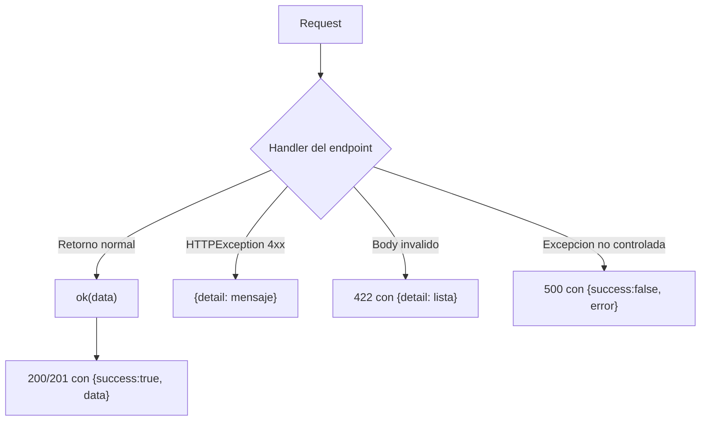
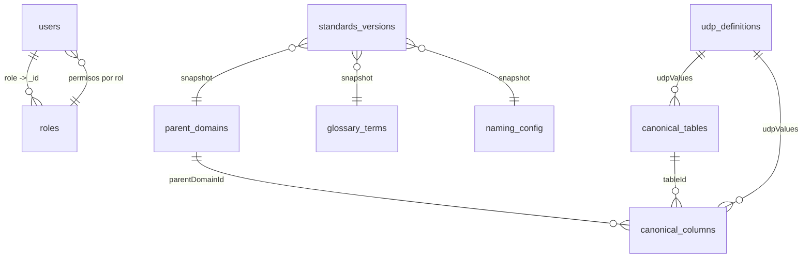
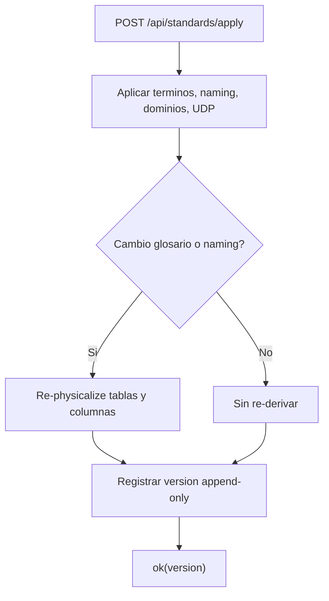
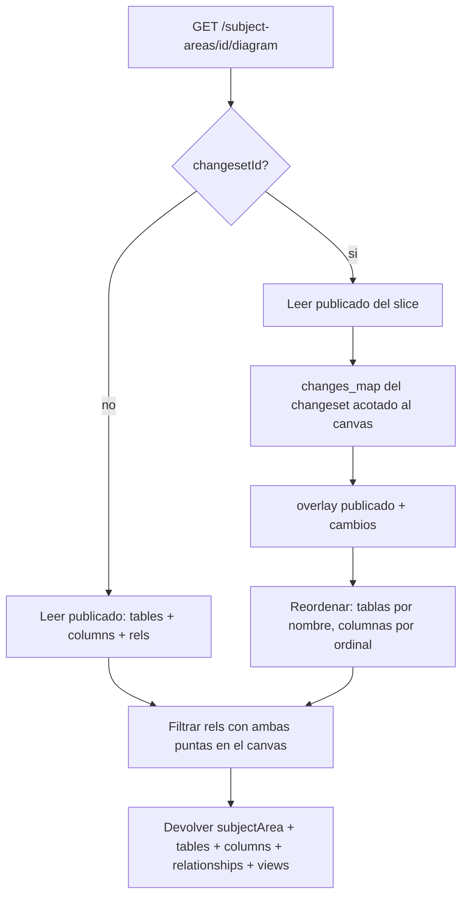
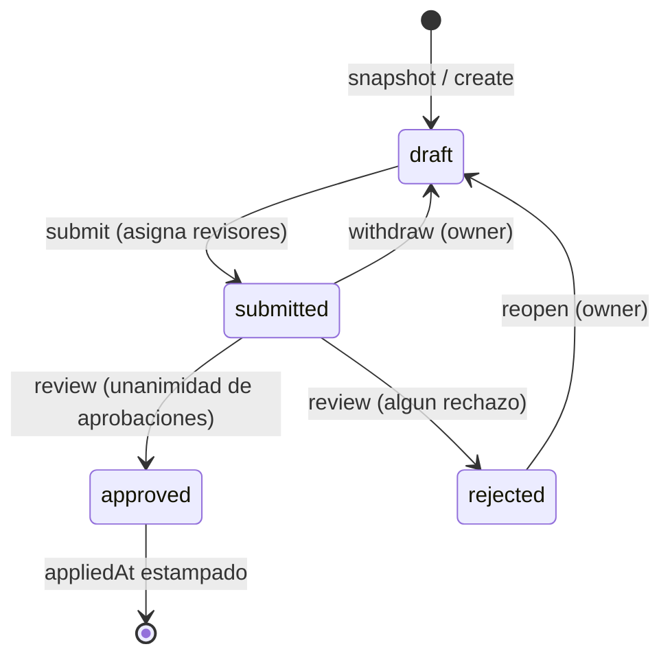
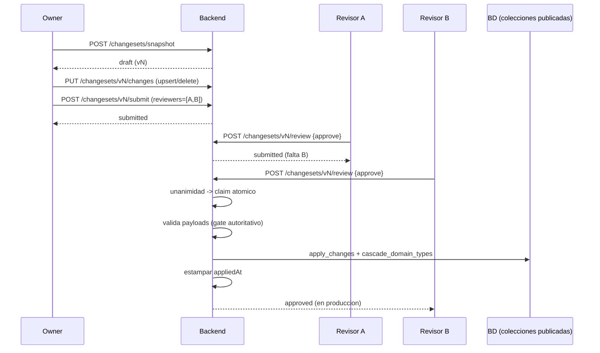
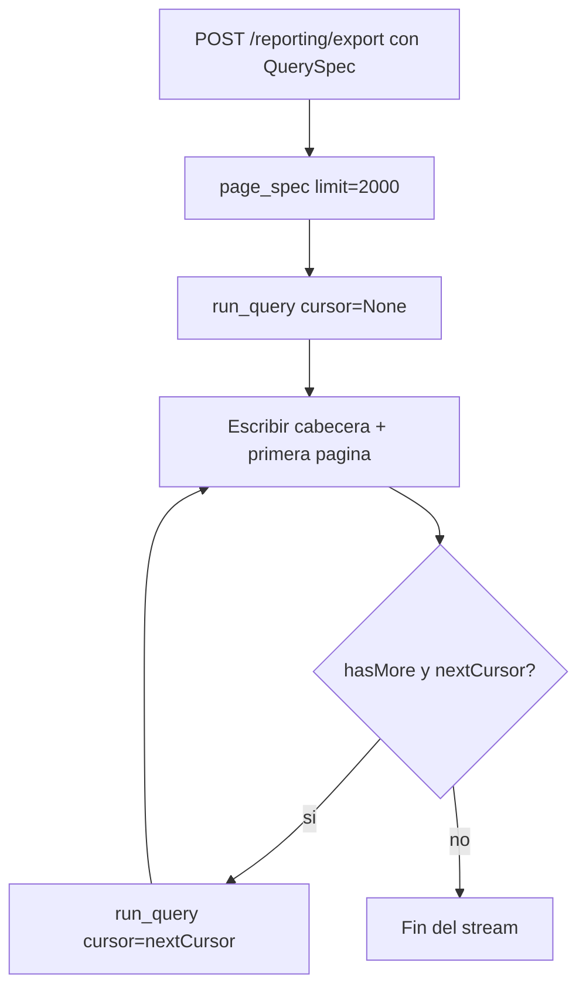
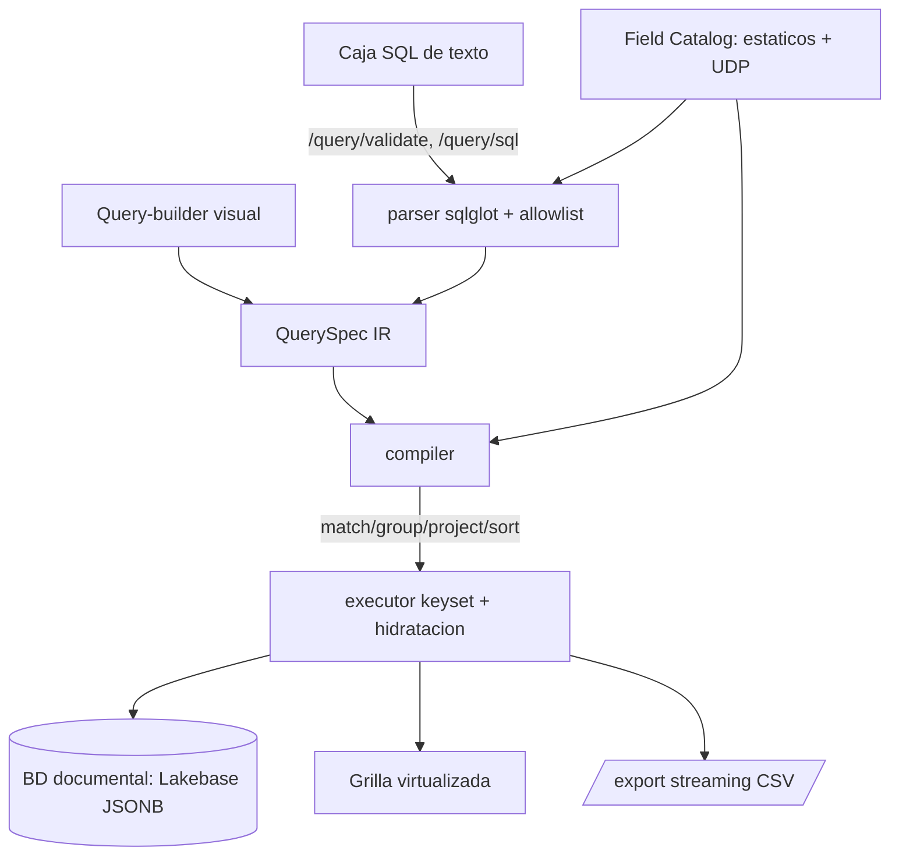

# Contrato de API — Data Model Hub Backend

Actualizado: 2026-09-08 (doc 75: proyectos independientes). Referencia completa de los 143 endpoints de la API REST, dividida en dos partes por dominio. Todas las respuestas siguen el envelope estándar `{ "success": true, "data": ... }` o `{ "success": false, "error": "..." }`.

> **Alcance por proyecto (doc 75).** Cada proyecto es un universo independiente: su catálogo, sus esquemas, sus Data Standards (glosario, dominios, UDP, naming, reglas DDL), sus versiones y sus reportes. Todo lo que es de un proyecto cuelga de **`/api/projects/{project_id}/…`** (catálogo, esquemas, glosario, dominios, UDP, standards, ddl-rules, settings, versions, folders, subject-areas, counts) o exige `projectId` (snapshot de changeset, reporting, summary). Toda ruta `/api/projects/{project_id}/…` lleva la dependencia `alive_project`: si el proyecto no existe o fue borrado responde **404 `Project not found.`**; una operación sobre un changeset de un proyecto borrado responde **409 `This project was deleted.`**. Los recursos por id (`/api/catalog/tables/{id}/…`, `/api/schemas/{sid}`, `/api/subject-areas/{sa_id}`, `/api/relationships/{rid}`, `/api/views/{vid}`, `/api/changesets/{cs_id}/…`) llevan el `projectId` en el documento y el servidor lo valida. Se retiraron en el doc 75: `GET /api/me`, `POST /api/glossary/logicalize`, `PUT /api/subject-areas/{sa_id}/udp` (los UDP de canvas van por el draft), `PUT/DELETE /api/projects/{pid}` (renombrar/describir/borrar van por el draft) y `GET /api/versions/published` (ahora por proyecto).

---

# Contrato de API — Parte 1

Auth, Admin, Identity, Catalog, Glossary, Domains, UDP, Data Standards, DDL Export Rules y Settings del backend de plataforma (`backend-data-model-hub`, FastAPI). La base de datos productiva y ÚNICA es **Databricks Lakebase Postgres**, consumida vía el adaptador de `app/core/db/lakebase/`, que expone una superficie de consulta async emulando el vocabulario de tipos/operaciones de pymongo (`ReturnDocument`, `UpdateOne`, `DuplicateKeyError`) sobre Postgres — no conecta a Mongo. Donde este contrato habla de "colecciones", en Lakebase cada colección es una tabla `(id text PRIMARY KEY, doc jsonb)` con la misma superficie de consulta — el contrato HTTP no cambia.

Este documento describe, para cada endpoint del alcance de la Parte 1: propósito, método y ruta, parámetros/body con tipos, un ejemplo de invocación con `curl` y la respuesta esperada. Todo lo aquí documentado sale del código real de los routers, schemas, services y repositories de cada feature.

---

## 1. Convenciones generales

### 1.1 Envelope de respuesta

Todos los endpoints de éxito envuelven el resultado con el helper `ok()` (`app/core/api/envelope.py`):

```python
def ok(data: Any = None) -> dict[str, Any]:
    return {"success": True, "data": data}
```

Es decir, una respuesta correcta siempre tiene esta forma:

```json
{ "success": true, "data": <payload> }
```

donde `<payload>` puede ser un objeto, una lista, un valor escalar o `null`.

Los errores NO comparten una única forma; hay tres casos, según de dónde salgan:

| Origen del error | Status | Forma del cuerpo |
|---|---|---|
| Errores de negocio / autorización lanzados con `HTTPException` (401, 403, 404, 400, 409, 429) | el status del caso | `{ "detail": "<mensaje>" }` |
| Validación del body por Pydantic/FastAPI | 422 | `{ "detail": [ { "loc": [...], "msg": "...", "type": "..." } ] }` |
| Excepción no controlada del servidor (BD caída, doc inválido, etc.) | 500 | `{ "success": false, "error": "Internal server error. Check the logs using the X-Request-ID." }` |

Solo el handler global de excepciones no controladas (`app/main.py`) produce el envelope de error `{ "success": false, "error": ... }`. Los `HTTPException` mantienen el formato estándar de FastAPI (`{ "detail": ... }`). El cliente debe considerar ambos.

Toda respuesta incluye el header `X-Request-ID` (12 hex) para correlacionar con los logs, más headers de seguridad (`X-Content-Type-Options: nosniff`, `X-Frame-Options: DENY`, `Referrer-Policy: no-referrer`, `Permissions-Policy`, y `Strict-Transport-Security` cuando la conexión es HTTPS).



### 1.2 Autenticación

La identidad sale de un token de sesión JWT (HS256). El backend lo acepta desde dos headers, en este orden (`bearer_token()` en `app/core/identity/dependencies.py`):

```
Authorization: Bearer <token>     # dev local, curl, tests
X-Session-Token: <token>          # producción en Databricks Apps
```

En producción el header `Authorization` NO llega al backend: el proxy SSO de Databricks Apps lo CONSUME como su propio carril de auth programática (verificado 2026-07-20 — FastAPI veía el Bearer ausente con el token válido en vuelo), y desde 2026-07-31 lo pone el server del front (`server.mjs`, token OAuth M2M del service principal), no el navegador. Por eso el token de sesión propio viaja en el header `X-Session-Token` (incluido en el allowlist de CORS).

El token se obtiene en `POST /api/auth/sso/login` (identidad heredada del SSO de Databricks — carril principal, doc 38) o en `POST /api/auth/login` (contraseña — carril del administrador). Ambos emiten el MISMO token. Sus claims son `sub` (el username; en sesiones SSO es el correo en lowercase), `iat`, `exp`, más `email`, `name` y `role`. La vida por defecto es de 720 minutos (12 horas), configurable con `ACCESS_TOKEN_TTL_MIN`.

Resolución de la identidad por request (`app/core/identity/dependencies.py`):

- Si viene un token válido (en cualquiera de los dos headers): la identidad sale de los claims.
- Si el token está presente pero es inválido o expiró: siempre 401 (no hay fallback; enviar una sesión rota es un intento de sesión, no un anónimo).
- Si NO viene token:
  - con `REQUIRE_AUTH=true` (postura de producción): 401 (login obligatorio);
  - con `REQUIRE_AUTH=false` (local/tests): se cae al seam de identidad (usuario fake local, o header `X-Dev-User` para actuar como otro usuario en desarrollo).


### 1.3 Modelo de permisos (RBAC)

Los permisos son data-driven: cada usuario tiene un rol y cada rol declara una matriz `permiso -> bool`. El catálogo de permisos (`app/features/auth/models.py`) es:

| Permiso | Significado |
|---|---|
| `model.view` | Ver modelo / Canvas |
| `model.edit` | Crear / editar tablas (working copy) |
| `review.decide` | Aprobar / rechazar solicitudes |
| `publish` | Publicar a producción |
| `rollback` | Revertir a una versión publicada (Model + Data Standards) |
| `export` | Exportar DDL / metadata |
| `standards.edit` | Editar Data Standards (Glossary, Parent Domains, UDP, naming, reglas DDL) |
| `admin.manage` | Administrar usuarios y permisos |

Se aplican de dos maneras:

- `require_permission("<perm>")`: dependency por endpoint; exige el permiso siempre (403 si falta). Se usa en `admin`, en las escrituras de `glossary`, en `data_standards` (apply con `standards.edit`, rollback con `rollback`), en `ddl_rules` (`/render` con `export`) y en los endpoints de `changesets` (`model.edit` / `review.decide` / `rollback`).
- `write_guard("<perm>")`: dependency a nivel de router que gatea por método: lecturas (GET/HEAD/OPTIONS) solo requieren sesión válida; escrituras (POST/PUT/PATCH/DELETE) exigen el permiso (403 si falta o el usuario está deshabilitado). Además audita la acción (salvo los sufijos ruidosos de alta frecuencia `/layout`, `/drawings`, `/tables`, `/udp`). Se usa en `catalog` (`model.edit`), `domains` (`standards.edit`), `settings` (`standards.edit`) y, en la Parte 2, en `projects`, `folders`, `schemas`, `relationships` y `views` (`model.edit`).
- `alive_project` (`app/features/projects/deps.py`): dependency de TODO router `/api/projects/{project_id}/…` — 404 `Project not found.` si el proyecto no existe o fue borrado (doc 75 D5).

Resumen de gating por router (Parte 1):

| Router | Gating |
|---|---|
| `auth` | login y warmup públicos; logout/me requieren sesión |
| `admin` | todos requieren `admin.manage` |
| `identity` | `GET /api/users` requiere sesión (`current_principal`) |
| `catalog` | `write_guard("model.edit")` en ambos routers (`/api/projects/{pid}/catalog` + `/api/catalog`): GET abierto a sesión, escrituras con permiso; el router por proyecto suma `alive_project` |
| `glossary` (`/api/projects/{pid}/glossary`) | GET/physicalize abiertos; validate exige sesión; create/update/delete/rephysicalize requieren `standards.edit`; lock/unlock requieren `admin.manage` |
| `domains` (`/api/projects/{pid}/domains`) | `write_guard("standards.edit")`: GET e impact abiertos a sesión, escrituras con permiso |
| `udp` (`/api/projects/{pid}/udp`) | `GET` abierto |
| `data_standards` (`/api/projects/{pid}/standards`) | snapshot/versions/summary abiertos; apply requiere `standards.edit`; rollback requiere `rollback` |
| `ddl_rules` (`/api/projects/{pid}/ddl-rules`) | lecturas y validate/test/impact abiertos (no escriben); `/render` requiere `export` |
| `settings` (`/api/projects/{pid}/settings`) | `write_guard("standards.edit")`: GET abierto a sesión, PUT con permiso |

Nota: "abierto" significa que no exige un permiso puntual, pero igual pasa por la resolución de identidad global; con `REQUIRE_AUTH=true` sin token válido es 401 en cualquier ruta.

### 1.4 Rate limiting y lockout de login

`POST /api/auth/login` está limitado a 5 requests/minuto por IP (`slowapi`, estado en memoria por proceso). La key del limiter es la **primera IP de `X-Forwarded-For`** (la del cliente real), con fallback a la IP del peer — sin esto, detrás de los proxies de Databricks Apps el límite keyeaba por la IP del proxy y era GLOBAL para todos los usuarios (fix 2026-07-31). Al excederlo devuelve 429 con header `Retry-After`. El rate limiting solo se activa con `REQUIRE_AUTH=true` o `RATE_LIMIT_ENABLED=true` (en dev queda apagado para no frenar el desarrollo).

Además hay lockout de cuenta: tras 8 fallos de login consecutivos, la cuenta se bloquea 15 minutos (aunque las credenciales sean correctas). La verificación del hash se hace SIEMPRE (con un hash dummy si el usuario no existe) para no filtrar por timing qué usuarios existen.

### 1.5 Códigos de estado usados

| Status | Cuándo |
|---|---|
| 200 | Lectura o mutación correcta |
| 201 | Creación de recurso (POST de creación) |
| 400 | Regla de negocio violada (dejar el sistema sin admin, rol con usuarios, scope/case inválido) |
| 401 | Sin sesión válida (token ausente/inválido/expirado con `REQUIRE_AUTH`) |
| 403 | Sesión válida pero sin el permiso requerido |
| 404 | Recurso inexistente (usuario, rol, versión de estándares) |
| 409 | Conflicto de estado o de datos (término del glosario bloqueado o duplicado, UDP referida por reglas DDL al borrarla) |
| 422 | Body que no valida contra el schema |
| 429 | Rate limit del login excedido |
| 500 | Error interno no controlado |

---

## 2. Despliegue y entorno

### 2.1 Dónde corre

El backend es una app FastAPI (ASGI, servida con Uvicorn). Los dos entornos vigentes:

- **Producción — Databricks Apps (workspace corporativo)**: dos apps, `bknd-data-model-hub` (este backend) y `frnt-data-model-hub` (el front). El navegador habla SOLO con el front: `server.mjs` del front sirve la SPA y **proxya `/api/*` al backend servidor-a-servidor** con un token OAuth M2M de su service principal (un solo origen — así se evita el doble muro SSO por app de Databricks, doc 36). Corre con `REQUIRE_AUTH=true`, que además oculta `/docs`, `/redoc` y `/openapi.json`. El deploy va por bundle (`databricks.yml`) desde GitHub Actions, parametrizado por GitHub Variables; detalle en [despliegue.md](despliegue.md).
- **Local (desarrollo)**: `uvicorn app.main:app --reload` en `:8000`; el `vite dev` del front proxya `/api` hacia ahí.

No requiere infraestructura propia más allá de la base de datos y las variables de entorno. En despliegue multi-réplica conviene mover el rate limiting a un backend Redis (hoy el estado es en memoria por proceso, así que con varias réplicas el límite efectivo se multiplica).

### 2.2 Variables de entorno

| Variable | Propósito | Default |
|---|---|---|
| `LAKEBASE_ENDPOINT` | Ruta lógica del endpoint Lakebase (`projects/…/branches/…/endpoints/…`); obligatoria | `""` |
| `LAKEBASE_PGSCHEMA` | Schema Postgres donde viven las colecciones | `dmh` |
| `PGHOST` / `PGPORT` / `PGDATABASE` / `PGSSLMODE` | Conexión Postgres; `PGHOST` vacío se auto-resuelve vía SDK | `""` / `5432` / `databricks_postgres` / `require` |
| `PGUSER` | Rol PG (fallback: `DATABRICKS_CLIENT_ID` del service principal) | `""` |
| `PGPASSWORD` | Password fijo para scripts (escape hatch sin SDK; en runtime el password es un token OAuth rotativo) | `""` |
| `PGDIRECTTLS` | `true` fuerza TLS directo (ALPN `postgresql`), `false` clásico; vacío = auto | `""` |
| `DATABRICKS_HOST` / `DATABRICKS_TOKEN` | Workspace del SDK / PAT en dev local (en Apps la identidad es el SP vía `DATABRICKS_CLIENT_ID/SECRET` inyectados) | `""` |
| `SECRET_KEY` | Clave HMAC para firmar el JWT de sesión (HS256). Obligatoria en producción | default inseguro de dev |
| `ACCESS_TOKEN_TTL_MIN` | Vida del token en minutos | `720` |
| `REQUIRE_AUTH` | `true` = login obligatorio (401 sin token); oculta `/docs`, `/redoc`, `/openapi.json` | `false` |
| `RATE_LIMIT_ENABLED` | Fuerza el rate limiting aunque `REQUIRE_AUTH` sea false | `false` |
| `AUTH_MODE` | `local` o `databricks` (seam de identidad de fallback) | `local` |
| `LOCAL_DEV_USER` / `LOCAL_DEV_USERNAME` / `LOCAL_DEV_DISPLAY_NAME` | Usuario fake del seam local (también la identidad del login SSO en dev sin headers) | `dev@local` / `""` / `""` |
| `PROXY_SHARED_SECRET` | Secreto compartido con el server del front que autentica el relay de identidad SSO (doc 38). Vacío + `REQUIRE_AUTH=true` → el login SSO responde 503 | `""` (en Apps: `valueFrom proxy_secret`) |
| `CORS_ORIGIN_REGEX` | Regex de orígenes permitidos (producción: `https://frnt-data-model-hub-.*\.databricksapps\.com`) | `""` |
| `CORS_ORIGINS` | Allowlist exacta de orígenes (solo se usa sin regex) | `http://localhost:3000,http://127.0.0.1:3000` |
| `ALLOWED_HOSTS` | Allowlist de hosts (TrustedHost) en producción | vacío (desactivado) |
| `LOG_FORMAT` / `LOG_LEVEL` | `pretty` o `json` / nivel | `pretty` / `INFO` |

Falla-cerrado importante: con `REQUIRE_AUTH=true` y `SECRET_KEY` en el default de desarrollo, la app NO arranca (`assert_secure_config`), porque con esa clave pública cualquiera forjaría un token de sesión admin.

### 2.3 Consideraciones de base de datos

- Base ÚNICA = **Databricks Lakebase Postgres**: el adaptador (`app/core/db/lakebase/`) expone una superficie de consulta async que emula la de pymongo (find/aggregate/bulk_write/…) sobre tablas `(id, doc jsonb)` en el schema `LAKEBASE_PGSCHEMA`; el password de cada conexión es un token OAuth de ~1 hora que la app acuña sola. La conexión se abre en el lifespan de la app y se cierra al parar; si falla al arranque, un task de fondo reintenta con backoff. (No hay driver ni conmutador de backend; `pymongo` permanece solo como vocabulario que el adaptador emula, sin conexión a Mongo.)
- Colecciones tocadas por esta parte del contrato: `users`, `roles`, `audit_log`, `canonical_tables`, `canonical_columns`, `parent_domains`, `glossary_terms`, `udp_definitions`, `naming_config`, `standards_versions`, `ddl_rules`, `ddl_ruleset_config`.
- El `_id` es la clave natural en varias colecciones (`users._id == username`, `roles._id == role key`, `naming_config._id == scope`). Al serializar, el backend renombra `_id -> id` y descarta campos internos (`flgactive`, `deletedAt`, `updatedAt`, `createdAt`).
- Borrado lógico (soft-delete): las eliminaciones marcan `flgactive=false` en vez de borrar el documento; los listados filtran por `flgactive != false`.
- Los modelos se validan con `extra="ignore"`, por lo que campos no declarados en el modelo del documento se descartan al leer/escribir (invariante de persistencia: un campo nuevo necesita declararse en el modelo Pydantic o desaparece en el round-trip).
- `.sort()` requiere índice sobre el campo ordenado (invariante de escala mantenido como contrato: p. ej. `canonical_tables.physicalName` para la búsqueda con `limit`). `ensure_indexes()` crea ~35 índices idempotentes al conectar.
- `standards_versions` es append-only con `seq` monotónico e índice único en `seq` (reintento ante colisión concurrente) — el único índice unique del sistema.



---

## 3. Auth (`/api/auth`)

Prefijo del router: `/api/auth`.

### 3.0 POST /api/auth/sso/login

Propósito: iniciar sesión con la identidad heredada del SSO de Databricks Apps (doc 38). Sin body: la identidad llega en los headers de relay `x-dmh-sso-email` / `x-dmh-sso-username` / `x-dmh-sso-user-id`, que el server del front adjunta autenticados con `x-dmh-proxy-secret` (secreto compartido `PROXY_SHARED_SECRET`). Público (sin token), limitado a 10/minuto por IP.

Reglas:

- Con `PROXY_SHARED_SECRET` configurado: secreto ausente/errado → **401** genérico; sin correo en el relay → **401**.
- Sin secreto configurado y `REQUIRE_AUTH=true` → **503** (fail-closed; el carril de contraseña sigue vivo).
- Dev (sin secreto, sin `REQUIRE_AUTH`): acepta `x-dmh-sso-*` directos, `X-Forwarded-Email`, o cae a la simulación `LOCAL_DEV_USER`.
- Correo (trim + lowercase) **no asignado a un rol** en Admin, o con `status: disabled` → **403** `{"detail": "This account has no access. Ask an administrator to assign your email to a role."}` (audita `login_sso_denied`).
- Correo asignado → **200** con `{token, user}` — misma shape que `POST /api/auth/login` (audita `login_sso`). El nombre se resuelve best-effort (SCIM → `preferred_username` → derivado del correo) y se persiste en el doc solo si estaba vacío (también `initials` y `email`).

curl (como lo emite el server del front):

```bash
curl -s -X POST https://api.ejemplo.com/api/auth/sso/login \
  -H "x-dmh-proxy-secret: $PROXY_SHARED_SECRET" \
  -H "x-dmh-sso-email: ana.gomez@empresa.com"
```

### 3.1 POST /api/auth/login

Propósito: autenticar por usuario y contraseña (carril del administrador — la UI solo lo expone para la cuenta local `admin`; las entradas de whitelist no tienen contraseña y no pueden usar este carril). Devuelve el token de sesión y el usuario enriquecido con rol y permisos. Público (sin token), pero limitado a 5/minuto por IP y con lockout de cuenta.

Body (`LoginBody`):

| Campo | Tipo | Requerido |
|---|---|---|
| `username` | string | sí |
| `password` | string | sí |

curl:

```bash
curl -s -X POST https://api.ejemplo.com/api/auth/login \
  -H "Content-Type: application/json" \
  -d '{"username": "ana", "password": "una-clave-segura"}'
```

Respuesta 200:

```json
{
  "success": true,
  "data": {
    "token": "eyJhbGciOiJIUzI1NiIsInR5cCI6IkpXVCJ9...",
    "user": {
      "username": "ana",
      "email": "ana@empresa.com",
      "name": "Ana Gomez",
      "role": "modelador",
      "roleName": "Modelador",
      "projectIds": [],
      "status": "active",
      "initials": "AG",
      "permissions": {
        "model.view": true,
        "model.edit": true,
        "review.decide": false,
        "publish": false,
        "rollback": false,
        "export": true,
        "standards.edit": false,
        "admin.manage": false
      },
      "accessLevel": "edit"
    }
  }
}
```

`accessLevel` es derivado: `full` si tiene `admin.manage`; `edit` si tiene `model.edit`, `standards.edit` o `publish`; `read` en caso contrario.

Error 401 (credenciales incorrectas, cuenta deshabilitada o bloqueada):

```json
{ "detail": "Incorrect username or password." }
```

Error 429 (rate limit): cuerpo del handler de slowapi + header `Retry-After`.

### 3.2 POST /api/auth/logout

Propósito: cerrar sesión (registra el evento en auditoría). Requiere sesión válida. El token es stateless: la invalidación real es del lado del cliente (descartar el token); este endpoint solo audita.

Body: ninguno.

curl:

```bash
curl -s -X POST https://api.ejemplo.com/api/auth/logout \
  -H "Authorization: Bearer $TOKEN"
```

Respuesta 200:

```json
{ "success": true, "data": { "ok": true } }
```

### 3.3 GET /api/auth/me

Propósito: devolver el usuario en sesión enriquecido con rol y permisos efectivos (lo usa el frontend para el gating de UI). Requiere sesión válida. Si el actor en el token no está registrado en `users` (seam de dev), degrada al `Principal` básico.

Parámetros: ninguno.

curl:

```bash
curl -s https://api.ejemplo.com/api/auth/me \
  -H "Authorization: Bearer $TOKEN"
```

Respuesta 200 (usuario registrado): misma forma que `user` en el login.

```json
{
  "success": true,
  "data": {
    "username": "ana",
    "email": "ana@empresa.com",
    "name": "Ana Gomez",
    "role": "modelador",
    "roleName": "Modelador",
    "projectIds": [],
    "status": "active",
    "initials": "AG",
    "permissions": { "model.view": true, "model.edit": true, "review.decide": false, "publish": false, "rollback": false, "export": true, "standards.edit": false, "admin.manage": false },
    "accessLevel": "edit"
  }
}
```

Respuesta 200 (actor no registrado, seam de dev): degrada al `Principal`.

```json
{
  "success": true,
  "data": { "email": "dev@local", "username": "dev", "display_name": "dev", "source": "local" }
}
```

### 3.4 GET /api/auth/warmup/{next_b64}

Propósito: warm-up de sesión SSO para Databricks Apps (doc 36). Cada app vive detrás de su propio muro SSO por subdominio y un `fetch()` del front no puede completar ese SSO (el redirect cross-origin a Microsoft es imposible dentro de XHR); el front navegaba top-level a este endpoint para que el proxy pusiera su cookie y rebotara de vuelta. Público a propósito (como el login).

Path: `next_b64` (string) = la URL de retorno codificada **base64url sin padding**. Viaja en el path y no como query string porque el replay post-SSO del proxy de Databricks se atora con query strings.

Validación: la URL decodificada debe apuntar a un origen del front permitido — mismo allowlist que CORS (lista exacta + `CORS_ORIGIN_REGEX` con `fullmatch`), anti open-redirect.

```bash
curl -s -i "https://api.ejemplo.com/api/auth/warmup/aHR0cHM6Ly9mcm9udC5lamVtcGxvLmNvbQ"
```

Respuesta: `302 Found` con `Location: <next>` y `Cache-Control: no-store`. Error 400 `{ "detail": "Invalid next URL." }` si el base64 no decodifica o el origen no está permitido.

Estado 2026-07-31: el flujo de warm-up por redirect FRACASÓ en el workspace corporativo (el proxy de Databricks no inicia el SSO en navegaciones lanzadas por script desde otro sitio); la solución vigente es el proxy del server del front (§2.1), con el cual el front usa rutas relativas `/api` y este endpoint queda inerte. Se conserva porque es útil en local apuntando a otro backend.

---

## 4. Admin (`/api/admin`)

Prefijo del router: `/api/admin`. TODOS los endpoints requieren el permiso `admin.manage` (403 si falta).

Modelo de datos (doc 38 — la colección `users` funciona como WHITELIST de acceso: correos asignados a un rol que entran por SSO; las cuentas locales con contraseña, p.ej. `admin`, conviven en la misma lista):

- Usuario (respuesta, sin `passwordHash`): `{ id, email, name, role, projectIds, status, initials, hasPassword }`. `status` es uno de `active | invited | disabled`. `hasPassword` es DERIVADO en lectura (true solo en cuentas locales; el front lo usa para mostrar el reset de contraseña).
- Rol: `{ id, name, description, permissions }`, donde `permissions` es un mapa `permiso -> bool` filtrado al catálogo conocido.

Guards de negocio (todos devuelven 400 con mensaje legible):

- No dejar el sistema sin ningún administrador activo (al cambiar rol/estado, borrar usuario o quitar `admin.manage` de un rol).
- No borrar un rol que tiene usuarios asignados.

### 4.1 GET /api/admin/users

Propósito: listar los usuarios (ordenados por nombre). Sin `passwordHash`.

curl:

```bash
curl -s https://api.ejemplo.com/api/admin/users \
  -H "Authorization: Bearer $ADMIN_TOKEN"
```

Respuesta 200:

```json
{
  "success": true,
  "data": [
    { "id": "admin", "email": "", "name": "Administrator", "role": "administrador", "projectIds": [], "status": "active", "initials": "AD", "hasPassword": true },
    { "id": "ana.gomez@empresa.com", "email": "ana.gomez@empresa.com", "name": "Ana Gomez", "role": "modelador", "projectIds": [], "status": "active", "initials": "AG", "hasPassword": false }
  ]
}
```

### 4.2 POST /api/admin/users

Propósito: alta en la whitelist (doc 38) — lo normal es correo + rol, SIN contraseña (la entrada habilita el login SSO de esa cuenta de Databricks). Dos formas válidas, con guard en el service (400 si no se cumple):

- `username` con `@` → **entrada SSO**: debe ser un correo válido; se normaliza a lowercase; `email` se autocompleta con el propio correo si no vino; sin contraseña. El nombre/iniciales los resuelve el primer login SSO.
- `username` sin `@` → **cuenta local** (p.ej. `admin`): exige `password` (se hashea con bcrypt).

Body (`UserCreate`):

| Campo | Tipo | Requerido | Notas |
|---|---|---|---|
| `username` | string | sí | clave (`_id`); correo lowercase en entradas SSO |
| `role` | string | sí | key de un rol existente |
| `email` | string | no | default: el propio `username` si es un correo |
| `name` | string | no | default vacío (lo llena el primer login SSO) |
| `password` | string | no | 10 a 128 si se envía; OBLIGATORIA solo para cuentas locales |
| `projectIds` | string[] | no | default `[]` (vacío = todos) |
| `status` | string | no | default `active` |

curl (alta típica de whitelist):

```bash
curl -s -X POST https://api.ejemplo.com/api/admin/users \
  -H "Authorization: Bearer $ADMIN_TOKEN" \
  -H "Content-Type: application/json" \
  -d '{"username":"carla.ruiz@empresa.com","role":"lector"}'
```

Respuesta 201:

```json
{
  "success": true,
  "data": { "id": "carla.ruiz@empresa.com", "email": "carla.ruiz@empresa.com", "name": "", "role": "lector", "projectIds": [], "status": "active", "initials": null, "hasPassword": false }
}
```

### 4.3 PUT /api/admin/users/{username}

Propósito: actualizar un usuario. Todos los campos son opcionales; solo se aplican los enviados. `password` opcional (reset por el admin).

Path: `username` (string).

Body (`UserUpdate`, todos opcionales):

| Campo | Tipo | Notas |
|---|---|---|
| `email` | string | |
| `name` | string | recomputa iniciales |
| `role` | string | key de rol |
| `projectIds` | string[] | |
| `status` | string | `active | invited | disabled` |
| `password` | string | 10 a 128 si se envía |

curl:

```bash
curl -s -X PUT https://api.ejemplo.com/api/admin/users/carla \
  -H "Authorization: Bearer $ADMIN_TOKEN" \
  -H "Content-Type: application/json" \
  -d '{"role":"modelador","status":"active"}'
```

Respuesta 200: el usuario actualizado (misma forma que arriba).

```json
{
  "success": true,
  "data": { "id": "carla", "email": "carla@empresa.com", "name": "Carla Ruiz", "role": "modelador", "projectIds": [], "status": "active", "initials": "CR" }
}
```

Errores: 404 `{ "detail": "User not found." }`; 400 `{ "detail": "Ese cambio dejaría el sistema sin ningún administrador." }`.

### 4.4 DELETE /api/admin/users/{username}

Propósito: eliminar (soft-delete) un usuario. No permite borrar al último administrador.

Path: `username` (string).

curl:

```bash
curl -s -X DELETE https://api.ejemplo.com/api/admin/users/carla \
  -H "Authorization: Bearer $ADMIN_TOKEN"
```

Respuesta 200:

```json
{ "success": true, "data": { "id": "carla" } }
```

Errores: 404 `{ "detail": "User not found." }`; 400 con el mensaje del guard (no se permite eliminar al último administrador del sistema).

### 4.5 GET /api/admin/roles

Propósito: listar los roles con su matriz de permisos (ordenados por nombre).

curl:

```bash
curl -s https://api.ejemplo.com/api/admin/roles \
  -H "Authorization: Bearer $ADMIN_TOKEN"
```

Respuesta 200:

```json
{
  "success": true,
  "data": [
    {
      "id": "administrador",
      "name": "Administrador",
      "description": "Acceso total",
      "permissions": { "model.view": true, "model.edit": true, "review.decide": true, "publish": true, "rollback": true, "export": true, "standards.edit": true, "admin.manage": true }
    },
    {
      "id": "lector",
      "name": "Lector",
      "description": "Solo lectura",
      "permissions": { "model.view": true, "model.edit": false, "review.decide": false, "publish": false, "rollback": false, "export": false, "standards.edit": false, "admin.manage": false }
    }
  ]
}
```

### 4.6 PUT /api/admin/roles/{key}

Propósito: crear o actualizar (upsert) un rol y su matriz. Los permisos se sanean al catálogo conocido (keys desconocidas se descartan; valores coaccionados a bool). No permite un cambio que deje el sistema sin administrador.

Path: `key` (string) = slug estable del rol (`_id`).

Body (`RoleBody`):

| Campo | Tipo | Requerido |
|---|---|---|
| `name` | string | sí |
| `description` | string | no |
| `permissions` | objeto `{ [perm]: bool }` | no (default `{}`) |

curl:

```bash
curl -s -X PUT https://api.ejemplo.com/api/admin/roles/revisor \
  -H "Authorization: Bearer $ADMIN_TOKEN" \
  -H "Content-Type: application/json" \
  -d '{"name":"Revisor","description":"Aprueba solicitudes","permissions":{"model.view":true,"review.decide":true}}'
```

Respuesta 200:

```json
{
  "success": true,
  "data": {
    "id": "revisor",
    "name": "Revisor",
    "description": "Aprueba solicitudes",
    "permissions": { "model.view": true, "model.edit": false, "review.decide": true, "publish": false, "rollback": false, "export": false, "standards.edit": false, "admin.manage": false }
  }
}
```

Error 400: `{ "detail": "Ese cambio en la matriz dejaría el sistema sin administrador." }`.

### 4.7 DELETE /api/admin/roles/{key}

Propósito: eliminar (soft-delete) un rol. No permite borrar un rol con usuarios asignados.

Path: `key` (string).

curl:

```bash
curl -s -X DELETE https://api.ejemplo.com/api/admin/roles/revisor \
  -H "Authorization: Bearer $ADMIN_TOKEN"
```

Respuesta 200:

```json
{ "success": true, "data": { "id": "revisor" } }
```

Errores: 404 `{ "detail": "Role not found." }`; 400 con el conteo de usuarios asignados (hay que reasignarlos a otro rol antes de eliminar este).

### 4.8 GET /api/admin/permissions

Propósito: devolver el catálogo de permisos (columnas/filas de la matriz).

curl:

```bash
curl -s https://api.ejemplo.com/api/admin/permissions \
  -H "Authorization: Bearer $ADMIN_TOKEN"
```

Respuesta 200:

```json
{
  "success": true,
  "data": ["model.view", "model.edit", "review.decide", "publish", "rollback", "export", "standards.edit", "admin.manage"]
}
```

### 4.9 GET /api/admin/audit

Propósito: leer el log de auditoría (más reciente primero).

Query params:

| Param | Tipo | Default | Rango |
|---|---|---|---|
| `limit` | int | 200 | 1 a 1000 |

curl:

```bash
curl -s "https://api.ejemplo.com/api/admin/audit?limit=50" \
  -H "Authorization: Bearer $ADMIN_TOKEN"
```

Respuesta 200 (cada entrada: `{ id, at, actor, action, target?, targetType?, meta? }`):

```json
{
  "success": true,
  "data": [
    { "id": "665f...", "at": "2026-07-06T14:03:11.220000+00:00", "actor": "ana", "action": "login" },
    { "id": "665e...", "at": "2026-07-06T13:59:02.010000+00:00", "actor": "root", "action": "admin.user.update", "target": "carla", "targetType": "user", "meta": { "changes": { "role": { "from": "lector", "to": "modelador" } }, "fields": ["email"], "passwordChanged": false } }
  ]
}
```

---

## 5. Identity (`/api`)

Prefijo del router: `/api`. Expone la lista de usuarios reales para asignar revisores. (`GET /api/me` se retiró en el doc 75 D14: duplicaba `GET /api/auth/me`, que es el que enriquece con rol y permisos.)

### 5.1 GET /api/users

Propósito: usuarios REALES de la plataforma (`{ id, name, initials }`, colección `users`, sin los deshabilitados) para la asignación de revisores. Con el query `can`, solo usuarios cuyo ROL otorga ese permiso — el selector de revisores usa `can=review.decide` para no asignar a alguien que jamás podría votar (dejaba el request trabado: la unanimidad no se cumplía nunca). Requiere sesión (`current_principal`, doc 38: la whitelist es un directorio de correos y no debe ser enumerable de forma anónima); con filtro `can`, una lista vacía es una respuesta válida. Fallback a la lista fija simulada solo si la colección está vacía (dev sin seed).

Query params:

| Param | Tipo | Default | Notas |
|---|---|---|---|
| `can` | string | null | permiso del rol (p. ej. `review.decide`) |

curl:

```bash
curl -s "https://api.ejemplo.com/api/users?can=review.decide"
```

Respuesta 200:

```json
{
  "success": true,
  "data": [
    { "id": "ana", "name": "Ana Gomez", "initials": "AG" },
    { "id": "beto", "name": "Beto Diaz", "initials": "BD" }
  ]
}
```

---

## 6. Catalog (`/api/projects/{project_id}/catalog` · `/api/catalog`)

Dos routers con `write_guard("model.edit")` (lecturas con sesión; escrituras con `model.edit`): **`/api/projects/{project_id}/catalog`** para lo que se lista/busca/crea dentro de un proyecto (`tables`, `columns`, `search`, `inventory`; lleva `alive_project`) y **`/api/catalog`** para los recursos por id (`tables/{table_id}/columns`, `tables/{table_id}/usage`, `inspect/*`).

Es el pool canónico **del proyecto** (doc 75): tablas (`canonical_tables`) y columnas (`canonical_columns`, colección separada), ambas con `projectId`. El nombre físico de tabla es único **por proyecto** (case-insensitive): `M_CLIENTE` puede existir en dos proyectos distintos.

Forma de una tabla canónica en respuesta (`CanonicalTableDoc`, serializado con alias): `{ id, projectId, physicalName, logicalName, schema, description, udpValues, … }`. El campo `schema` es el alias de `sql_schema`; `description` es la definición funcional de la tabla (declarada en el modelo desde el doc 11 — antes se descartaba por `extra="ignore"`).

Forma de una columna canónica en respuesta (`CanonicalColumnDoc`): `{ id, projectId, tableId, physicalName, logicalName, parentDomainId, dataType, typeOverridden, isPrimaryKey, isForeignKey, isNullable, isPartition, description, ordinal, udpValues, … }`. Doc 94: no hay orden de llave aparte — las PK van primero en el `ordinal` y entre ellas manda el `ordinal` (`pkPosition` se retiró).

### 6.1 GET /api/projects/{project_id}/catalog/tables

Propósito: listar el pool de tablas DEL proyecto. Con `q`+`limit` hace búsqueda server-side (para los modales de catálogo a gran escala); `schema` acota a un esquema (filtro del modal Import existing, combinable con `q`); sin parámetros, la lista completa del proyecto.

Query params:

| Param | Tipo | Default | Notas |
|---|---|---|---|
| `q` | string | null | búsqueda por nombre físico/lógico (contains, case-insensitive) |
| `limit` | int | null | 1 a 500; capea el resultado y ordena por `physicalName` |
| `schema` | string | null | sólo tablas de ese esquema |

curl:

```bash
curl -s "https://api.ejemplo.com/api/projects/p-001/catalog/tables?q=cliente&limit=20" \
  -H "Authorization: Bearer $TOKEN"
```

Respuesta 200:

```json
{
  "success": true,
  "data": [
    { "id": "t-001", "physicalName": "DIM_CLIENTE", "logicalName": "Dimension Cliente", "schema": "ventas", "description": "Dimensión de clientes", "udpValues": { "udp-clasif": "DAC" } },
    { "id": "t-002", "physicalName": "FACT_CLIENTE_SALDO", "logicalName": "Cliente Saldo", "schema": null, "description": null, "udpValues": {} }
  ]
}
```

### 6.2 POST /api/projects/{project_id}/catalog/tables

Propósito: crear una tabla canónica en el proyecto (camino directo sin changeset; el front escribe siempre vía draft). Requiere `model.edit`. 409 si ya existe una tabla activa con ese físico en el proyecto. Si no se envía `physicalName`, se deriva del `logicalName` con el motor de naming (glosario + naming_config del scope `column`, ver Glossary/Settings).

Body (`CanonicalTableBody`):

| Campo | Tipo | Requerido | Notas |
|---|---|---|---|
| `logicalName` | string | sí | |
| `physicalName` | string | no | si falta, se deriva |
| `schema` | string | no | alias de `sql_schema` |
| `description` | string | no | definición funcional de la tabla |
| `udpValues` | objeto `{ [udpDefId]: string }` | no | etiquetas UDP asignadas |

curl:

```bash
curl -s -X POST https://api.ejemplo.com/api/projects/p-001/catalog/tables \
  -H "Authorization: Bearer $TOKEN" \
  -H "Content-Type: application/json" \
  -d '{"logicalName":"Dimension Producto","schema":"ventas","udpValues":{"udp-clasif":"NO DAC"}}'
```

Respuesta 201:

```json
{
  "success": true,
  "data": { "id": "b1e2...", "physicalName": "DIM_PRODUCTO", "logicalName": "Dimension Producto", "schema": "ventas", "description": null, "udpValues": { "udp-clasif": "NO DAC" } }
}
```

### 6.3 GET /api/catalog/tables/{table_id}/columns

Propósito: listar las columnas de una tabla canónica (ordenadas por `ordinal`).

Path: `table_id` (string).

curl:

```bash
curl -s https://api.ejemplo.com/api/catalog/tables/t-001/columns \
  -H "Authorization: Bearer $TOKEN"
```

Respuesta 200:

```json
{
  "success": true,
  "data": [
    { "id": "c-01", "tableId": "t-001", "physicalName": "CLIENTE_ID", "logicalName": "Cliente Identificador", "parentDomainId": "dom-id", "dataType": "BIGINT", "typeOverridden": false, "isPrimaryKey": true, "isForeignKey": null, "isNullable": false, "isPartition": false, "description": "Clave del cliente", "ordinal": 0, "udpValues": {} },
    { "id": "c-02", "tableId": "t-001", "physicalName": "CLIENTE_NOMBRE", "logicalName": "Cliente Nombre", "parentDomainId": "dom-nombre", "dataType": "VARCHAR(120)", "typeOverridden": true, "isPrimaryKey": null, "isForeignKey": null, "isNullable": true, "isPartition": false, "description": null, "ordinal": 1, "udpValues": { "udp-pii": "true" } }
  ]
}
```

### 6.4 POST /api/catalog/tables/{table_id}/columns

Propósito: crear una columna canónica en la tabla. Requiere `model.edit`. Deriva `physicalName` del `logicalName` si no se envía, y resuelve `dataType`: si se manda `dataType`, gana como override manual (marca `typeOverridden=true`); si no, hereda el `defaultDataType` del dominio (`parentDomainId`).

Path: `table_id` (string).

Body (`CanonicalColumnBody`):

| Campo | Tipo | Requerido | Default |
|---|---|---|---|
| `logicalName` | string | sí | |
| `physicalName` | string | no | derivado |
| `parentDomainId` | string | no | null |
| `dataType` | string | no | heredado del dominio si falta |
| `isPrimaryKey` | bool | no | null |
| `isForeignKey` | bool | no | null |
| `isNullable` | bool | no | true |
| `isPartition` | bool | no | false |
| `description` | string | no | null |
| `ordinal` | int | no | 0 |
| `udpValues` | objeto `{ [udpDefId]: string }` | no | `{}` |

curl:

```bash
curl -s -X POST https://api.ejemplo.com/api/catalog/tables/t-001/columns \
  -H "Authorization: Bearer $TOKEN" \
  -H "Content-Type: application/json" \
  -d '{"logicalName":"Cliente Fecha Alta","parentDomainId":"dom-fecha","isNullable":false,"ordinal":2}'
```

Respuesta 201 (dataType heredado del dominio `dom-fecha`):

```json
{
  "success": true,
  "data": { "id": "c-03", "tableId": "t-001", "physicalName": "CLIENTE_FEC_ALTA", "logicalName": "Cliente Fecha Alta", "parentDomainId": "dom-fecha", "dataType": "DATE", "typeOverridden": false, "isPrimaryKey": null, "isForeignKey": null, "isNullable": false, "isPartition": false, "description": null, "ordinal": 2, "udpValues": {} }
}
```

### 6.5 GET /api/projects/{project_id}/catalog/columns

Propósito: búsqueda por COLUMNA dentro del proyecto (doc 29; la usa el Database Explorer en modo producción). Contains case-insensitive sobre `physicalName`/`logicalName` de `canonical_columns`, ordenada por `physicalName` (índice existente). Cada hit sale con su tabla dueña resuelta (`table` = nombre físico + `schema`) para mostrarse como `esquema.tabla`; los hits cuya tabla ya no está activa se descartan (huérfanos). Lectura (sesión). En modo draft el front NO usa este endpoint: reusa `GET /api/changesets/{cs_id}/effective/canonical_columns` con `q`+`limit`.

Query params:

| Param | Tipo | Default | Notas |
|---|---|---|---|
| `q` | string | requerido | `min_length=1` (422 si falta) |
| `limit` | int | 50 | 1 a 500 |

curl:

```bash
curl -s "https://api.ejemplo.com/api/projects/p-001/catalog/columns?q=cliente&limit=50" \
  -H "Authorization: Bearer $TOKEN"
```

Respuesta 200 (columna canónica + `table`/`schema` de la tabla dueña):

```json
{
  "success": true,
  "data": [
    { "id": "c-01", "tableId": "t-001", "physicalName": "CLIENTE_ID", "logicalName": "Cliente Identificador", "parentDomainId": "dom-id", "dataType": "BIGINT", "typeOverridden": false, "isPrimaryKey": true, "isForeignKey": null, "isNullable": false, "isPartition": false, "description": null, "ordinal": 0, "udpValues": {}, "table": "DIM_CLIENTE", "schema": "ventas" }
  ]
}
```

### 6.6 GET /api/catalog/tables/{table_id}/usage

Propósito: dónde se usa la tabla (doc 19 §12b — "Used in" del panel Properties): canvases que la referencian, con su carpeta y proyecto resueltos a NOMBRE, ordenados por proyecto, carpeta y canvas. Con `changesetId`, el slice de canvases aplica el overlay del draft (un canvas nuevo o una membresía pendiente cuentan; los nombres de proyectos/carpetas creados o renombrados en el draft también se resuelven). Lectura (sesión).

Path: `table_id` (string). Query: `changesetId` (string, opcional).

curl:

```bash
curl -s "https://api.ejemplo.com/api/catalog/tables/t-001/usage?changesetId=cs-9" \
  -H "Authorization: Bearer $TOKEN"
```

Respuesta 200:

```json
{
  "success": true,
  "data": {
    "usage": [
      { "canvasId": "sa-1", "canvas": "Ventas core", "folderId": "f-01", "folder": "Dominio Ventas", "projectId": "p-001", "project": "Ventas" }
    ],
    "total": 1
  }
}
```

---

### 6.7 Buscador, inventario e inspector (docs 70 y 72)

- **GET /api/projects/{project_id}/catalog/search** — buscador del Model dentro del proyecto (⌘K): tablas, columnas y definiciones de columna, cada hit con su tabla y los canvases donde está. Query: `q` (contains CI; vacío = navegar el alcance de los filtros), `limit` (1–100, tope por grupo), `offset` (página siguiente de cada grupo), `scope` (`all | tables | columns | definitions`), `folderId` (subárbol de esa carpeta), `canvasId`, `changesetId` (overlay del draft; también `asof:<versionId>`). Sesión; `changesetId` pasa por `ensure_changeset_visible` (doc 70 §12).
- **GET /api/projects/{project_id}/catalog/inventory** — inventario del proyecto para el Explorer en UNA request: sus tablas (con `columnCount`) y las vistas de esas tablas; `changesetId` opcional. Sesión.
- **GET /api/catalog/inspect/tables/{table_id}** · **GET /api/catalog/inspect/views/{view_id}** — Object Inspector: tabla + columnas efectivas + relaciones + vistas + dónde se usa (o vista + tablas fuente + canvases), sin necesidad de canvas; `changesetId` opcional; 404 si no existe. Sesión.

---

## 7. Glossary (`/api/projects/{project_id}/glossary`)

Prefijo del router: `/api/projects/{project_id}/glossary` (con `alive_project`). Diccionario de abreviaturas DEL proyecto (términos que cascadean nombres físicos de ese proyecto) más conversión lógico→físico. Editar términos es editar estándares, así que las mutaciones requieren `standards.edit`; el endpoint de cómputo (`physicalize`) y el `GET` quedan abiertos (los usa el modelador para previsualizar sin mutar); `validate` exige sesión; `lock`/`unlock` requieren `admin.manage`. (`logicalize` se retiró en el doc 75 D14.)

Forma de un término (`AbbreviationDoc`): `{ id, projectId, term, abbrev, scope, locked, lockedBy, lockedAt }`. `scope` es `column | table` (doc 94: el antiguo `wordType` se retiró; un body que lo mande lo pierde). Una entrada con `locked=true` es intocable para TODOS (editar/eliminar devuelve 409, tanto por CRUD directo como por `standards/apply`) hasta que un admin la desbloquee.

### 7.1 GET /api/projects/{project_id}/glossary

Propósito: listar términos. Sin `scope` = todos; con `scope`, solo ese.

Query params:

| Param | Tipo | Default |
|---|---|---|
| `scope` | string (`column | table`) | null (todos) |

curl:

```bash
curl -s "https://api.ejemplo.com/api/projects/p-001/glossary?scope=column"
```

Respuesta 200:

```json
{
  "success": true,
  "data": [
    { "id": "g-01", "term": "Identificador", "abbrev": "ID", "scope": "column" },
    { "id": "g-02", "term": "Cliente", "abbrev": "CLI", "scope": "column" }
  ]
}
```

### 7.2 POST /api/projects/{project_id}/glossary

Propósito: crear un término. Requiere `standards.edit`.

Body (`AbbreviationBody`):

| Campo | Tipo | Requerido | Default |
|---|---|---|---|
| `term` | string | sí | |
| `abbrev` | string | sí | |
| `scope` | string | no | `column` |

curl:

```bash
curl -s -X POST https://api.ejemplo.com/api/projects/p-001/glossary \
  -H "Authorization: Bearer $STD_TOKEN" \
  -H "Content-Type: application/json" \
  -d '{"term":"Producto","abbrev":"PROD","scope":"column"}'
```

Respuesta 201:

```json
{ "success": true, "data": { "id": "g-03", "term": "Producto", "abbrev": "PROD", "scope": "column" } }
```

### 7.3 PUT /api/projects/{project_id}/glossary/{entry_id}

Propósito: actualizar un término. Requiere `standards.edit`. Si el término no existe, devuelve `data: null` (no lanza 404).

Path: `entry_id` (string). Body: `AbbreviationBody` (igual que en la creación).

curl:

```bash
curl -s -X PUT https://api.ejemplo.com/api/projects/p-001/glossary/g-03 \
  -H "Authorization: Bearer $STD_TOKEN" \
  -H "Content-Type: application/json" \
  -d '{"term":"Producto","abbrev":"PRD","scope":"column"}'
```

Respuesta 200:

```json
{ "success": true, "data": { "id": "g-03", "term": "Producto", "abbrev": "PRD", "scope": "column" } }
```

### 7.4 DELETE /api/projects/{project_id}/glossary/{entry_id}

Propósito: eliminar (soft-delete) un término. Requiere `standards.edit`. Devuelve un bool.

Path: `entry_id` (string).

curl:

```bash
curl -s -X DELETE https://api.ejemplo.com/api/projects/p-001/glossary/g-03 \
  -H "Authorization: Bearer $STD_TOKEN"
```

Respuesta 200:

```json
{ "success": true, "data": true }
```

### 7.5 POST /api/projects/{project_id}/glossary/physicalize

Propósito: derivar el nombre físico de un nombre lógico, aplicando el glosario y las reglas de naming del scope. Abierto (no muta).

Body (`PhysicalizeBody`):

| Campo | Tipo | Requerido | Notas |
|---|---|---|---|
| `logical` | string | sí | nombre lógico a convertir |
| `scope` | string | no | `column | table`; default `column` |
| `separator` | string | no | override ad-hoc del separador (gana sobre `naming_config`) |

curl:

```bash
curl -s -X POST https://api.ejemplo.com/api/projects/p-001/glossary/physicalize \
  -H "Content-Type: application/json" \
  -d '{"logical":"Cliente Identificador","scope":"column"}'
```

Respuesta 200:

```json
{ "success": true, "data": { "physical": "CLI_ID" } }
```

### 7.6 POST /api/projects/{project_id}/glossary/rephysicalize

Propósito: re-physicalize retroactivo. Recomputa el `physicalName` de TODAS las entidades del scope a partir de su `logicalName` (glosario + naming actual). Requiere `standards.edit`. Update directo sobre las colecciones publicadas. Sin `scope`, aplica a tablas y columnas.

Body (`RephysicalizeBody`):

| Campo | Tipo | Requerido | Notas |
|---|---|---|---|
| `scope` | string | no | `table | column`; sin scope = ambos |

curl:

```bash
curl -s -X POST https://api.ejemplo.com/api/projects/p-001/glossary/rephysicalize \
  -H "Authorization: Bearer $STD_TOKEN" \
  -H "Content-Type: application/json" \
  -d '{}'
```

Respuesta 200:

```json
{ "success": true, "data": { "updated": { "tables": 12, "columns": 340 } } }
```

### 7.7 POST /api/projects/{project_id}/glossary/validate

Propósito: validar un término NUEVO antes de agregarlo — chequeo 1: duplicado exacto (case-insensitive) en el glosario del scope; chequeo 2: el término aparece como frase completa contigua en los nombres lógicos publicados **de su scope** (doc 94 D9: un término de columna solo mira columnas; uno de tabla, solo tablas — los físicos de tabla solo usan términos de tabla; doc 95 D1: el endpoint devuelve la lista **completa** de coincidencias, para que el popup muestre todas las columnas en conflicto; el enforcement de los writes solo necesita el total). El 409 del write dice, en inglés: `The term 'X' can't be added: it already exists in the glossary or appears as a full phrase in logical column names (N conflicts). Adding it would rename those columns.` No muta; el enforcement real vive en los writes (POST/PUT de este router y `standards/apply`, que devuelven 409 ante conflicto). Exige SESIÓN (lee el catálogo: un anónimo no debe enumerar tablas/columnas en producción) pero NO `standards.edit` — el botón Validate del front lo usan también usuarios sin ese permiso. Un término vacío o solo espacios devuelve el contrato "sin conflictos" sin tocar la BD.

Body (`ValidateTermBody`):

| Campo | Tipo | Requerido | Default |
|---|---|---|---|
| `term` | string | sí | |
| `scope` | string | no | `column` |

curl:

```bash
curl -s -X POST https://api.ejemplo.com/api/projects/p-001/glossary/validate \
  -H "Authorization: Bearer $TOKEN" \
  -H "Content-Type: application/json" \
  -d '{"term":"Producto","scope":"column"}'
```

Respuesta 200 (`total` = conflictos de corpus + 1 si hay duplicado en el glosario):

```json
{
  "success": true,
  "data": {
    "ok": false,
    "conflicts": {
      "glossaryDuplicate": { "id": "g-03", "term": "Producto", "abbrev": "PROD", "scope": "column" },
      "corpus": [ { "entity": "column", "tableName": "DIM_PRODUCTO", "columnName": "PROD_COD", "logicalName": "Producto Codigo" } ],
      "total": 2
    }
  }
}
```

### 7.7b POST /api/projects/{project_id}/glossary/impact

Propósito (docs 94 D7 · 95 D3/D4): **dry-run** del re-derivado que haría aplicar el borrador del glosario de un scope. Corre el mismo cálculo que el apply sobre AMBOS scopes, como el apply: el editado con los términos y el naming simulados, el otro con lo vigente. Devuelve las listas **completas**, separadas en:

- `renamed`: los nombres que cambian **por el borrador** (el derivado con el borrador difiere del derivado con lo vigente);
- `outOfSync`: los nombres que **ya estaban desfasados** de la regla vigente y el apply repara de paso (p. ej. un U+00A0 venido del XML de Erwin). En el otro scope todo cae acá.

`renamed` ∪ `outOfSync` es exactamente lo que el apply re-deriva. Los físicos con override manual no cuentan. No muta. Exige SESIÓN (como `/validate`), no `standards.edit`. El front muestra el popup SOLO si alguna lista trae filas.

Body (`ImpactBody`):

| Campo | Tipo | Requerido | Default |
|---|---|---|---|
| `scope` | string | no | `column` |
| `termsUpsert` | `[{ id?, term, abbrev }]` | no | `[]` (sin `id` = término nuevo) |
| `termsDelete` | string[] (ids) | no | `[]` |
| `namingConfig` | `{ separator?, case? }` \| null | no | null (= el guardado del scope) |

Respuesta 200 (fila = `{entity: "column"|"table", tableId, table, from, to}`; orden: columnas antes que tablas, luego tabla y nombre; para `entity: "table"`, `table` = `from` = el físico actual de la tabla):

```json
{
  "success": true,
  "data": {
    "renamed": [ { "entity": "column", "tableId": "tb1", "table": "MAESTROCLIENTES", "from": "CODCLI", "to": "CODCLTE" } ],
    "outOfSync": [ { "entity": "table", "tableId": "tb9", "table": "HM_JERARQUIAFUNCIONALCRE\u00a0", "from": "HM_JERARQUIAFUNCIONALCRE\u00a0", "to": "HM_JERARQUIAFUNCIONALCRE" } ]
  }
}
```

### 7.8 POST /api/projects/{project_id}/glossary/{entry_id}/lock

Propósito: bloquear la entrada (solo un administrador). Una entrada bloqueada devuelve 409 en cualquier intento de edición/eliminación hasta que se desbloquee. Requiere `admin.manage`. Audita.

Path: `entry_id` (string). Body: ninguno.

```bash
curl -s -X POST https://api.ejemplo.com/api/projects/p-001/glossary/g-03/lock \
  -H "Authorization: Bearer $ADMIN_TOKEN"
```

Respuesta 200: la entrada con `locked=true`, `lockedBy` y `lockedAt`. Error 404 `{ "detail": "The term doesn't exist." }`.

### 7.9 POST /api/projects/{project_id}/glossary/{entry_id}/unlock

Propósito: desbloquear la entrada. Requiere `admin.manage`. Audita. Misma forma de respuesta y errores que `lock` (con `locked=false`).

---

## 8. Domains (`/api/projects/{project_id}/domains`)

Prefijo del router: `/api/projects/{project_id}/domains` (con `alive_project`). Router con `write_guard("standards.edit")`: lecturas (incluida `impact`) requieren sesión; escrituras (crear/editar/borrar/propagate) requieren `standards.edit`.

Los Parent Domains son DEL proyecto (doc 75: el dominio «Codigo» puede ser `VARCHAR(30)` en un proyecto y `VARCHAR(20)` en otro) y definen un `defaultDataType` que cascadea a las columnas del proyecto que los usan (respetando overrides manuales).

Forma de un dominio (`ParentDomainDoc`): `{ id, projectId, name, defaultDataType, namingTerm, description, … }`.

### 8.1 GET /api/projects/{project_id}/domains

Propósito: listar los Parent Domains (ordenados por nombre).

curl:

```bash
curl -s https://api.ejemplo.com/api/projects/p-001/domains \
  -H "Authorization: Bearer $TOKEN"
```

Respuesta 200:

```json
{
  "success": true,
  "data": [
    { "id": "dom-id", "name": "Identificador", "defaultDataType": "BIGINT", "namingTerm": "ID", "description": "Claves numéricas" },
    { "id": "dom-fecha", "name": "Fecha", "defaultDataType": "DATE", "namingTerm": "FEC", "description": null }
  ]
}
```

### 8.2 POST /api/projects/{project_id}/domains

Propósito: crear un dominio. Requiere `standards.edit`.

Body (`ParentDomainBody`):

| Campo | Tipo | Requerido |
|---|---|---|
| `name` | string | sí |
| `defaultDataType` | string | sí |
| `namingTerm` | string | no |
| `description` | string | no |

curl:

```bash
curl -s -X POST https://api.ejemplo.com/api/projects/p-001/domains \
  -H "Authorization: Bearer $STD_TOKEN" \
  -H "Content-Type: application/json" \
  -d '{"name":"Monto","defaultDataType":"DECIMAL(18,2)","namingTerm":"MTO"}'
```

Respuesta 201:

```json
{ "success": true, "data": { "id": "d3f0...", "name": "Monto", "defaultDataType": "DECIMAL(18,2)", "namingTerm": "MTO", "description": null } }
```

### 8.3 PUT /api/projects/{project_id}/domains/{domain_id}

Propósito: actualizar un dominio. Requiere `standards.edit`. Si cambia `defaultDataType`, cascadea el tipo nuevo a las columnas que aún tienen el tipo viejo y no fueron editadas a mano (`typeOverridden != true`). Si el dominio no existe, devuelve `data: null`.

Path: `domain_id` (string). Body: `ParentDomainBody`.

curl:

```bash
curl -s -X PUT https://api.ejemplo.com/api/projects/p-001/domains/dom-fecha \
  -H "Authorization: Bearer $STD_TOKEN" \
  -H "Content-Type: application/json" \
  -d '{"name":"Fecha","defaultDataType":"TIMESTAMP","namingTerm":"FEC"}'
```

Respuesta 200:

```json
{ "success": true, "data": { "id": "dom-fecha", "name": "Fecha", "defaultDataType": "TIMESTAMP", "namingTerm": "FEC", "description": null } }
```

### 8.4 DELETE /api/projects/{project_id}/domains/{domain_id}

Propósito: eliminar (soft-delete) un dominio. Requiere `standards.edit`. Devuelve un bool.

Path: `domain_id` (string).

curl:

```bash
curl -s -X DELETE https://api.ejemplo.com/api/projects/p-001/domains/dom-fecha \
  -H "Authorization: Bearer $STD_TOKEN"
```

Respuesta 200:

```json
{ "success": true, "data": true }
```

### 8.5 GET /api/projects/{project_id}/domains/{domain_id}/impact

Propósito: previsualizar el impacto de propagar el tipo del dominio: cuántas columnas lo usan, cuántas se actualizarían (sin override) y cuántas se saltarían (con override). No muta nada. Lectura (abierta a sesión).

Path: `domain_id` (string).

curl:

```bash
curl -s https://api.ejemplo.com/api/projects/p-001/domains/dom-id/impact \
  -H "Authorization: Bearer $TOKEN"
```

Respuesta 200:

```json
{
  "success": true,
  "data": {
    "columnsUsing": 5,
    "willUpdate": 4,
    "overridden": 1,
    "columns": [
      { "id": "c-01", "physicalName": "CLIENTE_ID", "tableId": "t-001", "overridden": false },
      { "id": "c-77", "physicalName": "PEDIDO_ID", "tableId": "t-050", "overridden": true }
    ]
  }
}
```

### 8.5b GET /api/projects/{project_id}/domains/{domain_id}/impact/columns

Propósito (doc 95 D7): vista previa **exacta por columna** de re-tipar el dominio, con la MISMA regla que aplica la cascada (`app/features/domains/cascade.py`): una columna se re-tipa si es activa, apunta al dominio, no tiene override de esa faceta y conserva el tipo actual del dominio. Sin `physicalTo`/`logicalTo` mide quién sigue hoy al dominio (panel del editor). No muta. Lectura (sesión).

Query:

| Parámetro | Tipo | Default | Notas |
|---|---|---|---|
| `physicalTo` | string | — | tipo físico nuevo (se homologa como el apply) |
| `logicalTo` | string | — | tipo lógico nuevo; vacío = no cascadea |
| `q` | string | — | busca en tabla o columna (físico o lógico), sin mayúsculas |
| `status` | `change` \| `override` \| `differs` | — | filtra filas; sin valor = todas |
| `offset` | int ≥ 0 | 0 | |
| `limit` | int 0–2000 | 500 | `0` = solo totales (no resuelve nombres) |

Respuesta 200 (totales globales, no dependen de `q`/`status`; `tables` = todas las tablas del dominio, `changeTables` = las que cambian; `models` = modelos (canvases) de las tablas que cambian y, sin tipos nuevos —el panel—, de todas las tablas del dominio, como el panel de antes):

```json
{
  "success": true,
  "data": {
    "domain": { "physical": "INTEGER", "logical": "NUMBER" },
    "targets": { "physical": "UUID" },
    "totals": { "columns": 180, "tables": 120, "change": 177, "changeTables": 118, "override": 2, "differs": 1, "models": 37 },
    "matched": 177,
    "rows": [ { "columnId": "c1", "tableId": "t1", "schema": "core", "table": "CLIENTE", "tableLogical": "cliente",
                "column": "CODCLI", "attribute": "codigo cliente", "physicalType": "INTEGER", "logicalType": "NUMBER",
                "physical": "change", "logical": null, "status": "change" } ]
  }
}
```

### 8.6 POST /api/projects/{project_id}/domains/{domain_id}/propagate

Propósito: aplicar el `defaultDataType` actual del dominio a todas sus columnas sin override (retroactivo, directo sobre `canonical_columns`). Requiere `standards.edit`. Si el dominio no existe o no tiene tipo, devuelve `updated: 0`.

Path: `domain_id` (string). Body: ninguno.

curl:

```bash
curl -s -X POST https://api.ejemplo.com/api/projects/p-001/domains/dom-id/propagate \
  -H "Authorization: Bearer $STD_TOKEN"
```

Respuesta 200:

```json
{ "success": true, "data": { "updated": 4 } }
```

---

## 9. UDP (`/api/projects/{project_id}/udp`)

Prefijo del router: `/api/projects/{project_id}/udp` (con `alive_project`). Las definiciones UDP (User Defined Properties) son etiquetas key-value con tipo, valor por defecto, valores permitidos (enum) y nivel al que aplican; son DEL proyecto (doc 75 D10: el kit siembra el mismo catálogo fijo en cada proyecto, con ids propios). Este router es solo de LECTURA y abierto; las mutaciones son versionadas vía `POST /api/projects/{project_id}/standards/apply` (`udpUpsert`/`udpDelete`), igual que Glossary y Parent Domains.

Forma de una definición (`UdpDefinitionDoc`): `{ id, projectId, name, level, view, dataType, defaultValue, allowedValues, description }`. `level` es `table | column | canvas | view`; `view` (doc 69) es la faceta `logical | physical`; `dataType` es `string | number | boolean | date | list`; `allowedValues` solo se usa con `dataType = list`.

### 9.1 GET /api/projects/{project_id}/udp

Propósito: listar las definiciones UDP activas del proyecto (ordenadas por nombre). Las usa el panel de Properties y el módulo Data Standards.

curl:

```bash
curl -s https://api.ejemplo.com/api/projects/p-001/udp
```

Respuesta 200:

```json
{
  "success": true,
  "data": [
    { "id": "udp-clasif", "name": "Clasificación del Dato", "level": "column", "dataType": "list", "defaultValue": "NO DAC", "allowedValues": ["DAC", "NO DAC"], "description": "Clasificación de sensibilidad" },
    { "id": "udp-pii", "name": "Es PII", "level": "column", "dataType": "boolean", "defaultValue": "false", "allowedValues": [], "description": null }
  ]
}
```

---

## 10. Data Standards (`/api/projects/{project_id}/standards`)

Prefijo del router: `/api/projects/{project_id}/standards` (con `alive_project`). Módulo de versionado independiente de los estándares (Glossary + Parent Domains + UDP + naming + **reglas de DDL Export**, doc 30 — un solo stream `standards_versions` para todo), **por proyecto** (doc 75 D3): cada proyecto tiene su historial (`seq`/`label` arrancan en `v1` en cada uno), su producción de estándares y su rollback; nada cruza entre proyectos. La lectura (`snapshot`, `versions`, `summary`) es abierta; `apply` requiere `standards.edit`; `rollback` requiere el permiso `rollback`.

Cada `apply`/`rollback` aplica los cambios directo a las colecciones publicadas del proyecto y registra una versión append-only en `standards_versions` (con `projectId`) con snapshot completo, diff legible, impacto y autor. Un cambio de glosario/naming re-physicaliza SÓLO las tablas y columnas de ese proyecto.

Forma de una versión (`StandardsVersionDoc`):

```
{ id, projectId, seq, label, kind, title, description, author, createdAt, appliedAt,
  status, diff: { added[], edited[], removed[] }, impact: { tables, columns },
  snapshot: { domains[], dict[], namingConfig{}, udp[], ddlRules[], ddlConfig{} }, revertsSeq }
```

`kind` es uno de `glossary | udp | domain | naming | ddl | batch | baseline | rollback | copy` (`copy` = bloques copiados de otro proyecto al crearlo, doc 75 D15). `label` es `v{seq}`, único por `(projectId, seq)`.



### 10.1 GET /api/projects/{project_id}/standards/snapshot

Propósito: devolver el estado actual de estándares (dominios, términos, naming, UDP, reglas DDL + config del ruleset). Abierto.

curl:

```bash
curl -s https://api.ejemplo.com/api/projects/p-001/standards/snapshot
```

Respuesta 200:

```json
{
  "success": true,
  "data": {
    "domains": [ { "id": "dom-id", "name": "Identificador", "defaultDataType": "BIGINT", "namingTerm": "ID", "description": null } ],
    "dict": [ { "id": "g-01", "term": "Identificador", "abbrev": "ID", "scope": "column", "locked": false, "lockedBy": null, "lockedAt": null } ],
    "namingConfig": { "column": { "separator": "", "case": "upper", "maxLength": 150 }, "table": { "separator": "", "case": "upper", "maxLength": 150 } },
    "udp": [ { "id": "udp-clasif", "name": "Clasificación del Dato", "level": "column", "dataType": "list", "defaultValue": "NO DAC", "allowedValues": ["DAC", "NO DAC"], "description": null } ],
    "ddlRules": [ { "id": "r-01", "name": "enmascarar_dac", "description": "Hashea columnas de alta criticidad en la vista técnica", "kind": "rule", "target": "column", "sourceArtifact": null, "condition": "columna.udp[\"Clasificacion del Dato\"] LIKE 'DAC-%'", "udpRefs": [{ "udpId": "udp-clasif", "level": "column" }], "action": { "expression": "sha2({col}, 512)", "alias": "{columna.nombre}" }, "appliesTo": ["ddl.vista_tecnica"], "priority": 100, "enabled": true, "validationState": "valid" } ],
    "ddlConfig": { "lookups": { "vacuum_map": { "fromUdpId": "udp-vacuum", "fromLevel": "table", "values": { "CUSTOM_90 days": "interval 90 days" }, "default": "interval 90 days" } }, "functions": [] }
  }
}
```

### 10.2 GET /api/projects/{project_id}/standards/versions

Propósito: devolver el historial de versiones (más reciente primero). Abierto.

curl:

```bash
curl -s https://api.ejemplo.com/api/projects/p-001/standards/versions
```

Respuesta 200:

```json
{
  "success": true,
  "data": [
    {
      "id": "v-88", "projectId": "p-001", "seq": 12, "label": "v12", "kind": "batch",
      "title": "3 standard changes", "description": null, "author": "ana",
      "createdAt": "2026-07-06T12:00:00+00:00", "appliedAt": "2026-07-06T12:00:00+00:00",
      "status": "applied",
      "diff": { "added": ["Term Producto → PROD"], "edited": ["Domain Fecha · DATE → TIMESTAMP"], "removed": [] },
      "impact": { "tables": 0, "columns": 18 },
      "snapshot": { "domains": [], "dict": [], "namingConfig": {}, "udp": [], "ddlRules": [], "ddlConfig": {} },
      "revertsSeq": null
    }
  ]
}
```

### 10.3 POST /api/projects/{project_id}/standards/apply

Propósito: aplicar un batch de cambios de estándares del proyecto como UNA versión. Requiere `standards.edit`. Aplica términos (upsert/delete), naming, dominios (con cascada), definiciones UDP y reglas/config de DDL Export; re-deriva nombres físicos del proyecto si cambió glosario/naming; registra la versión. Es el ÚNICO camino de mutación de las reglas DDL (el router `/api/projects/{project_id}/ddl-rules` es read-only).

Body (`ApplyBody`):

| Campo | Tipo | Default | Notas |
|---|---|---|---|
| `kind` | string | `batch` | `glossary | udp | domain | naming | ddl | batch`; se coacciona al vocabulario conocido |
| `title` | string | null | si falta, se autogenera del diff |
| `description` | string | null | |
| `termsUpsert` | `TermEdit[]` | `[]` | |
| `termsDelete` | string[] (ids) | `[]` | |
| `namingConfig` | `{ [scope]: NamingEdit }` | `{}` | `scope` = `column | table` |
| `domainsUpsert` | `DomainEdit[]` | `[]` | |
| `domainsDelete` | string[] (ids) | `[]` | |
| `udpUpsert` | `UdpEdit[]` | `[]` | |
| `udpDelete` | string[] (ids) | `[]` | |
| `rulesUpsert` | `DdlRuleEdit[]` | `[]` | reglas de DDL Export a crear/editar (doc 30) |
| `rulesDelete` | string[] (ids) | `[]` | ids de reglas a borrar |
| `ddlConfigPatch` | `DdlConfigPatch` | null | lookups/functions/Output settings del ruleset |

Sub-esquemas:

- `TermEdit`: `{ id?: string, term: string, abbrev: string, scope: string }` (id `null` = nuevo).
- `DomainEdit`: `{ id?: string, name: string, defaultDataType: string, namingTerm?: string, description?: string }`.
- `NamingEdit`: `{ separator: string, case: string, maxLength?: int (def 150) }` — `maxLength` = límite de caracteres del nombre físico (tabla/columna), versionado acá (doc 24).
- `UdpEdit`: `{ id?: string, name: string, level?: string (def "column", acepta "table" | "column" | "canvas"), dataType?: string (def "string"), defaultValue?: string, allowedValues?: string[], description?: string }`.
- `DdlRuleEdit`: `{ id?: string, name: string, description?: string, kind?: "rule" | "generator" (def "rule"), target?: "column" | "table" (def "column"; solo kind=rule), sourceArtifact?: string (solo kind=generator), condition?: string (DSL), udpRefs?: [{udpId, level}], action?: dict (expression | tags | tblproperties | emit), appliesTo?: string[], priority?: int (def 100), enabled?: bool (def true), validationState?: string, validationReport?: dict }`.
- `DdlConfigPatch`: `{ lookups?: dict, functions?: list, output?: dict }` — cada bloque no-nulo REEMPLAZA el set completo (sin deltas). `output` = *Output settings* del Export DDL (doc 93, ver §12.2): se normaliza (claves desconocidas se descartan) y un valor inválido responde **422** con el motivo (`{ "detail": "Output setting 'typeCase' must be one of: lower, upper." }`).

Guards propios del batch DDL (el estado se evalúa POST-batch: si el mismo batch borra la regla que referenciaba al UDP, pasa):

- 422 si una regla de `rulesUpsert` no trae `name`; 409 si el `name` colisiona con otra regla activa (o dentro del mismo batch) — el slug debe ser único.
- **409 si un id de `udpDelete` está referido por los `udpRefs` de reglas DDL activas o por el origen de un lookup** — `{ "detail": "That UDP is referenced by DDL export rules ('regla1', 'regla2'). Delete or edit those rules first." }`. Borrar un VALOR de la lista de un UDP no bloquea: las reglas afectadas pasan a `validationState: "stale"`.
- 400 si una regla upserteada con su núcleo editado (`condition`/`action`/`appliesTo`/`target`/`kind`/`sourceArtifact`) no pasa la validación server-side (guardar con errores está bloqueado; togglear/repriorizar una regla ya inválida sí se permite).
- 409 al borrar un generador cuya salida alimenta a otros generadores activos; 400 si el estado post-batch deja un ciclo entre generadores.

curl:

```bash
curl -s -X POST https://api.ejemplo.com/api/projects/p-001/standards/apply \
  -H "Authorization: Bearer $STD_TOKEN" \
  -H "Content-Type: application/json" \
  -d '{
        "kind": "batch",
        "title": "Ajuste de estándares",
        "termsUpsert": [ { "term": "Producto", "abbrev": "PROD", "scope": "column" } ],
        "domainsUpsert": [ { "id": "dom-fecha", "name": "Fecha", "defaultDataType": "TIMESTAMP" } ],
        "namingConfig": { "column": { "separator": "_", "case": "upper" } },
        "udpUpsert": [ { "name": "Es PII", "level": "column", "dataType": "boolean", "defaultValue": "false" } ]
      }'
```

Respuesta 200 (la versión creada):

```json
{
  "success": true,
  "data": {
    "id": "v-89", "seq": 13, "label": "v13", "kind": "batch",
    "title": "Ajuste de estándares", "description": null, "author": "ana",
    "createdAt": "2026-07-06T14:20:00+00:00", "appliedAt": "2026-07-06T14:20:00+00:00",
    "status": "applied",
    "diff": { "added": ["UDP Es PII", "Term Producto → PROD"], "edited": ["Column naming · sep '_' · upper", "Domain Fecha · DATE → TIMESTAMP"], "removed": [] },
    "impact": { "tables": 3, "columns": 41 },
    "snapshot": { "domains": [], "dict": [], "namingConfig": {}, "udp": [], "ddlRules": [], "ddlConfig": {} },
    "revertsSeq": null
  }
}
```

### 10.4 POST /api/projects/{project_id}/standards/rollback

Propósito: restaurar el estado de estándares al snapshot de una versión objetivo (dominios, términos, naming, UDP y también reglas/config DDL), re-derivar solo lo necesario, y registrar una versión NUEVA (`kind = rollback`). Requiere el permiso `rollback` (dejó de ser `standards.edit` en el doc 27, cuando el rollback pasó a ser un permiso propio de la matriz). 404 si la versión objetivo no existe.

Doc 95 D9: solo re-tipa los dominios cuyo tipo cambia, desde el tipo actual (borrados incluidos) y con la regla de la cascada de ida (`app/features/domains/cascade.py`: columna activa, mismo `parentDomainId`, sin override en esa faceta y con el tipo actual del dominio); no reescribe filas sin cambio. Las columnas «divorciadas» (override o tipo ya distinto) no se tocan. `impact.columns` = columnas re-tipadas (máximo entre facetas por dominio). Lo que hará se ve antes con §10.4b.

Body (`RollbackBody`):

| Campo | Tipo | Requerido | Notas |
|---|---|---|---|
| `targetSeq` | int | sí | `seq` de la versión a la que se revierte |

curl:

```bash
curl -s -X POST https://api.ejemplo.com/api/projects/p-001/standards/rollback \
  -H "Authorization: Bearer $STD_TOKEN" \
  -H "Content-Type: application/json" \
  -d '{"targetSeq": 12}'
```

Respuesta 200 (nueva versión de rollback):

```json
{
  "success": true,
  "data": {
    "id": "v-90", "seq": 14, "label": "v14", "kind": "rollback",
    "title": "Rolled back to v12", "description": null, "author": "ana",
    "createdAt": "2026-07-06T14:35:00+00:00", "appliedAt": "2026-07-06T14:35:00+00:00",
    "status": "applied",
    "diff": { "added": [], "edited": ["Reverted standards to v12"], "removed": [] },
    "impact": { "tables": 3, "columns": 41 },
    "snapshot": { "domains": [], "dict": [], "namingConfig": {}, "udp": [], "ddlRules": [], "ddlConfig": {} },
    "revertsSeq": 12
  }
}
```

Error 404: `{ "detail": "That standards version doesn't exist." }`.

### 10.4b GET /api/projects/{project_id}/standards/rollback-preview?targetSeq=N

Propósito (doc 95 D9): lo que haría el rollback a `targetSeq` ANTES de confirmarlo — los dominios cuyo tipo cambia (físico y/o lógico, desde el tipo que tienen HOY) con cuántas columnas se re-tipan, con la misma regla que §10.4, y si se re-derivan nombres (glosario o naming distintos). No muta. Abierto (como `snapshot`/`versions`). `targetSeq` ≥ 1; 404 si la versión no existe.

```bash
curl -s "https://api.ejemplo.com/api/projects/p-001/standards/rollback-preview?targetSeq=12"
```

Respuesta 200:

```json
{
  "success": true,
  "data": {
    "target": { "seq": 12, "label": "v12" },
    "domains": [
      { "id": "d-7", "name": "Importe", "physical": { "from": "DECIMAL(18,2)", "to": "DECIMAL(18,4)" },
        "logical": null, "columns": 214 }
    ],
    "namesRederived": false
  }
}
```

`physical`/`logical` = `null` si esa faceta no cambia. Un dominio del snapshot que hoy no existe ni borrado no aparece (no hay columnas que lo sigan).

### 10.4c GET /api/projects/{project_id}/standards/domains/{domain_id}/history

Propósito (doc 95 D8): el historial de UN parent domain — las versiones de Data Standards donde su estado cambia, más reciente primero. Abierto. Lista vacía si el dominio nunca aparece en un snapshot.

Cada entrada: `{seq, label, title, author, createdAt, kind, state, changed}`. `state` = los campos del dominio en esa versión (`name`, `defaultDataType`, `logicalDataType`, `namingTerm`, `description`, `inheritsName`, `physicalName`, `physicalDescription`, `udpValues`) o `null` si en esa versión no existía o estaba borrado; `changed` = los campos que cambiaron respecto de la entrada anterior (vacío en la creación, el borrado o la restauración). El front ofrece «Revert to vN»: carga `state` en el editor y se aplica con el popup de cascada (misma regla, versión nueva, auditada).

```bash
curl -s https://api.ejemplo.com/api/projects/p-001/standards/domains/d-7/history
```

### 10.5 GET /api/projects/{project_id}/standards/summary

Propósito: conteos por bloque de los estándares del proyecto — lo usa el asistente «New project» para elegir qué copiar (doc 75 D15). Abierto.

```bash
curl -s https://api.ejemplo.com/api/projects/p-001/standards/summary
```

Respuesta 200: `{ "success": true, "data": { "glossary": 120, "domains": 46, "udp": 25, "rules": 8, "naming": true } }`.

---

## 11. Settings (`/api/projects/{project_id}/settings`)

Prefijo del router: `/api/projects/{project_id}/settings` (con `alive_project`). Configuración de naming (separador, case y largo máximo del nombre físico) por scope, DEL proyecto. Router con `write_guard("standards.edit")`: la lectura requiere sesión; la escritura requiere `standards.edit`.

Hay un documento por (proyecto, scope) (`column`, `table`) en `naming_config`; el `_id` es `<projectId>:<scope>`. La lectura siembra defaults si el documento no existe (no escribe). Regla corporativa vigente: join (sin separador) + UPPER en AMBOS scopes — así se derivan los físicos reales del catálogo (p. ej. `CODCLAVESUJETOCLI`): `column -> { separator: "", case: "upper", maxLength: 150 }`, `table -> { separator: "", case: "upper", maxLength: 150 }`.

Forma de un doc de naming en respuesta (`NamingConfigDoc`): `{ scope, projectId, separator, case, maxLength }`. `case` es `upper | lower | camel`; `maxLength` (doc 24) es el límite de caracteres del nombre físico, aplicado al crear/renombrar en el changeset (`NameTooLongError` → 400) con grandfather de los nombres heredados. El naming config también se versiona en Data Standards (viaja en `namingConfig` de `standards/apply`).

### 11.1 GET /api/projects/{project_id}/settings/naming

Propósito: devolver la configuración de ambos scopes (con defaults sembrados si faltan).

curl:

```bash
curl -s https://api.ejemplo.com/api/projects/p-001/settings/naming \
  -H "Authorization: Bearer $TOKEN"
```

Respuesta 200:

```json
{
  "success": true,
  "data": {
    "column": { "scope": "column", "separator": "", "case": "upper", "maxLength": 150 },
    "table": { "scope": "table", "separator": "", "case": "upper", "maxLength": 150 }
  }
}
```

### 11.2 PUT /api/projects/{project_id}/settings/naming/{scope}

Propósito: upsertear `{ separator, case, maxLength }` para un scope. Requiere `standards.edit`. Valida el scope (`column | table`) y el case (`upper | lower | camel`); 400 si son inválidos.

Path: `scope` (string) = `column | table` (viaja en la ruta, no en el body).

Body (`NamingConfigBody`):

| Campo | Tipo | Default |
|---|---|---|
| `separator` | string | `""` |
| `case` | string | `upper` |
| `maxLength` | int | `150` |

curl:

```bash
curl -s -X PUT https://api.ejemplo.com/api/projects/p-001/settings/naming/column \
  -H "Authorization: Bearer $STD_TOKEN" \
  -H "Content-Type: application/json" \
  -d '{"separator":"","case":"upper","maxLength":150}'
```

Respuesta 200:

```json
{ "success": true, "data": { "scope": "column", "separator": "", "case": "upper", "maxLength": 150 } }
```

Error 400 (scope o case inválido):

```json
{ "detail": "case must be one of ('upper', 'lower', 'camel'), not 'title'" }
```

---

## 12. DDL Export Rules (`/api/projects/{project_id}/ddl-rules`)

Prefijo del router: `/api/projects/{project_id}/ddl-rules` (con `alive_project`); el ruleset es DEL proyecto (doc 75). Motor de reglas del Export DDL (doc 30, 2026-07-20): reglas autorables que transforman el TEXTO SQL exportado según los valores de UDP del modelo (enmascarar columnas DAC, generar tabla `_rej`, vista técnica, tags de gobierno, TBLPROPERTIES de vacuum). Nunca tocan el modelo ni la data: los artefactos generados existen solo dentro del `.sql` exportado.

El router es **solo lectura + cómputo**: las mutaciones de reglas son VERSIONADAS vía `POST /api/projects/{project_id}/standards/apply` (`rulesUpsert`/`rulesDelete`/`ddlConfigPatch`, ver 10.3), igual que Glossary/Parent Domains/UDP. La lectura y el bench del editor (`validate`/`test`/`impact`) quedan abiertos (no escriben); `POST /render` requiere el permiso `export`.

Colecciones: `ddl_rules` (una regla por doc, con `projectId`) y `ddl_ruleset_config` (un doc por proyecto, `_id = projectId`, con `lookups` y `functions`). El versionado vive en el stream `standards_versions` del proyecto (el snapshot suma `ddlRules` + `ddlConfig`; el rollback restaura UDPs y reglas juntos).

Forma de una regla (`DdlRuleDoc`): `{ id, projectId, name, description, kind, target, sourceArtifact, condition, udpRefs, action, appliesTo, priority, enabled, validationState, validationReport }`. `name` es un slug único entre reglas activas; `kind` es `rule | generator`; `target` (`column | table`) aplica solo a `kind=rule`; `sourceArtifact` solo a `kind=generator`; `condition` es el DSL SQL-like en forma canónica con corchetes (`columna.udp["…"] LIKE 'DAC-%'`); `action` tiene 4 formas (`expression` | `tags` | `tblproperties` | `emit`); `validationState` es `valid | invalid | stale`.

### 12.1 GET /api/projects/{project_id}/ddl-rules

Propósito: reglas activas en orden de ejecución (`priority` DESC, `name` ASC). Lectura abierta (la usan el catálogo de la pestaña "DDL Export rules" de Data Standards y el modal de Export DDL).

```bash
curl -s https://api.ejemplo.com/api/projects/p-001/ddl-rules -H "Authorization: Bearer $TOKEN"
```

Respuesta 200: lista de `DdlRuleDoc` (misma forma que en `ddlRules` del snapshot de 10.1).

### 12.2 GET /api/projects/{project_id}/ddl-rules/config

Propósito: config del ruleset del proyecto — lookups (mapeos valor de UDP → texto SQL, con `default`), funciones reusables y *Output settings* (doc 93: cómo se escribe el DDL y cómo se nombran los archivos del zip).

```bash
curl -s https://api.ejemplo.com/api/projects/p-001/ddl-rules/config -H "Authorization: Bearer $TOKEN"
```

Respuesta 200:

```json
{
  "success": true,
  "data": {
    "lookups": { "vacuum_map": { "fromUdpId": "udp-vacuum", "fromLevel": "table", "values": { "CUSTOM_90 days": "interval 90 days" }, "default": "interval 90 days" } },
    "functions": [ { "name": "mask_suffix", "params": ["col"], "body": "sha2({col}, 512)" } ],
    "output": { "quoteIdentifiers": "when-needed", "typeCase": "lower", "createTable": "or-replace", "viewTagsAs": "table",
                "fileNames": { "table": "TABLE", "modeledView": "VIEW_NEG", "generatedView": "VIEW_TEC", "separator": "-", "nameCase": "upper", "schema": "when-needed" } }
  }
}
```

`output` guarda SOLO lo que el proyecto fijó (puede venir `{}` en un proyecto sin semilla); lo efectivo = defaults (`seedOutput` de §12.4, las convenciones de la macro BCP) + lo guardado, clave a clave — un valor guardado inválido cae a su default sin descartar los demás. Claves: `identifierCase` (`as-is`/`lower`/`upper`), `quoteIdentifiers` (`when-needed`/`always`), `typeCase` (`lower`/`upper`), `createTable` (`or-replace`/`if-not-exists`), `viewTagsAs` (`table`/`view`), `tableFormat`, `external`, `location`, `locationFolderCase`, `unityCatalog`, `catalog`, `defaultSchema`, `includeViews`/`includeKeys`/`includeComments`/`includePartitions`/`includeIndexes`, `tblProperties` (`[{key, value}]`) y `fileNames` (`table`/`modeledView`/`generatedView` = prefijos, `separator`, `nameCase` `upper`/`lower`/`as-is`, `schema` `when-needed`/`always`; sin `\ / : * ? " < > |`).

Semántica del lookup: un valor sin mapeo con `default: null` no emite nada; la condición VACÍA de una regla + `default` del lookup es cómo se declara el "sin valor → default" (enfoque B del doc 30 §11: el motor lee SOLO valores explícitos de UDP, jamás el `defaultValue` de la definición).

### 12.3 GET /api/projects/{project_id}/ddl-rules/artifacts

Propósito: catálogo de artefactos — las 2 raíces + los declarados por generadores activos (`action.emit.artifact`). No es un enum cerrado.

```bash
curl -s https://api.ejemplo.com/api/projects/p-001/ddl-rules/artifacts -H "Authorization: Bearer $TOKEN"
```

Respuesta 200:

```json
{
  "success": true,
  "data": [
    { "id": "ddl.tabla_fisica", "label": "Physical table", "root": true, "kind": "table" },
    { "id": "ddl.vista_negocio", "label": "Business view", "root": true, "kind": "view" },
    { "id": "ddl.tabla_rej", "label": "tabla_rej", "root": false, "generatedBy": "tabla_rechazos", "kind": "table" },
    { "id": "ddl.vista_tecnica", "label": "vista_tecnica", "root": false, "generatedBy": "vista_tecnica", "kind": "view" },
    { "id": "ddl.vista_tecnica_dac", "label": "vista_tecnica_dac", "root": false, "generatedBy": "vista_tecnica_dac", "kind": "view" },
    { "id": "ddl.vista_rej", "label": "vista_rej", "root": false, "generatedBy": "vista_rechazos", "kind": "view" },
    { "id": "ddl.vista_rej_dac", "label": "vista_rej_dac", "root": false, "generatedBy": "vista_rechazos_dac", "kind": "view" }
  ]
}
```

### 12.4 GET /api/projects/{project_id}/ddl-rules/templates

Propósito: plantillas del picker del editor + las reglas semilla del spec, con los lookups semilla resueltos a los ids REALES de UDP de esta BD (el front las aplica vía `standards/apply`).

```bash
curl -s https://api.ejemplo.com/api/projects/p-001/ddl-rules/templates -H "Authorization: Bearer $TOKEN"
```

Respuesta 200: `{ "templates": [...], "seedRules": [...], "seedLookups": {...}, "seedOutput": {...} }` — `seedOutput` = las Output settings por defecto (convenciones de la macro BCP, doc 93), las que la semilla guarda y las que el editor ofrece restaurar.

### 12.5 POST /api/projects/{project_id}/ddl-rules/validate

Propósito: los 5 checks del bench del editor sobre la regla del body, contra el catálogo REAL de defs UDP + config + artefactos. NO guarda (el guardado versionado va por `standards/apply`, que re-valida server-side). Los 5 checks, en orden y con sus nombres de UI: `Condition syntax` · `UDP exists in catalog` · `Value allowed for UDP` · `Expression syntax (Databricks)` · `Placeholders resolved`.

Body: `DdlRuleEdit` (ver 10.3).

```bash
curl -s -X POST https://api.ejemplo.com/api/projects/p-001/ddl-rules/validate \
  -H "Authorization: Bearer $TOKEN" -H "Content-Type: application/json" \
  -d '{"name":"mi_regla","kind":"rule","target":"column","condition":"columna.udp[\"Clasificacion del Dato\"] = '\''DAC'\''","action":{"expression":"sha2({col}, 512)"},"appliesTo":["ddl.vista_tecnica"]}'
```

Respuesta 200:

```json
{
  "success": true,
  "data": {
    "state": "invalid",
    "checks": [ { "name": "Condition syntax", "ok": true, "detail": null }, { "name": "Value allowed for UDP", "ok": false, "detail": "..." } ],
    "errors": [ { "check": "Value allowed for UDP", "message": "...", "token": "'DAC'", "suggestion": "LIKE 'DAC-%'", "line": 1, "col": 38 } ],
    "warnings": [],
    "udpRefs": [ { "udpId": "udp-clasif", "level": "column" } ],
    "condition": "columna.udp[\"Clasificacion del Dato\"] = 'DAC'"
  }
}
```

`ok: null` en un check = en espera (un check previo del que depende falló). Los errores traen `line`/`col` para subrayar en el editor, y sugerencias tipo "Did you mean" (Levenshtein sobre nombres de UDP; el caso `= 'DAC'` sugiere `LIKE 'DAC-%'`).

### 12.6 POST /api/projects/{project_id}/ddl-rules/test

Propósito: correr la regla contra UNA tabla real del catálogo publicado. Devuelve solo los FRAGMENTOS generados de lo que matchea — nunca el DDL completo (eso es del export).

Body (`TestBody`): `{ "rule": DdlRuleEdit, "tableId": string }`.

```bash
curl -s -X POST https://api.ejemplo.com/api/projects/p-001/ddl-rules/test \
  -H "Authorization: Bearer $TOKEN" -H "Content-Type: application/json" \
  -d '{"rule":{"name":"enmascarar_dac","kind":"rule","target":"column","condition":"columna.udp[\"Clasificacion del Dato\"] LIKE '\''DAC-%'\''","action":{"expression":"sha2({col}, 512)"},"appliesTo":["ddl.vista_tecnica"]},"tableId":"t-001"}'
```

Respuesta 200 (`fragments` varía por tipo de acción: `{column, sql, why}` en reglas de columna, `{label, sql}` en generadores/acciones de tabla):

```json
{
  "success": true,
  "data": {
    "table": "ventas.DIM_CLIENTE",
    "matched": 2,
    "total": 12,
    "fragments": [
      { "column": "NUMTARJETA", "sql": "SHA2(NUMTARJETA, 512) AS NUMTARJETA", "why": "udp[\"Clasificacion del Dato\"] = 'DAC-TARJETA'" }
    ]
  }
}
```

Errores: 404 `{ "detail": "That table doesn't exist." }`; 400 si la condición o la expresión no parsean.

### 12.7 POST /api/projects/{project_id}/ddl-rules/impact

Propósito: estimar el alcance de la regla cuando se aplique en el export — "Matches N columns across M tables" — con un barrido liviano del catálogo publicado.

Body (`ImpactBody`): `{ "rule": DdlRuleEdit }`.

```bash
curl -s -X POST https://api.ejemplo.com/api/projects/p-001/ddl-rules/impact \
  -H "Authorization: Bearer $TOKEN" -H "Content-Type: application/json" \
  -d '{"rule":{"name":"enmascarar_dac","kind":"rule","target":"column","condition":"columna.udp[\"Clasificacion del Dato\"] LIKE '\''DAC-%'\''","action":{"expression":"sha2({col}, 512)"}}}'
```

Respuesta 200: `{ "columns": 43, "tables": 12 }` (en generadores y reglas `target=table`, `columns` es 0 y `tables` cuenta las tablas que matchean). Error 400 si la condición no parsea.

### 12.8 POST /api/projects/{project_id}/ddl-rules/render

Propósito: el puente del Export DDL (doc 30 §8). El motor es **PURO**: transforma el payload que manda el front (el DDL base generado con el estado EFECTIVO del canvas — drafts incluidos) y no lee el modelo; solo lee de BD las reglas seleccionadas, la config y los nombres de UDP/dominios. Requiere el permiso `export`. Audita `ddl.export_render` con la versión de standards usada.

Body (`RenderBody`):

| Campo | Tipo | Default | Notas |
|---|---|---|---|
| `ruleIds` | string[] | requerido | ids de las reglas SELECCIONADAS en el modal (checkboxes) |
| `model` | dict \| null | null | `{name, udpValues}` del canvas |
| `tables` | `RenderTableEntry[]` | `[]` | cada una: `{ table: {...doc canónico...}, columns: [...], baseSql: "CREATE TABLE ..." }`; cada columna puede traer `ddlType` = el tipo tal como lo escribió el front en el CREATE (Databricks, con el `typeCase` del export) — los artefactos generados lo usan en vez de `dataType` |
| `views` | `RenderViewEntry[]` | `[]` | cada una: `{ name, schema, sql, sourceTableIds[], businessView }` — `businessView=true` = vista "on canvas"; solo esas se decoran con `ddl.vista_negocio`, el resto pasa intacto |
| `options` | dict | `{}` | opciones del modal (identifierCase/quoteIdentifiers/typeCase/createTable/viewTagsAs/includeKeys/tableFormat/external/location/locationFolderCase/includePartitions/partitionsLast — doc 93: son las Output settings del proyecto, ajustables para un export puntual): los artefactos generados salen espejo del CREATE físico (doc 76: carpeta del LOCATION con `locationFolderCase`, default MAYÚSCULA). `quoteIdentifiers: when-needed` = sin comillas salvo palabra reservada o carácter fuera de `[a-z0-9_]`; `viewTagsAs: table` = tags de vistas con `ALTER TABLE` (como la macro); `NOT NULL` solo con `includeKeys` |

```bash
curl -s -X POST https://api.ejemplo.com/api/projects/p-001/ddl-rules/render \
  -H "Authorization: Bearer $EXPORT_TOKEN" -H "Content-Type: application/json" \
  -d '{
        "ruleIds": ["r-01", "r-07"],
        "tables": [ { "table": {"id":"t-001","physicalName":"DIM_CLIENTE","schema":"ventas","udpValues":{}}, "columns": [ {"id":"c-01","physicalName":"NUMTARJETA","udpValues":{"udp-clasif":"DAC-TARJETA"}} ], "baseSql": "CREATE TABLE ventas.DIM_CLIENTE (...)" } ],
        "views": [ { "name": "VW_CLIENTE", "schema": "ventas_vu", "sql": "CREATE VIEW ...", "sourceTableIds": ["t-001"], "businessView": true } ],
        "options": { "identifierCase": "upper", "includePartitions": true }
      }'
```

Respuesta 200:

```json
{
  "success": true,
  "data": {
    "statements": [ { "artifact": "ddl.tabla_fisica", "schema": "ventas", "name": "DIM_CLIENTE", "sql": "CREATE TABLE ..." } ],
    "log": [
      { "rule": "enmascarar_dac", "column": "NUMTARJETA", "status": "applied" },
      { "rule": "tabla_rechazos", "status": "applied", "artifact": "ddl.tabla_rechazos", "object": "ventas.DIM_CLIENTE_rej" },
      { "rule": "vista_tecnica", "status": "skipped", "reason": "disabled" }
    ],
    "rulesetVersion": "v13",
    "applied": 5,
    "skipped": 1
  }
}
```

Forma de cada pieza:

- **`statements[]`**: `{ artifact, schema, name, sql }`, más `generator` (nombre de la regla generadora) en los artefactos derivados. Los valores de `artifact` que emite el motor son `ddl.tabla_fisica`, `ddl.tabla_fisica.tags` (una sentencia `ALTER TABLE … SET TAGS` por columna y otra multi-par para la tabla), `ddl.vista` (vista que pasa intacta) y `ddl.vista_negocio` (vista "on canvas" decorada), más los declarados por cada generador.
- **`log[]`**: siempre trae `rule` y `status` (`applied` | `skipped`). Una regla de columna aplicada agrega `column`; un generador aplicado agrega `artifact` y `object` (`esquema.nombre`); un salto agrega `reason` (`disabled`, `invalid` o el error). `applied` y `skipped` son el conteo de esas entradas. Ojo: la clave `detail` NO pertenece a este log — es de los checks de `POST /api/ddl-rules/validate` (§12.5).

`rulesetVersion` es el `label` de la última versión de Standards — el sello de evidencia que el front estampa en el header del `.sql` (`-- Export rules: v13 · 5 applied · 1 skipped`). Sin reglas seleccionadas (`ruleIds: []`) el export es byte-idéntico al flujo previo. La salida es determinista: reglas en orden `(priority DESC, name ASC)`, tags/tblproperties en orden alfabético.

---

## 13. Resumen de endpoints (Parte 1)

| Método | Ruta | Permiso | Propósito |
|---|---|---|---|
| POST | `/api/auth/login` | público (rate-limited 5/min) | Login: token + usuario |
| GET | `/api/auth/warmup/{next_b64}` | público | Warm-up SSO Databricks Apps (302 a `next`; inerte con el proxy del front) |
| POST | `/api/auth/logout` | sesión | Logout (audita) |
| GET | `/api/auth/me` | sesión | Usuario enriquecido (rol + permisos) |
| GET | `/api/users` | sesión | Usuarios reales para asignar revisores (query `can=`) |
| GET | `/api/admin/users` | `admin.manage` | Listar usuarios |
| POST | `/api/admin/users` | `admin.manage` | Crear usuario |
| PUT | `/api/admin/users/{username}` | `admin.manage` | Actualizar usuario |
| DELETE | `/api/admin/users/{username}` | `admin.manage` | Eliminar usuario |
| GET | `/api/admin/roles` | `admin.manage` | Listar roles |
| PUT | `/api/admin/roles/{key}` | `admin.manage` | Upsert de rol |
| DELETE | `/api/admin/roles/{key}` | `admin.manage` | Eliminar rol |
| GET | `/api/admin/permissions` | `admin.manage` | Catálogo de permisos |
| GET | `/api/admin/audit` | `admin.manage` | Log de auditoría |
| GET | `/api/projects/{pid}/catalog/tables` | sesión | Listar/buscar tablas del proyecto (`q`+`limit`, `schema`) |
| POST | `/api/projects/{pid}/catalog/tables` | `model.edit` | Crear tabla en el proyecto |
| GET | `/api/projects/{pid}/catalog/columns` | sesión | Búsqueda por columna en el proyecto (doc 29) |
| GET | `/api/projects/{pid}/catalog/search` | sesión | Buscador del Model (⌘K, doc 70 §11) |
| GET | `/api/projects/{pid}/catalog/inventory` | sesión | Inventario del proyecto para el Explorer (doc 72) |
| GET | `/api/catalog/tables/{table_id}/columns` | sesión | Listar columnas |
| POST | `/api/catalog/tables/{table_id}/columns` | `model.edit` | Crear columna |
| GET | `/api/catalog/tables/{table_id}/usage` | sesión | Canvases que usan la tabla (query `changesetId`) |
| GET | `/api/catalog/inspect/tables/{table_id}` · `/inspect/views/{view_id}` | sesión | Object Inspector (doc 72) |
| GET | `/api/projects/{pid}/glossary` | abierto | Listar términos del proyecto (query `scope`) |
| POST | `/api/projects/{pid}/glossary` | `standards.edit` | Crear término |
| PUT | `/api/projects/{pid}/glossary/{entry_id}` | `standards.edit` | Actualizar término |
| DELETE | `/api/projects/{pid}/glossary/{entry_id}` | `standards.edit` | Eliminar término |
| POST | `/api/projects/{pid}/glossary/physicalize` | abierto | Lógico a físico |
| POST | `/api/projects/{pid}/glossary/validate` | sesión | Validar término nuevo (duplicado + corpus del scope) |
| POST | `/api/projects/{pid}/glossary/impact` | sesión | Dry-run: nombres físicos que cambiaría el borrador (doc 94) |
| POST | `/api/projects/{pid}/glossary/rephysicalize` | `standards.edit` | Re-derivar físicos del proyecto |
| POST | `/api/projects/{pid}/glossary/{entry_id}/lock` | `admin.manage` | Bloquear entrada |
| POST | `/api/projects/{pid}/glossary/{entry_id}/unlock` | `admin.manage` | Desbloquear entrada |
| GET | `/api/projects/{pid}/domains` | sesión | Listar dominios del proyecto |
| POST | `/api/projects/{pid}/domains` | `standards.edit` | Crear dominio |
| PUT | `/api/projects/{pid}/domains/{domain_id}` | `standards.edit` | Actualizar dominio (cascada) |
| DELETE | `/api/projects/{pid}/domains/{domain_id}` | `standards.edit` | Eliminar dominio |
| GET | `/api/projects/{pid}/domains/{domain_id}/impact` | sesión | Impacto de propagar |
| GET | `/api/projects/{pid}/domains/{domain_id}/impact/columns` | sesión | Lista exacta de columnas que re-tipa la cascada, paginada (doc 95, §8.5b) |
| POST | `/api/projects/{pid}/domains/{domain_id}/propagate` | `standards.edit` | Propagar tipo |
| GET | `/api/projects/{pid}/udp` | abierto | Listar definiciones UDP del proyecto |
| GET | `/api/projects/{pid}/standards/snapshot` | abierto | Estado actual de estándares del proyecto (+ `ddlRules`/`ddlConfig`) |
| GET | `/api/projects/{pid}/standards/versions` | abierto | Historial de versiones del proyecto |
| GET | `/api/projects/{pid}/standards/summary` | abierto | Conteos por bloque (New project · copyFrom) |
| POST | `/api/projects/{pid}/standards/apply` | `standards.edit` | Aplicar batch + versionar (incluye reglas DDL) |
| POST | `/api/projects/{pid}/standards/rollback` | `rollback` | Restaurar versión + versionar |
| GET | `/api/projects/{pid}/standards/rollback-preview?targetSeq=N` | abierto | Qué re-tipa y qué re-deriva el rollback, sin mutar (doc 95, §10.4b) |
| GET | `/api/projects/{pid}/standards/domains/{domain_id}/history` | abierto | Historial de UN parent domain (doc 95, §10.4c) |
| GET | `/api/projects/{pid}/ddl-rules` | sesión | Reglas DDL activas del proyecto |
| GET | `/api/projects/{pid}/ddl-rules/config` | sesión | Lookups + functions del ruleset |
| GET | `/api/projects/{pid}/ddl-rules/artifacts` | sesión | Catálogo de artefactos |
| GET | `/api/projects/{pid}/ddl-rules/templates` | sesión | Plantillas + reglas semilla |
| POST | `/api/projects/{pid}/ddl-rules/validate` | sesión | Los 5 checks (no escribe) |
| POST | `/api/projects/{pid}/ddl-rules/test` | sesión | Regla contra una tabla real (no escribe) |
| POST | `/api/projects/{pid}/ddl-rules/impact` | sesión | "N columns across M tables" (no escribe) |
| POST | `/api/projects/{pid}/ddl-rules/render` | `export` | Puente puro del Export DDL |
| GET | `/api/projects/{pid}/settings/naming` | sesión | Config de naming del proyecto (ambos scopes) |
| PUT | `/api/projects/{pid}/settings/naming/{scope}` | `standards.edit` | Upsert naming por scope |

Nota sobre "sesión" vs "abierto": los endpoints marcados como "sesión" usan `write_guard` (lectura sin permiso puntual) o `current_principal`, por lo que con `REQUIRE_AUTH=true` exigen token válido; los "abierto" no declaran dependencia de auth, aunque igual pasan por el pipeline global (y por CORS/rate limiting cuando aplica).

---

# Contrato de API — Parte 2

> Documento de referencia técnica del backend de plataforma de **Data Model Hub (DMH)**. Cubre los routers de **projects**, **folders**, **subject-areas**, **schemas**, **relationships**, **views**, **changesets**, **requests**, **versions**, **reporting** (incluido el motor de consulta `QuerySpec`), **summary** y **health**. Continúa la Parte 1 (catálogo, columnas, dominios, glosario, UDP, data-standards, ddl-rules, admin, auth).

---

## 1. Convenciones generales

### 1.1 Sobre de respuesta estándar

Salvo `GET /api/health` (que responde su propio modelo), **todos** los endpoints envuelven su carga útil en el mismo sobre, producido por `app/core/api/envelope.py`:

```python
def ok(data):
    return {"success": True, "data": data}
```

De modo que una respuesta típica es:

```json
{ "success": true, "data": { "...": "..." } }
```

En este documento, cuando se dice "respuesta esperada", la referencia es al contenido de `data` (el envoltorio `{"success": true, "data": ...}` está siempre presente).

### 1.2 Base URL y prefijos

Todos los routers montan bajo el prefijo `/api`. La base depende de dónde corre el backend (ver sección 13):

| Entorno | Base URL típica |
|---|---|
| Local (Vite dev / uvicorn) | `http://localhost:8000/api` |
| Databricks Apps (producción corporativa) | `/api` relativo al front `frnt-data-model-hub` — el `server.mjs` del front proxya al backend `bknd-data-model-hub` con OAuth M2M (un solo origen; el navegador nunca habla directo con la app backend) |

### 1.3 Autenticación y autorización

La identidad se deriva por request (`current_principal`): primero por el token de sesión JWT (`Authorization: Bearer` o `X-Session-Token`, ver §1.2 de la Parte 1); sin token y sin `REQUIRE_AUTH`, cae al seam según `AUTH_MODE`:

- **`local`** (desarrollo): usuario fake fijo. El header `X-Dev-User: <username>` permite **actuar como otro usuario** (útil para probar el flujo de aprobación sin reiniciar).
- **`databricks`**: lee los headers reenviados por el proxy SSO (`X-Forwarded-Email`, `X-Forwarded-Preferred-Username`, `X-Forwarded-User`).

Los guards de escritura conviven en dos formas:

| Guard | Semántica | Códigos |
|---|---|---|
| `write_guard("model.edit")` (router-level) | Lecturas (GET/HEAD/OPTIONS) sólo exigen sesión válida; escrituras (POST/PUT/PATCH/DELETE) exigen el permiso indicado. Audita la acción (salvo `/layout`, `/drawings`, `/tables`, `/udp`, que son guardados de alta frecuencia o auditan aparte). | 401 sin sesión, 403 sin permiso |
| `require_permission("model.edit")` / `require_permission("review.decide")` / `require_permission("rollback")` | Dependency por-endpoint que exige el permiso siempre. | 401 / 403 |

Routers protegidos por `write_guard("model.edit")`: **projects**, **folders**, **schemas**, **relationships**, **views**.
Router **changesets**: usa `require_permission` por endpoint — `model.edit` para editar/crear/enviar/retirar/reabrir; `review.decide` para aprobar/rechazar/decidir; `rollback` para revertir a una versión publicada.
Toda ruta `/api/projects/{project_id}/…` lleva además `alive_project` (doc 75): 404 `Project not found.` si el proyecto no existe o fue borrado.
Routers **reporting**, **summary**, **health**: lecturas abiertas (el login global gatea en producción); los reportes guardados usan `current_principal` para ligar al owner.

### 1.4 Errores comunes

| Código | Cuándo |
|---|---|
| 400 | SQL inválido, cursor inválido, campo desconocido en `/query`, nombre físico sobre `maxLength` del naming. |
| 401 | Sin sesión válida (en producción). |
| 403 | Falta permiso, o el actor no es el owner / no es revisor asignado. |
| 404 | Entidad inexistente / soft-deleted (`_found` levanta 404 en vez de devolver `data: null`); proyecto inexistente o borrado (`Project not found.`). |
| 409 | Conflicto de estado o de datos (versión ya no está en draft, request ya decidido/retirado, nombre duplicado EN EL PROYECTO, esquema en uso, vista sin fuente); el proyecto del changeset fue borrado (`This project was deleted.`); un cambio referencia una entidad de OTRO proyecto (doc 75 I2); compare entre versiones de proyectos distintos. |
| 422 | Payload inválido (no valida contra el modelo), colección no versionada, op no permitida para el tipo de campo. |

---

## 2. Projects

Router: `app/features/projects/router.py` — prefijo `/api`, guard `write_guard("model.edit")`.

Un **Project** es la raíz del alcance (doc 75): todo lo demás (tablas, columnas, esquemas, relaciones, vistas, carpetas, canvases, estándares, versiones, reportes) lleva su `projectId`. Una **Subject Area** (canvas) es un módulo que referencia un subconjunto del pool de tablas canónicas DEL proyecto más su layout. El modelo de datos (`models.py`):

```python
class ProjectDoc:                  # raíz del alcance: NO lleva projectId
    id: str            # uuid4
    name: str          # único global (case-insensitive)
    description: str | None

class SubjectAreaDoc:
    id: str
    projectId: str
    folderId: str | None   # ubicación en el Model Explorer (None = raíz)
    name: str
    tableIds: list[str]        # subconjunto del pool canónico
    layout: dict[str, {x,y}]   # posición por tabla
    drawings: list[dict]       # capa DRAWING (formas/texto con estilo)
    udpValues: dict[str, str]  # UDP de nivel canvas (F5, doc 06)
```

### 2.1 GET /api/projects

Propósito: lista todos los proyectos activos, ordenados por nombre. Un proyecto borrado (soft-delete aplicado desde un draft, §8) no vuelve a aparecer.

```bash
curl http://localhost:8000/api/projects
```

Respuesta (`data`):
```json
[
  { "id": "p-001", "name": "Ventas", "description": "Modelo comercial" },
  { "id": "p-002", "name": "RRHH", "description": null }
]
```

### 2.2 POST /api/projects

Propósito: crea un proyecto — la ÚNICA operación directa sobre un proyecto (doc 75 D5/D15): en una sola request crea el doc, siembra sus Data Standards (vacíos, o copiando bloques de otro proyecto) y registra el marcador de versión `v1` (con eso el módulo Model ya puede abrirlo). Si algo falla a medio camino, el proyecto se descarta. Permiso `model.edit`. Body `ProjectCreateBody`:

| Campo | Tipo | Req. | Notas |
|---|---|---|---|
| `name` | string | sí | único global (case-insensitive) |
| `description` | string \| null | no | |
| `copyFrom` | `{ projectId, blocks[] }` \| null | no | copia UNA VEZ (foto, sin vínculo) los bloques indicados del proyecto fuente: `glossary`, `domains`, `udp`, `naming`, `ddl` (al menos uno); queda como versión `v1 · kind=copy` de Standards del nuevo proyecto |

```bash
curl -X POST http://localhost:8000/api/projects \
  -H "Content-Type: application/json" \
  -d '{"name":"Ventas","description":"Modelo comercial","copyFrom":{"projectId":"p-ddv","blocks":["glossary","domains","udp"]}}'
```

Respuesta: `201 Created` con el proyecto creado (incluye `id` generado). Errores: **409** nombre ya usado; **404** `Source project not found.`; **422** nombre vacío o bloque desconocido.

> **Renombrar, describir y borrar** un proyecto NO tienen endpoint directo: van por un draft del propio proyecto (`PUT /api/changesets/{cs_id}/changes` con `collection: "projects"`, `entityId == cs.projectId`, `op: upsert | delete`, §8.5). El borrado se aplica recién al aprobar el request, con aviso crítico al revisor (§8.7) y cascada de soft-delete de todo lo del proyecto.

### 2.3 GET /api/projects/{project_id}/counts

Propósito: conteos de activos del proyecto (`ScopeCounts`) — alimentan el diálogo «Delete project…» del Workspace y el bloque crítico del aprobador. 404 si el proyecto no existe o fue borrado.

```bash
curl http://localhost:8000/api/projects/p-001/counts
```

Respuesta (`data`):
```json
{ "tables": 2108, "columns": 96184, "views": 1932, "relationships": 1630, "schemas": 388, "folders": 48, "canvases": 275 }
```

### 2.4 GET /api/projects/{pid}/subject-areas

Propósito: lista los canvases del proyecto. Query opcional `folderId` para acotar a una carpeta del Model Explorer.

```bash
curl "http://localhost:8000/api/projects/p-001/subject-areas?folderId=f-01"
```

Respuesta (`data`):
```json
[
  { "id": "sa-1", "projectId": "p-001", "folderId": "f-01",
    "name": "Ventas core", "tableIds": ["t-1","t-2"],
    "layout": {"t-1": {"x": 40, "y": 80}}, "drawings": [] }
]
```

### 2.5 GET /api/projects/{project_id}/folders

Ver sección 3 (folders). Existe como forma anidada equivalente a `GET /api/folders?projectId=...`.

---

## 3. Folders

Router: `app/features/folders/router.py` — prefijo `/api`, guard `write_guard("model.edit")`.

Carpetas anidadas del Model Explorer (estilo Erwin). Agrupan canvases y/o subcarpetas dentro de un proyecto. Modelo:

```python
class FolderDoc:
    id: str
    projectId: str
    parentFolderId: str | None   # None = raíz del proyecto
    name: str
    order: int = 0
```

### 3.1 GET /api/projects/{project_id}/folders  ·  GET /api/folders?projectId=...

Dos formas equivalentes de listar las carpetas de un proyecto.

```bash
curl http://localhost:8000/api/projects/p-001/folders
curl "http://localhost:8000/api/folders?projectId=p-001"
```

Respuesta (`data`):
```json
[
  { "id": "f-01", "projectId": "p-001", "parentFolderId": null, "name": "Dominio Ventas", "order": 0 },
  { "id": "f-02", "projectId": "p-001", "parentFolderId": "f-01", "name": "Facturación", "order": 1 }
]
```

### 3.2 GET /api/folders/{folder_id}

Propósito: una carpeta por id.

```bash
curl http://localhost:8000/api/folders/f-01
```

### 3.3 POST /api/folders

Propósito: crea una carpeta. Body `FolderCreateBody`:

| Campo | Tipo | Default |
|---|---|---|
| `projectId` | string | requerido |
| `name` | string | requerido |
| `parentFolderId` | string \| null | `null` (raíz) |
| `order` | int | `0` |

```bash
curl -X POST http://localhost:8000/api/folders \
  -H "Content-Type: application/json" \
  -d '{"projectId":"p-001","name":"Facturación","parentFolderId":"f-01","order":1}'
```

Respuesta: `201 Created` con la carpeta creada.

### 3.4 PATCH /api/folders/{folder_id}

Propósito: actualización parcial (rename, mover de padre, reordenar). Body `FolderRenameBody` — todos opcionales; sólo se aplican los campos presentes (`exclude_unset`).

| Campo | Tipo | Nota |
|---|---|---|
| `name` | string \| null | rename |
| `parentFolderId` | string \| null | mover de padre |
| `order` | int \| null | reordenar |

```bash
curl -X PATCH http://localhost:8000/api/folders/f-02 \
  -H "Content-Type: application/json" \
  -d '{"name":"Facturación electrónica","order":2}'
```

### 3.5 DELETE /api/folders/{folder_id}

Propósito: elimina la carpeta. La cascada de subcarpetas se resuelve con la función pura `descendant_ids` (tolera ciclos, visita cada id una sola vez).

```bash
curl -X DELETE http://localhost:8000/api/folders/f-02
```

---

## 4. Subject Areas (canvases)

Router: `app/features/projects/router.py` (mismo router que projects). Guard `write_guard("model.edit")`.

Un canvas = un diagrama ER. `tableIds`, `viewIds`, `layout`, `drawings` y `udpValues` son **aditivos** (invariante de persistencia §2.6: campo declarado ⇒ persiste en el round-trip). Existe también `PUT /api/subject-areas/{sa_id}/views` (doc 70; body `{ viewIds: [] }`, la membresía COMPLETA de vistas del canvas), hermano de `/tables`. Los UDP de canvas (`udpValues`) se editan SOLO por el draft (el `PUT …/udp` directo se retiró en el doc 75 D14). Un canvas sólo puede referenciar tablas/vistas de SU proyecto (guard I2, 409).

### 4.1 POST /api/subject-areas

Propósito: crea un canvas. Body `SubjectAreaBody`:

| Campo | Tipo | Req. |
|---|---|---|
| `projectId` | string | sí |
| `name` | string | sí |
| `folderId` | string \| null | no (ubica en el Model Explorer) |

```bash
curl -X POST http://localhost:8000/api/subject-areas \
  -H "Content-Type: application/json" \
  -d '{"projectId":"p-001","name":"Ventas core","folderId":"f-01"}'
```

Respuesta: `201 Created` con el canvas (`tableIds: []`, `layout: {}`, `drawings: []`).

### 4.2 GET /api/subject-areas/{sa_id}

Propósito: un canvas por id (metadata, sin resolver tablas/columnas). 404 si no existe.

### 4.3 PUT /api/subject-areas/{sa_id}

Propósito: actualiza metadata del canvas (mismo body `SubjectAreaBody`). 404 si no existe.

### 4.4 PUT /api/subject-areas/{sa_id}/tables

Propósito: fija el conjunto de tablas referenciadas. Body `TablesBody`:

```json
{ "tableIds": ["t-1", "t-2", "t-3"] }
```

```bash
curl -X PUT http://localhost:8000/api/subject-areas/sa-1/tables \
  -H "Content-Type: application/json" \
  -d '{"tableIds":["t-1","t-2","t-3"]}'
```

> No se audita (guardado de alta frecuencia).

### 4.5 PUT /api/subject-areas/{sa_id}/layout

Propósito: **merge** de posiciones por tabla (conserva las no enviadas). Body `LayoutBody`:

```json
{ "layout": { "t-1": {"x": 120, "y": 240}, "t-2": {"x": 500, "y": 80} } }
```

Internamente `merge_layout(layout_actual, updates)` — función pura `{**layout, **updates}`. No se audita.

### 4.6 PUT /api/subject-areas/{sa_id}/drawings

Propósito: persiste la capa DRAWING (formas/texto con estilo). **Reemplaza el array completo**. Body `DrawingsBody`:

```json
{ "drawings": [ {"type":"rect","x":10,"y":10,"w":200,"h":80,"fill":"#eef"} ] }
```

No se audita.

### 4.7 DELETE /api/subject-areas/{sa_id}

Propósito: elimina el canvas. 404 si no existe.

### 4.8 GET /api/subject-areas/{sa_id}/diagram

Propósito: **el diagrama completo del canvas en una sola request**. Devuelve el canvas, sus tablas, columnas, relaciones visibles (ambas puntas dentro del canvas) y las **vistas** del canvas (`showOnCanvas=true` con al menos una fuente presente), resuelto server-side en 4 queries batched (`$in`) — reemplaza el camino inviable a 15k tablas.

Query opcional `changesetId`: cuando se pasa, el overlay del working copy se computa server-side **acotado al slice del canvas** (modo edición/visor). Así el frontend arma el canvas con una sola request tanto en modo publicado como en edición.

```bash
# Modo publicado
curl http://localhost:8000/api/subject-areas/sa-1/diagram
# Modo edición: overlay del changeset
curl "http://localhost:8000/api/subject-areas/sa-1/diagram?changesetId=cs-9"
```

Respuesta (`data`):
```json
{
  "subjectArea": { "id": "sa-1", "name": "Ventas core", "tableIds": ["t-1","t-2"], "layout": {"t-1":{"x":40,"y":80}} },
  "tables": [ {"id":"t-1","physicalName":"DIM_CLIENTE","schema":"ventas"} ],
  "columns": [ {"id":"c-1","tableId":"t-1","physicalName":"CLIENTE_ID","ordinal":0} ],
  "relationships": [ {"id":"r-1","parentTableId":"t-1","childTableId":"t-2","pairs":[{"parentColumnId":"c-1","childColumnId":"c-2","roleName":null}],"parentCardinality":"one","childCardinality":"zero-many","identifying":true} ],
  "views": [ {"id":"v-1","name":"VW_CLIENTE","schema":"ventas_vu","sourceTableIds":["t-1"],"showOnCanvas":true} ]
}
```

> El overlay respeta el orden de contrato: tablas por `physicalName`, columnas por `(tableId, ordinal)`. Una columna nueva de OTRA tabla no se cuela; una relación nueva sólo aparece si ambas puntas están en el canvas; las vistas del changeset entran si sus fuentes están en el canvas y se re-filtran post-overlay (borradas, ocultadas o re-apuntadas fuera del canvas salen).

Flujo del diagrama con changeset:



---

## 5. Relationships

Router: `app/features/relationships/router.py` — prefijo `/api/relationships`, guard `write_guard("model.edit")`.

Relación ER (PK/FK entre tablas canónicas del MISMO proyecto; `projectId` lo estampa el servidor). Modelo:

```python
class RelationshipDoc:
    id: str
    projectId: str
    parentTableId: str
    childTableId: str
    pairs: list[RelationshipPairDoc]  # [{parentColumnId, childColumnId, roleName?}] — min 1 (v2, doc 19)
    parentCardinality: str = "one"        # one | many | one-only | zero-one | one-many | zero-many
    childCardinality: str = "zero-many"
    identifying: bool = False        # sólida; la FK es parte de la PK del hijo
```

Compat: los payloads legacy (`sourceTableId/targetTableId` + 1 par) se
normalizan automáticamente en el validator (orientación por cardinalidad;
ambiguo → source=hijo). No usar el shape viejo en clientes nuevos.

### 5.1 GET /api/relationships

Propósito: lista todas las relaciones. Query opcional `tableId` para el slice `$in` (sólo las relaciones que tocan esa tabla, en cualquiera de sus puntas).

```bash
curl http://localhost:8000/api/relationships
curl "http://localhost:8000/api/relationships?tableId=t-1"
```

### 5.2 POST /api/relationships

Propósito: crea una relación. Body `RelationshipBody`:

| Campo | Tipo | Default |
|---|---|---|
| `parentTableId` | string | requerido |
| `childTableId` | string | requerido |
| `pairs` | `[{parentColumnId, childColumnId, roleName?}]` | requerido (min 1) |
| `parentCardinality` | string | `"one"` |
| `childCardinality` | string | `"zero-many"` |
| `identifying` | bool | `false` |

```bash
curl -X POST http://localhost:8000/api/relationships \
  -H "Content-Type: application/json" \
  -d '{"parentTableId":"t-1","childTableId":"t-2","pairs":[{"parentColumnId":"c-1","childColumnId":"c-5"}],"identifying":true}'
```

Respuesta: `201 Created`.

### 5.3 PUT /api/relationships/{rid}

Propósito: actualiza una relación (mismo body). **404** (`"Relación no encontrada."`) si no existe.

### 5.4 DELETE /api/relationships/{rid}

Propósito: elimina. **404** si no existe. Respuesta: `{ "id": "<rid>" }`.

### 5.5 GET /api/relationships/impact

Propósito: impacto GLOBAL de eliminar una columna — relaciones activas (publicadas + overlay del changeset) donde la columna es extremo de algún par, enriquecidas con el otro extremo (`tabla.columna`) y los canvases donde la relación es visible (contienen ambas tablas). Lo consume el popup de confirmación al borrar una columna. Lectura (sesión).

Query params:

| Param | Tipo | Nota |
|---|---|---|
| `columnId` | string | requerido |
| `changesetId` | string | opcional — aplica el overlay del draft |

```bash
curl "http://localhost:8000/api/relationships/impact?columnId=c-1&changesetId=cs-9"
```

Respuesta (`data`):
```json
{
  "relationships": [
    { "relId": "r-1", "otherTableId": "t-2", "otherTableName": "FACT_VENTA",
      "otherColumnId": "c-5", "otherColumnName": "CLIENTE_ID",
      "thisSide": "parent", "parentCardinality": "one", "childCardinality": "zero-many",
      "identifying": true, "canvases": [ { "id": "sa-1", "name": "Ventas core" } ] }
  ],
  "total": 1
}
```

### 5.6 GET /api/relationships/links

Propósito: relaciones ACTIVAS donde la tabla es padre o hijo, en TODOS los canvases — la tabla es canónica, así que incluye las visibles solo en OTROS canvases (el diagrama del canvas actual solo ve su slice). Publicadas + overlay del changeset, con nombres resueltos (tablas y columnas de cada par) y los canvases donde cada relación es visible. Alimenta Properties · Links (bloques "en este canvas" / "en otros canvases") y los links cross-canvas del doc 21. Lectura (sesión).

Query params:

| Param | Tipo | Nota |
|---|---|---|
| `tableId` | string | requerido |
| `changesetId` | string | opcional — aplica el overlay del draft |

```bash
curl "http://localhost:8000/api/relationships/links?tableId=t-1"
```

Respuesta (`data`):
```json
{
  "links": [
    { "id": "r-1", "parentTableId": "t-1", "parentTableName": "DIM_CLIENTE",
      "childTableId": "t-2", "childTableName": "FACT_VENTA",
      "parentCardinality": "one", "childCardinality": "zero-many", "identifying": true,
      "pairs": [ { "parentColumnId": "c-1", "parentColumnName": "CLIENTE_ID",
                   "childColumnId": "c-5", "childColumnName": "CLIENTE_ID", "roleName": null } ],
      "canvases": [ { "id": "sa-1", "name": "Ventas core" } ] }
  ],
  "total": 1
}
```

---

## 6. Views

Router: `app/features/views/router.py` — prefijo `/api/views`, guard `write_guard("model.edit")`.

Vistas SQL, columna por columna y multi-fuente (docs 07b-2, 20 y 22), del proyecto de sus tablas fuente (`projectId`). Modelo (aditivos del editor de vista, todos con default no-breaking):

```python
class ViewDoc:
    id: str
    name: str
    sql: str = ""
    description: str | None       # definición funcional a nivel VISTA (F5)
    tableId: str | None           # compat (fuente única legacy)
    schema: str | None            # via alias (populate_by_name)
    sources: list[dict] = []      # cada source: {column?, tableId?, outputAlias?,
                                  #   expression?, castType?, description?}
    outputAlias: str | None
    expression: str | None
    sourceTableIds: list[str] = []  # F3: fuentes multi-tabla
    showOnCanvas: bool = False      # la vista se pinta como nodo en el canvas
    customSql: str | None           # doc 91: User-Defined SQL (sentencia completa, VERBATIM)
    udpValues: dict[str, str] = {}  # doc 61: UDPs de nivel 'view'
```

> Doc 91 (2026-09-17): `tags`, `filter`, `joinOverride` y `customColumns` se **retiraron** del modelo (los UDP de vista reemplazan a las etiquetas; cualquier WHERE/JOIN vive en el User-Defined SQL; las columnas de salida son siempre `sources`). Un doc legacy que los traiga los pierde al validar (`extra="ignore"`).

> Nota: `schema` es palabra reservada de Pydantic; internamente es `sql_schema` con alias `schema`. El campo viaja como `schema` en ambos sentidos. `sources[].description` es la definición funcional de la columna EN la vista (doc 22 F5).

Las vistas son VERSIONADAS (doc 20): en sesión de edición el front las escribe vía changeset (`collection: "views"`); este router es el camino directo sin changeset.

### 6.1 GET /api/views

Propósito: lista las vistas. Query opcional `tableId` (vistas atadas a una tabla base) o `tableIds` (CSV — trae en UNA request las vistas de todas las tablas de un canvas, p. ej. para el Export DDL, sin N llamadas por tabla).

```bash
curl http://localhost:8000/api/views
curl "http://localhost:8000/api/views?tableId=t-1"
curl "http://localhost:8000/api/views?tableIds=t-1,t-2,t-3"
```

### 6.2 POST /api/views

Propósito: crea una vista. Body `ViewBody`. **409** si no trae ninguna fuente (`sourceTableIds` vacío y sin `tableId`): `{ "detail": "The view needs at least one source table." }` — una vista sin tabla fuente no puede derivar ni DDL ni canvas. Con 2 o más fuentes el DDL del front las lista `FROM t1, t2` (doc 91 D5, como Erwin); el backend no valida joins.

```bash
curl -X POST http://localhost:8000/api/views \
  -H "Content-Type: application/json" \
  -d '{
        "name":"vw_ventas_mensuales",
        "sql":"SELECT ...",
        "schema":"reporting",
        "sourceTableIds":["t-1"],
        "showOnCanvas":true,
        "sources":[{"column":"CLIENTE_ID","tableId":"t-1","outputAlias":"cli_id"}]
      }'
```

Respuesta: `201 Created`.

`customSql` (doc 61 → doc 91, **User-Defined SQL**, modo Personalizada): si viene NO vacío se guarda **verbatim** (sólo `strip()`), **sin validación** de sintaxis — es la sentencia `CREATE VIEW …` completa tal como la escribió el modelador (igual que el `User_Defined_SQL` de Erwin) y el Export DDL la emite tal cual. Vacío/ausente → modo Regular (`customSql=null`). El camino changeset hace la misma normalización en el apply; `payload_error` ya no lo parsea. En ese modo, `sources` lista todas las columnas de las tablas fuente (lo que pinta el canvas).

### 6.3 PUT /api/views/{vid}

Propósito: actualiza. **404** (`"View not found."`) si no existe. Misma normalización de `customSql` que el POST.

### 6.4 DELETE /api/views/{vid}

Propósito: elimina. **404** si no existe. Respuesta: `{ "id": "<vid>" }`.

### 6.5 ~~POST /api/views/sql/parse~~ *(retirado, doc 91 D6)*

El sandbox de validación del doc 61 se eliminó: el User-Defined SQL no se valida ni se interpreta (no hay columnas derivadas). Cualquier llamada responde **404**.

---

## 7. Schemas

Router: `app/features/schemas/router.py` — dos prefijos con guard `write_guard("model.edit")`: `/api/projects/{project_id}/schemas` (listar/crear, con `alive_project`) y `/api/schemas/{sid}` (editar/borrar por id). Doc 18: el esquema de BD es una ENTIDAD, ya no texto libre; doc 75: es una entidad DEL proyecto (`projectId`), con nombre único **por proyecto** — el mismo nombre puede existir en dos proyectos.

El GET es lectura para cualquier sesión válida: lo consumen los dropdowns de esquema y el Database Explorer, incluso con rol lector. Las escrituras exigen `model.edit` y son el camino directo SIN changeset — en sesión de edición el front escribe SIEMPRE vía changeset (cambio `collection: "schemas"` por `PUT .../changes`, o los endpoints de rename/delete del changeset, ver 8.17).

Forma de un esquema: `{ id, projectId, name, description, kind }`. `kind` (doc 44) declara qué contiene el esquema — `"tables"` | `"views"` | `null` (sin clasificar): el XML de Erwin no trae ese dato, así que nace en la plataforma (la UI lo pide al crear; la migración lo deriva de los miembros; `scripts/backfill_schema_kind.py` clasifica el stock por uso real). Lo consumen los combobox de esquema de CTAS/New table para acotar a esquemas de tablas sin consultar el pool.

### 7.1 GET /api/projects/{project_id}/schemas

Propósito: lista los esquemas activos del proyecto.

```bash
curl http://localhost:8000/api/projects/p-001/schemas
```

Respuesta (`data`):
```json
[
  { "id": "sch-01", "name": "ventas", "description": "Dominio comercial", "kind": "tables" },
  { "id": "sch-02", "name": "ventas_vu", "description": null, "kind": "views" }
]
```

### 7.2 POST /api/projects/{project_id}/schemas

Propósito: crea un esquema en el proyecto. Body `SchemaBody` (`{ name, description?, kind? }`; `kind` ∈ `tables|views`, opcional). Respuesta `201 Created`.

Errores: **422** nombre inválido o `kind` fuera del enum; **409** nombre duplicado en el proyecto.

```bash
curl -X POST http://localhost:8000/api/projects/p-001/schemas \
  -H "Content-Type: application/json" \
  -d '{"name":"riesgos","description":"Dominio de riesgos","kind":"tables"}'
```

### 7.3 PATCH /api/schemas/{sid}

Propósito: actualiza (rename/descripción). Mismo body; `kind` AUSENTE significa "no tocar el vigente" (un PATCH de solo nombre no borra la clasificación). Errores: **422** nombre inválido; **409** duplicado en el proyecto del esquema; **404** no existe. El rename VERSIONADO con propagación a tablas/vistas va por el changeset (8.17), no por acá — ese camino espeja el doc efectivo completo, así que conserva `kind`.

### 7.4 DELETE /api/schemas/{sid}

Propósito: elimina el esquema, con guard de uso. Respuesta: `{ "deleted": true }`.

Errores: **409** `{ "detail": "The schema has tables or views: it can't be deleted." }`; **404** no existe.

---

## 8. Changesets (working copy + flujo de aprobación)

Router: `app/features/changesets/router.py` — prefijo `/api/changesets`.

Un **changeset** es la unidad de versionado/cambio del modelo y pertenece a **UN proyecto** (`projectId`, doc 75 D2): nace del estado publicado de ese proyecto, sólo puede tocar entidades de ese proyecto y publica a la producción de ese proyecto. Los `versionLabel` (`vN`) se numeran por proyecto. Ciclo de vida:



Reglas clave:
- **Owner-only** para editar/enviar/retirar/reabrir.
- **Unanimidad**: se aplica a producción sólo cuando **todos** los revisores asignados aprobaron. Un rechazo → `rejected`.
- Los cambios NO viven embebidos en el doc del changeset: cada cambio es un documento de `changeset_changes` (`_id` determinista `{csId}::{collection}::{entityId}`; el versionado por changesets trata cada cambio como su propio documento → updates chicos y diffs por slice). Los cambios se agregan **sólo** vía `PUT .../changes` / `PUT .../changes/bulk` (los endpoints de esquema de 8.17 también registran cambios, server-side).
- Colecciones versionadas (`VERSIONED`, whitelist dura — la ESTRUCTURA también es versionada desde los docs 16 y 18): `projects`, `folders`, `subject_areas`, `schemas`, `canonical_tables`, `canonical_columns`, `relationships`, `views`.
- **Guards de proyecto (doc 75 I1/I2)**: `payload.projectId` lo estampa el servidor con el del changeset; una referencia (`tableId`, `parentTableId`/`childTableId`, `sourceTableIds`, `parentDomainId`, `folderId`, `schema`) a una entidad de OTRO proyecto es **409**; en `projects` sólo se admite la entidad `cs.projectId` (renombrar/describir/borrar el propio proyecto — crear proyectos va por `POST /api/projects`).
- **Borrado del proyecto (D5)**: un cambio `projects/<projectId> op=delete` marca el draft como «Deletion pending» (`version_row.deletesProject = true`, `diff.impact.deletesProject`); al aprobarse, el apply cascadea el soft-delete de TODO lo del proyecto (modelo + estándares; se conservan `changesets` y `standards_versions` como historial) y desde entonces sus rutas responden 404 / sus changesets 409 `This project was deleted.`.
- `appliedAt` se estampa recién con el apply completo: es el marcador de "esta versión está en producción". Al aplicar, cada cambio estampa además su imagen `before` (la usa el rollback y el diff de detalles).
- **Rollback** (doc 27): `POST /{cs_id}/rollback` (permiso `rollback`) crea un DRAFT inverso que restaura el modelo al estado de esa versión publicada; el draft pasa por el flujo normal submit → review → approve.

Modelo `ChangesetDoc` (campos principales): `id`, `title`, `owner`, `status` (`draft|submitted|approved|rejected`), `description`, `versionLabel` (`v1`, `v2`, ... autoincremental por proyecto), `projectId`, `reviewers[]`, `approvals{userId: {status, note?, at}}`, `comments[]`, `restoredFrom` (doc 65), timestamps (`createdAt`, `updatedAt`, `submittedAt`, `reviewedBy`, `reviewedAt`, `reviewNote`, `appliedAt`). En las proyecciones (`version_row`, detalle) viaja además `deletesProject` (derivado del ledger, no persistido).

### 8.1 POST /api/changesets

Propósito: crea un changeset "vacío" (compat M-series). Permiso `model.edit`. Body `ChangesetCreate`:

```json
{ "title": "Ajustes dominio Ventas" }
```

```bash
curl -X POST http://localhost:8000/api/changesets \
  -H "Content-Type: application/json" \
  -d '{"title":"Ajustes dominio Ventas"}'
```

Respuesta: `201 Created` — el changeset en `draft`, `owner = usuario en sesión`.

### 8.2 GET /api/changesets

Propósito: lista todos los changesets.

```bash
curl http://localhost:8000/api/changesets
```

### 8.3 POST /api/changesets/snapshot

Propósito: crea un **draft (working copy)** DEL proyecto a partir de su estado publicado ("Open model · proyecto · snapshot"). Permiso `model.edit`. Body `SnapshotBody` — `projectId` obligatorio; `versionLabel` se autogenera (`vN` del proyecto) si no viene:

| Campo | Tipo | Nota |
|---|---|---|
| `projectId` | string | **requerido**; 404 `Project not found.` si no existe o fue borrado |
| `title` | string \| null | por defecto = `versionLabel` |
| `description` | string \| null | |
| `versionLabel` | string \| null | autoincremental por proyecto si falta |

```bash
curl -X POST http://localhost:8000/api/changesets/snapshot \
  -H "Content-Type: application/json" \
  -d '{"projectId":"p-001","title":"Rediseño facturación"}'
```

Respuesta: `201 Created` — draft con `owner = actor` y `projectId`.

### 8.4 GET /api/changesets/{cs_id}

> Doc 88 §6: el documento trae además `requests[]` (historial de solicitudes de publicación, ver 8.9) — Review pinta con él la tarjeta «Request history» y bloquea acciones/comentarios cuando el ciclo no está en revisión.

Propósito: un changeset por id, enriquecido con `diff` (resumen por colección `{added, modified, removed}` con slice por ids cambiados — compat M-series para el aprobador) y `deletesProject`.

```bash
curl http://localhost:8000/api/changesets/cs-9
```

### 8.5 PUT /api/changesets/{cs_id}/changes

> Doc 88 §4: un `delete` de `views` o `canonical_tables` **cascadea** su membresía — los canvases del proyecto que listan el id (publicados y/o con upsert pendiente en el draft) reciben en el mismo request un upsert sin él (`tableIds`/`viewIds` + `layout`); y todo upsert de `subject_areas` se graba **podado** de los miembros cuyo cambio pendiente en el draft es un delete (también en el lote y en el gate del publish). Un id inexistente o de otro proyecto sigue siendo 409.

Propósito: registra un cambio en el working copy (upsert/delete de una entidad). Permiso `model.edit`. Body `ChangeBody`:

| Campo | Tipo | Nota |
|---|---|---|
| `collection` | string | debe estar en `VERSIONED` (422 si no) |
| `entityId` | string | id de la entidad |
| `op` | `"upsert"` \| `"delete"` | |
| `payload` | dict \| null | requerido en upsert; los delete no llevan payload. `payload.projectId` lo fija el servidor (= `cs.projectId`) |

```bash
curl -X PUT http://localhost:8000/api/changesets/cs-9/changes \
  -H "Content-Type: application/json" \
  -d '{
        "collection":"canonical_columns",
        "entityId":"c-1",
        "op":"upsert",
        "payload":{"tableId":"t-1","physicalName":"CLIENTE_ID","dataType":"BIGINT","ordinal":0}
      }'
```

Respuestas de error específicas:

| Código | Motivo |
|---|---|
| 422 | Colección no versionada, o payload que no valida contra el modelo (`add_change` valida ANTES de escribir). |
| 403 | El actor no es el owner (la working copy es personal). |
| 409 | El changeset ya no está en `draft` (fue enviado o cerrado): hay que abrir una versión nueva. También 409 por unicidad de nombres EN EL PROYECTO (crear/renombrar chocaría con una entidad existente — el Save queda bloqueado acá y el publish re-chequea); por referencia a una entidad de OTRO proyecto (doc 75 I2); por tocar en `projects` una entidad distinta de `cs.projectId`; o porque el proyecto del changeset fue borrado (`This project was deleted.`). |
| 400 | Nombre físico sobre el `maxLength` del naming config del proyecto (`NameTooLongError`, doc 24; los nombres heredados quedan grandfathered). |

### 8.5b PUT /api/changesets/{cs_id}/changes/bulk

Propósito: registra un **lote** de cambios en una sola request — cascadas de borrar tabla (vistas + relaciones + columnas) y de crear tabla desde fuentes (tabla + columnas). El camino cambio-por-cambio de 8.5 sigue vigente para ediciones puntuales; a escala DDV (tablas de miles de columnas) el loop de N requests secuenciales tomaba minutos y este endpoint lo resuelve en segundos. Permiso `model.edit`. Body `ChangesBulkBody`:

| Campo | Tipo | Nota |
|---|---|---|
| `changes` | `ChangeBody[]` (1–2000) | mismos campos que 8.5; el front trocea en tandas de 1000 |

Semántica: equivale a repetir 8.5 en orden, con dos diferencias deliberadas. (1) La validación corre **completa antes de escribir** — un ítem inválido/duplicado devuelve el error y NO graba nada del lote (el loop viejo podía dejar la cascada a medias). (2) Los slices de unicidad se consultan una vez por lote; la unicidad se evalúa contra un *pending* que evoluciona ítem a ítem (un delete del lote libera su nombre para un upsert posterior, igual que en secuencia). Se dedup-ea por entidad (último gana) y la escritura usa el protocolo de 3 pasos con compensación de `set_change` pagado una vez por lote (`set_changes_bulk`, tandas de 1000 vía `bulk_write` — fast-path del adaptador). Mismos errores que 8.5 (422/403/409/400); 422 nombra la primera colección fuera de `VERSIONED` o junta los primeros 5 payloads inválidos.

```bash
curl -X PUT http://localhost:8000/api/changesets/cs-9/changes/bulk \
  -H "Content-Type: application/json" \
  -d '{
        "changes":[
          {"collection":"canonical_columns","entityId":"c-1","op":"delete"},
          {"collection":"canonical_columns","entityId":"c-2","op":"delete"},
          {"collection":"canonical_tables","entityId":"t-1","op":"delete"}
        ]
      }'
```

### 8.6 GET /api/changesets/{cs_id}/effective/{collection}

Propósito: **estado efectivo** (publicado + overlay del changeset) de una colección. La respuesta debe acotarse a un slice en colecciones grandes.

Query params:

| Param | Tipo | Nota |
|---|---|---|
| `tableId` | string | acota al slice de una tabla (en `relationships` = cualquiera de los extremos) |
| `ids` | string | ids separados por coma |
| `q` | string | búsqueda por nombre (contains, case-insensitive) — modales de catálogo y búsqueda por columna del Database Explorer en modo draft |
| `limit` | int (1–500) | tope de resultados |
| `schema` | string | tablas/vistas de UN esquema, draft-aware (Database Explorer, doc 25) |

Reglas: sin filtro, se traería la colección publicada completa (inviable con 300k columnas). Con filtro, los cambios del changeset también se acotan al slice. `q`+`limit` hacen búsqueda server-side por nombre (re-filtra post-overlay: un upsert puede renombrar y sacar la entidad del match). 422 si `collection` no está en `VERSIONED`.

```bash
curl "http://localhost:8000/api/changesets/cs-9/effective/canonical_columns?tableId=t-1&limit=100"
curl "http://localhost:8000/api/changesets/cs-9/effective/canonical_tables?q=cliente&limit=20"
curl "http://localhost:8000/api/changesets/cs-9/effective/canonical_tables?schema=ventas"
```

### 8.7 GET /api/changesets/{cs_id}/diff

Propósito: **diff estructurado** por colección (`added` / `edited` / `deleted` con nombres, más flag de conflicto) e impacto. Cada item: `{id, name, collection, conflict}`. `conflict=true` cuando la entidad fue modificada en producción **después** de que este changeset la editó (al publicar, el delta la pisaría).

```bash
curl http://localhost:8000/api/changesets/cs-9/diff
```

Respuesta (`data`):
```json
{
  "collections": {
    "canonical_columns": {
      "added":   [ {"id":"c-9","name":"NUEVO_CAMPO","collection":"canonical_columns","conflict":false} ],
      "edited":  [ {"id":"c-1","name":"CLIENTE_ID","collection":"canonical_columns","conflict":true} ],
      "deleted": []
    }
  },
  "impact": {
    "tablesTouched": 2,
    "columnsTouched": 5,
    "affectedOtherTables": [ {"id":"t-7","name":"FACT_VENTA"} ],
    "deletesProject": { "id": "p-001", "name": "Ventas", "counts": { "tables": 12, "columns": 140, "views": 3, "relationships": 8, "schemas": 2, "folders": 1, "canvases": 2 } }
  }
}
```

`impact.deletesProject` sólo aparece cuando el draft borra su proyecto (doc 75 D5/D20): el revisor ve qué desaparece (conteos vivos) y la UI le exige escribir el nombre del proyecto para aprobar. La respuesta trae además `tree`/`orphans`/`structure` (jerarquía Proyecto → Folder → Canvas → Esquema → Tabla, doc 31).

### 8.8 POST /api/changesets/{cs_id}/submit

Propósito: **publish request** — asigna revisores/título/descripción y pasa `draft → submitted`. Owner-only, sólo desde draft. Permiso `model.edit`. Body `SubmitBody` (opcional para compat, pero **requiere al menos un revisor**):

| Campo | Tipo | Nota |
|---|---|---|
| `title` | string \| null | |
| `description` | string \| null | |
| `reviewers` | list[str] \| null | `null` preserva los revisores del ciclo anterior; `[]` los borra |

```bash
curl -X POST http://localhost:8000/api/changesets/cs-9/submit \
  -H "Content-Type: application/json" \
  -d '{"title":"Rediseño facturación","reviewers":["ana","luis"]}'
```

Errores: **400** sin revisores; **400** si algún revisor asignado tiene un rol SIN `review.decide` (jamás podría votar y el request quedaría trabado — la respuesta lista los nombres); **403** si el actor no es el owner; **409** si no está en draft (un request en revisión se retira primero con withdraw).

### 8.9 POST /api/changesets/{cs_id}/review

Propósito: decisión (approve/reject) de **un** revisor asignado. Permiso `review.decide` + estar en `reviewers` (403 si no). Aplica a producción sólo con **unanimidad**. Body `ReviewDecisionBody`:

```json
{ "decision": "approve", "note": "OK, aprobado" }
```

```bash
curl -X POST http://localhost:8000/api/changesets/cs-9/review \
  -H "Content-Type: application/json" -H "X-Dev-User: ana" \
  -d '{"decision":"approve"}'
```

Doc 88 §5-6: con `decision: "reject"` la `note` es **obligatoria** (422 «A rejection must include the reason…» si viene vacía). Un rechazo devuelve la versión **directo a `draft`** (approvals y `submittedAt` limpios; `reviewedBy` / `reviewedAt` / `reviewNote` estampados) y cierra el ciclo en `requests[]`; un approve lo cierra `approved`. `requests[]` = historial de solicitudes, un registro por envío: `{id, cycle, submittedAt, submittedBy, title, description, reviewers, outcome: pending | approved | rejected | withdrawn, decidedAt?, decidedBy?, note?, decisions?}` — sobrevive a que la versión vuelva a draft, se re-envíe o se publique (Review lo lista).

Errores: **403** no asignado; **409** ya no está en revisión (fue retirado o ya decidido); **422** rechazo sin motivo (doc 88 §5); **422** el publish falló por un payload inválido; **409** el publish falló por una carrera de nombres con otro publish (`DuplicateEntityError`) o por un delete de esquema con tablas/vistas efectivas (`SchemaInUseError`). En los tres casos de fallo del publish el claim se revirtió y producción quedó intacta; el owner debe retirar, corregir y re-enviar.

### 8.10 POST /api/changesets/{cs_id}/approve · POST /api/changesets/{cs_id}/reject

Propósito: compat M-series. **Delegan en la misma política** que `/review` (unanimidad + `is_assigned`). Permiso `review.decide`.
- `/approve`: sin body → equivale a `{"decision":"approve"}`.
- `/reject`: body `ReviewBody` = `{ "note": "..." }` (**obligatoria**, doc 88 §5: 422 si viene vacía).

```bash
curl -X POST http://localhost:8000/api/changesets/cs-9/approve -H "X-Dev-User: luis"
curl -X POST http://localhost:8000/api/changesets/cs-9/reject  -H "X-Dev-User: luis" \
  -H "Content-Type: application/json" -d '{"note":"Falta descripción en 3 columnas"}'
```

### 8.11 POST /api/changesets/{cs_id}/withdraw

Propósito: retira un request en revisión (`submitted → draft`) para seguir editando. Owner-only; las decisiones registradas se invalidan; el ciclo queda `withdrawn` en `requests[]` (doc 88 §6). Permiso `model.edit`.

Errores: **403** no owner; **409** ya no está en revisión.

### 8.12 POST /api/changesets/{cs_id}/reopen

Propósito: reabre un request **rechazado** (`rejected → draft`) para corregir y re-enviar. Owner-only; limpia decisiones/metadata de review. Permiso `model.edit`. Desde el doc 88 un rechazo ya deja la versión en `draft`, así que este endpoint sólo aplica a docs legacy en `rejected` (su ciclo se sintetiza en `requests[]` para no perder el motivo).

Errores: **403** no owner; **409** no está en `rejected`.

### 8.13 POST /api/changesets/{cs_id}/comments

Propósito: agrega un comentario al hilo (`$push` atómico). Usa `current_principal` (no exige permiso especial). Body `CommentBody`:

```json
{ "text": "Revisé la parte de facturación, todo bien." }
```

Respuesta: el changeset con el comentario `{author, text, at}` agregado.

### 8.14 Secuencia completa de aprobación



### 8.15 POST /api/changesets/{cs_id}/diff/details

Propósito: diff de campos **ANTES → DESPUÉS** de entidades puntuales del changeset (doc 31) — alimenta el popup "Change details" de la revisión, bajo demanda por selección. READ-ONLY (no exige permiso puntual, igual que `GET /diff`); no toca estado ni el contrato de `/diff`.

Body (`DiffDetailsBody`) — lote acotado, el front trocea si necesita más:

```json
{ "items": [ { "collection": "canonical_tables", "entityId": "t-1" },
             { "collection": "relationships", "entityId": "r-9" } ] }
```

`items` admite de 1 a **200** entradas (422 fuera de rango). 400 si alguna `collection` no está en `VERSIONED`; 404 si el changeset no existe. Las entidades que no pertenecen al changeset se OMITEN de la respuesta (no fallan); los duplicados se deduplican.

Semántica del `before`: la imagen histórica estampada en el cambio si el changeset ya fue aplicado (el publicado vivo ya avanzó), o el documento PUBLICADO vivo durante la revisión. El `after` es el `payload` del cambio (que por regla es siempre el doc completo); en `op=delete` no hay `after`.

Respuesta (`data`) — un item por entidad, con SOLO los campos que cambian de verdad:

```json
{
  "items": [
    {
      "collection": "canonical_columns", "entityId": "c-1",
      "action": "modified", "name": "CLIENTE_ID",
      "fields": [
        { "key": "dataType", "label": "Data type", "before": "INT", "after": "BIGINT" },
        { "key": "parentDomainId", "label": "Parent domain", "before": "Texto", "after": "Identificador" },
        { "key": "udp:udp-clasif", "label": "UDP · Clasificación del Dato", "before": null, "after": "DAC-TARJETA" }
      ]
    }
  ]
}
```

`action` es `created | modified | deleted` (created → panel solo-después; deleted → solo-antes). El ruido interno se excluye (`id`/`csId`/timestamps/`flgactive`, más `layout`/`drawings` de canvases, `tableId`/`typeOverridden` de columnas, `sql` derivado de vistas); un modificado solo-ruido sale con `fields: []`. Las referencias se resuelven a NOMBRE: `udpValues` → una fila por UDP con su nombre; `parentDomainId` → nombre del Parent Domain; relaciones → nombres de tabla y `pairs` como `PADRE.col → HIJO.col` (incluso si la entidad referida también es nueva en este mismo changeset); vistas → filas de columnas ±/cambiadas por fuente; `subject_areas.tableIds` → "+N added · −N removed".

### 8.16 POST /api/changesets/{cs_id}/rollback

Propósito: **rollback a CUALQUIER versión publicada** (doc 27): crea un DRAFT que restaura el modelo al estado de esa versión (deshace las versiones publicadas posteriores usando las imágenes `before` estampadas). El draft resultante pasa por el flujo normal — submit → review → approve — así el rollback también se revisa, se audita y se re-valida antes de tocar producción (mismo estándar que el rollback de Data Standards, pero con governance). Requiere el permiso `rollback`.

Path: `cs_id` = id de la VERSIÓN OBJETIVO (a la que se quiere volver). Body: ninguno.

```bash
curl -X POST http://localhost:8000/api/changesets/cs-8/rollback
```

Respuesta: el draft creado (mismo shape que `snapshot`), listo para revisar y enviar.

Errores:

| Código | Motivo |
|---|---|
| 404 | La versión no existe. |
| 409 | La versión objetivo no está PUBLICADA (solo se puede volver a una versión aplicada). |
| 409 | Alguna versión posterior es anterior al soporte de rollback (sin imágenes `before` estampadas): el rollback no se puede reconstruir. |
| 409 | La versión objetivo YA es la producción actual (no hay nada posterior que deshacer). |

### 8.17 Operaciones de esquema dentro del draft

La entidad `schemas` opera dentro del changeset con endpoints propios (doc 18): el rename propaga a cada tabla/vista efectiva que usa el esquema (docs completos, invariante del overlay) y el delete valida el uso EFECTIVO — ambos server-side, porque el estado efectivo de tablas es enorme para el cliente y las operaciones deben ser atómicas respecto del draft.

**GET /api/changesets/{cs_id}/schemas/{schema_id}/impact** — impacto efectivo de tocar el esquema; lo consume el gestor de esquemas ANTES de guardar un rename/delete. Lectura (sesión). 404 si versión o esquema no existen.

```json
{ "name": "ventas", "tables": 12, "views": 3, "canvases": 4 }
```

**POST /api/changesets/{cs_id}/schemas/{schema_id}/rename** — registra en el draft el rename del esquema + un upsert por cada tabla/vista efectiva que lo usa. Permiso `model.edit`, owner-only. Body `SchemaRenameBody`: `{ "newName": "ventas_v2" }`. Respuesta: `{ "tables": 12, "views": 3 }` (lo propagado). Errores: 422 nombre inválido; 409 nombre duplicado o draft cerrado; 403 no owner; 404 versión o esquema inexistente. Audita `changeset.schema_rename`.

**POST /api/changesets/{cs_id}/schemas/{schema_id}/delete** — registra el delete del esquema en el draft, solo si su estado efectivo (publicado + este draft) no tiene tablas ni vistas. Permiso `model.edit`, owner-only. Body: ninguno. Respuesta: `{ "deleted": true }`. Error 409 si el esquema todavía tiene tablas/vistas efectivas (con el conteo). Audita `changeset.schema_delete`.

---

### 8.18 Carga masiva desde Excel (`/api/changesets/{cs_id}/uploads`)

Propósito (doc 55 · doc 78 · doc 87): crear o actualizar **carpetas, canvases, esquemas, tablas, columnas y vistas `_vu`** dentro del draft a partir de un workbook Excel interpretado por un **perfil de carga** del proyecto (§8.19). El front lee el `.xlsx` (SheetJS) y manda **todas las hojas como grillas crudas** + `profileId`; el backend ubica hojas y cabeceras según el perfil, mapea cada columna a un campo o a uno o varios UDP (lógico y/o físico), corre las reglas y políticas del perfil, y recién valida contra el estado **efectivo** del changeset (publicado + overlay) y los Data Standards vivos; arma un plan de cambios (docs COMPLETOS) con un reporte de errores/warnings y, al aplicar, **re-valida** (perfil releído) y escribe por `add_changes_bulk` (tandas de 1000, orden carpetas → esquemas → tablas → columnas → vistas → canvases: cada colección después de las que referencia, doc 87 §3.4). Doc 87: por cada fila de la hoja de tablas se crean además sus **vistas `_vu`** (la normal siempre; `<TABLA>DAC` si el UDP de tabla «Clasificacion del Dato» = DAC) en `<esquema>_vu` (se crea con `kind: views` si falta), réplica de todas las columnas efectivas en orden de display; una vista que ya existe no se toca. La carga es **upsert**: nunca emite deletes. Todo corre como **job asíncrono** en memoria del proceso (`app/features/bulk_upload/jobs.py`: TTL 30 min tras terminar, 1 h para colgados, 20 jobs por usuario, un lock por changeset para el apply); el front hace polling. Permiso `model.edit` en los cuatro endpoints; además el actor debe ser el **owner** del changeset (403), la versión estar en `draft` (409) y el perfil existir en el proyecto de la versión (404).

| Método y ruta | Cuerpo / respuesta |
|---|---|
| `POST …/uploads` | `UploadWorkbookBody` = `{fileName, profileId, sheets: [{name, rows: [{row, cells: string[]}]}], targetFolderId?}` (todas las hojas del workbook, filas vacías fuera, `row` = nº de fila Excel; `targetFolderId` = carpeta «proyecto interno» destino, doc 87 §3.5 — obligatoria solo con `mode: choose`). Topes: 30 hojas, 20,000 filas por hoja y 200 celdas por fila (413); más de 20 jobs activos del usuario → 429; `profileId` inexistente en el proyecto → 404. Responde **202** con el job en `validating` |
| `GET …/uploads/targets` | Doc 87 §3.5: capa de proyectos internos del proyecto de la versión (carpetas raíz EFECTIVAS con subcarpetas): `{mode: 'none' \| 'auto' \| 'choose', candidates: [{id, name, folders, canvases}]}`. `none` = sin capa (SPACE/SUBJECT/DIAGRAMA cuelgan de la raíz), `auto` = una sola (el backend la toma solo), `choose` = 2+ (el popup exige elegir). Mismos guards que subir (404/403/409) |
| `GET …/uploads/{job_id}` | `{id, csId, fileName, status, progress: {phase, done, total}, report, result, error, createdAt, updatedAt}`. 404 si el job no existe o expiró (reinicio del proceso) — el front pide validar de nuevo |
| `POST …/uploads/{job_id}/apply` | **202** con el job en `applying`; 409 si no está `validated`, si el reporte tiene errores, si hay otro apply en curso sobre la misma versión, o si el draft ya no acepta cambios |
| `DELETE …/uploads/{job_id}` | `{deleted: true}`; cancela la validación si sigue corriendo; 409 mientras aplica (cancelar a mitad dejaría tandas sin el resto) |

Estados: `validating → validated | failed`; `validated → applying → applied | failed`. Fases de progreso: Reading workbook → Loading profile → Applying profile and rules → Loading columns of referenced tables → Validating rows → Building report. `report` = `{summary: {projects|folders|canvases|schemas|tables|columns|views: {create, update, unchanged}}, tables: [{row, logicalName, physicalName, schema, action, canvas, columns, views, issues}], errors: Issue[], warnings: Issue[], errorCount, warningCount, profile: {id, name}, sheets: [{role, name, found, headerRow, rows}]}` con `Issue = {severity, sheet, row, column, code, message}` — `sheet` es el nombre REAL de la hoja del perfil (o `Workbook` / `Profile`) y `column` la cabecera real del Excel (hasta 500 listadas por severidad; los totales siempre completos). `result` (solo `applied`) = `{affectedCanvasIds, counts}` — el front auto-arregla esos canvases con ELK.

Reglas de validación (detalle en `plan-implementacion/55-CARGA-MASIVA-EXCEL.md` §4-5 y `78-CARGA-EXCEL-PERFILES-PERSONALIZADOS.md` §5-6): hoja requerida ausente → `missing-sheet`; fila de cabecera = `headerRow` del perfil o búsqueda de la cabecera clave (`header-row-moved` / `missing-header`); cabecera del perfil ausente → `missing-header` (obligatoria) o `header-not-found`; cabecera del archivo sin mapeo → `unknown-header` según la política del perfil; reglas por columna → `rule-required` · `rule-max-length` · `rule-pattern` · `rule-allowed-values` · `rule-unique` (con la severidad de cada regla) y `must-exist` (objeto que el perfil exige existente); política `reject` → `existing-not-allowed`; perfil roto → `profile-invalid` / `profile-udp-missing`. Siguen las del doc 55: lógico obligatorio; físico declarado manda, vacío → `physicalize` con glosario + `naming_config` (y `maxLength` del scope); identidad de tabla por físico CI global con fallback por lógico único (ambiguo → error); columnas por físico dentro de su tabla; esquema obligatorio al crear (se crea si no existe, `kind: tables`; uno de vistas → error); subject/space/diagram se crean o reusan por nombre dentro del proyecto de la versión; UDP por el mapeo del perfil (valores de lista contra `allowedValues` de CADA def, vacío → default del mapeo solo al crear, si no default de la def cuando la entidad no tenía valor / conserva al actualizar); tipo de dato con la gramática del front (catálogo + argumentos + STRUCT/ARRAY/MAP) o el default de un parent domain; PK autoritativa para las columnas listadas (doc 94: sin orden de llave aparte; las columnas nuevas nacen PK primero); entidad existente que cambia → warning `existing-*`; sin cambios → `unchanged` y ningún cambio en el draft. Doc 87: `target-folder-required` / `target-folder-invalid` (proyecto destino, error sin fila); `view-no-columns` / `view-no-schema` (warning: la tabla no tiene columnas o esquema, sus vistas no se crean); `view-schema-kind` (error: `<esquema>_vu` catalogado como esquema de tablas); `existing-canvas` cuenta también las vistas que entran al canvas.

```bash
curl -X POST http://localhost:8000/api/changesets/cs-9/uploads \
  -H "Content-Type: application/json" \
  -d '{"fileName":"Plantilla.xlsx","profileId":"<profile_id>","sheets":[
        {"name":"Cargar_Tablas","rows":[{"row":5,"cells":["","SUBJECT","DIAGRAMA","ESQUEMA","TABLA_LOGICO"]},
                                        {"row":6,"cells":["","Clientes","Clientes","bcp_ddv","Cliente"]}]}]}'
# → 202 {"success":true,"data":{"id":"…","status":"validating",…}}
curl http://localhost:8000/api/changesets/cs-9/uploads/<job_id>          # polling hasta validated/failed
curl -X POST http://localhost:8000/api/changesets/cs-9/uploads/<job_id>/apply
```

### 8.19 Perfiles de carga (`/api/projects/{project_id}/upload-profiles`)

Propósito (doc 78): la configuración reutilizable que dice cómo interpretar un workbook — por proyecto, colección `upload_profiles` (sin versionado; soft-delete; cascada al borrar el proyecto). Un perfil = `{id, projectId, name, description, isDefault, origin ('user' | 'builtin:plantilla-bcp'), sheets: {tables: SheetSpec, columns: SheetSpec}, policies, createdBy, updatedBy, createdAt, updatedAt}`; `SheetSpec = {name, required, headerRow | null, mappings: [{header, target, rules: [{type, value?, severity}], defaultValue}]}`; `target = {kind: 'field', field} | {kind: 'udp', udpIds: [id…]} | {kind: 'ignore'}` (una columna puede alimentar VARIOS UDP, lógicos y/o físicos, con nombres distintos); reglas `required · maxLength · pattern · allowedValues · uniqueInFile · mustExist` con `severity` `error | warning`; `policies = {onExistingTable, onExistingColumn: 'update' | 'reject', unknownHeaders: 'warn' | 'ignore' | 'reject'}`. Permiso `model.edit` + proyecto vivo (`alive_project`, 404). Un solo default por proyecto; nombre único (CI) entre activos.

| Método y ruta | Cuerpo / respuesta |
|---|---|
| `GET …/upload-profiles` | Lista de perfiles activos: el default primero, luego por nombre |
| `POST …/upload-profiles` | `UploadProfileBody` (perfil sin id/proyecto/auditoría) → **201** doc; **422** `{detail: {message, problems: [{path, code, message}]}}` si la validación estructural falla (`name-empty`, `sheet-name-empty`, `sheet-names-equal`, `header-row-invalid`, `header-empty`, `header-duplicate`, `field-unknown`, `field-duplicate`, `field-required-missing`, `udp-empty`, `udp-unknown`, `udp-wrong-level`, `udp-duplicate`, `rule-unknown`, `rule-duplicate`, `rule-value-invalid`, `rule-not-applicable`, `default-not-applicable`, `policy-invalid`); **409** nombre repetido |
| `GET …/upload-profiles/catalog` | `{fields: {tables: [{field, label, attr, required, key, mustExist}], columns: […]}, ruleTypes: [{type, label, valueKind, appliesTo}], policies: {…: [valores]}}` — catálogo fijo para el editor |
| `POST …/upload-profiles/validate` | `UploadProfileBody` → `{problems: […]}` SIN guardar |
| `POST …/upload-profiles/suggest` | `{sheet: 'tables' \| 'columns', headers: string[]}` → `[{header, target, matched: 'field' \| 'udp' \| null}]` — mapeo sugerido por nombre (alias de campos; UDP del nivel por nombre normalizado, todas las facetas que coincidan) |
| `POST …/upload-profiles/default` | Materializa el built-in «Plantilla BCP» contra los UDP del proyecto → **201** `{profile, warnings: string[]}` (una def ausente deja la columna en `ignore` y avisa); **409** si el proyecto ya lo tiene. Es default solo si el proyecto no tenía otro |
| `GET …/upload-profiles/{id}` · `PUT …/{id}` · `DELETE …/{id}` | Leer · reemplazar (doc completo; mismos 422/409; conserva `origin`/`createdBy`) · soft-delete `{deleted: true}`; 404 si no existe en el proyecto |
| `POST …/upload-profiles/{id}/default` | Marca default (desmarca a los demás) → doc |

```bash
curl -X POST http://localhost:8000/api/projects/<pid>/upload-profiles/default      # 201 {profile, warnings}
curl http://localhost:8000/api/projects/<pid>/upload-profiles                       # lista
curl -X POST http://localhost:8000/api/projects/<pid>/upload-profiles/suggest \
  -H "Content-Type: application/json" -d '{"sheet":"tables","headers":["TABLA_LOGICO","UDP_Universal","LOGICO"]}'
```

### 8.20 Plantillas de hoja Excel (`/api/projects/{project_id}/sheet-templates`)

Propósito (doc 95 D11): un formato Excel FIJO que se guarda como dato — nombre de hoja + columnas (encabezado → dato del modelo) —, por proyecto, colección `sheet_templates` (sin versionado; soft-delete; alcance por proyecto en toda lectura/escritura). El backend solo valida la FORMA y guarda; el front arma las filas con las mismas funciones puras del export tabular del Reporting (una fila por columna del alcance), así sumar un dato nuevo no toca el backend. Proyecto vivo (`alive_project`, 404).

Permisos (spec D11: «dueño + compartida, como los saved reports»): cualquiera en sesión ve las suyas + las compartidas del proyecto y crea las suyas (el servidor fija `owner`); edita y borra el dueño; un admin (`admin.manage`) también las compartidas —así la «QA_MODELO» sembrada por el one-shot (dueño `system`) sigue siendo editable— y, al editar una compartida ajena, la plantilla sigue compartida. Una ajena que no se puede editar responde 404 (no existe o no es tuya), como los saved reports.

Una plantilla = `{id, projectId, name, sheetName, description, columns: [{header, source}], shared, owner, origin ('user' | 'builtin:qa-modelo'), createdBy, updatedBy, createdAt, updatedAt}`. Reglas de forma (**422** si fallan): `name` 1–80 caracteres; `sheetName` 1–31 caracteres sin `: \ / ? * [ ]` (regla de Excel); 1–200 columnas; `header` no vacío (≤ 120) y único sin distinguir mayúsculas; `source` = `table.<campo>` · `column.<campo>` · `table.udp:<nombre>` · `column.udp:<nombre>` (el catálogo de campos vive en el front). Nombre único (CI) entre las que ve quien escribe —las suyas + las compartidas— (**409**).

| Método y ruta | Cuerpo / respuesta |
|---|---|
| `GET …/sheet-templates` | Las suyas + las compartidas del proyecto, activas, por nombre |
| `POST …/sheet-templates` | `SheetTemplateBody` `{name, sheetName, description?, columns, shared?}` → **201** doc (dueño = quien la crea); **422** forma; **409** nombre repetido |
| `POST …/sheet-templates/default` | Siembra la built-in «QA_MODELO» (hoja «QA_MODELO», 14 columnas) COMPARTIDA → **201** doc; **409** si el proyecto ya la tiene (editada o no, la vea o no quien pide) |
| `PUT …/sheet-templates/{template_id}` | Reemplaza nombre, hoja, descripción, columnas y `shared` (conserva `origin`/`owner`/`createdBy`) → doc; 404 (no existe o no es tuya) · 409 · 422 |
| `DELETE …/sheet-templates/{template_id}` | Soft-delete → `{deleted: true}`; 404 (no existe o no es tuya) |

La built-in «QA_MODELO» (`app/features/reporting/sheet_templates/builtin.py`) también la siembra el one-shot (`scripts/seed_sheet_templates.py`, paso de `run_migration.py`, dueño `system`) y queda compartida y editable por un admin: es dato, no código. Sus UDP van por nombre legible; `UDP_CLASIFICACION_DEL_DATO` lee la clasificación de la TABLA (la de la columna es `CLASIF_DATO`) — supuesto aprobado del doc 95 §7.

```bash
curl -X POST http://localhost:8000/api/projects/<pid>/sheet-templates/default      # 201 doc «QA_MODELO»
curl http://localhost:8000/api/projects/<pid>/sheet-templates                       # lista
curl -X POST http://localhost:8000/api/projects/<pid>/sheet-templates \
  -H "Content-Type: application/json" \
  -d '{"name":"Solo PK","sheetName":"PK","columns":[{"header":"TABLA","source":"table.physicalName"},{"header":"CAMPO","source":"column.physicalName"}]}'
```

## 9. Requests (Home / Review)

Router hermano en el mismo archivo — `requests_router`, prefijo `/api/requests`.

### 9.1 GET /api/requests

Propósito: lista los **publish requests en revisión** (`status = submitted`) de TODOS los proyectos, como filas de versión con `projectId` (bandeja global con chip de proyecto y filtro Project en la UI, doc 75 D20) y `deletesProject` (pill «Deletes project»). Query opcionales:

| Param | Filtro |
|---|---|
| `reviewer` | requests donde ese usuario está asignado como revisor (p.ej. el actor: "los que me toca revisar") |
| `owner` | requests de ese solicitante |

Sin filtros: todos los `submitted`.

```bash
curl "http://localhost:8000/api/requests?reviewer=ana"
curl "http://localhost:8000/api/requests?owner=carlos"
```

Respuesta (`data`, `version_row`):
```json
[
  {
    "id": "cs-9", "versionLabel": "v15", "title": "Rediseño facturación",
    "owner": "carlos", "status": "submitted",
    "projectId": "p-001", "deletesProject": false, "reviewers": ["ana","luis"],
    "createdAt": "2026-07-05T10:00:00+00:00", "updatedAt": "2026-07-06T09:00:00+00:00",
    "submittedAt": "2026-07-06T09:00:00+00:00", "appliedAt": null
  }
]
```

---

## 10. Versions

Router hermano — `versions_router`, prefijo `/api/versions`.

### 10.1 GET /api/versions?projectId=

Propósito: filas de versión para Home/Review (proyección `version_row`, sin el `changes` crudo): sin `projectId`, las de TODOS los proyectos (cada fila con su `projectId` y `deletesProject`; el Home las agrupa por proyecto); con `projectId`, sólo las de ese proyecto. Doc 88 §6: la fila trae `requests` (historial de solicitudes), `lastRequest` (último ciclo o `null`), `reviewedBy`, `reviewedAt` y `reviewNote` — Review lista toda versión que fue enviada alguna vez y la etiqueta por su último ciclo.

```bash
curl http://localhost:8000/api/versions
curl "http://localhost:8000/api/versions?projectId=p-001"
```

### 10.2 GET /api/projects/{project_id}/versions · GET /api/projects/{project_id}/versions/published

Propósito: las versiones DEL proyecto (misma proyección que 10.1) y su **versión de producción actual** — la última aplicada (fila verde) en ese proyecto. Prefiere las `approved` con `appliedAt` (apply completo confirmado); una `approved` sin `appliedAt` es un publish interrumpido y no cuenta. Devuelve `null` si el proyecto no tiene ninguna. 404 si el proyecto no existe o fue borrado. (`GET /api/versions/published` global se retiró: no existe una producción "de la plataforma", cada proyecto tiene la suya.)

```bash
curl http://localhost:8000/api/projects/p-001/versions/published
```

Respuesta (`data`):
```json
{
  "id": "cs-8", "versionLabel": "v14", "title": "Ajuste dominios",
  "owner": "carlos", "status": "approved",
  "projectId": "p-001", "deletesProject": false, "reviewers": ["ana"],
  "appliedAt": "2026-07-05T18:22:10+00:00", "restoredFrom": null
}
```

### 10.3 GET /api/versions/compare · POST /api/versions/compare/details

Propósito (doc 65, herramientas de versiones): diferencias **netas** entre dos versiones publicadas del MISMO proyecto (`fromId`, `toId`; cualquier orden — se normaliza a cronológico): buckets por colección + conteos + entidades irreconstruibles; `POST /compare/details` (body `{ fromId, toId, items: [{collection, entityId}] }`) devuelve el diff de campos antes→después de entidades puntuales del rango (shape del popup doc 31). Read-only. Errores: **404** versión inexistente; **409** `Both versions must be published to compare them.` · `Pick two different versions to compare.` · `Both versions must belong to the same project.`; **400** colección fuera de `VERSIONED`.

```bash
curl "http://localhost:8000/api/versions/compare?fromId=cs-8&toId=cs-12"
```

---

## 11. Reporting

Dos routers comparten el prefijo `/api/reporting`:
- `app/features/reporting/router.py` — reporte tabular por tabla/columna (pantalla pr).
- `app/features/reporting/query/router.py` — **motor de consulta** (`QuerySpec`, catálogo, SQL, export, facets, insights, saved reports).

Lecturas abiertas (el login global gatea en producción); los saved reports usan `current_principal` para ligar al owner. **Todo el reporting es de UN proyecto (doc 75 D13)**: `projectId` es obligatorio en cada endpoint (query param en los GET; campo del `QuerySpec`/`SqlBody`/`SavedReportBody` en los POST) y acota tablas, columnas, vistas, relaciones, canvases, defs UDP, dominios y glosario a ese proyecto. No hay reporte cross-project.

### 11.1 GET /api/reporting/tables

Propósito: filas del reporte a **nivel tabla** del proyecto. Params:

| Param | Tipo | Nota |
|---|---|---|
| `projectId` | string | **requerido** |
| `schema` | string | igualdad exacta sobre el schema de la tabla |
| `subjectArea` | string | canvas (nombre) |
| `limit` | int (≥0) | acota tras ordenar (carga inicial liviana; fast-path sin filtros) |
| `offset` | int (≥0, def 0) | doc 92 D3: página del scroll infinito del front — sólo aplica en el fast-path sin filtros (orden `physicalName`) |

```bash
curl "http://localhost:8000/api/reporting/tables?projectId=p-001&schema=ventas&limit=50"
curl "http://localhost:8000/api/reporting/tables?projectId=p-001&limit=50&offset=100"
```

**GET /api/reporting/tables/count?projectId=** *(doc 92 D4)* — `{ "total": <int> }`: tablas activas del proyecto. Es el conteo REAL que muestra la barra del Reporting y el que usa «Select all» aunque la grilla tenga cargada sólo una página.

Cada fila (`ReportTableRow`):
```json
{
  "id": "t-1", "physicalName": "DIM_CLIENTE", "logicalName": "Cliente",
  "schema": "ventas", "subjectAreas": ["1. Retail"], "diagrams": ["Ventas core"],
  "columnCount": 12, "relationshipCount": 3,
  "projects": ["Ventas"], "description": "Dimensión de clientes"
}
```

> Semántica: `columnCount` (columnas activas), `relationshipCount` (source o target; una relación auto-referencial cuenta 1), `subjectAreas` (doc 88 §7: nombres de las **carpetas** que contienen los canvases donde está la tabla — en DDV las hijas de CPYBCA/Otros; un canvas en la raíz no aporta), `diagrams` (los canvases que la referencian — lo que antes se llamaba subject area), `projects` (el nombre del proyecto del reporte, en todas las filas).

**GET /api/reporting/filters?projectId=** — opciones de los filtros del reporte (`{ schemas: [], subjectAreas: [] }`) del proyecto (doc 70); `subjectAreas` = carpetas de los canvases activos (doc 88 §7).

### 11.2 GET /api/reporting/columns · GET /api/reporting/views

Propósito: detalle a **nivel columna** para el export por niveles. Params:

| Param | Tipo | Nota |
|---|---|---|
| `projectId` | string | **requerido** |
| `tableId` | string | columnas de una tabla |
| `tableIds` | string | ids separados por coma (export acotado a un lote) |
| `limit` | int (1–100000) | tope |

Sin filtro de tabla se aplica un tope de seguridad (`limit` o `UNFILTERED_COLUMNS_CAP = 20000`) para no volcar cientos de miles de columnas.

```bash
curl "http://localhost:8000/api/reporting/columns?projectId=p-001&tableId=t-1"
```

Cada fila (`ReportColumnRow`): `tableId`, `physicalName`, `logicalName`, `dataType`, `parentDomain` (nombre del dominio, no id), `isPrimaryKey`, `isForeignKey`, `isNullable`, `isPartition`, `description`, `ordinal`. Ordenadas por `(tableId, ordinal)`.

**GET /api/reporting/views** — vistas para el export por niveles: fuentes resueltas a `schema.tabla` legible, el `sql` (referencia congelada), `customSql` (User-Defined SQL, doc 91) y el detalle columna a columna del editor de vistas (`outputAlias`, tabla/columna de origen, `castType`, `expression`). Doc 91: sin `filter` ni `joinOverride`. Params:

| Param | Tipo | Nota |
|---|---|---|
| `projectId` | string | **requerido** |
| `tableIds` | string | ids separados por coma — vistas derivadas de las tablas seleccionadas (export acotado) |
| `schema` | string | solo las vistas de ese esquema (Database Explorer) |

Sin filtros aplica un tope de seguridad.

```bash
curl "http://localhost:8000/api/reporting/views?projectId=p-001&tableIds=t-1,t-2"
```

---

### 11.3 El motor de consulta — `QuerySpec`

`QuerySpec` (`query/spec.py`) es el **IR único** (contrato JSON) que producen el query-builder visual y el parser SQL, y consumen el compiler (→ pipeline Mongo), la grilla y el export. **El cliente nunca manda paths de Mongo**: manda una `field` KEY pública que el compiler resuelve contra el Field Catalog.

```python
class QuerySpec:
    projectId: str                 # REQUERIDO (doc 75): toda consulta es de UN proyecto
    from_: Literal["columns","tables","relationships","views",
                   "view_columns","models"] = "columns"  # alias "from"
    select: list[str]              # keys públicas
    where: WhereGroup | None
    groupBy: list[str]
    aggregations: list[Aggregation]
    orderBy: list[OrderBy]
    limit: int = 100              # 1..5000
    cursor: str | None

class Condition:  # extra="forbid"
    field: str
    op: Literal[eq,ne,in,nin,contains,startsWith,gt,gte,lt,lte,between,exists,isnull] = "eq"
    value: Any = None

class WhereGroup:
    op: Literal["and","or","not"] = "and"
    conditions: list[Condition | WhereGroup]

class Aggregation:
    fn: Literal["count","countDistinct","sum","avg","min","max"] = "count"
    field: str | None = None
    as_: str = "value"   # alias "as"

class OrderBy:
    field: str
    dir: Literal["asc","desc"] = "asc"
```

Notas de diseño relevantes para el consumidor:
- **`op` es un enum cerrado** → cero inyección; el `value` se castea al tipo del campo. `contains`/`startsWith` usan `re.escape` (nunca regex arbitrario).
- **Planner de escala**: un `orderBy` por un campo sin índice (`sortable=false`) se **rechaza con 422** — invariante de escala mantenido como contrato (a escala, un orden sin índice sería full-scan). El orden debe ir por un campo indexado (p. ej. `physicalName`).
- **`groupBy`/`aggregations`** activan modo agrupado (`is_grouped`).
- **Paginación keyset** (no skip/limit profundo) vía `cursor` opaco (base64) sobre el primer campo de orden + `_id`.
- **UDP dinámicos**: cada UDP def del proyecto agrega un campo seleccionable/filtrable con key `udp.<defId>` (path `udpValues.<defId>`), cubierto por el índice wildcard.
- **Alcance**: el executor antepone `{projectId, flgactive}` a todo `$match`; el `projectId` del spec no es un filtro opcional sino el universo de la consulta.

### 11.4 GET /api/reporting/catalog

Propósito: el **Field Catalog** de una vista (campos estáticos + UDP dinámicos DEL proyecto), con ops por tipo, `enumValues`, `sortable`/`indexed`. Alimenta el query-builder y el autocompletado SQL. Query `projectId` (requerido) y `from` (default `columns`); vista desconocida → 400.

```bash
curl "http://localhost:8000/api/reporting/catalog?projectId=p-001&from=columns"
```

Respuesta (`data`):
```json
{
  "from": "columns",
  "fields": [
    { "key":"physicalName","label":"Physical name","type":"string",
      "ops":["eq","ne","in","nin","contains","startsWith","exists","isnull"],
      "sortable":true,"groupable":true,"indexed":true,"enumValues":null,"udp":false,"hydrated":false },
    { "key":"parentDomainId","label":"Parent domain","type":"string",
      "ops":["eq","ne","in","nin","contains","startsWith","exists","isnull"],
      "sortable":false,"groupable":true,"indexed":true,"enumValues":null,"udp":false,"hydrated":true },
    { "key":"udp.abc123","label":"Criticidad","type":"enum",
      "ops":["eq","ne","in","nin","exists","isnull"],
      "sortable":false,"groupable":true,"indexed":true,"enumValues":["alta","media","baja"],"udp":true,"hydrated":true }
  ]
}
```

Campos estáticos por vista:

| Vista | Campos (key) |
|---|---|
| `columns` | physicalName, logicalName, tableId, schema*, dataType, parentDomainId, typeOverridden, isPrimaryKey, isForeignKey, isNullable, isPartition, ordinal, description |
| `tables` | physicalName, logicalName, schema, description |
| `relationships` | parentTableId, childTableId, parentCardinality, childCardinality, identifying |
| `views` | name, schema, tableId, description |
| `view_columns` | viewName, schema, outputName, sourceColumn, sourceTableId, castType, expression, description — entidad VIRTUAL (doc 22 F5): 1 fila por columna de cada vista (unwind de `views.sources`), por un camino dedicado del executor; no admite groupBy |
| `models` | name, folderId, tableCount — entidad `models` (canvases/`subject_areas` del proyecto); `tableCount` es derivado post-fetch (no filtra/agrupa) |

\* `schema` en `columns` es cross-entity (vive en la tabla): se pre-resuelve a `tableId $in [...]` y sólo soporta `= / in`. Los UDP de nivel `canvas` aparecen en la vista `models`.

### 11.5 POST /api/reporting/query

Propósito: ejecuta un `QuerySpec` → filas (keyset) o grupos. Query opcional `cursor` (o `spec.cursor`) para la próxima página.

**Ejemplo — filas filtradas:**
```bash
curl -X POST http://localhost:8000/api/reporting/query \
  -H "Content-Type: application/json" \
  -d '{
        "projectId":"p-001",
        "from":"columns",
        "select":["physicalName","dataType","parentDomainId"],
        "where":{"op":"and","conditions":[
          {"field":"isPrimaryKey","op":"eq","value":true},
          {"field":"schema","op":"in","value":["ventas","rrhh"]}
        ]},
        "orderBy":[{"field":"physicalName","dir":"asc"}],
        "limit":100
      }'
```

Respuesta (`data`):
```json
{
  "rows": [ {"_id":"c-1","physicalName":"CLIENTE_ID","dataType":"BIGINT","parentDomainId":"Identificador"} ],
  "columns": [
    {"key":"physicalName","label":"Physical name","type":"string","udp":false},
    {"key":"dataType","label":"Data type","type":"string","udp":false},
    {"key":"parentDomainId","label":"Parent domain","type":"string","udp":false}
  ],
  "nextCursor": "eyJ2IjpbIkNMSUVOVEVfSUQiLCJjLTEiXX0=",
  "hasMore": true,
  "meta": { "grouped": false, "warnings": [], "scan": "index" }
}
```

> Los valores hidratados: `parentDomainId` se resuelve al **nombre** del dominio; los `udp.<defId>` se leen de `udpValues`; `schema` en `columns` se resuelve desde la tabla.

**Ejemplo — agrupado:**
```bash
curl -X POST http://localhost:8000/api/reporting/query \
  -H "Content-Type: application/json" \
  -d '{
        "projectId":"p-001",
        "from":"columns",
        "groupBy":["dataType"],
        "aggregations":[{"fn":"count","as":"total"}],
        "orderBy":[{"field":"total","dir":"desc"}]
      }'
```

Respuesta (`data`):
```json
{
  "rows": [ {"dataType":"STRING","total":1820}, {"dataType":"BIGINT","total":940} ],
  "columns": [
    {"key":"dataType","label":"Data type","type":"string"},
    {"key":"total","label":"total","type":"number"}
  ],
  "nextCursor": null, "hasMore": false,
  "meta": { "grouped": true, "warnings": [] }
}
```

Errores: `QueryError` → 400 (campo/cursor inválido) o 422 (op no permitida para el tipo, orden por campo sin índice).

### 11.6 POST /api/reporting/query/validate

Propósito: **SQL-like → QuerySpec** (round-trip para el editor). Devuelve `{spec, errors}` con `{line, col, message}` para subrayar en la caja de texto. Nunca ejecuta. Body `SqlBody` (`projectId` requerido):

```json
{ "projectId": "p-001", "text": "SELECT physicalName, dataType FROM columns WHERE isPrimaryKey = true ORDER BY physicalName LIMIT 100" }
```

```bash
curl -X POST http://localhost:8000/api/reporting/query/validate \
  -H "Content-Type: application/json" \
  -d '{"projectId":"p-001","text":"SELECT physicalName FROM columns WHERE dataType = '\''BIGINT'\''"}'
```

Respuesta OK: `{ "spec": {…QuerySpec…}, "errors": [] }`.
Respuesta con error: `{ "spec": null, "errors": [ {"line":1,"col":1,"message":"Campo desconocido: 'foo'"} ] }`.

### 11.7 POST /api/reporting/query/sql

Propósito: parsea el SQL → `QuerySpec` y lo **ejecuta** (mismo motor que `/query`). Query opcional `cursor`. Body `SqlBody`.

SQL soportado (subset, sqlglot con allowlist estricto): `SELECT campos|*`, `FROM <vista>`, `WHERE` con `AND/OR/NOT`, comparadores, `IN`, `LIKE` (`%x%`→contains, `x%`→startsWith), `IS [NOT] NULL`, `GROUP BY`, agregados `COUNT/SUM/AVG/MIN/MAX`, `ORDER BY`, `LIMIT`. **Rechaza**: JOIN, subqueries, CTE, UNION, DDL/DML y múltiples statements.

```bash
curl -X POST http://localhost:8000/api/reporting/query/sql \
  -H "Content-Type: application/json" \
  -d '{"projectId":"p-001","text":"SELECT dataType, COUNT(*) AS total FROM columns GROUP BY dataType ORDER BY total DESC LIMIT 20"}'
```

Errores: 400 si el SQL no parsea o `FROM` es una vista desconocida; 400/422 del motor al ejecutar.

Referirse a un UDP en SQL: `udp."Criticidad"` (por label) o `udp.<defId>`.

### 11.8 POST /api/reporting/export

Propósito: **export CSV por streaming** (memoria O(1)): keyset-pagina internamente (páginas de 2000) y hace yield línea por línea. Respeta filtros/columnas del spec; nunca materializa todo. Body = `QuerySpec`.

```bash
curl -X POST http://localhost:8000/api/reporting/export \
  -H "Content-Type: application/json" \
  -d '{"projectId":"p-001","from":"columns","select":["physicalName","dataType"],"where":{"op":"and","conditions":[{"field":"schema","op":"eq","value":"ventas"}]}}' \
  -o report-columns.csv
```

Respuesta: `200` `text/csv`, header `Content-Disposition: attachment; filename="report-columns.csv"`. La primera línea son los `label` de las columnas del spec.



### 11.9 GET /api/reporting/facets

Propósito: opciones de un campo para el **typeahead** del filtro (server-side). Reemplaza el hack de cargar 400k client-side. Params:

| Param | Tipo | Nota |
|---|---|---|
| `projectId` | string | **requerido** |
| `field` | string | key del catálogo (400 si desconocida) |
| `from` | string | vista (default `columns`) |
| `q` | string (≤80) | filtro de búsqueda |
| `limit` | int (1–200) | default 50 |

Comportamiento por tipo: `enum` → `allowedValues`; campo de dominio (`hydrate="domain"`) → `{value: id, label: name}` desde `parent_domains`; resto → distinct acotado sobre el path (regex escapado, sin ReDoS).

```bash
curl "http://localhost:8000/api/reporting/facets?projectId=p-001&field=dataType&from=columns&q=int&limit=20"
```

Respuesta (`data`): `[ {"value":"BIGINT","label":"BIGINT"}, {"value":"INT","label":"INT"} ]`.

### 11.10 Saved reports (queries guardadas)

Colección `saved_reports`. Un `QuerySpec` con nombre, reutilizable y compartible, **de un proyecto** (`projectId` en el doc, igual al `spec.projectId`; un reporte no cambia de proyecto). Todos usan `current_principal` (owner = usuario en sesión).

**GET /api/reporting/reports?projectId=** — lista los reportes del proyecto: los del owner más los compartidos por otros (`shared=true`), ordenados por nombre.

```bash
curl "http://localhost:8000/api/reporting/reports?projectId=p-001"
```

**POST /api/reporting/reports** — crea. Body `SavedReportBody`:

| Campo | Tipo | Default |
|---|---|---|
| `projectId` | string | requerido (422 si `spec.projectId` trae otro) |
| `name` | string | requerido |
| `description` | string \| null | |
| `spec` | dict | requerido (QuerySpec serializado) |
| `shared` | bool | `false` |
| `folderId` | string \| null | |

El `spec` se valida como `QuerySpec` bien formado (422 si no). Respuesta `201`.

```bash
curl -X POST http://localhost:8000/api/reporting/reports \
  -H "Content-Type: application/json" \
  -d '{
        "projectId":"p-001",
        "name":"PKs de ventas",
        "shared":true,
        "spec":{"projectId":"p-001","from":"columns","select":["physicalName"],
                "where":{"op":"and","conditions":[{"field":"isPrimaryKey","op":"eq","value":true}]}}
      }'
```

**PUT /api/reporting/reports/{rid}** — actualiza (sólo si es tuyo). Valida el spec (422). **404** si no existe o no es tuyo.

**DELETE /api/reporting/reports/{rid}** — soft-delete (sólo si es tuyo). **404** si no existe o no es tuyo. Respuesta: `{ "id": "<rid>" }`.

### 11.11 Insights (vistas curadas)

Métricas del proyecto calculadas con pocas agregaciones `$group` en paralelo (escala a 400k). Todas son GET con `projectId` **requerido**.

**GET /api/reporting/insights/scorecard?projectId=** — Model Health Scorecard del proyecto.

```bash
curl "http://localhost:8000/api/reporting/insights/scorecard?projectId=p-001"
```

Respuesta (`data`):
```json
{
  "tables": 10000, "columns": 400000, "relationships": null,
  "tablesWithoutPk": 320, "tablesWithoutDescription": 1500,
  "orphanTables": 210,
  "columnsWithoutDomain": 45000, "columnsWithoutDescription": 60000,
  "columnsTypeOverridden": 8000, "pkColumns": 12000, "fkColumns": 9000,
  "udpFillRateColumn": 0.42, "udpFillRateTable": 0.55,
  "completenessScore": 0.83
}
```

**GET /api/reporting/insights/udp-coverage** — cobertura por definición UDP: `setCount`, `missingCount`, `coveragePct`, `distinctValueCount`, `valueBreakdown[]`, `invalidCount`, más `allowedValues`/`defaultValue`.

**GET /api/reporting/insights/domain-usage** — uso de cada Parent Domain: `columnCount`, `tableCount`, `overrideCount`, `overridePct`, `distinctDataTypes`, `isUnused`.

**GET /api/reporting/insights/glossary-usage** — uso de cada término del glosario (`columnUsage` = columnas cuyo `physicalName` contiene la abreviatura; heurística acotada por RU).

**GET /api/reporting/insights/relationships** — relaciones con ambos extremos resueltos (`schema.tabla.columna`), cardinalidad (`1:N`), flags `identifying`/`isSelfReferencing`/`crossSchema`, y un `label` legible. Query `limit` (default 2000, 1–5000).

```bash
curl "http://localhost:8000/api/reporting/insights/relationships?projectId=p-001&limit=500"
```

Respuesta (`data`, una fila):
```json
{
  "id":"r-1",
  "source":"DIM_CLIENTE.CLIENTE_ID","sourceSchema":"ventas",
  "target":"FACT_VENTA.CLIENTE_ID","targetSchema":"ventas",
  "cardinality":"1:N","identifying":true,
  "isSelfReferencing":false,"crossSchema":false,
  "label":"DIM_CLIENTE.CLIENTE_ID → FACT_VENTA.CLIENTE_ID (1:N)"
}
```

### 11.12 Mapa del motor de reporting



---

## 12. Summary

Router: `app/features/summary/router.py` — prefijo `/api/summary`. Lectura abierta.

### 12.1 GET /api/summary

Propósito: los 5 contadores del Home. Query `projectId` **repetible** (lista): sin él = totales globales activos; con uno o varios = unión deduplicada de su alcance.

```bash
curl http://localhost:8000/api/summary
curl "http://localhost:8000/api/summary?projectId=p-001&projectId=p-002"
```

Respuesta (`data`, `SummaryCounts`):
```json
{ "tables": 10000, "views": 9000, "relationships": 5400, "subjectAreas": 150, "projects": 12 }
```

Semántica:

| Contador | Global | Por proyecto(s) |
|---|---|---|
| `tables` | total `canonical_tables` activas | `canonical_tables` con ese `projectId` |
| `views` | total `views` | `views` con ese `projectId` |
| `relationships` | total `relationships` | `relationships` con ese `projectId` |
| `subjectAreas` | total `subject_areas` | canvases del/los proyecto(s) |
| `projects` | total `projects` | nº de proyectos seleccionados |

> Doc 75: cada documento lleva su `projectId`, así que los contadores por proyecto son conteos directos (antes se derivaban de `subject_areas.tableIds`).

---

## 13. Health y despliegue

### 13.1 GET /api/health

Router: `app/features/health/router.py` — prefijo `/api`. **No usa el sobre estándar**; responde el modelo `HealthResponse` directo. Hace un ping vivo a la BD con timeout de 2s (el booleano del arranque quedaba congelado si la BD caía después).

```bash
curl http://localhost:8000/api/health
```

Respuesta:
```json
{ "status": "ok", "version": "1.0.0", "db_connected": true,
  "build": { "sha": "3af3619…", "time": "2026-09-10T02:09:00Z" } }
```

`status` es `"ok"` si el ping responde, `"degraded"` si no; `db_connected` refleja el ping en vivo. `build` (doc 82) identifica el código que corre: `sha` = commit desplegado y `time` = hora del deploy, estampados por el workflow en `app.yaml` (`BUILD_SHA`/`BUILD_TIME`); `null` en dev local.

### 13.2 Dónde corre

El backend de plataforma (FastAPI) corre en dos entornos:

- **Databricks Apps (producción corporativa)**: dos apps — `bknd-data-model-hub` (FastAPI) y `frnt-data-model-hub` (SPA + `server.mjs`). El navegador solo habla con el front; el server del front proxya `/api/*` al backend con el token OAuth M2M de su service principal (un solo origen). El token de sesión propio viaja en `X-Session-Token` (el proxy SSO de Databricks consume `Authorization`). El seam `AUTH_MODE=databricks` (headers `X-Forwarded-*` del proxy SSO) existe como fallback, pero con `REQUIRE_AUTH=true` la identidad sale siempre del token de sesión.
- **Local (desarrollo)**: `uvicorn app.main:app --reload` en `:8000`, con `AUTH_MODE=local` (usuario fake + `X-Dev-User`).

Detalle operativo del deploy (bundle, GitHub Variables, bind de apps pre-creadas, grant del SP del front) en [despliegue.md](despliegue.md).

### 13.3 Variables de entorno relevantes

Tabla completa en §2.2 de la Parte 1. Las que más tocan a esta parte del contrato:

| Variable | Propósito |
|---|---|
| `AUTH_MODE` | `local` (usuario fake + `X-Dev-User`) o `databricks` (headers del proxy SSO), como fallback sin token. |
| `LAKEBASE_ENDPOINT` / `LAKEBASE_PGSCHEMA` | Base productiva y única (Lakebase Postgres); la app expone `db_connected` en `/health`. |
| `REQUIRE_AUTH` / `SECRET_KEY` | Login obligatorio + firma del JWT de sesión. |
| Identidad local (email/username/display) | Usuario fake del `LocalIdentityProvider` en desarrollo. |

### 13.4 Consideraciones de base de datos

- **Persistencia y soft-delete**: las colecciones usan `flgactive != False` como filtro de "activo"; los delete son lógicos (`flgactive: false` + `deletedAt`). Casi todas las lecturas ya aplican `ACTIVE = {"flgactive": {"$ne": False}}`.
- **Un doc por cambio**: los cambios de un changeset viven en la colección `changeset_changes` (un doc por cambio, `_id` determinista `{csId}::{collection}::{entityId}`), no embebidos — regla del versionado por changesets: docs chicos = updates baratos y diffs por slice.
- **Índices y escala del reporting**: el planner **rechaza** ordenar por campos sin índice (invariante de escala: a ese volumen sería full-scan). La paginación es por keyset (no skip profundo), con `maxTimeMS` como circuit-breaker (15s en el motor de filas, 30s en insights). Los UDP se cubren con un índice wildcard `udpValues.$**` (equality/`$in`/`$exists` = seek).
- **Adaptador Lakebase**: cada colección es una tabla `(id, doc jsonb)` con índice GIN; el adaptador traduce filtros/updates/aggregations de pymongo a SQL (alcance cerrado, fail-fast con `NotImplementedError` fuera del subset). Detalle en [arquitectura.md](arquitectura.md) y [esquema-datos.md](esquema-datos.md).
- **Colecciones tocadas por este contrato**: `projects`, `folders`, `subject_areas`, `schemas`, `relationships`, `views`, `changesets`, `changeset_changes`, `saved_reports`, y las colecciones publicadas `canonical_tables`, `canonical_columns`, `parent_domains`, `glossary_terms`, `udp_definitions`.

---

## 14. Índice rápido de endpoints (Parte 2)

Las 102 rutas de esta parte (las otras 61 están en el resumen de la Parte 1; el total del backend es 163, contado sobre `app.routes` el 2026-09-25 — las 4 de la carga masiva, 8.18, entraron el 2026-08-28; las de perfiles de carga, 8.19, el 2026-09-09; las 5 de plantillas de hoja, 8.20, y las 3 de la Parte 1 del doc 95 —impacto por columna, preview del rollback e historial de dominio—, el 2026-09-25).

| Método | Ruta | Sección |
|---|---|---|
| GET/POST | `/api/projects` | 2.1 / 2.2 |
| GET | `/api/projects/{project_id}/counts` | 2.3 |
| GET | `/api/projects/{pid}/subject-areas` | 2.4 |
| GET | `/api/projects/{project_id}/folders` | 3.1 |
| GET/POST | `/api/folders` | 3.1 / 3.3 |
| GET/PATCH/DELETE | `/api/folders/{folder_id}` | 3.2 / 3.4 / 3.5 |
| POST | `/api/subject-areas` | 4.1 |
| GET/PUT/DELETE | `/api/subject-areas/{sa_id}` | 4.2 / 4.3 / 4.7 |
| PUT | `/api/subject-areas/{sa_id}/tables` `/views` `/layout` `/drawings` | 4.4 / 4.5 / 4.6 |
| GET | `/api/subject-areas/{sa_id}/diagram` | 4.8 |
| GET/POST | `/api/relationships` | 5.1 / 5.2 |
| PUT/DELETE | `/api/relationships/{rid}` | 5.3 / 5.4 |
| GET | `/api/relationships/impact` · `/api/relationships/links` | 5.5 / 5.6 |
| GET/POST | `/api/views` | 6.1 / 6.2 |
| PUT/DELETE | `/api/views/{vid}` | 6.3 / 6.4 |
| GET/POST | `/api/projects/{project_id}/schemas` | 7.1 / 7.2 |
| PATCH/DELETE | `/api/schemas/{sid}` | 7.3 / 7.4 |
| GET/POST | `/api/changesets` | 8.2 / 8.1 |
| POST | `/api/changesets/snapshot` (`projectId`) | 8.3 |
| GET | `/api/changesets/history/{collection}/{entity_id}` | doc 51 |
| GET | `/api/changesets/{cs_id}` | 8.4 |
| PUT | `/api/changesets/{cs_id}/changes` | 8.5 |
| PUT | `/api/changesets/{cs_id}/changes/bulk` | 8.5b |
| GET | `/api/changesets/{cs_id}/effective/{collection}` | 8.6 |
| GET | `/api/changesets/{cs_id}/diff` | 8.7 |
| POST | `/api/changesets/{cs_id}/diff/details` | 8.15 |
| POST | `/api/changesets/{cs_id}/submit` `/review` `/approve` `/reject` `/withdraw` `/reopen` `/comments` | 8.8–8.13 |
| POST | `/api/changesets/{cs_id}/rollback` | 8.16 |
| GET | `/api/changesets/{cs_id}/schemas/{schema_id}/impact` | 8.17 |
| POST | `/api/changesets/{cs_id}/schemas/{schema_id}/rename` `/delete` | 8.17 |
| POST | `/api/changesets/{cs_id}/uploads` | 8.18 |
| GET | `/api/changesets/{cs_id}/uploads/targets` | 8.18 |
| GET/DELETE | `/api/changesets/{cs_id}/uploads/{job_id}` | 8.18 |
| POST | `/api/changesets/{cs_id}/uploads/{job_id}/apply` | 8.18 |
| GET/POST | `/api/projects/{project_id}/upload-profiles` | 8.19 |
| GET | `/api/projects/{project_id}/upload-profiles/catalog` | 8.19 |
| POST | `/api/projects/{project_id}/upload-profiles/validate` `/suggest` `/default` | 8.19 |
| GET/PUT/DELETE | `/api/projects/{project_id}/upload-profiles/{id}` | 8.19 |
| POST | `/api/projects/{project_id}/upload-profiles/{id}/default` | 8.19 |
| GET/POST | `/api/projects/{project_id}/sheet-templates` | 8.20 |
| POST | `/api/projects/{project_id}/sheet-templates/default` | 8.20 |
| PUT/DELETE | `/api/projects/{project_id}/sheet-templates/{template_id}` | 8.20 |
| GET | `/api/requests` | 9.1 |
| GET | `/api/versions?projectId=` | 10.1 |
| GET | `/api/projects/{project_id}/versions` · `/published` | 10.2 |
| GET/POST | `/api/versions/compare` · `/compare/details` | 10.3 |
| GET | `/api/reporting/tables` `/filters` `/columns` `/catalog` `/facets` (todos con `projectId`) | 11.1 / 11.2 / 11.4 / 11.9 |
| GET | `/api/reporting/views` | 11.2 |
| POST | `/api/reporting/query` `/query/sql` `/query/validate` `/export` | 11.5 / 11.7 / 11.6 / 11.8 |
| GET/POST | `/api/reporting/reports` | 11.10 |
| PUT/DELETE | `/api/reporting/reports/{rid}` | 11.10 |
| GET | `/api/reporting/insights/scorecard` `/udp-coverage` `/domain-usage` `/glossary-usage` `/relationships` | 11.11 |
| GET | `/api/summary` | 12.1 |
| GET | `/api/health` | 13.1 |
