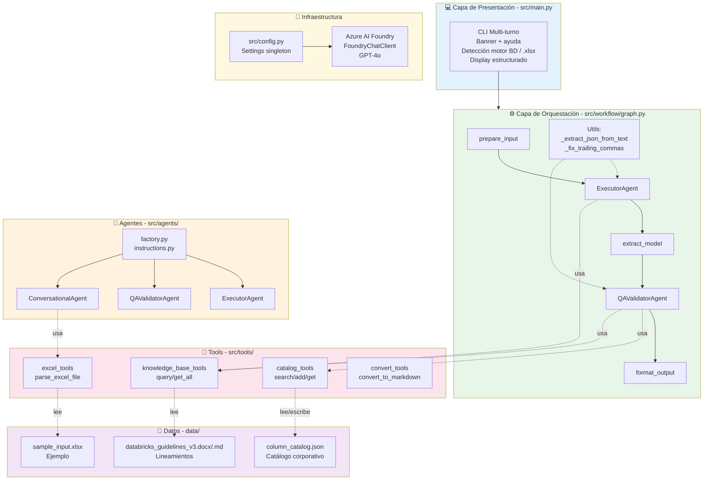

# Arquitectura del Sistema

## Visión general

El **Data Modeler Agent** es un sistema multi-agente que transforma definiciones funcionales de tablas y columnas en modelos de datos profesionales con DDL ejecutable. Está construido sobre el **Microsoft Agent Framework** y utiliza **Azure AI Foundry** como backend de inferencia LLM.

El diseño sigue los principios de:

- **Separación de responsabilidades**: cada agente tiene un rol claro y acotado.
- **Extensibilidad**: tools y lineamientos configurables sin modificar código.
- **Gobierno de datos**: estandarización automática contra catálogo corporativo.
- **Robustez**: manejo de respuestas LLM con texto adicional, trailing commas y markdown fences.

---

## Diagrama de componentes



---

## Capas del sistema

### 1. Capa de presentación (`src/main.py`)

Interfaz CLI multi-turno construida con **Rich**. Responsabilidades:

- Mostrar banner y ayuda interactiva.
- Parsear input del usuario: detectar rutas `.xlsx`, motor de BD, relaciones FK.
- Invocar `parse_excel_file` para archivos Excel.
- Ejecutar `run_modeling_pipeline` y presentar resultados.
- Manejar comandos especiales: `help`, `engines`, `exit`.

### 2. Capa de orquestación (`src/workflow/graph.py`)

Implementa el pipeline como un **grafo dirigido** usando `WorkflowBuilder`. Cinco nodos:

| Nodo | Tipo | Función |
|------|------|---------|
| `prepare_input` | Executor custom | Transforma input JSON en prompt para ExecutorAgent |
| `ExecutorAgent` | Agent | Genera modelo de datos y DDL |
| `extract_model` | Executor custom | Extrae JSON de la respuesta LLM, prepara prompt QA |
| `QAValidatorAgent` | Agent | Valida modelo, estandariza nombres, actualiza catálogo |
| `format_output` | Executor custom | Combina resultados y emite output final |

El estado del workflow (`WorkflowContext`) transporta:
- `input_data`: datos originales del usuario.
- `target_engine`: motor de BD seleccionado.
- `generated_model`: respuesta raw del ExecutorAgent.

### 3. Capa de agentes (`src/agents/`)

Tres agentes creados por la factoría (`factory.py`) con instrucciones detalladas (`instructions.py`):

- **ExecutorAgent**: genera modelos aplicando lineamientos corporativos.
- **QAValidatorAgent**: valida y estandariza contra catálogo + lineamientos.
- **ConversationalAgent**: orquestador de UI (usado para multi-turno futuro).

Cada agente recibe un subconjunto de tools según su responsabilidad.

### 4. Capa de tools (`src/tools/`)

Funciones decoradas con `@tool` del Agent Framework:

- **knowledge_base_tools**: carga y consulta lineamientos corporativos.
- **convert_tools**: convierte transparentemente archivos PDF/DOCX a Markdown estructurado usando Docling con caché local.
- **excel_tools**: parser robusto de `.xlsx` con header matching flexible.
- **catalog_tools**: CRUD thread-safe sobre catálogo + similitud por keywords.

### 5. Capa de datos (`data/`)

- **column_catalog.json**: catálogo corporativo de columnas estandarizadas (mutable en runtime).
- **databricks_guidelines_v3.docx**: reglas de naming, tipos de dato, auditoría (inmutable en runtime, convertido a `.md` tras bambalinas).
- **sample_input.xlsx**: archivo de ejemplo para pruebas.

### 6. Capa de infraestructura (`src/config.py`)

Singleton `Settings` que carga variables de `.env`:

- Credenciales Azure (Service Principal).
- Endpoint y modelo de AI Foundry.
- Rutas a datos (guidelines, catálogo).
- Motor de BD por defecto.

---

## Decisiones de diseño

### KnowledgeBaseAgent como Tools

En lugar de un agente independiente, los lineamientos se implementan como **tools compartidas** (`query_guidelines`, `get_all_guidelines`) que el ExecutorAgent y QAValidatorAgent invocan directamente. Esto reduce latencia y simplifica el grafo.

### Extracción robusta de JSON

Los LLMs frecuentemente envuelven JSON en markdown fences (` ```json ... ``` `), agregan texto preamble, o generan trailing commas. La función `_extract_json_from_text` maneja estos casos con tres estrategias progresivas:

1. Detección de fences markdown.
2. Parsing directo si empieza con `{`.
3. Búsqueda de primer `{` y último `}` balanceados.

### Thread safety en catálogo

El catálogo corporativo se accede con un `threading.Lock` global para soportar concurrencia segura en futuras extensiones (API web, workers paralelos).

### Similitud por keywords

La búsqueda en catálogo usa **Jaccard similarity** sobre tokens (palabras), removiendo stopwords en español e inglés. Umbral de 0.3 para candidatos, 0.5 para match firme.

---

## Flujo de datos

```
Input usuario          Prompt estructurado       JSON modelo
  (texto/xlsx)    ──▶   para ExecutorAgent   ──▶  + DDL
       │                                            │
       │                                            ▼
       │                                     Prompt para QA
       │                                            │
       │                                            ▼
       │                                     JSON validado
       │                                     + QA report
       │                                     + catálogo actualizado
       │                                            │
       ▼                                            ▼
  CLI display ◀──────────────────────────── JSON resultado final
  (Rich tables, panels, DDL)
```

---

## Dependencias externas

| Paquete | Versión | Uso |
|---------|---------|-----|
| `agent-framework` | ≥0.1 | Framework multi-agente de Microsoft |
| `azure-identity` | ≥1.15 | Autenticación Service Principal |
| `pydantic` | ≥2.0 | Validación de schemas |
| `openpyxl` | ≥3.1 | Lectura de archivos Excel |
| `rich` | ≥13.0 | Formateo de consola CLI |
| `python-dotenv` | ≥1.0 | Carga de variables de entorno |
| `docling` | `~=2.90.0` | Conversión robusta de PDF/DOCX a Markdown estructurado |
