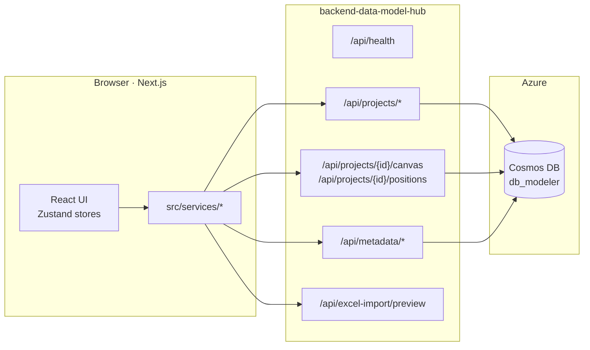
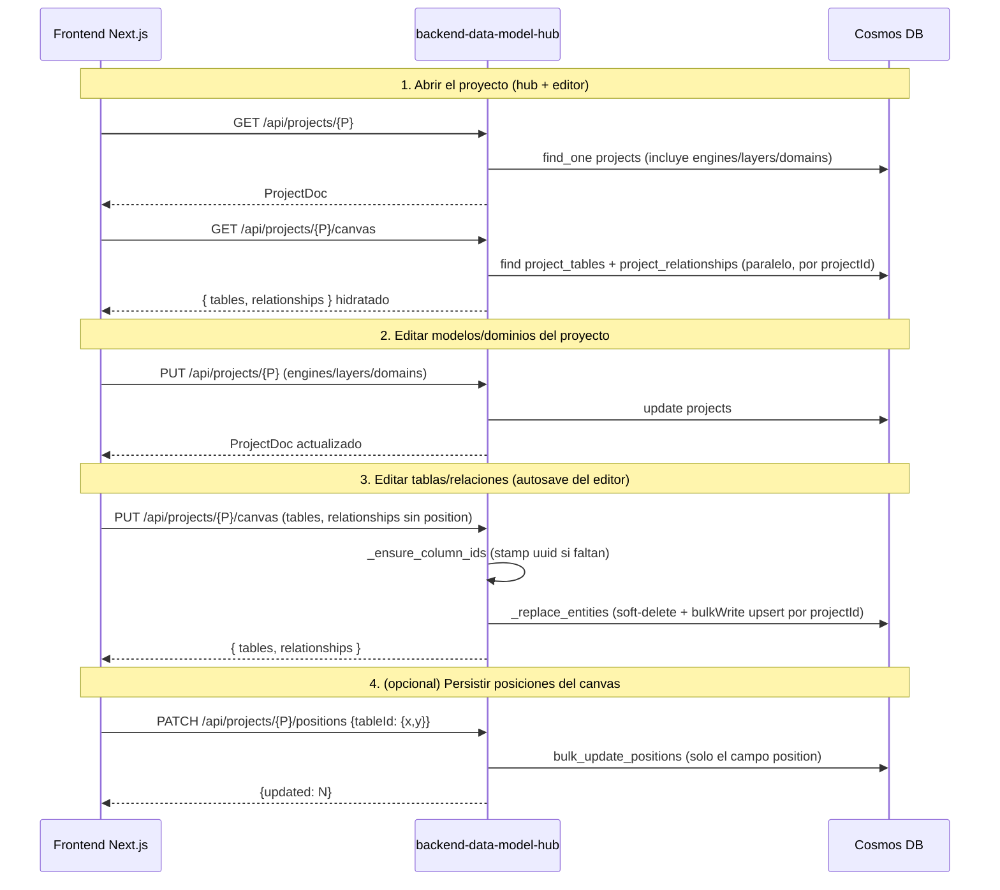

# Arquitectura — `backend-data-model-hub`

> Backend **de plataforma** del Data Modeler. Resuelve el CRUD de **proyectos**
> (con su jerarquía embebida), la persistencia del **canvas** (tablas +
> relaciones), el catálogo de **metadata** (Semantic Types / UDP) y la
> previsualización del **import desde Excel**. **MVP sin auth ni permisos**
> (abierto/anónimo). **No** ejecuta agentes LLM: el modelado conversacional vive
> en el servicio separado `app-agents-modeler` (fuera del MVP).

## 1. Visión general



**Stack**: Python 3.12 (Databricks Apps usa 3.11) · FastAPI · Pydantic v2 ·
Motor (async MongoDB) · openpyxl · rapidfuzz · Azure Cosmos DB for MongoDB.

**Procesos en juego**: 1 proceso FastAPI por deploy + 1 cuenta de Cosmos DB. No
hay broker de colas, ni caché Redis, ni dependencia de Azure AI Foundry (eso vive
solo en `app-agents-modeler`). El backend arranca en segundos, tiene huella de RAM
baja y es **stateless** (encaja en Databricks Apps).

### Topología de colecciones (`db_modeler`)

| Servicio | Colecciones que toca |
|---|---|
| `backend-data-model-hub` (este repo) | `projects`, `project_tables`, `project_relationships`, `semantic_types`, `udps` |
| `app-agents-modeler` | `column_catalog` (diccionario semántico del agente) |

Ambos apuntan al **mismo cluster y database** pero tocan colecciones disjuntas.
Este backend **no toca** `column_catalog`.

> La colección `users` puede existir con datos legacy, pero este backend **ya no
> la administra**: la auth/permisos se quitaron en el MVP (vuelven al final).

---

## 2. Modelo project-centric ("Aurora")

La jerarquía es **Proyecto → Modelo (nivel) → Dominio → Tabla → Columnas + Vistas**:

- Un **Proyecto** posee sus `engines[]`, sus `layers` (los "Modelos / niveles",
  p. ej. RDV·UDV·DDV) y sus `domains` (productos de datos **verticales** que
  cruzan niveles). Esos tres arreglos son chicos y se **embeben** en el
  documento del proyecto.
- Las **Tablas** viven en `project_tables` (shard key `projectId`), etiquetadas
  con `layer` (id de ModelLevel), `domain` (id de Domain) y `subdomain`, y
  **embeben** sus vistas SQL por rol (`views[]`).
- Las **Relaciones** viven en `project_relationships` (shard key `projectId`)
  con la forma anidada `source`/`target`/`cardinality`.

No existe la noción de "un diagrama por modelo": hay **un único canvas por
proyecto**, y lo que se ve se controla en el frontend con el *Scope*.

---

## 3. Capas del sistema

> **Monolito modular.** `app/core/` (infraestructura compartida) +
> `app/features/<x>/` (vertical slices: `router · service · repository · schemas
> · models`). Cada feature se importa solo por su `__init__` (API pública).
> Convención y "cómo agregar una feature" en
> [`feature-architecture.md`](feature-architecture.md).

### 3.1 Punto de entrada — `app/main.py`

`create_app()` arma la app FastAPI, configura CORS + middleware de logging y
monta los routers de las features. `api/main.py` queda como **shim** de
compatibilidad (`uvicorn api.main:app` sigue vivo; el entrypoint canónico es
`app.main:app`). El **lifespan** abre Motor al arrancar y crea índices:

| Singleton | Tipo | Resiliencia ante fallo |
|---|---|---|
| `motor_client` (Cosmos DB) | `AsyncIOMotorClient` + `ensure_indexes` | si falla, `app.state.db_connected = False` y `/api/health` lo reporta; los endpoints que usen DB devuelven 500 |

### 3.2 Routers (`app/features/*/router.py`) — todos abiertos (MVP sin auth)

| Router | Prefijo | Responsabilidad |
|---|---|---|
| `health` | `/api/health` | liveness + flag `db_connected` |
| `projects` | `/api/projects/*` | CRUD de proyectos + su jerarquía embebida (engines/layers/domains) |
| `canvas` | `/api/projects/{id}/canvas`, `/api/projects/{id}/positions` | hidratar y reemplazar tablas+relaciones; persistir posiciones |
| `metadata` | `/api/metadata/*` | catálogo transversal de Semantic Types / UDP |
| `excel_import` | `/api/excel-import/preview` | preview normalizado de un `.xlsx` |

> No hay routers `auth` / `users` / `models`: la auth y los permisos se quitaron
> (MVP abierto) y el canvas reemplazó a la antigua colección `models`.

### 3.3 Infraestructura compartida (`app/core/`)

```
app/core/
├── api/envelope.py        # ok({...}) → {success: true, data: ...}
├── db/{client,indexes}.py # Motor singleton + ensure_indexes
└── config.py · logging.py · models.py (DOC_CONFIG · TagDoc compartido)
```

> **Identidad / permisos**: el MVP es **abierto/anónimo** — no hay capa de auth
> ni guards de permisos (se quitaron las features `auth`/`users` y `core/security`).
> Cuando se reintroduzcan (matriz robusta), la identidad vendrá del proxy de
> Databricks Apps (cabecera `X-Forwarded-Email`). Ver `../plan-migracion-databricks.md`.

### 3.4 Capa de datos — repositorios por feature

Cada feature tiene su `repository.py` (CRUD en Cosmos) y su `models.py` (Pydantic
v2, espejo de las interfaces TS del frontend, `extra="ignore"`):

```
app/features/projects/{models,repository}.py   # proyectos (soft-delete + cascade)
app/features/canvas/{models,repository}.py      # tablas + relaciones (get/replace/positions/delete)
app/features/metadata/{models,repository}.py    # Semantic Types / UDP (catálogo global)
app/core/db/client.py                           # singleton AsyncIOMotorClient + get_db
```

**Colecciones e índices** (creados idempotentemente al arranque):

| Colección | Shard / PK | Índices |
|---|---|---|
| `projects` | `_id` (uuid) | soft-delete `flgactive`; embebe `engines`/`layers`/`domains`; cascade al canvas |
| `project_tables` | `projectId` | `(projectId)`, `(projectId, layer)`, `(projectId, domain)`; embebe `views[]` |
| `project_relationships` | `projectId` | `(projectId)`; forma anidada `source`/`target`/`cardinality` |
| `semantic_types`, `udps` | `_id` | `(flgactive)`; catálogo transversal |

`canvas/repository._replace_entities` hace **soft-delete + bulkWrite `ReplaceOne(upsert)`**:
marca los docs viejos del proyecto como `flgactive=false` y luego upserta los
nuevos, evitando `E11000` sobre filas previamente soft-eliminadas. `projectId`
se **inyecta al escribir y se elimina al leer** (no es campo de `TableDoc` /
`RelationshipDoc`). `_ensure_column_ids` stampa un UUID en cualquier columna que
llegue sin `id` (safety-net, ver §6).

### 3.5 Feature Excel-import — `app/features/excel_import/`

Módulo aislado (sin estado compartido) montado en `/api/excel-import/preview`.
Pipeline 100 % determinista (sin LLM): bytes → `reader` → `service` →
`normalizer` → `ExcelPreview`. Ver `doc/workflow.md`.

---

## 4. Identidad (MVP abierto)

El MVP **no tiene autenticación ni permisos**: todos los endpoints son públicos
y la app es anónima. El modelo de roles (`admin/editor/viewer`) y los permisos
por proyecto se **reintroducirán al final** como una matriz robusta; entonces la
identidad la proveerá el proxy de **Databricks Apps** (OBO, cabecera
`X-Forwarded-Email`), mapeada a una colección de usuarios. Detalle en
`../plan-migracion-databricks.md` (§6) y `../DEPLOY-databricks.md`.

---

## 5. Flujo end-to-end: abrir y editar un proyecto



**Decisiones de diseño visibles en este flujo**:

1. El canvas se hidrata con **dos colecciones por `projectId`** (con índice), no
   con `$lookup` — Cosmos RU no recomienda joins amplios.
2. `PUT /canvas` **reemplaza en bloque** tablas y/o relaciones (lo que llegue en
   el body). El frontend lo invoca con debounce desde el editor.
3. `PUT /canvas` **omite `position`** a propósito (el store lo stripea): las
   posiciones se escriben solo por `PATCH /positions`, para que un Save en una
   pestaña no pise un drag de otra. En la práctica el editor actual trata las
   posiciones como **per-sesión** (auto-organiza al abrir).

---

## 6. Decisiones de diseño

### Por qué separar el backend de plataforma del backend del agente
El modelado conversacional (LLM) tiene un perfil de recursos muy distinto:
Azure AI Foundry, tokens-por-minuto, semáforos de concurrencia, dependencias
pesadas. Mantenerlo en `app-agents-modeler` permite escalar y desplegar ambos
de forma independiente. Este backend solo depende de Cosmos DB.

### Por qué project-centric (y no "models")
El rediseño Aurora unificó el modelo: un proyecto tiene un único canvas, con sus
niveles y dominios embebidos. Re-shardear las tablas/relaciones por `projectId`
da hidratación con latencia constante y elimina la capa intermedia "modelo =
diagrama" que antes complicaba la navegación.

### Por qué `_ensure_column_ids` es defensivo
Los `id` estables de columna sobreviven a renames y son la base de las
relaciones FK (los endpoints apuntan a `TableColumn.id`, no a `name`). Un import
de Excel o un cliente desactualizado podría enviar columnas sin id; el helper es
idempotente, barato y mantiene la invariante de que **toda columna persistida
tiene un uuid**.

### Por qué el Excel-import no toca el LLM
La normalización de tipos es resoluble con regex + fuzzy (`rapidfuzz`, threshold
75). Es rápido, determinista y reentrante. Lo que no encaja queda como
`unknown` y el usuario corrige en la UI. Ver `doc/workflow.md`.
