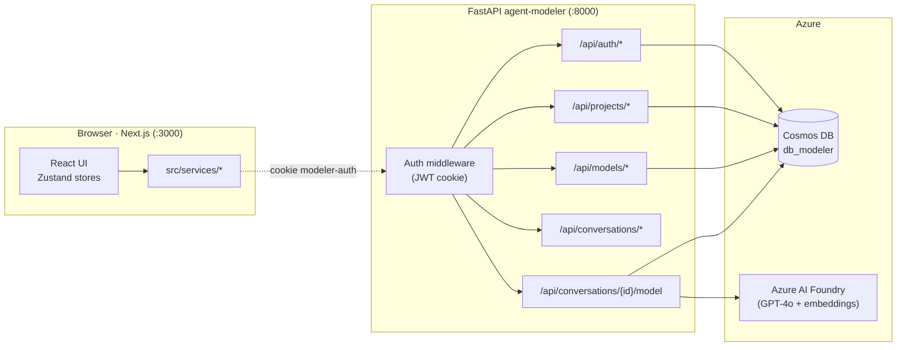
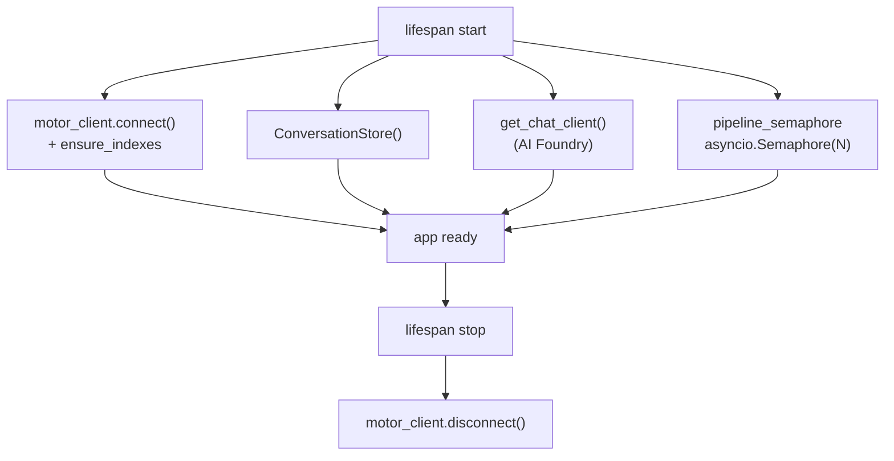
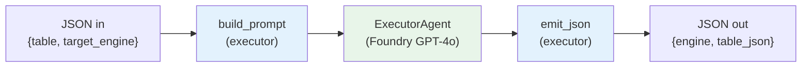
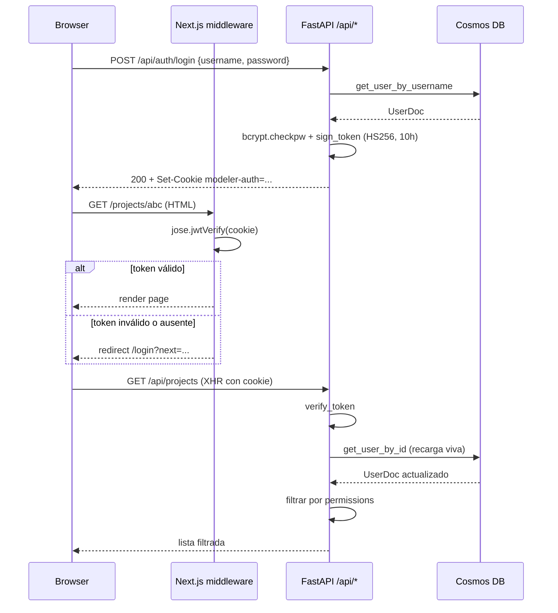
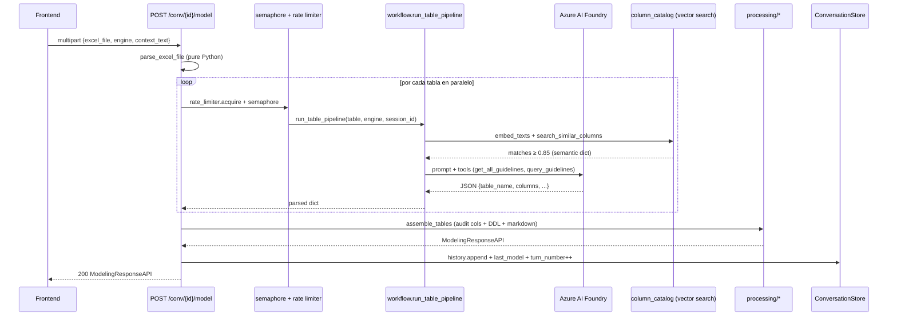
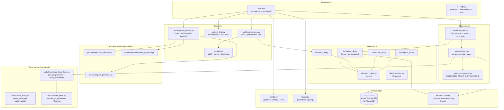

# Arquitectura del Backend — `agent-modeler`

> **Estado**: este documento refleja el rediseño completo del backend
> tras retirar el pipeline multi-agente con QA, migrar la persistencia
> a Cosmos DB / MongoDB y centralizar autenticación con JWT.

## 1. Visión General

`agent-modeler` es un servicio FastAPI que combina dos responsabilidades
complementarias:

1. **Backend transaccional** del frontend (`web-data-model-hub`):
   autenticación con JWT, CRUD de proyectos / modelos / usuarios, todo
   persistido en Azure Cosmos DB for MongoDB.
2. **Pipeline de modelamiento asistido por LLM**: recibe un Excel de
   tablas/columnas, lo modela con un único agente (`ExecutorAgent`)
   apoyado en un diccionario semántico vectorial, y devuelve nombres
   físicos + DDL listos para revisión humana.

El frontend Next.js consume directamente este backend cross-origin con
`credentials: 'include'`. **Ya no existe la capa intermedia
`/api/agent/*` en Next.js** — fue eliminada cuando el backend tomó la
totalidad del API público.



**Procesos en juego**: 1 proceso FastAPI + 1 cuenta de Cosmos DB +
1 proyecto de Azure AI Foundry (GPT-4o + `text-embedding-3-small`).
No hay broker de colas, no hay caché Redis. La concurrencia se acota
con `asyncio.Semaphore` y un rate limiter en memoria.

---

## 2. Capas del Sistema

### 2.1 Punto de entrada — `api/main.py`

Crea la aplicación FastAPI, configura CORS y un middleware de logging
estructurado, y registra los routers. El **lifespan** inicializa los
singletons del proceso:

| Singleton | Tipo | Resilencia ante fallo |
|-----------|------|------------------------|
| `motor_client` (Cosmos DB) | `AsyncIOMotorClient` + ensure indexes | si falla, `app.state.db_connected = False` y los endpoints que usen DB devuelven 500 |
| `ConversationStore` | dict in-memory, `asyncio.Lock` por sesión | siempre se crea |
| `FoundryChatClient` | Azure AI Foundry SDK | si falla, `app.state.chat_client = None` y los endpoints que lo necesitan devuelven 503 |
| `pipeline_semaphore` | `asyncio.Semaphore(MAX_CONCURRENT_PIPELINES)` | siempre se crea (default 5) |



### 2.2 Routers (`api/routes/`)

| Router | Prefijo | Auth | Responsabilidad |
|--------|---------|------|-----------------|
| `health` | `/api/health`, `/api/engines` | público | liveness y motores soportados |
| `auth` | `/api/auth/*` | público (login/logout); `/me` requiere cookie | login/logout/me con JWT cookie |
| `projects` | `/api/projects/*` | `AuthUserDep` (admin para POST/DELETE) | CRUD proyectos |
| `models` | `/api/models/*` | `AuthUserDep` + permisos por modelo | CRUD modelos hidratados |
| `conversations` | `/api/conversations/*` | `AuthUserDep` (excepto `OPTIONS`) | crear/borrar sesiones, subir guidelines |
| `modeling` | `/api/conversations/{id}/model` (POST/GET) | `AuthUserDep` | ejecutar pipeline / leer último modelo |

### 2.3 Capa de servicios (`src/api/`)

```
src/api/
├── auth.py             # JWT sign/verify (HS256), bcrypt, bootstrap admin
├── dependencies.py     # FastAPI Depends + helpers de permisos
├── rate_limit.py       # LLMRateLimiter (token bucket 60s) + call_with_retry
└── response_builder.py # ensambla ColumnAPI/TableAPI → ModelingResponseAPI
```

`dependencies.py` es el wiring: recupera singletons del `app.state`,
valida UUID v4, lee la cookie `modeler-auth`, recarga `UserDoc` desde
DB en cada request (las mutaciones de permisos toman efecto al
instante) y aplica las reglas de visibilidad por proyecto/modelo.

### 2.4 Capa de datos (`src/db/`)

```
src/db/
├── motor_client.py     # singleton AsyncIOMotorClient + ensure_indexes
├── db_models.py        # Pydantic v2 docs (espejo del frontend TS)
├── projects_db.py      # CRUD proyectos
├── models_db.py        # CRUD modelos + child collections + safety net column ids
├── users_db.py         # CRUD usuarios
└── catalog_db.py       # column_catalog (sync pymongo + motor async para vector search)
```

**Colecciones en `db_modeler`** (todas con soft-delete `flgactive`):

| Colección | PK | Notas |
|-----------|-----|-------|
| `users` | `_id` (uuid) | índice único en `username` |
| `projects` | `_id` (uuid) | |
| `models` | `_id` (uuid) | índice `(projectId, updatedAt desc)`. Embebe `domainCatalog`. |
| `model_tables` | `_id` (uuid) | índices `(modelId)`, `(modelId, schema)`, `(modelId, domain)` |
| `model_relationships` | `_id` (uuid) | índice `(modelId)` |
| `model_views` | `_id` (uuid) | índices `(modelId)`, `(modelId, sourceTableId)` |
| `column_catalog` | `_id` = `column_name` | índice texto + **vector search index** `cosmosSearch` 1536d |

`models_db.replace_entities` hace **soft-delete + bulkWrite upsert** —
los docs viejos se marcan `flgactive=false` antes del upsert para
evitar `E11000` en Cosmos DB con docs ya soft-eliminados.

### 2.5 Capa de orquestación — `src/workflow/graph.py`

Pipeline mínimo, **una tabla por ejecución**:



`build_prompt` consulta el **diccionario semántico** vectorial antes de
armar el prompt: si una columna del input tiene definición funcional
con similitud ≥ `VECTOR_SIMILARITY_THRESHOLD` (default 0.85) contra el
catálogo histórico, se inyecta una sección "DICCIONARIO SEMÁNTICO
MANDATORIO" forzando el reuso del nombre físico exacto.

La concurrencia entre tablas vive en `api/routes/modeling.py`: cada
tabla del Excel arranca una instancia del workflow, todas en paralelo
limitadas por `local_sem = asyncio.Semaphore(PER_TABLE_PARALLELISM)`
y por el rate limiter global de tokens-por-minuto.

### 2.6 Procesamiento determinista — `src/processing/`

Todo lo que NO necesita LLM se ejecuta en código Python:

| Módulo | Responsabilidad |
|--------|-----------------|
| `audit_columns.py` | inyecta columnas de auditoría declaradas en `guidelines.audit_columns`, respetando `applies_to` (las tablas `r*` y `t*` no las reciben). Idempotente — si el LLM ya emitió una audit column, no se duplica. |
| `ddl_generator.py` | renderiza `CREATE TABLE` por motor (Databricks SQL, Cosmos DB, SQL Server, PostgreSQL, MySQL). Sin templating de Jinja: solo string concatenation por dialecto. |
| `markdown_generator.py` | arma `export_markdown` (resumen del modelo en MD para descarga / preview). |

### 2.7 Memoria de conversación — `src/conversation.py`

```python
@dataclass
class ConversationState:
    conversation_id: str            # UUID v4 generado por el frontend
    engine: str                     # databricks_sql | cosmosdb | sqlserver | postgresql | mysql
    history: list[dict]             # [{role, content}] resumen por turno
    guidelines_meta: GuidelinesMeta | None
    last_model: dict | None         # payload reusable en GET /model
    turn_number: int                # incrementa solo en turno exitoso
    created_at: float
    updated_at: float
    lock: asyncio.Lock              # serializa mutaciones por sesión
```

Diseño de concurrencia:

- `_root_lock` (1 global) protege creación/borrado de entradas del dict.
- `state.lock` (1 por sesión) protege mutaciones internas.
- `pipeline_semaphore` (default 5) limita ejecuciones paralelas globales.
- `LLMRateLimiter` (default 30 RPM) regula RPM efectivo a Foundry.

> El store es **in-memory por diseño**: las conversaciones son efímeras
> (chat de modelado). El modelo "aplicado al canvas" se persiste en
> Cosmos DB vía `models_db.update_model`, separado del flujo del agente.

---

## 3. Autenticación



**Detalles importantes**:

- **Misma `AUTH_SECRET`** en frontend y backend — la cookie firmada por
  un lado se verifica desde el otro. El middleware Next.js usa `jose`
  (compatible con Edge runtime) y el backend usa `pyjwt`, ambos con
  HS256.
- **Bootstrap admin**: la primera vez que se invoca el login, si no
  hay ningún usuario `admin` en DB se crea `admin / dogadmin2019`.
  Es **idempotente** y se hace dentro del handler para no bloquear el
  arranque del servicio.
- **Recarga viva en cada request**: `get_current_user` no confía en los
  claims del JWT — relee el `UserDoc` desde DB para que cambios de
  permisos / desactivaciones tomen efecto sin esperar a que expire la
  cookie.
- **Permisos** (`src/api/dependencies.py`): granularidad scope-project
  o scope-model, niveles `view` / `edit`. Admin tiene edit total. Las
  funciones replican exactamente las del frontend
  (`@/lib/auth/permissions.ts`).

---

## 4. Flujo End-to-End del Modelado



**Lo que NO está en el camino caliente** (rediseño deliberado):

- ❌ Sin `QAValidatorAgent` — el LLM emite el JSON canónico de una vez.
- ❌ Sin `search_column_catalog` / `add_column_to_catalog` como tools —
  el catálogo se consulta determinísticamente con vector search en
  `build_prompt` y se actualiza fuera del loop crítico.
- ❌ Sin retry de pipeline completo — solo retry localizado en la
  llamada LLM cuando se detecta 429.
- ❌ Sin chunking, sin completion-check tolerante.

Si una tabla falla, el response sigue con las que sí salieron. La
fallida queda registrada en logs y en `_summarize_assistant_turn`.

---

## 5. Diagrama de Componentes Detallado



---

## 6. Decisiones de Diseño

### Por qué un único agente (sin QA)
El pipeline anterior con `ExecutorAgent → QAValidatorAgent` introducía
una segunda llamada al LLM por modelo, regularmente devolvía
correcciones espurias y duplicaba la latencia. El rediseño confía en
el `ExecutorAgent` con un prompt estricto + diccionario semántico
mandatorio: si el LLM se confunde, el revisor humano lo edita en el
frontend (es más barato que pagar otra ronda al LLM).

### Por qué una tabla por ejecución del workflow
- Output ~500 tokens por tabla — sin riesgo de truncamiento.
- Concurrencia trivial: N tablas → N ejecuciones paralelas.
- Si una falla, no contamina el resto.
- Token budget predecible para el rate limiter.

### Por qué Cosmos DB for MongoDB y no SQL nativo
Una única cuenta de Cosmos DB sirve a frontend y backend con la API
MongoDB, lo que permite usar Motor (async) en backend y la SDK estándar
de MongoDB desde scripts auxiliares. Cosmos DB vCore además ofrece
`cosmosSearch` para vector indexes — el diccionario semántico se
construye sobre la misma colección sin necesidad de un servicio aparte.

### Por qué bootstrap admin en el handler de login
Mantiene el deploy "vacío" sin scripts de seed. El primer login
materializa `admin / dogadmin2019` (cambiable inmediatamente) y se
desactiva idempotentemente. Si la creación falla (DB caída) el login
falla con 401 — exactamente el comportamiento que queremos.

### Por qué `ContextVar` para guidelines
Las guidelines son por sesión, pero el pipeline corre en un task
asyncio distinto al de la request. `ContextVar` propaga el `session_id`
al scope del workflow sin pasar el id por todas las firmas — las tools
quedan agnósticas de la sesión y reutilizables desde CLI/tests.

### Por qué el LLM rate limiter es por proceso
El backend está pensado para correr en un único proceso FastAPI por
deploy. Multi-proceso requeriría coordinar tokens en Redis u otro
broker — explícitamente fuera de scope. Si se necesita escalar
horizontalmente, el siguiente paso es desplegar detrás de un load
balancer y mover `LLMRateLimiter` a Redis (interfaz ya está aislada).
