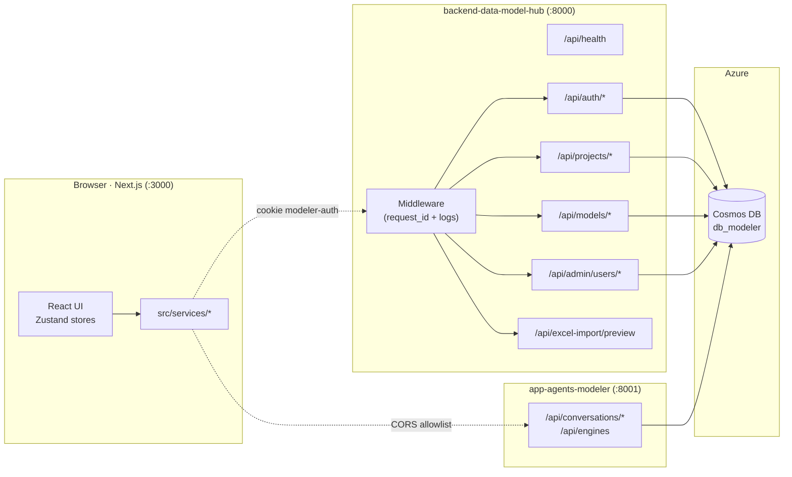
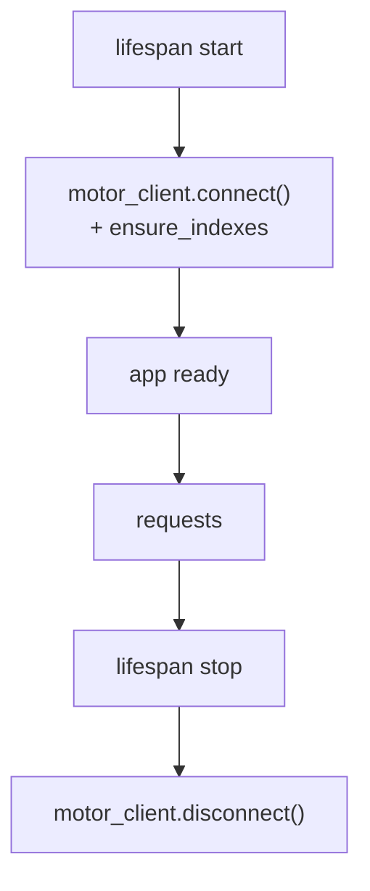
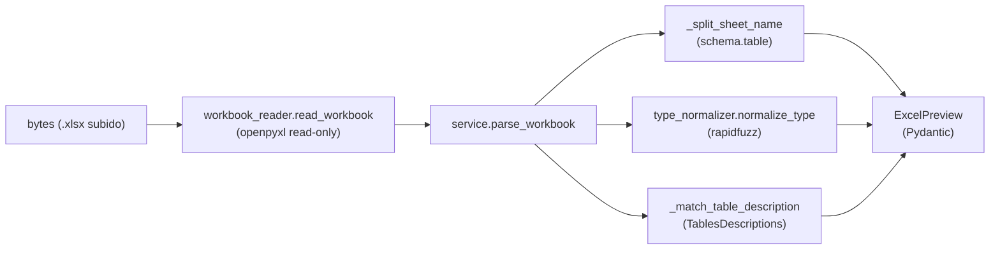
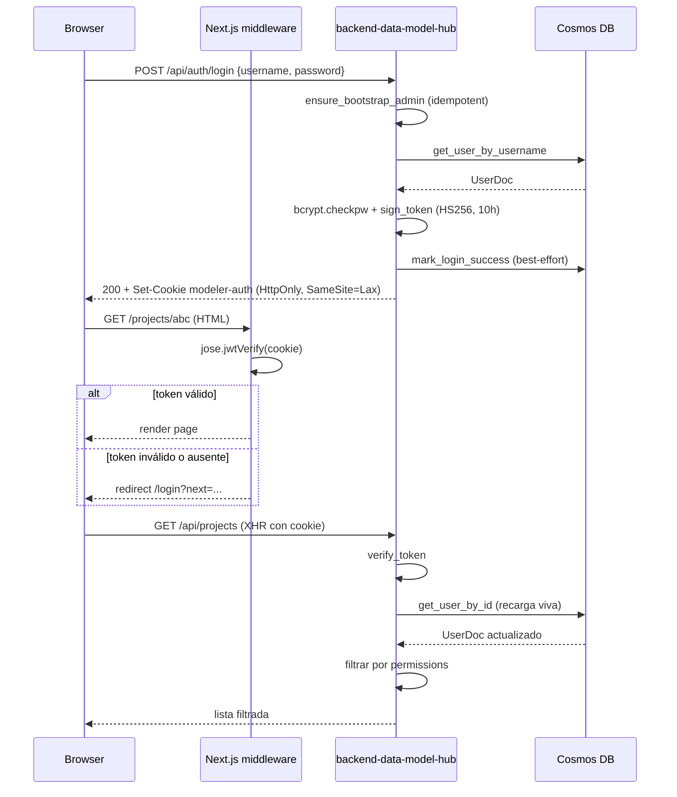
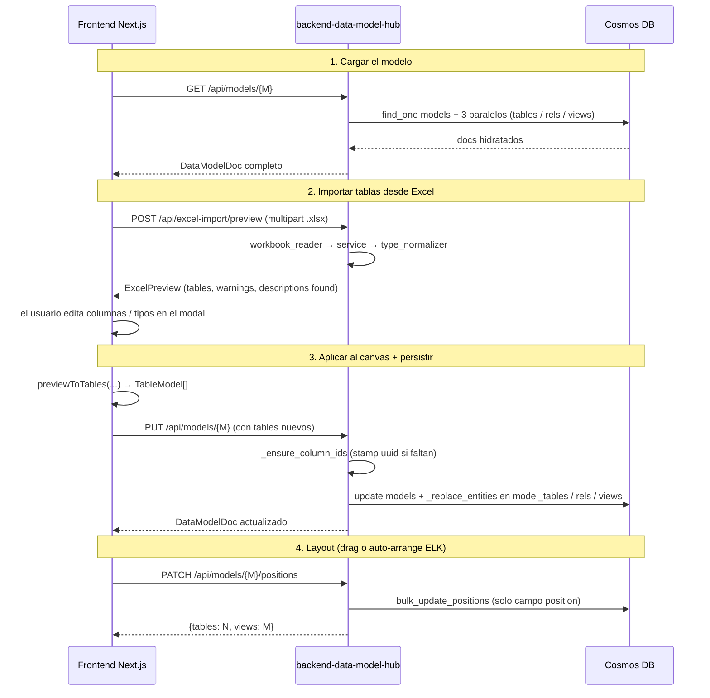
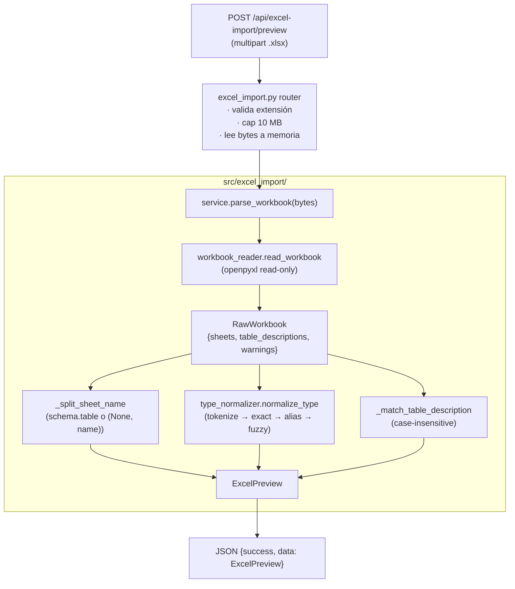

# Arquitectura — `backend-data-model-hub`

> Backend **de plataforma** del Data Modeler. Resuelve autenticación,
> permisos, CRUD de proyectos / modelos / usuarios y la previsualización
> del import desde Excel. **No** ejecuta agentes LLM — el modelado
> conversacional vive en el servicio separado `app-agents-modeler`.

## 1. Visión general



**Stack**: Python 3.12 · FastAPI · Pydantic v2 · Motor (async MongoDB) ·
bcrypt · PyJWT · openpyxl · rapidfuzz · Azure Cosmos DB for MongoDB.

**Procesos en juego**: 1 proceso FastAPI por deploy + 1 cuenta de Cosmos DB.
No hay broker de colas, ni caché Redis, ni dependencia de Azure AI Foundry
(esa vive solo en `app-agents-modeler`).

### Topología de colecciones

| Servicio | Colecciones que toca |
|---|---|
| `backend-data-model-hub` (este repo) | `users`, `projects`, `models`, `model_tables`, `model_relationships`, `model_views` |
| `app-agents-modeler` | `column_catalog` (diccionario semántico) |

Apuntan al **mismo cluster Cosmos** y a la **misma database** (`db_modeler`)
pero tocan colecciones disjuntas — no hay carreras de escritura entre
ellos.

---

## 2. Capas del sistema

### 2.1 Punto de entrada — `api/main.py`

Crea la aplicación FastAPI, configura CORS y el middleware de logging,
y monta los routers. El **lifespan** abre Motor al arrancar:

| Singleton | Tipo | Resilencia ante fallo |
|---|---|---|
| `motor_client` (Cosmos DB) | `AsyncIOMotorClient` + `ensure_indexes` | si falla, `app.state.db_connected = False` y `/api/health` lo reporta; los endpoints que usen DB devuelven 500 |



### 2.2 Routers (`api/routes/`)

| Router | Prefijo | Auth | Responsabilidad |
|---|---|---|---|
| `health` | `/api/health` | público | liveness + flag `db_connected` |
| `auth` | `/api/auth/*` | público (`/login`, `/logout`); `/me` requiere cookie | login / logout / me con cookie `modeler-auth` |
| `projects` | `/api/projects/*` | `AuthUserDep` (admin para POST/DELETE) | CRUD proyectos |
| `models` | `/api/models/*` | `AuthUserDep` + permisos por modelo | CRUD modelos hidratados + PATCH positions |
| `admin` | `/api/admin/users/*` | `AdminDep` | gestión de usuarios y permisos (solo admin) |
| `excel_import` | `/api/excel-import/preview` | `AuthUserDep` | preview normalizado de un `.xlsx` |

### 2.3 Capa de servicios (`src/api/`)

```
src/api/
├── auth.py             # JWT sign/verify (HS256), bcrypt, bootstrap admin
├── dependencies.py     # FastAPI Depends + helpers de permisos
└── response_builder.py # envelope ok({...}) → {success: true, data: ...}
```

`dependencies.py` es el wiring de autorización: lee la cookie
`modeler-auth`, valida el JWT, **recarga `UserDoc` desde Cosmos en cada
request** (un cambio de permisos toma efecto al instante) y expone los
helpers `can_view_project` / `can_edit_model` / `is_admin` que reflejan
el contrato de `web-data-model-hub/src/lib/auth/permissions.ts`.

### 2.4 Capa de datos (`src/db/`)

```
src/db/
├── motor_client.py     # singleton AsyncIOMotorClient + ensure_indexes
├── db_models.py        # Pydantic v2 — espejo de las interfaces TS del frontend
├── projects_db.py      # CRUD proyectos (soft-delete + cascade a modelos)
├── models_db.py        # CRUD modelos + child collections + safety-net column ids
└── users_db.py         # CRUD usuarios (hard-delete; isActive=false para lock-out)
```

**Colecciones en `db_modeler`**:

| Colección | PK | Notas |
|---|---|---|
| `users` | `_id` (uuid) | índice único en `username`; hard-delete |
| `projects` | `_id` (uuid) | soft-delete `flgactive`; cascade a `models` |
| `models` | `_id` (uuid) | índice `(projectId, updatedAt desc)`. Embebe `domainCatalog`. |
| `model_tables` | `_id` (uuid) | índices `(modelId)`, `(modelId, schema)`, `(modelId, domain)` |
| `model_relationships` | `_id` (uuid) | índice `(modelId)` |
| `model_views` | `_id` (uuid) | índices `(modelId)`, `(modelId, sourceTableId)` |

`models_db._replace_entities` hace **soft-delete + bulkWrite upsert** —
los docs viejos se marcan `flgactive=false` antes del upsert para evitar
`E11000` en Cosmos DB sobre rows previamente soft-eliminados. Es el
mismo patrón que usa el frontend en `web-data-model-hub/src/server/db/mongo.ts`.

### 2.5 Feature Excel-import — `src/excel_import/`

Módulo aislado (no comparte estado con el resto del backend) que se monta
como router en `/api/excel-import/preview`.

```
src/excel_import/
├── __init__.py           # superficie pública: parse_workbook, normalize_type
├── schemas.py            # Pydantic v2 — ExcelPreview, PreviewTable, PreviewColumn
├── workbook_reader.py    # openpyxl read-only → RawWorkbook
├── service.py            # orquestador (split schema.tabla, match descripciones)
└── type_normalizer.py    # pipeline tokenize → exact → alias → fuzzy
```

Pipeline funcional (sin estado entre requests):



Decisiones clave:
- El parsing es **100 % determinista**, sin LLM. El frontend recibe el
  preview, lo edita en el modal y luego invoca el PUT habitual a
  `/api/models/{id}` con las tablas resultantes.
- La normalización de tipos sigue el orden `tokenize → exact → alias →
  fuzzy` con un umbral configurable (`FUZZY_THRESHOLD = 75.0`). Cualquier
  string que no supere el umbral queda con `matched_via="unknown"` para
  que el usuario corrija en la UI — no se bloquea el import.
- La hoja `TablesDescriptions` es opcional (match case-insensitive); si
  no existe, las tablas vienen sin descripción y todo lo demás funciona.

Ver `doc/workflow.md` para el detalle del pipeline.

---

## 3. Autenticación



**Detalles importantes**:

- **`AUTH_SECRET` compartido** entre frontend y backend — la cookie
  firmada por uno se valida del otro. El middleware Next.js usa `jose`
  (Edge runtime) y este backend usa `PyJWT`, ambos con HS256 y 10 h de
  vida. Si los dos `.env` divergen, 401 silencioso en todas las requests.
- **Bootstrap admin**: la primera vez que se invoca `/api/auth/login`, si
  no existe ningún usuario `admin` en DB se crea `admin / dogadmin2019`.
  Es **idempotente** y se hace dentro del handler para no bloquear el
  arranque del servicio (`src/api/auth.py::ensure_bootstrap_admin`).
- **Recarga viva por request**: `get_current_user` no confía en los
  claims del JWT — relee `UserDoc` desde DB para que cambios de permisos
  / desactivaciones tomen efecto sin esperar a que expire la cookie.
- **Permisos** (`src/api/dependencies.py`): granularidad scope-project o
  scope-model, niveles `view` / `edit`. Admin tiene `edit` total. Las
  funciones replican exactamente `web-data-model-hub/src/lib/auth/permissions.ts`.

---

## 4. Flujo end-to-end: editar un modelo + importar Excel



**Decisiones de diseño** que se ven en este flujo:

1. `GET /api/models/{id}` hace 4 queries en paralelo (`asyncio.gather`)
   en lugar de un `$lookup` — Cosmos DB RU no recomienda joins amplios y
   las child collections ya tienen índice por `modelId`.
2. `PATCH /positions` es un endpoint dedicado que solo escribe el campo
   `position`. Sin él, el handler de drag (≈500 ms debounce) tendría que
   re-enviar todo el modelo (potencialmente varios MB) por cada cambio.
3. `_ensure_column_ids` es una safety-net: el frontend ya stampea UUID
   en columnas nuevas, pero un import desde Excel o un cliente
   desactualizado podría llegar sin `id`. Las relaciones referencian
   `TableColumn.id` (no `name`), así que un id faltante rompe edges.

---

## 5. Excel-import (vista de capas)



Detalles que afectan el contrato HTTP:

- `schema` se serializa con `by_alias=True` (el atributo Python es
  `schema_` porque `BaseModel.schema()` está deprecado pero todavía
  expuesto en Pydantic v2; el JSON sale como `"schema"`).
- `matched_via` es un literal: `"exact" | "alias" | "fuzzy" | "unknown" |
  "empty"`. El frontend lo usa para pintar el badge bajo el dropdown del
  tipo (`unknown` aparece naranja para invitar a corregir).
- Si el archivo tiene ≥1 hoja vacía, el response trae `warnings` con el
  detalle — no se levanta excepción.

---

## 6. Decisiones de diseño

### Por qué separar el backend de la plataforma del backend del agente
El servicio de modelado conversacional (LLM) tiene un perfil de recursos
muy distinto: necesita Azure AI Foundry, tokens-por-minuto, semáforos
para concurrencia de pipeline, dependencias pesadas (Docling, openai SDK,
agent-framework). Mantenerlos separados permite escalarlos y desplegarlos
de forma independiente. Este backend arranca en segundos, tiene huella
RAM baja y sus únicas dependencias externas son Cosmos DB y la cuenta de
JWT del frontend.

### Por qué Cosmos DB for MongoDB y no SQL nativo
Una única cuenta de Cosmos DB sirve a frontend y backend con la API
MongoDB, lo que permite usar Motor (async) acá y la SDK estándar de
MongoDB desde scripts auxiliares. Las colecciones hijas (`model_tables`,
etc.) tienen índices compuestos por `modelId` que dan latencia constante
para la hidratación.

### Por qué un único proceso FastAPI
El backend está pensado para correr en un único proceso por deploy.
Multi-proceso requeriría coordinar la cache de bootstrap admin
(`_bootstrap_done`) y revisar la concurrencia de Motor. Si se necesita
escalar horizontalmente, el siguiente paso es desplegarlo detrás de un
load balancer (todos los handlers son stateless excepto el flag de
bootstrap, que es idempotente).

### Por qué el Excel-import no toca el LLM
La normalización de tipos es resoluble con texto/regex/fuzzy. Pagarle al
LLM cada vez que el usuario sube un Excel sería lento, caro y
no-determinista. El pipeline actual (`rapidfuzz` con `fuzz.ratio` y
threshold 75) corrige typos comunes (`decximam → decimal`, `datatime →
datetime`) sin riesgos. Lo que no encaja queda en `unknown` y el usuario
corrige a mano.

### Por qué `_ensure_column_ids` es defensivo aunque el frontend stampea ids
Los ids estables sobreviven a renames y son la base de las relaciones FK.
Un cliente desactualizado, un script de migración, o un futuro importador
podría enviar columnas sin id — y eso rompería las edges del canvas en
silencio. El helper es idempotente, barato, y mantiene la invariante de
que **toda columna persistida tiene un uuid**.
