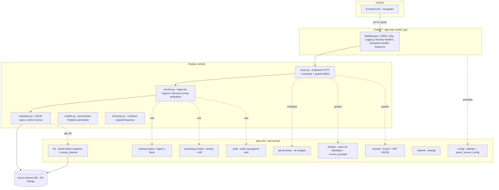
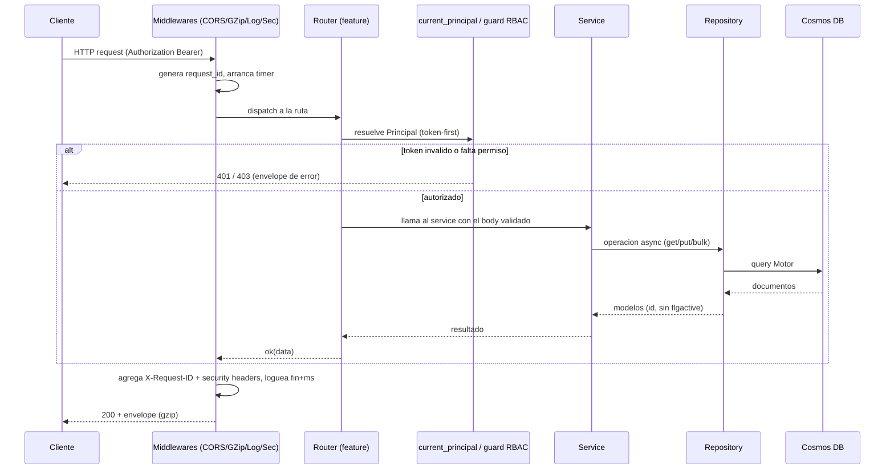
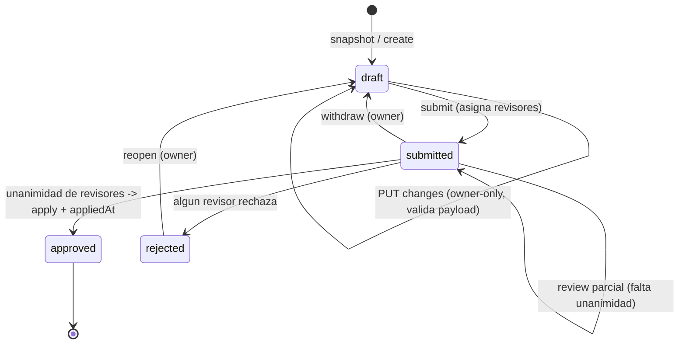
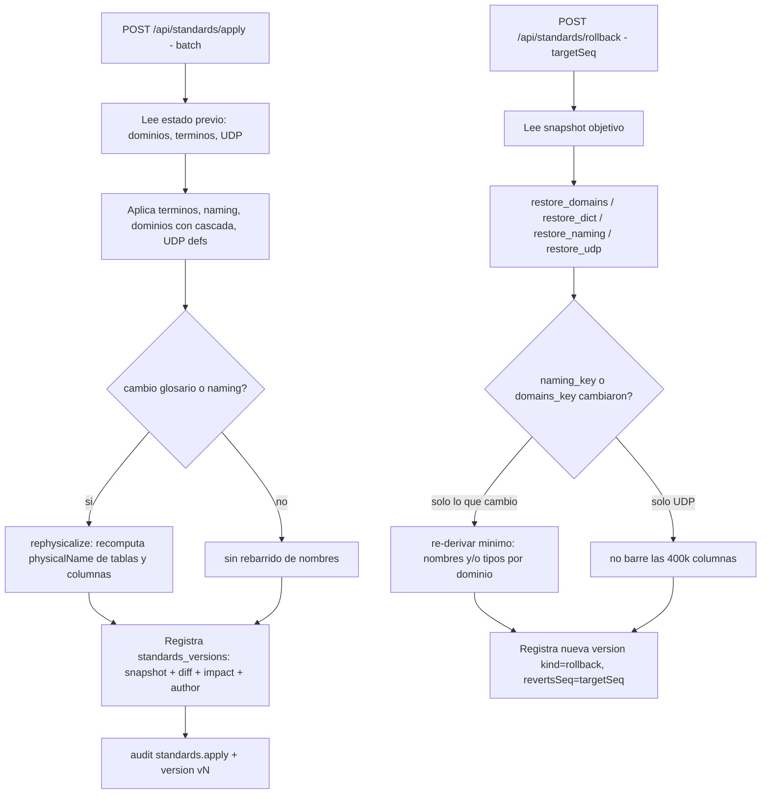
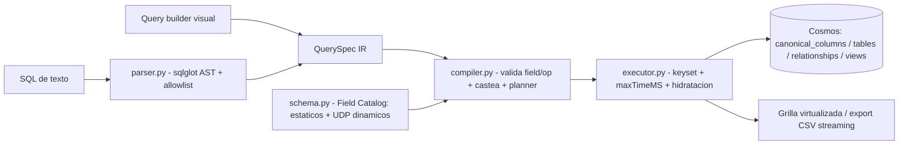
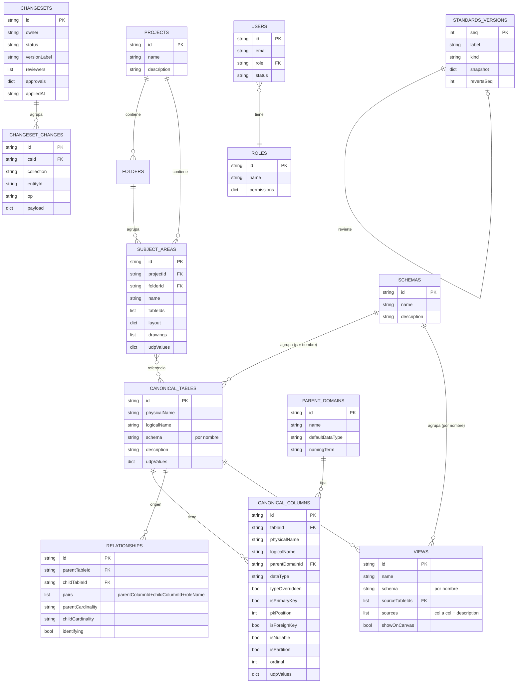

# Arquitectura del Backend — Data Model Hub (`backend-data-model-hub`)

Documento de arquitectura del servicio de plataforma del Data Model Hub. Describe la visión, las capas, el stack, el árbol de carpetas, el ciclo de vida de un request, los flujos de negocio clave, las consideraciones de base de datos y el despliegue. Está escrito a partir del código real de `app/main.py`, `app/core/` y `app/features/`.

> **ACTUALIZACIÓN 2026-07-19 (doc 28 de `plan-implementacion/`):** la base de
> datos productiva es **Databricks Lakebase Postgres** (proyecto `dmh-proj`,
> branch `production`, base `databricks_postgres`, schema PG `dmh`). Donde este
> documento dice "Cosmos/Motor", el acceso pasa hoy por el seam
> `app/core/db/client.py` con `DB_BACKEND=lakebase|cosmos`: el adaptador
> `app/core/db/lakebase/` emula la superficie Motor sobre tablas
> `(id text PK, doc jsonb)` — una por colección — con credenciales OAuth
> rotativas del SDK de Databricks. Los repositorios NO cambiaron: el contrato
> de documentos, filtros y pipelines descrito acá sigue siendo el vigente.
> Cosmos queda como legacy/rollback (`DB_BACKEND=cosmos`). Detalle completo:
> `plan-implementacion/28-MIGRACION-LAKEBASE.md`.

---

## 1. Visión y responsabilidades

El backend es el **composition root** de la plataforma del Data Modeler: una API REST en FastAPI que administra proyectos, el modelo de datos canónico y su persistencia en Azure Cosmos DB (API de Mongo). Es el cerebro de gobierno del modelo: gobierna quién puede editar, cómo se versiona un cambio, cómo se aprueba y publica a producción, y cómo se consulta la metadata para reporting.

Responsabilidades concretas, tomadas del docstring de `main.py` y de las features:

- **Catálogo canónico universal**: tablas y columnas (`canonical_tables`, `canonical_columns`) como un pool universal, no atado a un proyecto.
- **Estructura tipo Erwin**: proyectos, carpetas del Model Explorer y subject areas (canvases) que referencian un subconjunto del pool y guardan su layout.
- **Versionado y aprobación del modelo**: sesión de edición (working copy) → changeset → submit → review → approve → publish a producción, con política de unanimidad de revisores.
- **Data Standards versionados**: glosario de abreviaturas, Parent Domains, definiciones UDP y configuración de naming, con historial append-only y rollback determinista.
- **Motor de consulta del reporting**: un IR (`QuerySpec`) que produce el query-builder visual o un parser SQL (sqlglot), compilable a un pipeline de Mongo, con paginación keyset a escala de cientos de miles de columnas.
- **Identidad, RBAC y auditoría**: login propio usuario/contraseña (bcrypt + JWT), matriz de permisos data-driven por rol y log de auditoría de acciones.

Lo que **NO** vive acá: el agente conversacional de modelado (vive en `app-agents-modeler`, fuera de este MVP) y la colección `column_catalog` que ese servicio administra. Las variables de Azure AI Foundry / OpenAI / embeddings tampoco son de este servicio.

---

## 2. Arquitectura por capas

El backend separa dos grandes zonas: **`core`** (infraestructura transversal reutilizable, sin lógica de negocio de una feature) y **`features`** (verticales de negocio autónomas). Cada feature sigue el patrón **router → service → repository → Motor/Cosmos**, con `models` (documentos Pydantic persistidos) y `schemas` (contratos de request/response) como piezas de datos.

### 2.1 Diagrama de capas



### 2.2 Responsabilidad de cada capa dentro de una feature

| Capa | Archivo | Responsabilidad | Regla |
|------|---------|-----------------|-------|
| Router | `router.py` | Declara endpoints, valida el body (schema), aplica guards RBAC, envuelve la respuesta en el envelope y traduce errores de negocio a códigos HTTP (403/404/409/422). | No contiene lógica de negocio. |
| Service | `service.py` | Orquesta el flujo. La política pura (versionado, aprobación, diff, permisos efectivos) vive en funciones **puras** testeables sin DB; las funciones `async` solo coordinan repository + puras + audit. | No toca Mongo directo salvo excepciones puntuales. |
| Repository | `repository.py` | CRUD async contra Cosmos vía `get_db()`. Traduce documento Mongo (`_id`) a modelo (`id`), aplica soft-delete (`flgactive`), bulk writes, guards atómicos. | Único punto que conoce paths de Mongo. |
| Models | `models.py` | Documentos Pydantic persistidos (`*Doc`). Config base `DOC_CONFIG` (`extra="ignore"`, `populate_by_name`). | Invariante de round-trip: un campo que no está en el modelo se descarta al leer. |
| Schemas | `schemas.py` | Contratos de entrada/salida del router (bodies). | Separan la forma de la API de la forma de almacenamiento. |

### 2.3 El envelope estándar

Toda respuesta de éxito se envuelve con `app/core/api/envelope.py`:

```python
def ok(data=None):
    return {"success": True, "data": data}
```

Los errores no controlados devuelven `{"success": False, "error": "..."}` con status 500 (ver el exception handler en §5). Esto le da al frontend un contrato uniforme: siempre `success` + (`data` | `error`).

### 2.4 El invariante de persistencia (round-trip)

Como `DOC_CONFIG` usa `extra="ignore"`, un campo nuevo que se quiera persistir necesita estar declarado **tanto en el modelo TypeScript del front como en el modelo Pydantic `*Doc`**; si no, se descarta silenciosamente al releer (el read path re-valida con `extra="ignore"`). Este es un invariante crítico del proyecto y aparece anotado en varios modelos como "aditivo (invariante §2.6): declarados ⇒ persisten en el round-trip".

---

## 3. Stack tecnológico

| Componente | Tecnología | Versión (de `requirements.txt`) | Rol |
|------------|-----------|--------------------------------|-----|
| Lenguaje | Python | 3.12 | Runtime |
| Framework web | FastAPI | >=0.104.0 | Routing, validación, OpenAPI |
| Servidor ASGI | Uvicorn | >=0.24.0 (`[standard]`) | Servidor HTTP async |
| Driver async DB | Motor | >=3.3.0 | Cliente async de MongoDB/Cosmos |
| Driver base | PyMongo | >=4.0 | Tipos y `UpdateOne`/`ReturnDocument` |
| Base de datos | Azure Cosmos DB (API de Mongo) | tier RU | Persistencia documental |
| Validación/modelos | Pydantic | v2 (>=2.0) | Modelos de documento y schemas |
| Config/env | python-dotenv | — | Carga de `.env` |
| Hash de contraseñas | bcrypt | >=4.0 | Hash con salt de passwords |
| Token de sesión | PyJWT | >=2.8 | JWT HS256 firmado |
| Parser SQL | sqlglot | >=25 | SQL de texto → `QuerySpec` |
| Rate limiting | slowapi | >=0.1.9 | Anti fuerza bruta (login) |
| Testing | pytest + httpx | >=8.0 / >=0.27 | Tests (solo dev) |

Notas de diseño del stack:

- **Async de punta a punta**: Motor + FastAPI. Un único cliente Motor singleton (`app/core/db/client.py`) compartido por todos los repositorios; se abre en el lifespan y se cierra en el teardown. Pool `maxPoolSize=50` con timeouts explícitos (`serverSelectionTimeoutMS=15000`, `connectTimeoutMS=10000`, `socketTimeoutMS=60000`) para que un socket colgado no agote el pool.
- **Pureza y testeo sin DB**: las políticas (aprobación, diff, permisos, naming, overlay, compilación de queries) están aisladas como funciones puras, testeables con pytest sin montar Cosmos.

---

## 4. Scaffolding completo del árbol `app/`

```
app/
├── __init__.py
├── main.py                         Composition root: create_app(), lifespan, middlewares, montaje de routers
│
├── core/                           Infraestructura transversal (sin negocio de feature)
│   ├── config.py                   Settings (env) + assert_secure_config (falla-cerrado del SECRET_KEY)
│   ├── logging.py                  Logging estructurado (pretty|json), get_logger, configure_logging
│   ├── audit.py                    audit() best-effort → colección audit_log (append-only)
│   ├── models.py                   DOC_CONFIG (extra=ignore, populate_by_name), TagDoc, coerce_tags
│   ├── ratelimit.py                Limiter de slowapi (key=IP), activo en prod / RATE_LIMIT_ENABLED
│   ├── security.py                 hash_password/verify_password (bcrypt) + create/decode_access_token (JWT HS256)
│   ├── api/
│   │   └── envelope.py             ok(data) → {success, data}
│   ├── db/
│   │   ├── client.py               Cliente Motor singleton: connect/disconnect/get_db
│   │   └── indexes.py              ensure_indexes: crea índices idempotentes (traga códigos 48/11000)
│   ├── identity/
│   │   ├── models.py               Principal (email, username, display_name, source)
│   │   ├── provider.py             LocalIdentityProvider / DatabricksIdentityProvider (seam)
│   │   └── dependencies.py         current_principal (token-first; fallback al seam salvo REQUIRE_AUTH)
│   ├── naming/
│   │   └── engine.py               physicalize/logicalize (diccionario de abreviaturas, longest-match)
│   └── versioning/
│       └── overlay.py              overlay(published, changes) + summarize_diff (puro)
│
└── features/                       Verticales de negocio (router→service→repository)
    ├── health/                     GET /api/health (ping vivo a Cosmos)
    ├── auth/                        Login propio + sesión (deps.py: require_permission / write_guard)
    ├── admin/                      /api/admin/* (users, roles+matriz, permissions, audit) — admin.manage
    ├── identity/                   /api/me, /api/users (Principal + usuarios simulados)
    ├── domains/                    /api/domains (Parent Domains: tipo default + cascada) — standards.edit
    ├── udp/                        /api/udp (solo lectura de definiciones UDP)
    ├── glossary/                   /api/glossary (abreviaturas + physicalize/logicalize) — standards.edit
    ├── data_standards/            /api/standards (snapshot, apply, rollback, versions) — standards.edit
    ├── catalog/                    /api/catalog (tablas+columnas canónicas) — model.edit
    ├── changesets/                /api/changesets, /api/versions, /api/requests — model.edit / review.decide
    ├── projects/                   /api/projects, /api/subject-areas (canvases + layout + diagram) — model.edit
    ├── folders/                    /api/folders (jerarquía del Model Explorer)
    ├── relationships/             /api/relationships (PK/FK entre tablas)
    ├── views/                      /api/views (vistas SQL)
    ├── summary/                    /api/summary (5 cards del Home)
    ├── settings/                   /api/settings/naming (separador/case por scope) — standards.edit
    └── reporting/                  /api/reporting/tables|columns (tabla de metadata)
        └── query/                  Motor de consulta: spec, schema (Field Catalog), compiler,
                                    parser (SQL→spec), executor (keyset), reports, views (insights), router
```

### 4.1 Qué es cada carpeta de `core`

- **`config`**: expone `settings` (un objeto plano con variables de entorno) y `assert_secure_config()`, que impide arrancar en producción (`REQUIRE_AUTH=true`) con el `SECRET_KEY` de desarrollo público.
- **`db`**: `client.py` es el singleton Motor; `indexes.py` crea los índices al conectar y es idempotente (ignora `NamespaceExists` code 48 y duplicate-key 11000).
- **`identity`**: el seam de identidad. `Principal` es el usuario en sesión; `provider.py` tiene el modo `local` (usuario fake, header `X-Dev-User` para actuar como otro) y `databricks` (lee headers OBO del proxy SSO); `dependencies.py` implementa `current_principal` con estrategia token-first.
- **`security`**: primitivas puras de auth (bcrypt para passwords; JWT HS256 para el token de sesión).
- **`naming`**: motor puro de conversión nombre lógico↔físico, data-driven vía un diccionario de abreviaturas, con longest-match multi-palabra y `case ∈ {upper, lower, camel}`.
- **`versioning`**: `overlay()` (estado efectivo = publicado + cambios del changeset) y `summarize_diff()` (added/modified/removed), ambos puros.
- **`audit`**: `audit()` best-effort que nunca hace fallar la request que la invoca; escribe en `audit_log`.
- **`ratelimit`**: el `Limiter` de slowapi con estado en memoria (por proceso), activo en producción.
- **`api/envelope`**: el wrapper `ok()`.

### 4.2 Qué es una feature

Una feature es un vertical de negocio autónomo. La ilustramos con `catalog`:

- **`models.py`** — `CanonicalTableDoc`, `CanonicalColumnDoc` (documentos persistidos, con `udpValues` embebido y el alias `schema` → `sql_schema`).
- **`schemas.py`** — `CanonicalTableBody`, `CanonicalColumnBody` (bodies del router).
- **`repository.py`** — CRUD contra `canonical_tables`/`canonical_columns`, con búsqueda server-side (`?q=&limit=`) y slices por ids.
- **`service.py`** — deriva el nombre físico vía glosario y el `dataType` vía Parent Domain (`derive_column`).
- **`router.py`** — endpoints `GET/POST /api/catalog/tables`, `.../{id}/columns`, protegidos por `write_guard("model.edit")`.

---

## 5. Ciclo de vida de un request

### 5.1 Arranque (lifespan)

`create_app()` primero llama `assert_secure_config()` (falla-cerrado del `SECRET_KEY`). El `lifespan` async abre la conexión Motor (`db_client.connect()`, que a su vez ejecuta `ensure_indexes`) y marca `app.state.db_connected`; si Cosmos no responde, la app igual arranca pero en estado degradado. En el teardown cierra la conexión.

### 5.2 Pila de middlewares (en el orden de `create_app`)

1. **Rate limiting (slowapi)**: `app.state.limiter` + handler de `RateLimitExceeded` → 429 con `Retry-After`. Se aplica por-ruta (el login lleva `@limiter.limit("5/minute")`).
2. **TrustedHostMiddleware**: solo si `ALLOWED_HOSTS` está definido (postura de producción); rechaza hosts no permitidos.
3. **CORSMiddleware**: allowlist explícita de orígenes (`CORS_ORIGINS`, default `localhost:3000`), `allow_credentials=False` (auth token-first, sin cookies), métodos y headers acotados (no wildcard).
4. **GZipMiddleware**: comprime respuestas > 1024 bytes (los payloads de metadata comprimen 5-10x).
5. **Exception handler de `Exception`**: convierte cualquier crash no controlado en el envelope de error 500. Como corre en `ServerErrorMiddleware` (el más externo), la respuesta no pasa por CORS, así que el handler agrega a mano `Access-Control-Allow-Origin` si el origen está permitido (sin eso el browser vería "Failed to fetch").
6. **Middleware de logging + security headers**: genera un `request_id` de 12 chars, loguea inicio/fin con latencia en ms, y en la respuesta agrega `X-Request-ID`, `X-Content-Type-Options: nosniff`, `X-Frame-Options: DENY`, `Referrer-Policy: no-referrer`, `Permissions-Policy` y, solo sobre HTTPS, `Strict-Transport-Security`.

### 5.3 Diagrama de secuencia de un request



### 5.4 Resolución de identidad (`current_principal`)

Estrategia **token-first** (`app/core/identity/dependencies.py`):

- Si viene `Authorization: Bearer <token>` válido, la identidad sale de los claims del JWT (`sub`, `email`, `name`).
- Si el token está presente pero es inválido/expirado, siempre es **401** (no se cae al fallback: el cliente mandó una sesión).
- Si no hay token y `REQUIRE_AUTH=true` (producción), es **401**.
- Si no hay token y `REQUIRE_AUTH=false` (local/tests), se usa el seam (`LocalIdentityProvider` o `DatabricksIdentityProvider`) para no exigir login al desarrollar.

---

## 6. Workflows clave

### 6.1 Sesión de edición → changeset → submit → review → approve → publish

El **changeset** es la unidad de versionado del modelo. Es cross-project (`projectIds[]`). Los cambios **no** viven embebidos en el documento del changeset: cada cambio es un documento propio en `changeset_changes` con `_id` determinista `{csId}::{collection}::{entityId}` (el dict embebido topaba el límite de 2MB/doc de Cosmos RU con ~2-4k entidades tocadas).

Colecciones versionadas (whitelist dura `VERSIONED`, `changesets/repository.py`): **8 colecciones** — `projects`, `folders`, `subject_areas`, `schemas`, `canonical_tables`, `canonical_columns`, `relationships`, `views`. La estructura del Model Explorer (`projects`/`folders`/`subject_areas`) y la entidad `schemas` (esquema físico de BD) entraron a versionado en 2026-07-16 (antes un draft escribía estructura y esquemas directo a producción). El orden de la tupla es el orden de dependencia del apply (schemas antes que tablas, tablas antes que columnas/relaciones/vistas). Los estándares (glosario/dominios/UDP/naming) **salieron** del changeset: se editan por el módulo Data Standards con escritura global directa y su propio versionado (`standards_versions`).

Máquina de estados:



Puntos críticos del flujo (de `changesets/service.py` y `repository.py`):

- **Validación de payload doble**: al agregar un cambio (`add_change`, feedback inmediato, 422) y de nuevo antes de aplicar (`_apply_and_finalize`, gate autoritativo). Usa los mismos modelos `*Doc` del read path (round-trip garantizado). Sin esto, un upsert malformado entraría a producción tal cual.
- **Escritura de cambios con compensación**: `set_change` protege el estado `draft` con un protocolo de 3 pasos (touch atómico del padre → upsert del cambio con `wtoken` único → re-check y compensación si un submit ganó la carrera).
- **Política de unanimidad**: `approval_outcome` — si algún revisor rechaza → `rejected`; si hay revisores y **todos** aprobaron → `approved` (se aplica); si no, sigue `submitted`. Las decisiones se guardan con `$set` atómico en `approvals.<actor>` (no se pisan entre revisores concurrentes).
- **Guard anti-ABA**: el estado es un string que se repite entre ciclos (withdraw → edit → resubmit vuelve a `submitted`). Los cierres pasan `expect={"submittedAt": ...}` para que un claim tardío no cierre un envío distinto al que el revisor decidió.
- **Apply idempotente**: `apply_changes` usa un `bulk_write` por colección (upsert / soft-delete por `_id`) en orden de dependencia (dominios → tablas → columnas → relaciones → vistas). Si falla, revierte el request a `submitted` y re-lanza; re-aprobar reintenta y converge. `appliedAt` se estampa recién con el apply completo (marcador de "esta versión sí está en producción").
- **RBAC**: crear/editar exige `model.edit`; decidir (aprobar/rechazar/publicar) exige `review.decide`.

Ejemplo de flujo con curl:

```bash
# 1) Crear un draft desde el estado publicado
curl -X POST https://API/api/changesets/snapshot \
  -H "Authorization: Bearer $TOKEN" -H "Content-Type: application/json" \
  -d '{"title":"Alta cliente","description":"nueva tabla","projectIds":["p1"]}'
# -> { "success": true, "data": { "id": "cs-123", "status": "draft", "versionLabel": "v7" } }

# 2) Registrar un cambio (upsert de una columna)
curl -X PUT https://API/api/changesets/cs-123/changes \
  -H "Authorization: Bearer $TOKEN" -H "Content-Type: application/json" \
  -d '{"collection":"canonical_columns","entityId":"col-9","op":"upsert",
       "payload":{"tableId":"t-1","physicalName":"NRO_DOC","logicalName":"numero documento","dataType":"string"}}'

# 3) Enviar a revisión (publish request)
curl -X POST https://API/api/changesets/cs-123/submit \
  -H "Authorization: Bearer $TOKEN" -H "Content-Type: application/json" \
  -d '{"reviewers":["ana","luis"],"title":"Alta cliente v7"}'

# 4) Un revisor aprueba (aplica solo con unanimidad)
curl -X POST https://API/api/changesets/cs-123/review \
  -H "Authorization: Bearer $TOKEN_ANA" -H "Content-Type: application/json" \
  -d '{"decision":"approve"}'
```

Routers hermanos: `GET /api/versions` (filas de versiones cross-project), `GET /api/versions/published` (versión de producción actual), `GET /api/requests?reviewer=&owner=` (publish requests en revisión).

### 6.2 Versionado de Data Standards con rollback

Los estándares (Parent Domains, glosario, definiciones UDP y naming) **no** pasan por el changeset del canvas: se aplican directo a las colecciones publicadas y cada apply/rollback genera una versión en `standards_versions` con el **snapshot completo** del estado tras aplicar (suficiente para rollback determinista). El snapshot es acotado (decenas de dominios + cientos-miles de términos + 2 docs de naming), muy por debajo de 2MB/doc.

Flujo (`data_standards/service.py`):



Detalles:

- **`seq` único**: `insert_version_next_seq` asigna `seq = max+1` y `label = v{seq}`; el índice único en `seq` impide dos versiones con el mismo número ante apply/rollback concurrentes (reintenta hasta 8 veces ante `DuplicateKeyError`).
- **Re-derivación mínima**: el rollback compara `_naming_key` y `_domains_key` del snapshot vs el estado actual; solo re-physicaliza si cambió glosario/naming, y solo re-propaga tipos si cambiaron los dominios. Un rollback de solo-UDP no barre las 400k columnas.
- **RBAC**: apply/rollback exigen `standards.edit`; la lectura de snapshot/versions queda abierta a quien ve el módulo.
- **Cascada de dominios**: al cambiar el `defaultDataType` de un dominio, se re-tipan las columnas sin override (`typeOverridden != true`), respetando el override manual por-dato.

### 6.3 Motor de consulta del reporting

El corazón es `QuerySpec` (`reporting/query/spec.py`): un IR JSON que es la única fuente de verdad, producido por el query-builder visual o por el parser SQL, y consumido por el compiler, la grilla y el export. El cliente **nunca** manda paths de Mongo: manda una `field` key pública que se resuelve contra el **Field Catalog** (`schema.py`), y `op` es un enum cerrado (cero inyección).



Piezas y garantías de escala:

- **Field Catalog dinámico** (`schema.py`): cada vista (`columns`/`tables`/`relationships`/`views`) expone `FieldDef` estáticos + campos UDP dinámicos derivados de `udp_definitions`. Crear un UDP agrega columnas filtrables/agrupables sin tocar código. La `key` pública (`udp.<defId>`) se traduce al `path` de Mongo (`udpValues.<defId>`), cubierto por el índice wildcard `udpValues.$**`.
- **Compiler puro** (`compiler.py`): valida cada campo/op contra el catálogo, castea el value al tipo, y aplica el **planner**: un orden por un campo sin índice se **rechaza** (Cosmos tira 500 en `.sort()` sin índice). `contains`/`startsWith` usan `re.escape` (nunca regex arbitrario).
- **Parser SQL** (`parser.py`): capa fina sobre el mismo IR. Parsea con sqlglot a un AST tipado, camina con allowlist estricto y emite el mismo `QuerySpec`. Rechaza JOIN, subquery, CTE, UNION, DDL/DML y múltiples statements.
- **Executor con keyset** (`executor.py`): paginación por keyset (no skip/limit profundo) sobre el primer campo de orden + `_id` de desempate; `maxTimeMS=15000` como circuit-breaker; proyección mínima; hidratación de nombres (dominio, UDP, schema) en Python post-fetch. El cursor se valida para aceptar solo escalares (un dict/list inyectaría operadores Mongo).
- **Export CSV por streaming**: `POST /api/reporting/export` keyset-pagina internamente y hace yield línea por línea (O(1) memoria).

Ejemplos:

```bash
# QuerySpec directo (columnas con override, ordenadas por physicalName)
curl -X POST https://API/api/reporting/query -H "Content-Type: application/json" -d '{
  "from": "columns",
  "select": ["physicalName","logicalName","dataType","parentDomainId"],
  "where": {"op":"and","conditions":[{"field":"typeOverridden","op":"eq","value":true}]},
  "orderBy": [{"field":"physicalName","dir":"asc"}],
  "limit": 100
}'
# -> { "success": true, "data": { "rows": [...], "columns": [...], "nextCursor": "...", "hasMore": true } }

# El mismo motor vía SQL de texto
curl -X POST https://API/api/reporting/query/sql -H "Content-Type: application/json" \
  -d '{"text":"SELECT dataType, COUNT(*) AS n FROM columns GROUP BY dataType ORDER BY n DESC LIMIT 20"}'
```

Además, hay vistas curadas de insights (`/api/reporting/insights/scorecard`, `/udp-coverage`, `/domain-usage`, `/glossary-usage`, `/relationships`) y reportes guardados por usuario (`/api/reporting/reports`, colección `saved_reports`, validados como `QuerySpec` bien formado antes de persistir).

---

## 7. Consideraciones de base de datos (Azure Cosmos DB, API de Mongo)

### 7.1 Colecciones principales

| Colección | Contenido | Feature |
|-----------|-----------|---------|
| `users` | Usuarios del app (`_id` = username, `passwordHash` nunca se expone) | auth/admin |
| `roles` | Roles + matriz de permisos data-driven | auth/admin |
| `projects` | Proyectos (contenedor padre) | projects |
| `folders` | Carpetas del Model Explorer (jerarquía) | folders |
| `subject_areas` | Canvases: `tableIds[]` + `layout` + `drawings` | projects |
| `schemas` | Esquema físico de BD como entidad (`name` único; tablas/vistas lo referencian por string, sin FK) | schemas |
| `canonical_tables` | Tablas canónicas (pool universal, `udpValues` embebido) | catalog |
| `canonical_columns` | Columnas canónicas (`tableId`, `parentDomainId`, `udpValues`) | catalog |
| `relationships` | PK/FK entre tablas (source/target + cardinalidad) | relationships |
| `views` | Vistas SQL | views |
| `changesets` | Cabecera del changeset (estado, revisores, approvals) | changesets |
| `changeset_changes` | Un doc por cambio (`_id` determinista) | changesets |
| `standards_versions` | Historial append-only de estándares (snapshot + diff) | data_standards |
| `parent_domains` | Parent Domains (tipo default + cascada) | domains |
| `glossary_terms` | Diccionario de abreviaturas (glosario) | glossary |
| `udp_definitions` | Definiciones UDP (keys, tipo, allowedValues, level) | udp |
| `naming_config` | 1 doc por scope (`_id` = scope: column/table) | settings |
| `saved_reports` | Reportes guardados por usuario | reporting |
| `audit_log` | Log de auditoría append-only (`at`, `actor`, `action`) | core.audit |

### 7.2 Modelo de datos principal (erDiagram)

> **Referencia completa campo por campo:** `esquema-datos.md` (todas las colecciones, tipos, defaults, embebidos, enums y referencias). El erDiagram de abajo es la vista de alto nivel; los campos que muestra son un subconjunto.



### 7.3 Índices requeridos (`app/core/db/indexes.py`)

`ensure_indexes` se ejecuta al conectar y es idempotente (ignora `NamespaceExists` code 48 y duplicate-key 11000). Índices creados:

| Colección | Índice | Por qué |
|-----------|--------|---------|
| `parent_domains`, `glossary_terms`, `udp_definitions`, `canonical_tables`, `projects`, `relationships`, `views`, `schemas` | `flgactive` | Filtro de activos (soft-delete) |
| `canonical_tables` | `physicalName`; **compuesto** `(schema, physicalName)` | Sort del top-N de la búsqueda de catálogo; listado por esquema (Database Explorer) |
| `canonical_columns` | `tableId`, `parentDomainId`, `physicalName`, `dataType` | Slices por tabla, cascada de dominio, keyset y filtro del reporting |
| `canonical_columns`, `canonical_tables`, `subject_areas` | `udpValues.$**` (wildcard) | Filtrar por **cualquier** UDP (presente o futuro) hace seek, sin DDL por-key |
| `changesets` | `updatedAt` (desc), `status` | Listas y transiciones |
| `changeset_changes` | `csId + collection` (compuesto) | overlay/diff/apply por changeset |
| `subject_areas` | `projectId`, `name` | Canvases por proyecto y por nombre |
| `folders` | `projectId` | Carpetas por proyecto |
| `schemas` | `flgactive`, `name` | Activos y lookup/unicidad por nombre |
| `relationships` | `flgactive`, `parentTableId`, `childTableId`, `pairs.parentColumnId`, `pairs.childColumnId` | Resolución del canvas por extremos (v2 doc 19) |
| `views` | `flgactive`, `tableId`, `sourceTableIds` | Vistas por tabla base y por tablas fuente (multi-fuente F3) |
| `naming_config` | `scope` | 1 doc por scope |
| `users` | `email` | Lookup de login |
| `audit_log` | `at` (desc), `actor` | Lectura del log |
| `standards_versions` | `seq` (**único**) | Impide seq duplicado en apply/rollback concurrentes |

### 7.4 Reglas de oro de Cosmos RU

- **`.sort()` requiere índice**: Cosmos (tier RU) tira **500** si ordenás por un campo sin índice. Por eso muchos repositorios ordenan en Python (p. ej. `folders`, `list_all` de changesets) y el planner del reporting **rechaza** órdenes por campos no indexados en vez de dejar que Cosmos falle. El único sort en Mongo es sobre campos con índice (p. ej. `canonical_tables.physicalName`).
- **RU y 429 (throttling)**: bajo carga Cosmos devuelve **429**. El apply del changeset es idempotente (upserts por `_id`) precisamente para poder reintentar tras throttling y converger; un fallo devuelve el request a `submitted`.
- **Índice wildcard `udpValues.$**`**: cubre todas las keys UDP presentes y futuras (el usuario crea UDP en runtime), de modo que equality/`$in`/`$exists` sobre cualquier UDP hace seek sin necesidad de un índice por-key.
- **Límite de 2MB/doc**: motivó sacar los cambios del changeset a `changeset_changes` (un doc por cambio) y mantener el snapshot de estándares acotado.
- **Soft-delete**: casi todo se marca `flgactive: false` + `deletedAt` en vez de borrarse; las lecturas filtran `flgactive != false`.
- **`_id` vs `id`**: los documentos usan `_id` en Mongo; los repositorios lo traducen a `id` al leer y lo re-mapean a `_id` al escribir. Los `_id` deterministas (changeset_changes) dan last-write-wins por entidad.

---

## 8. Despliegue

### 8.1 Dónde corre

El backend es una app FastAPI servida por Uvicorn. Puede correr en:

- **Azure App Service**: como servicio web Python estándar (Uvicorn como servidor ASGI).
- **Databricks Apps** (target de producción actual): declarado como app en un Databricks Asset Bundle (`databricks.yml`), cuyo bloque `config:` arranca `uvicorn app.main:app` y define el env (el viejo `app.yaml` ya no existe; parámetros por entorno en la sección `variables:` — homologación 2026-07-19). Databricks inyecta `UVICORN_HOST=0.0.0.0` y `UVICORN_PORT=$DATABRICKS_APP_PORT` automáticamente para FastAPI/uvicorn. La BD (Lakebase) se autentica con el service principal de la app (sin secretos); los secretos restantes (Cosmos fallback y `SECRET_KEY`) se resuelven desde un scope respaldado por Key Vault (`kv-scope-datacraft`) vía `value_from`.

En desarrollo local se corre directamente (`python -m app.main` levanta Uvicorn en `0.0.0.0:8000` con `reload=True`).

### 8.2 Variables de entorno

| Variable | Default | Rol |
|----------|---------|-----|
| `COSMOS_CONNECTION_STRING` | vacío (obligatorio en runtime) | Connection string de Cosmos; sin ella las operaciones async levantan `RuntimeError` |
| `COSMOS_DATABASE` | `db_modeler` | Nombre de la base de datos |
| `SECRET_KEY` | `dev-only-insecure-change-me-in-prod` | Clave HMAC del JWT de sesión. Con el default y `REQUIRE_AUTH=true`, **la app no arranca** (`assert_secure_config`) |
| `REQUIRE_AUTH` | `false` | En `true`: sin token válido → 401 (login obligatorio en prod); oculta `/docs`, `/redoc`, `/openapi.json` |
| `ACCESS_TOKEN_TTL_MIN` | `720` (12h) | Vida del token de acceso |
| `CORS_ORIGINS` | `localhost:3000` | Allowlist de orígenes del frontend (coma-separado) |
| `ALLOWED_HOSTS` | vacío | Si se define, activa `TrustedHostMiddleware` (Host allowlist de producción) |
| `RATE_LIMIT_ENABLED` | `false` | Fuerza el rate limiting fuera de prod (en prod ya está activo por `REQUIRE_AUTH`) |
| `AUTH_MODE` | `local` | Seam de identidad: `local` (usuario fake / `X-Dev-User`) o `databricks` (headers OBO) |
| `LOCAL_DEV_USER` / `LOCAL_DEV_USERNAME` / `LOCAL_DEV_DISPLAY_NAME` | `dev@local` / — / — | Usuario fake del modo local |
| `LOG_FORMAT` | `pretty` | `pretty` (dev) o `json` (prod) |
| `LOG_LEVEL` | `INFO` | Nivel mínimo de logging |

Ejemplo de `.env` de producción (postura endurecida):

```bash
COSMOS_CONNECTION_STRING="mongodb://...cosmos.azure.com:.../?ssl=true&..."
COSMOS_DATABASE="db_modeler"
SECRET_KEY="<openssl rand -hex 32>"
REQUIRE_AUTH="true"
ACCESS_TOKEN_TTL_MIN="720"
CORS_ORIGINS="https://frnt-data-model-hub.azuredatabricksapps.com"
ALLOWED_HOSTS="bknd-data-model-hub.azuredatabricksapps.com"
LOG_FORMAT="json"
```

### 8.3 Consideraciones de base de datos para el despliegue

- **Misma cuenta Cosmos, colecciones distintas**: este backend administra las colecciones de plataforma; el servicio de agentes (`app-agents-modeler`) administra `column_catalog` sobre la misma cuenta.
- **Índices al arranque**: `ensure_indexes` corre en el `connect()` del lifespan; en el primer arranque contra una base vacía crea todos los índices requeridos. La creación es idempotente y tolera colecciones creadas implícitamente.
- **Aprovisionamiento de RU**: como `.sort()` sin índice falla y el reporting opera a escala (cientos de miles de columnas), conviene dimensionar RU con holgura para las agregaciones (`$group`) del reporting y los `bulk_write` del apply; el `maxTimeMS=15000` actúa como circuit-breaker de consultas caras.
- **Rate limiting multi-réplica**: el estado del limiter es en memoria por proceso. Con varias réplicas (Databricks Apps escalado), el límite efectivo se multiplica por el número de réplicas; para un enforcement estricto habría que migrar a un backend compartido (Redis).
- **Recuperación de publish interrumpido**: un changeset `approved` sin `appliedAt` indica que el proceso murió entre el claim y el apply; es detectable y re-aplicable con `scripts/reapply_changeset.py` (el apply es idempotente).

---

## 9. Resumen de superficie de API por feature

| Prefijo | Feature | Endpoints representativos | Guard |
|---------|---------|---------------------------|-------|
| `/api/health` | health | `GET /` (ping vivo a Cosmos) | abierto |
| `/api/auth` | auth | `POST /login` (5/min), `POST /logout`, `GET /me` | login |
| `/api/admin` | admin | users, roles, permissions, audit | `admin.manage` |
| `/api` | identity | `GET /me`, `GET /users` | sesión |
| `/api/catalog` | catalog | tables, columns | `model.edit` (escritura) |
| `/api/changesets` `/api/versions` `/api/requests` | changesets | snapshot, changes, submit, review, diff, versions | `model.edit` / `review.decide` |
| `/api` | projects | projects, subject-areas, layout, diagram | `model.edit` (escritura) |
| `/api/folders` `/api/relationships` `/api/views` | folders/rel/views | CRUD del canvas | `model.edit` (escritura) |
| `/api/domains` `/api/glossary` `/api/udp` `/api/settings` | estándares | dominios, glosario, UDP (lectura), naming | `standards.edit` (escritura) |
| `/api/standards` | data_standards | snapshot, apply, rollback, versions | `standards.edit` |
| `/api/summary` | summary | 5 cards del Home | abierto |
| `/api/reporting` | reporting + query | tables, columns, query, sql, catalog, facets, insights, reports, export | sesión |

El modelo de permisos (matriz data-driven en `roles`) tiene el catálogo: `model.view`, `model.edit`, `review.decide`, `publish`, `export`, `standards.edit`, `admin.manage`. Las lecturas (GET/HEAD/OPTIONS) solo exigen sesión válida; las escrituras (POST/PUT/PATCH/DELETE) exigen el permiso del router (`write_guard`) y se auditan (salvo los guardados de alta frecuencia del canvas: `/layout`, `/drawings`, `/tables`).
