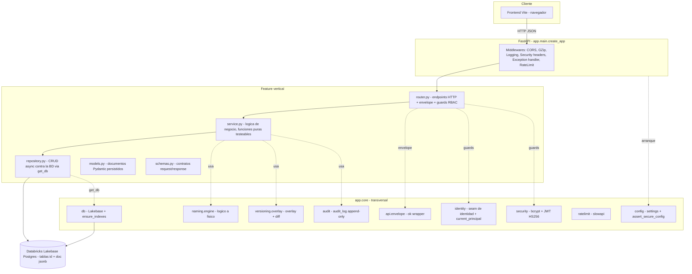
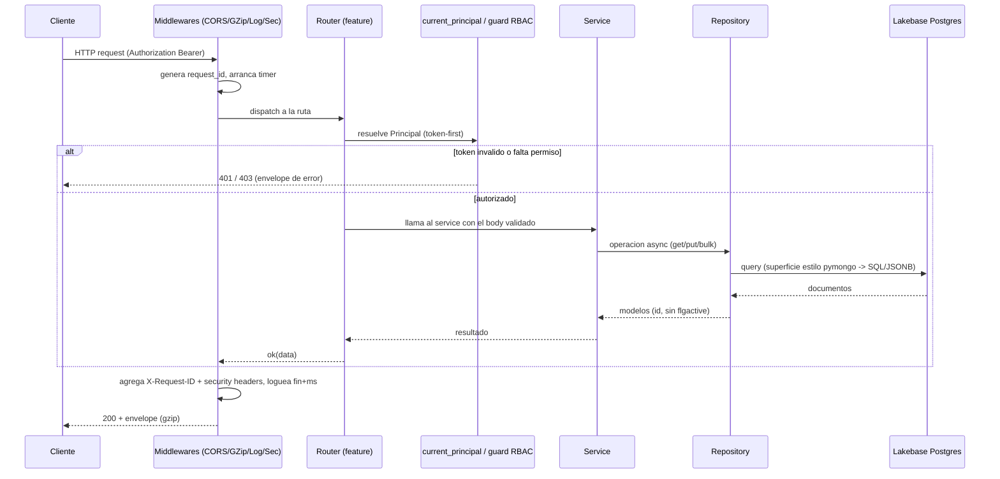
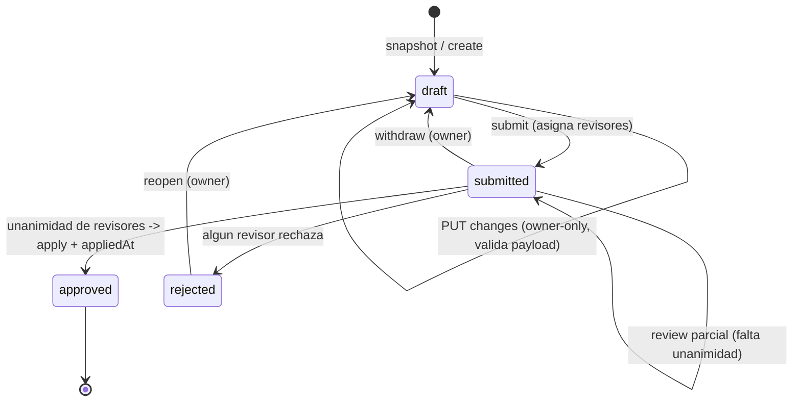
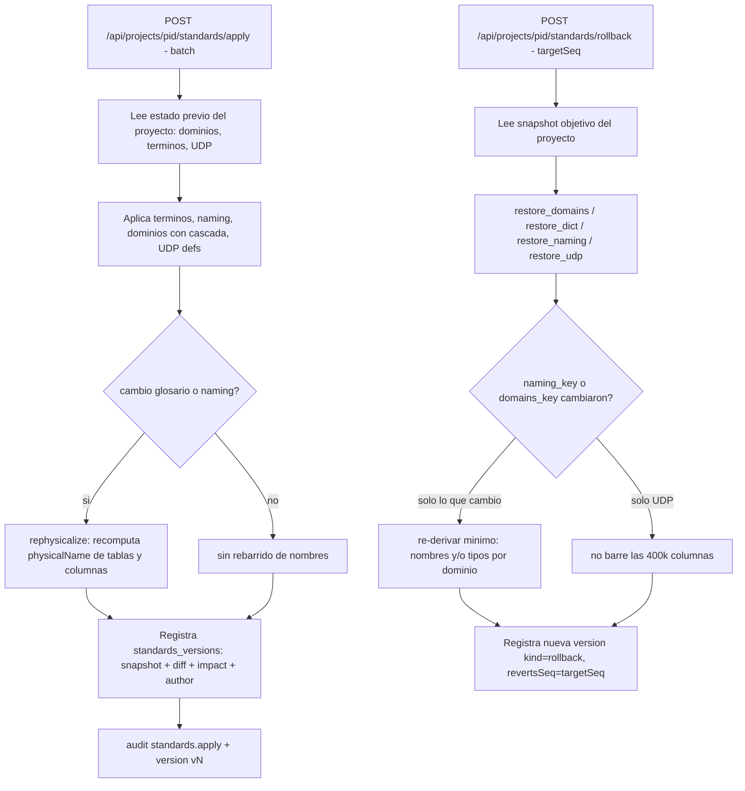
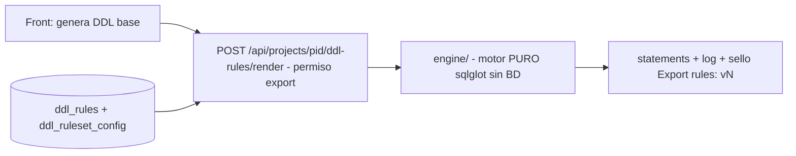
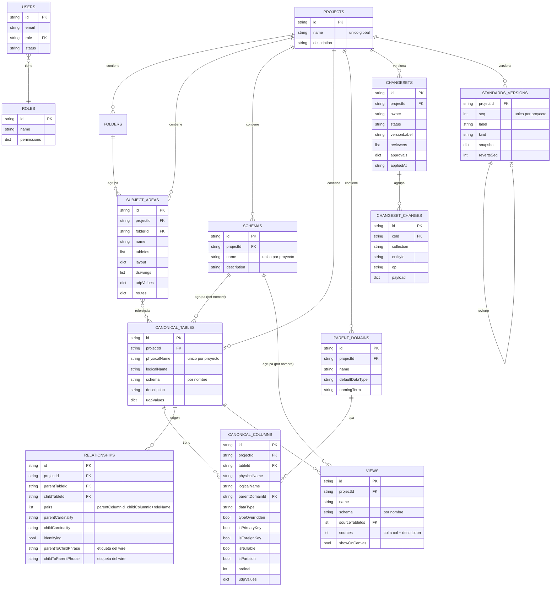

# Arquitectura del Backend — Data Model Hub (`backend-data-model-hub`)

**Actualizado:** 2026-09-08 (doc 75: proyectos independientes). Documento de arquitectura del servicio de plataforma del Data Model Hub. Describe la visión, las capas, el stack, el árbol de carpetas, el ciclo de vida de un request, los flujos de negocio clave, las consideraciones de base de datos y el despliegue. Está escrito a partir del código real de `app/main.py`, `app/core/` y `app/features/`.

> **Base de datos:** la base productiva y única es **Databricks Lakebase
> Postgres** en el workspace **corporativo** de Databricks (proyecto `dmh-proj`,
> branch `production`, base `databricks_postgres`, schema PG `dmh`). El acceso
> pasa por el seam `app/core/db/client.py`; el adaptador `app/core/db/lakebase/`
> expone una superficie de consulta estilo `pymongo` sobre tablas
> `(id text PK, doc jsonb)` — una por colección — con credenciales OAuth
> rotativas del SDK de Databricks. Los repositorios trabajan contra esa
> superficie sin conocer el almacén físico. No hay seam de rollback ni driver
> Mongo: Lakebase es la única BD.
> El deploy está parametrizado por GitHub Variables (`BUNDLE_VAR_*`, sin
> `workspace.host` en `databricks.yml`): el mismo repo despliega a cualquier
> workspace sin editar archivos (detalle en §7 y §8).

---

## 1. Visión y responsabilidades

El backend es el **composition root** de la plataforma del Data Modeler: una API REST en FastAPI que administra proyectos, el modelo de datos canónico y su persistencia en **Databricks Lakebase Postgres** (modelo documental JSONB vía el adaptador estilo `pymongo` de §7). Es el cerebro de gobierno del modelo: gobierna quién puede editar, cómo se versiona un cambio, cómo se aprueba y publica a producción, y cómo se consulta la metadata para reporting.

Responsabilidades concretas, tomadas del docstring de `main.py` y de las features:

- **Proyectos independientes (doc 75)**: cada proyecto es un universo aparte — su catálogo, sus esquemas, sus estándares y sus versiones. Todo documento del modelo o de los estándares lleva `projectId` (estampado server-side) y las lecturas exigen alcance (`app/core/scope.py`); un cambio nunca cruza de proyecto.
- **Catálogo canónico del proyecto**: tablas y columnas (`canonical_tables`, `canonical_columns`) como el pool del proyecto (unicidad del nombre físico por proyecto).
- **Estructura tipo Erwin**: proyectos, carpetas del Model Explorer y subject areas (canvases) que referencian un subconjunto del pool del proyecto y guardan su layout.
- **Versionado y aprobación del modelo, por proyecto**: sesión de edición (working copy) → changeset (de UN proyecto) → submit → review → approve → publish a la producción de ese proyecto, con política de unanimidad de revisores. El ciclo de vida del proyecto (renombrar, describir, borrar) también es versionado: el borrado es un cambio del draft que el aprobador confirma con aviso crítico y que al aplicarse cascadea el soft-delete de todo el proyecto.
- **Data Standards versionados por proyecto**: glosario de abreviaturas, Parent Domains, definiciones UDP, configuración de naming y reglas DDL de cada proyecto, con historial append-only propio (`standards_versions.projectId`) y rollback determinista; un proyecto nuevo nace vacío o copiando bloques de otro.
- **Motor de reglas del DDL Export** (`ddl_rules`): reglas versionadas (sqlglot) que transforman el texto SQL del Export DDL según los valores UDP del modelo, con render puro vía `POST /api/ddl-rules/render` (ver §6.4).
- **Motor de consulta del reporting**: un IR (`QuerySpec`, siempre de UN proyecto) que produce el query-builder visual o un parser SQL (sqlglot), compilable a un pipeline de agregación estilo `pymongo`, con paginación keyset a escala de cientos de miles de columnas.
- **Identidad, RBAC y auditoría**: sesión propia por JWT con dos carriles de login (doc 38): SSO heredado de Databricks contra la whitelist de correos asignados a un rol, y contraseña (bcrypt) para la cuenta local `admin`; matriz de permisos data-driven por rol y log de auditoría de acciones.

Lo que **NO** vive acá: ningún agente conversacional de modelado (el planteamiento inicial con `app-agents-modeler` y su colección `column_catalog` se descartó por completo, doc 54). Las variables de Azure AI Foundry / OpenAI / embeddings tampoco son de este servicio.

---

## 2. Arquitectura por capas

El backend separa dos grandes zonas: **`core`** (infraestructura transversal reutilizable, sin lógica de negocio de una feature) y **`features`** (**19 verticales de negocio autónomas**, listadas en el árbol de §4). Cada feature sigue el patrón **router → service → repository → BD** (acceso a Lakebase vía `get_db()`), con `models` (documentos Pydantic persistidos) y `schemas` (contratos de request/response) como piezas de datos. Algunas features suman módulos puros adicionales al patrón: `changesets` tiene `diffdetail.py` (diff antes/después resuelto a nombres, §6.5) y `validation.py`; `ddl_rules` tiene el subpaquete `engine/` (motor puro de reglas del DDL Export, §6.4) y `templates.py`.

### 2.1 Diagrama de capas



### 2.2 Responsabilidad de cada capa dentro de una feature

| Capa | Archivo | Responsabilidad | Regla |
|------|---------|-----------------|-------|
| Router | `router.py` | Declara endpoints, valida el body (schema), aplica guards RBAC, envuelve la respuesta en el envelope y traduce errores de negocio a códigos HTTP (403/404/409/422). | No contiene lógica de negocio. |
| Service | `service.py` | Orquesta el flujo. La política pura (versionado, aprobación, diff, permisos efectivos) vive en funciones **puras** testeables sin DB; las funciones `async` solo coordinan repository + puras + audit. | No toca la BD directo salvo excepciones puntuales. |
| Repository | `repository.py` | CRUD async contra la BD vía `get_db()` (superficie estilo pymongo; el adaptador Lakebase la traduce a SQL/JSONB). Traduce documento (`_id`) a modelo (`id`), aplica soft-delete (`flgactive`), bulk writes, guards atómicos. | Único punto que conoce paths de documento. |
| Models | `models.py` | Documentos Pydantic persistidos (`*Doc`). Config base `DOC_CONFIG` (`extra="ignore"`, `populate_by_name`). | Invariante de round-trip: un campo que no está en el modelo se descarta al leer. |
| Schemas | `schemas.py` | Contratos de entrada/salida del router (bodies). | Separan la forma de la API de la forma de almacenamiento. |

### 2.3 El envelope estándar

Toda respuesta de éxito se envuelve con `app/core/api/envelope.py`:

```python
def ok(data=None):
    return {"success": True, "data": data}
```

Los errores no controlados devuelven `{"success": False, "error": "..."}` con status 500 (ver el exception handler en §5). Esto le da al frontend un contrato uniforme: siempre `success` + (`data` | `error`).

### 2.4 El invariante de persistencia (round-trip)

Como `DOC_CONFIG` usa `extra="ignore"`, un campo nuevo que se quiera persistir necesita estar declarado **tanto en el modelo TypeScript del front como en el modelo Pydantic `*Doc`**; si no, se descarta silenciosamente al releer (el read path re-valida con `extra="ignore"`). Este es un invariante crítico del proyecto y aparece anotado en varios modelos como "aditivo (invariante §2.6): declarados ⇒ persisten en el round-trip".

---

## 3. Stack tecnológico

| Componente | Tecnología | Versión (pin `==` de `requirements.txt`) | Uso real |
|------------|-----------|------------------------------------------|----------|
| Lenguaje | Python | 3.12 | Runtime |
| Framework web | `fastapi` | 0.136.1 | Routing, validación, OpenAPI |
| Toolkit ASGI | `starlette` | 1.0.0 | `TrustedHostMiddleware`, `Response`/`JSONResponse` en `main.py` |
| Servidor ASGI | `uvicorn[standard]` | 0.47.0 | Servidor HTTP async |
| Validación/modelos | `pydantic` | 2.13.4 | Modelos de documento (`*Doc`) y schemas de la API |
| Config/env | `python-dotenv` | 1.2.2 | Carga de `.env` en `config.py` y scripts |
| Driver Postgres | `asyncpg` | 0.31.0 | Pool y queries del adaptador Lakebase |
| SDK Databricks | `databricks-sdk` | 0.121.0 | `WorkspaceClient`: token OAuth de BD + resolución del host PG |
| Vocabulario Mongo | `pymongo` | 4.17.0 | Tipos/errores (`DuplicateKeyError`, `UpdateOne`, `ReturnDocument`) que el adaptador Lakebase emula y usan los repositories. NO conecta a Mongo |
| Hash de contraseñas | `bcrypt` | 5.0.0 | Hash con salt de passwords |
| Token de sesión | `pyjwt` | 2.12.1 | JWT HS256 firmado |
| Parser SQL | `sqlglot` | 30.12.0 | SQL de texto → `QuerySpec` del reporting **y** motor de reglas del DDL Export |
| Rate limiting | `slowapi` | 0.1.10 | Anti fuerza bruta del login (5/minute) |
| Testing | `pytest` + `httpx` | >=8.0 / >=0.27 (`requirements-dev.txt`) | Tests; solo dev, no van al runtime |

**Política de pines exactos (`==`, 2026-07-31):** todas las dependencias de runtime están pineadas con `==` a las versiones EXACTAS del venv validado (pytest 543 verde + 43 de la suite viva del adaptador con `LAKEBASE_TESTS=1` + `pip check` limpio). El motivo es doble: (a) la imagen base de Databricks Apps trae pre-instalados fastapi/starlette/uvicorn viejos que con rangos abiertos pip daría por satisfechos, produciendo combinaciones jamás testeadas; (b) orden — local, CI y Apps corren idéntico. Para subir una librería: cambiar el pin, correr pytest + `pip check`, y recién commitear. Además, el encabezado del `requirements.txt` es **ASCII puro a propósito**: pip decodifica el archivo con la codificación local del SO (cp1252 en Windows en español) y un carácter UTF-8 en un comentario revienta el `pip install -r requirements.txt` — sin tildes ni flechas ahí.

Notas de diseño del stack:

- **Async de punta a punta**: FastAPI + asyncpg (Lakebase). Un único singleton de BD (`app/core/db/client.py`) compartido por todos los repositorios; se abre en el lifespan y se cierra en el teardown.
- **Pureza y testeo sin DB**: las políticas (aprobación, diff, permisos, naming, overlay, compilación de queries, motor de reglas DDL) están aisladas como funciones puras, testeables con pytest sin montar una base de datos.

---

## 4. Scaffolding completo del árbol `app/`

```
app/
├── __init__.py
├── main.py                         Composition root: create_app(), lifespan, middlewares, montaje de routers
│
├── core/                           Infraestructura transversal (sin negocio de feature)
│   ├── config.py                   Settings (env) + assert_secure_config (falla-cerrado del SECRET_KEY)
│   ├── logging.py                  Logging estructurado (pretty|json), get_logger, configure_logging
│   ├── audit.py                    audit() best-effort → colección audit_log (append-only)
│   ├── models.py                   DOC_CONFIG (extra=ignore, populate_by_name), TagDoc, coerce_tags
│   ├── ratelimit.py                Limiter de slowapi (key = 1ª IP de X-Forwarded-For), activo en prod / RATE_LIMIT_ENABLED
│   ├── scope.py                    Alcance por proyecto (doc 75): PROJECT_SCOPED, scoped(pid, flt), naming_id, assert_scoped_filter,
│   │                               MissingProjectError (500: bug) / ProjectDeletedError (409)
│   ├── security.py                 hash_password/verify_password (bcrypt) + create/decode_access_token (JWT HS256)
│   ├── api/
│   │   └── envelope.py             ok(data) → {success, data}
│   ├── db/
│   │   ├── client.py               Singleton de conexión a Lakebase: connect/disconnect/get_db
│   │   ├── indexes.py              ensure_indexes: índices idempotentes (traga códigos 48/11000)
│   │   ├── sync.py                 get_sync_db(): puente sync para scripts (loop async en thread de fondo)
│   │   └── lakebase/               Adaptador estilo pymongo sobre Postgres (ver §7)
│   │       ├── collection.py       LakebaseDatabase / PgCollection / PgCursor / PgCommandCursor
│   │       ├── translate.py        Traducción Mongo→SQL/JSONB (filtros, updates, proyección, orden)
│   │       ├── aggregate.py        Compilador de pipelines de aggregation → un SELECT
│   │       ├── credentials.py      Token OAuth de BD + descubrimiento del host vía SDK
│   │       └── pool.py             Pool asyncpg (password rotativo, wake del compute, TLS clásico/directo)
│   ├── identity/
│   │   ├── models.py               Principal (email, username, display_name, source)
│   │   ├── provider.py             LocalIdentityProvider / DatabricksIdentityProvider (seam)
│   │   └── dependencies.py         current_principal (token-first; fallback al seam salvo REQUIRE_AUTH)
│   ├── naming/
│   │   └── engine.py               physicalize (diccionario de abreviaturas, longest-match)
│   └── versioning/
│       └── overlay.py              overlay(published, changes) + summarize_diff (puro)
│
└── features/                       20 verticales de negocio (router→service→repository)
    ├── health/                     GET /api/health (ping vivo a la BD)
    ├── auth/                       Login propio + sesión (deps.py: require_permission / write_guard) + warmup
    ├── admin/                      /api/admin/* (users, roles+matriz, permissions, audit) — admin.manage
    ├── identity/                   /api/users (usuarios reales para asignar revisores)
    ├── domains/                    /api/projects/{pid}/domains (Parent Domains del proyecto: tipo default + cascada) — standards.edit
    ├── udp/                        /api/projects/{pid}/udp (solo lectura de definiciones UDP del proyecto)
    ├── glossary/                   /api/projects/{pid}/glossary (abreviaturas + physicalize + lock) — standards.edit
    ├── data_standards/             /api/projects/{pid}/standards (snapshot, versions, summary, apply, rollback) — standards.edit
    │                               + bootstrap_project (estándares vacíos o copiados al crear un proyecto)
    ├── ddl_rules/                  /api/projects/{pid}/ddl-rules (reglas del DDL Export: validate/test/impact/render) + templates.py
    │   └── engine/                 Motor puro: conditions, context, expressions, generators, pipeline, render, validate
    ├── catalog/                    /api/projects/{pid}/catalog (tablas, columnas, search, inventory) + /api/catalog/tables/{id}/… — model.edit
    ├── changesets/                 /api/changesets, /api/versions, /api/projects/{pid}/versions, /api/requests — model.edit / review.decide / rollback
    │                               + diffdetail.py (diff antes/después a nombres) + validation.py (guards I1/I2 de proyecto)
    ├── projects/                   /api/projects (crear + counts), /api/subject-areas (canvases + layout + diagram) — model.edit
    │                               + deps.alive_project (404 uniforme) + repository.cascade_delete (D5)
    ├── folders/                    /api/folders (jerarquía del Model Explorer)
    ├── schemas/                    /api/projects/{pid}/schemas (esquema físico DEL proyecto, guard de uso) + /api/schemas/{sid} — model.edit
    ├── relationships/              /api/relationships (relaciones v2: parent/child + pairs)
    ├── views/                      /api/views (vistas SQL versionadas, multifuente sources[])
    ├── summary/                    /api/summary (contadores del Home)
    ├── settings/                   /api/projects/{pid}/settings/naming (separador/case por scope) — standards.edit
    ├── bulk_upload/                /api/changesets/{cs_id}/uploads (carga masiva desde Excel, docs 55/78/87)
    │   └── profiles/               /api/projects/{pid}/upload-profiles (perfiles de carga, doc 78)
    └── reporting/                  /api/reporting/tables|filters|columns|views (tabla de metadata por proyecto)
        └── query/                  Motor de consulta: spec (projectId obligatorio), schema (Field Catalog), compiler,
                                    parser (SQL→spec), executor (keyset), reports, views (insights), router
```

### 4.1 Qué es cada carpeta de `core`

- **`config`**: expone `settings` (un objeto plano con variables de entorno) y `assert_secure_config()`, que impide arrancar en producción (`REQUIRE_AUTH=true`) con el `SECRET_KEY` de desarrollo público.
- **`db`**: `client.py` es el singleton de conexión a Lakebase (`LakebaseDatabase` sobre pool asyncpg) con contrato `connect()/get_db()/disconnect()`; `indexes.py` crea los índices al conectar y es idempotente (ignora los códigos 48 y duplicate-key 11000); `sync.py` expone `get_sync_db()` para scripts; el subpaquete `lakebase/` es el adaptador estilo pymongo (detalle en §7).
- **`identity`**: el seam de identidad. `Principal` es el usuario en sesión; `provider.py` tiene el modo `local` (usuario fake, header `X-Dev-User` para actuar como otro) y `databricks` (lee headers OBO del proxy SSO); `dependencies.py` implementa `current_principal` con estrategia token-first.
- **`security`**: primitivas puras de auth (bcrypt para passwords; JWT HS256 para el token de sesión).
- **`naming`**: motor puro de conversión nombre lógico→físico, data-driven vía un diccionario de abreviaturas, con longest-match multi-palabra y `case ∈ {upper, lower, camel}`. (La inversa `logicalize` se retiró en el doc 75 D14: no tenía consumidor.)
- **`scope`**: el alcance por proyecto (doc 75 D1). `scoped(pid, flt)` es la ÚNICA forma de armar un filtro de alcance; `PROJECT_SCOPED` enumera las colecciones con `projectId`; `assert_scoped_filter` (defensa en profundidad en `published()`) convierte una lectura sin proyecto en `MissingProjectError` — un bug de programación que sube como 500, nunca una fuga silenciosa entre proyectos.
- **`versioning`**: `overlay()` (estado efectivo = publicado + cambios del changeset) y `summarize_diff()` (added/modified/removed), ambos puros.
- **`audit`**: `audit()` best-effort que nunca hace fallar la request que la invoca; escribe en `audit_log`.
- **`ratelimit`**: el `Limiter` de slowapi con estado en memoria (por proceso), activo en producción.
- **`api/envelope`**: el wrapper `ok()`.

### 4.2 Qué es una feature

Una feature es un vertical de negocio autónomo. La ilustramos con `catalog`:

- **`models.py`** — `CanonicalTableDoc`, `CanonicalColumnDoc` (documentos persistidos, con `udpValues` embebido y el alias `schema` → `sql_schema`).
- **`schemas.py`** — `CanonicalTableBody`, `CanonicalColumnBody` (bodies del router).
- **`repository.py`** — CRUD contra `canonical_tables`/`canonical_columns`, con búsqueda server-side (`?q=&limit=`) y slices por ids.
- **`service.py`** — deriva el nombre físico vía glosario y el `dataType` vía Parent Domain (`derive_column`).
- **`router.py`** — endpoints `GET/POST /api/projects/{pid}/catalog/tables`, `/api/catalog/tables/{id}/columns`, protegidos por `write_guard("model.edit")`; el router por proyecto lleva la dependencia `alive_project` (404 «Project not found.» si el proyecto no existe o fue borrado).

---

## 5. Ciclo de vida de un request

### 5.1 Arranque (lifespan)

`create_app()` primero llama `assert_secure_config()` (falla-cerrado: con `REQUIRE_AUTH=true` y el `SECRET_KEY` de desarrollo, la app no arranca). Con `REQUIRE_AUTH=true` además se ocultan `/docs`, `/redoc` y `/openapi.json` (menos fingerprinting). El `lifespan` async abre la conexión (`db_client.connect()`: pool + DDL `ensure_base` de las tablas-colección + `ensure_indexes`) y marca `app.state.db_connected`; si la BD no responde (p. ej. compute Lakebase dormido por scale-to-zero), la app igual arranca en estado degradado y un task en background reintenta la conexión con backoff 15→120 s hasta lograrla — `/api/health` se recupera solo. **No hay seeds en el startup**: los seeds son scripts explícitos (`create_admin`, `seed_ddl_export_rules`, `seed_upload_profiles`, `mark_base_version`). En el teardown cancela el retry y cierra la conexión.

### 5.2 Pila de middlewares (en el orden de `create_app`)

1. **Rate limiting (slowapi)**: `app.state.limiter` + handler de `RateLimitExceeded` → 429 con `Retry-After`. Se aplica por-ruta (el login lleva `@limiter.limit("5/minute")`); la key es la **primera IP de `X-Forwarded-For`** (fallback al peer) — detrás de los proxies de Databricks Apps, keyear por la IP del peer volvía el límite del login global para todos los usuarios.
2. **TrustedHostMiddleware**: solo si `ALLOWED_HOSTS` está definido (postura de producción); rechaza hosts no permitidos.
3. **CORSMiddleware**: allowlist explícita (`CORS_ORIGINS`, default front de dev) y/o regex (`CORS_ORIGIN_REGEX`, para que el mismo bundle sirva en cualquier workspace de Databricks Apps). `allow_credentials=True`: la auth propia sigue siendo token-first (sin cookies propias), pero en Databricks Apps el fetch del front lleva la cookie del proxy SSO — con `False` el POST de login ni se enviaba. Métodos y headers acotados (no wildcard): `Authorization`, `Content-Type`, `X-Requested-With`, `X-Dev-User` y `X-Session-Token` (el token de sesión propio viaja ahí en Databricks Apps, porque el proxy SSO de la plataforma consume `Authorization`). `max_age=600`.
4. **GZipMiddleware**: comprime respuestas > 1024 bytes (los payloads de metadata comprimen 5-10x).
5. **Exception handler de `Exception`**: convierte cualquier crash no controlado en el envelope de error 500. Como corre en `ServerErrorMiddleware` (el más externo), la respuesta no pasa por CORS, así que el handler repone a mano `Access-Control-Allow-Origin` + `Access-Control-Allow-Credentials` + `Vary: Origin` si el origen está permitido por lista o regex (sin eso el browser vería "Failed to fetch").
6. **Middleware de logging + security headers**: genera un `request_id` de 12 chars, loguea inicio/fin con latencia en ms, y en la respuesta agrega `X-Request-ID`, `X-Content-Type-Options: nosniff`, `X-Frame-Options: DENY`, `Referrer-Policy: no-referrer`, `Permissions-Policy` (geolocalización/micrófono/cámara off) y, solo sobre HTTPS (detectado también por `X-Forwarded-Proto`), `Strict-Transport-Security`.

### 5.3 Diagrama de secuencia de un request



### 5.4 Resolución de identidad (`current_principal`)

Estrategia **token-first** (`app/core/identity/dependencies.py`):

- Si viene `Authorization: Bearer <token>` válido, la identidad sale de los claims del JWT (`sub`, `email`, `name`).
- Si el token está presente pero es inválido/expirado, siempre es **401** (no se cae al fallback: el cliente mandó una sesión).
- Si no hay token y `REQUIRE_AUTH=true` (producción), es **401**.
- Si no hay token y `REQUIRE_AUTH=false` (local/tests), se usa el seam (`LocalIdentityProvider` o `DatabricksIdentityProvider`) para no exigir login al desarrollar.

---

## 6. Workflows clave

### 6.1 Sesión de edición → changeset → submit → review → approve → publish

El **changeset** es la unidad de versionado del modelo y pertenece a **UN proyecto** (`projectId`, doc 75 D2): se abre desde el Open model del proyecto (`POST /api/changesets/snapshot {projectId}`), sus `versionLabel` (`vN`) se numeran por proyecto y su producción vigente (`GET /api/projects/{pid}/versions/published`) es la de ese proyecto — «Modelo DDV v3» y «UDV INT FISICO v3» son versiones independientes. Los cambios **no** viven embebidos en el documento del changeset: cada cambio es un documento propio en `changeset_changes` con `_id` determinista `{csId}::{collection}::{entityId}` (un dict embebido con miles de cambios crecería sin techo; separarlos en un documento por cambio mantiene los updates JSONB chicos y permite diffs por slice).

Colecciones versionadas (whitelist dura `VERSIONED`, `changesets/repository.py`): **8 colecciones** — `projects`, `folders`, `subject_areas`, `schemas`, `canonical_tables`, `canonical_columns`, `relationships`, `views`. La estructura del Model Explorer (`projects`/`folders`/`subject_areas`) y la entidad `schemas` (esquema físico de BD) entraron a versionado en 2026-07-16 (antes un draft escribía estructura y esquemas directo a producción). El orden de la tupla es el orden de dependencia del apply (schemas antes que tablas, tablas antes que columnas/relaciones/vistas). Los estándares (glosario/dominios/UDP/naming/reglas DDL) **salieron** del changeset: se editan por el módulo Data Standards del proyecto con escritura directa y su propio versionado (`standards_versions`, por proyecto).

**Guards de proyecto** (`changesets/validation.py`, doc 75 I1/I2): `payload.projectId` lo estampa el servidor con el del changeset (el cliente no puede colar un doc de otro proyecto); cualquier referencia — `tableId`, `parentTableId`/`childTableId`, `sourceTableIds`, `parentDomainId`, `folderId`, `schema` — a una entidad de OTRO proyecto es **409** (`CrossProjectError`); en `projects` sólo se admite la entidad `cs.projectId` (renombrar/describir/borrar el propio proyecto). Una operación sobre un changeset cuyo proyecto ya fue borrado responde **409** «This project was deleted.» (`ProjectDeletedError`).

**Ciclo de vida del proyecto (doc 75 D5)**: crear es directo (`POST /api/projects`: doc + `bootstrap_project` de Data Standards — vacíos o `copyFrom` de otro proyecto — + marcador `v1`, todo en una request; si algo falla, el proyecto se descarta); renombrar/describir/**borrar** van por un draft del propio proyecto. El borrado es un solo cambio `projects/<pid> op=delete`: `version_row.deletesProject` y `diff.impact.deletesProject` (`{projectId, name, counts}`) alimentan el pill «Deletes project» de la bandeja y el bloque crítico del aprobador (que confirma escribiendo el nombre); al aplicarse, `_apply_and_finalize` corre `projects.repository.cascade_delete(pid, csId)`: soft-delete con `deletedIn` de TODO lo del proyecto salvo `changesets` y `standards_versions` (historial) y `$pull` del pid en `users.projectIds`. Después, `alive_project` responde 404 en toda ruta `/api/projects/{pid}/…`. Restaurar un proyecto borrado está fuera de alcance.

Máquina de estados:



Puntos críticos del flujo (de `changesets/service.py` y `repository.py`):

- **Validación de payload doble**: al agregar un cambio (`add_change`, feedback inmediato, 422) y de nuevo antes de aplicar (`_apply_and_finalize`, gate autoritativo). Usa los mismos modelos `*Doc` del read path (round-trip garantizado). Sin esto, un upsert malformado entraría a producción tal cual.
- **Escritura de cambios con compensación**: `set_change` protege el estado `draft` con un protocolo de 3 pasos (touch atómico del padre → upsert del cambio con `wtoken` único → re-check y compensación si un submit ganó la carrera).
- **Política de unanimidad**: `approval_outcome` — si algún revisor rechaza → `rejected`; si hay revisores y **todos** aprobaron → `approved` (se aplica); si no, sigue `submitted`. Las decisiones se guardan con `$set` atómico en `approvals.<actor>` (no se pisan entre revisores concurrentes).
- **Guard anti-ABA**: el estado es un string que se repite entre ciclos (withdraw → edit → resubmit vuelve a `submitted`). Los cierres pasan `expect={"submittedAt": ...}` para que un claim tardío no cierre un envío distinto al que el revisor decidió.
- **Apply idempotente**: `apply_changes` usa un `bulk_write` por colección (upsert / soft-delete por `_id`) en orden de dependencia (dominios → tablas → columnas → relaciones → vistas). Si falla, revierte el request a `submitted` y re-lanza; re-aprobar reintenta y converge. `appliedAt` se estampa recién con el apply completo (marcador de "esta versión sí está en producción").
- **RBAC**: crear/editar exige `model.edit`; decidir (aprobar/rechazar/publicar) exige `review.decide`; pedir un rollback exige `rollback` (crea un draft que pasa por revisión); abrir en el canvas el contenido de una versión NO publicada de otro usuario exige `versions.view_all` (doc 70 §12: publicadas y propias para todos; el revisor asignado ve su request; `admin.manage` lo implica). Se aplica en los lectores changeset-aware (`/effective`, `/diagram`, `/relationships/links`, `/views/for-table`, `/catalog/search`, `/catalog/tables/{id}/usage`) vía `changesets/access.ensure_changeset_visible`.

Ejemplo de flujo con curl:

```bash
# 1) Crear un draft desde el estado publicado
curl -X POST https://API/api/changesets/snapshot \
  -H "Authorization: Bearer $TOKEN" -H "Content-Type: application/json" \
  -d '{"title":"Alta cliente","description":"nueva tabla","projectId":"p1"}'
# -> { "success": true, "data": { "id": "cs-123", "projectId": "p1", "status": "draft", "versionLabel": "v7" } }

# 2) Registrar un cambio (upsert de una columna)
curl -X PUT https://API/api/changesets/cs-123/changes \
  -H "Authorization: Bearer $TOKEN" -H "Content-Type: application/json" \
  -d '{"collection":"canonical_columns","entityId":"col-9","op":"upsert",
       "payload":{"tableId":"t-1","physicalName":"NRO_DOC","logicalName":"numero documento","dataType":"string"}}'

# 3) Enviar a revisión (publish request)
curl -X POST https://API/api/changesets/cs-123/submit \
  -H "Authorization: Bearer $TOKEN" -H "Content-Type: application/json" \
  -d '{"reviewers":["ana","luis"],"title":"Alta cliente v7"}'

# 4) Un revisor aprueba (aplica solo con unanimidad)
curl -X POST https://API/api/changesets/cs-123/review \
  -H "Authorization: Bearer $TOKEN_ANA" -H "Content-Type: application/json" \
  -d '{"decision":"approve"}'
```

Routers hermanos: `GET /api/versions[?projectId=]` (filas de versión de todos los proyectos — cada fila con `projectId` y `deletesProject` — o de uno), `GET /api/projects/{pid}/versions` y `/published` (versiones y producción vigente DEL proyecto), `GET /api/versions/compare?fromId=&toId=` (+ `POST /compare/details`, sólo dentro del mismo proyecto: 409 «Both versions must belong to the same project.»), `GET /api/requests?reviewer=&owner=` (publish requests en revisión, bandeja global con `projectId` por fila — doc 75 D20).

### 6.2 Versionado de Data Standards con rollback (por proyecto)

Los estándares (Parent Domains, glosario, definiciones UDP, naming y — desde el doc 30 — las reglas del DDL Export con su config de lookups) **no** pasan por el changeset del canvas y son **de cada proyecto** (doc 75 D3): las rutas cuelgan de `/api/projects/{pid}/…`, cada doc lleva `projectId`, `naming_config._id = "<pid>:<scope>"` y `ddl_ruleset_config._id = <pid>`. Se aplican directo a las colecciones publicadas del proyecto y cada apply/rollback genera una versión en `standards_versions` (con `projectId`; `seq` único por `(projectId, seq)`) con el **snapshot completo** del estado tras aplicar (suficiente para rollback determinista; incluye `ddlRules` + `ddlConfig`). Cambiar un término del glosario de «UDV INT LOGICO» re-physicaliza SÓLO ese proyecto; un Restore en un proyecto no toca a los demás. `GET /standards/summary` da los conteos por bloque (lo usa el «New project» para elegir qué copiar) y `bootstrap_project(actor, pid, copy_from)` siembra los estándares de un proyecto nuevo (vacíos, o copiando `glossary`/`domains`/`udp`/`naming`/`ddl` de otro con ids nuevos y versión `kind=copy`). El snapshot es acotado (decenas de dominios + cientos-miles de términos + 2 docs de naming + decenas de reglas), muy por debajo de 2MB/doc.

Flujo (`data_standards/service.py`):



Detalles:

- **`seq` único por proyecto**: `insert_version_next_seq` asigna `seq = max+1` DEL proyecto y `label = v{seq}`; el índice único `(projectId, seq)` impide dos versiones con el mismo número ante apply/rollback concurrentes del mismo proyecto (reintenta hasta 8 veces ante `DuplicateKeyError`).
- **Re-derivación mínima**: el rollback compara `_naming_key` y `_domains_key` del snapshot vs el estado actual; solo re-physicaliza si cambió glosario/naming, y solo re-propaga tipos si cambiaron los dominios. Un rollback de solo-UDP no barre las 400k columnas.
- **RBAC**: el apply exige `standards.edit`; el rollback exige el permiso `rollback` (propio, compartido con el rollback de versiones del Model); la lectura de snapshot/versions queda abierta a quien ve el módulo.
- **Cascada de dominios**: al cambiar el `defaultDataType` de un dominio, se re-tipan las columnas sin override (`typeOverridden != true`), respetando el override manual por-dato.

### 6.3 Motor de consulta del reporting

El corazón es `QuerySpec` (`reporting/query/spec.py`): un IR JSON que es la única fuente de verdad, producido por el query-builder visual o por el parser SQL, y consumido por el compiler, la grilla y el export. El cliente **nunca** manda paths de Mongo: manda una `field` key pública que se resuelve contra el **Field Catalog** (`schema.py`), y `op` es un enum cerrado (cero inyección).


Piezas y garantías de escala:

- **Alcance por proyecto** (doc 75 D13): `QuerySpec.projectId` es obligatorio; el executor antepone `scoped(spec.projectId, ACTIVE)` a todo `$match`, el Field Catalog resuelve las defs UDP del proyecto (`GET /catalog?projectId=`), y facets, insights, el reporte tabular (`/tables`, `/filters`, `/columns`, `/views`) y los saved reports (`projectId` en el doc, igual al del spec) son del proyecto. No hay reporte cross-project.
- **Field Catalog dinámico** (`schema.py`): cada vista (`columns`/`tables`/`relationships`/`views`) expone `FieldDef` estáticos + campos UDP dinámicos derivados de `udp_definitions` del proyecto. Crear un UDP agrega columnas filtrables/agrupables sin tocar código. La `key` pública (`udp.<defId>`) se traduce al `path` de Mongo (`udpValues.<defId>`), cubierto por el índice wildcard `udpValues.$**`.
- **Compiler puro** (`compiler.py`): valida cada campo/op contra el catálogo, castea el value al tipo, y aplica el **planner**: un orden por un campo sin índice se **rechaza** (a escala —cientos de miles de columnas— sería un full-scan; es un invariante de escala). `contains`/`startsWith` usan `re.escape` (nunca regex arbitrario).
- **Parser SQL** (`parser.py`): capa fina sobre el mismo IR. Parsea con sqlglot a un AST tipado, camina con allowlist estricto y emite el mismo `QuerySpec`. Rechaza JOIN, subquery, CTE, UNION, DDL/DML y múltiples statements.
- **Executor con keyset** (`executor.py`): paginación por keyset (no skip/limit profundo) sobre el primer campo de orden + `_id` de desempate; `maxTimeMS=15000` como circuit-breaker; proyección mínima; hidratación de nombres (dominio, UDP, schema) en Python post-fetch. El cursor se valida para aceptar solo escalares (un dict/list inyectaría operadores Mongo).
- **Export CSV por streaming**: `POST /api/reporting/export` keyset-pagina internamente y hace yield línea por línea (O(1) memoria).

Ejemplos:

```bash
# QuerySpec directo (columnas con override, ordenadas por physicalName)
curl -X POST https://API/api/reporting/query -H "Content-Type: application/json" -d '{
  "projectId": "p1",
  "from": "columns",
  "select": ["physicalName","logicalName","dataType","parentDomainId"],
  "where": {"op":"and","conditions":[{"field":"typeOverridden","op":"eq","value":true}]},
  "orderBy": [{"field":"physicalName","dir":"asc"}],
  "limit": 100
}'
# -> { "success": true, "data": { "rows": [...], "columns": [...], "nextCursor": "...", "hasMore": true } }

# El mismo motor vía SQL de texto
curl -X POST https://API/api/reporting/query/sql -H "Content-Type: application/json" \
  -d '{"projectId":"p1","text":"SELECT dataType, COUNT(*) AS n FROM columns GROUP BY dataType ORDER BY n DESC LIMIT 20"}'
```

Además, hay vistas curadas de insights (`/api/reporting/insights/scorecard`, `/udp-coverage`, `/domain-usage`, `/glossary-usage`, `/relationships`) y reportes guardados por usuario (`/api/reporting/reports`, colección `saved_reports`, validados como `QuerySpec` bien formado antes de persistir).

### 6.4 Export DDL con reglas (`ddl_rules`)

Las reglas del DDL Export transforman el **texto SQL** del export según los valores de UDP del modelo (doc 76: los 7 DDL de la macro BCP — tabla física con `-- DROP` comentado, TBLPROPERTIES de vacuum y tags `updateFrequency`/`isDAC`/`DAC`; tabla de rechazos `_rej`; vistas técnicas NoDAC/DAC y de rechazos; decoración de las vistas de negocio con `bcp_encrypt_function.decrypt_column_view`). Nunca tocan el modelo ni la data: los artefactos generados existen solo dentro del `.sql` exportado. Las reglas son **de cada proyecto** (doc 75): se autoran y versionan en la pestaña "DDL Export rules" de Data Standards del proyecto sobre el **mismo stream `standards_versions`** del proyecto (mutaciones SOLO vía `POST /api/projects/{pid}/standards/apply` con `rulesUpsert`/`rulesDelete`/`ddlConfigPatch`; el router `/api/projects/{pid}/ddl-rules` es read-only). Colecciones: `ddl_rules` (con `projectId`) + `ddl_ruleset_config` (`_id = projectId`; lookups, funciones y *Output settings*).



- **Motor puro** (`ddl_rules/engine/`): condiciones en un DSL con allowlist de operadores (`=`, `<>`, `IN`, `LIKE`, `IS NULL`, `AND/OR/NOT`…), expresiones donde `{col}` es un nodo AST acumulado (nunca string), generadores con toposort de dependencias (ciclo = error de validación) y render determinista: orden `(priority DESC, name ASC)`, tblproperties/tags en orden alfabético → salida byte-identical.
- **`POST /render` es puro**: el front manda `{ruleIds, context, base[]}` (contexto = tablas/columnas/vistas con `udpValues`) y recibe `{statements[], log[], rulesetVersion}`. Exige el permiso `export`; el `.sql` sale con el sello `-- Export rules: v<seq> · N applied · M skipped`. Sin reglas seleccionadas, el export es byte-identical al flujo sin reglas.
- **Endpoints de soporte** (leen el catálogo publicado): `POST /validate` (5 checks: sintaxis de condición, UDP existe, valor permitido, sintaxis de expresión Databricks, placeholders resueltos), `POST /test` (regla + tableId → fragmentos por columna match) y `POST /impact` (conteo de columnas/tablas afectadas, con fast-path por filtro cuando la condición es `udp[..] op literal`).
- **Acciones del motor** (doc 30 + doc 76 + doc 90): por columna `expression` (`{col}` = AST acumulado), `exclude` (quita la proyección del SELECT de una vista), `tags` y `types` (renombra el tipo BASE de las columnas que matchean al emitir un CREATE TABLE — `{CHAR: VARCHAR}`; el CREATE físico del front se reescribe por token con el tokenizer de sqlglot, así comentarios, literales y columnas llamadas `char` quedan intactos; los argumentos `(n)`/`(p,s)` se conservan si el tipo destino los admite según `ARG_SPECS`, si no se descartan; las tablas generadas pasan por el mismo mapeo; las vistas no declaran tipos); por objeto `tags` (una sentencia `ALTER TABLE … SET TAGS` por regla; en las vistas también `ALTER TABLE`, como la macro, salvo que las Output settings digan `viewTagsAs: view`), `tblproperties` (solo tablas, inyección textual en el CREATE), `statements` (sentencias libres `before`/`after` con placeholders, p. ej. `-- DROP TABLE IF EXISTS {artefacto.ref};`) y `layout` (`partitionColumns: last` + `partitionUdp` = el UDP de columna cuyo valor `PART_nn` decide QUÉ columnas son partición y en QUÉ orden — doc 93; `partitionOrderUdp` sigue aceptándose como alias; si el UDP no existe en el proyecto, el log lo avisa y manda el flag de partición de la plataforma); generadores `emit` con `keep_partition_type` (la `_rej` conserva el tipo de sus particiones). Contexto `artefacto.*` = el objeto que se emite (`ref` calificado con el casing y el estilo de identificadores del export: sin comillas salvo que el nombre las necesite).
- **Defaults declarados en la regla, no en el motor**: el motor lee SOLO valores de UDP explícitos; el "sin valor → default" se expresa con condición vacía + `default` del lookup (p. ej. `tblproperties_vacuum` con `vacuum_map.default='90 days'`, fiel al XML de Erwin donde el default vive en la definición del UDP).
- **Guard de consistencia**: un `udpDelete` en `/api/projects/{pid}/standards/apply` que intersecte los `udpRefs` de reglas activas devuelve 409 con la lista de reglas; borrar un valor de la lista de un UDP deja las reglas afectadas en `stale` (no bloquea).
- **Semilla**: `scripts/seed_ddl_export_rules.py --project P | --all-projects` (dry-run + `--apply`) registra, en cada proyecto, la versión "Base — DDL export rules" con 17 elementos (12 reglas + 5 generadores, `templates.py` — incluye `char_a_varchar`, doc 90, y el `isDAC` de las vistas de negocio, doc 93) + lookups `vacuum_map`/`update_frequency_map`/`dac_flag_map`/`dac_map` + Output settings (doc 93), y auto-crea la definición UDP "Frecuencia Vacuum" si falta en ese proyecto (el resto — «Clasificacion del Dato» de tabla y columna, «Particion» — debe venir del modelo migrado).
- **Doc 93 (2026-09-24) — salida autogestionada.** Cómo se escribe el DDL y cómo se nombran los archivos es **dato del proyecto**: las *Output settings* (`ddl_ruleset_config.output`, versionadas como los lookups vía `ddlConfigPatch.output`; defaults = macro BCP). Controlan:
  - identificadores sin comillas salvo que el nombre las necesite (palabra reservada o carácter fuera de `[a-z0-9_]`);
  - tipos en minúscula y `CREATE OR REPLACE TABLE`;
  - `NOT NULL` solo con keys;
  - tags sobre vistas con `ALTER TABLE`;
  - prefijos de archivo `TABLE-` / `VIEW_NEG-` / `VIEW_TEC-` (nombre en MAYÚSCULA; esquema solo si dos objetos chocan).

  El modal Export DDL arranca desde ellas. El motor suma la condición genérica `ANY_COLUMN(<condición de columna>)`, que evalúa sobre las columnas que el objeto realmente tiene; se usa para el `isDAC` de las vistas de negocio. Con la regla de layout, las particiones salen del UDP «Particion» (`PART_nn`) y no del flag de la plataforma.
- **Doc 101 (2026-09-28) — Export DDL en Oracle.** Las Output settings suman `dialect` (con qué dialecto abre el modal; default Databricks) y `oracle` (la configuración propia de Oracle: vistas, PK/FK, comentarios, casing, comillas, esquema por default y el mapeo de los tipos que Oracle no tiene). El backend solo la valida y versiona (`app/features/ddl_rules/output.py`); el DDL Oracle lo arma el front y **no pasa por el motor de reglas** (las reglas son de Databricks). La semilla deja a los proyectos declarados en `ORACLE_PROJECTS` de `scripts/seed_ddl_export_rules.py` (hoy «MODELO RDV DataEntry») **sin reglas** y con Oracle como dialecto por default.

### 6.5 Review con detalle de cambios (`diff/details`)

Complemento read-only del review (§6.1): el panel del request muestra un resumen de conteos por verbo (derivado del `GET /diff` existente) y un popup con el detalle campo por campo, alimentado por un endpoint propio:

- **`POST /api/changesets/{cs_id}/diff/details`** — read-only; body `{items: [{collection, entityId}]}` con cap de 200 ítems por llamada (el front trocea). Mismo guard de lectura que `GET /diff`; no modifica la mecánica de versionado.
- Respuesta por ítem: `{collection, entityId, action, name, fields: [{key, label, before, after}]}` con SOLO los campos que realmente cambian. `before` = documento publicado (o la imagen estampada si el changeset ya fue aplicado, para que el historial no derive); `after` = `payload` del cambio (`op=delete` → after nulo).
- **Resolución a nombres** (implementación pura en `changesets/diffdetail.py`): `udpValues` → una fila por UDP con su nombre; `parentDomainId` → nombre del Parent Domain; relaciones → nombres de tabla y pares `PADRE.col → HIJO.col`; vistas → resumen de columnas `+a, +b, −c`; `subject_areas.tableIds` → conteos `+N added · −N removed`.
- Ruido excluido (`id/_id/csId/updatedAt/createdAt/flgactive` y `layout`/`drawings`/`routes` de subject_areas); un modificado solo-ruido devuelve `fields: []` y la UI muestra "No visible field changes".

---

## 7. Consideraciones de base de datos (Databricks Lakebase Postgres)

La persistencia productiva es Databricks Lakebase Postgres y el modelo de datos es **documental**: los repositorios hablan una superficie estilo `pymongo` y el adaptador `app/core/db/lakebase/` la traduce a SQL/JSONB. Cada "colección" es una tabla `(id text PRIMARY KEY, doc jsonb, project_id text GENERATED ALWAYS AS (doc->>'projectId') STORED)` en el schema PG `LAKEBASE_PGSCHEMA` (default `dmh`), con índice GIN `jsonb_path_ops`; el documento se guarda completo (incluido `_id`). La columna generada `project_id` (doc 75 D19) es la traducción física del alcance por proyecto: `translate.COLUMN_FIELDS` compila una igualdad o `$in` sobre `projectId` a `project_id = …` (también el primer `$match` de un aggregate), `create_field_index` la usa como columna real (líder de los compuestos) y `ensure_base` la agrega `IF NOT EXISTS` a las tablas previas. Se descartaron tablas por proyecto y particionado: «Modelo DDV» concentra ~95 % de las filas, así que los proyectos chicos hacen index-scan por `project_id` y DDV seq-scan, sin más DDL.

### 7.1 El adaptador estilo `pymongo` (`app/core/db/lakebase/`)

- **Colecciones pre-creadas**: `ensure_base()` crea las **19 colecciones conocidas** (`KNOWN_COLLECTIONS`, la tabla de §7.3) con la columna generada `project_id`; `ddl_rules` y `ddl_ruleset_config` (y cualquier otra) se crean on-demand con la misma forma. (`column_catalog` del antiguo agente se retiró en el doc 54.)
- **Superficie soportada**: `find` / `find_one` / `count_documents` / `distinct` / `aggregate` / `insert_one` / `insert_many` / `update_one` / `update_many` / `replace_one` / `find_one_and_update` / `delete_one` / `delete_many` / `bulk_write` / `create_index` / `drop` / `list_collection_names` / `command`.
- **Operadores con fail-fast**: filtros `$and/$or/$nor`, `$eq/$ne/$in/$nin`, `$gt/$gte/$lt/$lte` (strings comparados con `COLLATE "C"`), `$exists`, `$regex` (+`$options`); la igualdad simple compila a jsonpath (`doc @? …`, GIN-indexable). Updates: `$set`, `$setOnInsert`, `$unset`, `$inc`, `$push`. Aggregation de alcance cerrado: stages `$match/$group/$project/$sort/$skip/$limit/$count/$unwind`, acumuladores `$sum/$avg/$min/$max/$addToSet` y expresiones `$cond/$ifNull/$eq/$gt/$in/$size/$not/$objectToArray` más **`$add` y `$strLenCP`** (agregados el 2026-07-25, cuando la primera corrida de `arrange_all.py` contra Lakebase los necesitó). Todo lo no soportado levanta `NotImplementedError` — fail-fast, nunca un resultado silenciosamente incorrecto; la truthiness de Mongo está replicada y el `$project` de exclusión no está soportado.
- **Atomicidad y unicidad**: las mutaciones condicionales usan `WITH target … LIMIT 1 FOR UPDATE`; una violación de índice único se traduce al `DuplicateKeyError` de pymongo, así los repositorios no cambian su manejo de errores. El único índice único es `standards_versions (project_id, seq)` (§6.2).
- **`bulk_write` por lotes**: fast-path para operaciones por `_id` — cada lote va en **2 round-trips** (un `UPDATE` masivo con `unnest` + un `INSERT … ON CONFLICT DO NOTHING`) dentro de una transacción. Es lo que permite cargar un XML Erwin de 1.8 GB en minutos (97,577 escrituras en 116 s, carga real del 2026-07-25).

### 7.2 Credenciales, pool y TLS

- **Token OAuth rotativo**: el password de Postgres es un token OAuth de ~60 min que la app acuña sola con el SDK de Databricks (`credentials.py`); `fresh_token()` lo cachea thread-safe por 50 min. `pg_host()` auto-resuelve el host físico (`ep-…`) desde la ruta lógica `LAKEBASE_ENDPOINT` si `PGHOST` está vacío. Identidad según entorno: en Apps, el service principal de la app (`DATABRICKS_CLIENT_ID/SECRET` inyectados, M2M); en dev local, PAT u OAuth U2M (perfil de `~/.databrickscfg`, sin PAT); `PGPASSWORD` seteado es el escape hatch que evita el SDK (scripts).
- **Pool asyncpg** (`pool.py`): `password` es un callable async (token fresco por conexión nueva), `statement_cache_size=256`, retry para el wake del compute (scale-to-zero a los 5 min) y TLS **clásico o directo** (ALPN `postgresql`, para front-ends "service direct" corporativos) controlado por `PGDIRECTTLS` (vacío = auto).

### 7.3 Colecciones principales

| Colección | Contenido | Feature |
|-----------|-----------|---------|
| `users` | Usuarios del app (`_id` = username, `passwordHash` nunca se expone) | auth/admin |
| `roles` | Roles + matriz de permisos data-driven | auth/admin |
| `projects` | Proyectos: la raíz del alcance (sin `projectId`; `name` único global; borrado = soft-delete con `deletedIn`) | projects |
| `folders` | Carpetas del Model Explorer (jerarquía) — `projectId` | folders |
| `subject_areas` | Canvases: `tableIds[]` + `viewIds[]` + `layout` + `drawings` + `routes` (trazos manuales de wires, doc 99) — `projectId` | projects |
| `schemas` | Esquema físico de BD como entidad DEL proyecto (`name` único por proyecto; tablas/vistas lo referencian por string, sin FK) | schemas |
| `canonical_tables` | Tablas canónicas (pool del proyecto, físico único por proyecto, `udpValues` embebido) | catalog |
| `canonical_columns` | Columnas canónicas (`projectId`, `tableId`, `parentDomainId`, `udpValues`) | catalog |
| `relationships` | PK/FK entre tablas del mismo proyecto (parent/child + pairs + cardinalidad) | relationships |
| `views` | Vistas SQL (`projectId`) | views |
| `changesets` | Cabecera del changeset (`projectId`, estado, revisores, approvals) | changesets |
| `changeset_changes` | Un doc por cambio (`_id` determinista) | changesets |
| `standards_versions` | Historial append-only de estándares POR PROYECTO (snapshot + diff; unique `(projectId, seq)`) | data_standards |
| `parent_domains` | Parent Domains del proyecto (tipo default + cascada) | domains |
| `glossary_terms` | Diccionario de abreviaturas del proyecto | glossary |
| `udp_definitions` | Definiciones UDP del proyecto (keys, tipo, allowedValues, level) | udp |
| `naming_config` | 1 doc por (proyecto, scope) (`_id` = `<pid>:<scope>`) | settings |
| `saved_reports` | Reportes guardados por usuario y proyecto | reporting |
| `audit_log` | Log de auditoría append-only (`at`, `actor`, `action`) | core.audit |

> Además de estas 19, la feature `ddl_rules` (DDL Export Rules) usa `ddl_rules` (con `projectId`) y `ddl_ruleset_config` (`_id` = `projectId`), que se crean **on-demand** con la misma forma `(id, doc jsonb, project_id)`. Con ellas son **21 colecciones propias** (19 pre-creadas en `KNOWN_COLLECTIONS` + 2 on-demand).

### 7.4 Modelo de datos principal (erDiagram)

> **Referencia completa campo por campo:** `esquema-datos.md` (todas las colecciones, tipos, defaults, embebidos, enums y referencias). El erDiagram de abajo es la vista de alto nivel; los campos que muestra son un subconjunto.



### 7.5 Índices requeridos (`app/core/db/indexes.py`)

`ensure_indexes` se ejecuta al conectar y es idempotente (ignora `NamespaceExists` code 48 y duplicate-key 11000); el adaptador Lakebase materializa estas declaraciones sobre las tablas JSONB — un índice por `projectId` es un btree sobre la **columna generada `project_id`** (doc 75 D19), no sobre la expresión jsonb. Primero retira los de `RETIRED_INDEXES` (btrees sobre arrays jsonb, doc 73 §11.2; y los que cambiaron de forma con el doc 75: `standards_versions.seq`, `canonical_tables(schema, physicalName)`, los `projectId` por expresión de `folders`/`subject_areas`). Índices creados:

| Colección | Índice | Por qué |
|-----------|--------|---------|
| `parent_domains`, `glossary_terms`, `udp_definitions`, `ddl_rules`, `canonical_tables`, `projects`, `relationships`, `views`, `schemas` | `flgactive` | Filtro de activos (soft-delete) |
| `parent_domains`, `glossary_terms`, `udp_definitions`, `naming_config`, `ddl_rules` | `projectId` (columna `project_id`) | Estándares POR proyecto (index-scan en los proyectos chicos) |
| `canonical_tables` | `physicalName`; **compuesto** `(projectId, physicalName)` | Sort del top-N de la búsqueda de catálogo; unicidad de físico y listado ordenado POR proyecto (D6) |
| `canonical_columns` | `(projectId, physicalName)`, `tableId`, `parentDomainId`, `physicalName`, `dataType` | Duplicados por proyecto, slices por tabla, cascada de dominio, keyset y filtro del reporting |
| `canonical_columns`, `canonical_tables`, `subject_areas` | `udpValues.$**` (wildcard) | Filtrar por **cualquier** UDP (presente o futuro) hace seek, sin DDL por-key |
| `changesets` | `updatedAt` (desc), `status`, `(projectId, status)`, `(projectId, appliedAt)` | Listas y transiciones; versiones/producción POR proyecto (D2) |
| `changeset_changes` | `csId + collection`, `collection + entityId` (compuestos) | overlay/diff/apply por changeset; historial por entidad (doc 51) |
| `subject_areas` | `projectId`, `name` | Canvases por proyecto y por nombre |
| `folders` | `projectId` | Carpetas por proyecto |
| `schemas` | `flgactive`, `name`, `(projectId, name)` | Activos y lookup/unicidad por nombre DENTRO del proyecto |
| `relationships` | `flgactive`, `projectId`, `parentTableId`, `childTableId`, `pairs.parentColumnId`, `pairs.childColumnId` | Alcance y resolución del canvas por extremos (v2 doc 19) |
| `views` | `flgactive`, `projectId`, `tableId` | Alcance y vistas por tabla base (`sourceTableIds`/`viewIds` los sirve el GIN) |
| `naming_config` | `scope` | Lookup por scope |
| `users` | `email` | Lookup de login |
| `audit_log` | `at` (desc), `actor` | Lectura del log |
| `saved_reports` | `projectId` | Reportes guardados por proyecto (D13) |
| `standards_versions` | `(projectId, seq)` (**único**) | Impide seq duplicado en apply/rollback concurrentes del mismo proyecto |

### 7.6 Reglas transversales del modelo documental

Reglas del modelo documental JSONB:

- **Soft-delete**: casi todo se marca `flgactive: false` + `deletedAt` en vez de borrarse; las lecturas filtran `flgactive != false`.
- **`_id` vs `id`**: los documentos usan `_id` en la BD; los repositorios lo traducen a `id` al leer y lo re-mapean a `_id` al escribir. Los `_id` deterministas (`changeset_changes`) dan last-write-wins por entidad.
- **Documentos acotados**: el versionado por changesets saca los cambios del changeset a `changeset_changes` (un doc por cambio) y mantiene el snapshot de estándares acotado; documentos chicos = updates JSONB baratos y diffs manejables.
- **Sorts solo sobre campos indexados**: el planner del reporting rechaza órdenes por campos no indexados (§6.3) y varios repositorios ordenan en Python (p. ej. `folders`, `list_all` de changesets). Es un invariante de escala: a ese volumen (cientos de miles de columnas de la ingesta XML de Erwin) un orden sin índice sería full-scan.
- **Apply idempotente por `_id`**: los upserts convergen ante reintentos; un fallo del apply devuelve el request a `submitted` y re-aplicar es seguro.
- **Índice wildcard `udpValues.$**`**: cubre todas las keys UDP presentes y futuras (el usuario crea UDP en runtime), de modo que equality/`$in`/`$exists` sobre cualquier UDP hace seek sin un índice por-key.
- **Alcance por proyecto en toda lectura**: los repositorios arman los filtros con `scoped(pid, …)`; una lectura de una colección de `PROJECT_SCOPED` sin `projectId`/`_id`/`tableId` es un bug (500), no un resultado cross-project. La unicidad por proyecto (físico de tabla, nombre de esquema) la garantiza el service/changesets con regex anclado CI sobre el índice compuesto, no un índice único (soft-delete).

---

## 8. Despliegue

### 8.1 Dónde corre

El backend es una app FastAPI servida por Uvicorn. El target de producción es **Databricks Apps en el workspace corporativo** (runbook completo en [despliegue.md](despliegue.md); docs 35 y 36 de `plan-implementacion/` como referencia histórica), declarado como app en un Databricks Asset Bundle (`databricks.yml`); su `app.yaml` (raíz del repo) arranca `uvicorn app.main:app` y define el env de runtime. Databricks inyecta `UVICORN_HOST=0.0.0.0` y `UVICORN_PORT=$DATABRICKS_APP_PORT` automáticamente. Resumen del modelo de despliegue (2026-07-27→31):

- **Parametrizado por GitHub Variables, cero edición de archivos por ambiente**: el workflow (`.github/workflows/deploy-databricks.yml`, push a `main` o manual) exporta cada GitHub Variable como `BUNDLE_VAR_<variable del bundle>` **solo si trae valor** (una variable vacía pisaría el default del `databricks.yml`). Variables del bundle: `secret_scope`, `session_secret_key`, `app_admin_user` (el resto del env de runtime —endpoint, schema, CORS, etc.— vive en `app.yaml`). El CLI usa `DATABRICKS_HOST` (Variable) + `DATABRICKS_TOKEN` (Secret) + `BUNDLE_TARGET` opcional.
- **Sin `workspace.host` en el bundle**: el workspace destino sale de `DATABRICKS_HOST` — un `host:` hardcodeado ganaría sobre la variable y podría desplegar callado al workspace equivocado.
- **Apps pre-creadas con bind**: en el corporativo las apps se crean a mano para reservar cupo, así que el estado del bundle no las conoce y el deploy daría `409 ALREADY_EXISTS`. El workflow ejecuta `databricks bundle deployment bind backend bknd-data-model-hub --target prod --auto-approve` (idempotente) entre Validate y Deploy; el nombre creado a mano debe ser idéntico al del bundle.
- **Control humano de la app**: el bloque `permissions:` del bundle es autoritativo (se re-aplica en cada deploy y pisa grants manuales): `CAN_MANAGE` para `${var.app_admin_user}` (default: quien despliega) y `CAN_USE` para el grupo `users`.
- **Secretos y credenciales**: la BD Lakebase se autentica con el service principal de la app (OAuth M2M, sin secretos en GitHub — el password de Postgres es un token de ~1 h que la app acuña sola); el único secreto del bundle es el `SECRET_KEY` de sesión, resuelto vía `value_from` desde el scope `kv-scope-datacraft`, key `session-secret-key` (sin ese scope/key el `bundle deploy` falla).
- **Grant del SP del front automatizado**: el proxy del front (server propio, doc 36) llama al backend servidor-a-servidor, así que su service principal necesita `CAN_USE` sobre la app backend; como `permissions:` resetea la ACL en cada deploy, el workflow re-aplica ese grant vía `databricks api patch /api/2.0/permissions/apps/...` tras cada deploy de cualquiera de los dos repos.

En desarrollo local se corre directamente (`python -m app.main` levanta Uvicorn en `0.0.0.0:8000` con `reload=True`).

### 8.2 Variables de entorno

| Variable | Default | Rol |
|----------|---------|-----|
| `LAKEBASE_ENDPOINT` | vacío | Ruta lógica del endpoint (`projects/…/branches/…/endpoints/…`); obligatoria en operación normal |
| `LAKEBASE_PGSCHEMA` | `dmh` | Schema PG de las tablas-colección |
| `DATABRICKS_HOST` / `DATABRICKS_TOKEN` | vacío | Workspace del SDK / PAT para dev local (en Apps la identidad es el SP; en local también sirve OAuth U2M) |
| `PGHOST` | vacío | Opcional: host físico PG (auto-resuelto vía SDK desde `LAKEBASE_ENDPOINT` si está vacío) |
| `PGPORT` / `PGDATABASE` / `PGSSLMODE` | `5432` / `databricks_postgres` / `require` | Conexión PG |
| `PGUSER` | vacío (fallback `DATABRICKS_CLIENT_ID`) | Rol PG = identidad que acuña el token |
| `PGPASSWORD` | vacío | Password fijo para scripts (escape hatch sin SDK) |
| `PGDIRECTTLS` | vacío (auto) | `true` fuerza TLS directo (ALPN `postgresql`); `false` clásico |
| `SECRET_KEY` | `dev-only-insecure-change-me-in-prod` | Clave HMAC del JWT de sesión. Con el default y `REQUIRE_AUTH=true`, **la app no arranca** (`assert_secure_config`) |
| `REQUIRE_AUTH` | `false` | En `true`: sin token válido → 401 (login obligatorio en prod); oculta `/docs`, `/redoc`, `/openapi.json` |
| `ACCESS_TOKEN_TTL_MIN` | `720` (12h) | Vida del token de acceso |
| `CORS_ORIGINS` | `localhost:3000` + `127.0.0.1:3000` (solo sin regex) | Allowlist de orígenes del frontend (coma-separado) |
| `CORS_ORIGIN_REGEX` | vacío | Regex de orígenes (el mismo bundle sirve en cualquier workspace de Apps) |
| `ALLOWED_HOSTS` | vacío | Si se define, activa `TrustedHostMiddleware` (Host allowlist de producción) |
| `RATE_LIMIT_ENABLED` | `false` | Fuerza el rate limiting fuera de prod (en prod ya está activo por `REQUIRE_AUTH`) |
| `AUTH_MODE` | `local` | Seam de identidad: `local` (usuario fake / `X-Dev-User`) o `databricks` (headers OBO) |
| `LOCAL_DEV_USER` / `LOCAL_DEV_USERNAME` / `LOCAL_DEV_DISPLAY_NAME` | `dev@local` / — / — | Usuario fake del modo local |
| `LOG_FORMAT` | `pretty` | `pretty` (dev) o `json` (prod) |
| `LOG_LEVEL` | `INFO` | Nivel mínimo de logging |

En producción el env NO vive en un `.env`: lo define el `app.yaml` de la app (`LOG_FORMAT=json`, `LAKEBASE_ENDPOINT`, `LAKEBASE_PGSCHEMA`, `CORS_ORIGIN_REGEX`, `REQUIRE_AUTH=true` y `SECRET_KEY` vía `valueFrom`). Ejemplo de `.env` de desarrollo local contra el Lakebase del workspace:

```bash
DATABRICKS_HOST="https://<workspace>.azuredatabricks.net"
DATABRICKS_TOKEN="<PAT, u omitir si hay perfil OAuth U2M en ~/.databrickscfg>"
LAKEBASE_ENDPOINT="projects/dmh-proj/branches/production/endpoints/primary"
LAKEBASE_PGSCHEMA="dmh"
```

### 8.3 Consideraciones de base de datos para el despliegue

- **Un solo dueño del schema**: este backend administra TODAS las colecciones del schema `dmh` (las 19 de `KNOWN_COLLECTIONS` + las 2 on-demand); el reset destructivo del one-shot (`scripts/reset_for_migration.py` vía `run_migration --folder`) dropea el schema completo.
- **Base y schema lazy + índices al arranque**: el `connect()` del lifespan ejecuta el DDL de `ensure_base` (schema `dmh` + tablas-colección) y `ensure_indexes`; contra una base vacía el primer arranque crea todo. La creación es idempotente.
- **Rol PG del service principal**: el SP del BACKEND necesita rol sobre la base (en el corporativo se resolvió con `databricks_superuser`; la alternativa son GRANTs granulares sobre el schema `dmh`). El SP del FRONT no necesita rol: la SPA jamás toca la BD.
- **Scale-to-zero**: el compute Lakebase se duerme a los 5 min sin tráfico; el pool reintenta el wake por conexión y el lifespan reintenta en background si la BD no estaba al arrancar (§5.1). El `maxTimeMS=15000` del reporting actúa como circuit-breaker de consultas caras.
- **Rate limiting multi-réplica**: el estado del limiter es en memoria por proceso. Con varias réplicas (Databricks Apps escalado), el límite efectivo se multiplica por el número de réplicas; para un enforcement estricto habría que migrar a un backend compartido (Redis).
- **Recuperación de publish interrumpido**: un changeset `approved` sin `appliedAt` indica que el proceso murió entre el claim y el apply; es detectable y re-aplicable con `scripts/reapply_changeset.py` (el apply es idempotente).
- **Carga de datos desde dentro del workspace**: si el endpoint Lakebase no es alcanzable desde la laptop (private link "service direct" corporativo), la carga Erwin corre desde un cluster del mismo workspace con `scripts/databricks/carga_erwin_notebook.py` (invoca el mismo kit; cluster con access mode Dedicated).

---

## 9. Resumen de superficie de API por feature

La superficie total es de **143 rutas repartidas en 26 routers** montados en `main.py` (los 20 verticales de features, donde `changesets` aporta además `versions`, `project_versions` y `requests`, `catalog` aporta el router por proyecto, `schemas` el router por id y `reporting` el `query` del motor de consulta; el inventario ruta por ruta vive en [api-contract.md](api-contract.md)). Toda ruta `/api/projects/{pid}/…` lleva la dependencia `alive_project` (404 «Project not found.» si el proyecto no existe o fue borrado):

| Prefijo | Feature | Endpoints representativos | Guard |
|---------|---------|---------------------------|-------|
| `/api/health` | health | `GET /` (ping vivo a la BD) | abierto |
| `/api/auth` | auth | `POST /sso/login` (10/min), `POST /login` (5/min), `POST /logout`, `GET /me`, `GET /warmup/{next_b64}` | login |
| `/api/admin` | admin | users, roles, permissions, audit | `admin.manage` |
| `/api` | identity | `GET /users?can=` | sesión |
| `/api/projects/{pid}/catalog` `/api/catalog` | catalog | `GET/POST /tables`, `GET /columns` (búsqueda por columna), `GET /search`, `GET /inventory` (por proyecto) + columns por tabla, usage, `inspect/*` (por id) | `model.edit` (escritura) |
| `/api/changesets` `/api/versions` `/api/projects/{pid}/versions` `/api/requests` | changesets | snapshot (`projectId`), changes, submit, review, diff (`impact.deletesProject`), `POST /{cs_id}/diff/details` (§6.5), rollback, history, versions (todas o del proyecto), published del proyecto, compare | `model.edit` / `review.decide` / `rollback` |
| `/api/changesets/{cs_id}/uploads` | bulk_upload | carga masiva desde Excel según un perfil de carga (job validate/apply); doc 87: vistas `_vu` automáticas (normal + DAC), upsert garantizado y proyecto destino (`GET …/uploads/targets`) cuando hay capa de proyectos internos | `model.edit` |
| `/api/projects/{pid}/upload-profiles` | bulk_upload/profiles | perfiles de carga (doc 78): hojas, fila de cabecera, mapeo cabecera → campo / UDP L y/o F, reglas con severidad, políticas; catálogo, validate, suggest, built-in «Plantilla BCP» | `model.edit` |
| `/api/projects/{pid}/ddl-rules` | ddl_rules | 8 rutas: reglas, config, artifacts, templates (lectura) + validate, test, impact (cómputo) + render | sesión; `render` exige `export` |
| `/api` | projects | `GET/POST /projects` (crear con `copyFrom`), `GET /projects/{pid}/counts`, subject-areas, layout, views, diagram | `model.edit` (escritura) |
| `/api/folders` `/api/projects/{pid}/schemas` `/api/schemas/{sid}` `/api/relationships` `/api/views` | folders/schemas/rel/views | CRUD del canvas y del esquema físico del proyecto | `model.edit` (escritura) |
| `/api/projects/{pid}/domains` `…/glossary` `…/udp` `…/settings/naming` | estándares | dominios, glosario, UDP (lectura), naming — del proyecto | `standards.edit` (escritura) |
| `/api/projects/{pid}/standards` | data_standards | snapshot, versions, summary, apply (incluye `rulesUpsert`/`rulesDelete`/`ddlConfigPatch`), rollback | `standards.edit`; rollback exige `rollback` |
| `/api/summary` | summary | contadores del Home (globales o por `projectId`) | sesión |
| `/api/reporting` | reporting + query | tables, filters, columns, views, query, sql, catalog, facets, insights, reports, export — siempre con `projectId` | sesión |

El modelo de permisos (matriz data-driven en `roles`) tiene el catálogo: `model.view`, `model.edit`, `review.decide`, `publish`, `rollback`, `export`, `standards.edit`, `admin.manage`. Las lecturas (GET/HEAD/OPTIONS) solo exigen sesión válida; las escrituras (POST/PUT/PATCH/DELETE) exigen el permiso del router (`write_guard`) y se auditan (salvo los guardados de alta frecuencia del canvas: `/layout`, `/drawings`, `/tables`, `/udp`).
