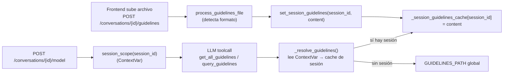

# Configuración

> Toda la configuración del backend se carga desde un único archivo
> `.env` en la raíz de `agent-modeler/`. El módulo `src/config.py`
> expone un singleton `settings` que centraliza el acceso. No hay
> archivos de configuración por entorno — el deploy decide qué `.env`
> inyectar.

## 1. Variables de entorno

### 1.1 Azure AI Foundry (LLM)

| Variable | Descripción | Default | Requerida |
|----------|-------------|---------|-----------|
| `FOUNDRY_PROJECT_ENDPOINT` | URL del proyecto en Azure AI Foundry | — | ✓ |
| `FOUNDRY_MODEL` | Modelo LLM | `gpt-4o` | — |
| `FOUNDRY_API_KEY` | API key (también se usa para los clientes de Azure OpenAI Embeddings) | `""` | parcialmente* |

*Requerido cuando `AZURE_OPENAI_ENDPOINT` está configurado para
embeddings; opcional si solo se usa el chat client con Service Principal.

### 1.2 Azure Service Principal (autenticación con AI Foundry)

| Variable | Descripción | Requerida |
|----------|-------------|-----------|
| `APP_AZURE_TENANT_ID` | Tenant ID de Azure AD | ✓ |
| `APP_AZURE_CLIENT_ID` | Client ID de la app registrada | ✓ |
| `APP_AZURE_CLIENT_SECRET` | Client secret | ✓ |

El backend usa `ClientSecretCredential` para hablar con AI Foundry.
El Service Principal necesita `Cognitive Services User` (o equivalente)
sobre el recurso de AI Foundry.

### 1.3 Azure OpenAI Embeddings (diccionario semántico)

| Variable | Descripción | Default |
|----------|-------------|---------|
| `AZURE_OPENAI_ENDPOINT` | Endpoint de Azure OpenAI | `""` |
| `AZURE_OPENAI_API_VERSION` | Versión de API | `2025-01-01-preview` |
| `AZURE_OPENAI_EMBEDDING_DEPLOYMENT` | Nombre del deployment de embeddings | `text-embedding-3-small` |
| `VECTOR_SIMILARITY_THRESHOLD` | Umbral de similitud para inyectar el diccionario semántico mandatorio | `0.85` |

Si estas variables faltan o el endpoint falla, el pipeline degrada
silenciosamente: no inyecta el bloque "DICCIONARIO SEMÁNTICO
MANDATORIO" pero todo lo demás funciona.

### 1.4 Cosmos DB for MongoDB (persistencia)

| Variable | Descripción | Default |
|----------|-------------|---------|
| `COSMOS_CONNECTION_STRING` | Connection string completo a la cuenta Cosmos DB | `""` |
| `COSMOS_DATABASE` | Nombre de la base de datos | `db_modeler` |

Cuando `COSMOS_CONNECTION_STRING` no está, `motor_client.connect()`
falla en el lifespan y todos los endpoints que toquen DB devuelven 500.
La app igual arranca para que `/api/health` siga reportando estado.

### 1.5 Autenticación

| Variable | Descripción | Default |
|----------|-------------|---------|
| `AUTH_SECRET` | Secret HS256 compartido con el frontend Next.js. **Debe coincidir literalmente** entre `web-data-model-hub/.env` y `agent-modeler/.env`. | dev fallback (no usar en prod) |

> ⚠️ Si los dos `.env` divergen, el browser firma el JWT con un secret
> y el backend lo valida con otro → 401 silencioso en cada request.
> Esta es la causa más frecuente de "el login se queda colgado".

### 1.6 Pipeline / concurrencia

| Variable | Descripción | Default |
|----------|-------------|---------|
| `MAX_CONCURRENT_PIPELINES` | Nº máximo de POST `/conversations/{id}/model` concurrentes en todo el proceso. Se materializa como `asyncio.Semaphore`. | `5` |
| `PER_TABLE_PARALLELISM` | Tablas por turno procesadas en paralelo dentro de un mismo request. | `4` |
| `LLM_RPM_CAP` | Tokens de la ventana del rate limiter (60s deslizantes). Conservador para el quota típico de Foundry. | `30` |
| `LLM_MAX_RETRIES` | Reintentos cuando se detecta un 429 del LLM (backoff con jitter). | `4` |
| `AGENT_MAX_OUTPUT_TOKENS` | `max_tokens` que se envían al LLM por llamada. | `8000` |

Cómo interactúan los tres limitadores:

```
┌─────────────────────────────────────────────────────────────┐
│ POST /conversations/{id}/model                              │
│   ┌─────────────────────────────────────────────────────┐   │
│   │ 1. Excel parseado → N tablas                        │   │
│   │ 2. asyncio.gather(N tareas)                         │   │
│   │      └── local_sem (PER_TABLE_PARALLELISM = 4)      │   │
│   │            └── llm_rate_limiter.acquire()           │   │
│   │                  (LLM_RPM_CAP = 30/min global)      │   │
│   │                  └── pipeline_semaphore             │   │
│   │                        (MAX_CONCURRENT_PIPELINES=5) │   │
│   │                        └── workflow.run() → LLM    │   │
│   └─────────────────────────────────────────────────────┘   │
└─────────────────────────────────────────────────────────────┘
```

### 1.7 CORS

| Variable | Descripción | Default |
|----------|-------------|---------|
| `CORS_ORIGINS` | Lista separada por comas de orígenes permitidos. | `http://localhost:3000,http://127.0.0.1:3000` |

`allow_credentials=True` está fijo en código — sin él, el cookie
`modeler-auth` no cruza el origen y el frontend pierde la sesión.

### 1.8 Logging

| Variable | Descripción | Default |
|----------|-------------|---------|
| `LOG_FORMAT` | `pretty` (humano, colores) o `json` (un objeto por línea, ideal para colectores) | `pretty` |
| `LOG_LEVEL` | `DEBUG` / `INFO` / `WARNING` / `ERROR` / `CRITICAL` | `INFO` |

Cada request se loguea inicio/fin con `request_id`, `conversation_id`
(extraído del path si aplica) y duración en ms.

### 1.9 Motor de BD por defecto

| Variable | Descripción | Default |
|----------|-------------|---------|
| `DEFAULT_DB_ENGINE` | Engine asignado a una conversación cuando el frontend no lo especifica. | `databricks_sql` |
| `GUIDELINES_PATH` | Path opcional a un archivo de guidelines global (fallback cuando la sesión no subió uno propio). | `""` |

**Engines soportados** (`settings.SUPPORTED_ENGINES`):

```python
["databricks_sql", "cosmosdb", "sqlserver", "postgresql", "mysql"]
```

---

## 2. Archivo `.env.example`

```env
# ── Azure AI Foundry ─────────────────────────────────────────
FOUNDRY_PROJECT_ENDPOINT=https://<tu-recurso>.services.ai.azure.com/api/projects/<tu-proyecto>
FOUNDRY_MODEL=gpt-4o
FOUNDRY_API_KEY=<api-key-si-necesitas-embeddings>

# ── Azure Service Principal ─────────────────────────────────
APP_AZURE_TENANT_ID=<tenant-id>
APP_AZURE_CLIENT_ID=<client-id>
APP_AZURE_CLIENT_SECRET=<client-secret>

# ── Embeddings (vector search) ──────────────────────────────
AZURE_OPENAI_ENDPOINT=https://<recurso>.openai.azure.com/
AZURE_OPENAI_API_VERSION=2025-01-01-preview
AZURE_OPENAI_EMBEDDING_DEPLOYMENT=text-embedding-3-small
VECTOR_SIMILARITY_THRESHOLD=0.85

# ── Cosmos DB ───────────────────────────────────────────────
COSMOS_CONNECTION_STRING=mongodb+srv://...
COSMOS_DATABASE=db_modeler

# ── Auth (DEBE coincidir con web-data-model-hub/.env) ───────
AUTH_SECRET=<secret-largo-y-aleatorio>

# ── Pipeline / concurrencia ─────────────────────────────────
MAX_CONCURRENT_PIPELINES=5
PER_TABLE_PARALLELISM=4
LLM_RPM_CAP=30
LLM_MAX_RETRIES=4
AGENT_MAX_OUTPUT_TOKENS=8000

# ── CORS / engine ───────────────────────────────────────────
CORS_ORIGINS=http://localhost:3000,http://127.0.0.1:3000
DEFAULT_DB_ENGINE=databricks_sql
GUIDELINES_PATH=

# ── Logging ─────────────────────────────────────────────────
LOG_FORMAT=pretty
LOG_LEVEL=INFO
```

---

## 3. Acceso desde código

```python
from src.config import settings

settings.FOUNDRY_MODEL                        # "gpt-4o"
settings.SUPPORTED_ENGINES                    # ["databricks_sql", ...]
settings.VECTOR_SIMILARITY_THRESHOLD          # 0.85
settings.COSMOS_DATABASE                      # "db_modeler"
settings.PROJECT_ROOT                         # absolute Path al repo
```

`Settings` es un singleton plano sin Pydantic — la sencillez es
deliberada. Todas las rutas (`GUIDELINES_PATH`) se resuelven contra
`PROJECT_ROOT`, de modo que el backend funciona igual sea que se
invoque desde la raíz del repo o desde cualquier subdirectorio.

---

## 4. Estructura de las guidelines

El backend acepta guidelines en cualquiera de estos formatos —
**uno solo por sesión**, subido por el usuario en
`POST /api/conversations/{id}/guidelines`:

| Extensión | Formato | Notas |
|-----------|---------|-------|
| `.json` | preferido | búsqueda por clave directa con `query_guidelines` |
| `.md` / `.txt` | texto plano | el LLM lo lee íntegro con `get_all_guidelines` |
| `.pdf` / `.docx` | binario | se convierten a Markdown con Docling (`convert_to_markdown`) y se cachean al lado del original |
| `.xlsx` | tablas | una pestaña por sección |

### Ejemplo en JSON (canónico)

```json
{
  "version": "1.0",
  "area": "default",
  "naming_conventions": {
    "table_prefix": "tbl_",
    "column_case": "snake_case",
    "column_prefixes": {
      "identifier": "id_",
      "name": "name_",
      "date": "date_",
      "amount": "amount_",
      "flag": "flag_"
    },
    "reserved_words_to_avoid": ["user", "table", "order"],
    "max_column_name_length": 64,
    "max_table_name_length": 64
  },
  "audit_columns": {
    "required": true,
    "applies_to": "ALL tables except static reference (r*) and temporary (t*)",
    "columns": [
      { "column_name": "tscreated",   "data_type": "TIMESTAMP", "nullable": false, "default": "CURRENT_TIMESTAMP", "description": "Fecha y hora de creación" },
      { "column_name": "tsupdated",   "data_type": "TIMESTAMP", "nullable": true,  "description": "Fecha y hora de última modificación" },
      { "column_name": "srcbatchid",  "data_type": "STRING",    "nullable": true,  "description": "ID del batch que cargó el registro" }
    ]
  },
  "primary_key_conventions": { "naming_pattern": "id_{entity}", "preferred_type": "BIGINT" },
  "data_type_mappings": {
    "databricks_sql": { "VARCHAR": "STRING", "BOOLEAN": "BOOLEAN" },
    "sqlserver":      { "VARCHAR": "NVARCHAR", "BOOLEAN": "BIT" },
    "postgresql":     { "VARCHAR": "VARCHAR", "BOOLEAN": "BOOLEAN" },
    "mysql":          { "VARCHAR": "VARCHAR", "BOOLEAN": "TINYINT(1)" },
    "cosmosdb":       { "VARCHAR": "string",  "BOOLEAN": "boolean" }
  }
}
```

### Cómo se aplican las guidelines



---

## 5. Catálogo de columnas — Cosmos DB

El catálogo histórico vive en la colección `column_catalog` (misma
cuenta de Cosmos DB que el resto):

```json
{
  "_id": "id_customer",
  "column_name": "id_customer",
  "functional_definition": "Identificador único del cliente",
  "data_type": "BIGINT",
  "used_in_tables": ["tbl_customers", "tbl_orders"],
  "is_new": false,
  "flgactive": true,
  "embedding": [0.123, -0.456, ...]
}
```

| Atributo | Detalle |
|----------|---------|
| `_id` | nombre exacto de la columna (PK física) |
| `embedding` | vector 1536-dim de `text-embedding-3-small`. Se regenera en cada `upsert_entry` cuando se actualiza la definición funcional. |
| Vector index | `cosmosSearch` con `kind=vector-ivf`, `numLists=1`, `similarity=COS`. Se crea idempotentemente en `ensure_index()`. |
| `flgactive` | soft-delete (mismo patrón que el resto del sistema). |

### Comportamiento en runtime

- **Lectura** (`build_prompt` durante el modelado): vectoriza las
  definiciones funcionales del input en un solo batch async, busca
  matches con similitud ≥ `VECTOR_SIMILARITY_THRESHOLD` y los inyecta
  como diccionario mandatorio en el prompt.
- **Escritura**: el agente no agrega nuevas entradas al catálogo en
  el flujo del modelado actual (decisión de diseño — lo hace un job
  posterior fuera del camino caliente).
- **Concurrencia**: las operaciones sync usan `MongoClient` con un
  lock por proceso; las async usan Motor.

---

## 6. Dependencias

`requirements.txt`:

```
agent-framework>=0.1
fastapi>=0.110
uvicorn[standard]>=0.27
motor>=3.4                  # Cosmos DB async
pymongo>=4.6                # Cosmos DB sync (vector index)
pyjwt>=2.8                  # JWT HS256
bcrypt>=4.1                 # password hashing
openai>=1.40                # Azure OpenAI Embeddings
azure-identity>=1.15
docling>=2.0                # PDF/DOCX → Markdown
openpyxl>=3.1               # Excel parsing
python-docx>=1.0
pdfplumber>=0.10
pydantic>=2.0
pydantic-settings>=2.0
rich>=13.0                  # logging pretty
python-dotenv>=1.0
```

### Instalación

```bash
python3.12 -m venv .venv
source .venv/bin/activate
pip install -r requirements.txt
```

### Verificación rápida

```bash
# Importa todo el backend sin arrancar el servidor — debe terminar en 0
python -c "from api.main import app; print('ok')"

# Corre la suite de tests (si existe)
pytest -q
```
