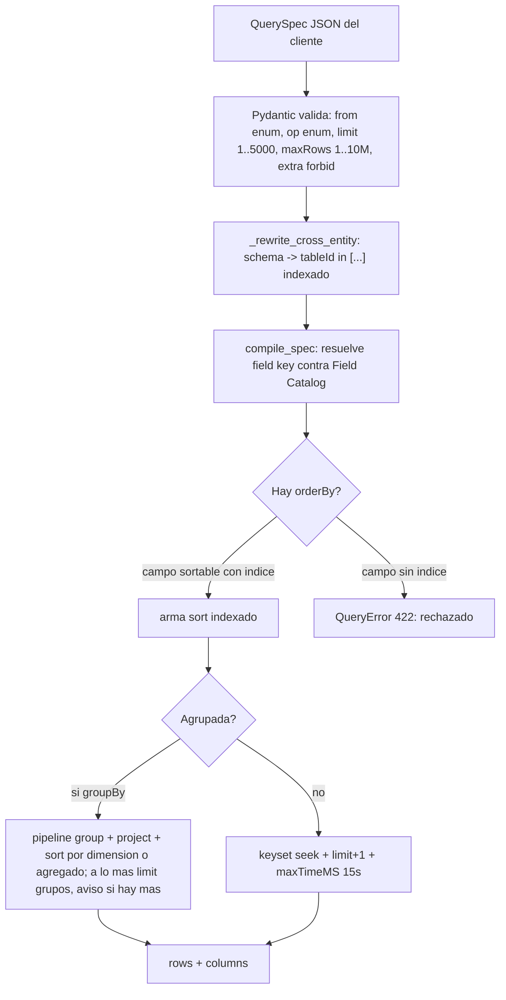
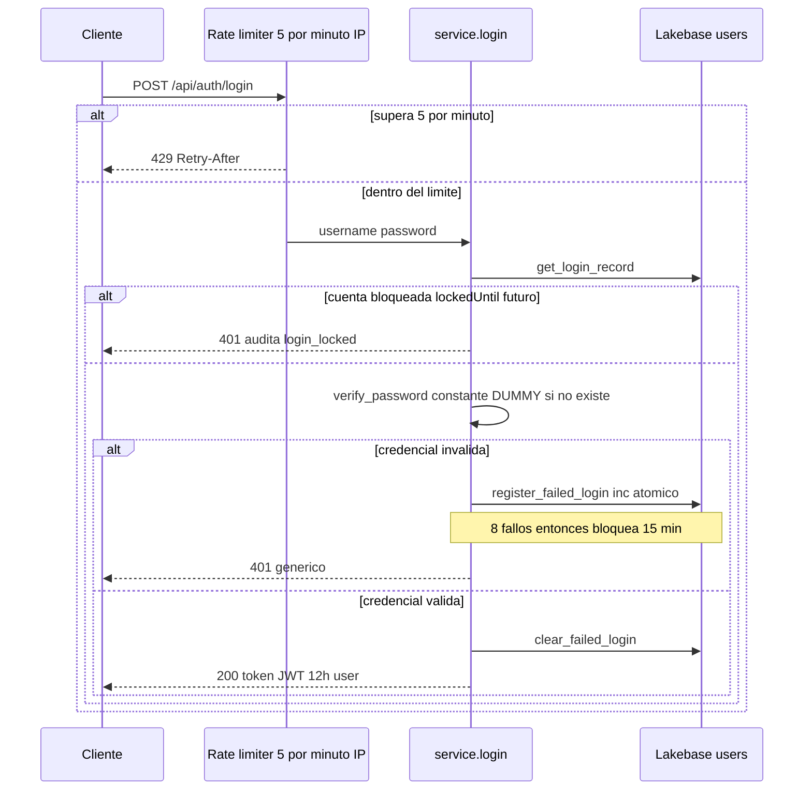
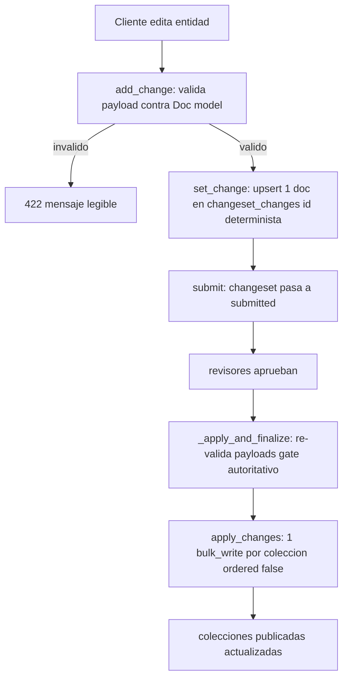
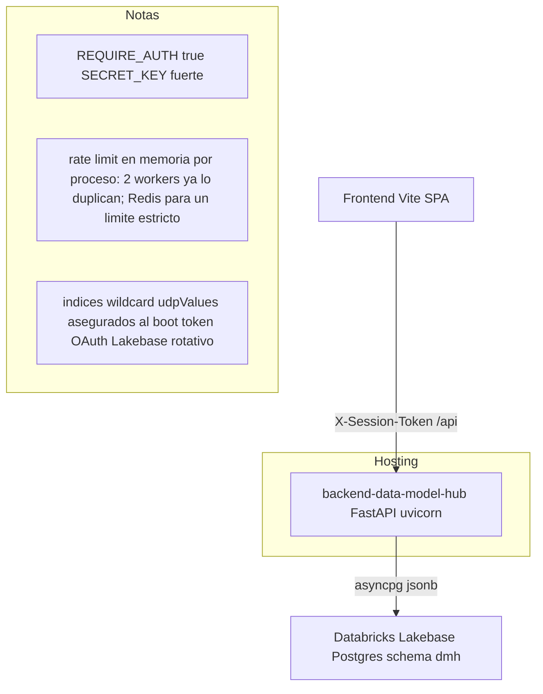

# Consideraciones y límites del backend — Data Model Hub

Actualizado: 2026-09-30 (doc 105: topes y cursor del Reporting —`LIMIT` como tope total, agrupados con tope y aviso, export de agrupados—, allowlist de cláusulas del editor SQL y, en las rondas 4–5, topes del texto y del anidamiento del WHERE, UDP por tipo y `resultColumns` (§3.9), camino rápido y proyección del adaptador, escrituras directas cerradas, jobs de la carga Excel en la BD, valores de UDP validados por tipo al escribirlos —rondas 6–7: los números en su forma canónica y el default del perfil de carga— (§6.3)); antes, 2026-08-01.

Este documento describe las **consideraciones de diseño, los límites duros y las decisiones de escala** del backend de plataforma (`backend-data-model-hub`: FastAPI cuyo adaptador `app/core/db/lakebase/` corre sobre **Databricks Lakebase Postgres**, la única base de datos). El adaptador emula la superficie de tipos y operaciones de pymongo (`ReturnDocument`, `UpdateOne`, `DuplicateKeyError`) traduciéndola a SQL/JSONB — no conecta a Mongo. No es un backend conmutable: no hay driver Mongo ni switch de backend, y el acceso a datos está confinado tras el adaptador. Está escrito para desarrolladores y stakeholders técnicos que necesitan entender hasta dónde aguanta la plataforma, por qué se tomaron ciertas decisiones y qué queda pendiente de endurecer.

Se basa en el código real (`app/features/reporting/query/`, `app/core/`, `app/core/db/lakebase/`, `app/features/auth/`, `app/features/changesets/`) y en los documentos de plan de implementación `04-STRESS-TEST`, `07-REPORTING-ENGINE`, `08-SECURITY-HARDENING` y, para el backend de datos vigente, los docs `28` (Lakebase) y `32b`–`36`.

---

## 1. Resumen ejecutivo de límites

| Dimensión | Límite / valor | Dónde vive en el código |
|---|---|---|
| Escala validada (sintética) | 10.000 tablas · 400.000 columnas · 9.178 vistas · 150 canvases · 7.336 relaciones | prueba de estrés 2026-07-05 (script retirado), doc `04` |
| Escala real en producción | 2.108 tablas · 96.184 columnas · 1.932 vistas · 275 canvases | foto de BD 2026-07-26, sección 2.4 |
| Circuit-breaker de consulta | `maxTimeMS = 15000` (15 s) | `reporting/query/executor.py` |
| Tope de página de una consulta | `QuerySpec.limit`: default 100, mínimo 1, **máximo 5000** (`MAX_PAGE`) · tope TOTAL `QuerySpec.maxRows`: 1–10 000 000 (`MAX_ROWS`; es el `LIMIT n` del editor SQL, doc 105) | `reporting/query/spec.py` |
| Grupos de una consulta agrupada | a lo más `limit` grupos (y no más que `maxRows`), sin paginar; si hay más, aviso en `meta.warnings` · el export CSV los trae todos hasta `MAX_EXPORT_GROUPS = 100_000` (más: 422 antes del stream; doc 105) | `reporting/query/executor.py` |
| Paginado de `GET /api/reporting/tables` | `limit` 0–100 000 · `offset` 0–1 000 000 (fuera de rango: 422, doc 105 A2-o4) | `reporting/router.py` |
| Lote de la hoja Relationships del export | 1–300 `tableIds` por `POST /api/reporting/insights/relationships/query`, sin tope de filas (doc 105 A3-o1) | `reporting/router.py`, `reporting/schemas.py` |
| Página interna del export | 2000 filas por lote (keyset, streaming) | `reporting/query/router.py` |
| Vida del token de sesión | JWT HS256, TTL **720 min (12 h)**, sin revocación | `core/config.py`, `core/security.py` |
| Rate limit del login | **5 requests/minuto por IP** → 429 | `features/auth/router.py` |
| Lockout de cuenta | **8 fallos consecutivos → bloqueo 15 min** (estado en la BD: compartido por los 2 workers) | `features/auth/service.py`, `features/auth/repository.py` |
| Política de contraseña | min 10 / max 128 (al crear/cambiar, no en login) | `features/admin/schemas.py`, doc `08` |
| Clip de contraseña bcrypt | 72 bytes (determinista, documentado) | `core/security.py` |
| Un doc por cambio en `changeset_changes` | regla del versionado por changesets (un doc por cambio), invariante de escala | `features/changesets/repository.py` |
| Estado del rate limit | **En memoria por proceso** (no compartido entre los 2 workers de uvicorn ni entre réplicas) | `core/ratelimit.py` |
| Texto con NUL (U+0000), con un surrogate UTF-16 suelto o que no es UTF-8 | Rechazado en la puerta: ruta, query o cuerpo JSON con NUL, un surrogate suelto en el cuerpo o —ronda 4— un cuerpo que no es UTF-8 válido → 400 (Postgres no acepta el NUL en `text`/`jsonb` y asyncpg no puede codificar el surrogate; doc 105). Detección en C, sin copia extra del cuerpo, dentro del allowlist de hosts y de CORS | `core/nul_guard.py` |
| Texto del editor SQL | Hasta **100 000 caracteres** (`SQL_TEXT_MAX`; más: 422 `The SQL text is too long: up to 100,000 characters.`), parseado una vez por request (doc 105, rondas 4–5) | `reporting/query/router.py` |
| Anidamiento del WHERE | Hasta **50 niveles** de grupos (`MAX_WHERE_DEPTH`; más: 400 por SQL, 422 por el constructor); una cadena plana de `AND`/`OR` es UN grupo de N condiciones (doc 105, ronda 5) | `reporting/query/spec.py`, `reporting/query/parser.py` |
| Largo del nombre físico (`naming_config.maxLength`) | Entero ≥ 0 estricto (negativo o booleano → 422 en `standards/apply`); **0 = sin tope**; default 150 (doc 105) | `data_standards/schemas.py`, `settings/repository.py` |

---

## 2. Escala probada: sintética (10k tablas / 400k columnas) y real (DDV)

La prueba de estrés (2026-07-05, doc `04-STRESS-TEST`; su script se retiró del repo) cargó data sintética al volumen objetivo (aproximadamente 15k tablas de techo) y midió los endpoints calientes con autenticación por token y RBAC activos.

### 2.1 Data cargada

| Colección | Documentos |
|---|---|
| `canonical_tables` | 10.000 |
| `canonical_columns` | 400.000 (~40 columnas por tabla) |
| `views` | 9.178 (80% de las tablas con al menos una vista) |
| `subject_areas` (canvases) | 150 (30 de ellos con 100 tablas) |
| `relationships` | 7.336 |

**Carga real:** 146 s · **0 throttles** · aproximadamente 2.600 columnas/s. El generador inserta por lotes en streaming (poca memoria) con **tolerancia a throttling** (reintenta el lote con backoff exponencial ante `429` / `code 16500`) y recrea los índices al final.

### 2.2 Latencias observadas

| Endpoint / camino | Latencia | Veredicto |
|---|---|---|
| Búsqueda de catálogo (`q` + `limit=50`) | ~190 ms | El search server-side aguanta |
| Listar todas las tablas (10k) | ~0,6–1,4 s | Aceptable |
| Canvas de 100 tablas · tablas | ~150–240 ms | Bien |
| Canvas de 100 tablas · columnas (4.000) | ~0,9–1,3 s | El lienzo más pesado, usable |
| Reporting · carga inicial (`limit=50`) | ~1,0 s | Bien, tras el fix |
| Reporting · "ver todo" (10k filas) | ~4 s | Acción explícita, poco frecuente |

### 2.3 El cuello crítico que se encontró y arregló

`GET /api/reporting/tables` tardaba **24.055 ms** a 400k columnas (inutilizable; en producción haría timeout u OOM). La causa de raíz: `report_inputs()` **materializaba las 400.000 columnas enteras** solo para contar columnas por tabla, y además cargaba los 150 canvases con sus campos pesados (`layout` / `drawings`) y las 7.336 relaciones completas.

El fix aplicó tres capas:

1. **Conteo server-side** con agregación `$group` por `tableId` sobre el índice: 400k documentos se reducen a 10k pares (24 s → ~2 s).
2. **Proyección** de `subject_areas` a `{name, projectId, tableIds}` (sin `layout`/`drawings`) y de `relationships` a `{source, target}`.
3. **Fast-path de la carga inicial**: con `limit` y sin filtros trae solo las primeras N tablas (orden físico por índice `physicalName`) más conteos, relaciones y canvases acotados a esas tablas.

Resultado: la pantalla inicial (`limit=50`) pasó de **24 s a ~1 s (24x)**.

> Lección transversal: **nunca materializar la colección completa por request**. Contar y agregar server-side, proyectar lo mínimo, y acotar por slice.

### 2.4 Escala real en producción (foto 2026-07-26)

Además de la prueba sintética, la plataforma sostiene el modelo DDV real migrado desde Erwin (un solo proyecto-familia "Modelo de Datos DDV_FISICO"): **2.108 tablas · 96.184 columnas · 1.932 vistas · 275 canvases**. La carga del XML más grande (1,8 GB) tomó **116 s con 97.577 escrituras**, gracias al fast-path de `bulk_write` del adaptador Lakebase: lotes de 1.000 operaciones, cada lote resuelto en **2 round-trips** (un `UPDATE` con `unnest` + un `INSERT … ON CONFLICT DO NOTHING`, en una transacción). Desde el doc 105 (P10) el `INSERT` lleva sólo las operaciones con `upsert` del lote (y no corre si no hay ninguna): antes, con un solo upsert en el lote se insertaban TODOS sus ids, y la baja de algo creado y borrado en el mismo draft dejaba una fila fantasma sin `projectId`.

El canvas más denso de esa carga (392 nodos, aproximadamente 99 mil filas de columnas/sources) no era un problema del backend: el diagrama llega en una sola respuesta y el cuello estaba en el DOM del navegador. Se resolvió en el **frontend** con LOD/zoom semántico (2026-07-25; el detalle vive en el documento de consideraciones del frontend). La palanca backend complementaria — dieta del payload del diagrama — queda pendiente y solo se activará si la apertura del canvas sigue lenta tras el LOD.

---

## 3. Reglas de escala del motor de reporting

El motor de reporting gira alrededor de un único contrato serializable, el **`QuerySpec`** (IR en JSON), producido por el query-builder visual o por el parser SQL, y consumido por el compilador → pipeline de Mongo, la grilla y el export. Un motor, un validador, un pushdown.

```jsonc
{
  "from": "columns",
  "select": ["physicalName", "dataType", "parentDomain", "udp.<defId>"],
  "where": { "op": "and", "conditions": [
      { "field": "schema", "op": "eq", "value": "core" },
      { "field": "udp.<defId>", "op": "in", "value": ["DAC", "Sensible"] },
      { "field": "parentDomain", "op": "isnull" }
  ]},
  "orderBy": [{ "field": "physicalName", "dir": "asc" }],
  "limit": 100, "cursor": "…"
}
```

El `op` es un **enum cerrado** (`eq, ne, in, nin, contains, startsWith, gt, gte, lt, lte, between, exists, isnull`), forzado dos veces (Pydantic `Literal` + `OPS_BY_TYPE`). El `from` solo acepta `columns | tables | relationships | views`. El cliente **nunca** manda paths de Mongo: manda una `key` pública que se resuelve contra el Field Catalog server-side.

### 3.1 Paginación keyset/seek — nunca skip profundo

A escala, el `skip/limit` profundo es una regla a evitar: un `OFFSET` profundo barre y descarta las filas saltadas antes de devolver la página (con cientos de miles de columnas, inviable). El executor pagina por **keyset (seek)** sobre el primer campo de orden más el `_id` como desempate.

Del `executor.py`, la condición de continuación se inyecta directo al `$match`:

```python
# keyset sobre el primer campo de orden (+ _id de desempate)
sort = list(compiled.sort) or [(DEFAULT_SORT_FIELD.get(spec.from_, "physicalName"), 1)]
sort_path, sort_dir = sort[0]
full_sort = [(sort_path, sort_dir)] + ([] if sort_path == "_id" else [("_id", 1)])
delivered = 0
if cursor:
    cv, cid, *rest = _decode_cursor(cursor)
    delivered = rest[0] if rest else 0
    base_match = {"$and": [base_match, _after(sort_path, sort_dir, cv, cid)]}
page = _page_size(spec, delivered)                  # 0 = el tope ya se entregó: página vacía
```

`_after` arma el «después del cursor» con el tramo de nulos aparte —un registro sin el campo va primero en ASC y al final en DESC, como el ORDER BY del adaptador— porque comparar contra `null` no existe en Lakebase (doc 100, 7.2). Se pide una fila más que la página para saber si `hasMore`, y el `nextCursor` codifica `[valor_de_orden, _id]` en base64 —con tope total `maxRows` (§3.5), `[valor_de_orden, _id, entregadas]`: cada página se recorta a lo que falta y, al llegar al tope, no hay cursor siguiente (doc 105)—. La grilla del frontend hace scroll infinito por cursor con memoria constante aun scrolleando 400k filas.

Como el cursor lo devuelve el cliente, `_decode_cursor` sólo acepta `[valor, _id]` —o `[valor, _id, entregadas]`, con un entero de 0 a 10 000 000 (`_delivered_ok`)— con `_id` de texto que Postgres acepte y un valor que el keyset pueda comparar —`null`, ese mismo texto o número finito (`_cursor_value_ok`)—; cualquier otra cosa responde 400 «Invalid cursor». Doc 105 (P12): antes sólo rechazaba dict/list, y un booleano, un NaN/±Infinity o un NUL (U+0000, que Postgres rechaza en `text`) armados a mano llegaban al traductor de Lakebase y salían como 500; ronda 3: tampoco pasa un surrogate UTF-16 suelto, que asyncpg no puede codificar (`_cursor_text_ok`; detalle en `seguridad.md` §10.3).

### 3.2 Pushdown de filtros indexados

Todos los filtros bajan al `$match` que corre sobre índices. Los predicados de nivel tabla dentro de una consulta a `columns` (por ejemplo `schema`, que vive en la tabla y no en la columna) se **pre-resuelven** a un set de `tableId` con un barrido barato de las 10k tablas y se inyectan como `{tableId: {$in: [...]}}`, que sí es indexado:

```python
# _rewrite_cross_entity: schema (vive en la tabla) → tableId $in [...]
if fd and fd.entity == "table" and node.field == "schema":
    ids = [str(t["_id"]) async for t in
           db["canonical_tables"].find({**ACTIVE, "schema": {"$in": vals}}, {"_id": 1})]
    return Condition(field="tableId", op="in", value=ids or ["__none__"])
```

Solo se soporta `= / in` para el filtro cross-entity por `schema`; otros operadores se rechazan con 422 (`The schema filter only supports = and in (schema comes from the table).`). Doc 105 (ronda 4): tampoco se agrupa ni se agrega —422 `Field 'schema' comes from the table: it can't be grouped or aggregated here.`; el catálogo lo publica con `groupable: false`—, porque no existe en el documento de la columna y todo caía en un único grupo `null`.

### 3.3 El planner rechaza `.sort()` sin índice

A escala, un orden sobre un campo sin índice caería en full-scan; por eso es un invariante de escala. El compilador (puro y testeado) clasifica cada orden y **rechaza** el que no se apoya en un índice:

```python
# Planner de orden: un row-sort exige índice (sortable) o se rechaza. Y UN
# solo campo: el keyset pagina por él + `_id` (doc 105: el segundo se ignoraba).
if len(spec.orderBy) > 1:
    raise QueryError("Sort by one field: rows are paged by a single sort field.", code=422)
for o in spec.orderBy:
    fd = _field(catalog, o.field)
    if not fd.sortable:
        sortable = [k for k, f in catalog.items() if f.sortable]
        raise QueryError(
            f"Can't sort by {field_label(fd)!r}: it has no index. "
            + (f"Sort by an indexed field: {', '.join(sortable)}." if sortable
               else "This entity has no sortable field: rows come in their default order."),
            code=422)
```

En cambio, cuando la consulta es agrupada (`groupBy`), el orden se aplica sobre el resultado agrupado y no exige índice, pero sólo por una dimensión del `groupBy` o por el nombre de una agregación (doc 105, ronda 3): otro campo no existe en el grupo y el constructor lo ignora con un aviso en `meta.warnings` —`Sort by '<campo>' was ignored: in a grouped query sort by a grouped field or an aggregation name.`—; el editor SQL lo rechaza (§3.8). El agrupado no pagina (`nextCursor` siempre `null`): trae a lo más `limit` grupos, y no más que `maxRows` (§3.5); si hay más grupos que la página —no porque los cortó el `LIMIT` pedido—, lo avisa en `meta.warnings` con `Only the first <n> groups are shown: filter or group by fewer values.` (doc 105; antes se cortaba sin aviso). El export los trae todos (§3.6).

Las agregaciones son `count`, `countDistinct`, `sum`, `avg`, `min` y `max`. Doc 105 (ronda 3): `count` cuenta FILAS y no lleva campo (con campo, 422 `count counts rows and takes no field: use countDistinct to count distinct values.`; antes lo ignoraba); `countDistinct` cuenta los valores distintos NO vacíos —ignora nulo, ausente y texto vacío, como `COUNT(DISTINCT x)` de SQL y como el `isnull` del motor—. El nombre de cada agregación es una columna de salida: identificador simple (letras, dígitos y `_`, sin empezar con dígito) de hasta 64 caracteres, distinto de `_id`, que no se repite ni choca con un campo del `groupBy` (422 `Invalid aggregation name '<nombre>': use letters, digits and _ (up to 64, not starting with a digit, not _id).` o `The aggregation name '<nombre>' is repeated: give each aggregation its own name, different from the grouped fields.`; un `_id`, un `$x` o un nombre con punto rompían el `$group` con un 500). Agrupar por un UDP trae la dimensión (el pipeline usa claves internas `g0…`/`a0…` y el executor devuelve los nombres públicos; antes salía siempre `null`), y un agregado global —sin `groupBy`— sin filas devuelve una fila (conteos en 0, el resto vacío), como SQL. Las rondas 4 y 5 afinaron los agrupados (nombres sin distinguir mayúsculas, `SUM` nulo, orden por booleanos, `resultColumns`): §3.9.

### 3.4 Sanitización de operadores de texto

`contains` y `startsWith` construyen un regex con `re.escape` — nunca un regex arbitrario del cliente, cerrando ReDoS e inyección:

```python
if op == "contains":
    return {p: {"$regex": re.escape(str(value)), "$options": "i"}}
if op == "startsWith":
    return {p: {"$regex": "^" + re.escape(str(value)), "$options": "i"}}
```

El value siempre se castea al tipo del campo (`_coerce`); los valores de UDP se fuerzan a string porque en storage todo `udpValues` es `dict[str, str]`. Doc 105 (P12, revisión): un campo `number` exige un valor FINITO que quepa en un float (400 `Invalid number for <campo>: it must be a finite number.`; `NaN`, `Infinity`, `1e999` o un entero desmedido daban 500) y una comparación (`gt`…`between`) exige valor (400 `The <op> filter on <campo> needs a value.`; `{"$gt": null}` no lo soporta el traductor). El parser SQL también responde 400 ante `Number out of range: …`, `LIMIT must be a whole number.`, `Expected a field name: …` y `LIKE needs a text pattern: …` (antes, 500).

### 3.5 Circuit-breaker `maxTimeMS` y tope de página

Toda operación lleva `maxTimeMS = 15000` (15 s) como corta-fuego: si una consulta se pasa, se aborta en vez de colgar el proceso. El `QuerySpec.limit` está capeado por Pydantic entre 1 y **5000**, así que ningún cliente puede pedir una página arbitrariamente grande.

```python
MAX_TIME_MS = 15000   # executor.py
MAX_PAGE = 5000       # spec.py: tamaño máximo de una página
MAX_ROWS = 10_000_000 # spec.py: tope máximo del resultado TOTAL (doc 105)
limit: int = Field(default=100, ge=1, le=MAX_PAGE)
maxRows: int | None = Field(default=None, ge=1, le=MAX_ROWS)
```

Doc 105: `limit` es el tamaño de PÁGINA y `maxRows`, el tope TOTAL del resultado (`null` = sin tope). El `LIMIT n` del editor SQL es `maxRows`, como en SQL: la primera página trae `min(n, 5000)` filas y las siguientes —«Load more», `view_columns` y el export— se detienen al llegar a `n` (`_page_size` recorta cada página a lo que falta; el cursor lleva lo ya entregado y, al llegar al tope, no hay `nextCursor`). Antes `LIMIT n` era sólo el tamaño de la primera página y lo demás seguía más allá. Sin `LIMIT`, todo, por páginas de 100.

Doc 105 (A2-o4): las paginaciones por número también tienen tope, como `catalog/search` — `GET /api/reporting/tables` acepta `limit` 0–100 000 y `offset` 0–1 000 000 (fuera de rango, 422) y el offset del cursor de `view_columns` llega hasta 1 000 000 (`MAX_VIEW_COLUMNS_OFFSET`; más allá, 400 «Invalid cursor»). Sin tope, un entero fuera de int8 llegaba al `LIMIT`/`OFFSET` de Lakebase y asyncpg lo rechazaba con un 500.

### 3.6 Export por streaming (memoria O(1))

El export NUNCA hace `to_list(None)` ni construye el archivo en el browser (eso podía OOMear con 400k filas). Pagina internamente por keyset (2000 filas por lote) y hace `yield` línea por línea con `StreamingResponse`:

```python
@router.post("/export")
async def export_csv(spec: QuerySpec):
    page_spec = spec.model_copy(update={"limit": 2000})
    try:
        first = await ex.run_query(page_spec, cursor=None)   # doc 105: ANTES de abrir el stream
    except QueryError as e:
        raise HTTPException(e.code, str(e)) from e
    async def _gen():
        # ... escribe header, luego itera páginas keyset y hace yield por lote
        page = first
        while True:
            for row in page["rows"]:
                w.writerow(...)
            yield flush()
            if not page.get("hasMore") or not page.get("nextCursor"):
                break
            page = await ex.run_query(page_spec, cursor=page["nextCursor"])
    return StreamingResponse(_gen(), media_type="text/csv", headers=...)
```

Verificado en vivo: export CSV de 33k+ líneas sin OOM. Doc 105 (P12, revisión): la primera página se pide ANTES de abrir el stream, así un spec inválido (campo, valor u orden) es un 4xx con `detail`; dentro del generador era un 500 o un archivo cortado. Un agrupado se exporta ENTERO (`run_query(page_spec, cursor=None, all_groups=True)`, doc 105): todos sus grupos en UNA agregación —o hasta `maxRows` si hay `LIMIT`—, no la «página» de 2000 que cortaba el CSV en silencio. El tope duro es `MAX_EXPORT_GROUPS = 100_000` (sólo se alcanza agrupando por un campo casi único): si el resultado lo pasaría —sin `LIMIT` o con uno mayor—, responde **422** antes de abrir el stream con `The grouped result has more than 100000 groups: filter, group by fewer fields or add LIMIT.`; con un `LIMIT n` de hasta 100 000, trae los `n` primeros sin error.

### 3.7 Diagrama del planner de consulta



### 3.8 Editor SQL: allowlist de cláusulas y semántica (doc 105, ronda 3)

El editor SQL (`POST /api/reporting/query/sql` y `/query/validate`) traduce el texto a un `QuerySpec` con sqlglot (`query/parser.py`). Hasta la ronda 3, varias cláusulas que el parser no traducía se ignoraban EN SILENCIO y la consulta devolvía otra cosa (un `OFFSET`, un `HAVING`, un `NOT LIKE` que corría como `LIKE`); ahora lo que no se traduce es un 400 con motivo (en `/query/validate`, un error con línea y columna):

- **Cláusulas:** sólo `SELECT`, `FROM <vista>`, `WHERE`, `GROUP BY`, `ORDER BY` y `LIMIT n`. Cualquier otra presente es `<CLÁUSULA> isn't supported.` (`DISTINCT`, `OFFSET` —también `LIMIT a, b`—, `HAVING`, `WITH`, `QUALIFY`, `WINDOW`, `FOR UPDATE`, `INTO`, `TABLESAMPLE`, `SORT BY`, `GROUP BY ROLLUP`, `GROUP BY ALL`…); `FETCH FIRST` → `FETCH isn't supported: use LIMIT n.`; `LIMIT 5 PERCENT` → `Only LIMIT n is supported (a whole number of rows).`; `LIMIT 0` o `-1` → `LIMIT must be at least 1.`; `FROM dmh.columns` → `Use the view name alone: FROM columns, FROM tables…`.
- **WHERE:** `NOT LIKE` se ejecuta negado (antes, como `LIKE`); `IS` sólo con `NULL` (`Only IS NULL and IS NOT NULL are supported: …`; `IS TRUE`/`IS NOT TRUE` se leían como `IS NULL`); comparar con `NULL` (`= NULL`, `IN (…, NULL)`) → `Compare with NULL using IS NULL or IS NOT NULL.`; `LIKE` acepta `'texto%'`, `'%texto%'` o `'texto'`: `'%texto'` → `LIKE '%text' (ends with) isn't supported: use '%text%' or 'text%'.` y un `%` en medio → `LIKE supports 'text%', '%text%' or 'text' — not '%' inside the text.` (antes se buscaban como texto literal).
- **SELECT y agregados:** `COUNT(*)` cuenta filas y `COUNT(DISTINCT campo)` es `countDistinct`; `COUNT(campo)` → `COUNT(field) isn't supported: use COUNT(*) or COUNT(DISTINCT field).` y `SUM`/`AVG(DISTINCT …)` → `DISTINCT is only supported as COUNT(DISTINCT field).`; en una consulta agrupada, `SELECT *` → `SELECT * can't be combined with GROUP BY or aggregations.` y un campo suelto → `Field '<campo>' must be in GROUP BY (or inside an aggregation).`; el alias sólo va en agregaciones (`Column aliases aren't supported (only on aggregations): …`) y sigue las reglas de nombre del §3.3.
- **ORDER BY:** en filas, un solo campo (`Sort by one field: rows are paged by a single sort field.`); en agrupadas, una dimensión o el nombre de una agregación (`Can't sort by '<campo>': in a grouped query sort by a GROUP BY field or an aggregation name.`); `NULLS FIRST/LAST` sólo si coincide con el orden que el motor ya aplica —vacíos primero en ASC y al final en DESC— (si no, `Empty values come first in ASC and last in DESC: NULLS FIRST/LAST can't change that.`).

Diferencias con SQL que se mantienen (documentadas en el fuzz del editor): en `LIKE`, `_` es literal, no comodín; `LIKE` sin `%` es igualdad exacta y con `%` no distingue mayúsculas; y `<>`/`NOT` incluyen los registros con el campo vacío (`$ne`/`$nor` del motor). Tests: `tests/features/reporting/test_query_round3_doc105.py` y el fuzz con SQLite de oráculo `test_sql_editor_fuzz_doc105.py`.

### 3.9 Motor de consulta: rondas 4 y 5 (doc 105)

Las revisiones R9 (ronda 4) y R12 (ronda 5) del motor encontraron consultas legítimas que daban 400, resultados distintos de SQL y entradas que congelaban el event loop. Lo que quedó:

- **Topes del texto y del WHERE.** El texto del editor admite hasta 100 000 caracteres (`SQL_TEXT_MAX`): más es 422 `The SQL text is too long: up to 100,000 characters.`, también en `/query/validate`, con un `detail` de texto (ronda 5: con `max_length` de pydantic era una lista y el front mostraba «Unexpected response shape»). Se parsea UNA vez por request, y un `;` inicial ya no es un 500. Una cadena plana de `AND`/`OR` es UN grupo de N condiciones (`flatten`, sin recursión: 300 `OR` congelaban el event loop y 1 000 daban 500); el anidamiento real (paréntesis, `NOT`) tiene tope de 50 niveles: 400 `The WHERE is nested too deeply (more than 50 levels).` por SQL y 422 con `The filter is nested too deeply (more than 50 levels).` por el constructor —medido sin recursión antes de construir los modelos; un `conditions` que no es lista también es 422, no 500— (ver `seguridad.md` §10.1).
- **`/query/validate` valida lo mismo que `/query/sql`** (ronda 4): corre también lo que el motor rechazaría al ejecutar (`check_spec`, sin tocar la BD), con el mismo mensaje; antes decía «válido» y la ejecución respondía 422.
- **UDP por tipo** (los valores se guardan como TEXTO, §4.2.3). En un UDP `number`, un rango (`gt`…`between`) y `SUM`/`AVG`/`MIN`/`MAX` son 422 —`udp."Num": UDP numbers are stored as text — filter them with =, <> or IN (a range would compare text: '10' < '5').` y `udp."Num": UDP numbers are stored as text — SUM, AVG, MIN and MAX would compare text.`— y el catálogo sólo le ofrece `eq`, `ne`, `in`, `exists` e `isnull`; la igualdad (`=`, `<>`, `IN`) busca el texto tal como se escribió y su forma canónica (`= 1e1` halla «10»; ronda 6: la misma `canonical_number` con la que la carga Excel y Data Standards graban el valor, compartida en `app/core/udp_values.py`). Ronda 5: un entero grande es exacto (no pasa por float: `9007199254740993` se buscaba como «…992»), un `IN` con `null` busca también la forma canónica (y el `null`, los vacíos) y lo que no es número sigue siendo 400 (`Invalid number for udp."Num": 'abc'`). En un UDP `boolean`, `=` y `<>` comparan contra las grafías booleanas sin distinguir mayúsculas —`true`, `1`, `sí`/`si`, `yes`, `verdadero` / `false`, `0`, `no`, `falso`—: antes `= TRUE` buscaba «True» y no hallaba nada; ronda 5: el valor puede ser cualquiera de esas grafías (`= 'Sí'` era 400) y otro sigue siendo 400 (`Invalid boolean for udp."Flag": '2' (use true or false).`). Un UDP `date` compara su texto ISO (`>= '2026-01-06'`). Las grafías viven en `app/core/udp_values.py`, compartido con quienes escriben los UDP (§6.3), y los mensajes nombran el UDP por su nombre (`udp."Flag"`), no por su key interna `udp.<id>` —en producción, un UUID— (ronda 5).
- **Agrupados.** `schema` en `columns` no se agrupa ni se agrega (§3.2). `SUM` sin ningún valor numérico es `NULL`, como SQL (`$sum` daba 0), y `SUM`/`AVG` de un campo no numérico es 422 `SUM and AVG need a numeric field: '<campo>' isn't one.` (daban 0). Ordenar por un booleano —una dimensión (ronda 4) o un `MIN`/`MAX` de un booleano (ronda 5)— usa una clave auxiliar 0/1 (vacío = `null`) que no sale en el resultado: Lakebase no ordena booleanos jsonb y `true`/`false` empataban. Los nombres de agregación se comparan sin distinguir mayúsculas, como un identificador SQL (ronda 5: `COUNT(*) AS DATATYPE` agrupando por `dataType` tapaba al campo en el `ORDER BY`; ahora es `The aggregation name 'DATATYPE' is repeated: …`, 400 por SQL y 422 por el constructor). Ronda 6: el nombre automático de un agregado sin alias también salta un alias que sólo difiere en mayúsculas (`COUNT(*) AS Count, COUNT(DISTINCT tableId)` da `Count` y `count_2`; elegía `count` y era 400); dos alias explícitos `n` y `N` siguen siendo el mismo nombre.
- **`resultColumns`** (ronda 5, sólo agrupados): las columnas del resultado, en su orden. El editor SQL lo arma cuando el `SELECT` no es «dimensiones y luego agregados» —agregados antes o entre las dimensiones, o una dimensión agrupada que no está en el `SELECT`, que se agrupa igual y no sale; antes, dos 400— y el export respeta ese orden. Una entrada que no es dimensión ni agregación es 422 `resultColumns must list grouped fields or aggregation names: '<x>' isn't one.`; en una consulta sin agrupar, 422 `resultColumns only applies to grouped queries.` —también en `view_columns` (ronda 6: se ignoraba en silencio y `/query/validate` no lo marcaba)—.
- **SQL legítimo que daba 400** (ronda 4): `BETWEEN` y `NOT BETWEEN`; vista y campos sin distinguir mayúsculas (`FROM COLUMNS`, `PHYSICALNAME`), también con alias de la vista (`FROM columns AS x … x.ordinal`); `IS NULL`/`IS NOT NULL` sobre booleanos; `GROUP BY 1` y `ORDER BY 2` por posición del `SELECT` (una posición que no existe: `ORDER BY 3: there is no SELECT item 3.`); `ORDER BY COUNT(*)` de un agregado que está en el `SELECT` (si no está: `ORDER BY an aggregation that is in the SELECT: MAX(ordinal)`); un alias en el `ORDER BY` sin distinguir mayúsculas; y los agregados sin alias con nombre automático `count`, `count_2`… (dos `COUNT` sin alias eran 400 por nombre repetido). Ronda 5: el agregado del `ORDER BY` se compara resuelto (`COUNT(1)` ≡ `COUNT(*)`, `MAX(c.x)` ≡ `MAX(x)`), un campo escrito exacto gana a un alias que sólo difiere en mayúsculas y `udp."ordinal"` es el UDP aunque exista el campo `ordinal`.
- **Paginado y costos** (ronda 4): `view_columns` pagina con un desempate único —vista, alias, columna, tabla y expresión; la tabla y la expresión, ronda 5: la misma columna de dos tablas, sin alias, empataba y repetía el `_id`—, sin repetir ni saltar filas y sin pisar la dirección pedida; la hidratación de nombres (dominio, esquema de la tabla) lee sólo los ids de la página —antes releía todos los dominios y tablas del proyecto en cada página—; y el scorecard suma las métricas de columnas sólo de tablas ACTIVAS.

Tests: `tests/features/reporting/test_query_round4_doc105.py`, `test_query_round5_doc105.py` y el fuzz de agrupados con SQLite de oráculo `test_query_grouped_fuzz_doc105.py` (`SELECT` intercalado, dimensiones fuera del `SELECT`, `MIN`/`MAX` de booleanos y el mismo CSV por `/query/validate` → `/export`).

---

## 4. Límites del backend de datos

El backend de datos es **Databricks Lakebase Postgres**, la única BD: cada colección vive como una tabla `(id text PRIMARY KEY, doc jsonb)` en el schema `dmh` y el adaptador de `app/core/db/lakebase/` traduce la superficie de colección tipo pymongo a SQL/JSONB. No es un backend conmutable (no hay driver Mongo ni switch de backend). Varias reglas de escala nacen de la naturaleza del sistema —ingesta por upserts masivos de los modelos XML de Erwin, versionado por changesets y volumen de cientos de miles de columnas— y se documentan en 4.2.

### 4.1 Lakebase Postgres (única BD)

El adaptador implementa un **alcance cerrado y fail-fast**: todo operador, stage o expresión fuera del alcance levanta `NotImplementedError` en vez de degradar en silencio (traducción incorrecta o scan accidental). El alcance se amplía solo cuando un caller real lo necesita.

- **Filtros soportados**: igualdad vía jsonpath lax (`doc @? …`, GIN-indexable), `$and/$or/$nor`, `$eq/$ne/$in/$nin`, `$gt/$gte/$lt/$lte` (strings comparados con `COLLATE "C"` para replicar el orden binario de Mongo), `$exists`, `$regex` (con `$options`).
- **Updates soportados**: `$set`, `$setOnInsert`, `$unset`, `$inc`, `$push`; cualquier otro operador → `NotImplementedError`.
- **Proyección de `find`**: inclusión (top-level y paths de 2 niveles como `udpValues.<defId>`) o exclusión top-level; mezclarlas → `NotImplementedError`. `{"_id": 1}` a secas devuelve SÓLO el id, como Mongo (doc 105, P9: se leía como una exclusión vacía y traía el documento completo — en el traductor y en el `find_one_and_update`).
- **Aggregation (alcance cerrado)**: stages `$match/$group/$project/$sort/$skip/$limit/$count/$unwind`; acumuladores `$sum/$avg/$min/$max/$addToSet`; expresiones `$cond/$ifNull/$eq/$gt/$in/$size/$not/$objectToArray`, más **`$add` y `$strLenCP`** (agregados 2026-07-25, cuando la primera corrida de `arrange_all.py` contra Lakebase los necesitó). La truthiness de Mongo está replicada. El **`$project` de exclusión NO está soportado** (solo proyección de inclusión).
- **Índices**: cada tabla lleva un GIN `jsonb_path_ops` sobre `doc` (las igualdades jsonpath hacen seek ahí) y, desde el doc 75 (D19), una **columna generada `project_id`** (`GENERATED ALWAYS AS (doc->>'projectId') STORED`): una igualdad o `$in` sobre `projectId` compila a la columna (`translate.COLUMN_FIELDS`), y los índices por `projectId` son btrees sobre esa columna (líder de los compuestos). El **único índice unique es `standards_versions (project_id, seq)`**; su violación se traduce a `DuplicateKeyError` de pymongo, así que la app no cambió su manejo de errores.
- **Credenciales**: el password de Postgres es un **token OAuth de ~60 minutos** acuñado vía SDK de Databricks; `fresh_token()` lo cachea 50 minutos (thread-safe) y el pool lo consume como callable async — cada conexión nueva recibe un token vigente.
- **Scale-to-zero**: el compute de Lakebase se suspende por inactividad; el pool **reintenta la conexión durante el wake** en vez de fallar el primer request tras la pausa.
- **`statement_cache_size=256`** en asyncpg (el SQL generado se repite mucho entre requests).
- **TLS**: `PGDIRECTTLS` elige entre TLS clásico y **TLS directo** (ALPN `postgresql`, requerido por front-ends "service direct"); vacío = auto.
- **Alcanzabilidad**: con **Service Direct private link** (workspace corporativo) el endpoint puede ser inalcanzable desde fuera del workspace — el front-end acepta el TCP pero resetea el handshake de Postgres (verificado 2026-07-28). Las cargas masivas del kit Erwin corren entonces DESDE el workspace con el notebook `scripts/databricks/carga_erwin_notebook.py` (cluster con access mode Dedicated), que invoca los mismos scripts.

### 4.2 Reglas de escala (ingesta XML masiva, changesets y volumen)

El backend está escrito defensivamente para la escala real de la plataforma: la ingesta carga modelos XML de Erwin por **upserts masivos** (cientos de miles de columnas en una corrida), el versionado trata cada cambio como su propio documento, y el reporting consulta ese volumen. Esta sección conserva el porqué de cada regla.

#### 4.2.1 Carga masiva por lotes

La ingesta de un modelo Erwin escribe por lotes en streaming. El `bulk_write` por `_id` del adaptador resuelve cada lote en 2 round-trips (un `UPDATE` masivo con `unnest` + un `INSERT … ON CONFLICT DO NOTHING`), lo que permite cargar cientos de miles de filas en minutos: la carga de estrés corrió a ~2.600 columnas/s (146 s para 400k columnas) sin degradación. El pool reintenta la conexión durante el wake del compute (scale-to-zero), de modo que una pausa no aborta la carga.

Dos reglas del camino rápido (doc 105, con tests contra un pool falso que registra cada sentencia: `tests/lakebase/test_adapter_bulk_doc105.py`): en un lote de `UpdateOne` el `INSERT` lleva sólo los ids de las operaciones con `upsert` (P10 — antes insertaba todos los del lote si alguno era upsert); y un lote de `ReplaceOne` va en UNA sentencia (`INSERT … ON CONFLICT DO UPDATE` si todos son upsert, `UPDATE` si ninguno) sólo si sus banderas `upsert` son iguales — uno mezclado va por el camino general (A2-o1: la sentencia única decidía con `all(...)` y un lote mezclado perdía sus upserts: salía un `UPDATE` a secas).

Consideración operativa transversal: los picos de `POST /query` sobre `canonical_columns` (400k docs) son las operaciones más caras del reporting; se acotan con proyección mínima, keyset y el `maxTimeMS` (15 s) como circuit-breaker.

#### 4.2.2 `.sort()` requiere índice

Ordenar por un campo **sin índice** cae en full-scan; a escala es inviable, así que es un invariante de escala reflejado en tres puntos:

- El planner del reporting rechaza el `orderBy` no indexado (sección 3.3).
- La búsqueda de catálogo ordena por `physicalName`, que tiene índice dedicado.
- El repositorio de changesets solo acepta `sort_field` si hay índice; sin él, ordena en Python tras el corte.

El índice de `physicalName` en `canonical_tables`/`canonical_columns` es **requerido** por la búsqueda server-side del catálogo (`?q=&limit=`), cuyo top-N se ordena por ese campo.

#### 4.2.3 Índice wildcard `udpValues.$**`

Los UDP (User Defined Properties) son columnas dinámicas que el usuario crea en runtime. No se puede crear un índice por cada key nueva sin DDL constante. La solución es un **índice wildcard** sobre el mapa embebido, en tablas y columnas:

```python
_try("canonical_columns", [("udpValues.$**", 1)]),
_try("canonical_tables",  [("udpValues.$**", 1)]),
```

Cubre todas las keys UDP presentes **y futuras**: `eq`, `$in` e `$exists` hacen seek. **Limitación load-bearing:** como `udpValues` es `dict[str, str]` (todos los valores son STRING, aun para UDP number/date), los operadores `=`, `IN` e `IS NULL` son de primera clase (index-backed); el **rango** (`>`, `<`, `BETWEEN`) compara texto: desde el doc 105 (ronda 4), sobre un UDP `number` es 422 —igual que `SUM`/`AVG`/`MIN`/`MAX`: «10» < «5»— y sobre un UDP `date` compara el texto ISO `YYYY-MM-DD`, la forma que la carga Excel y Data Standards exigen al escribir (ronda 5; el changeset directo no la valida: §6.3). El índice wildcard tampoco sirve para **ordenar** — el sort debe usar un campo indexado normal.

#### 4.2.4 Otros comportamientos tolerados

Al asegurar índices, el adaptador puede señalar con los códigos del vocabulario Mongo que emula: `48` (colección ya existente) y `11000` (duplicate-key de un único ya presente). `ensure_indexes` traga puntualmente esos dos (el índice igual queda bien creado):

```python
if code not in (48, 11000):
    raise
```

### 4.3 Índices declarados

Los índices se declaran una sola vez a través de la superficie de colección (`core/db/indexes.py`, `ensure_indexes()` idempotente al arrancar; primero retira los de `RETIRED_INDEXES`). Las igualdades jsonpath se apoyan en el GIN `jsonb_path_ops` de cada tabla (incluido el wildcard `udpValues.$**`), los índices por `projectId` van sobre la columna generada `project_id` (doc 75 D19) y el único constraint UNIQUE es `standards_versions (projectId, seq)`; la tabla siguiente es la declaración lógica de índices por colección.

| Colección | Índices |
|---|---|
| `canonical_tables` | `flgactive`, `physicalName`, compuesto `(projectId, physicalName)`, `udpValues.$**` |
| `canonical_columns` | compuesto `(projectId, physicalName)`, `tableId`, `parentDomainId`, `physicalName`, `dataType`, `udpValues.$**` |
| `changesets` | `updatedAt` (desc), `status`, compuestos `(projectId, status)` y `(projectId, appliedAt)` |
| `changeset_changes` | compuestos `(csId, collection)` y `(collection, entityId)` |
| `relationships` | `flgactive`, `projectId`, `parentTableId`, `childTableId`, `pairs.parentColumnId`, `pairs.childColumnId` |
| `views` | `flgactive`, `projectId`, `tableId` (`sourceTableIds`/`viewIds` los sirve el GIN; sus btree se retiraron, doc 73 §11.2) |
| `subject_areas` | `projectId`, `name`, `udpValues.$**` |
| `folders` | `projectId` |
| `schemas` | `flgactive`, `name`, compuesto `(projectId, name)` |
| `naming_config` | `scope`, `projectId` |
| `users` | `email` |
| `audit_log` | `at` (desc), `actor` |
| `saved_reports` | `projectId` |
| `upload_profiles` | `flgactive`, `projectId` (doc 78) |
| `upload_jobs` | `owner` (doc 105, X1: jobs de la carga Excel en la BD — tope por usuario y desalojo; ronda 3: el desalojo también barre los cuerpos sin job y, al crear un job, es best-effort; ronda 4: como ese barrido lee los cuerpos —hojas crudas de varios MB—, corre como mucho una vez cada 30 min por proceso, `SWEEP_EVERY_SECONDS`, no en cada «Validate») |
| `sheet_templates` | `projectId` (doc 95) |
| `standards_versions` | compuesto `(projectId, seq)` (**unique**) |
| `parent_domains`, `glossary_terms`, `udp_definitions`, `ddl_rules` | `flgactive`, `projectId` |
| `projects` | `flgactive` |

---

## 5. Límites de autenticación y sesión

La sesión es propia (JWT firmado, sin cookies) en todos los entornos y nace por dos carriles (doc 38): SSO heredado de Databricks (relay `x-dmh-sso-*` + secreto compartido, whitelist de correos por rol) o contraseña (cuenta local `admin`). La identidad POR REQUEST sale siempre del token, no de headers.

### 5.1 JWT de 12 h sin revocación

El token es JWT **HS256** con `algorithms=[HS256]` fijo (sin alg-confusion) y TTL de **720 minutos (12 h)** por default:

```python
ACCESS_TOKEN_TTL_MIN: int = int(os.getenv("ACCESS_TOKEN_TTL_MIN", "720"))
```

**Límite conocido (pendiente HIGH):** no hay denylist ni `tokenVersion`. Deshabilitar un usuario en Admin **no corta su sesión** hasta que el token expira, en los endpoints que solo dependen de `current_principal`. Nota: `resolve_session_user` (usado por `/me` y el gating del frontend) sí devuelve `None` si el usuario está `disabled`, pero eso no invalida un token ya emitido a nivel transporte. Mitigaciones recomendadas: bajar el TTL a 15–30 min con refresh revocable, un `tokenVersion` por usuario, o re-validar `status != disabled` contra la DB en cada request.

### 5.2 Falla-cerrado del `SECRET_KEY`

En postura de producción (`REQUIRE_AUTH=true`), la app **no arranca** si el `SECRET_KEY` sigue siendo el default de desarrollo (con esa clave pública cualquiera forjaría un token admin):

```python
if using_default and settings.REQUIRE_AUTH:
    raise RuntimeError(
        "SECRET_KEY inseguro con REQUIRE_AUTH=true: define SECRET_KEY "
        "(env/secreto) antes de desplegar — con el default público se "
        "pueden forjar tokens de sesión admin."
    )
```

### 5.3 Rate limit del login: 5/minuto por IP

```python
@router.post("/login")
@limiter.limit("5/minute")  # anti fuerza bruta / credential stuffing (por IP)
async def login(request: Request, body: LoginBody): ...
```

El 6º intento en un minuto responde **429** con `Retry-After`. Sin límite global (el canvas y el reporting disparan muchos requests legítimos). Verificado en vivo: el 6º intento devuelve 429.

### 5.4 Lockout: 8 fallos → 15 min

Complementa el rate limit por IP contra ataques distribuidos o botnets. Tras 8 fallos consecutivos de una cuenta **existente y activa**, se bloquea 15 minutos con un `$inc` atómico de `failedAttempts`:

```python
_LOCK_THRESHOLD = 8
_LOCK_MINUTES = 15
```

Solo se cuentan fallos de cuentas existentes (no se crea documento para usuarios inexistentes → sin oráculo de enumeración por lockout). El login exitoso resetea el contador y quita el bloqueo. El contador y el bloqueo viven en el documento del usuario (`users.failedAttempts`/`lockedUntil`), así que —a diferencia del rate limit, que es por proceso (§7.1)— los comparten los dos workers y cualquier réplica: es la defensa principal contra fuerza bruta.

### 5.5 Anti-enumeración por timing

`login()` verifica el hash **siempre**, aun si el usuario no existe, usando un `_DUMMY_HASH` bcrypt real. Con `bcrypt.checkpw` en tiempo constante y un 401 genérico, no se filtra por timing qué usuarios existen. Limitación menor documentada: bcrypt **clipa a 72 bytes** de forma determinista.

### 5.6 Flujo del login con las defensas



### 5.7 Reporting con lecturas abiertas

`POST /query`, `POST /query/sql`, `GET /facets`, `POST /export` y `GET /insights/*` **no dependen de `current_principal`**: son lecturas abiertas, gateadas globalmente por el login del entorno de producción. La excepción son las relaciones: `GET /insights/relationships` (doc 102) y su lote `POST /insights/relationships/query` (doc 105, A3-o1) sí exigen sesión, porque con `changesetId` leen una versión propia sin publicar. Solo el CRUD de `saved_reports` exige principal (y fija el `owner` server-side, sin mass assignment). Pendiente recomendado: gatear también las lecturas de reporting para reducir la superficie de DoS sobre las colecciones de 400k.

---

## 6. Changesets: un documento por cambio (límite de 2 MB resuelto)

Cada cambio de modelado vive en la colección `changeset_changes` como **un documento por cambio**, con `_id` determinista `{csId}::{collection}::{entityId}`. Un diseño alternativo embebía todos los cambios en un dict dentro del documento del changeset, que crecía sin techo con changesets grandes; separarlos en un documento por cambio mantiene los updates chicos y habilita los diffs por slice.

```python
def change_key(cs_id: str, collection: str, entity_id: str) -> str:
    # _id determinista → upsert por _id = last-write-wins por entidad, sin duplicados
    return f"{cs_id}::{collection}::{entity_id}"
```

El documento de `changesets` queda como cabecera (estado, decisiones, comentarios). Consecuencias de diseño:

- El guard de estado ya no puede vivir en el filtro de una sola escritura (estado y cambio están en documentos distintos), así que `set_change` usa un **protocolo de 3 pasos con compensación** (touch atómico del padre con `status: draft`, upsert del cambio con `wtoken` único, re-check y compensación si un submit ganó la carrera).
- Las listas de versiones/requests proyectan **solo cabeceras** (`{"changes": 0, "comments": 0}`); bajar el blob `changes` de un changeset grande por fila no escala.
- El publish aplica el plan con **un `bulk_write` por colección** (`ordered=False`) en vez de un `update_one` awaiteado por entidad, que antes tardaba minutos con miles de cambios y dejaba una ventana enorme de aplicación parcial.
- Doc 105: las **imágenes previas** que el publish estampa antes de escribir producción van también por `bulk_write` en lotes (A1-o3: antes un `update_one` por entidad, miles de sentencias en una versión grande), y el draft de un **rollback** («Restore to vN») graba sus inversos en lotes con la marca `restoreIncomplete` hasta tenerlos todos (A1-o2: antes un `set_change` por entidad; una caída en el medio dejaba un restore parcial que se podía enviar y aprobar — hoy `submit` lo rechaza con 409). Con `keep_existing` (un re-publish tras uno que ya escribió), las marcas previas se leen primero y el resto se escribe con filtro `_id` puro, para seguir en el camino rápido del adaptador (revisión R1/R2). El gate `table_in_use` del publish lee en lotes de 300 tablas, y la eliminación de un draft deja una lápida en `deleted_changesets` que guía la purga del arranque en vez de un `distinct` sobre todo el ledger (H2, revisión R1). Desde la ronda 3 la lápida es UNA POR INTENTO (`_id` `"<csId>:<uuid>"`, con `csId` y `at`: un intento negado retira sólo la suya y no la de otro intento en curso), y la purga agrupa por versión: sin cabecera, borra sus cambios y sus lápidas enseguida (sin esperar la gracia de 10 min: no hay nada en curso que proteger); con la cabecera viva, sólo retira las lápidas viejas que leyó.

### 6.1 Validación de payloads (round-trip garantizado)

Un upsert de changeset termina aplicándose tal cual (`$set` del payload) a la colección publicada. Sin un gate, un payload malformado (columna sin `tableId`, relación sin extremos) entraría a producción y rompería a todos los lectores. Se valida contra los mismos modelos `*Doc` del read path, en dos puntos: a la entrada (`add_change`, feedback inmediato) y a la salida (`_apply_and_finalize`, gate autoritativo justo antes de escribir).



### 6.2 Alcance versionado

Pasan por el changeset/aprobación del canvas **8 colecciones** (`VERSIONED`, en orden de dependencia del apply): `projects`, `folders`, `subject_areas`, `schemas`, `canonical_tables`, `canonical_columns`, `relationships`, `views`. La estructura del Model Explorer y la entidad `schemas` entraron a versionado el 2026-07-16 (antes se escribían directo a producción). Desde el doc 105 (D1) el versionado es el ÚNICO camino: las 21 escrituras directas que el backend todavía aceptaba sobre esas colecciones (canvases, carpetas, esquemas, vistas, relaciones, tablas y columnas del catálogo) responden 409 «This change requires a version in edit mode.»; sólo el alta de un proyecto sigue directa (doc 75 D5). Los estándares (Parent Domains, Glossary, UDP definitions, naming) se editan y versionan aparte, en el módulo Data Standards, con escritura global directa fuera del publish (`standards_versions`) — desde el doc 105 (D1b) el CRUD directo de dominios, glosario y naming, `propagate` y `rephysicalize` responden 409: los cambios van por `standards/apply`, con versión y rollback.

### 6.3 Valores de UDP por tipo (doc 105, rondas 5 a 7)

Un valor de UDP se guarda como TEXTO (`udpValues: dict[str, str]`). Los caminos que lo escriben desde un estándar lo validan por el tipo de su definición con `app/core/udp_values.py`, las mismas reglas con las que el Reporting lo lee (§3.9):

- **boolean**: se graba normalizado a «true»/«false» (`normalize_boolean`: `true`, `1`, `sí`/`si`, `yes`, `verdadero` / `false`, `0`, `no`, `falso`, sin distinguir mayúsculas ni espacios de borde), para que el `GROUP BY` del Reporting no parta un mismo valor en varios grupos;
- **number**: finito y en notación decimal con dígitos ASCII (`is_finite_number`: `float()` acepta además «nan», «inf», «1_000», «١٢» o «１２»), grabado en su forma canónica (`canonical_number`, ronda 6: «10.50» → «10.5», «1e3» → «1000», la forma con la que el Reporting lo busca; antes se grababa tal cual se escribió);
- **date**: fecha real en ISO `YYYY-MM-DD` (`is_iso_date`: «2024-02-30», «31/02/2024» o «1/2/24», no); de una fecha-hora ISO (`YYYY-MM-DD HH:MM[:SS]`, con espacio o `T`, sin zona ni fracciones: así llega de la carga una celda de fecha con hora) se graba sólo la fecha (`iso_date`, ronda 6);
- **list**: dentro de `allowedValues`, con la grafía de la lista; se compara sin bordes, con los espacios internos colapsados y sin distinguir mayúsculas (`list_key` en Data Standards y `norm_enum` en la carga: la misma tolerancia desde la ronda 6).

**Data Standards** (`standards/apply`) valida el `defaultValue` de cada definición del lote y los `udpValues` de cada dominio (doc 85) contra la definición vigente DESPUÉS del lote —la editada en él, si la hay; la que el mismo lote borra ya no rige y su valor pasa tal cual—: uno inválido es 422 antes de escribir nada, con un mensaje que nombra el UDP (`The default value '<valor>' of UDP '<nombre>' <motivo>.` o `The value '<valor>' of UDP '<nombre>' in domain '<dominio>' <motivo>.`); vacío sigue permitido. De un dominio se validan sólo los valores que CAMBIAN respecto de los guardados (ronda 6, R16): el front los manda todos, y uno que dejó de valer —se sacó de la lista, la definición cambió de tipo— bloqueaba cualquier edición del dominio; queda tal cual hasta que alguien lo cambie. **La carga Excel** marca una celda inválida como error de la fila (`invalid-udp-value`, como un valor fuera de la lista) y pasa por la misma regla el default de la definición que escribe en una entidad sin valor (`The default value of UDP '<nombre>' in Data Standards is invalid: …`); antes se grababa cualquier texto y la carga lo copiaba en cada entidad nueva. El default del MAPEO del perfil de carga pasa por la misma regla: se valida al guardar el perfil (422 `default-invalid`, ronda 6) y, si quedó inválido después —Data Standards sacó el valor de la lista o cambió el tipo—, la carga no se frena: sale la advertencia `profile-default-invalid` y sólo la fila nueva que lo usaría da el error `The default value '<valor>' of UDP '<nombre>' in the upload profile is invalid: …` (ronda 7). El kit Erwin no escribe UDP booleanos, numéricos ni de fecha (su catálogo fijo sólo trae `list` y `string`).

**Riesgo residual:** el changeset directo (`PUT /api/changesets/{id}/changes` y `/changes/bulk`) sólo valida la forma (`dict[str, str]`), no el tipo: lo que llega por ahí no se normaliza ni se valida en el backend. El Reporting sigue reconociendo al filtrar las grafías booleanas anteriores (texto libre: «Sí», «yes»…), pero al agrupar cada grafía guardada es su propio grupo.

---

## 7. Consideraciones operativas

### 7.1 Rate limit en memoria por proceso → backend compartido (Redis)

El estado del rate limit (slowapi) es **en memoria por proceso**. El `app.yaml` corre `uvicorn --workers 2`, así que ya en una sola instancia cada proceso cuenta por separado: un cliente puede llegar a 5 logins/min en cada uno (hasta el doble del límite nominal). En un despliegue multi-réplica el límite efectivo se multiplica además por el número de réplicas.

Desde 2026-07-31 la key del limiter es la **primera IP de `X-Forwarded-For`** (fallback a la IP del peer). El motivo: detrás de los proxies de Databricks Apps (proxy OAuth + server del front) la IP del peer que ve FastAPI es la del proxy, así que el límite de login de 5/minuto operaba como un límite **global** compartido por todos los usuarios en vez de por-IP. El estado sigue en memoria por proceso; un backend compartido (`Limiter(storage_uri="redis://...")` / `fastapi-limiter`) queda pendiente. La defensa principal contra fuerza bruta es el lockout por cuenta (§5.4), que vive en la BD y lo comparten todos los procesos.

El rate limit está **gateado por postura**: activo en producción (`REQUIRE_AUTH`) o con `RATE_LIMIT_ENABLED=true`; apagado en dev/tests para no frenar el harness (muchos logins desde localhost) ni el uso local.

### 7.2 Postura de seguridad HTTP

Configurado en `main.py`:

- **Security headers** en toda respuesta: `X-Content-Type-Options: nosniff`, `X-Frame-Options: DENY`, `Referrer-Policy: no-referrer`, `Permissions-Policy` (geolocation/microphone/camera deshabilitados), y `Strict-Transport-Security` solo sobre HTTPS (detectado por `X-Forwarded-Proto` detrás de proxy).
- **CORS estricto**: `allow_credentials=True` (la cookie del proxy SSO de Databricks Apps viaja con la request), allowlist de orígenes por `CORS_ORIGINS` y/o `CORS_ORIGIN_REGEX`, métodos y headers explícitos (nunca wildcard; los headers permitidos incluyen `Authorization`, `Content-Type`, `X-Requested-With`, `X-Dev-User` y `X-Session-Token`). La identidad siempre sale del token, no de la cookie.
- **`/docs`, `/redoc`, `/openapi.json` ocultos** cuando `REQUIRE_AUTH` (reduce fingerprinting).
- **TrustedHost** si `ALLOWED_HOSTS` está definido.
- Excepciones no controladas → envelope de error genérico (sin stack trace al cliente), con `X-Request-ID` para correlacionar en logs.

### 7.3 Costos inherentes que quedan (mejoras futuras)

- **Reporting "ver todo" (~4 s):** costo inherente de agregar 400k columnas + leer 10k tablas. Si molesta, paginar server-side por `physicalName`.
- **Export sin filtro** (`/reporting/columns` sin `tableIds`): no vuelca las 400k columnas — sin filtro de tabla aplica un tope de seguridad (`limit` o `UNFILTERED_COLUMNS_CAP = 20000`); el export del front pide las columnas por lotes de tablas (`POST /columns/query`). Doc 105 (R2-A1): un `tableIds` presente pero vacío (`tableIds=,`) responde 422 en `GET /columns` y `GET /views` — antes se leía como «todo el proyecto» —, igual que un `tableId=` vacío en `GET /columns` (en modo versión devolvía todo el draft); y con una versión propia el mismo tope rige también DESPUÉS del overlay (acotaba sólo lo publicado y el draft sumaba todas sus altas). El export nuevo del motor de consulta ya va por streaming.
- **Reporte en modo versión (doc 105, revisión):** un draft que no toca columnas vuelve a la página rápida de `/tables` (antes armaba siempre el proyecto entero); el POST de relaciones por lote lee del ledger sólo lo que toca su lote (antes releía el ledger entero del draft en cada uno de los ~50 lotes de un export grande); y el scorecard cuenta `tablesWithoutPk` y `orphanTables` de verdad (un proyecto vacío da 0 y completitud 1.0; antes el divisor ≥ 1 salía como «1 tabla sin PK»).
- **Canvas de 100 tablas (~1–1,5 s, 4.000 columnas):** aceptable; para canvases aún mayores, virtualizar el detalle de columnas.
- **UDP coverage** se computa on-demand (~1 s, barato por el `$match udpValues != {}`); materializar en `report_udp_coverage` solo si el volumen de UDP-values crece mucho.
- **Rango sobre UDP:** los valores son texto; desde el doc 105 (ronda 4) el rango y las agregaciones de un UDP `number` responden 422 en vez de comparar texto (§3.9). Un rango numérico real pediría un `$convert` tipado (reportando los descartados); no se migra el storage en v1.
- **Contraseñas filtradas** (HIBP / zxcvbn) y migración bcrypt → argon2id: pendientes de menor prioridad.

---

## 8. Despliegue: dónde corre, variables de entorno y base de datos

Este documento no cubre CI/CD ni pipelines. Solo describe **dónde corre el backend**, su **configuración por entorno** y las **consideraciones de base de datos**.

### 8.1 Dónde corre

El backend es una app FastAPI (`entry: app.main:app`, servida con uvicorn) y puede desplegarse en:

- **Databricks Apps** (destino primario; local Python 3.12 / runtime de Apps 3.11). El `command` y las `env` de runtime viven en el **`app.yaml`** de la raíz del repo (que Databricks lee en cada arranque); el bundle `databricks.yml` aporta las `variables:` (sin defaults), los bindings de los secretos (`session_secret`, `proxy_secret`) y los permisos. El `command` es `uvicorn app.main:app --workers 2`: dos procesos, cada uno con su pool de Lakebase y su estado en memoria. El bloque `config:` del bundle **no** se usa: el CLI lo ignora (bug `databricks/cli` #4901).
- **Azure App Service** como alternativa de hosting equivalente (mismo entrypoint uvicorn/ASGI).

En ambos casos la app es un **monolito modular** (`app/core/` para infra compartida + `app/features/<x>/` como vertical slices), stateless salvo por el rate limit en memoria, por proceso (ver 7.1): lo que deben ver los dos procesos — p. ej. los jobs de la carga Excel y su lock por versión (doc 105, X1) — vive en la BD. La conexión a la base (Databricks Lakebase Postgres — doc 28) se abre/cierra en el lifespan de FastAPI y asegura los índices al arrancar.

Desde 2026-07-27 el despliegue productivo apunta al workspace **corporativo** de Databricks y está parametrizado por **GitHub Variables** del environment (`deploy-dev → dev`, `develop → qa`, `main → prod`): el workflow reutilizable exporta cada variable del bundle como `BUNDLE_VAR_*`, llena los `value` del `env` de `app.yaml` con la GitHub Variable homónima y corta el deploy si falta alguna (sin defaults); el mismo bundle sirve para cualquier workspace sin editar archivos. Tres decisiones definen el modelo: (1) `targets.prod.workspace.host` se **eliminó** del `databricks.yml` — el workspace sale de `DATABRICKS_HOST`, porque un `host:` hardcodeado gana sobre la variable y podía desplegar callado al workspace equivocado; (2) las apps están **pre-creadas a mano** (reserva de cupo) y el workflow las adopta con `databricks bundle deployment bind` antes del deploy (paso «Adoptar app pre-existente»), evitando el 409 `ALREADY_EXISTS`; (3) **un solo origen para el navegador** — el server del front sirve la SPA y proxya `/api/*` al backend con token OAuth M2M de su service principal, porque el muro SSO por-app de Databricks Apps impide el login cross-origin front→back (fix definitivo 2026-07-31). El paso a paso (variables, bind, grant del SP del front, checklist) está en [despliegue.md](despliegue.md).

### 8.2 Variables de entorno

(Inventario completo en `despliegue.md` §3; todo se lee en `config.py`, salvo `RATE_LIMIT_ENABLED` — `ratelimit.py` — y `DATABRICKS_CONFIG_PROFILE` — `lakebase/credentials.py`.)

| Variable | Propósito | Default / nota |
|---|---|---|
| `DATABRICKS_HOST` / `DATABRICKS_TOKEN` | Workspace + PAT para acuñar tokens de BD (solo dev; en Apps el SP autentica solo) | vacías |
| `LAKEBASE_ENDPOINT` | Ruta lógica del endpoint Lakebase. **Requerida con lakebase** | vacía |
| `PGHOST` / `PGUSER` | Host físico (opcional: se auto-resuelve) / rol PG (en Apps cae al client ID del SP) | vacías |
| `PGPORT` / `PGDATABASE` / `PGSSLMODE` / `LAKEBASE_PGSCHEMA` | Constantes de producto | `5432` / `databricks_postgres` / `require` / `dmh` |
| `SECRET_KEY` | Clave HMAC para firmar el JWT de sesión. **Obligatoria en producción** | default inseguro solo dev; falla-cerrado con `REQUIRE_AUTH` |
| `PROXY_SHARED_SECRET` | Secreto compartido con el server del front que autentica el relay SSO (doc 38) | vacío; con `REQUIRE_AUTH` y vacío, el login SSO responde 503 |
| `REQUIRE_AUTH` | Postura de producción: request sin token válido → 401; oculta `/docs`; activa rate limit | `false` |
| `ACCESS_TOKEN_TTL_MIN` | Vida del token de sesión en minutos | `720` (12 h) |
| `RATE_LIMIT_ENABLED` | Fuerza el rate limit aun sin `REQUIRE_AUTH` | `false` |
| `ALLOWED_HOSTS` | Allowlist de Host (activa TrustedHost) | vacío (sin restricción) |
| `CORS_ORIGINS` | Orígenes exactos del frontend (coma-separados) | localhost:3000 (solo si no hay regex) |
| `CORS_ORIGIN_REGEX` | Regex de orígenes (el mismo bundle sirve en cualquier workspace) | vacía |
| `AUTH_MODE` | Seam de identidad (`local` / `databricks`), por compat | `local` |
| `LOG_FORMAT` / `LOG_LEVEL` | Formato (`pretty` dev / `json` prod) y nivel de log | `pretty` / `INFO` |
| `BUILD_SHA` / `BUILD_TIME` | Identidad del build que expone `GET /api/health` (doc 82); las estampa el workflow | vacías (dev) |

Checklist mínimo de producción: rol PG del SP con GRANTs (Lakebase, doc 28 §11.3) + `SECRET_KEY` fuerte + `REQUIRE_AUTH=true` + `CORS_ORIGIN_REGEX` (o `CORS_ORIGINS` exacta) + `ALLOWED_HOSTS`. Con `REQUIRE_AUTH=true` y `SECRET_KEY` default, la app **no arranca** (por diseño).

### 8.3 Consideraciones de base de datos

**BD: Databricks Lakebase Postgres** (única) — las colecciones propias viven como tablas `(id, doc jsonb)` en el schema `dmh`, con el adaptador de `app/core/db/lakebase/`; password = token OAuth acuñado por el SP/PAT y compute con scale-to-zero (el pool tolera el wake). Consideraciones:

- La BD es **exclusiva de esta plataforma**: este backend administra `projects`, `folders`, `subject_areas`, `schemas`, `canonical_tables`, `canonical_columns`, `relationships`, `views`, `changesets`, `changeset_changes`, `parent_domains`, `glossary_terms`, `udp_definitions`, `naming_config`, `standards_versions`, `users`, `roles`, `audit_log`, `saved_reports`, más las on-demand `ddl_rules`, `ddl_ruleset_config`, `upload_profiles`, `sheet_templates` y —doc 105— `upload_jobs`, `upload_job_bodies` (X1) y `deleted_changesets` (lápidas, H2) (**26 colecciones propias** = 19 pre-creadas + 7 on-demand — referencia campo por campo en `esquema-datos.md`). La tabla `column_catalog` del planteamiento inicial con agente conversacional fue retirada (doc 54): el reset destructivo la elimina y nada la recrea.
- Los `POST /query` sobre `canonical_columns` (400k documentos) son las operaciones más caras del reporting; se acotan con proyección mínima, paginación keyset y el `maxTimeMS` (15 s) como circuit-breaker.
- Los **índices se aseguran al arrancar** (`ensure_indexes`, idempotente). El índice wildcard `udpValues.$**` es crítico para filtrar por UDP creados en runtime y debe existir después del bulk load inicial (por ejemplo el import one-shot de Erwin).
- La app tolera `NamespaceExists` (48) y duplicate-key (11000) al crear índices; cualquier otro error de índice sí propaga.

### 8.4 Topología de referencia



---

## 9. Cuadro final de límites y mitigaciones pendientes

| Área | Límite actual | Estado | Mitigación futura |
|---|---|---|---|
| Reporting a escala | 400k columnas, keyset + planner + maxTimeMS 15s + limit 5000 + tope total `maxRows` (doc 105) | Resuelto | Paginar "ver todo" server-side si molesta |
| Export masivo | Streaming O(1), 2000 filas/lote; un agrupado, en una agregación hasta 100 000 grupos (más: 422, doc 105) | Resuelto | Job async + poll para rangos enormes |
| JWT | TTL 12 h, sin revocación | Pendiente HIGH | Bajar TTL + refresh revocable o `tokenVersion` |
| Rate limit | Key = primera IP de `X-Forwarded-For` (2026-07-31); estado en memoria por proceso (2 workers → hasta 2× por instancia) | Aceptable (el lockout por cuenta complementa) | Backend compartido (Redis) para un límite estricto o multi-réplica |
| Lecturas de reporting | Abiertas (sin principal) | Pendiente | Gatear con `current_principal` |
| Rango sobre UDP | Values son string: en un UDP `number`, rango y `SUM`/`AVG`/`MIN`/`MAX` → 422 (doc 105, ronda 4); en un `date`, texto ISO | Documentado | `$convert` tipado + reportar descartados |
| Valores de UDP por tipo | Validados en Data Standards y en la carga Excel, con los números en su forma canónica (doc 105, rondas 5–6); el changeset directo sólo valida la forma (§6.3) | Riesgo residual | Validar por tipo también en el changeset |
| Changesets 2 MB/doc | Un doc por cambio | Resuelto | — |
| Adaptador Lakebase | Alcance cerrado de operadores/stages (fail-fast `NotImplementedError`); `$project` de exclusión no soportado | Por diseño | Ampliar bajo demanda, como `$add`/`$strLenCP` (2026-07-25) |
| Canvas denso (392 nodos) | ~99k filas por diagrama; el cuello era el DOM del navegador, no el backend | Mitigado en el front (LOD 2026-07-25) | Dieta del payload del diagrama, solo si la apertura sigue lenta |
| Contraseñas | min 10 / max 128 | Aceptable | HIBP/zxcvbn, argon2id |

La postura general es sólida: el motor de reporting es defensivo por diseño (allowlist de campos, enum cerrado de operadores, `re.escape`, planner que rechaza scans y sorts sin índice, cursor validado a valores comparables), la escala está probada a 10k tablas / 400k columnas sintéticas y sostiene en producción el modelo DDV real (2.108 tablas / 96.184 columnas sobre Lakebase), y el login es criptográficamente correcto con rate limit + lockout. Los pendientes de mayor impacto son la **revocación de JWT** y el **rate limit con un backend compartido** (Redis): con 2 workers ya cuenta por proceso.
