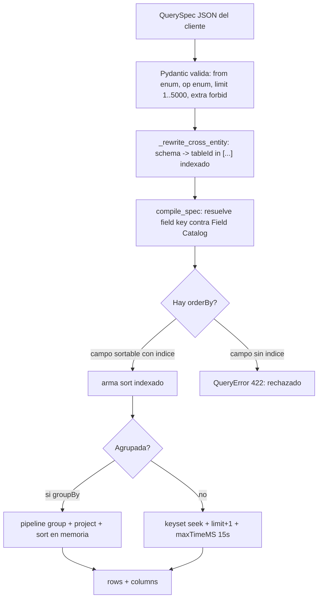
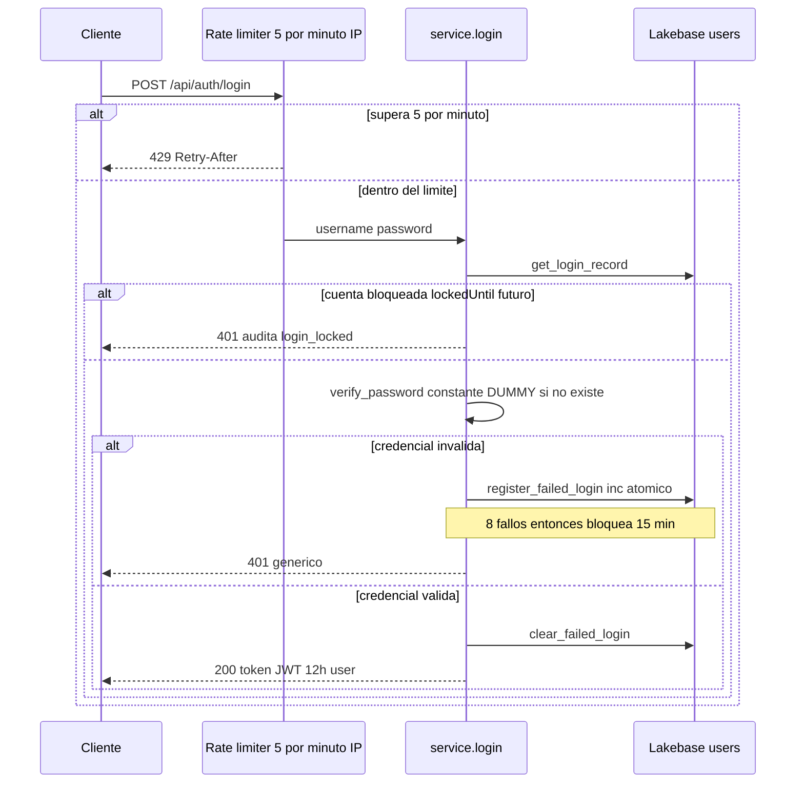
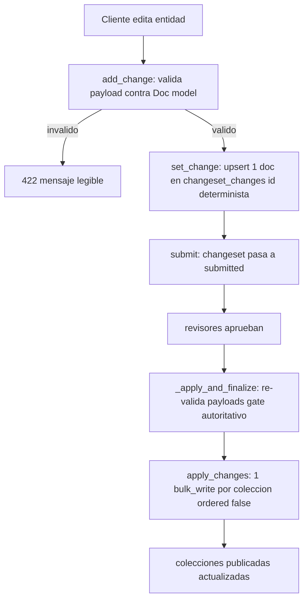
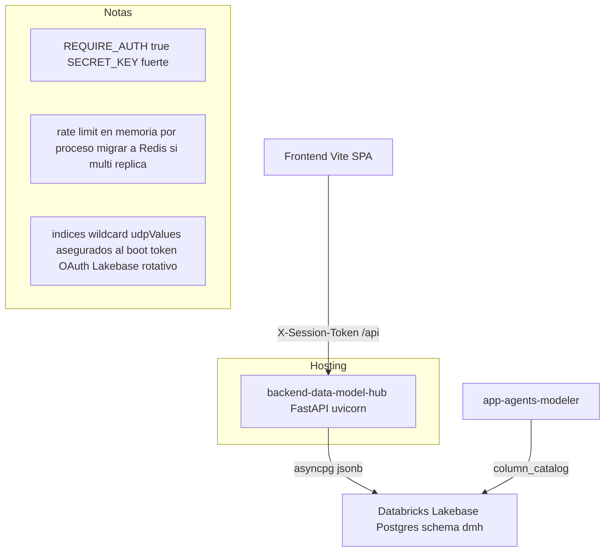

# Consideraciones y límites del backend — Data Model Hub

Actualizado: 2026-08-01.

Este documento describe las **consideraciones de diseño, los límites duros y las decisiones de escala** del backend de plataforma (`backend-data-model-hub`: FastAPI cuyo adaptador `app/core/db/lakebase/` corre sobre **Databricks Lakebase Postgres**, la única base de datos). El adaptador emula la superficie de tipos y operaciones de pymongo (`ReturnDocument`, `UpdateOne`, `DuplicateKeyError`) traduciéndola a SQL/JSONB — no conecta a Mongo. No es un backend conmutable: no hay driver Mongo ni switch de backend, y el acceso a datos está confinado tras el adaptador. Está escrito para desarrolladores y stakeholders técnicos que necesitan entender hasta dónde aguanta la plataforma, por qué se tomaron ciertas decisiones y qué queda pendiente de endurecer.

Se basa en el código real (`app/features/reporting/query/`, `app/core/`, `app/core/db/lakebase/`, `app/features/auth/`, `app/features/changesets/`) y en los documentos de plan de implementación `04-STRESS-TEST`, `07-REPORTING-ENGINE`, `08-SECURITY-HARDENING` y, para el backend de datos vigente, los docs `28` (Lakebase) y `32b`–`36`.

---

## 1. Resumen ejecutivo de límites

| Dimensión | Límite / valor | Dónde vive en el código |
|---|---|---|
| Escala validada (sintética) | 10.000 tablas · 400.000 columnas · 9.178 vistas · 150 canvases · 7.336 relaciones | prueba de estrés 2026-07-05 (script retirado), doc `04` |
| Escala real en producción | 2.108 tablas · 96.184 columnas · 1.932 vistas · 275 canvases | foto de BD 2026-07-26, sección 2.4 |
| Circuit-breaker de consulta | `maxTimeMS = 15000` (15 s) | `reporting/query/executor.py` |
| Tope de página de una consulta | `QuerySpec.limit`: default 100, mínimo 1, **máximo 5000** | `reporting/query/spec.py` |
| Página interna del export | 2000 filas por lote (keyset, streaming) | `reporting/query/router.py` |
| Vida del token de sesión | JWT HS256, TTL **720 min (12 h)**, sin revocación | `core/config.py`, `core/security.py` |
| Rate limit del login | **5 requests/minuto por IP** → 429 | `features/auth/router.py` |
| Lockout de cuenta | **8 fallos consecutivos → bloqueo 15 min** | `features/auth/service.py` |
| Política de contraseña | min 10 / max 128 (al crear/cambiar, no en login) | `features/admin/schemas.py`, doc `08` |
| Clip de contraseña bcrypt | 72 bytes (determinista, documentado) | `core/security.py` |
| Un doc por cambio en `changeset_changes` | regla del versionado por changesets (un doc por cambio), invariante de escala | `features/changesets/repository.py` |
| Estado del rate limit | **En memoria por proceso** (no compartido entre réplicas) | `core/ratelimit.py` |

---

## 2. Escala probada: sintética (10k tablas / 400k columnas) y real (DDV)

La prueba de estrés (2026-07-05, doc `04-STRESS-TEST`; su script se retiró del repo) cargó data sintética al volumen objetivo (aproximadamente 15k tablas de techo) y midió los endpoints calientes con autenticación por token y RBAC activos.

### 2.1 Data cargada

| Colección | Documentos |
|---|---|
| `canonical_tables` | 10.000 |
| `canonical_columns` | 400.000 (~40 columnas por tabla) |
| `views` | 9.178 (80% de las tablas con al menos una vista) |
| `subject_areas` (canvases) | 150 (30 de ellos con 100 tablas) |
| `relationships` | 7.336 |

**Carga real:** 146 s · **0 throttles** · aproximadamente 2.600 columnas/s. El generador inserta por lotes en streaming (poca memoria) con **tolerancia a throttling** (reintenta el lote con backoff exponencial ante `429` / `code 16500`) y recrea los índices al final.

### 2.2 Latencias observadas

| Endpoint / camino | Latencia | Veredicto |
|---|---|---|
| Búsqueda de catálogo (`q` + `limit=50`) | ~190 ms | El search server-side aguanta |
| Listar todas las tablas (10k) | ~0,6–1,4 s | Aceptable |
| Canvas de 100 tablas · tablas | ~150–240 ms | Bien |
| Canvas de 100 tablas · columnas (4.000) | ~0,9–1,3 s | El lienzo más pesado, usable |
| Reporting · carga inicial (`limit=50`) | ~1,0 s | Bien, tras el fix |
| Reporting · "ver todo" (10k filas) | ~4 s | Acción explícita, poco frecuente |

### 2.3 El cuello crítico que se encontró y arregló

`GET /api/reporting/tables` tardaba **24.055 ms** a 400k columnas (inutilizable; en producción haría timeout u OOM). La causa de raíz: `report_inputs()` **materializaba las 400.000 columnas enteras** solo para contar columnas por tabla, y además cargaba los 150 canvases con sus campos pesados (`layout` / `drawings`) y las 7.336 relaciones completas.

El fix aplicó tres capas:

1. **Conteo server-side** con agregación `$group` por `tableId` sobre el índice: 400k documentos se reducen a 10k pares (24 s → ~2 s).
2. **Proyección** de `subject_areas` a `{name, projectId, tableIds}` (sin `layout`/`drawings`) y de `relationships` a `{source, target}`.
3. **Fast-path de la carga inicial**: con `limit` y sin filtros trae solo las primeras N tablas (orden físico por índice `physicalName`) más conteos, relaciones y canvases acotados a esas tablas.

Resultado: la pantalla inicial (`limit=50`) pasó de **24 s a ~1 s (24x)**.

> Lección transversal: **nunca materializar la colección completa por request**. Contar y agregar server-side, proyectar lo mínimo, y acotar por slice.

### 2.4 Escala real en producción (foto 2026-07-26)

Además de la prueba sintética, la plataforma sostiene el modelo DDV real migrado desde Erwin (un solo proyecto-familia "Modelo de Datos DDV_FISICO"): **2.108 tablas · 96.184 columnas · 1.932 vistas · 275 canvases**. La carga del XML más grande (1,8 GB) tomó **116 s con 97.577 escrituras**, gracias al fast-path de `bulk_write` del adaptador Lakebase: lotes de 1.000 operaciones, cada lote resuelto en **2 round-trips** (un `UPDATE` con `unnest` + un `INSERT … ON CONFLICT DO NOTHING`, en una transacción).

El canvas más denso de esa carga (392 nodos, aproximadamente 99 mil filas de columnas/sources) no era un problema del backend: el diagrama llega en una sola respuesta y el cuello estaba en el DOM del navegador. Se resolvió en el **frontend** con LOD/zoom semántico (2026-07-25; el detalle vive en el documento de consideraciones del frontend). La palanca backend complementaria — dieta del payload del diagrama — queda pendiente y solo se activará si la apertura del canvas sigue lenta tras el LOD.

---

## 3. Reglas de escala del motor de reporting

El motor de reporting gira alrededor de un único contrato serializable, el **`QuerySpec`** (IR en JSON), producido por el query-builder visual o por el parser SQL, y consumido por el compilador → pipeline de Mongo, la grilla y el export. Un motor, un validador, un pushdown.

```jsonc
{
  "from": "columns",
  "select": ["physicalName", "dataType", "parentDomain", "udp.<defId>"],
  "where": { "op": "and", "conditions": [
      { "field": "schema", "op": "eq", "value": "core" },
      { "field": "udp.<defId>", "op": "in", "value": ["DAC", "Sensible"] },
      { "field": "parentDomain", "op": "isnull" }
  ]},
  "orderBy": [{ "field": "physicalName", "dir": "asc" }],
  "limit": 100, "cursor": "…"
}
```

El `op` es un **enum cerrado** (`eq, ne, in, nin, contains, startsWith, gt, gte, lt, lte, between, exists, isnull`), forzado dos veces (Pydantic `Literal` + `OPS_BY_TYPE`). El `from` solo acepta `columns | tables | relationships | views`. El cliente **nunca** manda paths de Mongo: manda una `key` pública que se resuelve contra el Field Catalog server-side.

### 3.1 Paginación keyset/seek — nunca skip profundo

A escala, el `skip/limit` profundo es una regla a evitar: un `OFFSET` profundo barre y descarta las filas saltadas antes de devolver la página (con cientos de miles de columnas, inviable). El executor pagina por **keyset (seek)** sobre el primer campo de orden más el `_id` como desempate.

Del `executor.py`, la condición de continuación se inyecta directo al `$match`:

```python
# keyset sobre el primer campo de orden (+ _id de desempate)
sort = list(compiled.sort) or [("physicalName", 1)]
sort_path, sort_dir = sort[0]
full_sort = [(sort_path, sort_dir), ("_id", 1)]
if cursor:
    cv, cid = _decode_cursor(cursor)
    gt = "$gt" if sort_dir == 1 else "$lt"
    base_match = {"$and": [base_match, {"$or": [
        {sort_path: {gt: cv}},
        {sort_path: cv, "_id": {"$gt": cid}}]}]}
```

Se pide `limit + 1` documentos para saber si `hasMore`, y el `nextCursor` codifica `[valor_de_orden, _id]` en base64. La grilla del frontend hace scroll infinito por cursor con memoria constante aun scrolleando 400k filas.

### 3.2 Pushdown de filtros indexados

Todos los filtros bajan al `$match` que corre sobre índices. Los predicados de nivel tabla dentro de una consulta a `columns` (por ejemplo `schema`, que vive en la tabla y no en la columna) se **pre-resuelven** a un set de `tableId` con un barrido barato de las 10k tablas y se inyectan como `{tableId: {$in: [...]}}`, que sí es indexado:

```python
# _rewrite_cross_entity: schema (vive en la tabla) → tableId $in [...]
if fd and fd.entity == "table" and node.field == "schema":
    ids = [str(t["_id"]) async for t in
           db["canonical_tables"].find({**ACTIVE, "schema": {"$in": vals}}, {"_id": 1})]
    return Condition(field="tableId", op="in", value=ids or ["__none__"])
```

Solo se soporta `= / in` para el filtro cross-entity por `schema`; otros operadores se rechazan con 422.

### 3.3 El planner rechaza `.sort()` sin índice

A escala, un orden sobre un campo sin índice caería en full-scan; por eso es un invariante de escala. El compilador (puro y testeado) clasifica cada orden y **rechaza** el que no se apoya en un índice:

```python
# Planner de orden: un row-sort exige índice (sortable) o se rechaza.
for o in spec.orderBy:
    fd = _field(catalog, o.field)
    if not fd.sortable:
        raise QueryError(
            f"No se puede ordenar por {o.field!r} (sin índice) a esta escala. "
            f"Ordená por un campo indexado (p.ej. physicalName).", code=422)
```

En cambio, cuando la consulta es agrupada (`groupBy`), el resultado es chico y se ordena en memoria por cualquier key sin restricción.

### 3.4 Sanitización de operadores de texto

`contains` y `startsWith` construyen un regex con `re.escape` — nunca un regex arbitrario del cliente, cerrando ReDoS e inyección:

```python
if op == "contains":
    return {p: {"$regex": re.escape(str(value)), "$options": "i"}}
if op == "startsWith":
    return {p: {"$regex": "^" + re.escape(str(value)), "$options": "i"}}
```

El value siempre se castea al tipo del campo (`_coerce`); los valores de UDP se fuerzan a string porque en storage todo `udpValues` es `dict[str, str]`.

### 3.5 Circuit-breaker `maxTimeMS` y tope de página

Toda operación lleva `maxTimeMS = 15000` (15 s) como corta-fuego: si una consulta se pasa, se aborta en vez de colgar el proceso. El `QuerySpec.limit` está capeado por Pydantic entre 1 y **5000**, así que ningún cliente puede pedir una página arbitrariamente grande.

```python
MAX_TIME_MS = 15000   # executor.py
limit: int = Field(default=100, ge=1, le=5000)   # spec.py
```

### 3.6 Export por streaming (memoria O(1))

El export NUNCA hace `to_list(None)` ni construye el archivo en el browser (eso podía OOMear con 400k filas). Pagina internamente por keyset (2000 filas por lote) y hace `yield` línea por línea con `StreamingResponse`:

```python
@router.post("/export")
async def export_csv(spec: QuerySpec):
    page_spec = spec.model_copy(update={"limit": 2000})
    async def _gen():
        # ... escribe header, luego itera páginas keyset y hace yield por lote
        page = await ex.run_query(page_spec, cursor=None)
        while True:
            for row in page["rows"]:
                w.writerow(...)
            yield flush()
            if not page.get("hasMore") or not page.get("nextCursor"):
                break
            page = await ex.run_query(page_spec, cursor=page["nextCursor"])
    return StreamingResponse(_gen(), media_type="text/csv", headers=...)
```

Verificado en vivo: export CSV de 33k+ líneas sin OOM.

### 3.7 Diagrama del planner de consulta



---

## 4. Límites del backend de datos

El backend de datos es **Databricks Lakebase Postgres**, la única BD: cada colección vive como una tabla `(id text PRIMARY KEY, doc jsonb)` en el schema `dmh` y el adaptador de `app/core/db/lakebase/` traduce la superficie de colección tipo pymongo a SQL/JSONB. No es un backend conmutable (no hay driver Mongo ni switch de backend). Varias reglas de escala nacen de la naturaleza del sistema —ingesta por upserts masivos de los modelos XML de Erwin, versionado por changesets y volumen de cientos de miles de columnas— y se documentan en 4.2.

### 4.1 Lakebase Postgres (única BD)

El adaptador implementa un **alcance cerrado y fail-fast**: todo operador, stage o expresión fuera del alcance levanta `NotImplementedError` en vez de degradar en silencio (traducción incorrecta o scan accidental). El alcance se amplía solo cuando un caller real lo necesita.

- **Filtros soportados**: igualdad vía jsonpath lax (`doc @? …`, GIN-indexable), `$and/$or/$nor`, `$eq/$ne/$in/$nin`, `$gt/$gte/$lt/$lte` (strings comparados con `COLLATE "C"` para replicar el orden binario de Mongo), `$exists`, `$regex` (con `$options`).
- **Updates soportados**: `$set`, `$setOnInsert`, `$unset`, `$inc`, `$push`; cualquier otro operador → `NotImplementedError`.
- **Aggregation (alcance cerrado)**: stages `$match/$group/$project/$sort/$skip/$limit/$count/$unwind`; acumuladores `$sum/$avg/$min/$max/$addToSet`; expresiones `$cond/$ifNull/$eq/$gt/$in/$size/$not/$objectToArray`, más **`$add` y `$strLenCP`** (agregados 2026-07-25, cuando la primera corrida de `arrange_all.py` contra Lakebase los necesitó). La truthiness de Mongo está replicada. El **`$project` de exclusión NO está soportado** (solo proyección de inclusión).
- **Índices**: cada tabla lleva un GIN `jsonb_path_ops` sobre `doc` (las igualdades jsonpath hacen seek ahí). El **único índice unique es `standards_versions.seq`**; su violación se traduce a `DuplicateKeyError` de pymongo, así que la app no cambió su manejo de errores.
- **Credenciales**: el password de Postgres es un **token OAuth de ~60 minutos** acuñado vía SDK de Databricks; `fresh_token()` lo cachea 50 minutos (thread-safe) y el pool lo consume como callable async — cada conexión nueva recibe un token vigente.
- **Scale-to-zero**: el compute de Lakebase se suspende por inactividad; el pool **reintenta la conexión durante el wake** en vez de fallar el primer request tras la pausa.
- **`statement_cache_size=256`** en asyncpg (el SQL generado se repite mucho entre requests).
- **TLS**: `PGDIRECTTLS` elige entre TLS clásico y **TLS directo** (ALPN `postgresql`, requerido por front-ends "service direct"); vacío = auto.
- **Alcanzabilidad**: con **Service Direct private link** (workspace corporativo) el endpoint puede ser inalcanzable desde fuera del workspace — el front-end acepta el TCP pero resetea el handshake de Postgres (verificado 2026-07-28). Las cargas masivas del kit Erwin corren entonces DESDE el workspace con el notebook `scripts/databricks/carga_erwin_notebook.py` (cluster con access mode Dedicated), que invoca los mismos scripts.

### 4.2 Reglas de escala (ingesta XML masiva, changesets y volumen)

El backend está escrito defensivamente para la escala real de la plataforma: la ingesta carga modelos XML de Erwin por **upserts masivos** (cientos de miles de columnas en una corrida), el versionado trata cada cambio como su propio documento, y el reporting consulta ese volumen. Esta sección conserva el porqué de cada regla.

#### 4.2.1 Carga masiva por lotes

La ingesta de un modelo Erwin escribe por lotes en streaming. El `bulk_write` por `_id` del adaptador resuelve cada lote en 2 round-trips (un `UPDATE` masivo con `unnest` + un `INSERT … ON CONFLICT DO NOTHING`), lo que permite cargar cientos de miles de filas en minutos: la carga de estrés corrió a ~2.600 columnas/s (146 s para 400k columnas) sin degradación. El pool reintenta la conexión durante el wake del compute (scale-to-zero), de modo que una pausa no aborta la carga.

Consideración operativa transversal: los picos de `POST /query` sobre `canonical_columns` (400k docs) son las operaciones más caras del reporting; se acotan con proyección mínima, keyset y el `maxTimeMS` (15 s) como circuit-breaker.

#### 4.2.2 `.sort()` requiere índice

Ordenar por un campo **sin índice** cae en full-scan; a escala es inviable, así que es un invariante de escala reflejado en tres puntos:

- El planner del reporting rechaza el `orderBy` no indexado (sección 3.3).
- La búsqueda de catálogo ordena por `physicalName`, que tiene índice dedicado.
- El repositorio de changesets solo acepta `sort_field` si hay índice; sin él, ordena en Python tras el corte.

El índice de `physicalName` en `canonical_tables`/`canonical_columns` es **requerido** por la búsqueda server-side del catálogo (`?q=&limit=`), cuyo top-N se ordena por ese campo.

#### 4.2.3 Índice wildcard `udpValues.$**`

Los UDP (User Defined Properties) son columnas dinámicas que el usuario crea en runtime. No se puede crear un índice por cada key nueva sin DDL constante. La solución es un **índice wildcard** sobre el mapa embebido, en tablas y columnas:

```python
_try("canonical_columns", [("udpValues.$**", 1)]),
_try("canonical_tables",  [("udpValues.$**", 1)]),
```

Cubre todas las keys UDP presentes **y futuras**: `eq`, `$in` e `$exists` hacen seek. **Limitación load-bearing:** como `udpValues` es `dict[str, str]` (todos los valores son STRING, aun para UDP number/date), los operadores `=`, `IN` e `IS NULL` son de primera clase (index-backed); el **rango** (`>`, `<`, `BETWEEN`) sobre UDP no-string es best-effort (comparación léxica). El índice wildcard tampoco sirve para **ordenar** — el sort debe usar un campo indexado normal.

#### 4.2.4 Otros comportamientos tolerados

Al asegurar índices, el adaptador puede señalar con los códigos del vocabulario Mongo que emula: `48` (colección ya existente) y `11000` (duplicate-key de un único ya presente). `ensure_indexes` traga puntualmente esos dos (el índice igual queda bien creado):

```python
if code not in (48, 11000):
    raise
```

### 4.3 Índices declarados

Los índices se declaran una sola vez a través de la superficie de colección (`core/db/indexes.py`, `ensure_indexes()` idempotente al arrancar). Las igualdades jsonpath se apoyan en el GIN `jsonb_path_ops` de cada tabla (incluido el wildcard `udpValues.$**`) y el único constraint UNIQUE es `standards_versions.seq`; la tabla siguiente es la declaración lógica de índices por colección.

| Colección | Índices |
|---|---|
| `canonical_tables` | `flgactive`, `physicalName`, compuesto `(schema, physicalName)`, `udpValues.$**` |
| `canonical_columns` | `tableId`, `parentDomainId`, `physicalName`, `dataType`, `udpValues.$**` |
| `changesets` | `updatedAt` (desc), `status` |
| `changeset_changes` | compuesto `(csId, collection)` |
| `relationships` | `flgactive`, `parentTableId`, `childTableId`, `pairs.parentColumnId`, `pairs.childColumnId` |
| `views` | `flgactive`, `tableId`, `sourceTableIds` |
| `subject_areas` | `projectId`, `name`, `udpValues.$**` |
| `folders` | `projectId` |
| `schemas` | `flgactive`, `name` |
| `naming_config` | `scope` |
| `users` | `email` |
| `audit_log` | `at` (desc), `actor` |
| `standards_versions` | `seq` (**unique**) |
| `parent_domains`, `glossary_terms`, `udp_definitions`, `projects` | `flgactive` |

---

## 5. Límites de autenticación y sesión

La auth es propia (usuario/contraseña) en todos los entornos. La identidad sale de un token de sesión firmado (Bearer, sin cookies), no de headers.

### 5.1 JWT de 12 h sin revocación

El token es JWT **HS256** con `algorithms=[HS256]` fijo (sin alg-confusion) y TTL de **720 minutos (12 h)** por default:

```python
ACCESS_TOKEN_TTL_MIN: int = int(os.getenv("ACCESS_TOKEN_TTL_MIN", "720"))
```

**Límite conocido (pendiente HIGH):** no hay denylist ni `tokenVersion`. Deshabilitar un usuario en Admin **no corta su sesión** hasta que el token expira, en los endpoints que solo dependen de `current_principal`. Nota: `resolve_session_user` (usado por `/me` y el gating del frontend) sí devuelve `None` si el usuario está `disabled`, pero eso no invalida un token ya emitido a nivel transporte. Mitigaciones recomendadas: bajar el TTL a 15–30 min con refresh revocable, un `tokenVersion` por usuario, o re-validar `status != disabled` contra la DB en cada request.

### 5.2 Falla-cerrado del `SECRET_KEY`

En postura de producción (`REQUIRE_AUTH=true`), la app **no arranca** si el `SECRET_KEY` sigue siendo el default de desarrollo (con esa clave pública cualquiera forjaría un token admin):

```python
if using_default and settings.REQUIRE_AUTH:
    raise RuntimeError(
        "SECRET_KEY inseguro con REQUIRE_AUTH=true: definí SECRET_KEY "
        "antes de desplegar — con el default público se pueden forjar tokens admin.")
```

### 5.3 Rate limit del login: 5/minuto por IP

```python
@router.post("/login")
@limiter.limit("5/minute")  # anti fuerza bruta / credential stuffing (por IP)
async def login(request: Request, body: LoginBody): ...
```

El 6º intento en un minuto responde **429** con `Retry-After`. Sin límite global (el canvas y el reporting disparan muchos requests legítimos). Verificado en vivo: el 6º intento devuelve 429.

### 5.4 Lockout: 8 fallos → 15 min

Complementa el rate limit por IP contra ataques distribuidos o botnets. Tras 8 fallos consecutivos de una cuenta **existente y activa**, se bloquea 15 minutos con un `$inc` atómico de `failedAttempts`:

```python
_LOCK_THRESHOLD = 8
_LOCK_MINUTES = 15
```

Solo se cuentan fallos de cuentas existentes (no se crea documento para usuarios inexistentes → sin oráculo de enumeración por lockout). El login exitoso resetea el contador y quita el bloqueo.

### 5.5 Anti-enumeración por timing

`login()` verifica el hash **siempre**, aun si el usuario no existe, usando un `_DUMMY_HASH` bcrypt real. Con `bcrypt.checkpw` en tiempo constante y un 401 genérico, no se filtra por timing qué usuarios existen. Limitación menor documentada: bcrypt **clipa a 72 bytes** de forma determinista.

### 5.6 Flujo del login con las defensas



### 5.7 Reporting con lecturas abiertas

`POST /query`, `POST /query/sql`, `GET /facets`, `POST /export` y `GET /insights/*` **no dependen de `current_principal`**: son lecturas abiertas, gateadas globalmente por el login del entorno de producción. Solo el CRUD de `saved_reports` exige principal (y fija el `owner` server-side, sin mass assignment). Pendiente recomendado: gatear también las lecturas de reporting para reducir la superficie de DoS sobre las colecciones de 400k.

---

## 6. Changesets: un documento por cambio (límite de 2 MB resuelto)

Cada cambio de modelado vive en la colección `changeset_changes` como **un documento por cambio**, con `_id` determinista `{csId}::{collection}::{entityId}`. Un diseño alternativo embebía todos los cambios en un dict dentro del documento del changeset, que crecía sin techo con changesets grandes; separarlos en un documento por cambio mantiene los updates chicos y habilita los diffs por slice.

```python
def change_key(cs_id: str, collection: str, entity_id: str) -> str:
    # _id determinista → upsert por _id = last-write-wins por entidad, sin duplicados
    return f"{cs_id}::{collection}::{entity_id}"
```

El documento de `changesets` queda como cabecera (estado, decisiones, comentarios). Consecuencias de diseño:

- El guard de estado ya no puede vivir en el filtro de una sola escritura (estado y cambio están en documentos distintos), así que `set_change` usa un **protocolo de 3 pasos con compensación** (touch atómico del padre con `status: draft`, upsert del cambio con `wtoken` único, re-check y compensación si un submit ganó la carrera).
- Las listas de versiones/requests proyectan **solo cabeceras** (`{"changes": 0, "comments": 0}`); bajar el blob `changes` de un changeset grande por fila no escala.
- El publish aplica el plan con **un `bulk_write` por colección** (`ordered=False`) en vez de un `update_one` awaiteado por entidad, que antes tardaba minutos con miles de cambios y dejaba una ventana enorme de aplicación parcial.

### 6.1 Validación de payloads (round-trip garantizado)

Un upsert de changeset termina aplicándose tal cual (`$set` del payload) a la colección publicada. Sin un gate, un payload malformado (columna sin `tableId`, relación sin extremos) entraría a producción y rompería a todos los lectores. Se valida contra los mismos modelos `*Doc` del read path, en dos puntos: a la entrada (`add_change`, feedback inmediato) y a la salida (`_apply_and_finalize`, gate autoritativo justo antes de escribir).



### 6.2 Alcance versionado

Pasan por el changeset/aprobación del canvas **8 colecciones** (`VERSIONED`, en orden de dependencia del apply): `projects`, `folders`, `subject_areas`, `schemas`, `canonical_tables`, `canonical_columns`, `relationships`, `views`. La estructura del Model Explorer y la entidad `schemas` entraron a versionado el 2026-07-16 (antes se escribían directo a producción). Los estándares (Parent Domains, Glossary, UDP definitions, naming) se editan y versionan aparte, en el módulo Data Standards, con escritura global directa fuera del publish (`standards_versions`).

---

## 7. Consideraciones operativas

### 7.1 Rate limit en memoria por proceso → Redis para multi-réplica

El estado del rate limit (slowapi) es **en memoria por proceso**. Con una sola instancia es suficiente, pero en un despliegue multi-réplica cada réplica cuenta por separado y el límite efectivo se multiplica por el número de réplicas.

Desde 2026-07-31 la key del limiter es la **primera IP de `X-Forwarded-For`** (fallback a la IP del peer). El motivo: detrás de los proxies de Databricks Apps (proxy OAuth + server del front) la IP del peer que ve FastAPI es la del proxy, así que el límite de login de 5/minuto operaba como un límite **global** compartido por todos los usuarios en vez de por-IP. El estado sigue en memoria por proceso; Redis queda pendiente para multi-réplica.

```python
# core/ratelimit.py
# ESTADO EN MEMORIA (por proceso): suficiente para una sola instancia. En
# producción multi-réplica migrar a un backend Redis
# (Limiter(storage_uri="redis://...") / fastapi-limiter).
```

El rate limit está **gateado por postura**: activo en producción (`REQUIRE_AUTH`) o con `RATE_LIMIT_ENABLED=true`; apagado en dev/tests para no frenar el harness (muchos logins desde localhost) ni el uso local.

### 7.2 Postura de seguridad HTTP

Configurado en `main.py`:

- **Security headers** en toda respuesta: `X-Content-Type-Options: nosniff`, `X-Frame-Options: DENY`, `Referrer-Policy: no-referrer`, `Permissions-Policy` (geolocation/microphone/camera deshabilitados), y `Strict-Transport-Security` solo sobre HTTPS (detectado por `X-Forwarded-Proto` detrás de proxy).
- **CORS estricto**: `allow_credentials=True` (la cookie del proxy SSO de Databricks Apps viaja con la request), allowlist de orígenes por `CORS_ORIGINS` y/o `CORS_ORIGIN_REGEX`, métodos y headers explícitos (nunca wildcard; los headers permitidos incluyen `Authorization`, `Content-Type`, `X-Requested-With`, `X-Dev-User` y `X-Session-Token`). La identidad siempre sale del token, no de la cookie.
- **`/docs`, `/redoc`, `/openapi.json` ocultos** cuando `REQUIRE_AUTH` (reduce fingerprinting).
- **TrustedHost** si `ALLOWED_HOSTS` está definido.
- Excepciones no controladas → envelope de error genérico (sin stack trace al cliente), con `X-Request-ID` para correlacionar en logs.

### 7.3 Costos inherentes que quedan (mejoras futuras)

- **Reporting "ver todo" (~4 s):** costo inherente de agregar 400k columnas + leer 10k tablas. Si molesta, paginar server-side por `physicalName`.
- **Export sin filtro** (`/reporting/columns` sin `tableIds`): serializa las 400k columnas (~100 MB). Es una acción de export masivo deliberada; el front debería acotarla por selección. El export nuevo del motor de consulta ya va por streaming.
- **Canvas de 100 tablas (~1–1,5 s, 4.000 columnas):** aceptable; para canvases aún mayores, virtualizar el detalle de columnas.
- **UDP coverage** se computa on-demand (~1 s, barato por el `$match udpValues != {}`); materializar en `report_udp_coverage` solo si el volumen de UDP-values crece mucho.
- **Rango sobre UDP string:** best-effort con `$convert`, reportando el count de descartados; no se migra el storage en v1.
- **Contraseñas filtradas** (HIBP / zxcvbn) y migración bcrypt → argon2id: pendientes de menor prioridad.

---

## 8. Despliegue: dónde corre, variables de entorno y base de datos

Este documento no cubre CI/CD ni pipelines. Solo describe **dónde corre el backend**, su **configuración por entorno** y las **consideraciones de base de datos**.

### 8.1 Dónde corre

El backend es una app FastAPI (`entry: app.main:app`, servida con uvicorn) y puede desplegarse en:

- **Databricks Apps** (destino primario; local Python 3.12 / runtime de Apps 3.11). El `command` y las `env` de runtime viven en el **`app.yaml`** de la raíz del repo (que Databricks lee en cada arranque); el bundle `databricks.yml` aporta las `variables:` por entorno, el binding del secreto y los permisos. El bloque `config:` del bundle **no** se usa: el CLI lo ignora (bug `databricks/cli` #4901).
- **Azure App Service** como alternativa de hosting equivalente (mismo entrypoint uvicorn/ASGI).

En ambos casos la app es un **monolito modular** (`app/core/` para infra compartida + `app/features/<x>/` como vertical slices), stateless salvo por el rate limit en memoria (ver 7.1). La conexión a la base (Databricks Lakebase Postgres — doc 28) se abre/cierra en el lifespan de FastAPI y asegura los índices al arrancar.

Desde 2026-07-27 el despliegue productivo apunta al workspace **corporativo** de Databricks y está parametrizado por **GitHub Variables** (el workflow exporta cada variable como `BUNDLE_VAR_*` solo si trae valor): el mismo bundle sirve para cualquier workspace sin editar archivos. Tres decisiones definen el modelo: (1) `targets.prod.workspace.host` se **eliminó** del `databricks.yml` — el workspace sale de `DATABRICKS_HOST`, porque un `host:` hardcodeado gana sobre la variable y podía desplegar callado al workspace equivocado; (2) las apps están **pre-creadas a mano** (reserva de cupo) y el workflow las adopta con `databricks bundle deployment bind` antes del deploy, evitando el 409 `ALREADY_EXISTS`; (3) **un solo origen para el navegador** — el server del front sirve la SPA y proxya `/api/*` al backend con token OAuth M2M de su service principal, porque el muro SSO por-app de Databricks Apps impide el login cross-origin front→back (fix definitivo 2026-07-31). El paso a paso (variables, bind, grant del SP del front, checklist) está en [despliegue.md](despliegue.md).

### 8.2 Variables de entorno

(Homologadas 2026-07-19 — inventario completo en `despliegue.md` §3; todo se lee en `config.py`.)

| Variable | Propósito | Default / nota |
|---|---|---|
| `DATABRICKS_HOST` / `DATABRICKS_TOKEN` | Workspace + PAT para acuñar tokens de BD (solo dev; en Apps el SP autentica solo) | vacías |
| `LAKEBASE_ENDPOINT` | Ruta lógica del endpoint Lakebase. **Requerida con lakebase** | vacía |
| `PGHOST` / `PGUSER` | Host físico (opcional: se auto-resuelve) / rol PG (en Apps cae al client ID del SP) | vacías |
| `PGPORT` / `PGDATABASE` / `PGSSLMODE` / `LAKEBASE_PGSCHEMA` | Constantes de producto | `5432` / `databricks_postgres` / `require` / `dmh` |
| `SECRET_KEY` | Clave HMAC para firmar el JWT de sesión. **Obligatoria en producción** | default inseguro solo dev; falla-cerrado con `REQUIRE_AUTH` |
| `REQUIRE_AUTH` | Postura de producción: request sin token válido → 401; oculta `/docs`; activa rate limit | `false` |
| `ACCESS_TOKEN_TTL_MIN` | Vida del token de sesión en minutos | `720` (12 h) |
| `RATE_LIMIT_ENABLED` | Fuerza el rate limit aun sin `REQUIRE_AUTH` | `false` |
| `ALLOWED_HOSTS` | Allowlist de Host (activa TrustedHost) | vacío (sin restricción) |
| `CORS_ORIGINS` | Orígenes exactos del frontend (coma-separados) | localhost:3000 (solo si no hay regex) |
| `CORS_ORIGIN_REGEX` | Regex de orígenes (el mismo bundle sirve en cualquier workspace) | vacía |
| `AUTH_MODE` | Seam de identidad (`local` / `databricks`), por compat | `local` |
| `LOG_FORMAT` / `LOG_LEVEL` | Formato (`pretty` dev / `json` prod) y nivel de log | — |

Checklist mínimo de producción: rol PG del SP con GRANTs (Lakebase, doc 28 §11.3) + `SECRET_KEY` fuerte + `REQUIRE_AUTH=true` + `CORS_ORIGIN_REGEX` (o `CORS_ORIGINS` exacta) + `ALLOWED_HOSTS`. Con `REQUIRE_AUTH=true` y `SECRET_KEY` default, la app **no arranca** (por diseño).

### 8.3 Consideraciones de base de datos

**BD: Databricks Lakebase Postgres** (única) — las colecciones propias viven como tablas `(id, doc jsonb)` en el schema `dmh`, con el adaptador de `app/core/db/lakebase/`; password = token OAuth acuñado por el SP/PAT y compute con scale-to-zero (el pool tolera el wake). Consideraciones:

- La BD se comparte con el servicio de agentes (`app-agents-modeler`) sobre **colecciones disjuntas**: este backend administra `projects`, `folders`, `subject_areas`, `schemas`, `canonical_tables`, `canonical_columns`, `relationships`, `views`, `changesets`, `changeset_changes`, `parent_domains`, `glossary_terms`, `udp_definitions`, `naming_config`, `standards_versions`, `users`, `roles`, `audit_log`, `saved_reports`, más las on-demand `ddl_rules` y `ddl_ruleset_config` (**21 colecciones propias** = 19 pre-creadas + 2 on-demand — referencia campo por campo en `esquema-datos.md`); el agente administra `column_catalog`, que este backend **nunca toca**.
- Los `POST /query` sobre `canonical_columns` (400k documentos) son las operaciones más caras del reporting; se acotan con proyección mínima, paginación keyset y el `maxTimeMS` (15 s) como circuit-breaker.
- Los **índices se aseguran al arrancar** (`ensure_indexes`, idempotente). El índice wildcard `udpValues.$**` es crítico para filtrar por UDP creados en runtime y debe existir después del bulk load inicial (por ejemplo el import one-shot de Erwin).
- La app tolera `NamespaceExists` (48) y duplicate-key (11000) al crear índices; cualquier otro error de índice sí propaga.

### 8.4 Topología de referencia



---

## 9. Cuadro final de límites y mitigaciones pendientes

| Área | Límite actual | Estado | Mitigación futura |
|---|---|---|---|
| Reporting a escala | 400k columnas, keyset + planner + maxTimeMS 15s + limit 5000 | Resuelto | Paginar "ver todo" server-side si molesta |
| Export masivo | Streaming O(1), 2000 filas/lote | Resuelto | Job async + poll para rangos enormes |
| JWT | TTL 12 h, sin revocación | Pendiente HIGH | Bajar TTL + refresh revocable o `tokenVersion` |
| Rate limit | Key = primera IP de `X-Forwarded-For` (2026-07-31); estado en memoria por proceso | Aceptable 1 instancia | Backend Redis para multi-réplica |
| Lecturas de reporting | Abiertas (sin principal) | Pendiente | Gatear con `current_principal` |
| Rango sobre UDP | Léxico (values son string) | Documentado | `$convert` tipado + reportar descartados |
| Changesets 2 MB/doc | Un doc por cambio | Resuelto | — |
| Adaptador Lakebase | Alcance cerrado de operadores/stages (fail-fast `NotImplementedError`); `$project` de exclusión no soportado | Por diseño | Ampliar bajo demanda, como `$add`/`$strLenCP` (2026-07-25) |
| Canvas denso (392 nodos) | ~99k filas por diagrama; el cuello era el DOM del navegador, no el backend | Mitigado en el front (LOD 2026-07-25) | Dieta del payload del diagrama, solo si la apertura sigue lenta |
| Contraseñas | min 10 / max 128 | Aceptable | HIBP/zxcvbn, argon2id |

La postura general es sólida: el motor de reporting es defensivo por diseño (allowlist de campos, enum cerrado de operadores, `re.escape`, planner que rechaza scans y sorts sin índice, cursor validado a escalares), la escala está probada a 10k tablas / 400k columnas sintéticas y sostiene en producción el modelo DDV real (2.108 tablas / 96.184 columnas sobre Lakebase), y el login es criptográficamente correcto con rate limit + lockout. Los pendientes de mayor impacto son la **revocación de JWT** y el **rate limit con Redis** para operación multi-réplica.
