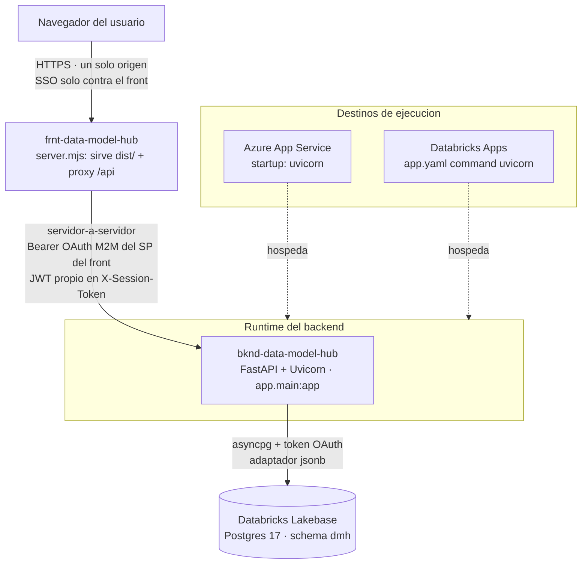
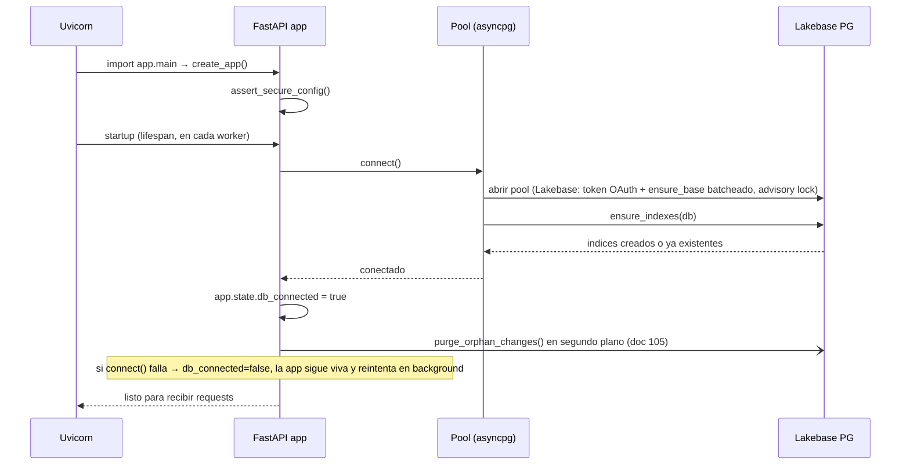
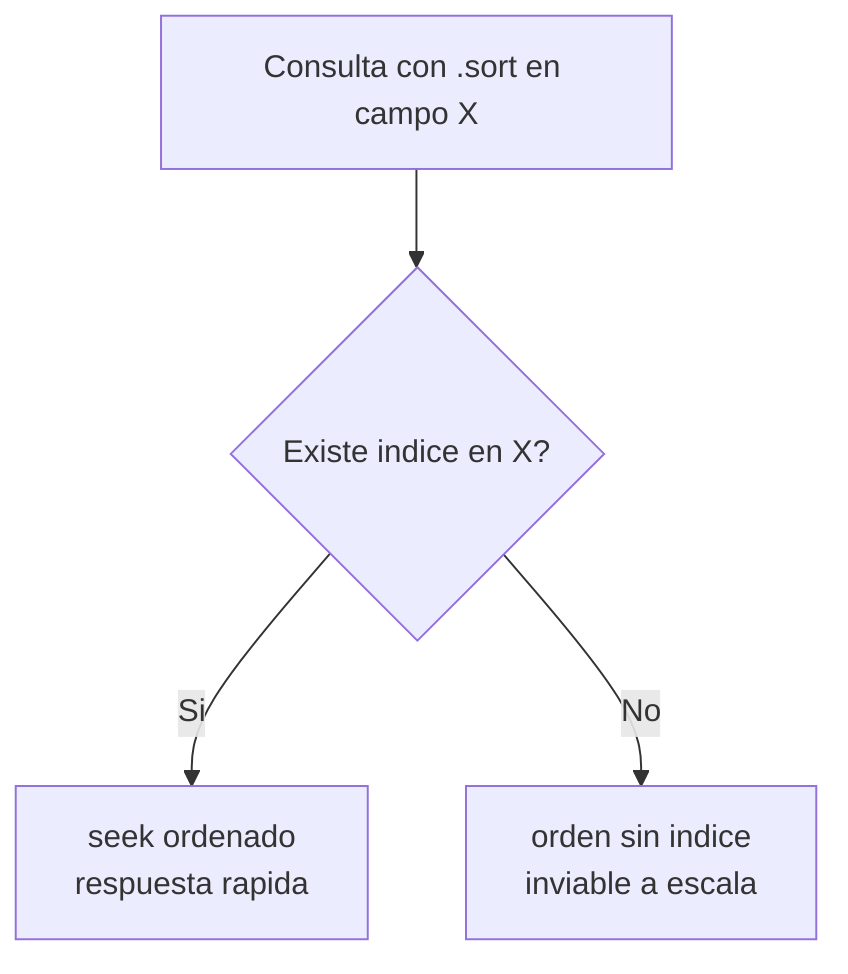
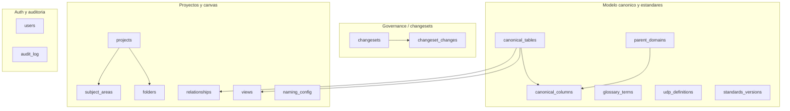

# Despliegue y Base de Datos — `backend-data-model-hub`

> **Actualización 2026-07-31.** El despliegue quedó homologado al workspace **CORPORATIVO** de Databricks (docs 35 y 36 de `plan-implementacion/`), **parametrizado 100% por GitHub Variables**: el mismo repo despliega en cualquier workspace sin editar un solo archivo. Novedades de esta actualización: topología de dos apps con proxy del front (§2), deploy por GitHub Variables (§2.3), bind de apps pre-creadas por cupo (§2.4), grant automatizado del SP del front (§2.5), one-time del workspace destino (§2.6), identidad local y private link (§4.1–§4.2), secuencia de carga de data con `mark_base_version` (§4.3) y checklist de cierre (§10). Historial: homologación previa 2026-07-19 (doc 28: infraestructura Lakebase).

Este documento describe **dónde corre** el backend de plataforma del Data Model Hub, **cómo se despliega** (Databricks Apps vía bundle + GitHub Actions parametrizado por GitHub Variables), **qué variables de entorno** necesita, **cómo se conecta a la base de datos** (Databricks Lakebase Postgres — doc 28) y **cómo levantarlo en local**.

Toda la información sale del código real: `app/core/config.py` (ÚNICA superficie de settings), `app/core/db/client.py`, `app/core/db/lakebase/`, `app/core/db/indexes.py`, `app/main.py`, `app/core/ratelimit.py`, `app/core/logging.py`, más el manifiesto `databricks.yml` (bundle: `variables:` + recurso secreto + permisos), el `app.yaml` (command + env de runtime) y el workflow `.github/workflows/deploy-databricks.yml`.

---

## 1. Qué es este servicio

El backend es un **servicio HTTP FastAPI** servido por **Uvicorn** (ASGI). En Databricks Apps corre con `--workers 2` (dos procesos iguales; en local, uno), sin estado en disco: toda la persistencia vive en la base (Databricks Lakebase Postgres). El punto de entrada es el objeto `app` de `app/main.py`:

```python
# app/main.py
app = create_app()   # factory: assert_secure_config + CORS + middleware + routers

if __name__ == "__main__":
    import uvicorn
    uvicorn.run("app.main:app", host="0.0.0.0", port=8000, reload=True)
```

`create_app()` arma la app y, en el **lifespan** de FastAPI, abre la conexión a Lakebase y asegura los índices al arrancar; los cierra al apagar. El objeto ASGI que se expone a cualquier servidor es siempre `app.main:app`.

Características del proceso que importan para el despliegue:

- **Sin estado local.** No escribe archivos; todo va a la base. Se puede reiniciar sin pérdida.
- **Rate limiting en memoria (por proceso).** El estado del limitador de `slowapi` no se comparte entre procesos ni entre réplicas (ver sección 6.2).
- **Un pool de conexiones por proceso**, compartido por todos los repositorios de ese proceso (singleton en `app/core/db/client.py`: asyncpg hacia Lakebase, `max_size=15`): con `--workers 2`, dos pools — hasta 30 conexiones reales.
- **Logs a `stdout`** (formato `pretty` o `json`), pensados para que el runtime los capture.

---

## 2. Topología: dónde corre

En producción (workspace corporativo de Databricks) la plataforma son **dos Databricks Apps**: **`bknd-data-model-hub`** (este backend) y **`frnt-data-model-hub`** (la SPA servida por un server Node propio, `server.mjs`, en el repo del front). Desde el cierre del doc 36 (2026-07-31), **el navegador solo habla con el front**: `server.mjs` sirve `dist/` y **proxya `/api/*` al backend servidor-a-servidor** con un token OAuth **M2M** del service principal del front — un solo origen, sin CORS ni doble muro SSO en el navegador (cada Databricks App tiene su propio muro SSO por subdominio, y un `fetch()` cross-origin no puede ejecutar ese baile). El backend, por lo tanto, **no recibe tráfico directo de navegadores**: recibe requests servidor-a-servidor del server del front, autenticadas con Bearer del SP; el JWT propio de la plataforma viaja aparte en el header `X-Session-Token`.

El mismo artefacto (`app.main:app` servido por Uvicorn) puede correr en dos destinos. La diferencia está en **cómo se inyectan las variables de entorno y los secretos**, y en **quién asigna el puerto**.



### 2.1 Azure App Service

Corre como una Web App de Python (Linux). El backend es un ASGI estándar, así que basta con un **startup command** que arranque Uvicorn apuntando a `app.main:app`.

Startup command típico (una sola réplica o detrás del balanceador del plan):

```bash
uvicorn app.main:app --host 0.0.0.0 --port 8000
```

Consideraciones específicas de App Service:

- **Puerto:** App Service enruta al puerto que expone el contenedor. Usa `--port 8000` (o el que se defina) y alinea `WEBSITES_PORT=8000` en las Application Settings si el proxy no lo detecta solo.
- **Variables de entorno = Application Settings.** Se cargan como variables de proceso; `config.py` las lee con `os.getenv`. No hace falta `.env` en el servidor.
- **Health probe:** apunta el health check a `GET /api/health` (devuelve `status: ok | degraded` y `db_connected`). Desde el doc 82 responde además `build: {sha, time}` con el commit desplegado (lo estampa el workflow en `app.yaml` como `BUILD_SHA`/`BUILD_TIME`; `null` en dev): compáralo con el commit del fix antes de reportar un error «que ya está arreglado».
- **HTTPS y HSTS:** App Service termina TLS en el borde y reenvía HTTP interno con `X-Forwarded-Proto: https`. El middleware de `app/main.py` detecta ese header y agrega `Strict-Transport-Security`; no hay que tocar nada.

### 2.2 Databricks Apps (destino actual)

Es el destino que ya está configurado en el repo. El deploy vive en
`databricks.yml` (bundle: `variables:` + recursos secretos + permisos) y en el
`app.yaml` de la raíz del repo (comando + env de runtime, que Databricks lee en
cada arranque). El workflow instala el CLI con versión FIJA (`databricks/setup-cli@v1.18.0`)
y aplica el bundle con el motor **`direct`** (API de Databricks, sin Terraform;
`bundle.engine: direct`); antes del deploy imprime un `bundle plan` con lo que va a
cambiar (doc 97). El manifiesto despliega en **cualquier workspace sin editar el repo**: ninguna
variable del bundle ni env de `app.yaml` lleva un valor de workspace — todos salen
de GitHub Variables del environment (§2.3) — y el workspace destino sale de
`DATABRICKS_HOST`.

```yaml
# databricks.yml (extracto real) — solo lo que el bundle SÍ aplica.
bundle:
  name: bknd-data-model-hub

variables:                        # SIN `default:` — cada una sale de la GitHub Variable homónima (BUNDLE_VAR_*)
  secret_scope:       {}          # SECRET_SCOPE — ej. kv-scope-datacraft
  session_secret_key: {}          # SESSION_SECRET_KEY — ej. session-secret-key
  proxy_secret_key:   {}          # PROXY_SECRET_KEY — ej. dmh-proxy-secret (la misma key que usa el front)
  app_admin_user:     {}          # APP_ADMIN_USER — ver §2.4

resources:
  apps:
    backend:                      # resource key (lo usa `databricks bundle run backend`)
      name: bknd-data-model-hub   # nombre real de la app en el workspace
      source_code_path: .
      # command + env de runtime → app.yaml (abajo), NO acá. El bloque `config:`
      # del bundle se retiró: el CLI lo ignora (bug databricks/cli #4901) y la
      # app moría al apagar/prender ("Failed to load app spec").
      resources:
        - name: session_secret
          secret: { scope: ${var.secret_scope}, key: ${var.session_secret_key}, permission: READ }
        - name: proxy_secret      # relay de identidad SSO (doc 38)
          secret: { scope: ${var.secret_scope}, key: ${var.proxy_secret_key}, permission: READ }
      permissions:
        - { level: CAN_MANAGE, user_name: ${var.app_admin_user} }   # el humano dueño
        - { level: CAN_USE,    group_name: users }                  # todo el workspace puede abrir la app

targets:
  prod:
    mode: production
    default: true
    workspace:
      # SIN `host:` a propósito (2026-07-27) — ver el punto clave de abajo.
      root_path: /Workspace/Users/${workspace.current_user.userName}/.bundle/${bundle.name}/${bundle.target}
```

El `command` y el `env` de runtime viven en el `app.yaml` de la raíz del repo,
que Databricks lee en **cada** arranque (deploy y apagar/prender). Los `value` van
**vacíos** en el repo: el workflow los llena con la GitHub Variable homónima del
environment antes de subir el código (si falta alguna, el deploy se corta) y
estampa además `BUILD_SHA`/`BUILD_TIME`; los secretos llegan por `valueFrom` desde
los recursos `session_secret` y `proxy_secret` del `databricks.yml`:

```yaml
# app.yaml (raíz del repo)
command: ["uvicorn", "app.main:app", "--workers", "2"]
env:
  - { name: LOG_FORMAT,          value: "" }   # GitHub Variable LOG_FORMAT — ej. json
  - { name: LAKEBASE_ENDPOINT,   value: "" }   # ej. projects/dmh-proj/branches/production/endpoints/primary
  - { name: LAKEBASE_PGSCHEMA,   value: "" }   # ej. dmh
  - { name: CORS_ORIGIN_REGEX,   value: "" }   # ej. https://frnt-data-model-hub-.*\.databricksapps\.com
  - { name: REQUIRE_AUTH,        value: "" }   # true
  - { name: SECRET_KEY,          valueFrom: session_secret }
  - { name: PROXY_SHARED_SECRET, valueFrom: proxy_secret }
```

Puntos clave:

- **Host y puerto los pone Databricks.** El runtime inyecta `UVICORN_HOST=0.0.0.0` y `UVICORN_PORT=$DATABRICKS_APP_PORT`, por eso `command` no pasa `--host`/`--port`.
- **Dos procesos (`--workers 2`).** La instancia Medium da hasta 2 vCPU; cada worker abre su propio pool de Lakebase (2 × 15 conexiones) y el DDL de arranque se serializa entre ambos con un advisory lock (`client.py`). Una request puede caer en cualquiera de los dos: lo que debe verse desde ambos vive en la BD — p. ej. los jobs de la carga Excel y su lock por versión (doc 105, X1: antes vivían en la memoria de un proceso y el polling que caía en el otro respondía 404; el lock lleva latido y, si un apply encuentra que ya no es suyo —venció y otra carga lo tomó—, se corta), las lápidas de las eliminaciones de drafts (`deleted_changesets`, una por intento) y el lockout por cuenta del login —, mientras que el rate limiting en memoria cuenta por proceso (sección 6.2).
- **SIN `workspace.host` en el bundle — a propósito.** El workspace destino sale de la variable de entorno `DATABRICKS_HOST` (la GitHub Variable que ya usa el CLI). Un `host:` escrito en el bundle **GANA sobre esa variable** (verificado): hardcodearlo obligaba a editar el repo por cada ambiente y, peor, podía desplegar **callado al workspace equivocado** si alguien olvidaba cambiarlo.
- **La BD no necesita secretos.** El backend acuña tokens OAuth de Lakebase con el **service principal de la app** (OAuth M2M inyectado); `PGUSER` cae al `DATABRICKS_CLIENT_ID` y `PGHOST` se resuelve solo desde `LAKEBASE_ENDPOINT`. ONE-TIME por workspace: rol PG del SP (§2.6).
- **Dos secretos, por `valueFrom`.** `SECRET_KEY` y `PROXY_SHARED_SECRET` no van en texto plano: se resuelven desde los recursos `session_secret` y `proxy_secret` (scope y keys de las GitHub Variables `SECRET_SCOPE`, `SESSION_SECRET_KEY` y `PROXY_SECRET_KEY` — en el corporativo, `kv-scope-datacraft`, respaldado por Azure Key Vault) con permiso `READ` para el service principal.
- **`permissions:` es declarativo y AUTORITATIVO.** Se re-aplica en cada deploy; los grants hechos a mano en la UI se pierden (§2.4 y §2.5).
- **Rate limiting por proceso:** ya con los dos workers el limitador en memoria no es global (cada proceso cuenta aparte), y con más instancias se multiplica además por su número (sección 6.2).

### 2.3 Deploy parametrizado por GitHub Variables (cero edición por ambiente)

El workflow `.github/workflows/deploy-databricks.yml` corre en push a `deploy-dev`, `develop` o `main` (y a mano con `workflow_dispatch`, sólo desde esas ramas) y mapea la rama a un **GitHub Environment**: `deploy-dev → dev`, `develop → qa`, `main → prod`. Toda la mecánica vive en el workflow reutilizable `reusable-databricks-deploy.yml` (agnóstico a la app; el front tiene una copia idéntica), que lee Variables y Secrets del environment con fallback a los del repositorio. Migrar la plataforma a otro workspace = cambiar GitHub Variables, no archivos (runbook completo: doc 35 de `plan-implementacion/`).

**Contrato sin valores por defecto.** Si falta cualquier Variable o Secret, el run se corta ANTES de tocar la app y lista los nombres faltantes:

| Tipo | Nombre en GitHub | Para qué |
|---|---|---|
| Secret | `DATABRICKS_TOKEN` | token del workspace destino (lo usa sólo el CLI) |
| Variable | `DATABRICKS_HOST` | URL del workspace destino |
| Variable | `BUNDLE_TARGET` | target del bundle (p. ej. `prod`) |
| Variable | una por cada variable de `databricks.yml`, en MAYÚSCULAS | backend: `SECRET_SCOPE`, `SESSION_SECRET_KEY`, `PROXY_SECRET_KEY`, `APP_ADMIN_USER` — se exportan como `BUNDLE_VAR_<variable>` |
| Variable | una por cada `env` de `app.yaml` con clave `value` | backend: `LOG_FORMAT`, `LAKEBASE_ENDPOINT`, `LAKEBASE_PGSCHEMA`, `CORS_ORIGIN_REGEX`, `REQUIRE_AUTH` — el valor se escribe en `app.yaml` antes de subir el código |

Los `valueFrom` de `app.yaml` no se tocan: la app los resuelve al arrancar contra los recursos `secret` del bundle. El front usa el mismo contrato (sus variables: `SECRET_SCOPE`, `PROXY_SECRET_KEY`, `APP_ADMIN_USER` y el env `BACKEND_API_URL`).

Pasos del workflow, en orden: verificar configuración y credenciales (`databricks current-user me`) → resolver las variables del bundle → inyectar el env de `app.yaml` → estampar `BUILD_SHA`/`BUILD_TIME` (doc 82) → `bundle validate` → identificar la app del bundle → adoptar la app si ya existe (§2.4) → `bundle plan` (doc 97) → `bundle deploy` → grants `CAN_USE` entre apps (§2.5) → `bundle run` (inicia la app) → esperar `RUNNING`. Un deploy a la vez por repositorio y environment (`concurrency`).

Dos notas operativas:

- **Orden de deploy en un workspace nuevo:** primero el backend → copiar la URL de la app → cargarla en la GitHub Variable `BACKEND_API_URL` del environment del front → desplegar el front.
- **Nada de Lakebase viaja como secreto a GitHub:** el password de Postgres es un token OAuth de ~1 hora que la app acuña sola con su service principal.

### 2.4 Apps pre-creadas (cupo) y `bundle deployment bind`

En workspaces corporativos hay **cupo de Databricks Apps** (el límite se llena y ya no deja crear más), así que las apps `bknd-data-model-hub` y `frnt-data-model-hub` se crean **a mano en la UI** para reservar el slot antes del primer deploy. El estado del bundle no las conoce → `bundle deploy` planifica un create → la API responde **`409 ALREADY_EXISTS`**.

La solución vive en el workflow reutilizable como paso **«Adoptar app pre-existente (evita 409 ALREADY_EXISTS)»**, entre `bundle validate` y `bundle plan`: si `databricks apps get <app>` la encuentra, la importa al estado del bundle.

```bash
databricks bundle deployment bind "$APP_RESOURCE_KEY" "$APP_NAME" --target "$BUNDLE_TARGET" --auto-approve
# backend:  resource-key = backend   · app-name = bknd-data-model-hub
# frontend: resource-key = frontend  · app-name = frnt-data-model-hub
```

`bind` importa la app al estado del bundle y desde ahí el deploy la ACTUALIZA en su sitio. El paso es **idempotente**: si la app no existe, no hace nada (el deploy la creará); si el bind no aplica (p. ej. ya estaba en el estado), avisa y el deploy continúa. Condiciones:

- El nombre creado a mano debe ser **IDÉNTICO** al del bundle (si difiere, el bundle no la reconoce y trataría de crear otra app).
- La identidad del `DATABRICKS_TOKEN` necesita **CAN_MANAGE** sobre esa app (si la creó otra persona, otorgarlo en la app → Permissions; un `403 PERMISSION_DENIED` en el bind significa exactamente eso).
- Ojo: `bundle destroy` sobre un recurso bindeado **SÍ borra la app** del workspace (por eso no se usa).

**Control humano de la app.** Con `mode: production` y deploy por service principal de CI, el CLI da CAN_MANAGE **solo a ese SP** — el humano que creó la app pierde hasta el botón de Stop. La variable **`app_admin_user`** (GitHub Variable `APP_ADMIN_USER`, obligatoria como todas) lo repara: el bloque `permissions:` del bundle le devuelve CAN_MANAGE en cada deploy. Ese bloque es **AUTORITATIVO**: el deploy deja la ACL exactamente como la declara `databricks.yml`, o sea que cualquier grant manual hecho en la UI **se pierde en el siguiente deploy** (por eso el grant del SP del front también está automatizado, §2.5). Niveles válidos para apps: exactamente **`CAN_MANAGE`** y **`CAN_USE`**.

### 2.5 Grant automatizado en CI: SP del front → `CAN_USE` sobre la app backend

El proxy `/api` del server del front (§2) necesita que el **service principal del front** tenga **`CAN_USE` sobre la app backend** — sin eso, el muro SSO del backend rechaza sus llamadas M2M. Un grant manual NO sirve: el `permissions:` del bundle resetea la ACL en cada deploy (§2.4). Por eso el grant vive en **los workflows de AMBOS repos** (doc 36 §6.3), declarado como topología en cada caller: el del backend pasa `consumer_app: frnt-data-model-hub` y el del front `provider_app: bknd-data-model-hub` al workflow reutilizable. Tras cada `bundle deploy`, el paso correspondiente

1. resuelve el SP real de la app del front en ESE workspace (`databricks apps get <front> → service_principal_client_id`), y
2. lo re-aplica sobre la app backend con `databricks api patch /api/2.0/permissions/apps/<backend>` (PATCH **agrega sin pisar** el resto de la ACL; idempotente).

```bash
# extracto real del workflow reutilizable (paso «Autorizar a la app consumidora sobre esta app»)
SP=$(databricks apps get "${{ inputs.consumer_app }}" --output json 2>/dev/null \
  | jq -r '.service_principal_client_id // empty')
databricks api patch "/api/2.0/permissions/apps/$APP_NAME" --json "{
  \"access_control_list\": [
    {\"service_principal_name\": \"$SP\", \"permission_level\": \"CAN_USE\"}
  ]}"
```

Si la otra app todavía no existe (primer deploy del backend), el paso se salta con un aviso: el deploy del front aplica el mismo grant al final del suyo. Resultado: **cero pasos manuales por workspace** para que el proxy funcione.

### 2.6 One-time del workspace destino

Lo ÚNICO que se prepara a mano, una vez, en cada workspace nuevo (los nombres de abajo son la convención del corporativo; los que usa el deploy salen de las GitHub Variables, §2.3):

1. **Proyecto Lakebase** `dmh-proj` · branch `production` · endpoint `primary`. La base `databricks_postgres` y el schema `dmh` **no se crean a mano**: el backend los asegura lazy al arrancar (`ensure_base`).
2. **Scope de secretos** (`SECRET_SCOPE`, p. ej. `kv-scope-datacraft`) con la key de sesión (`SESSION_SECRET_KEY`, p. ej. `session-secret-key`) y la del relay SSO (`PROXY_SECRET_KEY`, p. ej. `dmh-proxy-secret`, la misma para las dos apps). Sin ellas el `bundle deploy` **FALLA** (los recursos `session_secret`/`proxy_secret` no resuelven). Generar cada valor con:

   ```bash
   openssl rand -base64 48
   ```

3. **Apps pre-creadas** `bknd-data-model-hub` y `frnt-data-model-hub` si el workspace tiene cupo limitado (§2.4).
4. **Rol PG del service principal del BACKEND**: la opción usada es `databricks_superuser`; la alternativa granular son GRANTs sobre el schema `dmh` (doc 28 §11.3). **El SP del FRONT no necesita rol**: ni la SPA ni el proxy tocan jamás la base.

Todo lo demás (variables, env de `app.yaml`, permisos de apps, grant del proxy) lo re-aplica el CI en cada deploy.

### 2.7 Operación diaria: prender y apagar las apps

`scripts/databricks/apps_prender_apagar_notebook.py` (notebook para un Job
programado) prende las apps dentro del horario y las apaga fuera de él, en orden
(backend primero al prender, último al apagar). Solo llama a la API cuando hace
falta, espera el resultado y, si algo falla, imprime el **motivo que devuelve
Databricks** y el estado del último «App update», y deja el Job en rojo. Actúa
con la identidad del Job (necesita `CAN_MANAGE` sobre las apps) o con el token
de un secreto (widgets `secret_scope`/`secret_key`).

- **Prender o apagar no sube archivos ni crea deployments**: al prender,
  Databricks vuelve a levantar el último deployment (reinstala paquetes y, en el
  front, corre el build). El código solo cambia con el deploy de GitHub Actions.
- El aviso **«Update failed … failed to update app's compute size»** del
  Overview de una app NO es un deploy de código ni un arranque: es un «App
  update» (cambio de configuración de la app: descripción, recursos, tamaño) que
  falló del lado de Databricks. Lo dispara `bundle deploy` cuando el plan trae
  cambios en la app; el paso *Plan del bundle* del workflow dice qué campo lo
  provoca (doc 97).

---

## 3. Variables de entorno (completo, verificado contra `config.py` el 2026-09-30)

**Todas se leen en `app/core/config.py`** (única superficie de settings; las
únicas excepciones son `RATE_LIMIT_ENABLED` en `ratelimit.py`,
`DATABRICKS_CONFIG_PROFILE` en `lakebase/credentials.py`, `ARRANGE_SCRATCH` en
`arrange_all.py` y el `DATABRICKS_CLIENT_ID`/`DATABRICKS_CLIENT_SECRET` que
inyecta Apps). Ningún default contiene valores de un workspace: lo específico
del entorno entra por `.env` (dev) o por el `env` de `app.yaml` (Apps), cuyos
`value` llena el workflow con GitHub Variables; los secretos, por `valueFrom`
(§2.2–2.3).

| Variable | Default | Para qué sirve |
|---|---|---|
| `DATABRICKS_HOST` | `""` | URL del workspace. Dev: `.env`. Apps: **la inyecta el runtime** (no se setea). |
| `DATABRICKS_TOKEN` | `""` | PAT para acuñar tokens de BD en dev. Apps: **no va** (el SP de la app autentica solo). Dev sin PAT: OAuth U2M (§4.1). |
| `LAKEBASE_ENDPOINT` | `""` | Ruta lógica `projects/<p>/branches/<b>/endpoints/<e>`. **Obligatoria con lakebase.** Igual en todo workspace que respete la convención de nombres. |
| `PGHOST` | `""` | Host físico `ep-…`. **Opcional**: vacío → se resuelve solo desde `LAKEBASE_ENDPOINT` (SDK `get_endpoint`). |
| `PGPORT` | `5432` | Puerto Postgres. |
| `PGUSER` | `""` → fallback `DATABRICKS_CLIENT_ID` | Rol PG = identidad que acuña el token. Dev: el correo del workspace. Apps: client ID del SP (automático, por el fallback). |
| `PGPASSWORD` | `""` | **Escape hatch**: password fijo para scripts (p. ej. token pegado de la consola Lakebase, §4.1); seteado, se evita el SDK. |
| `PGDATABASE` | `databricks_postgres` | Base Postgres del proyecto Lakebase. |
| `PGSSLMODE` | `require` | TLS obligatorio. |
| `PGDIRECTTLS` | `""` (auto) | `true` fuerza TLS **directo** (ALPN `postgresql`, para front-ends "service direct"); `false` fuerza el handshake clásico; vacío = auto. |
| `LAKEBASE_PGSCHEMA` | `dmh` | Schema PG de las "colecciones" (tablas id + doc jsonb). |
| `SECRET_KEY` | default inseguro de dev | Clave HMAC del token de sesión (JWT HS256). **En prod obligatoria** (secreto `session_secret`). |
| `PROXY_SHARED_SECRET` | `""` | Secreto compartido con el server del front que autentica el relay de identidad SSO (`x-dmh-sso-*`, doc 38; secreto `proxy_secret`). Vacío con `REQUIRE_AUTH=true` → `POST /api/auth/sso/login` responde 503 (el login con contraseña sigue). |
| `REQUIRE_AUTH` | `false` | `true` = postura de producción (401 sin token, docs ocultas, rate limit on). |
| `ACCESS_TOKEN_TTL_MIN` | `720` (12 h) | Vida del token de acceso, en minutos. |
| `AUTH_MODE` / `LOCAL_DEV_*` | `local` / — | Seam de identidad heredado (compat); el carril real es el token firmado. |
| `CORS_ORIGINS` | `localhost:3000` + `127.0.0.1:3000` (solo si NO hay regex) | Allowlist exacta de orígenes, separados por coma. |
| `CORS_ORIGIN_REGEX` | `""` | Regex de orígenes (p. ej. `https://frnt-data-model-hub-.*\.databricksapps\.com`): el mismo bundle sirve en cualquier workspace. Si está seteada, el default localhost NO aplica. |
| `ALLOWED_HOSTS` | `""` (desactivado) | Allowlist de `Host` (`TrustedHostMiddleware`); definir el dominio real en prod para activarlo. |
| `RATE_LIMIT_ENABLED` | `false` | Fuerza el rate limiting; también se enciende solo con `REQUIRE_AUTH=true`. |
| `LOG_FORMAT` | `pretty` | `pretty` (dev) o `json` (prod, un objeto por línea). |
| `LOG_LEVEL` | `INFO` | Nivel mínimo: `DEBUG`…`CRITICAL`. |
| `BUILD_SHA` / `BUILD_TIME` | `""` | Identidad del build (doc 82): las estampa el workflow en `app.yaml`; `GET /api/health` las devuelve en `build` (`null` en dev). No se setean a mano. |
| `DATABRICKS_CONFIG_PROFILE` | — | Dev: perfil de `~/.databrickscfg` para el OAuth U2M del SDK si no es el `DEFAULT` (§4.1). |

### 3.1 Cómo cada variable cambia el comportamiento

- **`REQUIRE_AUTH=true` es el interruptor maestro de producción.** Con él: (a) sin token → `401`; (b) se ocultan `docs_url`, `redoc_url` y `openapi_url` (se pasan a `None` en `FastAPI(...)`); (c) el rate limiting queda `ENABLED` aunque no se ponga `RATE_LIMIT_ENABLED`; (d) `assert_secure_config()` impide arrancar si `SECRET_KEY` sigue siendo el default inseguro.
- **`ALLOWED_HOSTS` es opt-in.** Si queda vacío no se monta `TrustedHostMiddleware`. En prod conviene fijarlo al dominio público para rechazar `Host` falsos.
- **CORS:** `CORS_ORIGINS` (lista exacta) y/o `CORS_ORIGIN_REGEX` (patrón). La configuración usa `allow_credentials=True` y métodos/headers acotados (`Authorization`, `Content-Type`, `X-Requested-With`, `X-Dev-User`, `X-Session-Token`; `max_age=600`). En la topología corporativa (§2) el navegador ya no habla directo con el backend — el tráfico entra por el proxy del front, mismo origen — así que CORS solo interviene para accesos directos al subdominio del backend o en desarrollo.

### 3.2 Perfiles por entorno (referencia)

| Variable | Local (dev, `.env`) | Databricks Apps (`app.yaml`) |
|---|---|---|
| `DATABRICKS_HOST` / `DATABRICKS_TOKEN` | del workspace + PAT (u OAuth U2M sin token, §4.1) | — (SP de la app, inyectado) |
| `LAKEBASE_ENDPOINT` | ruta lógica | GitHub Variable `LAKEBASE_ENDPOINT` |
| `PGHOST` | opcional (seteado = arranque más rápido) | — (auto-resuelto) |
| `PGUSER` | tu correo del workspace | — (client ID del SP) |
| `SECRET_KEY` | (default, con warning) | secreto `session_secret` (KV, `openssl rand -base64 48`) |
| `PROXY_SHARED_SECRET` | vacío (en dev el SSO acepta relay, `X-Forwarded-*` o simulación) | secreto `proxy_secret` (el mismo valor que el front) |
| `REQUIRE_AUTH` | `false` | GitHub Variable `REQUIRE_AUTH` = `true` |
| `CORS_ORIGINS` / `CORS_ORIGIN_REGEX` | default localhost / — | — / GitHub Variable `CORS_ORIGIN_REGEX` |
| `LOG_FORMAT` / `LOG_LEVEL` | `pretty` / `INFO` | GitHub Variable `LOG_FORMAT` (p. ej. `json`) / `INFO` (no está en `app.yaml`: default) |

---

## 4. Levantar en local (Uvicorn)

Requisitos: Python 3.12 (en Databricks Apps corre 3.11; ambos funcionan), acceso al workspace de Databricks (PAT u OAuth U2M — §4.1) con el proyecto Lakebase creado.

```bash
# 1) Configuración: copiar la plantilla y completar workspace + PAT + identidad
cp .env.example .env
#    editar .env → DATABRICKS_HOST / DATABRICKS_TOKEN / PGUSER

# 2) Entorno virtual + dependencias
/opt/homebrew/bin/python3.12 -m venv .venv && source .venv/bin/activate
pip install -r requirements.txt

# 3) Arrancar con recarga en caliente
uvicorn app.main:app --host 0.0.0.0 --port 8000 --reload
```

`config.py` hace `load_dotenv()` sobre el `.env` de la raíz del repo, así que en local no hace falta exportar variables a mano: alcanza con el archivo `.env`.

Contenido mínimo de `.env` para desarrollo (plantilla completa en `.env.example`):

```bash
# .env (local)
DATABRICKS_HOST=https://adb-<workspace-id>.<n>.azuredatabricks.net
DATABRICKS_TOKEN=dapi<...>
LAKEBASE_ENDPOINT=projects/dmh-proj/branches/production/endpoints/primary
PGUSER=<tu-correo-del-workspace>
LOG_FORMAT=pretty
LOG_LEVEL=INFO
# PGHOST opcional (se resuelve solo); REQUIRE_AUTH sin definir → false
```

Verificar que levantó y que la DB responde:

```bash
curl http://localhost:8000/api/health
# → {"status":"ok","version":"1.0.0","db_connected":true}
```

Con `REQUIRE_AUTH=false` (default local), la documentación interactiva está disponible:

```bash
open http://localhost:8000/docs        # Swagger UI
open http://localhost:8000/redoc       # ReDoc
```

Si activas `REQUIRE_AUTH=true` en local para probar la postura de producción, una request sin token da `401` y `/docs` desaparece (404):

```bash
curl -i http://localhost:8000/api/projects
# → HTTP/1.1 401 Unauthorized   (sin Authorization: Bearer <token>)
```

### 4.1 Identidad contra el workspace: tres formas (doc 35 §4.0)

Para acuñar el token OAuth de Lakebase desde la laptop hay tres caminos; el backend y TODOS los scripts usan la misma cadena de resolución (`app/core/db/lakebase/credentials.py`):

1. **PAT** — `DATABRICKS_TOKEN` en `.env` (el camino clásico documentado arriba).
2. **OAuth U2M** — `databricks auth login --host <workspace>` deja un perfil en `~/.databrickscfg`; habilitado 2026-07-27: sin PAT y sin `DATABRICKS_CLIENT_ID`, el SDK resuelve la identidad por su cadena por defecto (incluye el perfil U2M). Útil en workspaces corporativos donde no se emiten PATs.
3. **Token de la consola Lakebase** (~1 hora de vida) — copiarlo de la UI del endpoint (o generarlo con `databricks postgres generate-database-credential`) y pegarlo en `PGPASSWORD`: con esa variable seteada el backend/los scripts NO tocan el SDK. Sirve para corridas puntuales; caduca rápido.

Sonda de conectividad antes de culpar a la configuración — dos niveles, porque el TCP puede abrir y aun así el handshake fallar (§4.2):

```bash
# 1) ¿abre el TCP al endpoint? (host físico visible en la consola Lakebase)
nc -vz ep-<...>.database.<region>.azuredatabricks.net 5432

# 2) ¿completa el handshake Postgres/TLS? (psql 17; password = token de la consola)
psql "host=ep-<...>.database.<region>.azuredatabricks.net port=5432 \
      dbname=databricks_postgres user=<correo-del-workspace> sslmode=require" -c "select 1"
```

### 4.2 Workspaces con private link: Lakebase inalcanzable desde la laptop

En workspaces con **Service Direct private link** (el caso del workspace corporativo) el endpoint Lakebase puede ser inalcanzable desde fuera: el front-end **acepta el TCP pero resetea el handshake Postgres/TLS** (verificado 2026-07-28) — la sonda 1 de arriba pasa y la 2 falla. Ni `PGDIRECTTLS` ni el modo clásico lo salvan: el tráfico de datos simplemente no está permitido desde la red pública.

La salida es correr la carga de data **DESDE un cluster del mismo workspace** con el notebook `scripts/databricks/carga_erwin_notebook.py`:

- No reimplementa nada: invoca los **MISMOS scripts** del kit (`scripts/erwin_migration/`, seeds, `mark_base_version`) vía `subprocess`.
- Cluster **classic** con access mode **Dedicated** (los XML en ADLS `abfss://` se copian una vez al disco del driver; los otros access modes lo impiden).
- La credencial sale del `WorkspaceClient()` dentro del notebook (identidad del usuario del cluster); la primera celda es una sonda TCP al 5432.
- `arrange_all` corre solo si el cluster tiene Node disponible; si no, el layout queda en grilla y el botón "Autoarrange" de la web reordena canvas por canvas.

### 4.3 Carga de data en un workspace nuevo (resumen)

La guía completa del kit es [migracion-erwin.md](migracion-erwin.md); esta es la secuencia (camino A, recomendado: re-migrar los XML de Erwin). Todo se corre desde la raíz del repo con el `.venv` activo y el `.env` apuntando al workspace NUEVO (o desde el notebook de §4.2):

1. `scripts/create_admin.py` — cuenta local `admin` (contraseña declarada en el script) + los 4 roles + la whitelist SSO de Modeladores (idempotente).
2. Por CADA XML de la familia, en orden: `quality` (gate 1, el archivo en frío) → `crosscheck` (gate 2, contra la BD y entre archivos) → `migrate --project "Modelo de Datos DDV_FISICO"` en dry-run → `--apply`.
3. Al final de TODOS los archivos: `arrange_all.py --project "Modelo de Datos DDV_FISICO"` (requiere node + elkjs del repo front) → `audit_data_consistency.py` (esperado: 0 fixables).
4. `seed_ddl_export_rules.py` (dry-run → `--apply`) — ruleset base del DDL Export; desde 2026-07-30 auto-crea las dos defs UDP que el kit omite por `usedBy=0` ("Tipo de Vista" y "Frecuencia Vacuum").
5. **`mark_base_version.py`** (dry-run → `--apply`) — **NUEVO 2026-07-29 y OBLIGATORIO al cierre**: la migración escribe directo a publicado sin crear versiones, y **sin una versión aplicada la web bloquea el módulo Model** ("Open model" exige producción publicada). El script crea el changeset marcador `v1` (status `approved` + `appliedAt`, 0 cambios), la baseline de Data Standards si el stream está vacío y el permiso `rollback` en los roles. Idempotente. Con una familia multi-archivo: todos los `migrate` primero, el marcador **UNA sola vez al final**.

Qué NO se lleva el camino A: usuarios/contraseñas, `audit_log`, historial de versiones y movimientos manuales de nodos.

**Camino B (alternativo):** `pg_dump`/`pg_restore` del schema `dmh` completo (cliente PostgreSQL 17; password = token vía `databricks postgres generate-database-credential`). Se lleva TODO, incluidos usuarios, auditoría e historial de versiones.

---

## 5. Secuencia de arranque (lifespan)

`assert_secure_config()` corre primero, al construir la app (`create_app()`, al importar `app.main`). Después, en cada proceso (con `--workers 2`, en los dos), el lifespan abre la conexión y **asegura las tablas-colección y los índices** antes de aceptar tráfico real; el DDL de arranque se serializa entre los procesos con un advisory lock de Postgres (`client.py`). Tras conectar lanza en segundo plano, sin demorar el arranque, la purga idempotente de cambios huérfanos (`purge_orphan_changes`, doc 105 H2: sigue las lápidas de `deleted_changesets` — una por intento de eliminación — y, si la cabecera de la versión ya no existe, borra sus cambios y sus lápidas enseguida; si sigue viva, sólo retira las lápidas de más de 10 min que leyó). Si la base no está disponible, la app **igual arranca** pero marca `db_connected=false` (el health devuelve `degraded`), en vez de quedar caída, y un task en background reintenta la conexión con backoff 15→120 s (al lograrla también lanza la purga). (Con Lakebase, la primera conexión tras idle puede tardar unos segundos por el scale-to-zero del compute — el pool tiene timeout y retry para ese wake.)



`assert_secure_config()` corre **antes** de todo: si estás en postura de producción con el `SECRET_KEY` de desarrollo, el proceso no arranca (sección 8).

---

## 6. Consideraciones de la base de datos

La base es **Databricks Lakebase Postgres**: tablas `(id text PK,
doc jsonb)` por colección en el schema `dmh`, adaptador estilo pymongo en
`app/core/db/lakebase/` (los repositorios trabajan contra esa superficie),
password = token OAuth de ~1 h acuñado por conexión nueva del
pool (asyncpg), compute con scale-to-zero (el pool tolera el wake con
timeout + retry). Detalle completo: `doc/esquema-datos.md`.

### 6.1 Pool de conexiones (asyncpg + token OAuth)

El singleton `app/core/db/client.py` abre un pool `asyncpg` contra el endpoint de Lakebase (`app/core/db/lakebase/pool.py`). El password de cada conexión nueva es un token OAuth de BD (~1 h) que el SDK de Databricks acuña por conexión (`credentials.py`); el host físico se resuelve solo desde `LAKEBASE_ENDPOINT` (`get_endpoint`, cacheado por proceso). El pool tolera el wake del compute scale-to-zero con timeout + retry.

`connect()` es idempotente (una segunda llamada es no-op) y, en el arranque, asegura las tablas-colección y sus índices; si ese DDL falla, cierra el pool a medio abrir antes de re-lanzar (sin eso, cada reintento del lifespan filtraba un pool — visto en Apps).

### 6.2 Rate limiting y escalado horizontal

El limitador de `slowapi` guarda estado **en memoria, por proceso**. El `app.yaml` corre `uvicorn --workers 2`, así que ya en una sola instancia cada proceso cuenta por separado: un cliente puede llegar a 5 logins/min en cada uno (hasta el doble del límite nominal). Si el backend escala además a varias réplicas (varias instancias en Databricks Apps o App Service), el límite efectivo se multiplica también por el número de réplicas. Para un límite global real habría que mover el estado a un backend compartido (`Limiter(storage_uri="redis://...")`). La defensa principal contra fuerza bruta es el lockout por cuenta (8 fallos → 15 min), que vive en la BD y sí lo comparten todos los procesos. Esto no afecta la base de datos, pero es una consideración de topología a tener presente.

Desde 2026-07-31 la **key** del limitador es la **PRIMERA IP de `X-Forwarded-For`** (fallback: la IP del peer). Sin eso, detrás de la cadena de proxies de la topología corporativa (§2) todas las requests llegaban con la IP del proxy y el límite de login de `5/minute` era de hecho **global para todos los usuarios**; con la key por XFF vuelve a ser por usuario final.

### 6.3 Parámetros de conexión a Lakebase

La conexión `asyncpg` se arma desde el env de `config.py` (§3):

| Parámetro | Por qué |
|---|---|
| `LAKEBASE_ENDPOINT` | Ruta lógica del endpoint; de ahí el SDK resuelve el host físico (`ep-…`) y acuña el token OAuth. |
| `PGUSER` | Rol PG = identidad que acuña el token (en Apps, el client ID del SP). |
| `PGPASSWORD` | Token OAuth de BD (~1 h). En la app lo acuña el pool por conexión; el env solo es escape hatch para scripts sin SDK. |
| `PGSSLMODE=require` | TLS obligatorio. |
| `PGDIRECTTLS` | Sabor del handshake TLS: vacío = auto (clásico y, si el server resetea, directo); `true` fuerza el directo (endpoints detrás de un router SNI/ALPN, p. ej. "service direct"). |

El modelo de datos es documental: el adaptador `app/core/db/lakebase/` traduce la superficie estilo `pymongo` a SQL/JSONB (tablas `(id text PK, doc jsonb)` + índice GIN). Los índices se declaran en `indexes.py` (§6.5).

### 6.4 Carga del reporting

- **Las lecturas ordenadas y las agregaciones del reporting son las más caras.** El reporting hace `$group`/proyección y recorridos por keyset sobre `canonical_columns` (hasta cientos de miles de documentos) — el adaptador los compila a SQL/JSONB.
- **La prueba de estrés interna** (10k tablas / 400k columnas / 9k vistas) mostró que el cuello está en las agregaciones de reporting; los índices de 6.5 son los que lo bajan de decenas de segundos a ~1 s.

> Estas decisiones (sorts solo sobre campos indexados, documentos acotados, apply idempotente) son **invariantes de escala**: nacen de la ingesta por upserts masivos de los modelos XML de Erwin, del versionado por changesets y del volumen (cientos de miles de columnas), no de un almacén en particular.

### 6.5 Índices que deben existir (y por qué)

Los índices se crean automáticamente en el arranque con `ensure_indexes(db)` (`app/core/db/indexes.py`). La función es **idempotente**: si una colección o índice ya existía, la creación no falla el arranque (se tragan los códigos 48 y 11000; los reintentos concurrentes se toleran). Antes de crear, retira los de `RETIRED_INDEXES` si existen. En Lakebase un índice por `projectId` es un btree sobre la **columna generada `project_id`** (doc 75 D19), y un índice sobre un array jsonb no se declara: el array-contains lo sirve el GIN de la tabla.

Tabla completa de los **52 índices** que declara el código (verificada contra `indexes.py` el 2026-09-30):

| Colección | Índice | Motivo |
|---|---|---|
| `parent_domains`, `glossary_terms`, `udp_definitions`, `ddl_rules` | `flgactive` · `projectId` | Filtrado de activos; estándares POR proyecto (index-scan en los proyectos chicos). |
| `naming_config` | `projectId` · `scope` | Naming por proyecto; un documento por scope. |
| `upload_profiles` | `flgactive` · `projectId` | Perfiles de carga por proyecto (doc 78). |
| `upload_jobs` | `owner` | Doc 105 (X1): los jobs de la carga Excel viven en la BD (con `--workers 2` el polling cae en cualquier proceso); tope de jobs por usuario y desalojo (ronda 3: el desalojo también barre los cuerpos de `upload_job_bodies` que quedaron sin job y tienen más de 40 min —STALE + TTL—, y al crear un job es best-effort: si falla, deja un warning y el POST sigue; ronda 4: como ese barrido lee los cuerpos —hojas crudas de varios MB—, corre como mucho una vez cada 30 min en cada proceso (`SWEEP_EVERY_SECONDS`), no en cada «Validate»). |
| `sheet_templates` | `projectId` | Plantillas de hoja Excel del Reporting (doc 95). |
| `canonical_tables` | `flgactive` · `physicalName` · `(projectId, physicalName)` · `udpValues.$**` (wildcard) | Activos; top-N de la búsqueda del catálogo ordenado por `physicalName` (invariante: orden sobre campo indexado); unicidad de físico y listado POR proyecto (NO-unique: la garantía vive en el service); filtro por cualquier UDP presente o futuro sin DDL por clave. |
| `canonical_columns` | `(projectId, physicalName)` · `tableId` · `parentDomainId` · `physicalName` · `dataType` · `udpValues.$**` (wildcard) | Duplicados por proyecto; columnas de una tabla; cascada de dominio; keyset/orden y filtro/`$group` del reporting; filtro por cualquier UDP de columna. |
| `changesets` | `updatedAt` (desc) · `status` · `(projectId, status)` · `(projectId, appliedAt)` | Listado por recientes; transiciones; bandeja, Home y producción vigente POR proyecto (doc 75 D2). |
| `changeset_changes` | `(csId, collection)` · `(collection, entityId)` | Overlay/diff/apply leen por changeset (y colección); historial por entidad a través de todos los changesets (doc 51). |
| `projects` | `flgactive` | Filtrado de activos. |
| `subject_areas` | `projectId` · `udpValues.$**` (wildcard) · `name` | Canvases por proyecto; filtro por UDP de canvas; orden/keyset de la entidad `models` del reporting. |
| `relationships` | `flgactive` · `projectId` · `parentTableId` · `childTableId` · `pairs.parentColumnId` · `pairs.childColumnId` | Activos y alcance; el canvas resuelve relaciones por extremo (v2, doc 19); `/relationships/impact` busca por columna de algún par. |
| `views` | `flgactive` · `projectId` · `tableId` | Activos y alcance; vistas por tabla base (`sourceTableIds`/`viewIds` los sirve el GIN). |
| `folders` | `projectId` | Jerarquía del Model Explorer. |
| `schemas` | `flgactive` · `name` · `(projectId, name)` | Activos; unicidad por regex anclado (NO-unique) dentro del proyecto. |
| `users` | `email` | Login por email. |
| `audit_log` | `at` (desc) · `actor` | Auditoría por fecha y por actor. |
| `saved_reports` | `projectId` | Reportes guardados por proyecto (doc 75 D13). |
| `standards_versions` | `(projectId, seq)` (**unique**) | El ÚNICO índice único: evita que dos apply/rollback concurrentes del mismo proyecto creen dos versiones con el mismo `seq`; el service reintenta ante la colisión. |

`RETIRED_INDEXES` (se dropean si existen; si el service principal no es owner, el error se traga): los btree sobre arrays jsonb `subject_areas.viewIds` y `views.sourceTableIds` (doc 73 §11.2: un btree sobre un array grande viola el límite de fila) y los que cambiaron de forma con el doc 75 (`standards_versions.seq`, `canonical_tables(schema, physicalName)` y los `projectId` por expresión de `folders` y `subject_areas`).

### 6.6 Por qué `.sort()` necesita índice

Es un **invariante de escala**: cada campo que el backend usa para ordenar tiene un índice explícito. A escala (cientos de miles de columnas de la ingesta XML de Erwin) un orden sin índice sería un full-scan inviable; por eso todo `.sort()` se apoya en un índice. Los campos con índice explícito por este motivo:

- `canonical_tables.physicalName` y `canonical_columns.physicalName` → orden/keyset del catálogo y del reporting.
- `changesets.updatedAt` → listado por recientes.
- `audit_log.at` → auditoría por fecha.



Regla operativa: **antes de agregar cualquier `.sort()` nuevo en el código, agrega su índice en `indexes.py`**, o esa ruta empezará a devolver 500 en producción.

El índice **wildcard** `udpValues.$**` es un caso especial: los UDP son etiquetas key-value que el usuario crea en runtime. Un índice por clave requeriría DDL cada vez que alguien crea un UDP nuevo; el wildcard cubre todas las claves presentes y futuras del mapa embebido, de modo que filtrar por cualquier UDP hace *seek* sin cambios de esquema.

---

## 7. Modelo lógico de datos (colecciones)

Las colecciones del backend viven todas en la misma base Lakebase: una tabla `(id, doc jsonb)` por colección en el schema `dmh` de `databricks_postgres`. No hay joins a nivel de motor: las relaciones son por identificadores y las resuelve la aplicación. El diagrama es una vista parcial: son **26 colecciones propias** (19 pre-creadas + 7 on-demand, entre ellas los jobs de la carga Excel y las lápidas `deleted_changesets` del doc 105); el inventario campo por campo está en `esquema-datos.md`.



---

## 8. Seguridad de arranque (fail-closed)

`assert_secure_config()` (en `config.py`, invocada por `create_app()`) implementa un arranque **fail-closed** respecto del `SECRET_KEY`:

```python
def assert_secure_config() -> None:
    using_default = settings.SECRET_KEY == INSECURE_DEFAULT_SECRET_KEY
    if using_default:
        if settings.REQUIRE_AUTH:
            raise RuntimeError(
                "SECRET_KEY inseguro con REQUIRE_AUTH=true: define SECRET_KEY "
                "(env/secreto) antes de desplegar — ..."
            )
        log.warning("SECRET_KEY usa el default de desarrollo (INSEGURO). ...")
```

- Si `REQUIRE_AUTH=true` y `SECRET_KEY` sigue siendo el default público (`dev-only-insecure-change-me-in-prod`), la app **no arranca**: con esa clave conocida cualquiera podría forjar un token de sesión de admin.
- Si estás en dev (`REQUIRE_AUTH=false`) con el default, arranca pero emite un warning fuerte para que no te olvides de cambiarlo antes de desplegar.

Por eso en Databricks Apps el `SECRET_KEY` llega por `valueFrom` desde el recurso secreto `session_secret` de `databricks.yml` (scope y key de las GitHub Variables `SECRET_SCOPE`/`SESSION_SECRET_KEY`, p. ej. `kv-scope-datacraft` / `session-secret-key`; creado one-time por workspace, §2.6). Genera un valor fuerte, por ejemplo:

```bash
openssl rand -base64 48
```

Además, en postura de producción la app oculta la superficie de fingerprinting: `docs_url`, `redoc_url` y `openapi_url` se ponen en `None` cuando `REQUIRE_AUTH=true`.

---

## 9. Salud y observabilidad

- **Health endpoint:** `GET /api/health` hace un `ping` vivo a la base (Lakebase). Devuelve `status: ok` si la DB responde, o `degraded` si no (con Lakebase, un `degraded` transitorio tras idle suele ser el wake del compute). Úsalo como readiness/liveness probe. Incluye `build.sha`/`build.time` (doc 82): el commit y la hora del deploy que el workflow reutilizable estampa en `app.yaml` (`BUILD_SHA`, `BUILD_TIME`); en dev local es `null`.

  ```bash
  curl -s http://localhost:8000/api/health | jq
  # {
  #   "status": "ok",
  #   "version": "1.0.0",
  #   "db_connected": true,
  #   "build": null          # en Apps: {"sha": "<commit>", "time": "<ISO UTC>"}
  # }
  ```

- **Logs estructurados:** con `LOG_FORMAT=json` cada línea es un objeto JSON con `timestamp` ISO-8601 UTC, `level`, `logger`, `message` y cualquier `extra`. En prod usa `json` para que el runtime (Databricks Apps o App Service) lo indexe.
- **Trazabilidad por request:** cada respuesta lleva un header `X-Request-ID` (12 hex). El mismo id aparece en los logs de `request started` / `request completed`, así puedes correlacionar un error `500` con su traza.
- **Headers de seguridad (defensa en profundidad):** en cada respuesta el middleware agrega `X-Content-Type-Options: nosniff`, `X-Frame-Options: DENY`, `Referrer-Policy: no-referrer`, `Permissions-Policy` restrictiva y, solo sobre HTTPS (directo o vía `X-Forwarded-Proto`), `Strict-Transport-Security`.

---

## 10. Checklist de despliegue

**Configuración, antes de exponer el backend** (en Databricks Apps los puntos 2–5 los asegura el workflow — las GitHub Variables del environment y los secretos del bundle —; verificarlos aplica sobre todo al destino Azure App Service o a un deploy manual):

1. **Lakebase:** `LAKEBASE_ENDPOINT` correcto, el one-time del workspace hecho (§2.6: proyecto `dmh-proj`, scope con las keys de sesión y del relay SSO, rol PG del service principal del backend).
2. `SECRET_KEY` = valor fuerte y secreto (no el default). Si no, con `REQUIRE_AUTH=true` la app no arranca. `PROXY_SHARED_SECRET` = el mismo valor que el front (sin él, el login SSO responde 503).
3. `REQUIRE_AUTH=true` (activa 401, oculta docs, enciende rate limiting).
4. `CORS_ORIGIN_REGEX` (o `CORS_ORIGINS` exacta) apuntando al frontend. `ALLOWED_HOSTS` = dominio público del backend.
5. `LOG_FORMAT=json`, `LOG_LEVEL=INFO`.
6. Confirmar que `ensure_indexes` corrió al arrancar (log de índices en el arranque; en Lakebase el DDL va batcheado).
7. El rate limiting es por proceso (ya hay 2 workers): si hace falta un límite estricto — y sobre todo si escala a más de una réplica —, planear un backend compartido (Redis).

**Cierre en un workspace nuevo, tras el deploy + la carga de data** (doc 35; §4.3 de este documento):

1. `GET /api/health` → `status: ok` y **`db_connected: true`** (usarlo también como health probe permanente).
2. **Conteos** contra la foto verificada 2026-07-26 (doc 34 §2): 1 proyecto · 2,108 tablas · 96,184 columnas · 1,630 relaciones · 1,932 vistas · 275 canvases · 388 schemas.
3. `audit_data_consistency` → **0 fixables** (los 176 informativos son esperados: particiones reasignadas, vistas multi-fuente, grafías fieles al XML).
4. Prueba funcional real: **login** en la web + abrir un **canvas grande** (p. ej. Analytics, 392 nodos) + un **Export DDL** de prueba con reglas.
5. Opcional: la suite E2E contra el backend vivo (`python -m scripts.e2e.run_e2e all`; el runner se invoca como módulo, ver [testing.md](testing.md)). Doc 105 (A2-o6): la suite está al día con la API (un proyecto propio por escenario, el modelo siempre por versiones) y el `pytest` normal ya la corre entera en memoria (`tests/scripts/test_e2e_inprocess.py`); contra el backend vivo necesita los usuarios canónicos del harness (`scripts/e2e/harness.py`, `ROLE_USER`) y, para no dejar restos, acceso a la BD desde donde corre: `cleanup()` borra directo en ella los proyectos que creó (si no conecta, sólo avisa).

---

Referencias de código (rutas absolutas):
- `/Users/carlosperez/Desktop/Projects/Agentes/GitHub/WebApp/MODELER/backend-data-model-hub/app/core/config.py`
- `/Users/carlosperez/Desktop/Projects/Agentes/GitHub/WebApp/MODELER/backend-data-model-hub/app/core/db/client.py`
- `/Users/carlosperez/Desktop/Projects/Agentes/GitHub/WebApp/MODELER/backend-data-model-hub/app/core/db/indexes.py`
- `/Users/carlosperez/Desktop/Projects/Agentes/GitHub/WebApp/MODELER/backend-data-model-hub/app/main.py`
- `/Users/carlosperez/Desktop/Projects/Agentes/GitHub/WebApp/MODELER/backend-data-model-hub/app/core/ratelimit.py`
- `/Users/carlosperez/Desktop/Projects/Agentes/GitHub/WebApp/MODELER/backend-data-model-hub/app/core/logging.py`
- `/Users/carlosperez/Desktop/Projects/Agentes/GitHub/WebApp/MODELER/backend-data-model-hub/app/core/db/lakebase/` (adaptador jsonb + credenciales)
- `/Users/carlosperez/Desktop/Projects/Agentes/GitHub/WebApp/MODELER/backend-data-model-hub/databricks.yml`
- `/Users/carlosperez/Desktop/Projects/Agentes/GitHub/WebApp/MODELER/backend-data-model-hub/.github/workflows/deploy-databricks.yml`
- `/Users/carlosperez/Desktop/Projects/Agentes/GitHub/WebApp/MODELER/backend-data-model-hub/scripts/mark_base_version.py`
- `/Users/carlosperez/Desktop/Projects/Agentes/GitHub/WebApp/MODELER/backend-data-model-hub/scripts/databricks/carga_erwin_notebook.py`
- `/Users/carlosperez/Desktop/Projects/Agentes/GitHub/WebApp/MODELER/backend-data-model-hub/.env.example`
