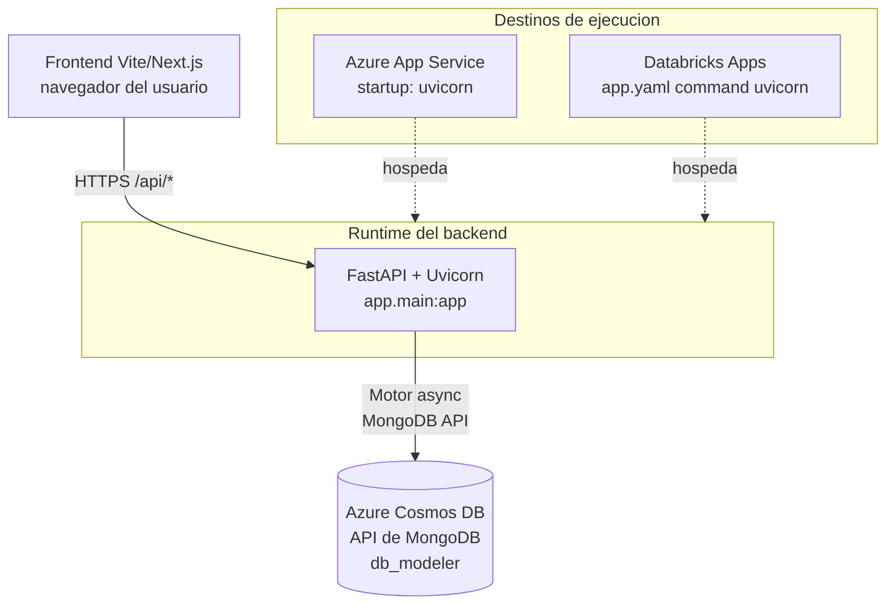
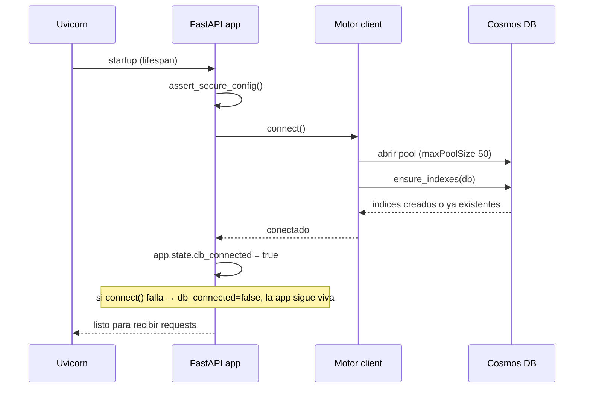
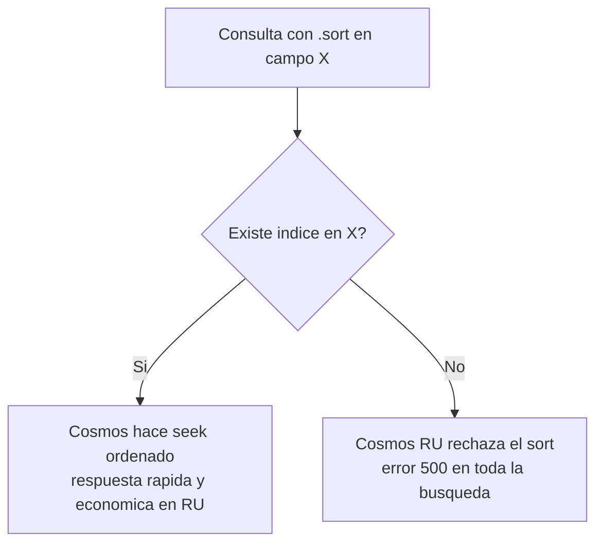
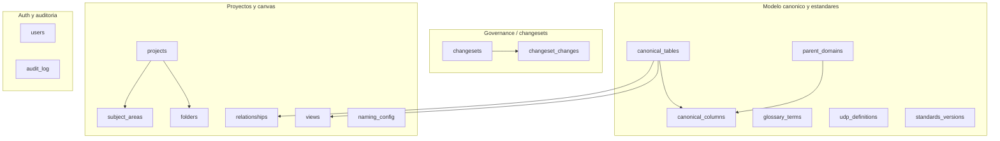

# Despliegue y Base de Datos — `backend-data-model-hub`

Este documento describe **dónde corre** el backend de plataforma del Data Model Hub, **qué variables de entorno** necesita, **cómo se conecta a la base de datos** (Azure Cosmos DB con API de MongoDB) y **cómo levantarlo en local**. No cubre CI/CD ni pipelines: solo topología de ejecución, configuración por entorno y consideraciones de base de datos.

Toda la información sale del código real: `app/core/config.py`, `app/core/db/client.py`, `app/core/db/indexes.py`, `app/main.py`, `app/core/ratelimit.py`, `app/core/logging.py`, más los manifiestos `app.yaml` y `databricks.yml`.

---

## 1. Qué es este servicio

El backend es un **servicio HTTP FastAPI** servido por **Uvicorn** (ASGI). Es un proceso único, sin estado en disco: toda la persistencia vive en Cosmos DB. El punto de entrada es el objeto `app` de `app/main.py`:

```python
# app/main.py
app = create_app()   # factory: assert_secure_config + CORS + middleware + routers

if __name__ == "__main__":
    import uvicorn
    uvicorn.run("app.main:app", host="0.0.0.0", port=8000, reload=True)
```

`create_app()` arma la app y, en el **lifespan** de FastAPI, abre la conexión a Cosmos y asegura los índices al arrancar; los cierra al apagar. El objeto ASGI que exponés a cualquier servidor es siempre `app.main:app`.

Características del proceso que importan para el despliegue:

- **Sin estado local.** No escribe archivos; todo va a Cosmos DB. Se puede reiniciar sin pérdida.
- **Rate limiting en memoria (por proceso).** El estado del limitador de `slowapi` no se comparte entre réplicas (ver sección 6.2).
- **Un solo pool de conexiones Motor** compartido por todos los repositorios (singleton en `app/core/db/client.py`).
- **Logs a `stdout`** (formato `pretty` o `json`), pensados para que el runtime los capture.

---

## 2. Topología: dónde corre

El mismo artefacto (`app.main:app` servido por Uvicorn) puede correr en dos destinos. La diferencia está en **cómo se inyectan las variables de entorno y los secretos**, y en **quién asigna el puerto**.



### 2.1 Azure App Service

Corre como una Web App de Python (Linux). El backend es un ASGI estándar, así que basta con un **startup command** que arranque Uvicorn apuntando a `app.main:app`.

Startup command típico (una sola réplica o detrás del balanceador del plan):

```bash
uvicorn app.main:app --host 0.0.0.0 --port 8000
```

Consideraciones específicas de App Service:

- **Puerto:** App Service enruta al puerto que expone el contenedor. Usá `--port 8000` (o el que definas) y alineá `WEBSITES_PORT=8000` en las Application Settings si el proxy no lo detecta solo.
- **Variables de entorno = Application Settings.** Se cargan como variables de proceso; `config.py` las lee con `os.getenv`. No hace falta `.env` en el servidor.
- **Health probe:** apuntá el health check a `GET /api/health` (devuelve `status: ok | degraded` y `db_connected`).
- **HTTPS y HSTS:** App Service termina TLS en el borde y reenvía HTTP interno con `X-Forwarded-Proto: https`. El middleware de `app/main.py` detecta ese header y agrega `Strict-Transport-Security`; no necesitás tocar nada.

### 2.2 Databricks Apps (destino actual)

Es el destino que ya está configurado en el repo. El manifiesto `app.yaml` define el comando de arranque y las variables; Databricks inyecta host y puerto automáticamente.

```yaml
# app.yaml (real)
command: ['uvicorn', 'app.main:app']

env:
  - name: LOG_FORMAT
    value: 'json'
  - name: CORS_ORIGINS
    value: 'https://frnt-data-model-hub-3871428306507680.0.azure.databricksapps.com'
  - name: COSMOS_DATABASE
    value: 'db_modeler'
  - name: COSMOS_CONNECTION_STRING
    valueFrom: cosmos_secret        # secreto Key Vault-backed
  - name: REQUIRE_AUTH
    value: 'true'
  - name: SECRET_KEY
    valueFrom: session_secret       # secreto Key Vault-backed
```

Puntos clave:

- **Host y puerto los pone Databricks.** El runtime inyecta `UVICORN_HOST=0.0.0.0` y `UVICORN_PORT=$DATABRICKS_APP_PORT`, por eso `command` no pasa `--host`/`--port`.
- **Secretos por `valueFrom`.** `COSMOS_CONNECTION_STRING` y `SECRET_KEY` no van en texto plano: se resuelven desde recursos secretos declarados en `databricks.yml` (scope `kv-scope-datacraft`, respaldado por Azure Key Vault), con permiso `READ` para el service principal de la app.

```yaml
# databricks.yml (extracto) — declaración de los secretos que app.yaml referencia
resources:
  apps:
    backend:
      name: bknd-data-model-hub
      resources:
        - name: cosmos_secret
          secret: { scope: kv-scope-datacraft, key: conn-str-cosmos, permission: READ }
        - name: session_secret
          secret: { scope: kv-scope-datacraft, key: session-secret-key, permission: READ }
```

- **Multi-réplica:** si la app escala a más de una instancia, el rate limiting en memoria deja de ser global (sección 6.2).

---

## 3. Variables de entorno (completo)

Todas se leen con `os.getenv`. La mayoría tiene default seguro para desarrollo; en producción hay que fijar explícitamente las de seguridad.

| Variable | Dónde se lee | Default | Para qué sirve |
|---|---|---|---|
| `COSMOS_CONNECTION_STRING` | `config.py` | `""` (vacío) | Cadena de conexión a Cosmos. **Sin ella el arranque de DB falla** (`RuntimeError` en `connect()`). Obligatoria. |
| `COSMOS_DATABASE` | `config.py` | `db_modeler` | Nombre de la base dentro de la cuenta Cosmos. |
| `SECRET_KEY` | `config.py` | `dev-only-insecure-change-me-in-prod` | Clave HMAC para firmar el token de sesión (JWT HS256). **En prod es obligatoria** (ver sección 8). |
| `REQUIRE_AUTH` | `config.py` | `false` | Si es `true`, toda request sin token válido es `401`. Activa la **postura de producción** (oculta `/docs`, `/redoc`, `/openapi.json` y enciende el rate limiting). |
| `ACCESS_TOKEN_TTL_MIN` | `config.py` | `720` (12 h) | Vida del token de acceso, en minutos. |
| `AUTH_MODE` | `config.py` | `local` | Seam de identidad. Se conserva por compatibilidad; el carril real de identidad es el token de sesión firmado. |
| `LOCAL_DEV_USER` | `config.py` | `dev@local` | Usuario de desarrollo cuando no hay login (solo con `REQUIRE_AUTH=false`). |
| `LOCAL_DEV_USERNAME` | `config.py` | `""` | Username de desarrollo (opcional). |
| `LOCAL_DEV_DISPLAY_NAME` | `config.py` | `""` | Nombre visible de desarrollo (opcional). |
| `CORS_ORIGINS` | `main.py` | `http://localhost:3000,http://127.0.0.1:3000` | Allowlist de orígenes del frontend, separados por coma. |
| `ALLOWED_HOSTS` | `main.py` | `""` (desactivado) | Allowlist de `Host` (`TrustedHostMiddleware`). **Solo si se define** se activa el middleware; en prod poné el dominio real. |
| `RATE_LIMIT_ENABLED` | `ratelimit.py` | `false` | Fuerza el rate limiting. También se enciende solo si `REQUIRE_AUTH=true`. |
| `LOG_FORMAT` | `logging.py` | `pretty` | `pretty` (dev, legible) o `json` (prod, un objeto por línea). |
| `LOG_LEVEL` | `logging.py` | `INFO` | Nivel mínimo: `DEBUG`, `INFO`, `WARNING`, `ERROR`, `CRITICAL`. |

### 3.1 Cómo cada variable cambia el comportamiento

- **`REQUIRE_AUTH=true` es el interruptor maestro de producción.** Con él: (a) sin token → `401`; (b) se ocultan `docs_url`, `redoc_url` y `openapi_url` (se pasan a `None` en `FastAPI(...)`); (c) el rate limiting queda `ENABLED` aunque no pongas `RATE_LIMIT_ENABLED`; (d) `assert_secure_config()` impide arrancar si `SECRET_KEY` sigue siendo el default inseguro.
- **`ALLOWED_HOSTS` es opt-in.** Si queda vacío no se monta `TrustedHostMiddleware`. En prod conviene fijarlo al dominio público para rechazar `Host` falsos.
- **`CORS_ORIGINS`** debe ser exactamente la URL del frontend (esquema + host + puerto). La configuración usa `allow_credentials=False` (auth token-first, Bearer, sin cookies) y métodos/headers acotados (`Authorization`, `Content-Type`, `X-Requested-With`).

### 3.2 Perfiles por entorno (referencia)

| Variable | Local (dev) | Producción |
|---|---|---|
| `COSMOS_CONNECTION_STRING` | cadena a tu cluster | secreto (Key Vault / App Settings) |
| `COSMOS_DATABASE` | `db_modeler` | `db_modeler` |
| `SECRET_KEY` | (default, con warning) | **secreto fuerte** `openssl rand -hex 32` |
| `REQUIRE_AUTH` | `false` | `true` |
| `CORS_ORIGINS` | `http://localhost:3000` | URL real del frontend |
| `ALLOWED_HOSTS` | (vacío) | dominio público del backend |
| `RATE_LIMIT_ENABLED` | (vacío) | implícito por `REQUIRE_AUTH=true` |
| `LOG_FORMAT` | `pretty` | `json` |
| `LOG_LEVEL` | `INFO`/`DEBUG` | `INFO` |

---

## 4. Levantar en local (Uvicorn)

Requisitos: Python 3.12 (en Databricks Apps corre 3.11; ambos funcionan), acceso a un cluster de Cosmos con API de MongoDB.

```bash
# 1) Configuración: copiar el ejemplo y completar la cadena de Cosmos
cp .env.example .env
#    editar .env → COSMOS_CONNECTION_STRING=...

# 2) Entorno virtual + dependencias
/opt/homebrew/bin/python3.12 -m venv .venv && source .venv/bin/activate
pip install -r requirements.txt

# 3) Arrancar con recarga en caliente
uvicorn app.main:app --host 0.0.0.0 --port 8000 --reload
```

`config.py` hace `load_dotenv()` sobre el `.env` de la raíz del repo, así que en local no necesitás exportar variables a mano: alcanza con el archivo `.env`.

Contenido mínimo de `.env` para desarrollo:

```bash
# .env (local)
COSMOS_CONNECTION_STRING=mongodb+srv://<user>:<password>@<cluster>.global.mongocluster.cosmos.azure.com/?tls=true&authMechanism=SCRAM-SHA-256&retrywrites=false&maxIdleTimeMS=120000
COSMOS_DATABASE=db_modeler
LOG_FORMAT=pretty
LOG_LEVEL=INFO
# REQUIRE_AUTH sin definir → false (no exige login en dev)
```

Verificar que levantó y que la DB responde:

```bash
curl http://localhost:8000/api/health
# → {"status":"ok","version":"1.0.0","db_connected":true}
```

Con `REQUIRE_AUTH=false` (default local), la documentación interactiva está disponible:

```bash
open http://localhost:8000/docs        # Swagger UI
open http://localhost:8000/redoc       # ReDoc
```

Si activás `REQUIRE_AUTH=true` en local para probar la postura de producción, una request sin token da `401` y `/docs` desaparece (404):

```bash
curl -i http://localhost:8000/api/projects
# → HTTP/1.1 401 Unauthorized   (sin Authorization: Bearer <token>)
```

---

## 5. Secuencia de arranque (lifespan)

Al iniciar el proceso, el lifespan abre la conexión y **asegura los índices** antes de aceptar tráfico real. Si Cosmos no está disponible, la app **igual arranca** pero marca `db_connected=false` (el health devuelve `degraded`), en vez de quedar caída.



`assert_secure_config()` corre **antes** de todo: si estás en postura de producción con el `SECRET_KEY` de desarrollo, el proceso no arranca (sección 8).

---

## 6. Consideraciones de la base de datos (Azure Cosmos DB, API de MongoDB)

La persistencia es **Azure Cosmos DB usando la API de MongoDB**. El backend habla con ella vía **Motor** (driver async de MongoDB). Un único cliente singleton se comparte entre todos los repositorios.

### 6.1 Cliente Motor y timeouts

```python
# app/core/db/client.py
_client = AsyncIOMotorClient(
    settings.COSMOS_CONNECTION_STRING,
    serverSelectionTimeoutMS=15_000,   # cuánto esperar por un servidor disponible
    connectTimeoutMS=10_000,           # apertura del socket TCP
    socketTimeoutMS=60_000,            # operación individual
    maxPoolSize=50,                    # tope de conexiones concurrentes
)
```

Estos timeouts son deliberados: sin ellos, un socket colgado bloquearía el request por el default del sistema operativo (minutos) y, con varios usuarios, se agotaría el pool. `connect()` es idempotente (una segunda llamada es no-op) y levanta `RuntimeError` si falta `COSMOS_CONNECTION_STRING`.

### 6.2 Rate limiting y escalado horizontal

El limitador de `slowapi` guarda estado **en memoria, por proceso**. Con una sola instancia funciona bien. Si el backend escala a varias réplicas (por ejemplo, varias instancias en Databricks Apps o App Service), cada réplica cuenta por separado y el límite efectivo se multiplica por el número de réplicas. Para un límite global real habría que mover el estado a Redis (`Limiter(storage_uri="redis://...")`). Esto no afecta la base de datos, pero es una consideración de topología a tener presente al escalar.

### 6.3 Anatomía de la cadena de conexión

La cadena de ejemplo (`.env.example`) apunta a un cluster de **Cosmos DB for MongoDB (vCore)**:

```
mongodb+srv://<user>:<password>@<cluster>.global.mongocluster.cosmos.azure.com/
    ?tls=true
    &authMechanism=SCRAM-SHA-256
    &retrywrites=false
    &maxIdleTimeMS=120000
```

| Parámetro | Por qué |
|---|---|
| `tls=true` | Cosmos exige TLS siempre. |
| `authMechanism=SCRAM-SHA-256` | Mecanismo de autenticación soportado por Cosmos. |
| `retrywrites=false` | Cosmos no soporta reintentos de escritura del driver; hay que apagarlos o el driver falla. |
| `maxIdleTimeMS=120000` | Recicla conexiones ociosas antes de que el servidor las corte, evitando errores por sockets muertos. |

> Nota sobre modelos de capacidad: el código está escrito de forma defensiva para la **API de MongoDB basada en RU** (por eso se traga los códigos de error `48`/`11000` al crear índices y por eso `.sort()` requiere índice — ver 6.5). La cadena de ejemplo corresponde a un cluster **vCore**. En cualquiera de los dos casos el protocolo es MongoDB y el código funciona igual; la diferencia práctica es cómo se dimensiona el throughput.

### 6.4 Throughput / RU

En el modelo RU (Request Units), cada operación consume RU y el throughput aprovisionado marca el techo antes de recibir `429 (throttling)`. Consideraciones prácticas para este backend:

- **Las lecturas ordenadas y las agregaciones del reporting son las más caras.** El reporting hace `$group`/proyección y recorridos por keyset sobre `canonical_columns` (hasta cientos de miles de documentos). Sin los índices correctos, esas consultas o fallan (sin índice para `.sort()`) o consumen muchas RU.
- **Aprovisioná pensando en el pico de reporting**, no en el promedio. La prueba de estrés interna (10k tablas / 400k columnas / 9k vistas) mostró que el cuello está en las agregaciones de reporting; los índices de 6.5 son los que lo bajan de decenas de segundos a ~1 s.
- **`retrywrites=false`** implica que la app no reintenta escrituras automáticamente; si hay throttling en escrituras, se propaga el error. Dimensioná RU para absorber los picos de import/apply de changesets.

### 6.5 Índices que deben existir (y por qué)

Los índices se crean automáticamente en el arranque con `ensure_indexes(db)` (`app/core/db/indexes.py`). La función es **idempotente**: si una colección ya existía, Cosmos puede levantar `NamespaceExists (48)` o `duplicate key (11000)` en índices únicos ya presentes; el código traga solo esos dos códigos y re-lanza cualquier otro.

Tabla completa de índices por colección (tal como están en el código):

| Colección | Índice | Motivo |
|---|---|---|
| `parent_domains` | `flgactive` | Filtrado de activos. |
| `glossary_terms` | `flgactive` | Filtrado de activos. |
| `udp_definitions` | `flgactive` | Filtrado de activos. |
| `canonical_tables` | `flgactive` | Filtrado de activos. |
| `canonical_tables` | `physicalName` | La búsqueda server-side del catálogo ordena por `physicalName`; sin índice, Cosmos RU rechaza el `.sort()`. |
| `canonical_tables` | `udpValues.$**` (wildcard) | Filtrar por cualquier clave UDP presente o futura sin DDL por clave. |
| `canonical_columns` | `tableId` | Traer columnas de una tabla. |
| `canonical_columns` | `parentDomainId` | Cascada de dominio. |
| `canonical_columns` | `physicalName` | Keyset/orden del reporting (Cosmos rechaza `.sort()` sin índice). |
| `canonical_columns` | `dataType` | Filtro/`$group` del reporting. |
| `canonical_columns` | `udpValues.$**` (wildcard) | Filtro por cualquier UDP de columna. |
| `changesets` | `updatedAt` (desc) | Listado por recientes. |
| `changesets` | `status` | Filtro por estado. |
| `changeset_changes` | `csId + collection` (compuesto) | Overlay/diff/apply leen por changeset (y opcionalmente por colección); un doc por cambio evita el tope de 2 MB por documento. |
| `projects` | `flgactive` | Filtrado de activos. |
| `subject_areas` | `projectId` | Áreas por proyecto. |
| `relationships` | `flgactive` | Filtrado de activos. |
| `relationships` | `sourceTableId` | El canvas resuelve relaciones por extremo origen. |
| `relationships` | `targetTableId` | El canvas resuelve relaciones por extremo destino. |
| `views` | `flgactive` | Filtrado de activos. |
| `views` | `tableId` | Listar vistas de una tabla. |
| `folders` | `projectId` | Jerarquía del Model Explorer. |
| `naming_config` | `scope` | Un documento de configuración por scope. |
| `users` | `email` | Login por email. |
| `audit_log` | `at` (desc) | Auditoría por fecha. |
| `audit_log` | `actor` | Auditoría por actor. |
| `standards_versions` | `seq` (**unique**) | Evita que dos apply/rollback concurrentes creen dos versiones con el mismo `seq`; el service reintenta ante la colisión. |

### 6.6 Por qué `.sort()` necesita índice

En la API de MongoDB de Cosmos (tier RU), **el motor no ordena en memoria un conjunto no indexado**: si pedís `.sort()` sobre un campo que no tiene índice, la operación se **rechaza con un error de servidor (500)** en lugar de ejecutarse lenta. Esto es distinto de un MongoDB clásico, que sí haría el ordenamiento en memoria (con un tope). Por eso, cada campo que el backend usa para ordenar tiene un índice explícito:

- `canonical_tables.physicalName` y `canonical_columns.physicalName` → orden/keyset del catálogo y del reporting.
- `changesets.updatedAt` → listado por recientes.
- `audit_log.at` → auditoría por fecha.



Regla operativa: **antes de agregar cualquier `.sort()` nuevo en el código, agregá su índice en `indexes.py`**, o esa ruta empezará a devolver 500 en producción.

El índice **wildcard** `udpValues.$**` es un caso especial: los UDP son etiquetas key-value que el usuario crea en runtime. Un índice por clave requeriría DDL cada vez que alguien crea un UDP nuevo; el wildcard cubre todas las claves presentes y futuras del mapa embebido, de modo que filtrar por cualquier UDP hace *seek* sin cambios de esquema.

---

## 7. Modelo lógico de datos (colecciones)

Las colecciones del backend viven todas en la misma base (`db_modeler`), en la misma cuenta Cosmos que el servicio de agentes (que administra `column_catalog`). No hay joins a nivel de motor: las relaciones son por identificadores y las resuelve la aplicación.



---

## 8. Seguridad de arranque (fail-closed)

`assert_secure_config()` (en `config.py`, invocada por `create_app()`) implementa un arranque **fail-closed** respecto del `SECRET_KEY`:

```python
def assert_secure_config() -> None:
    using_default = settings.SECRET_KEY == INSECURE_DEFAULT_SECRET_KEY
    if using_default:
        if settings.REQUIRE_AUTH:
            raise RuntimeError(
                "SECRET_KEY inseguro con REQUIRE_AUTH=true: definí SECRET_KEY ..."
            )
        log.warning("SECRET_KEY usa el default de desarrollo (INSEGURO). ...")
```

- Si `REQUIRE_AUTH=true` y `SECRET_KEY` sigue siendo el default público (`dev-only-insecure-change-me-in-prod`), la app **no arranca**: con esa clave conocida cualquiera podría forjar un token de sesión de admin.
- Si estás en dev (`REQUIRE_AUTH=false`) con el default, arranca pero emite un warning fuerte para que no te olvides de cambiarlo antes de desplegar.

Por eso en `app.yaml` el `SECRET_KEY` viene de un secreto (`session_secret` → Key Vault). Generá un valor fuerte, por ejemplo:

```bash
openssl rand -hex 32
```

Además, en postura de producción la app oculta la superficie de fingerprinting: `docs_url`, `redoc_url` y `openapi_url` se ponen en `None` cuando `REQUIRE_AUTH=true`.

---

## 9. Salud y observabilidad

- **Health endpoint:** `GET /api/health` hace un `ping` vivo a Cosmos con timeout de 2 s. Devuelve `status: ok` si la DB responde, o `degraded` si no. Usalo como readiness/liveness probe.

  ```bash
  curl -s http://localhost:8000/api/health | jq
  # {
  #   "status": "ok",
  #   "version": "1.0.0",
  #   "db_connected": true
  # }
  ```

- **Logs estructurados:** con `LOG_FORMAT=json` cada línea es un objeto JSON con `timestamp` ISO-8601 UTC, `level`, `logger`, `message` y cualquier `extra`. En prod usá `json` para que el runtime (Databricks Apps o App Service) lo indexe.
- **Trazabilidad por request:** cada respuesta lleva un header `X-Request-ID` (12 hex). El mismo id aparece en los logs de `request started` / `request completed`, así podés correlacionar un error `500` con su traza.
- **Headers de seguridad (defensa en profundidad):** en cada respuesta el middleware agrega `X-Content-Type-Options: nosniff`, `X-Frame-Options: DENY`, `Referrer-Policy: no-referrer`, `Permissions-Policy` restrictiva y, solo sobre HTTPS (directo o vía `X-Forwarded-Proto`), `Strict-Transport-Security`.

---

## 10. Checklist de despliegue (sin CI/CD)

Antes de exponer el backend en cualquiera de los dos destinos:

1. `COSMOS_CONNECTION_STRING` seteada (secreto), con `retrywrites=false` y `tls=true`. Verificá que `COSMOS_DATABASE=db_modeler`.
2. `SECRET_KEY` = valor fuerte y secreto (no el default). Si no, con `REQUIRE_AUTH=true` la app no arranca.
3. `REQUIRE_AUTH=true` (activa 401, oculta docs, enciende rate limiting).
4. `CORS_ORIGINS` = URL exacta del frontend. `ALLOWED_HOSTS` = dominio público del backend.
5. `LOG_FORMAT=json`, `LOG_LEVEL=INFO`.
6. Throughput RU dimensionado para el pico de reporting; confirmar que `ensure_indexes` corrió al arrancar (aparece `motor indexes ensured` en logs).
7. Health probe apuntando a `GET /api/health`; esperar `status: ok`.
8. Si escalás a más de una réplica, planear el rate limiting a un backend compartido (Redis), ya que el actual es por proceso.

---

Referencias de código (rutas absolutas):
- `/Users/carlosperez/Desktop/Projects/Agentes/GitHub/WebApp/MODELER/backend-data-model-hub/app/core/config.py`
- `/Users/carlosperez/Desktop/Projects/Agentes/GitHub/WebApp/MODELER/backend-data-model-hub/app/core/db/client.py`
- `/Users/carlosperez/Desktop/Projects/Agentes/GitHub/WebApp/MODELER/backend-data-model-hub/app/core/db/indexes.py`
- `/Users/carlosperez/Desktop/Projects/Agentes/GitHub/WebApp/MODELER/backend-data-model-hub/app/main.py`
- `/Users/carlosperez/Desktop/Projects/Agentes/GitHub/WebApp/MODELER/backend-data-model-hub/app/core/ratelimit.py`
- `/Users/carlosperez/Desktop/Projects/Agentes/GitHub/WebApp/MODELER/backend-data-model-hub/app/core/logging.py`
- `/Users/carlosperez/Desktop/Projects/Agentes/GitHub/WebApp/MODELER/backend-data-model-hub/app.yaml`
- `/Users/carlosperez/Desktop/Projects/Agentes/GitHub/WebApp/MODELER/backend-data-model-hub/databricks.yml`
- `/Users/carlosperez/Desktop/Projects/Agentes/GitHub/WebApp/MODELER/backend-data-model-hub/.env.example`
