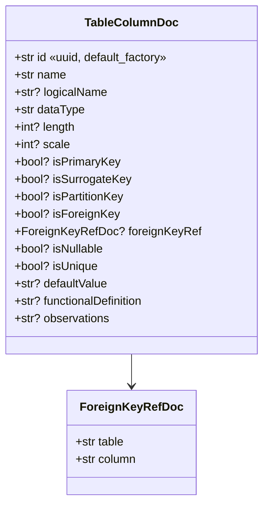
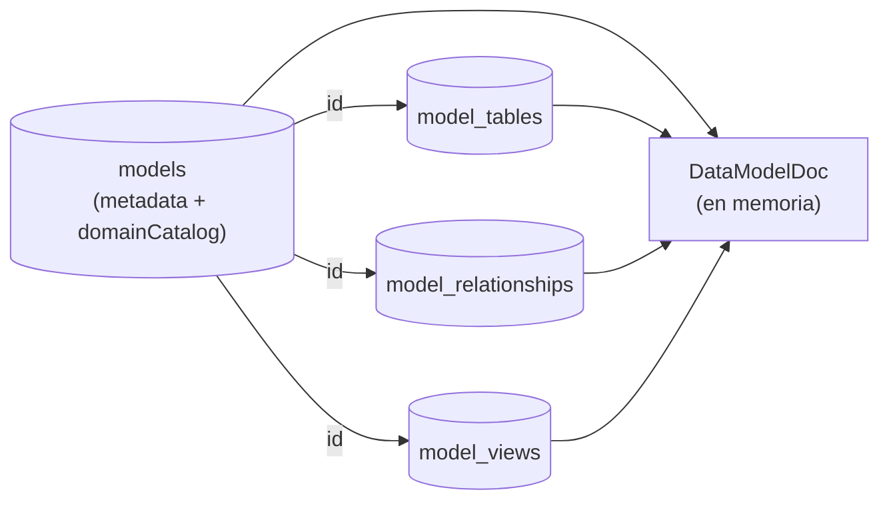

# Schemas (Pydantic v2)

> El backend de plataforma tiene **dos familias** de schemas Pydantic:
>
> - `src/db/db_models.py` → **modelos de persistencia** (Cosmos DB),
>   espejo exacto de las interfaces TypeScript del frontend en
>   `web-data-model-hub/src/types/model.ts`.
> - `src/excel_import/schemas.py` → **contrato HTTP** del endpoint de
>   preview del Excel-import.
>
> Los request/response de los demás endpoints viven inline en cada
> router (`api/routes/*.py`) como clases Pydantic locales — no se
> centralizan porque son chicos y solo se usan en un sitio.

---

## 1. Modelos de persistencia (`src/db/db_models.py`)

Todos heredan `BaseModel` con `ConfigDict(extra="ignore",
populate_by_name=True)`:

- `extra="ignore"` — los campos internos de Mongo (`flgactive`,
  `deletedAt`, `tableCount`, `_id`) se ignoran silenciosamente al
  validar. Mantiene el modelo limpio mientras los CRUD helpers se
  encargan del mapping.
- `populate_by_name=True` — permite crear instancias con el nombre del
  field python *o* el alias JSON (necesario para `schema_` ↔ `"schema"`).

### 1.1 `ProjectDoc`

| Campo | Tipo | Notas |
|---|---|---|
| `id` | `str` | uuid |
| `name` | `str` | |
| `description` | `str \| None` | |
| `createdAt`, `updatedAt` | `str` | ISO 8601 |

### 1.2 `TagDoc`

```python
class TagDoc(BaseModel):
    key: str = ""
    value: str = ""
```

Pares key-value libres (no hay vocabulario controlado). Reemplazó a la
forma legacy `list[str]` — el validator `_coerce_legacy_tags` en cada
modelo consumidor convierte strings sueltos a `{key: "", value: <str>}`
para que docs antiguos sigan cargando sin migración.

### 1.3 `TableColumnDoc`



> **Punto crítico**: `id` es un identificador estable que sobrevive a
> renames. Las relaciones (`RelationshipDoc.sourceColumn` /
> `targetColumn`) apuntan a este `id`, **no a `name`**. La
> `default_factory=lambda: str(uuid.uuid4())` garantiza que cualquier
> documento construido en código tenga id; el persistence layer
> (`models_db._ensure_column_ids`) hace además un backfill defensivo
> sobre cualquier dict que llegue sin id.

### 1.4 `TableModelDoc` (colección `model_tables`)

```python
class TableModelDoc(BaseModel):
    id: str
    sql_schema: str | None = Field(default=None, alias="schema")  # Mongo key sigue siendo "schema"
    name: str
    logicalName: str | None = None
    columns: list[TableColumnDoc]
    functionalDefinition: str | None = None
    color: str | None = None
    applicationCode: str | None = None
    domain: str | None = None
    subdomain: str | None = None
    domainId: str | None = None
    subdomainId: str | None = None
    tags: list[TagDoc] | None = None
    partition: PartitionSpecDoc | None = None
    position: NodePositionDoc | None = None
    # NOTA: `modelId` NO está en el schema — se inyecta/elimina al persistir
```

`PartitionSpecDoc` lleva `strategy`, `columns`, `buckets`, `granularity`,
`clusteringColumns`. La UI filtra estrategias soportadas por engine.

`NodePositionDoc` lleva solo `x: float, y: float`. Se persiste para que
el layout ELK + drags manuales sobrevivan reloads (`PATCH /api/models/{id}/positions`).

### 1.5 `RelationshipDoc` (colección `model_relationships`)

| Campo | Tipo | Semántica |
|---|---|---|
| `id` | `str` | uuid de la relación |
| `sourceTable` | `str` | acepta `TableModelDoc.id` (preferido) o `name` (legacy) |
| `sourceColumn` | `str` | apunta a `TableColumnDoc.id` (post-migration). El frontend resuelve fallback a `name` para datos viejos con `src/lib/columnRef.ts::resolveColumnName`. |
| `targetTable` | `str` | idem |
| `targetColumn` | `str` | idem |
| `type` | `str` | `one-to-one` / `one-to-many` / `many-to-many` |
| `sourceCardinality` | `str \| None` | Override Crow's Foot opcional: `one-only` / `zero-or-one` / `one-or-many` / `zero-or-many`. Cuando es `None`, el frontend lo deriva de `type` + `isNullable`. |
| `targetCardinality` | `str \| None` | idem |

### 1.6 `ViewModelDoc` (colección `model_views`)

```python
class ViewModelDoc(BaseModel):
    id: str
    name: str
    logicalName: str | None = None
    sql_schema: str | None = Field(default=None, alias="schema")
    sourceTableId: str
    viewType: str  # 'technical' | 'user' | 'business'
    columns: list[ViewColumnTransformDoc]
    whereClause: str | None = None
    useCustomSql: bool | None = None
    customSql: str | None = None
    functionalDefinition: str | None = None
    domain: str | None = None
    subdomain: str | None = None
    domainId: str | None = None
    subdomainId: str | None = None
    tags: list[TagDoc] | None = None
    color: str | None = None
    position: NodePositionDoc | None = None
```

### 1.7 `DataModelDoc` (colección `models` — hidratado en memoria)

`DataModelDoc` es el agregado completo: la colección `models` solo
guarda metadatos (`projectId`, `name`, `engine`, `domainCatalog`,
`createdAt`, etc.) y `tables` / `relationships` / `views` se hidratan al
leer mediante `asyncio.gather` sobre las tres colecciones hijas.



`domainCatalog` se embebe directamente en el doc de `models` (no es una
colección aparte) porque siempre se lee con el modelo y nunca se
consulta por separado.

### 1.8 `DomainDefinitionDoc` / `SubdomainDefinitionDoc` / `DomainDefaultsDoc`

```python
class DomainDefaultsDoc(BaseModel):
    """Valores heredados por las tablas asignadas a este dominio."""
    schema_: str | None = Field(default=None, alias="schema")
    tags: list[TagDoc] | None = None

class SubdomainDefinitionDoc(BaseModel):
    id: str
    name: str
    code: str | None = None
    description: str | None = None
    defaults: DomainDefaultsDoc | None = None

class DomainDefinitionDoc(BaseModel):
    id: str
    name: str
    code: str | None = None
    description: str | None = None
    color: str | None = None  # hex (#0d9488), para el canvas
    subdomains: list[SubdomainDefinitionDoc]
    defaults: DomainDefaultsDoc | None = None
```

Los defaults de subdominio ganan a los de dominio (cascada estándar).
La aplicación de defaults se hace en el frontend al editar la tabla, no
en el backend — el backend solo persiste lo que llega.

### 1.9 `UserDoc` y `PermissionDoc`

```python
class PermissionDoc(BaseModel):
    scope: Literal["project", "model"]
    projectId: str
    modelId: str | None = None  # solo cuando scope == "model"
    level: Literal["view", "edit"]


class UserDoc(BaseModel):
    id: str
    username: str
    passwordHash: str
    role: Literal["admin", "editor", "viewer"]
    isActive: bool
    permissions: list[PermissionDoc]
    createdAt: str
    statusUpdatedAt: str
    lastLoginAt: str | None = None
```

| Campo | Notas |
|---|---|
| `passwordHash` | bcrypt con `gensalt(rounds=10)`. **Nunca sale del backend** — `_public_user` (admin) y `_user_payload` (auth) lo omiten. |
| `role` | rol "global"; los permisos finos viven en `permissions`. |
| `isActive` | desactivar a un usuario lo bloquea inmediatamente — `require_user` valida en cada request. |
| `permissions` | array de scopes. Un usuario puede tener `(project=A, level=view)` + `(model=A.M1, level=edit)` simultáneamente. |

`role=admin` cortocircuita los permisos (`is_admin` → edit en todo).

---

## 2. Schemas del Excel-import (`src/excel_import/schemas.py`)

Estos sí están centralizados porque definen el contrato HTTP del
endpoint de preview. Usan `ConfigDict(extra="forbid",
populate_by_name=True)` — más estricto que los modelos de DB, porque
es la frontera con el frontend.

### 2.1 `PreviewColumn`

```python
class PreviewColumn(BaseModel):
    name: str
    dataType: str          # canónico, p.ej. "decimal", "varchar"
    rawDataType: str       # original tal como vino en el Excel
    length: int | None = None
    scale: int | None = None
    functionalDefinition: str | None = None
    typeConfidence: float            # 0-100
    typeMatchedVia: MatchKind        # "exact" | "alias" | "fuzzy" | "unknown" | "empty"
```

`MatchKind` es un `Literal[...]` — el frontend lo usa para pintar el
badge bajo el dropdown del tipo (en el modal de preview):

| Valor | Cuándo aparece | UI hint |
|---|---|---|
| `exact` | el tipo coincide literal con un canónico (`varchar`, `integer`) | sin badge (es el caso ideal) |
| `alias` | el tipo es un sinónimo conocido (`int → integer`) | badge gris |
| `fuzzy` | rapidfuzz aceptó el match por similitud (`decximam → decimal`) | badge azul con `%` de confianza |
| `unknown` | nada superó el `FUZZY_THRESHOLD` | badge naranja — invita al usuario a corregir |
| `empty` | la celda venía vacía; default a `varchar` | badge naranja |

### 2.2 `PreviewTable`

```python
class PreviewTable(BaseModel):
    sheetName: str
    schema_: str | None = Field(default=None, alias="schema")
    name: str
    description: str | None = None
    columns: list[PreviewColumn]
```

- `sheetName` es el nombre original de la hoja (`"dbo.Customer"`).
- `schema_` se serializa como `"schema"` en JSON (alias). El atributo
  Python lleva el `_` para no chocar con `BaseModel.schema()` que sigue
  expuesto en Pydantic v2 aunque esté deprecado.
- `description` se popula desde la hoja `TablesDescriptions` (opcional);
  `None` cuando no hay match.

### 2.3 `ExcelPreview`

```python
class ExcelPreview(BaseModel):
    tables: list[PreviewTable]
    tableDescriptionsFound: bool
    warnings: list[str]
```

- `tableDescriptionsFound`: `True` si encontramos una hoja
  `TablesDescriptions` (independiente de si efectivamente matcheó con
  tablas). Útil para que la UI muestre un hint distinto cuando el
  usuario no incluyó la hoja.
- `warnings`: lista de avisos no fatales (hojas vacías, headers raros,
  descripciones huérfanas). El frontend las puede mostrar como toasts.

---

## 3. Request/response schemas inline

Por router, no son reutilizados así que viven inline. Resumen:

### `api/routes/auth.py`

```python
class LoginRequest(BaseModel):
    username: str
    password: str
```

Response del login es `_user_payload(user)` (dict sin `passwordHash`)
envuelto en `ok(...)`.

### `api/routes/projects.py`

```python
class CreateProjectRequest(BaseModel):
    name: str
    description: str | None = None

class UpdateProjectRequest(BaseModel):
    name: str | None = None
    description: str | None = None
```

### `api/routes/models.py`

```python
class CreateModelRequest(BaseModel):
    projectId: str
    name: str
    description: str | None = None
    engine: str | None = None
    tables: list[dict[str, Any]] | None = None
    relationships: list[dict[str, Any]] | None = None
    views: list[dict[str, Any]] | None = None
    domainCatalog: list[dict[str, Any]] | None = None

class UpdateModelRequest(BaseModel):  # idéntico pero todos opcionales
    ...

class PositionPayload(BaseModel):
    x: float
    y: float

class PatchPositionsRequest(BaseModel):
    """tables / views son opcionales — solo se actualiza el que llegue."""
    tables: dict[str, PositionPayload] | None = None
    views: dict[str, PositionPayload] | None = None
```

> Las listas se tipan como `list[dict[str, Any]]` (no `list[TableModelDoc]`)
> porque la validación estricta la hace `DataModelDoc.model_validate`
> después, en el handler. Esto permite que el frontend envíe el JSON
> completo del canvas sin que cada campo opcional dispare un 422 antes
> de llegar al handler.

### `api/routes/admin.py`

```python
class PermissionPayload(BaseModel):
    scope: str            # "project" | "model"
    projectId: str
    modelId: str | None = None
    level: str            # "view" | "edit"

class CreateUserRequest(BaseModel):
    username: str
    password: str
    role: str             # "admin" | "editor" | "viewer"
    isActive: bool = True
    permissions: list[PermissionPayload] = Field(default_factory=list)

class UpdateUserRequest(BaseModel):  # todos opcionales
    ...
```

La validación de `role` / `scope` / `level` se hace en helpers locales
(`_validate_role`, `_validate_permissions`) que levantan 400 con
mensajes específicos — eso da mejores errores que dejar que Pydantic
lance un 422 genérico sobre un Literal.

### `api/routes/health.py`

```python
class HealthResponse(BaseModel):
    status: str
    version: str
    db_connected: bool
```

---

## 4. Envelope de respuesta

Todos los endpoints CRUD (excepto los que devuelven 401/403 con un
formato propio) usan el helper `ok(...)` de `src/api/response_builder.py`:

```python
def ok(data: Any = None) -> dict[str, Any]:
    return {"success": True, "data": data}
```

El frontend espera siempre el sobre `{success: bool, data?, error?}`.
Para los errores, los handlers levantan `HTTPException(status_code,
detail)` y FastAPI los serializa al formato estándar (`{"detail": "..."}`)
— los handlers de auth (`login`, `me`) son la excepción porque devuelven
explícitamente `{"success": False, "error": "...", "code"?: "..."}`
para que el frontend pueda diferenciar `unauthenticated` de `inactive`.
