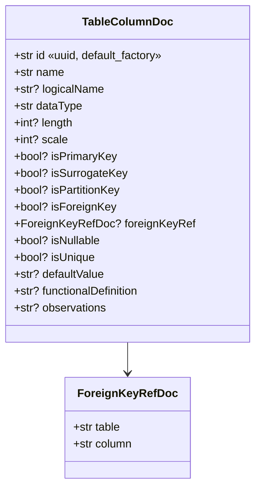
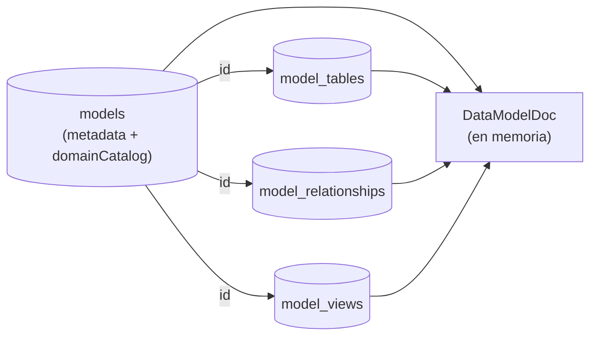
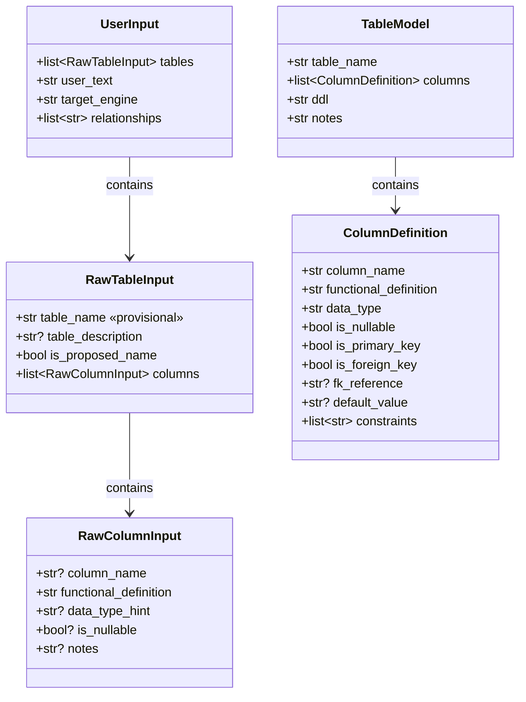

# Schemas (Pydantic v2)

> El backend tiene **dos familias** de schemas Pydantic, viviendo en
> archivos separados:
>
> - `src/schemas.py` → contratos de la **API REST** (request/response,
>   modelos internos del workflow, `ColumnAPI`/`TableAPI`/etc.).
> - `src/db/db_models.py` → **modelos de persistencia** Cosmos DB,
>   espejo exacto de las interfaces TypeScript del frontend.
>
> No se mezclan: el flujo es `request → API schema → workflow → API
> schema → response` *o* `request → DB doc → Cosmos → DB doc →
> response`. La capa que une ambos mundos es la suite `assemble_*` de
> `response_builder.py`.

---

## 1. Modelos de persistencia (`src/db/db_models.py`)

Todos heredan `BaseModel` con `ConfigDict(extra="ignore",
populate_by_name=True)` — los campos internos de Mongo (`flgactive`,
`deletedAt`, `_id`, etc.) se ignoran silenciosamente al validar.

### 1.1 `ProjectDoc`

| Campo | Tipo | Notas |
|-------|------|-------|
| `id` | `str` | uuid |
| `name` | `str` | |
| `description` | `str \| None` | |
| `createdAt`, `updatedAt` | `str` | ISO 8601 |

### 1.2 `TableColumnDoc`



> **Punto crítico**: `id` es un identificador estable que sobrevive a
> renames. Las relaciones (`RelationshipDoc.sourceColumn` /
> `targetColumn`) apuntan a este `id`, **no a `name`**. La
> `default_factory=lambda: str(uuid.uuid4())` garantiza que cualquier
> documento construido en código tenga id; el persistence layer
> (`models_db._ensure_column_ids`) además hace backfill defensivo
> sobre cualquier dict que llegue sin id.

### 1.3 `TableModelDoc` (colección `model_tables`)

```python
class TableModelDoc(BaseModel):
    id: str
    sql_schema: str | None = Field(default=None, alias="schema")  # Mongo key sigue siendo "schema"
    name: str
    logicalName: str | None = None
    columns: list[TableColumnDoc]
    functionalDefinition: str | None = None
    color: str | None = None
    applicationCode: str | None = None
    domain: str | None = None
    subdomain: str | None = None
    domainId: str | None = None
    subdomainId: str | None = None
    tags: list[str] | None = None
    partition: PartitionSpecDoc | None = None
    # NOTA: `modelId` NO está en el schema — se inyecta/elimina al persistir
```

`PartitionSpecDoc` lleva `strategy`, `columns`, `buckets`,
`granularity`, `clusteringColumns`. La UI filtra estrategias
soportadas por engine.

### 1.4 `RelationshipDoc` (colección `model_relationships`)

| Campo | Tipo | Semántica |
|-------|------|-----------|
| `id` | `str` | uuid de la relación |
| `sourceTable` | `str` | acepta `TableModelDoc.id` (preferido) o `name` (legacy) |
| `sourceColumn` | `str` | apunta a `TableColumnDoc.id` (post-migration) — `resolveColumnName` en TS hace fallback a `name` para datos viejos |
| `targetTable` | `str` | idem |
| `targetColumn` | `str` | idem |
| `type` | `str` | `one-to-one` / `one-to-many` / `many-to-many` |

### 1.5 `ViewModelDoc` (colección `model_views`)

```python
class ViewModelDoc(BaseModel):
    id: str
    name: str
    logicalName: str | None = None
    sql_schema: str | None = Field(default=None, alias="schema")
    sourceTableId: str
    viewType: Literal["technical", "user", "business"]
    columns: list[ViewColumnTransformDoc]
    whereClause: str | None = None
    useCustomSql: bool | None = None
    customSql: str | None = None
    functionalDefinition: str | None = None
    domain: str | None = None
    subdomain: str | None = None
    domainId: str | None = None
    subdomainId: str | None = None
    tags: list[str] | None = None
    color: str | None = None
```

### 1.6 `DataModelDoc` (colección `models` — hidratado)

`DataModelDoc` es el agregado completo: la colección `models` solo
guarda los metadatos (`projectId`, `name`, `engine`, `domainCatalog`,
`createdAt`, etc.) y `tables` / `relationships` / `views` se hidratan
al leer mediante `asyncio.gather` sobre las tres colecciones hijas.



### 1.7 `UserDoc` y `PermissionDoc`

```python
class PermissionDoc(BaseModel):
    scope: Literal["project", "model"]
    projectId: str
    modelId: str | None = None  # solo cuando scope == "model"
    level: Literal["view", "edit"]


class UserDoc(BaseModel):
    id: str
    username: str
    passwordHash: str
    role: Literal["admin", "editor", "viewer"]
    isActive: bool
    permissions: list[PermissionDoc]
    createdAt: str
    statusUpdatedAt: str
    lastLoginAt: str | None = None
```

| Campo | Notas |
|-------|-------|
| `passwordHash` | bcrypt con `gensalt(rounds=10)`. Nunca sale del backend (omitido en respuestas API). |
| `role` | el rol "global"; los permisos finos viven en `permissions`. |
| `isActive` | desactivar a un usuario lo bloquea inmediatamente — `require_user` valida en cada request. |
| `permissions` | array de scopes. Un usuario puede tener `(project=A, level=view)` + `(model=A.M1, level=edit)` simultáneamente. |

`role=admin` cortocircuita los permisos (`is_admin` → edit en todo).

---

## 2. Schemas de la API (`src/schemas.py`)

### 2.1 Tipo alias `UUIDv4`

```python
UUIDv4 = Annotated[
    str,
    StringConstraints(
        pattern=r"^[0-9a-fA-F]{8}-[0-9a-fA-F]{4}-4[0-9a-fA-F]{3}-[89abAB][0-9a-fA-F]{3}-[0-9a-fA-F]{12}$",
        strip_whitespace=True,
    ),
]
```

Se aplica en todos los `conversation_id` que entran o salen del API.
Pydantic rechaza con 422 cualquier string que no sea UUID v4.

### 2.2 Endpoints de conversación

| Schema | Endpoint | Notas |
|--------|----------|-------|
| `CreateConversationRequest` | `POST /api/conversations` body | `{ conversation_id: UUIDv4, engine: str = "databricks_sql" }` |
| `CreateConversationResponse` | idem response | `created: bool` indica si la sesión se creó o ya existía. |
| `GuidelinesUploadResponse` | `POST /api/conversations/{id}/guidelines` | incluye `preview` (primeros 500 chars del contenido procesado). |
| `DeleteConversationResponse` | `DELETE /api/conversations/{id}` | confirma `deleted: True`. |

### 2.3 Endpoint de modelado

`POST /api/conversations/{id}/model` recibe **multipart/form-data**:

| Field | Tipo | Obligatoriedad |
|-------|------|----------------|
| `excel_file` | `UploadFile` (.xlsx) | **obligatorio** |
| `context_text` | `str` | opcional (texto libre del usuario para contexto del turno) |
| `engine` | `str` | opcional, override del engine de la sesión |

> Nota: en el rediseño actual el modelado **siempre** parte del Excel.
> Si el frontend manda solo `context_text` sin Excel, el backend
> responde 400.

**Response: `ModelingResponseAPI`**

| Campo | Tipo | Descripción |
|-------|------|-------------|
| `conversation_id` | `UUIDv4` | eco del id de la sesión |
| `engine` | `str` | motor efectivamente usado en este turno |
| `turn_number` | `int ≥ 1` | número de turno tras este request |
| `tables` | `list[TableAPI]` | tablas modeladas (con DDL ya generado en Python) |
| `relationships` | `list[str]` | siempre `[]` en el rediseño actual (las FK las modela el usuario en el frontend) |
| `export_sql` | `str` | DDL completo concatenado de todas las tablas |
| `export_markdown` | `str` | resumen del modelo en MD |
| `qa_report` | `QAReportAPI` | siempre vacío en el rediseño (sin QA agent), pero el campo existe por compatibilidad |
| `guidelines_applied` | `str` | resumen textual de los lineamientos efectivos |
| `summary` | `str` | reservado, vacío hoy |

### 2.4 `ColumnAPI` y `TableAPI`

```python
class ColumnAPI(BaseModel):
    column_name: str
    data_type: str
    nullable: bool
    is_pk: bool = False
    is_fk: bool = False
    fk_references: str | None = None      # "tabla.columna" o null
    functional_definition: str = ""
    observations: str = ""                # razón del tipo, default aplicado, "audit column", etc.


class TableAPI(BaseModel):
    table_name: str
    table_description: str = ""
    columns: list[ColumnAPI]
    ddl: str = ""                         # generado en src/processing/ddl_generator.py
```

> El frontend convierte estas estructuras a `TableModel` /
> `TableColumn` (las del canvas) con `modelingResponseToCanvas` en
> `@/lib/agent/mapping.ts`. Ahí se asignan los `id` estables de
> columna y se resuelven los `fk_references` a relaciones por id.

### 2.5 `QAReportAPI` (legacy compat)

```python
class QAReportAPI(BaseModel):
    quality_score: int = 0       # ge=0, le=100
    standardized_columns: list[StandardizedColumnAPI] = []
    guideline_violations: list[GuidelineViolationAPI] = []
    new_catalog_entries: list[NewCatalogEntryAPI] = []
    summary: str = ""
```

Se mantiene en el contrato para no romper el frontend, pero el backend
**actualmente lo deja vacío**. El QAValidatorAgent fue retirado en el
rediseño.

### 2.6 Health / engines

```python
class HealthResponseAPI(BaseModel):
    status: str
    version: str
    foundry_connected: bool
    default_engine: str
    active_conversations: int


class EnginesResponseAPI(BaseModel):
    engines: list[str]    # ["databricks_sql", "cosmosdb", "sqlserver", "postgresql", "mysql"]
    default: str
```

### 2.7 Errores

```python
class ErrorResponseAPI(BaseModel):
    detail: str
    code: str = "error"
```

Usado por los `HTTPException(detail=...)` y por las respuestas 502
del proxy del frontend (cuando lo había). Para los CRUD de proyectos /
modelos / users / auth las respuestas usan el envelope
`{success: bool, data?: ..., error?: ...}` (helper `ok` en
`response_builder.py`).

---

## 3. Modelos internos del workflow (`src/schemas.py`)

Estos no salen al API — viven en el dominio del agente y del CLI:



`TableModel` aquí es el modelo **interno** del agente — no se
confunde con `TableAPI` (contrato externo). Hoy el workflow opera
sobre dicts plano (más rápido de pasar entre nodos del Agent
Framework) y solo se cosechan a `TableAPI` en `response_builder`.

---

## 4. Mapeo agente → API

`src/api/response_builder.py::_map_column` traduce los nombres
internos que produce el LLM al contrato del frontend:

| Interno (LLM JSON) | API (`ColumnAPI`) |
|--------------------|-------------------|
| `column_name` | `column_name` |
| `data_type` | `data_type` |
| `is_pk` (o legacy `is_primary_key`) | `is_pk` |
| `nullable` (o legacy `is_nullable`) | `nullable` (forzado a `False` si `is_pk=True`) |
| `is_fk` | `is_fk` |
| `fk_references` | `fk_references` (string `"tabla.columna"` o null) |
| `functional_definition` | `functional_definition` |
| `notes` (de columna) | parte de `observations` |
| `default_value` | concatenado en `observations` |
| `constraints` | concatenado en `observations` |
| `notes` (de tabla) | `table_description` (en `_map_table`) |

**Coerción defensiva**: el LLM ocasionalmente devuelve booleanos como
strings (`"true"`, `"si"`, `"yes"`). `_coerce_bool` los normaliza con
una lista cerrada de valores aceptados — cualquier string desconocido
cae al default declarado.

**Audit columns**: después del mapeo, `inject_audit_columns` agrega
las audit columns declaradas en los guidelines de la sesión, salvo
para tablas con prefijos `r*` (referencia) o `t*` (temporal). Si el
LLM ya emitió alguna audit column, no se duplica (gana la del LLM
que pudo haberla refinado).
