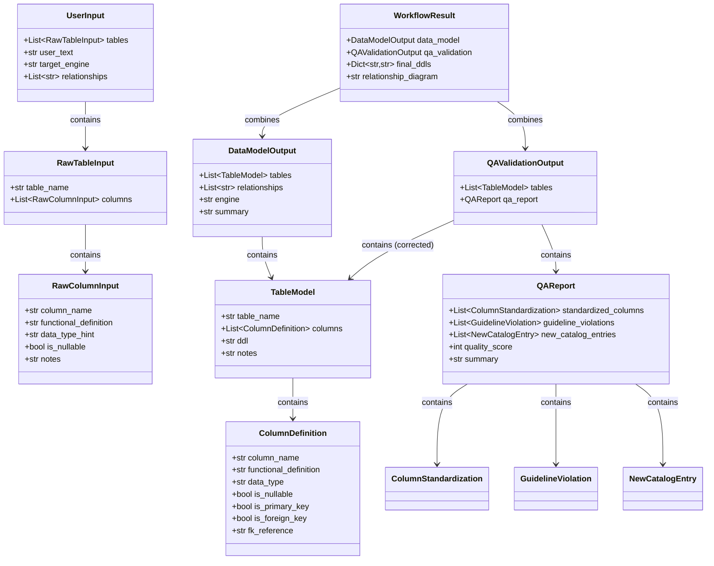

# Modelos de Datos (Schemas)

## Visión general

Todos los modelos de datos del sistema se definen con **Pydantic v2** en `src/schemas.py`. Estos schemas proporcionan validación, serialización y documentación automática de las estructuras intercambiadas entre componentes.

---

## Catálogo de columnas

### `CatalogColumn`

Columna registrada en el catálogo corporativo.

| Campo | Tipo | Default | Descripción |
|-------|------|---------|-------------|
| `column_name` | `str` | — | Nombre estandarizado |
| `functional_definition` | `str` | — | Definición funcional |
| `data_type` | `str` | — | Tipo de dato base |
| `used_in_tables` | `list[str]` | `[]` | Tablas donde se usa |
| `is_new` | `bool` | `False` | Si fue agregada recientemente |

### `ColumnCatalog`

Catálogo completo de columnas.

| Campo | Tipo | Default | Descripción |
|-------|------|---------|-------------|
| `columns` | `list[CatalogColumn]` | `[]` | Lista de columnas |

---

## Input del usuario

### `RawColumnInput`

Columna tal como viene del Excel del usuario.

| Campo | Tipo | Default | Descripción |
|-------|------|---------|-------------|
| `column_name` | `str \| None` | `None` | Nombre sugerido (opcional) |
| `functional_definition` | `str` | — | Definición funcional (obligatoria) |
| `data_type_hint` | `str \| None` | `None` | Sugerencia de tipo |
| `is_nullable` | `bool \| None` | `None` | ¿Permite nulos? |
| `notes` | `str \| None` | `None` | Notas adicionales |

### `RawTableInput`

Tabla tal como viene del Excel (una pestaña).

| Campo | Tipo | Default | Descripción |
|-------|------|---------|-------------|
| `table_name` | `str` | — | Nombre de la pestaña |
| `columns` | `list[RawColumnInput]` | `[]` | Columnas de la tabla |

### `UserInput`

Input completo del usuario.

| Campo | Tipo | Default | Descripción |
|-------|------|---------|-------------|
| `tables` | `list[RawTableInput]` | `[]` | Tablas parseadas |
| `user_text` | `str` | `""` | Texto libre del usuario |
| `target_engine` | `str` | `"databricks_sql"` | Motor de BD destino |
| `relationships` | `list[str]` | `[]` | Relaciones entre tablas |

---

## Modelo de datos generado

### `ColumnDefinition`

Definición completa de una columna del modelo generado.

| Campo | Tipo | Default | Descripción |
|-------|------|---------|-------------|
| `column_name` | `str` | — | Nombre de la columna |
| `functional_definition` | `str` | — | Definición funcional |
| `data_type` | `str` | — | Tipo para el motor destino |
| `is_nullable` | `bool` | `True` | ¿Permite nulos? |
| `is_primary_key` | `bool` | `False` | ¿Es clave primaria? |
| `is_foreign_key` | `bool` | `False` | ¿Es clave foránea? |
| `fk_reference` | `str \| None` | `None` | `tabla.columna` referenciada |
| `default_value` | `str \| None` | `None` | Valor por defecto |
| `constraints` | `list[str]` | `[]` | Constraints adicionales |

### `TableModel`

Modelo completo de una tabla generada.

| Campo | Tipo | Default | Descripción |
|-------|------|---------|-------------|
| `table_name` | `str` | — | Nombre final de la tabla |
| `columns` | `list[ColumnDefinition]` | `[]` | Columnas del modelo |
| `ddl` | `str` | `""` | DDL generado |
| `notes` | `str` | `""` | Notas |

### `DataModelOutput`

Salida completa del ExecutorAgent.

| Campo | Tipo | Default | Descripción |
|-------|------|---------|-------------|
| `tables` | `list[TableModel]` | `[]` | Tablas generadas |
| `relationships` | `list[str]` | `[]` | Relaciones |
| `engine` | `str` | `"databricks_sql"` | Motor de BD |
| `summary` | `str` | `""` | Resumen del modelo |

---

## Reporte de QA

### `ColumnStandardization`

Registro de estandarización de una columna.

| Campo | Tipo | Descripción |
|-------|------|-------------|
| `table_name` | `str` | Tabla afectada |
| `original_name` | `str` | Nombre propuesto por ExecutorAgent |
| `standardized_name` | `str` | Nombre corregido del catálogo |
| `reason` | `str` | Razón del cambio |

### `GuidelineViolation`

Violación de lineamiento detectada.

| Campo | Tipo | Descripción |
|-------|------|-------------|
| `table_name` | `str` | Tabla afectada |
| `column_name` | `str` | Columna con violación |
| `violation` | `str` | Descripción de la violación |
| `correction_applied` | `str` | Corrección aplicada |

### `NewCatalogEntry`

Nueva entrada agregada al catálogo.

| Campo | Tipo | Descripción |
|-------|------|-------------|
| `column_name` | `str` | Nombre de la columna |
| `functional_definition` | `str` | Definición funcional |
| `data_type` | `str` | Tipo de dato |
| `table_name` | `str` | Tabla donde se usa |

### `QAReport`

Reporte completo de validación.

| Campo | Tipo | Default | Descripción |
|-------|------|---------|-------------|
| `standardized_columns` | `list[ColumnStandardization]` | `[]` | Columnas renombradas |
| `guideline_violations` | `list[GuidelineViolation]` | `[]` | Violaciones corregidas |
| `new_catalog_entries` | `list[NewCatalogEntry]` | `[]` | Nuevas columnas en catálogo |
| `quality_score` | `int` (0-100) | `0` | Score de calidad |
| `summary` | `str` | `""` | Resumen del QA |

### `QAValidationOutput`

Salida completa del QAValidatorAgent.

| Campo | Tipo | Default | Descripción |
|-------|------|---------|-------------|
| `tables` | `list[TableModel]` | `[]` | Tablas corregidas |
| `qa_report` | `QAReport` | `QAReport()` | Reporte de QA |

---

## Resultado final

### `WorkflowResult`

Resultado final que se presenta al usuario.

| Campo | Tipo | Default | Descripción |
|-------|------|---------|-------------|
| `data_model` | `DataModelOutput` | `DataModelOutput()` | Modelo generado |
| `qa_validation` | `QAValidationOutput` | `QAValidationOutput()` | Validación QA |
| `final_ddls` | `dict[str, str]` | `{}` | Mapa `tabla → DDL corregido` |
| `relationship_diagram` | `str` | `""` | Diagrama textual de relaciones |

---

## Relaciones entre schemas

