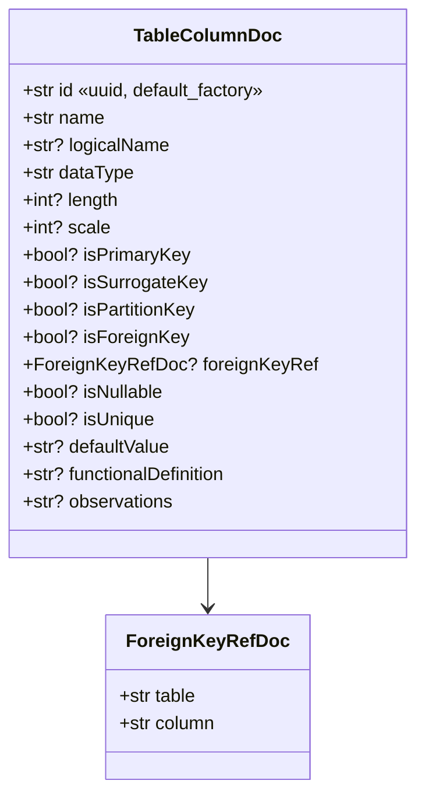
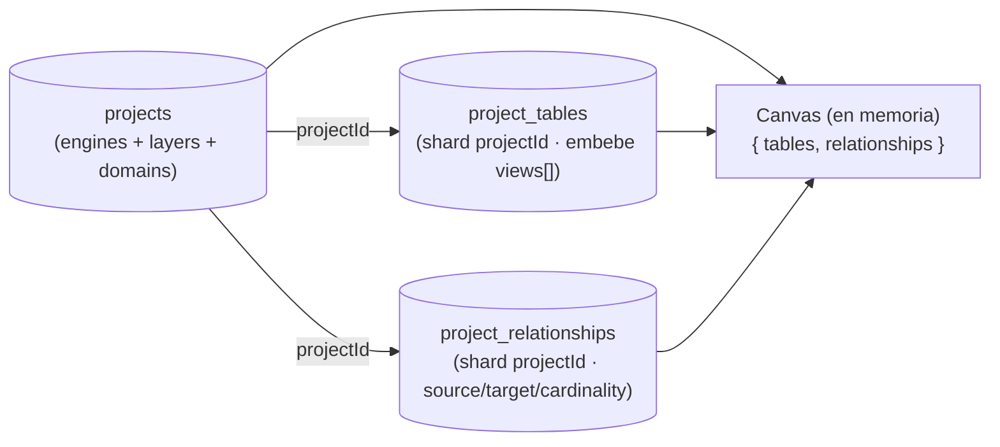

# Schemas (Pydantic v2)

> Los **modelos de persistencia** (Cosmos DB) viven por feature en
> `app/features/<x>/models.py`, espejo de las interfaces TypeScript del frontend
> (`web-data-model-hub/src/types/model.ts`). Los **DTOs HTTP** (request/response)
> viven en `app/features/<x>/schemas.py`.

Todos los modelos de persistencia usan `ConfigDict(extra="ignore",
populate_by_name=True)` (`app/core/models.py::DOC_CONFIG`):

- `extra="ignore"` — los campos internos de Mongo (`flgactive`, `deletedAt`,
  `_id`, `projectId` en los hijos) y campos legacy se ignoran al validar.
- `populate_by_name=True` — permite construir con el nombre Python *o* el alias
  JSON (necesario para `sql_schema` ↔ `"schema"`).

---

## 1. Jerarquía embebida en el proyecto (`app/features/projects/models.py`)

### 1.1 `ModelLevelDoc` — un "Modelo (nivel)"

```python
class ModelLevelDoc(BaseModel):
    id: str
    name: str                 # código corto, p. ej. "RDV"
    full: str | None = None   # nombre completo, p. ej. "Raw Data Vault"
    color: str | None = None
    order: int = 0            # posición izquierda→derecha en el canvas + adyacencia
    engine: str | None = None
    desc: str | None = None
```

`order` define las bandas del canvas y qué relaciones cuentan como "entre capas".

### 1.2 `DomainDoc` — un Dominio (producto de datos, vertical)

```python
class DomainDoc(BaseModel):
    id: str
    name: str
    color: str | None = None
    owner: str | None = None
    steward: str | None = None
    sensitivity: str | None = None   # 'Public'|'Internal'|'Confidential'|'Restricted'|'PII'
    description: str | None = None
    subdomains: list[str] = []       # etiquetas libres seleccionables en una tabla
    layers: list[str] = []           # ids de ModelLevel que el dominio atraviesa
```

`sensitivity` se guarda como `str` (no `Literal`) por resiliencia ante valores legacy.

### 1.3 `ProjectDoc` (colección `projects`)

```python
class ProjectDoc(BaseModel):
    id: str
    name: str
    description: str | None = None
    engines: list[str] = []          # engines del proyecto
    layers: list[ModelLevelDoc] = [] # niveles (RDV/UDV/DDV…)
    domains: list[DomainDoc] = []    # dominios verticales
    createdAt: str                   # ISO 8601
    updatedAt: str
```

`engines`, `layers` y `domains` son arreglos chicos **embebidos** (siempre se
leen con el proyecto). Se editan vía `PUT /api/projects/{id}`.

---

## 2. Canvas: tablas y relaciones (`app/features/canvas/models.py`)

### 2.1 `TagDoc` (`app/core/models.py`)

```python
class TagDoc(BaseModel):
    key: str = ""
    value: str = ""
```

Pares key-value libres. El validator `coerce_tags` convierte la forma legacy
`list[str]` a `{key: "", value: <str>}` para que docs antiguos carguen sin migración.

### 2.2 `TableColumnDoc`



> **Punto crítico**: `id` es un identificador **estable** que sobrevive a
> renames. Los endpoints de relación (`RelEndpointDoc.column`) apuntan a este
> `id`, **no a `name`**. `default_factory=lambda: str(uuid.uuid4())` garantiza id
> en código; `canvas/repository._ensure_column_ids` hace además un backfill
> defensivo sobre cualquier dict que llegue sin id.

### 2.3 `ViewDoc` (embebida en la tabla)

```python
class ViewDoc(BaseModel):
    id: str
    name: str
    type: str = "business"   # 'business' | 'technical'
    role: str | None = None
    select: str = ""         # multilínea: una expresión por línea (CONCAT, sha256, CASE…)
    where: str = ""          # multilínea: condiciones unidas con AND
```

Las vistas son proyecciones SQL por rol. **No están en una colección aparte**: se
embeben en `TableDoc.views[]`. No forman parte del diagrama ER; se exportan con el DDL.

### 2.4 `TableDoc` (colección `project_tables`)

```python
class TableDoc(BaseModel):
    id: str
    sql_schema: str | None = Field(default=None, alias="schema")  # la key Mongo es "schema"
    name: str
    logicalName: str | None = None
    layer: str | None = None        # id de ModelLevel (capa)
    domain: str | None = None       # id de Domain
    subdomain: str | None = None
    color: str | None = None        # heredado del dominio
    functionalDefinition: str | None = None
    applicationCode: str | None = None
    columns: list[TableColumnDoc] = []
    views: list[ViewDoc] = []
    tags: list[TagDoc] | None = None
    partition: PartitionSpecDoc | None = None
    position: NodePositionDoc | None = None
    # NOTA: `projectId` NO está en el schema — se inyecta/elimina al persistir.
```

`PartitionSpecDoc` lleva `strategy`, `columns`, `buckets`, `granularity`,
`clusteringColumns`. `NodePositionDoc` lleva solo `x: float, y: float` y se
escribe por el endpoint dedicado `PATCH /api/projects/{id}/positions`.

### 2.5 `RelationshipDoc` (colección `project_relationships`)

```python
class RelEndpointDoc(BaseModel):
    table: str     # TableDoc.id
    column: str    # TableColumnDoc.id

class RelationshipDoc(BaseModel):
    id: str
    source: RelEndpointDoc
    target: RelEndpointDoc
    cardinality: str = "1:N"   # '1:1' | '1:N' | 'N:N'
```

Forma **anidada** `source`/`target`. Puede cruzar capas y dominios; las banderas
`crossLayer`/`skip` se **derivan en el frontend** y **no se persisten**.



---

## 3. Schemas del Excel-import (`app/features/excel_import/schemas.py`)

Definen el contrato HTTP del preview. Usan `ConfigDict(extra="forbid",
populate_by_name=True)` — más estricto que los modelos de DB.

### 3.1 `PreviewColumn`

```python
class PreviewColumn(BaseModel):
    name: str
    dataType: str          # canónico (p. ej. "decimal", "varchar")
    rawDataType: str       # original tal como vino en el Excel
    length: int | None = None
    scale: int | None = None
    functionalDefinition: str | None = None
    typeConfidence: float            # 0-100
    typeMatchedVia: MatchKind        # "exact"|"alias"|"fuzzy"|"unknown"|"empty"
```

| `typeMatchedVia` | Cuándo | UI hint |
|---|---|---|
| `exact` | coincide literal con un canónico | sin badge |
| `alias` | sinónimo conocido (`int → integer`) | badge gris |
| `fuzzy` | rapidfuzz aceptó por similitud (`decximam → decimal`) | badge azul + `%` |
| `unknown` | nada superó el `FUZZY_THRESHOLD` | badge naranja (corregir) |
| `empty` | celda vacía; default a `varchar` | badge naranja |

### 3.2 `PreviewTable` y `ExcelPreview`

```python
class PreviewTable(BaseModel):
    sheetName: str
    schema_: str | None = Field(default=None, alias="schema")  # JSON: "schema"
    name: str
    description: str | None = None
    columns: list[PreviewColumn]

class ExcelPreview(BaseModel):
    tables: list[PreviewTable]
    tableDescriptionsFound: bool
    warnings: list[str]
```

`description` se popula desde la hoja opcional `TablesDescriptions`. `warnings`
lista avisos no fatales (hojas vacías, descripciones huérfanas).

---

## 4. Request/response schemas inline (por feature)

### `app/features/projects/schemas.py`

```python
class CreateProjectRequest(BaseModel):
    name: str
    description: str | None = None
    engines: list[str] | None = None
    layers: list[dict[str, Any]] | None = None    # ModelLevel[]
    domains: list[dict[str, Any]] | None = None   # Domain[]

class UpdateProjectRequest(BaseModel):  # todos opcionales
    name | description | engines | layers | domains
```

`layers`/`domains` se tipan como `list[dict]` y se validan con
`ProjectDoc.model_validate` en el service (deja que el frontend mande el JSON
completo de la jerarquía sin disparar 422 prematuros).

### `app/features/canvas/schemas.py`

```python
class CanvasReplaceRequest(BaseModel):
    tables: list[dict[str, Any]] | None = None
    relationships: list[dict[str, Any]] | None = None

class PositionPayload(BaseModel):
    x: float
    y: float

class PatchPositionsRequest(BaseModel):
    tables: dict[str, PositionPayload] | None = None   # tableId → {x, y}
```

`PUT /canvas` exige al menos uno de `tables` / `relationships` (400 si ambos son
`None`). La validación estricta la hacen `TableDoc` / `RelationshipDoc` dentro de
`replace_canvas`.

### `app/features/metadata/schemas.py`

`SemanticTypeBody` y `UdpBody` — DTOs del catálogo transversal (Semantic Types /
UDP). Lecturas y escrituras abiertas (MVP sin permisos).

### `app/features/health/router.py`

```python
class HealthResponse(BaseModel):
    status: str
    version: str
    db_connected: bool
```

---

## 5. Envelope de respuesta

Todos los endpoints CRUD usan `ok(...)` de `app/core/api/envelope.py`:

```python
def ok(data: Any = None) -> dict[str, Any]:
    return {"success": True, "data": data}
```

El frontend espera siempre `{success: bool, data?, error?}`. Los errores se
levantan con `HTTPException(status, detail)` (FastAPI → `{"detail": "..."}`).
