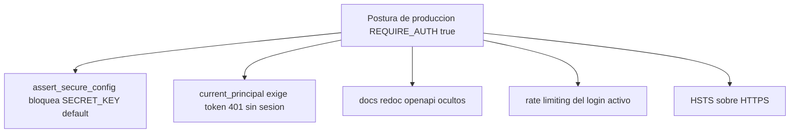
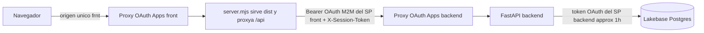
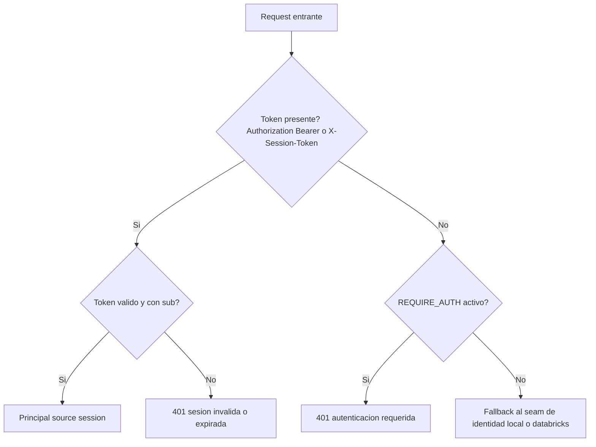
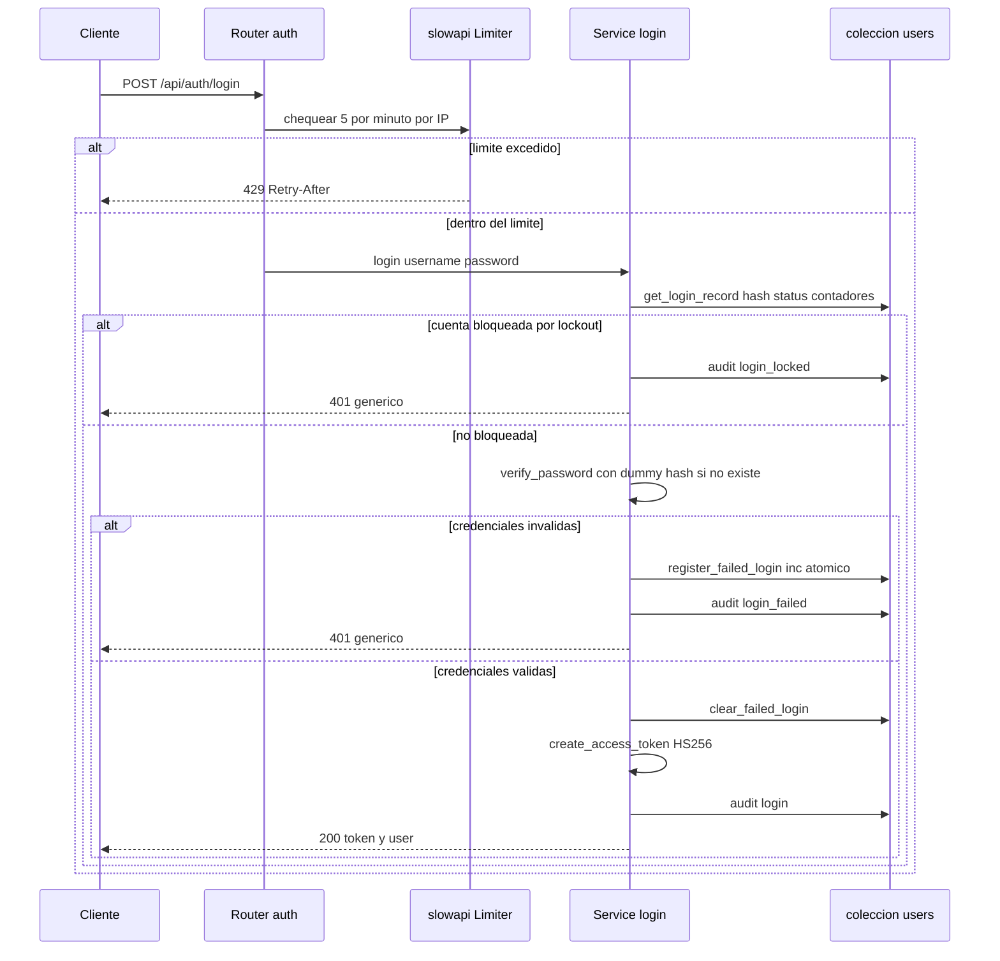
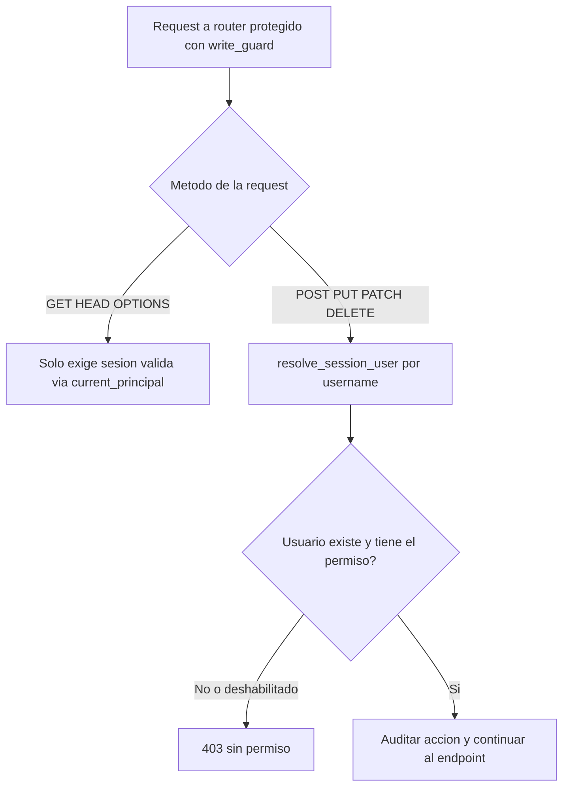

# Políticas de seguridad del backend — Data Model Hub

Este documento describe la postura de seguridad del backend de plataforma (`backend-data-model-hub`), construido con FastAPI sobre **Databricks Lakebase Postgres** (adaptador estilo Mongo en `app/core/db/lakebase/`). Cubre lo implementado desde el hardening del 2026-07-06 hasta el estado del **2026-07-31**: las capas de autenticación en Databricks Apps, autenticación con contraseña propia, firma de sesión con JWT, defensas contra fuerza bruta, cabeceras de seguridad, CORS y host allowlist, control de acceso basado en roles (RBAC), endurecimiento del motor de reporting frente a inyección, auditoría y cadena de suministro. Cierra con la tabla resumen de mitigaciones, el estado de lo pendiente y las consideraciones de despliegue.

La audiencia es doble: desarrolladores que mantienen el servicio y stakeholders técnicos que necesitan entender la postura de riesgo. Todo lo que sigue está verificado contra el código real; cuando el texto afirma "falla-cerrado" o "tiempo constante" es porque el código lo hace, no porque suene bien.

---

## 1. Principios de diseño

El backend adopta cuatro principios transversales que explican casi todas las decisiones concretas más abajo:

1. **Falla-cerrado en producción.** La postura de producción se activa con la variable `REQUIRE_AUTH=true`. Con ella, la app no arranca si sigue usando la clave de firma de desarrollo, exige login en toda request sin token, oculta la documentación interactiva y activa el rate limiting. Si algo no está bien configurado, el sistema prefiere no arrancar o rechazar antes que abrir un hueco.
2. **Identidad token-first.** La identidad del usuario sale del token de sesión firmado, no de cabeceras manipulables por el cliente. El token se lee de dos fuentes, en este orden: `Authorization: Bearer …` (desarrollo local, curl, tests) y `X-Session-Token` (producción en Databricks Apps, donde el proxy SSO de la plataforma consume el header `Authorization` para su propia sesión). En desarrollo local hay un fallback conmutable, pero en producción ese fallback está apagado.
3. **Superficie mínima.** CORS con allowlist explícita (sin comodines), métodos y cabeceras acotados, documentación oculta en producción, host allowlist opcional, y mensajes de error genéricos que no filtran stack traces.
4. **Defensa en profundidad.** El rate limiting por IP y el lockout por cuenta se complementan; el RBAC gatea a nivel de router y de endpoint; el motor de reporting valida el spec en varias capas aunque una sola bastaría.



---

## 1b. Capas de autenticación en producción (Databricks Apps)

Desde la migración al workspace corporativo (2026-07-27 → 07-31; detalle en los docs 35 y 36 de plan-implementacion/), el backend corre como Databricks App (`bknd-data-model-hub`) y la autenticación efectiva se compone de **tres capas independientes**, que conviene distinguir porque cada una falla y se diagnostica distinto:

1. **Muro SSO del proxy OAuth de Databricks Apps, POR app.** Cada app (front `frnt-…` y backend `bknd-…`) vive en su propio subdominio detrás de su propio proxy OAuth. Como `databricksapps.com` está en la **Public Suffix List**, la cookie de sesión del SSO es por app y no se comparte entre subdominios. Un `fetch()` del front hacia el subdominio del backend no puede completar ese SSO (el redirect cross-site a Microsoft es imposible dentro de XHR): el proxy del backend respondía su propio 401 (`{}`, 2 bytes, sin headers CORS) sin llegar jamás a FastAPI. La solución definitiva (2026-07-31) es el **server propio del front** (`server.mjs`, cero dependencias): sirve la SPA y **proxya `/api/*` al backend servidor-a-servidor** con un token OAuth **M2M del service principal del front**, de modo que el navegador habla con **un solo origen**. El grant `CAN_USE` del SP del front sobre la app backend lo **re-aplica CI tras cada deploy** (el bloque `permissions:` del bundle resetea la ACL en cada despliegue; un grant manual no sobrevive).
2. **Login propio de la plataforma.** Usuario/contraseña contra la colección `users` (bcrypt) más sesión como JWT HS256 (secciones 2.1–2.7). En producción el token de sesión viaja en el header **`X-Session-Token`**: el header `Authorization` que llega al backend es **el del proxy de Databricks** (su carril de auth programática lo consume/reemplaza), **no el del usuario** — el backend nunca debe derivar identidad de negocio de ese `Authorization`.
3. **Backend → Lakebase con service principal.** El pool de Postgres se autentica con un token OAuth (~1 h, auto-renovado) acuñado con el SP del backend. Los usuarios finales **jamás tocan la base de datos**: toda escritura pasa por el RBAC propio de la app.



---

## 2. Autenticación

La autenticación es propia: usuario y contraseña contra la colección `users` de la base de datos (Lakebase en producción), con el hash guardado por bcrypt y una sesión emitida como JWT firmado. No hay dependencia de un IdP externo para autenticar dentro de la app (el modo Databricks solo derivaría identidad de cabeceras SSO si se reactivara, pero hoy no se usa para autenticar); el SSO de Databricks Apps es una capa previa e independiente (sección 1b).

### 2.1 Hash de contraseñas: bcrypt en tiempo constante

El hashing vive en `app/core/security.py`. Se usa bcrypt con salt aleatorio embebido y comparación en tiempo constante:

```python
def hash_password(password: str) -> str:
    return bcrypt.hashpw(_clip(password), bcrypt.gensalt()).decode("utf-8")

def verify_password(password: str, hashed: str) -> bool:
    if not hashed:
        return False
    try:
        return bcrypt.checkpw(_clip(password), hashed.encode("utf-8"))
    except (ValueError, TypeError):
        return False
```

Detalles que importan:

- **Comparación en tiempo constante.** `bcrypt.checkpw` compara sin cortocircuitar por el primer byte distinto, lo que evita ataques de temporización sobre la comparación del hash.
- **Clip determinista a 72 bytes.** bcrypt trunca a 72 bytes; en vez de un truncamiento silencioso, `_clip` lo hace explícito y documentado (`password.encode("utf-8")[:72]`). El mismo texto produce siempre el mismo resultado de hash y de verificación.
- **Tolerancia a hashes inválidos.** Si el hash está vacío o corrupto (por ejemplo, un usuario legacy sin `passwordHash`), `verify_password` devuelve `False` en vez de lanzar una excepción que tumbaría el login.

### 2.2 Anti-enumeración por temporización: dummy hash

El servicio de login (`app/features/auth/service.py`) verifica **siempre** un hash bcrypt, aun cuando el usuario no exista, usando un hash señuelo calculado al importar el módulo:

```python
_DUMMY_HASH = hash_password("__no_such_user__")
```

En el login, si no hay registro para el usuario, se verifica la contraseña contra `_DUMMY_HASH`. Sin esto, un usuario inexistente respondería más rápido (no habría hash que verificar) y un atacante podría enumerar qué usuarios existen midiendo el tiempo de respuesta. Con el dummy, el costo de CPU es equivalente exista o no la cuenta.

Además, el lockout por intentos fallidos **solo** cuenta fallos de cuentas existentes y activas: no se crea documento para usuarios inexistentes, de modo que el lockout tampoco se convierte en un oráculo de existencia.

### 2.3 Sesión firmada: JWT HS256

El token de sesión es un JWT firmado con HMAC-SHA256 (`app/core/security.py`):

```python
def create_access_token(subject, *, extra=None, ttl_min=None, now=None) -> str:
    payload = {
        "sub": subject,                         # username
        "iat": int(now.timestamp()),
        "exp": int((now + timedelta(minutes=ttl)).timestamp()),
        **(extra or {}),                        # email, name, role
    }
    return jwt.encode(payload, settings.SECRET_KEY, algorithm="HS256")

def decode_access_token(token: str) -> dict | None:
    try:
        return jwt.decode(token, settings.SECRET_KEY, algorithms=["HS256"])
    except jwt.PyJWTError:
        return None
```

Propiedades de seguridad:

- **Algoritmo fijado en la validación.** `algorithms=["HS256"]` impide el ataque de confusión de algoritmos (por ejemplo, un token forjado con `alg=none` o intentos de degradación). El validador no acepta otro algoritmo.
- **Expiración obligatoria.** El TTL por defecto es 720 minutos (12 horas, una jornada de trabajo), configurable con `ACCESS_TOKEN_TTL_MIN`. `jwt.decode` valida `exp` automáticamente y devuelve `None` si expiró.
- **Nunca levanta.** `decode_access_token` atrapa todo error de PyJWT y devuelve `None`; es el caller quien decide el 401. Esto evita que un token malformado produzca un 500.
- **El `sub` es el username**, que a su vez es la clave del actor (`users._id`), lo que se compara contra `reviewers[]` y lo que audita cada acción.

Contenido típico del payload decodificado:

```json
{
  "sub": "ana.torres",
  "iat": 1751850000,
  "exp": 1751893200,
  "email": "ana.torres@empresa.com",
  "name": "Ana Torres",
  "role": "modelador"
}
```

### 2.4 Falla-cerrado en el arranque: `assert_secure_config`

La clave de firma tiene un default público **solo para desarrollo local** (`INSECURE_DEFAULT_SECRET_KEY = "dev-only-insecure-change-me-in-prod"`). Si en producción ese default sigue en uso, cualquiera podría forjar un JWT de administrador. Por eso `create_app()` llama a `assert_secure_config()` antes de construir la app (`app/core/config.py`):

```python
def assert_secure_config() -> None:
    using_default = settings.SECRET_KEY == INSECURE_DEFAULT_SECRET_KEY
    if using_default:
        if settings.REQUIRE_AUTH:
            raise RuntimeError(
                "SECRET_KEY inseguro con REQUIRE_AUTH=true: define SECRET_KEY "
                "(env/secreto) antes de desplegar — con el default público se "
                "pueden forjar tokens de sesión admin."
            )
        log.warning("SECRET_KEY usa el default de desarrollo (INSEGURO). ...")
```

Es decir: con `REQUIRE_AUTH=true` y la clave por defecto, la app **no arranca**. En desarrollo, aunque no bloquea, imprime una advertencia fuerte para que nadie lo olvide antes de desplegar.

### 2.5 Derivación de identidad: token-first, con fallback gateado

El seam de identidad (`app/core/identity/dependencies.py`) resuelve el usuario en sesión con la dependencia `current_principal`:

```python
def current_principal(request: Request) -> Principal:
    token = bearer_token(request)
    if token is not None:
        claims = decode_access_token(token)
        if claims and claims.get("sub"):
            return _principal_from_claims(claims)      # source="session"
        raise HTTPException(401, "Invalid or expired session. Sign in again.")
    if settings.REQUIRE_AUTH:
        raise HTTPException(401, "Authentication required. Sign in.")
    return get_identity_provider().principal_from_request(request)
```

`bearer_token` extrae el token de sesión de dos fuentes, en orden: (1) `Authorization: Bearer <token>` — dev local, curl, tests; (2) **`X-Session-Token: <token>` — producción en Databricks Apps**, porque el proxy SSO de la plataforma consume el header `Authorization` como su propio carril de auth programática y el backend jamás recibe el Bearer del front (verificado 2026-07-20: el navegador enviaba el token y FastAPI lo veía ausente). Por eso el front manda el JWT propio en un header dedicado.

Reglas:

- **Token presente y válido:** identidad `source="session"`, derivada de los claims firmados.
- **Token presente pero inválido o expirado:** siempre 401. No se cae al fallback, porque el cliente afirmó tener una sesión; degradar a un usuario anónimo sería un agujero.
- **Sin token y `REQUIRE_AUTH=true` (producción):** 401, login obligatorio.
- **Sin token y `REQUIRE_AUTH=false` (dev/tests):** fallback al seam de identidad (`AUTH_MODE`: usuario fake local, cabecera `X-Dev-User` para actuar como otro usuario en pruebas, o cabeceras OBO de Databricks). Esto permite desarrollar y correr tests que no montan DB sin exigir login.



### 2.6 Endpoints de auth

Definidos en `app/features/auth/router.py`:

| Método y ruta | Descripción | Respuesta |
|---|---|---|
| `POST /api/auth/login` | Login usuario/contraseña. Rate-limited `5/minute` por IP real. | `{token, user}` o 401 |
| `POST /api/auth/logout` | Cierra sesión (audita `logout`). | `{ok: true}` |
| `GET /api/auth/me` | Usuario en sesión enriquecido con rol y permisos efectivos. | usuario o Principal básico |
| `GET /api/auth/warmup/{next_b64}` | Warm-up SSO para Databricks Apps (doc 36): `next` viaja en el path como base64url y se valida contra el mismo allowlist de CORS (lista + regex, anti open-redirect). Quedó **inerte** en producción tras el proxy del front (sección 1b); útil solo en dev apuntando a otro backend. | 302 a `next` o 400 |

Ejemplo de login exitoso:

```bash
curl -sX POST https://data-model-hub.example/api/auth/login \
  -H "Content-Type: application/json" \
  -d '{"username":"ana.torres","password":"Contrasena-larga-2026"}'
```

```json
{
  "success": true,
  "data": {
    "token": "eyJhbGciOiJIUzI1NiIsInR5cCI6IkpXVCJ9.eyJzdWIiOiJhbmEudG9ycmVzIn0...",
    "user": {
      "username": "ana.torres",
      "email": "ana.torres@empresa.com",
      "name": "Ana Torres",
      "role": "modelador",
      "roleName": "Modelador",
      "permissions": { "model.view": true, "model.edit": true, "publish": false, "admin.manage": false },
      "accessLevel": "edit"
    }
  }
}
```

Nota importante: el objeto `user` **nunca** incluye `passwordHash`. El repositorio (`app/features/auth/repository.py`) solo lo lee en la ruta de login (`get_login_record`, con proyección explícita) y el conversor `_to_user` lo excluye de toda respuesta al cliente.

### 2.7 Flujo completo de login (con defensas)



---

## 3. Rate limiting del login

Contra fuerza bruta y credential stuffing, el login lleva un límite por IP con slowapi (`app/core/ratelimit.py` y el decorator en el router):

```python
# app/features/auth/router.py
@router.post("/login")
@limiter.limit("5/minute")   # anti fuerza bruta / credential stuffing (por IP)
async def login(request: Request, body: LoginBody): ...
```

```python
# app/core/ratelimit.py
_ENABLED = settings.REQUIRE_AUTH or os.getenv("RATE_LIMIT_ENABLED", "").lower() in ("1", "true", "yes")

def client_ip(request) -> str:
    xff = request.headers.get("x-forwarded-for", "")
    if xff:
        first = xff.split(",")[0].strip()
        if first:
            return first
    return get_remote_address(request)

limiter = Limiter(key_func=client_ip, headers_enabled=True, enabled=_ENABLED)
```

Características:

- **Clave = IP real del cliente (cambio 2026-07-31): la PRIMERA IP de `X-Forwarded-For`, con fallback al peer** (`get_remote_address`) cuando no hay header (dev local directo). En Databricks Apps el backend nunca ve al navegador: recibe del proxy de Databricks y, desde el doc 36, también del server del front. Con la key anterior por `request.client`, todos los usuarios compartían la IP del último salto y el límite de 5/min se volvía **global**: con usuarios en paralelo, los logins legítimos rebotaban en 429. La IP real viaja en `X-Forwarded-For` (el proxy de Databricks la pone; `server.mjs` la preserva).
- **Solo por-ruta, no global.** El canvas y el reporting disparan muchos requests legítimos; un límite global los frenaría. El límite estricto va donde importa: el login.
- **Gateado por postura.** Activo en producción (`REQUIRE_AUTH`) o cuando se fuerza con `RATE_LIMIT_ENABLED=true`. En dev y tests queda apagado por defecto para no frenar el harness (muchos logins desde localhost) ni el uso local.
- **Respuesta 429 con `Retry-After`.** El handler `_rate_limit_exceeded_handler` se registra en `main.py`; con `headers_enabled=True` se agregan las cabeceras de límite.

Ejemplo de respuesta al sexto intento dentro del minuto:

```
HTTP/1.1 429 Too Many Requests
Retry-After: 47
X-RateLimit-Limit: 5
X-RateLimit-Remaining: 0
```

**Limitación conocida:** el estado del limiter es en memoria por proceso. En un despliegue multi-réplica, cada instancia cuenta por separado y el límite efectivo se multiplica por el número de réplicas. Ver la sección de pendientes (Redis).

---

## 4. Lockout por intentos fallidos

Complementando el rate limiting por IP (que un atacante distribuido con muchas IPs podría sortear), hay un lockout por cuenta en `app/features/auth/service.py`:

```python
_LOCK_THRESHOLD = 8    # fallos consecutivos
_LOCK_MINUTES = 15     # duración del bloqueo
```

Comportamiento:

- Tras **8 fallos consecutivos**, la cuenta se bloquea **15 minutos**.
- El contador se incrementa de forma **atómica** con `$inc` (`register_failed_login` en el repositorio), evitando condiciones de carrera bajo requests concurrentes.
- Al alcanzar el umbral, se fija `lockedUntil` (ISO-8601 UTC). El login compara lexicográficamente contra `datetime.now(...).isoformat()`, correcto porque ambos usan el mismo formato.
- Un login exitoso **resetea** el contador y quita el bloqueo (`clear_failed_login`).
- Se auditan las tres situaciones: `login`, `login_failed`, `login_locked`.
- **Sin oráculo de existencia:** solo se registran fallos para cuentas existentes y no deshabilitadas. Un atacante no puede distinguir "usuario no existe" de "contraseña incorrecta" ni por temporización (dummy hash) ni por comportamiento de lockout.

Los campos de lockout (`failedAttempts`, `lockedUntil`) son internos: se leen con proyección explícita en `get_login_record` y **no** pasan por el modelo `UserDoc`, por lo que nunca se exponen al frontend.

---

## 5. Política de contraseñas

Definida en los DTOs del módulo Admin (`app/features/admin/schemas.py`):

```python
_PW_MIN, _PW_MAX = 10, 128

class UserCreate(BaseModel):
    ...
    password: str = Field(min_length=_PW_MIN, max_length=_PW_MAX)

class UserUpdate(BaseModel):
    ...
    password: str | None = Field(default=None, min_length=_PW_MIN, max_length=_PW_MAX)
```

- **Mínimo 10, máximo 128 caracteres.** El mínimo sube el costo de fuerza bruta; el máximo evita entradas absurdas y hace explícito el clip de bcrypt a 72 bytes.
- **Se valida al crear o cambiar,** no en el login. `LoginBody` no impone longitud, porque el login debe aceptar cualquier valor para poder verificarlo (si lo rechazara, filtraría información sobre la política a un atacante y rompería cuentas legacy).
- La validación ocurre en el borde (Pydantic), antes de llegar a la lógica de negocio.

---

## 6. Cabeceras de seguridad

Todas las respuestas pasan por el middleware de logging en `app/main.py`, que agrega cabeceras de defensa en profundidad:

| Cabecera | Valor | Propósito |
|---|---|---|
| `X-Content-Type-Options` | `nosniff` | Impide que el browser adivine el tipo MIME (anti MIME-sniffing). |
| `X-Frame-Options` | `DENY` | Bloquea el embebido en iframes (anti clickjacking). |
| `Referrer-Policy` | `no-referrer` | No filtra la URL de origen en navegaciones salientes. |
| `Permissions-Policy` | `geolocation=(), microphone=(), camera=()` | Desactiva APIs sensibles del browser. |
| `Strict-Transport-Security` | `max-age=31536000; includeSubDomains` | Fuerza HTTPS por un año. **Solo se envía sobre HTTPS.** |
| `X-Request-ID` | id de 12 hex | Correlación de logs para diagnóstico. |

Snippet relevante:

```python
response.headers["X-Content-Type-Options"] = "nosniff"
response.headers["X-Frame-Options"] = "DENY"
response.headers["Referrer-Policy"] = "no-referrer"
response.headers["Permissions-Policy"] = "geolocation=(), microphone=(), camera=()"
if request.url.scheme == "https" or request.headers.get("x-forwarded-proto") == "https":
    response.headers["Strict-Transport-Security"] = "max-age=31536000; includeSubDomains"
```

HSTS solo se emite sobre HTTPS para no romper el desarrollo local en HTTP. Detrás del proxy de Databricks Apps, el esquema real se detecta por `X-Forwarded-Proto`.

---

## 7. CORS estricto

Configurado en `create_app()` (`app/main.py`) con allowlist explícita más regex, sin comodines:

```python
app.add_middleware(
    CORSMiddleware,
    allow_origins=settings.CORS_ORIGINS,
    allow_origin_regex=settings.CORS_ORIGIN_REGEX or None,
    allow_credentials=True,
    allow_methods=["GET", "POST", "PUT", "PATCH", "DELETE", "OPTIONS"],
    allow_headers=[
        "Authorization",
        "Content-Type",
        "X-Requested-With",
        "X-Dev-User",
        "X-Session-Token",
    ],
    max_age=600,
)
```

Decisiones:

- **Allowlist + regex.** `CORS_ORIGINS` (lista exacta separada por comas; su default de localhost:3000 SOLO aplica si tampoco hay regex — en producción la regex sola no abre localhost) y `CORS_ORIGIN_REGEX`. En el bundle corporativo el default de la variable es `https://frnt-data-model-hub-.*\.databricksapps\.com`: el mismo bundle sirve en cualquier workspace de Databricks Apps sin editar orígenes por entorno. Nunca comodines.
- **`allow_credentials=True` (cambio respecto de 2026-07-06).** La auth propia sigue siendo token-first (sin cookies propias), pero en Databricks Apps el `fetch` del front lleva la cookie de sesión del **proxy SSO** de la app backend (`credentials: 'include'`). Con `False`, el navegador bloqueaba el preflight y el POST de login ni se enviaba ("CORS error", visto 2026-07-20 en Apps). Es seguro porque los orígenes están acotados (lista/regex, jamás wildcard) y la identidad de negocio sale SOLO del token firmado.
- **Métodos y cabeceras acotados** en vez de `*`. Se suman dos headers al trío original: `X-Dev-User` (seam de identidad de desarrollo; permitirlo en CORS no autentica nada — con `REQUIRE_AUTH` se ignora — pero evita que un front que lo mande muera en el preflight) y `X-Session-Token` (el carril del token de sesión propio en producción, sección 2.5).
- **En producción CORS casi no interviene.** Con el proxy del front (doc 36) el tráfico real llega **mismo-origen**: el navegador solo habla con `frnt-…` y el server del front llama al backend servidor-a-servidor. La política CORS queda como defensa en profundidad para accesos directos al subdominio del backend.

Nota sobre errores: el handler global de `Exception` corre en el middleware más externo (`ServerErrorMiddleware`), **fuera** de `CORSMiddleware`. Por eso, en un 500, el backend re-agrega manualmente `Access-Control-Allow-Origin` (solo si el `Origin` matchea la lista o la regex, con `re.fullmatch` igual que Starlette) para que el frontend pueda leer el envelope de error en vez de un opaco "Failed to fetch". Es una excepción controlada que **no** amplía la política CORS: valida el origen contra las mismas reglas.

---

## 8. TrustedHost y documentación oculta en producción

### 8.1 Host allowlist

Si `ALLOWED_HOSTS` está definido (producción), se monta `TrustedHostMiddleware`, que rechaza requests cuyo header `Host` no esté en la lista, mitigando ataques de Host header:

```python
allowed_hosts = [h.strip() for h in os.getenv("ALLOWED_HOSTS", "").split(",") if h.strip()]
if allowed_hosts:
    app.add_middleware(TrustedHostMiddleware, allowed_hosts=allowed_hosts)
```

En desarrollo, sin la variable, no se monta (no molesta al trabajo local).

### 8.2 Documentación oculta

En postura de producción (`REQUIRE_AUTH`), la documentación interactiva y el schema OpenAPI se desactivan para reducir fingerprinting y superficie de ataque:

```python
app = FastAPI(
    ...
    docs_url=None if settings.REQUIRE_AUTH else "/docs",
    redoc_url=None if settings.REQUIRE_AUTH else "/redoc",
    openapi_url=None if settings.REQUIRE_AUTH else "/openapi.json",
)
```

En dev siguen disponibles en `/docs`, `/redoc` y `/openapi.json`.

---

## 9. Control de acceso basado en roles (RBAC)

El modelo de permisos es data-driven: los roles y su matriz de permisos viven en la colección `roles` de la base de datos y se editan desde el módulo Admin. No hay permisos hardcodeados en el flujo de negocio.

### 9.1 Catálogo de permisos

Definido en `app/features/auth/models.py`:

```python
PERMISSIONS = (
    "model.view",       # Ver modelo / Canvas
    "model.edit",       # Crear / editar tablas (working copy)
    "review.decide",    # Aprobar / rechazar solicitudes
    "publish",          # Publicar a producción
    "rollback",         # Revertir a una versión publicada (Model + Data Standards)
    "export",           # Exportar DDL / metadata
    "standards.edit",   # Editar Data Standards (UDP / Parent Domains)
    "admin.manage",     # Administrar usuarios y permisos
)
```

Los permisos efectivos de un usuario se derivan de su rol de forma pura y **filtrando keys desconocidas** (`effective_permissions`): cualquier permiso que el rol no declare queda en `False`, y cualquier key fuera del catálogo se descarta. Un usuario sin rol (o con rol vacío) no tiene ningún permiso.

Dos permisos tienen gates puntuales que conviene conocer:

- **`rollback`** (permiso propio desde el doc 27, 2026-07-19; separado de `review.decide` y de `standards.edit`): gatea `POST /api/changesets/{cs_id}/rollback` (crea un draft inverso que restaura el modelo a esa versión, deshaciendo las posteriores) y `POST /api/standards/rollback` (restaura una versión de Data Standards por `targetSeq`). Revertir producción es una acción distinta de aprobar o de editar estándares, y su blast radius amerita asignación separada en la matriz.
- **`export`**: gatea `POST /api/ddl-rules/render` (el motor de reglas del Export DDL, doc 30) — el único endpoint del router `ddl_rules` que no es de lectura/cómputo con sesión.

### 9.2 Dos dependencias de autorización

En `app/features/auth/deps.py`:

- **`require_permission(perm)`** — exige el permiso siempre, sin importar el método. Se usa para endpoints que en su totalidad requieren un permiso: todo el módulo Admin usa `require_permission("admin.manage")`, y las acciones de governance van por-endpoint (`model.edit` para crear/editar changesets, `review.decide` para decidir, `rollback` para revertir, `standards.edit` para `POST /api/standards/apply`, `export` para `POST /api/ddl-rules/render`).
- **`write_guard(perm)`** — dependency de router que gatea por método: lecturas (`GET`/`HEAD`/`OPTIONS`) solo exigen sesión válida; escrituras (`POST`/`PUT`/`PATCH`/`DELETE`) exigen el permiso **y auditan la acción**. Se monta con `dependencies=[Depends(write_guard(...))]` para cerrar de una todos los endpoints directos de un router (catalog, projects, folders, schemas, relationships y views con `model.edit`; domains y settings con `standards.edit`). Esto cerró un hueco: antes había routers cuyos endpoints directos no tenían ninguna dependencia de auth y aceptaban requests anónimos.

Esa es la convención del backend: **`write_guard` a nivel router para los CRUD de entidades (GET = sesión, escritura = permiso + auditoría); `require_permission` por endpoint para las acciones que siempre exigen permiso**.

```python
def write_guard(perm: str):
    async def _dep(request: Request, principal: Principal = Depends(current_principal)):
        if request.method in ("GET", "HEAD", "OPTIONS"):
            return None
        user = await service.resolve_session_user(principal.username)
        if user is None or not user["permissions"].get(perm):
            raise HTTPException(403, f"You don't have permission for this action ({perm}).")
        # Auditoría de la acción (best-effort, salta los guardados ruidosos)
        path = request.url.path
        if not any(path.endswith(sfx) for sfx in _NO_AUDIT):   # /layout, /drawings, /tables, /udp
            await audit(user["username"], f"{request.method.lower()} {path}", target_type="api")
        return user
    return _dep
```

En ambos casos, el 401 (sin sesión) lo levanta antes `current_principal`; el 403 (con sesión pero sin permiso, o usuario deshabilitado) lo levanta la dependency. Deshabilitar un usuario en Admin revoca su sesión activa en estos endpoints, porque `resolve_session_user` devuelve `None` para cuentas `disabled`.



### 9.3 Nadie se auto-otorga admin

Todo el router de Admin (`app/features/admin/router.py`) exige `admin.manage`:

```python
_admin = require_permission("admin.manage")

@router.put("/roles/{key}")
async def upsert_role(key: str, body: RoleBody, user: dict = Depends(_admin)): ...
```

Como editar la matriz de permisos (`upsert_role`) también requiere `admin.manage`, **un usuario sin admin no puede modificar ningún rol**, y por lo tanto no puede otorgarse a sí mismo `admin.manage`. Además:

- **Sanitización de la matriz:** `sanitize_permissions` coacciona a bool y descarta keys fuera del catálogo, así que no se persisten permisos arbitrarios inventados por el cliente.
- **Invariante "nunca sin administrador":** el guard `_survives_admin` verifica, ante cada cambio de rol, deshabilitación, borrado de usuario, edición de la matriz o borrado de rol, que quede al menos un administrador activo. Si el cambio dejaría el sistema sin ningún admin, se rechaza con 400 (`AdminGuardError`), por ejemplo "Ese cambio dejaría el sistema sin ningún administrador."
- **Sin mass assignment de propietario:** en los reportes guardados, el `owner` se fija server-side desde el principal, no desde el body del cliente.

---

## 10. Endurecimiento del motor de reporting frente a inyección

El motor de reporting traduce consultas del cliente (`QuerySpec` o SQL de texto) a agregaciones de Mongo sobre colecciones de gran volumen (cientos de miles de documentos). Como el cliente influye en lo que llega al `$match`, se endurecieron los puntos donde un valor podía convertirse en un operador de Mongo o en una expresión regular maliciosa.

### 10.1 Postura de base (ya sólida)

- El cliente **nunca** manda paths de Mongo: cada `field` pasa por el allowlist del Field Catalog.
- Las operaciones son un enum cerrado, forzado doblemente (Pydantic `Literal` + `OPS_BY_TYPE`).
- El `QuerySpec` usa `extra="forbid"` (rechaza campos desconocidos).
- El parser de SQL es un allowlist sobre sqlglot: rechaza `JOIN`, subqueries y DDL.
- Los operadores `contains`/`startsWith` ya usaban `re.escape`.

### 10.2 `/facets`: `re.escape` + cap de longitud

El endpoint `/api/reporting/facets` alimenta el typeahead de filtros y no requiere autenticación (como el resto del reporting de solo lectura). Un `q` sin escapar iría directo a un `$regex`, habilitando ReDoS o inyección de regex. La corrección (`app/features/reporting/query/router.py`):

```python
async def facets(field: str, from_: str = Query(default="columns", alias="from"),
                 q: str | None = Query(default=None, max_length=80),
                 limit: int = Query(default=50, ge=1, le=200)):
    ...
    if q:
        query["name"] = {"$regex": re.escape(q), "$options": "i"}  # escapado: sin ReDoS/inyección
    ...
    if q:
        match[fd.path] = {"$regex": re.escape(q), "$options": "i"}  # escapado: sin ReDoS/inyección
```

`q` se limita a 80 caracteres y se escapa siempre. Verificado en vivo: un patrón malicioso como `((a+)+)+$` responde en 0.36 s (escapado, tratado como texto literal) en lugar de colgar el proceso.

### 10.3 Cursor keyset validado contra inyección de operadores NoSQL

La paginación keyset codifica el cursor como base64 de un JSON que el cliente devuelve y que va **directo al `$match`**. Si el valor de orden fuese un dict o una lista, un atacante inyectaría operadores de Mongo: `{"$ne": null}` bypassearía el keyset, `{"$regex": "(a+)+$"}` provocaría ReDoS. La validación (`app/features/reporting/query/executor.py`):

```python
def _decode_cursor(cur: str):
    try:
        v = json.loads(base64.urlsafe_b64decode(cur.encode()).decode())
    except Exception:
        raise QueryError("Cursor inválido", code=400)
    # Solo escalares para el valor y string para el _id
    if (not isinstance(v, list) or len(v) != 2
            or isinstance(v[0], (dict, list)) or not isinstance(v[1], str)):
        raise QueryError("Cursor inválido", code=400)
    return v
```

Cubierto por `tests/features/reporting/test_query_security.py`, que verifica explícitamente el rechazo de `[{"$ne": None}, "id"]` y `[{"$regex": "(a+)+$"}, "id"]`, además de cursores malformados.

### 10.4 `re.escape` del abbrev del glosario (ReDoS de segundo orden)

En `glossary_usage` (`app/features/reporting/views.py`), la abreviatura del glosario proviene de datos almacenados y se usa en un `$regex` para contar coincidencias en `physicalName`. Sin escapar, un abbrev con metacaracteres sería un ReDoS de segundo orden (el payload malicioso entra por otra ruta y detona al reportar):

```python
{**ACTIVE, "physicalName": {"$regex": f"(^|_){re.escape(ab)}(_|$)"}}
```

### 10.5 Spec guardado validado como `QuerySpec`

Al persistir un reporte guardado, el spec se valida como `QuerySpec` antes de escribirlo, para no almacenar blobs arbitrarios (defensa en profundidad, aunque `/query` re-valide al ejecutar):

```python
def _validate_report_spec(spec: dict) -> None:
    try:
        QuerySpec.model_validate(spec)
    except ValidationError as e:
        raise HTTPException(422, "El spec del reporte no es una consulta válida.") from e
```

**Nota de superficie:** las lecturas de reporting (`/query`, `/facets`, `/export`, `/insights`) siguen sin dependencia de `current_principal` (abiertas a nivel de la app). En el despliegue corporativo quedan detrás del muro SSO del proxy de Databricks Apps (sección 1b: solo identidades del workspace con `CAN_USE` llegan a la app), pero reforzarlas con `current_principal` explícito sigue listado en pendientes para reducir la superficie de DoS.

---

## 11. Auditoría

La auditoría (`app/core/audit.py`) es un log append-only en la colección `audit_log`, con la firma `{at, actor, action, target?, targetType?, meta?}`. Es **best-effort**: nunca hace fallar la request que la invoca, porque un fallo al escribir el log no debe tumbar una operación de negocio.

```python
async def audit(actor, action, *, target=None, target_type=None, meta=None) -> None:
    entry = {"at": datetime.now(timezone.utc).isoformat(), "actor": actor, "action": action}
    ...
    try:
        db = await get_db()
        await db["audit_log"].insert_one(entry)
    except Exception:  # la auditoría nunca rompe el flujo
        log.warning("audit write failed", extra={"action": action, "actor": actor})
```

Qué se audita:

- **Eventos de sesión:** `login`, `login_failed`, `login_locked`, `logout`.
- **Acciones de escritura** vía `write_guard`: `POST/PUT/PATCH/DELETE <ruta>` con actor. Se saltan los guardados de alta frecuencia del canvas (`/layout`, `/drawings`, `/tables`) para no inundar el log, y `/udp` porque su service ya audita con verbo específico (`canvas.udp.update`).
- **Eventos de negocio con verbo propio** (todos verificados en código al 2026-07-31):
  - Ciclo de vida de versiones: `changeset.submit`, `changeset.decide`, `changeset.withdraw`, `changeset.reopen`, `changeset.rollback_draft`, `changeset.schema_rename`, `changeset.schema_delete`.
  - Data Standards: `standards.apply`, `standards.rollback`.
  - Export DDL con reglas (doc 30): `ddl.export_render` — cada `POST /api/ddl-rules/render` deja actor, versión del ruleset aplicada y conteos.
  - Glosario: `glossary.lock` / `glossary.unlock`.
  - Canvas: `canvas.udp.update`.
- **Operaciones de Admin:** `admin.user.create`, `admin.user.update`, `admin.user.delete`, `admin.role.update`, `admin.role.delete`.

La lectura del log está protegida: `GET /api/admin/audit` exige `admin.manage`. Además de auditoría, todas las requests llevan un `X-Request-ID` correlacionado en los logs estructurados de entrada y salida, útil para el diagnóstico ("Check the logs using the X-Request-ID" es lo que devuelve el envelope de error 500).

---

## 12. Tabla resumen de mitigaciones implementadas

| # | Mitigación | Archivos clave | Gateo |
|---|---|---|---|
| 1 | Hash bcrypt en tiempo constante + clip determinista a 72 bytes | `core/security.py` | Siempre |
| 2 | Dummy hash anti-enumeración por temporización | `features/auth/service.py` | Siempre |
| 3 | JWT HS256 con `algorithms` fijado y `exp` obligatorio | `core/security.py` | Siempre |
| 4 | `assert_secure_config` falla-cerrado con SECRET_KEY default | `core/config.py`, `main.py` | `REQUIRE_AUTH` |
| 5 | Identidad token-first; sin token y `REQUIRE_AUTH` → 401 | `core/identity/dependencies.py` | `REQUIRE_AUTH` |
| 6 | Rate limiting del login `5/minute` por IP real (1ª IP de `X-Forwarded-For`, fallback peer) → 429 | `core/ratelimit.py`, `features/auth/router.py`, `main.py` | `REQUIRE_AUTH` o `RATE_LIMIT_ENABLED` |
| 7 | Lockout por intentos fallidos (8 fallos → 15 min, `$inc` atómico) | `features/auth/service.py`, `repository.py` | Siempre |
| 8 | Política de contraseñas (min 10 / max 128) al crear o cambiar | `features/admin/schemas.py` | Siempre |
| 9 | Cabeceras de seguridad (nosniff, DENY, Referrer, Permissions, HSTS) | `main.py` | HSTS solo HTTPS |
| 10 | CORS estricto (allowlist + regex por variable, sin comodines; `allow_credentials=True` solo por la cookie del proxy SSO de Apps) | `main.py` | Siempre |
| 11 | TrustedHost (host allowlist) | `main.py` | `ALLOWED_HOSTS` |
| 12 | `/docs`, `/redoc`, `/openapi.json` ocultos en producción | `main.py` | `REQUIRE_AUTH` |
| 13 | RBAC: `require_permission` + `write_guard` (gateo por método) | `features/auth/deps.py` | Siempre |
| 14 | Nadie se auto-otorga admin + invariante "nunca sin administrador" | `features/admin/router.py`, `service.py` | Siempre |
| 15 | `/facets` con `re.escape` + cap de longitud (ReDoS/regex-injection) | `features/reporting/query/router.py` | Siempre |
| 16 | Validación del cursor keyset (anti operator-injection NoSQL) | `features/reporting/query/executor.py` | Siempre |
| 17 | `re.escape` del abbrev del glosario (ReDoS de 2° orden) | `features/reporting/views.py` | Siempre |
| 18 | Spec guardado validado como `QuerySpec` | `features/reporting/query/router.py` | Siempre |
| 19 | Envelope de error genérico (sin stack trace al cliente) | `main.py` | Siempre |
| 20 | Auditoría append-only best-effort | `core/audit.py` | Siempre |

---

## 13. Estado PENDIENTE (fase siguiente)

Los siguientes puntos están identificados pero **no** implementados todavía:

| Pendiente | Severidad | Descripción |
|---|---|---|
| **Revocación de JWT** | Alta | El TTL de 12 h sin denylist implica que deshabilitar un usuario no corta su sesión hasta 12 h en endpoints que solo dependen de `current_principal` (los que usan `resolve_session_user`, como Admin y `write_guard`, sí lo cortan de inmediato). Opciones: bajar el TTL a 15-30 min con refresh revocable, agregar `tokenVersion` por usuario, o revalidar `status != disabled` contra la DB en cada request. |
| **Rate limiting con Redis** | Media | El estado del limiter es en memoria por proceso. Para multi-réplica (Databricks Apps con varias instancias) migrar a un backend Redis (`Limiter(storage_uri="redis://…")` o `fastapi-limiter`); si no, cada réplica cuenta por separado y el límite efectivo se multiplica por el número de réplicas. La key por IP real (1ª de `X-Forwarded-For`, 2026-07-31) ya quedó resuelta. |
| **Retiro del rol `databricks_superuser` al SP del front en Lakebase** | Media | El server del front jamás toca la base de datos (solo proxya `/api` al backend); su service principal no necesita ningún rol de Postgres. Revocárselo (mínimo privilegio). El SP del backend sí lo requiere — o, mejor, GRANTs granulares sobre el schema `dmh` (doc 35). |
| **Contraseñas filtradas** | Media | Sumar verificación contra brechas conocidas (HIBP con k-anonymity) o fuerza (zxcvbn) además del mínimo de longitud. |
| **Claims `iss` / `aud` en el JWT** | Baja | Agregar emisor y audiencia acota el uso del token a este servicio. |
| **Migrar bcrypt → argon2id** | Baja | Elimina el clip a 72 bytes y moderniza el algoritmo de derivación. |
| **Auth explícita en lecturas de reporting** | Media | `/query`, `/facets`, `/export` e `/insights` siguen sin `current_principal`; gatearlas reduce la superficie de DoS sobre las colecciones de gran volumen (hoy quedan protegidas solo por el muro SSO del proxy de Databricks Apps en producción). |

---

## 14. Despliegue: dónde corre, variables, base de datos y cadena de suministro

### 14.1 Dónde corre

El backend es una app FastAPI (ASGI) desplegada como **Databricks App** (`bknd-data-model-hub`) vía asset bundle (`databricks.yml` + GitHub Actions); el comando de la app es `uvicorn app.main:app` (host/puerto los inyecta el runtime de Apps). Corre detrás del proxy OAuth de la plataforma (capa 1 de la sección 1b), que termina TLS y reenvía `X-Forwarded-Proto` (el middleware lo usa para decidir HSTS) y `X-Forwarded-For` (key del rate limiting). El navegador no le habla directo: el tráfico de usuarios entra por el server del front, que proxya `/api` servidor-a-servidor.

La postura de producción se activa con `REQUIRE_AUTH=true` en el env del bundle: login propio obligatorio, `/docs`, `/redoc` y `/openapi.json` ocultos, rate limiting activo, y **fail-closed de `assert_secure_config`** — si el `SECRET_KEY` sigue siendo el default de desarrollo, la app no arranca. El `if __name__ == "__main__"` de `main.py` es solo para desarrollo local.

### 14.2 Base de datos

La persistencia productiva es **Databricks Lakebase Postgres** (doc 28), accedida por el adaptador estilo Mongo de `app/core/db/lakebase/` (cada "colección" es una tabla `(id, doc jsonb)` en el schema `dmh`). Consideraciones de seguridad:

- **Sin secretos de base de datos estáticos.** El bundle no lleva PAT ni cadena de conexión: el pool se autentica con un **token OAuth de ~1 h que la app acuña sola** con el service principal que Apps inyecta (`DATABRICKS_CLIENT_ID/SECRET`, OAuth M2M) y renueva con caché thread-safe de 50 minutos. El rol de Postgres es el client-id del SP (alta one-time por workspace, doc 35).
- **Los usuarios finales jamás tocan la base** (capa 3 de la sección 1b): toda operación pasa por el RBAC de la app.
- **Índices**: `ensure_indexes()` corre en el `lifespan` al arrancar (idempotente, ~35 índices sobre los campos de filtro y orden del reporting y la governance).
- **Borrado lógico.** Los documentos usan `flgactive`; los filtros incluyen `{"flgactive": {"$ne": False}}` para excluir los borrados. La conexión se abre y cierra en el `lifespan` de FastAPI (con reintento en background si la BD no estaba disponible al arrancar).
- **Sin rollback a Cosmos.** El camino a Azure Cosmos DB (driver `motor`, el switch `DB_BACKEND` y las variables `COSMOS_*`) se retiró por completo del código y del deploy; Lakebase es la única BD.

### 14.3 Variables de entorno (estado corporativo 2026-07-31)

| Variable | Propósito | Producción (`app.yaml`) |
|---|---|---|
| `LAKEBASE_ENDPOINT` | Ruta lógica del endpoint (`projects/…/branches/…/endpoints/…`); obligatoria. El host físico se resuelve solo vía SDK. | `app.yaml` (default `projects/dmh-proj/branches/production/endpoints/primary`) |
| `LAKEBASE_PGSCHEMA` | Schema PG de las colecciones. | `dmh` |
| `SECRET_KEY` | Clave HMAC para firmar el JWT de sesión. **La app no arranca con el default si `REQUIRE_AUTH=true`.** | Secreto `session-secret-key` del scope `kv-scope-datacraft`, inyectado con `value_from` (nunca en texto plano en el bundle ni en GitHub) |
| `REQUIRE_AUTH` | `true` activa la postura de producción (login obligatorio, docs ocultos, rate limit, falla-cerrado). | `true` |
| `CORS_ORIGIN_REGEX` | Regex de orígenes del front. | Variable del bundle (default `https://frnt-data-model-hub-.*\.databricksapps\.com`) |
| `CORS_ORIGINS` | Orígenes exactos adicionales (el default localhost SOLO aplica sin regex). | No se define |
| `ALLOWED_HOSTS` | Lista de hosts para `TrustedHostMiddleware` (vacío = deshabilitado). | Opcional |
| `ACCESS_TOKEN_TTL_MIN` | Vida del token en minutos (default 720). Bajarlo mitiga la falta de revocación. | Opcional |
| `RATE_LIMIT_ENABLED` | Fuerza el rate limiting aun sin `REQUIRE_AUTH`. | Redundante si `REQUIRE_AUTH=true` |
| `AUTH_MODE` / `LOCAL_DEV_USER` / `LOCAL_DEV_USERNAME` / `LOCAL_DEV_DISPLAY_NAME` | Seam de identidad de desarrollo (fallback sin token). | No usar en prod |
| `DATABRICKS_HOST` / `DATABRICKS_TOKEN` | Solo dev local (PAT u OAuth U2M del SDK). En Apps el runtime inyecta `DATABRICKS_HOST` y `DATABRICKS_CLIENT_ID/SECRET`; **no hay PAT en el bundle**. | No se setean |

Extracto real del `databricks.yml` (la clave de firma nunca viaja en claro):

```yaml
config:
  command: ['uvicorn', 'app.main:app']
  env:
    - name: REQUIRE_AUTH
      value: 'true'
    - name: SECRET_KEY
      value_from: session_secret
resources:
  - name: session_secret
    secret:
      scope: ${var.secret_scope}        # kv-scope-datacraft
      key: ${var.session_secret_key}    # session-secret-key
      permission: READ
```

### 14.4 Cadena de suministro: dependencias pineadas

Política 2026-07-31 (decisión del owner, aplica a **ambos repos**): TODAS las dependencias van pineadas — `==` en `requirements.txt` del backend y versiones exactas (sin `^` ni `>=`) en el `package.json` del front. Motivo doble:

1. **La imagen base de Databricks Apps trae paquetes viejos pre-instalados** (fastapi/starlette/uvicorn); con rangos abiertos, pip los daría por satisfechos y la app correría combinaciones jamás testeadas.
2. **Reproducibilidad**: local, CI y Apps ejecutan exactamente las mismas versiones.

Las versiones pineadas son las del entorno validado (pytest verde + suite viva Lakebase + `pip check` limpio). Para subir una librería: cambiar el pin, correr pytest y `pip check`, y recién entonces commitear. `requirements-dev.txt` (pytest, httpx) mantiene rangos porque no va al runtime. Inventario exacto de versiones en el propio `requirements.txt` (por ejemplo `fastapi 0.136.1`, `bcrypt 5.0.0`, `pyjwt 2.12.1`, `slowapi 0.1.10`, `sqlglot 30.12.0`).

---

## 15. Checklist de verificación antes de desplegar

- [ ] `SECRET_KEY` definido con un valor aleatorio largo (no el default), vía el secreto `session-secret-key` del scope `kv-scope-datacraft` con `value_from` en el bundle. Con `REQUIRE_AUTH=true` la app se niega a arrancar si no.
- [ ] `REQUIRE_AUTH=true` para activar login obligatorio, docs ocultos y rate limiting.
- [ ] `CORS_ORIGIN_REGEX` (y/o `CORS_ORIGINS`) apuntando solo al frontend real (sin comodines).
- [ ] `ALLOWED_HOSTS` con los hosts públicos del servicio, si se usa TrustedHost.
- [ ] `LAKEBASE_ENDPOINT` apuntando al endpoint del workspace; sin PAT ni cadenas de conexión en el bundle (el token de BD lo acuña la app con su service principal).
- [ ] TLS terminado en el proxy y `X-Forwarded-Proto` / `X-Forwarded-For` reenviados (HSTS y key del rate limiting).
- [ ] `GET /api/health` responde `db_connected: true` tras el deploy (los índices los crea `ensure_indexes()` solo, en el arranque).
- [ ] El workflow re-aplicó el grant `CAN_USE` del SP del front sobre la app backend (paso automático de CI, doc 36 §6.3 — un grant manual no sobrevive al siguiente deploy).
- [ ] Al menos un usuario con rol que incluya `admin.manage` (el invariante impide quedarse sin administrador, pero hay que crear el primero — `scripts/create_admin.py`).

Verificado en vivo durante el hardening del 2026-07-06: las cabeceras de seguridad aparecen en toda respuesta; el sexto intento de login dentro del minuto devuelve 429; un regex malicioso en `/facets` responde escapado en 0.36 s sin ReDoS. La suite de tests (543 casos al 2026-07-31) cubre, entre otros, el lockout de login, la inyección del cursor keyset y la key por IP real del limiter.
