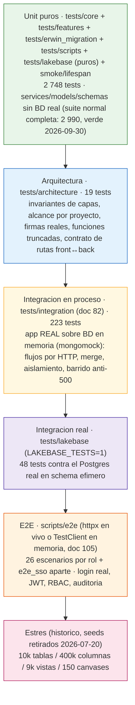
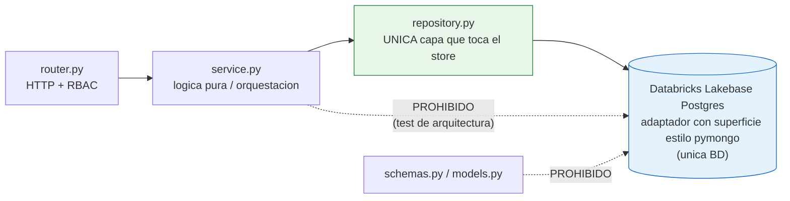
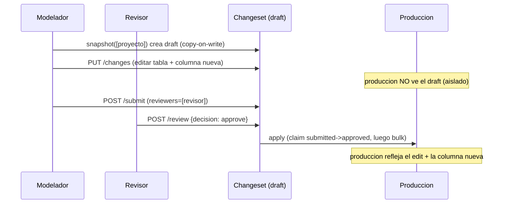
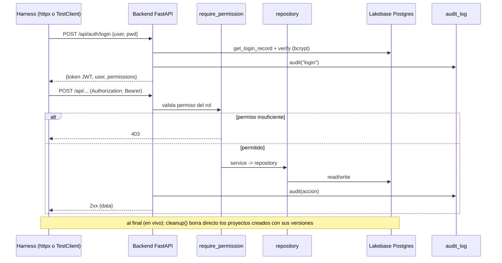
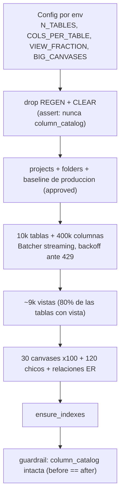
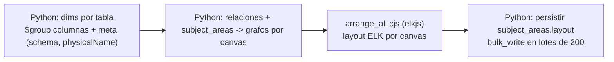

# Testing del backend — Data Model Hub

> **Actualizado: 2026-09-30** (doc 105: la suite E2E vuelve a estar al día y corre también en memoria dentro del `pytest` normal, más los tests de los hallazgos previos y de las revisiones independientes de sus arreglos (entre ellos, las rondas 3 a 7 del motor de consulta del Reporting, los valores de UDP por tipo —con su forma canónica y el default del perfil de carga—, los nombres legados y las tablas borradas en la app del kit Erwin) — §3.7, §5 y §6; conteo final del 2026-09-30, con el doc 106 (catálogo de tipos multimotor y export Oracle tal cual): suite normal **2 990 tests**, verde, más los **48** de la suite viva, skipped sin `LAKEBASE_TESTS`; `tests/architecture`, 19 passed). Antes, 2026-09-09 (doc 82): suite de integración en proceso sobre una BD en memoria + guardas de arquitectura — suite normal **1 294 tests**, verde.
>
> **Nota (2026-07-20):** los seeds y la prueba de estrés que se citan más abajo
> (`seed_modeler.py`, `seed_stress.py`, `seed_ddv_synthetic.py` y sus tests) se
> **retiraron** — el flujo vigente es únicamente XML → Lakebase
> (`scripts/README.md`). Esas secciones quedan como evidencia histórica de la
> validación a escala (resultados en `plan-implementacion/04-STRESS-TEST.md`).

Este documento describe la estrategia y la implementación completa de pruebas del backend `backend-data-model-hub` (FastAPI + Databricks Lakebase Postgres como **única** BD, vía un adaptador que emula la superficie de `pymongo` —`ReturnDocument`, `UpdateOne`, `DuplicateKeyError`— sin conectar a Mongo). Cubre las capas de verificación que sostienen el proyecto: pruebas unitarias puras por feature, pruebas de arquitectura que fuerzan invariantes de capas, una suite viva de integración del adaptador Lakebase contra el Postgres real, un harness E2E que ejercita el backend real por rol vía HTTP, y — como evidencia histórica — la prueba de estrés a escala real (10.000 tablas / 400.000 columnas). Todo el contenido está basado en el código real de `tests/`, `scripts/e2e/` y `scripts/arrange_all.py`.

---

## 1. Panorama general

El backend está organizado por features (`app/features/<feature>/{router,service,repository,schemas,models}.py`) sobre un núcleo compartido (`app/core/`). La estrategia de testing calca esa estructura: cada feature tiene su carpeta de tests, y las pruebas atacan preferentemente la lógica **pura** de `service.py` (sin base de datos) y los contratos de `models.py` / `schemas.py`.

La filosofía es una pirámide clásica:



Principios de diseño de las pruebas:

- **Unit puros con repositorios mockeados.** La lógica de negocio vive en funciones puras (`physicalize`, `overlay`, `structured_diff`, `table_rows`, `effective_permissions`, etc.) o en orquestadores async que se testean sustituyendo el `repository` por `AsyncMock` con `monkeypatch`. No se levanta ninguna base de datos.
- **Invariantes de capas verificados por código.** Los tests de arquitectura leen los archivos fuente y fallan si alguien filtra el store fuera de `repository.py`, si reaparecen árboles/features legacy o si vuelven los scripts backfill y las rutas retiradas en el doc 75 (`GET /api/me`, `logicalize`).
- **Alcance por proyecto (doc 75).** `tests/core/test_scope.py` fija el contrato de `app/core/scope.py` (`scoped`, `naming_id`, `assert_scoped_filter` → `MissingProjectError`); en `changesets`, `test_cross_project_guard.py` (referencias a entidades de otro proyecto → 409), `test_project_delete.py` (borrado por draft: `deletesProject`, cascada `cascade_delete`, 404/409 después) y `test_project_versions.py` (versiones y producción por proyecto); en `data_standards`, `test_copy_standards.py` (proyecto nuevo con `copyFrom`) y `test_scope_restore.py` (rollback acotado al proyecto); y `tests/lakebase/test_project_column.py` (puro, corre en la suite normal) cubre la traducción `projectId → project_id` del adaptador.
- **Integración en proceso (doc 82).** `tests/integration/` levanta la app FastAPI REAL (routers, RBAC, services, repositorios, guards de alcance) sobre `tests/support/fakedb.py`: `mongomock` con la fachada async del adaptador Lakebase (incluido el dialecto `$mergeObjects`). Cada request atraviesa el mismo código que en Databricks Apps; sólo el driver es falso. Es la capa que la suite unitaria (repos mockeados) no puede ver — donde vivieron los 500 del doc 80 (`TypeError`/`MissingProjectError` en líneas que ningún test ejecutaba con la firma real). Cubre el flujo completo de versionado por HTTP, el merge colaborativo, el aislamiento entre proyectos, un barrido de TODAS las rutas GET y las escrituras directas.
- **Guardas de firma y de contrato (docs 80/82).** `test_scoped_reads` (toda lectura de `published()` con alcance), `test_call_signatures` (toda llamada interna satisface la firma real), `test_function_bodies` (sin funciones truncadas ni código muerto tras `return`), `test_fake_signatures` (ningún fake de test congela una firma vieja) y `test_front_routes` (toda llamada del front hermano tiene ruta en el backend; se salta si el front no está al lado).
- **Integración real del adaptador.** La suite viva `tests/lakebase/test_adapter_live.py` (48 tests) pega al Postgres real de Lakebase en un schema efímero `dmh_test_<rand>` que se dropea al final; solo corre con `LAKEBASE_TESTS=1`, por eso no entra en el `pytest` normal.
- **E2E contra el backend real.** El harness loguea usuarios canónicos por rol, obtiene un JWT y ejercita el stack completo (RBAC → servicio → repositorio → Lakebase → auditoría), limpiando lo que crea. Desde el doc 105 (A2-o6) los mismos escenarios corren también EN MEMORIA —la app real sobre la BD falsa, con login real por rol— en cada `pytest` (`tests/scripts/test_e2e_inprocess.py`), y un barrido estático verifica que toda ruta que nombra la suite exista (`tests/scripts/test_e2e_routes.py`): la suite ya no puede volver a quedar desactualizada en silencio.
- **Estrés reproducible (histórico).** Un seed sintético insertaba cientos de miles de documentos en streaming para medir el comportamiento del reporting y del canvas a escala (retirado 2026-07-20; ver la nota de cabecera y la sección 7).

**Conteo confirmado (2026-09-30, doc 106):** `pytest tests/ --collect-only -q` (sin `LAKEBASE_TESTS`) recolecta **3 038** tests en 294 archivos; la suite normal corre **2 990** (verde: 2 990 passed en ~41 s; `tests/architecture` sola, 19 passed) y los **48** restantes son la suite viva del adaptador Lakebase, que sin `LAKEBASE_TESTS=1` sale como skipped. Desglose por área (conteo de pytest: cada caso parametrizado cuenta):

| Área | Archivos | Tests |
|------|---------:|------:|
| `tests/core` (config, ratelimit, índices, db, identidad, naming y nombres lógicos, versioning, facetas, **scope**, orden de display de columnas, tipos complejos, valores de UDP por tipo — doc 105; catálogo de tipos multimotor — doc 106) | 17 | 299 |
| `tests/architecture` (invariantes de capas, legado retirado, alcance, firmas, funciones truncadas, fakes, rutas front↔back, mensajes en inglés) | 8 | 19 |
| `tests/integration` (app real sobre BD en memoria: flujos por HTTP, merge, aislamiento, barrido anti-500, escrituras directas — doc 82; los hallazgos del doc 105 y sus revisiones: lápidas, guard de NUL y de surrogates sueltos, validación del naming, valores de UDP por tipo, nombres legados y el Undo) | 27 | 223 |
| `tests/features` (todas las features; incluye `bulk_upload`, docs 55/78/87/105, `health`, el repositorio de changesets contra la BD falsa y, doc 88, la cascada de membresía y el historial de solicitudes) | 206 | 2 165 |
| `tests/erwin_migration` (kit de migración multi-archivo, facetas, orden único, built-ins, frases de relación, fusión de canvases y, doc 105, lectura del naming y tablas borradas en la app) | 15 | 154 |
| `tests/scripts` (orquestadores: `run_migration` con convención + carriles, `create_admin`, `databricks/workdir`, semillas por proyecto —reglas DDL, perfiles de carga, plantillas—, `reset_for_migration`, `arrange_all`, la auditoría y, doc 105, la suite E2E en memoria + su barrido de rutas + su limpieza, y el reporte de incongruencias) | 15 | 108 |
| `tests/test_smoke.py` (app + health) + `tests/test_lifespan_doc105.py` (arranque real, doc 105) | 2 | 3 |
| `tests/lakebase` puros: `test_translate.py` + `test_project_column.py` + `test_adapter_bulk_doc105.py` (corren en la suite normal) | 3 | 19 |
| **Subtotal — suite normal** | **293** | **2 990** |
| `tests/lakebase/test_adapter_live.py` (suite viva, solo con `LAKEBASE_TESTS=1`) | 1 | 48 |
| **Total recolectado** | **294** | **3 038** |

La carga masiva desde Excel (`tests/features/bulk_upload/`, 33 archivos) sigue el patrón de la casa: `normalize`/`datatypes`/`parser`/`report`/`planner_*`/`policies`/`udp_facets` son puros (workbook YA interpretado por un perfil, armado a mano con `helpers.py`); doc 87 suma `planner_views` (vistas `_vu` normal + DAC, esquema `_vu`, columnas efectivas en orden de display, vista existente intacta, canvas) y `planner_upsert` (invariante: nunca `delete`, lo no mencionado no aparece), más el proyecto destino en `planner_structure` (`upload_targets` / `resolve_base_folder`), `service` y `router` (`GET …/uploads/targets`); los perfiles de carga (doc 78) prueban puro el modelo (`profiles_model`: catálogo + `validate_profile`), el built-in (`builtin_profile` contra el catálogo fijo de UDPs), `suggest`, `rules` y `profile_apply` (hojas, fila de cabecera, cabeceras, políticas), y con mocks el repositorio scoped (`profiles_repository`), el service (`profiles_service`: nombre único, 422, default único) y el router (`profiles_router`, con `project_client`); `loader`/`service` mockean los repositories y el `changesets.service` con `AsyncMock`, y `router` sobreescribe el permiso `model.edit` con `dependency_overrides`. Doc 105 (X1, `--workers 2`): `test_jobs.py` se reescribió porque los jobs pasaron a la BD (`upload_jobs` + `upload_job_bodies`) — cada `JobStore` del test es «un worker» que sólo comparte la BD: otro worker ve el job, su avance y su cuerpo; un job activo sin avance se informa fallido; el claim del apply es atómico y sólo desde `validated`; el descarte no corta un apply vivo pero sí uno muerto; desalojo y tope por usuario —; `test_service.py` suma el lock `uploadLock` de la versión con los jobs y la cabecera en una BD en memoria («otro worker» = sin las tasks locales): otro worker consulta y aplica y el lock se suelta (también si el apply falla), dos cargas a la vez en la misma versión → una espera, el mismo job aplicado dos veces a la vez escribe una sola, cada tanda es un latido, la carga cuyo proceso murió se informa y no traba la versión, y la carrera de otra carga que toma la versión entre la lectura y el claim; `test_planner_override_doc105.py` (11) fija que la re-carga idéntica de un físico que no sigue el naming quede «unchanged» y, desde la revisión R2, que el plan conserve el `physicalNameOverridden` del existente mientras el físico no cambie (`keep_override`; un update real con el físico igual al derivado ya no baja el override en silencio, y si el físico cambia se re-evalúa) sin que `changed_fields` esconda el flag. Revisión R1: `test_jobs_races_doc105.py` (11) intercala «el otro proceso» en la ventana leer → escribir del `JobStore` — el desalojo y el tope por usuario no borran un job que otro proceso reclamó en el medio (borran con el predicado en la misma sentencia; en un mismo desalojo se va el vencido y el reclamado conserva su cuerpo), descartar una validación que termina en el medio la borra y uno que otro proceso empieza a aplicar responde ocupado, y crear no deja un cuerpo ni un job huérfano si una de las dos escrituras falla (el job va antes que su cuerpo); ronda 3: un cuerpo cuyo borrado falló lo barre un desalojo posterior (`evict` barre los cuerpos sin job más viejos que STALE + TTL) y esa falla no tumba el POST de otro usuario —al crear, el desalojo es best-effort—, y el barrido no toca el cuerpo de un job vivo aunque sea viejo; ronda 4 (R8): el barrido se espacia —como mucho uno por intervalo en cada proceso, no en cada carga—. `test_planner_case_doc105.py` (23) fija la normalización del físico TIPEADO de columnas con el `case` del scope (`persisted_physical` / `requested_physical`, los mismos scopes que el changeset): un cambio sólo de mayúsculas queda «unchanged» y no toca el override, una columna nueva tipeada en minúsculas nace con la regla, la vista `_vu` referencia el físico que se graba, dos filas que se grabarían igual son duplicado en el archivo, camel con separadores calza con la columna ya normalizada (y la longitud se mide sobre el nombre que se graba), la re-carga idéntica —también de un nombre legado fuera de la regla— queda «unchanged» y las tablas conservan la grafía tipeada; desde la ronda 4 —como el changeset, que aplica la regla de case sólo a lo que se TIPEA o cambia—, un legado fuera de la regla que la fila repite tal cual (tipeado idéntico o calzado por lógico) queda tal cual aunque la fila traiga OTRO cambio: el payload lleva el nombre grabado, sin aviso de renombre, y conserva su override; un nombre tipeado que al grabarse chocaría sin mirar mayúsculas con otra columna es `duplicate-name` y el duplicado en el archivo se mide por el nombre que se graba; ronda 5 (R13): una fila SIN físico declarado no pide un nombre —la columna o la tabla legada conserva su grafía, como la misma edición desde la app—; el tope de longitud usa el mismo «grandfather» del changeset (`too_long` en `plan_tables.py`: compara casefold con el físico actual, para columnas y tablas) — un legado que sólo cambia de mayúsculas no se penaliza, una tabla legada larga renombrada así se graba y el reporte avisa el renombre, y una tabla nueva larga sigue siendo `name-too-long`. `test_planner_legacy_case_doc105.py` (10) lo recorre por el camino real (loader → `build_plan` → changeset → publish): desde la ronda 4, el legado que la fila repite tal cual —tipeado idéntico o calzado por lógico— se graba igual hasta publicar, sin aviso de renombre; un camel legado largo con otro cambio valida y se graba igual (el tope no penaliza lo heredado y el apply acepta lo que la validación aceptó); la vista `_vu` nueva referencia el físico grabado y las existentes siguen apuntando al legado; dos legadas que chocarían sin mirar mayúsculas, repetidas tal cual, se graban, mientras un nombre tipeado que al grabarse chocaría lo marca la validación (`duplicate-name`; el changeset daría 409); la carga Excel y la app dejan el mismo físico y el mismo override en el legado; ronda 5 (R13): sin físico declarado, el legado que difiere sólo en mayúsculas queda hasta publicar, y una fila cuya columna tiene un borrado pendiente en el draft se planea nueva y se graba como se planeó; `test_override_e2e_doc105.py` (6) recorre el camino real (loader con sus proyecciones → `build_plan` → changeset → publish): el override de tabla y columna y las facetas de la tabla sobreviven a una carga con un cambio real, la re-carga idéntica de una tabla existente queda «unchanged», la proyección de tablas del loader trae todos los campos de `CanonicalTableDoc`, y una columna que sólo difiere en mayúsculas no cambia nada de punta a punta. Ronda 5 (valores de UDP por tipo, `app/core/udp_values.py`): `test_udp_boolean_doc105.py` (4) —el default booleano de la definición (texto libre en Data Standards: «Sí», «yes»…) se escribe normalizado a «true»/«false», uno desconocido es `invalid-udp-value` como un valor fuera de la lista, la celda y el default del perfil siguen normalizándose y los defaults válidos de texto, número y fecha no cambian— y `test_udp_number_date_doc105.py` (29) —un número no finito («nan», «inf») o una fecha que no es ISO real son `invalid-udp-value` y el default inválido de la definición es un error de la fila; ronda 6: el número válido se graba en su forma canónica («10.50» → «10.5»), una fecha o fecha-hora ISO graba la fecha, el default válido del perfil se normaliza y el inválido da un error que dice que viene del perfil (una celda inválida no se le atribuye)—. Ronda 6: `test_profile_udp_default_doc105.py` (11, puro) fija que el perfil valida al guardarse el default de un mapeo a UDP por el tipo de ese UDP —uno inválido (booleano, número, fecha o lista) es el problema `default-invalid` en `….defaultValue`, con un mensaje que dice que viene del perfil de carga; uno válido o vacío no es problema—. Ronda 7: `test_profile_default_warning_doc105.py` (2) —un default del perfil que QUEDÓ inválido (Data Standards sacó el valor de la lista después de guardar el perfil) y ninguna fila usa no frena la carga: sale la advertencia `profile-default-invalid`; la fila nueva que deja la celda vacía y lo usaría da su propio error—.

---

## 2. Estructura del árbol de tests

```
tests/
├── conftest.py                      # fixture `client` (TestClient SIN lifespan → no toca la BD)
├── test_smoke.py                    # app.title + /api/health degradado sin DB
├── test_lifespan_doc105.py          # doc 105 (H2): el arranque REAL (lifespan) conecta y lanza la purga de huérfanos
├── support/
│   └── fakedb.py                    # BD en memoria (mongomock + fachada async del adaptador, $mergeObjects) — doc 82
├── integration/                     # app REAL sobre la BD falsa, por HTTP (doc 82) — 27 archivos, 223 tests
│   ├── conftest.py                  # roles de caja + usuarios por rol, cliente `api(user)`, `build_world` (proyecto con v2 publicada)
│   ├── test_publish_flow.py         # snapshot → cambios → submit → diff → Change details → approve → historial → compare → rollback → asof
│   ├── test_version_transfer_delete.py  # doc 104: transferir / eliminar drafts (owner y admin), 404 de versiones eliminadas, carreras, auditoría; doc 105: lock de la carga Excel
│   ├── test_collaboration_merge.py  # merge tipo git: pull automático, conflicto por objeto, granularidad por columna
│   ├── test_project_isolation.py    # nombres repetidos entre proyectos, guard anti-cruce, estándares/rollback acotados, borrado por draft
│   ├── test_no_500_sweep.py         # TODAS las rutas GET + POST de sólo lectura sin 5xx (UNSUPPORTED_BY_FAKE explícito)
│   ├── test_direct_writes.py        # lecturas directas vivas + estándares directos → 409 (doc 105 D1b), admin, reporting, ops de esquema
│   ├── test_publish_blocked_detail.py · test_relationship_phrases.py · test_wire_routes.py · test_reserved_keys_doc100.py · test_revive_deleted_doc100.py
│   │                                # docs 84 y 98–100: 409 estructurado del publish, frases de relación, trazos de wires, llaves reservadas, revividas
│   ├── test_direct_writes_doc105.py         # D1: las 21 escrituras directas del modelo → 409 sin tocar nada; POST /api/projects sigue
│   ├── test_versioning_hardening_doc105.py  # H1 rename de esquema todo o nada · H3 re-aprobar/re-enviar tras borrar su proyecto · H4 imágenes previas · H5 · H7
│   ├── test_rollback_atomic_doc105.py       # A1-o2: el restore se graba en lotes con `restoreIncomplete`; a medias no se envía
│   ├── test_recover_interrupted_publish_doc105.py  # A1-o1: la versión trabada vuelve a revisión y se publica por el camino normal; un claim reciente no se toca; estampado negado → 409 + auditoría `sent-back`
│   ├── test_orphan_changes_doc105.py        # H2: si falla borrar los cambios, el draft igual queda eliminado; la purga sigue las lápidas (`deleted_changesets`)
│   ├── test_table_delete_gate_doc105.py     # A5: borrar una tabla con dependencias vivas (también relaciones legacy) → 409 `table_in_use` al publicar
│   ├── test_nul_guard_doc105.py             # NUL (U+0000) en la ruta, la query o el cuerpo JSON y surrogates sueltos en el cuerpo → 400 sin escribir, con headers de CORS; ronda 4: UTF-8 estricto y JSON muy anidado sin 500
│   ├── test_standards_naming_validation_doc105.py  # `standards/apply` valida `namingConfig` → 422 antes de escribir nada; `maxLength` 0 = sin límite
│   ├── test_standards_udp_values_doc105.py  # ronda 5: `standards/apply` valida por tipo el default de cada UDP y los valores UDP de los dominios → 422 sin escribir; booleanos normalizados; ronda 6: de un dominio sólo lo que cambia, números canónicos, fecha-hora → fecha
│   ├── test_legacy_names_undo_doc105.py     # ronda 5: el Undo de borrar o renombrar una columna legada la devuelve con su nombre y su flag de override; rondas 6–7: el flag según el lógico (nuevo → se estampa; sólo mayúsculas → se conserva)
│   ├── test_reporting_review_doc105.py      # revisión del Reporting: los lotes de relaciones no releen el ledger; plantillas y tope UTF-16
│   ├── test_impact_visibility_doc105.py     # H8: /relationships/impact respeta la visibilidad del draft
│   ├── test_users_names_doc105.py           # U1: `includeDisabled=true` para nombres; revisor deshabilitado → 400
│   ├── test_views_effective_lots_doc105.py  # P2: effective/views?tableIds= = unión de las consultas por tabla
│   ├── test_standards_doc105.py             # P1/P1-bis: apply sin cambios o idéntico → 422 sin versión; ids de otro proyecto → 409; C1: el 409 del bloqueo gana
│   └── test_reporting_doc105.py             # R2-A1 lote vacío → 422 · R2-A4 /columns y versiones ajenas · A3-o1 lote de relaciones · A3
├── architecture/
│   ├── test_store_boundary.py       # el store solo se toca desde repository.py
│   ├── test_no_legacy_features.py   # features/arboles legacy, scripts backfill y rutas retiradas (docs 75/82) no vuelven
│   ├── test_scoped_reads.py         # toda lectura de published() lleva alcance de proyecto (doc 80)
│   ├── test_call_signatures.py      # toda llamada interna satisface la firma real de su destino (doc 80)
│   ├── test_function_bodies.py      # sin funciones truncadas ni código muerto tras return (doc 82)
│   ├── test_fake_signatures.py      # ningún fake de test congela una firma vieja (doc 82)
│   ├── test_client_messages_english.py  # los errores que llegan a pantalla van en inglés (docs 100/101)
│   └── test_front_routes.py         # toda llamada del front hermano tiene ruta en el backend (doc 82)
├── core/
│   ├── db/test_indexes.py           # indices del adaptador
│   ├── identity/                    # provider local/databricks, dependencies, models, dev_switch (4 archivos)
│   ├── naming/                      # test_engine.py: physicalize (case, separator, longest-match) · test_logical_name.py: caracteres del nombre lógico (doc 92 D8)
│   ├── versioning/test_overlay.py   # overlay(publicado + cambios) + summarize_diff
│   ├── test_column_order.py         # orden único de display: PK primero y cada bloque por ordinal (docs 81/94)
│   ├── test_config.py               # defaults del seam de identidad
│   ├── test_datatypes_catalog_doc106.py # catálogo de los cuatro motores, argumentos de texto, INT tal cual (doc 106)
│   ├── test_datatypes_complex.py    # tipos complejos de Erwin: plegado y homologación (docs 92/96)
│   ├── test_facets.py               # contrato de facetas logico/fisico (doc 69)
│   ├── test_indexes.py              # ensure_indexes idempotente
│   ├── test_ratelimit_key.py        # key del rate limiter = primera IP de X-Forwarded-For
│   ├── test_scope.py                # alcance por proyecto: scoped / naming_id / assert_scoped_filter (doc 75)
│   └── test_udp_values_doc105.py    # doc 105 (ronda 5): grafías booleanas (las mismas del motor del Reporting), número finito y fecha ISO real; ronda 6: forma canónica de un número (la del motor y la del panel del front), fecha-hora → fecha, sólo dígitos ASCII
├── erwin_migration/                 # kit multi-archivo XML → Lakebase (15 archivos, 154 tests; no se listan los de los docs 95/98/100 ni todos los del doc 105)
│   ├── test_canvas_merge_doc105.py  # doc 105: la fusión R8 y la re-corrida conservan miembros vivos, dibujos y UDP del canvas (P7, A2-o2); aportes `erwinLongIds` (R2); lo borrado en la app no vuelve y la re-corrida conserva los símbolos de subcategoría (ronda 3)
│   ├── test_naming_config_doc105.py # doc 105 (ronda 3): el kit lee `naming_config` con la regla de la app (lo inválido → default del scope)
│   ├── test_tablas_borradas_doc105.py  # doc 105 (ronda 3): una tabla borrada en la app que el XML trae no revive y se omite con sus columnas, relaciones y vistas nuevas; rondas 4–5: también en la familia (clave natural) y aunque vaya a `_DUPn`, la vista borrada no revive y la multi-fuente con una fuente borrada no se re-escribe; rondas 6–7: sin copia `_DUPn` fantasma, el nombre real en el reporte y sin tomar la borrada de otra entidad del mismo XML
│   ├── test_parser_and_quality.py   # parser streaming + gate quality
│   ├── test_subtype_parser_quality.py  # subcategorias supertipo/subtipo (doc 53)
│   ├── test_policies_merge.py       # reglas R1-R8: adopcion por clave natural, score de uso, ids por proyecto
│   ├── test_migrate_merge.py        # migrate contra BD fake (merge incremental end-to-end, proyecto primero)
│   ├── test_migrate_facets.py       # facetas logico/fisico en la carga (doc 69)
│   ├── test_migrate_override.py     # override fisico persistido (doc 68)
│   ├── test_column_order.py         # orden unico de columnas (doc 74)
│   ├── test_standard_udps.py        # catalogo FIJO de UDPs (doc 61 r2)
│   └── test_udp_allowed_values.py   # allowedValues de UDP list completos (no truncados a lo usado)
├── features/                        # 206 archivos · 2 160 tests (archivos por carpeta al 2026-09-30)
│   ├── admin/           (1)         # RBAC, guards anti-lockout, hash de password, auditoria
│   ├── auth/            (3)         # permisos efectivos, login/lockout, token-first + warmup SSO + SSO login
│   ├── bulk_upload/     (33)        # carga masiva desde Excel (docs 55/78/87): normalize, parser, planners (tablas, columnas, estructura, vistas, upsert), perfiles, loader, service, router;
│   │                                # doc 105: jobs y lock `uploadLock` en la BD (`--workers 2`) y sus carreras entre procesos, re-carga idéntica «unchanged»; ronda 3: desalojo de cuerpos sin job; ronda 4: el barrido de cuerpos se espacia y el legado que la fila repite tal cual queda tal cual;
│   │                                # ronda 5: UDP por tipo (booleano normalizado, número finito, fecha ISO real; si no, `invalid-udp-value`); ronda 6: número canónico, fecha-hora → fecha
│   │                                # y el default del perfil validado al guardarlo; ronda 7: si quedó inválido, advertencia `profile-default-invalid`
│   ├── catalog/         (9)         # columnas aditivas, derivacion de tipo, search_columns, usage, search_model,
│   │                                # inventory, inspect, list_tables por esquema, campos de faceta
│   ├── changesets/      (40)        # politica de versionado, payloads, effective+search, duplicados, cascada de membresía + historial de solicitudes (doc 88),
│   │                                # schemas versionados, diffdetail, rollback a cualquier version, compare,
│   │                                # lote de cambios (doc 39), asof, historial, acceso (doc 70 §12),
│   │                                # guard cross-project, borrado de proyecto y versiones por proyecto (doc 75),
│   │                                # quién administra un draft (doc 104), lote de columnas validado una vez (doc 105 R2-A3),
│   │                                # tandas de `set_changes_bulk` que se deshacen si una falla (doc 105), lápidas por intento y su purga (doc 105, ronda 3),
│   │                                # el físico legado que el cambio repite tal cual no se renombra (doc 105, ronda 4)
│   ├── data_standards/  (11)        # diff/snapshot + apply/rollback versionado + guards de glossary/lock
│   │                                # + copia de bloques al crear proyecto + restore acotado al proyecto (doc 75)
│   │                                # + apply sin cambios o idéntico → 422, términos recortados, C1 (doc 105); `restore_naming` omite lo inválido (ronda 3)
│   │                                # + valores UDP de los dominios contra las definiciones después del lote (ronda 5)
│   ├── ddl_rules/       (17)        # motor de reglas del DDL Export (incluye golden tests del render)
│   ├── domains/         (9)         # cascada de ParentDomain (filter, impact, propagate, namingTerm, tipos)
│   ├── folders/         (2)         # descendant_ids (cascada) + modelo/rutas
│   ├── glossary/        (10)        # rephysicalize, scope, validate, lock/unlock, guards CRUD
│   ├── health/          (1)         # identidad del build en /api/health (doc 82)
│   ├── identity/        (1)         # /api/users (ruta)
│   ├── projects/        (7)         # diagrama (tablas y vistas), layout, subject area aditiva + UDP,
│   │                                # ciclo de vida (crear directo + copyFrom + v1; counts)
│   ├── relationships/   (7)         # normalizacion v2 (parent/child+pairs), impact, links cross-canvas, subcat
│   ├── reporting/       (37)        # compiler QuerySpec, seguridad del cursor, rows, filters, facets, insights,
│   │                                # saved reports por proyecto, versión propia (docs 102/105), cursor y topes (doc 105),
│   │                                # valores del WHERE/SQL, lotes de relaciones sobre el ledger, scorecard (revisión del doc 105);
│   │                                # ronda 3: editor SQL (allowlist + fuzz con SQLite de oráculo), fuzz del constructor, LIMIT total, export de agrupados;
│   │                                # rondas 4–5: topes del texto y del WHERE, UDP por tipo, SQL legítimo que daba 400, `resultColumns`, fuzz de agrupados;
│   │                                # ronda 6: nombres automáticos sin distinguir mayúsculas y `resultColumns` en `view_columns`;
│   │                                # `conftest.py` + `helpers.py` compartidos (doc 105 A8)
│   ├── schemas/         (1)         # servicio de la entidad schemas (guard de uso, unicidad por proyecto)
│   ├── settings/        (2)         # naming_config por (proyecto, scope) (defaults + validacion; doc 105: lo inválido ya guardado cae al default; `maxLength` 0 = sin límite)
│   ├── summary/         (2)         # contadores del Home (global + por proyecto)
│   ├── udp/             (4)         # niveles/facetas de definiciones UDP + alcance por proyecto
│   └── views/           (9)         # vistas versionadas, multifuente, custom SQL, validacion, queries por canvas
├── lakebase/
│   ├── test_adapter_live.py         # suite VIVA del adaptador (48) — solo con LAKEBASE_TESTS=1
│   ├── test_adapter_bulk_doc105.py  # camino rápido de bulk_write contra un pool FALSO (4, puro — doc 105 P10/A2-o1)
│   ├── test_project_column.py       # traduccion projectId → columna generada project_id (5, pura — doc 75 D19)
│   └── test_translate.py            # traduccion PURA (10): updates con $mergeObjects (doc 56) + proyección `{"_id": 1}` (doc 105 P9)
└── scripts/                         # run_migration (convención + carriles), create_admin, databricks/workdir, seed_ddl_export_rules (por proyecto), reset_for_migration;
                                     # doc 105: E2E en memoria (`test_e2e_inprocess.py`, 26) + barrido de rutas (`test_e2e_routes.py`) + limpieza (`test_e2e_cleanup.py`)
                                     # + C9 de la auditoría (`test_audit_canvas_members.py`) + reporte de incongruencias (`test_migration_detail_report_doc105.py`
                                     # y, ronda 5, las relaciones omitidas por una tabla borrada: `test_migration_detail_report_rels_doc105.py`)
```

---

## 3. Estrategia por capa

### 3.1 Unit puros con repositorios mockeados

Los 2 990 tests de la suite normal no tocan una base de datos real (los de `tests/integration`, el del lifespan y algunos de `tests/features` usan la BD en memoria de `tests/support/fakedb.py`). Hay dos patrones dominantes.

**Patrón A — función pura.** Se prueba directamente el algoritmo, sin `async` ni mocks. Ejemplo del motor de naming (`tests/core/naming/test_engine.py`):

```python
from app.core.naming.engine import physicalize

DICT = {"monto": "MTO", "deuda": "DEU", "dólares": "USD", "tipo de cambio": "TPC"}

def test_physicalize_longest_match_multi_palabra():
    assert physicalize("tipo de cambio monto", DICT) == "TPC_MTO"

def test_physicalize_token_no_mapeado_va_en_mayuscula():
    assert physicalize("monto neto", DICT) == "MTO_NETO"

def test_physicalize_camel_ignora_separator():
    out = physicalize("monto deuda dólares", DICT, separator="_", case="camel")
    assert out == "mtoDeuUsd"
```

**Patrón B — orquestador async con `repository` mockeado.** El servicio conserva su lógica de guardas y máquina de estados, pero el acceso al store se reemplaza por `AsyncMock`. Ejemplo del cierre de un changeset (`tests/features/changesets/test_versioning_policy.py`), que valida que el publish **reclame el estado antes de tocar producción** (anti-condición de carrera):

```python
from unittest.mock import AsyncMock
from app.features.changesets import service

def test_apply_and_finalize_reclama_el_estado_antes_de_aplicar(monkeypatch):
    tr = AsyncMock(return_value=None)          # un withdraw concurrente ya se llevo el estado
    apply = AsyncMock()
    cm = AsyncMock(return_value={"canonical_tables": {"t1": {"op": "delete"}}})
    monkeypatch.setattr(service.repository, "transition", tr)
    monkeypatch.setattr(service.repository, "apply_changes", apply)
    monkeypatch.setattr(service.repository, "changes_map", cm)

    res = asyncio.run(service._apply_and_finalize({"id": "c1", "projectId": "p1"}, {"status": "approved"}, "T1"))

    assert res is None
    apply.assert_not_awaited()   # produccion intacta: no se publicaron cambios retirados
    cm.assert_not_awaited()      # ni siquiera se leyeron los cambios
    assert tr.await_args.kwargs["expect"] == {"submittedAt": "T1"}   # claim condicionado (anti-ABA)
```

Este mismo archivo (33 tests) cubre además: `next_version_label` (v1 → v11, case-insensitive), `record_approval` / `approval_outcome` (unanimidad: todos aprueban / cualquiera rechaza / parcial pendiente), `structured_diff` (buckets added/edited/deleted, impacto por relaciones, detección de conflicto contra producción por timestamp), `changes_in_cycle` (excluye escrituras posteriores al submit), `apply_plan` (orden por dependencia: tablas → columnas → relaciones), y los guards owner-only de `submit` / `reopen` / `add_change`, incluyendo el gate autoritativo que **rechaza payloads inválidos** tanto en la entrada (`add_change` → 422) como en el apply (revierte el claim y levanta `InvalidPayloadError`). Doc 105 (H6): los tests de «fallo de apply» y de la cascada del borrado de proyecto (`test_project_delete.py`) no llegaban a ejercitar lo que decían —el primero fallaba ANTES del apply (sin BD) y pasaba por casualidad; en el segundo, un mock con un nombre que no existía dejaba correr el gate real—; ahora mockean las funciones reales, exigen que el apply se haya llamado y distinguen el fallo antes de escribir (sin marca) del fallo a mitad de escritura (el revert lleva `partialApplyAt`).

**El fixture `client`** (en `tests/conftest.py`) construye un `TestClient` **sin** usar el context manager, a propósito: así no se dispara el `lifespan` de la app y no se intenta conectar a la base de datos. Sirve para los smoke de rutas registradas y para `/api/users` / `/api/health`:

```python
@pytest.fixture
def client() -> TestClient:
    return TestClient(app)   # sin `with`: no hay lifespan, no hay conexion a DB
```

### 3.2 Tests de arquitectura (invariantes de capas)

`tests/architecture/` (8 archivos, 19 tests) no prueba comportamiento sino **estructura del código fuente**. Los dos fundacionales mantienen la persistencia intercambiable (swappable) y evitan que reaparezca el backend viejo; las guardas de cableado (`test_scoped_reads`, `test_call_signatures`, `test_function_bodies`, `test_fake_signatures`, `test_front_routes`) están en §3.7, y `test_client_messages_english` verifica que los mensajes de error que llegan a pantalla vayan en inglés (docs 100/101).

`tests/architecture/test_store_boundary.py` — el store (importar `motor`/`pymongo`, o usar `get_db`) solo puede tocarse desde `repository.py`; `service.py` y `schemas.py` deben permanecer agnósticos al store. El guard sigue vetando `motor`/`pymongo` para que ni siquiera reaparezca el import del driver:

```python
FORBIDDEN = ("import motor", "from motor", "import pymongo", "from pymongo", "get_db")

def test_services_and_schemas_do_not_touch_the_store():
    offenders: list[str] = []
    for layer in ("service.py", "schemas.py"):
        for path in FEATURES.glob(f"*/{layer}"):
            text = path.read_text(encoding="utf-8")
            for needle in FORBIDDEN:
                if needle in text:
                    offenders.append(f"{path}: contiene '{needle}'")
    assert not offenders
```



`tests/architecture/test_no_legacy_features.py` — verifica que las features superadas (`canvas`, `metadata`, `excel_import`) y los árboles del backend pre-refactor (`api/`, `src/`) ya no existan, que `projects` sea el nuevo (sin `ModelLevelDoc`) y que no vuelvan los scripts backfill ni las rutas retiradas (`GET /api/me`, `logicalize`, el `PUT …/udp` del canvas, el `POST /api/changesets` sin proyecto — docs 75/82).

### 3.3 Capas incorporadas entre 2026-07-20 y 2026-07-31

- **Golden tests del motor de reglas DDL** (`tests/features/ddl_rules/`, hoy 194 tests en 17 archivos). El motor es puro (sin BD), así que se testea entero por entrada/salida; `test_pipeline_golden.py` fija el **render determinista**: mismo contexto + mismas reglas → salida byte-identical (orden `(priority DESC, name ASC)`, tblproperties/tags en orden alfabético). Los demás archivos cubren el DSL de condiciones (allowlist AST de sqlglot), generadores con toposort, render por columna, tags/tblproperties, los 5 checks de validación y el versionado de reglas dentro de `standards_versions`.
- **Tests puros de `diffdetail`** (`tests/features/changesets/test_diffdetail.py`, 18). El diff ANTES→DESPUÉS por campo del popup de review: `before` = doc publicado (o la imagen estampada si el changeset ya fue aplicado), exclusión de ruido (`updatedAt`, `layout`, …) y resolución de referencias a NOMBRE (dominios, UDP, tablas de una relación).
- **Merge de la migración multi-archivo** (`tests/erwin_migration/`, hoy 154 en 15 archivos; el núcleo original): `test_policies_merge.py` (9) valida las reglas puras de resolución — adopción por clave natural `schema + nombre físico`, conflicto → score de uso con update-in-place, alias de duplicados internos, dedup de FKs; `test_migrate_merge.py` (32) corre `migrate` completo contra una **BD fake en memoria** (merge incremental end-to-end sin Lakebase); más parser/quality (18) y allowedValues de UDP (4).
- **Key del rate limiter** (`tests/core/test_ratelimit_key.py`, 4): la key toma la **primera IP de `X-Forwarded-For`** con fallback al peer. Sin esto, detrás de los proxies de Databricks Apps el límite de login (5/minute) keyeaba por la IP del proxy y era global para todos los usuarios.

### 3.4 Suite viva del adaptador Lakebase (integración real)

`tests/lakebase/test_adapter_live.py` (**48 tests**) es la única capa de pytest que toca una base de datos real: pega al Postgres de Lakebase en un **schema efímero `dmh_test_<rand>`** que se dropea al final, así que no ensucia el schema productivo `dmh`. Cubre la superficie estilo pymongo del adaptador (find/update/bulk_write/aggregate/…) y los shapes de pipeline reales del reporting con fixtures sintéticas. Doc 105 (revisión del Reporting): suma el pipeline de relaciones del scorecard —extremos v2 con respaldo en los legacy, en un solo `$group` con `$addToSet`/`$ifNull`— contra el Postgres real (2), y (ronda 4) el de columnas por tabla —las métricas de columnas de cada tabla, entre ellas cuántas PK, en un solo `$group` sobre las columnas activas; de ahí salen las tablas sin PK— (1). Está gateada con `pytest.mark.skipif`: sin `LAKEBASE_TESTS=1` los 48 tests se saltan, por eso el `pytest` normal reporta 2 990 passed + 48 skipped (2026-09-30).

```bash
LAKEBASE_TESTS=1 .venv/bin/python -m pytest tests/lakebase -q   # 48 vivos contra el Postgres real + 19 puros
```

### 3.5 E2E contra el backend (en vivo o en memoria)

Ver la sección 6. Ejercita el stack real por HTTP, por rol, con limpieza determinista: con `httpx` contra el backend en vivo o, desde el doc 105, con el `TestClient` de la app sobre la BD falsa (`tests/scripts/test_e2e_inprocess.py`, parte de la suite normal).

### 3.6 Prueba de estrés a escala (histórico)

Ver la sección 7. `seed_stress.py` generaba data sintética a escala real (script retirado 2026-07-20); `arrange_all.py` sigue vigente y reorganiza los canvases con ELK.

### 3.7 Integración en proceso + guardas de cableado (doc 82)

**Por qué existe.** Los 500 de producción del 2026-09-09 (doc 80 §3/§8 y el `diff/details` reportado ese día) eran `TypeError`/`MissingProjectError` en líneas que NINGÚN test ejecutaba con las firmas reales: la suite unitaria mockea los repositorios, y los fakes certificaban la firma anterior al doc 75. `tests/integration/` cierra esa brecha sin Lakebase ni Docker: la app FastAPI real — routers, `require_permission`/`write_guard`, services, repositorios, `scoped()`/`assert_scoped_filter`, modelos — con UN solo reemplazo, el driver de BD.

**La BD falsa (`tests/support/fakedb.py`).** `FakeDb` envuelve `mongomock` con la fachada async de `app/core/db/lakebase/collection.py`: cursores `find(...).sort().skip().limit().to_list()`, métodos awaitables, `bulk_write` por-op (los objetos de pymongo ≥ 4.10 no entran al `bulk_write` de mongomock), `create_index` tolerante al wildcard `$**` y el dialecto propio `$mergeObjects` traducido a un `$set` del objeto mergeado. Mide el CABLEADO, no el SQL: para el SQL real sigue la suite viva (§3.4).

**Fixtures (`tests/integration/conftest.py`).** `fake_db` instala la BD en `app.core.db.client._pg_db` y siembra los 4 roles de caja (`scripts/create_admin.build_roles()`) y usuarios por rol (`admin`, `ana`/`carla` modeladoras, `beto` revisor, `diego` lector) que entran por el seam local `X-Dev-User`; `api(user)` desempaqueta el envelope y falla con el body legible; `build_world()` deja un proyecto con su `v2` publicada (esquema, carpeta, canvas, dos tablas, columnas, relación, vista) con ids deterministas por prefijo.

**Qué cubre.** `test_publish_flow` (el ciclo completo por HTTP, incluidos `diff/details`, historial, compare, `asof:`, rollback, withdraw/reject/reopen), `test_collaboration_merge` (dos drafts desde la misma producción: pull automático, conflicto sólo en el objeto compartido, granularidad por columna), `test_project_isolation` (guard anti-cruce, unicidad por proyecto, estándares y rollback acotados, `copyFrom`, borrado por draft con cascada), `test_no_500_sweep` (todas las rutas GET con parámetros reales + POST de sólo lectura; una ruta que el fake no pueda ejecutar debe listarse en `UNSUPPORTED_BY_FAKE`, hoy vacío) y `test_direct_writes` (endpoints directos: desde el doc 105 las LECTURAS directas de estructura, catálogo, vistas y relaciones que siguen vivas, sobre un mundo publicado por el camino versionado; los estándares directos → 409 (D1b); admin, reporting y las operaciones de esquema del changeset).

**Doc 105 (hallazgos previos).** Cada archivo nuevo falla sin su arreglo:

- `test_direct_writes_doc105` (2, D1): las 21 escrituras directas del modelo (canvases, carpetas, esquemas, vistas, relaciones, tablas y columnas del catálogo) responden 409 «This change requires a version in edit mode.» y la BD queda idéntica; sigue lo legítimo — `POST /api/projects` directo, las lecturas, 403 sin permiso y el camino versionado.
- `test_versioning_hardening_doc105` (13): H1 renombrar un esquema es todo o nada (una transferencia o un timeout en el medio —también entre dos escrituras— no dejan el rename a medias); H3 una versión cuyo publish a medias borró SU proyecto se re-aprueba, o se retira y re-envía, y converge (H3b: referencias que la cascada ya borró no la traban); H4 re-editar tras un publish a medias conserva la imagen previa y un approve que falló antes de escribir re-captura imágenes frescas; H5 un timeout en los gates devuelve el request a revisión; H7 un draft no publica sobre ids de entidades de OTRO proyecto; revisión R1: el draft cuyo publish a medias borró su proyecto también se puede transferir (la salvedad de H3), y un draft común de un proyecto borrado sigue sin transferirse.
- `test_rollback_atomic_doc105` (2, A1-o2): el draft «Restore to vN» se graba en lotes con `restoreIncomplete` hasta tener todos sus inversos; a medias no se puede enviar a revisión.
- `test_recover_interrupted_publish_doc105` (7, A1-o1): la versión `approved` sin `appliedAt` vuelve a revisión y se publica por el camino normal; sin versiones trabadas no hace nada; revisión R1: un publish que puede seguir vivo en el otro proceso (aprobado hace menos de `RECOVER_MIN_AGE_SECONDS` = 30 min) no se devuelve —«recent»—, forzado en medio de un publish vivo no deja un estado imposible (el `appliedAt` va condicionado al claim) y la recuperación va condicionada al claim leído; sin fecha legible no se arriesga —«undated»—; ronda 3: si el estampado condicionado del `appliedAt` se niega (un `--force` la devolvió a revisión mientras se aplicaba), el revisor recibe 409 «This request was applied, but it was sent back to review while it was being applied: approve it again to finish.» y la aprobación queda auditada (`changeset.decide` con `meta.result` = `sent-back`); y `scripts/reapply_changeset.py` informa aparte la versión sin fecha legible —verificar a mano y usar `--force`— en vez de mandar a reintentar más tarde.
- `test_orphan_changes_doc105` (6, H2): si falla borrar los cambios de un draft eliminado, la eliminación igual responde; `purge_orphan_changes` borra sólo los cambios huérfanos; revisión R1 (lápidas en `deleted_changesets`, escritas ANTES de borrar la cabecera): la purga no recorre el ledger entero, una eliminación normal o rechazada no deja lápida y la lápida de un proceso que murió antes de borrar la cabecera sólo se retira. `tests/test_lifespan_doc105.py` (1, H2) corre el arranque REAL de la app (lifespan, con `connect` falso sobre la BD en memoria): conecta y lanza la purga en segundo plano — el resto de la suite corre sin lifespan y no veía un arranque roto.
- `test_table_delete_gate_doc105` (5, A5): un draft que borra una tabla dejando columnas, relaciones o vistas vivas no publica (409 `table_in_use`, producción intacta, sigue en revisión); con toda su cascada sí; una columna mudada a otra tabla no bloquea; revisión R1: una relación legacy (`source`/`target`) hacia la tabla borrada también bloquea y un borrado masivo se lee en lotes acotados (300).
- `test_impact_visibility_doc105` (3, H8): `/relationships/impact` con `changesetId` respeta la visibilidad del draft (dueño, revisores y administradores sí; otro modelador o un lector, 403) y una versión eliminada sigue siendo 404.
- `test_users_names_doc105` (4, U1 · A5-o3): por defecto `/api/users` sólo trae activos; con `includeDisabled=true` vuelven también los deshabilitados, marcados; ofrecer personas (`can=`) nunca los incluye; asignar un revisor deshabilitado → 400.
- `test_views_effective_lots_doc105` (2, P2): `effective/views?tableIds=a,b,…` devuelve lo mismo que la unión de `?tableId=` por tabla, con el overlay del draft; en producción y con validaciones.
- `test_standards_doc105` (7, P1 · P1-bis · C1): un apply sin cambios o con una edición idéntica (de un término, del naming, o upserts de dominios, UDP y reglas/config DDL que se grabarían iguales una vez normalizados) → 422 sin registrar versión; una baja con el id de otro proyecto no borra nada y un upsert con el id de un estándar de otro proyecto → 409 antes de escribir nada del lote; con un término bloqueado, el 409 del bloqueo sale antes que el 422 de campo vacío.
- `test_reporting_doc105` (7): R2-A1 `tableIds` presente pero vacío → 422; R2-A4 `/columns` rechaza una versión cerrada y un draft ajeno (hueco de seguridad que ningún test cubría); A3-o1 el lote `POST /insights/relationships/query` da las mismas filas que el GET, con la versión propia y con 422/403/404/409 como corresponde; A3 `/views` con `tableIds` y `schema` en una versión respeta los dos filtros.
- `test_nul_guard_doc105` (8): un NUL (U+0000) real en el cuerpo JSON o en la URL → 400 «Text can't contain the NUL character (U+0000).» sin escribir (Postgres lo rechaza en `text`/`jsonb`: era un 500 que la BD en memoria no mostraba); el texto literal `\u0000` (barra escapada) no es un NUL; el detector cuenta las barras; el 400 lleva los headers de CORS; ronda 3: un surrogate UTF-16 suelto en el cuerpo (`\ud800` sin su par: asyncpg no puede codificarlo) → 400 «Text contains an invalid character (an unpaired UTF-16 surrogate).», mientras un par válido y el texto literal (barra escapada) pasan; el detector, en C, no es mucho más lento que el parser JSON, y el guard no retiene una copia extra del cuerpo; ronda 4 (R8): un surrogate en bytes CRUDOS —sin escape— también es 400 (UTF-8 estricto), y un JSON muy anidado con un escape de surrogate ya no da 500 (lo rechaza FastAPI con 400).
- `test_standards_naming_validation_doc105` (20): `standards/apply` con un `namingConfig` inválido (scope o `case` desconocido, `maxLength` negativo) → 422 antes de escribir nada del lote, con físicos derivables y en un proyecto sin tablas (donde `physicalize` sigue vivo); un naming inválido rechazado no traba el guardado de columnas; los `case` válidos siguen pasando; ronda 3: `maxLength` 0 es el límite desactivado (se graba, se lee tal cual y un físico de 400 caracteres entra en un draft), un booleano no pasa como número (`strict`: 422) y regrabar el valor visible —el default que la lectura muestra en lugar de uno inválido guardado— sí lo escribe, porque el apply compara contra lo GUARDADO.
- `test_standards_udp_values_doc105` (34, rondas 5–6): `standards/apply` valida por TIPO el default de cada definición UDP (`UdpEdit.defaultValue`) y los valores UDP de cada dominio (`DomainEdit.udpValues`, doc 85) — uno válido se graba normalizado (booleano «true»/«false», número finito, fecha ISO real, lista con la grafía de la lista) y uno inválido → 422 que nombra el UDP, sin escribir nada; pasar una definición a booleana normaliza su default; repetir la grafía de un booleano ya normalizado no es un cambio; el dominio se valida contra la definición editada en el mismo lote. Ronda 6 (R16): un valor ya guardado de un dominio que dejó de valer —se sacó de la lista, la definición cambió de tipo— no bloquea editar el dominio y cambiarlo por otro inválido sigue siendo 422; defaults y valores de dominio graban el número en su forma canónica y la fecha-hora como fecha; un valor de lista con espacios de más calza como en la carga Excel.
- `test_legacy_names_undo_doc105` (10, rondas 5–7, R13/R15/R16/R18b): el Undo del front —que re-graba la columna con su pre-imagen, por id— devuelve una columna legada (fuera de la regla de `case`) tal cual: tras borrarla (también en `camel`, donde la vista restaurada encuentra su columna) o tras un renombre (vuelve el nombre publicado), porque un nombre que coincide con el pendiente O con el publicado ya existe y se conserva; R15: conservado el nombre, se conserva su `physicalNameOverridden` —editar sólo la descripción o deshacer el borrado ya no marca «custom» una columna derivable—, sin el flag en el payload rige el del nombre existente y un nombre tipeado se normaliza y su flag se estampa como siempre; rondas 6–7: con el mismo lógico el flag se conserva aunque llegue en otra edición, un lógico que sólo cambia mayúsculas lo conserva y conservar el legado con un lógico NUEVO lo marca custom.
- `test_reporting_review_doc105` (3): los lotes de `POST /insights/relationships/query` con versión no releen el ledger completo; una plantilla de hoja guardada antes del tope UTF-16 se sigue listando y editarla exige un nombre de hoja que Excel acepte.
- `test_version_transfer_delete` (doc 104) suma los casos del lock de la carga Excel (X1): una carga de otro proceso bloquea transferir, eliminar y enviar a revisión; el lock de un proceso muerto no bloquea; y las carreras con la toma del lock.

**Guardas nuevas.** `test_function_bodies` (una función con retorno anotado y sin `return` — la forma del corte de `earliest_applied` en el doc 75 — o código tras un `return` acusan), `test_fake_signatures` (un `monkeypatch.setattr` cuyo fake no acepta la firma real acusa) y `test_front_routes` (cada `apiGet/apiPost/…` de `../web-data-model-hub/src` debe existir en `app.routes`; se salta sin el front al lado). Las cinco guardas de cableado (con `test_scoped_reads` y `test_call_signatures` del doc 80) fueron verificadas rompiendo el código y viendo que acusan la línea exacta. Doc 105 (A2-o6): `test_call_signatures` barre `app/` y `scripts/` SIN excepciones — se retiró la exención `_KNOWN_DEBT` que dejaba fuera a `scripts/e2e/` mientras la suite E2E seguía desactualizada.

```bash
.venv/bin/pytest -q tests/integration              # 223 tests en ~12 s al doc 105, sin BD real
.venv/bin/pytest -q tests/architecture             # guardas estáticas
```

---

## 4. Cómo correr las pruebas

Todas las dependencias de test están en `requirements-dev.txt` (`pytest>=8.0`, `httpx>=0.27`, además del runtime pineado con `==` — política 2026-07-31 —: `fastapi 0.136.1`, `pydantic 2.13.4`, `asyncpg 0.31.0`, `databricks-sdk 0.121.0`, `bcrypt 5.0.0`, `pyjwt 2.12.1`, `sqlglot 30.12.0`; `pymongo 4.17.0` aporta **solo** el vocabulario de operaciones/errores que el adaptador Lakebase emula, sin conectar a Mongo). El intérprete del proyecto es `.venv/bin/python`.

### 4.1 Unit + arquitectura (pytest)

No requieren base de datos ni variables de entorno. Ejemplos:

```bash
# Toda la suite normal (2 990 passed en ~48 s; los 48 vivos salen como skipped sin LAKEBASE_TESTS)
.venv/bin/python -m pytest -q

# Solo recolectar (verificar el conteo: 3 038 = 2 990 + 48 vivos, ~0.6 s)
.venv/bin/python -m pytest tests/ --collect-only -q

# Suite viva del adaptador Lakebase (48 vivos + 19 puros; requiere el Postgres real alcanzable)
LAKEBASE_TESTS=1 .venv/bin/python -m pytest tests/lakebase -q

# Un area completa
.venv/bin/python -m pytest tests/features/changesets -v
.venv/bin/python -m pytest tests/core/naming -v
.venv/bin/python -m pytest tests/erwin_migration -v

# Solo los invariantes de arquitectura
.venv/bin/python -m pytest tests/architecture -v

# Un archivo o un test puntual
.venv/bin/python -m pytest tests/features/reporting/test_query_compiler.py
.venv/bin/python -m pytest tests/features/auth/test_auth.py::test_access_level_derivation

# Filtrar por nombre y salida corta
.venv/bin/python -m pytest -k "rephysicalize or cascade" -q
```

No hay `pytest.ini` ni `pyproject.toml`: pytest descubre todo bajo `tests/` con la convención `test_*.py` / `def test_*`. El `conftest.py` de la raíz de tests provee el fixture `client`.

### 4.2 Runner E2E

En vivo requiere el backend levantado (por defecto `http://localhost:8000`, configurable con la variable `E2E_BASE`) contra una BD que tenga los usuarios canónicos del harness con sus roles (`ROLE_USER` / `ROLE_MATRIX` de `scripts/e2e/harness.py`); desde el doc 105 cada escenario crea su propio proyecto —que nace con su marcador `v1`—, así que ya no depende de una versión de producción previa. Para no dejar restos, `cleanup()` borra directo en la BD del `.env` (si no conecta, sólo avisa). En memoria no requiere nada: corre dentro del `pytest` normal. Se invoca como módulo:

```bash
# Levantar el backend (en otra terminal)
.venv/bin/uvicorn app.main:app --port 8000

# Correr TODOS los escenarios (s01–s26) en serie (imprime ===E2E_TOTAL===)
.venv/bin/python -m scripts.e2e.run_e2e all

# Un escenario puntual (imprime ===E2E_RESULT=== con JSON)
.venv/bin/python -m scripts.e2e.run_e2e s02_version_lifecycle

# Apuntar a otro backend
E2E_BASE=https://mi-backend.databricksapps.com .venv/bin/python -m scripts.e2e.run_e2e s01_rbac

# Atajos de siempre (doc 105: corren s22–s26 del runner; leen E2E_BASE)
.venv/bin/python scripts/e2e/e2e_schemas.py
.venv/bin/python scripts/e2e/e2e_relationships.py
.venv/bin/python scripts/e2e/e2e_rollback.py
.venv/bin/python scripts/e2e/e2e_views_versionadas.py
.venv/bin/python scripts/e2e/e2e_estructura_versionada.py

# En memoria (sin backend ni BD): los 26 escenarios sobre la app real y la BD falsa
.venv/bin/python -m pytest tests/scripts/test_e2e_inprocess.py -q
```

El runner (`run_e2e.py`) ejecuta cada escenario, siempre llama a `cleanup()` en el `finally`, agrega passed/failed y sale con código 1 si algo falló (apto para automatización). La salida por escenario es un JSON con `passed/failed/total/elapsed_ms/checks`.

### 4.3 Seed y estrés

```bash
# (seeds y estrés retirados 2026-07-20 — ver nota de cabecera)

# Reorganizar (auto-arrange) los canvases con ELK
# Requiere node + elkjs (instalado en el repo del frontend)
.venv/bin/python scripts/arrange_all.py                                        # todos los canvases
.venv/bin/python scripts/arrange_all.py --project "Modelo de Datos DDV_FISICO" # solo un proyecto
```

---

## 5. Detalle de la cobertura unit por grupo

### 5.1 Auth (`tests/features/auth`, 41 tests en 3 archivos)

Auth propia con bcrypt + JWT (HS256). `test_auth.py` (17) + `test_sso_login.py` (17, login SSO heredado de Databricks Apps: identidad relevada, whitelist por correo y nombre best-effort — doc 38) + `test_warmup.py` (7, el endpoint `GET /api/auth/warmup/{next_b64}`: decodificación base64url del `next` en el path y validación del destino de redirect). Cubre:

- **Permisos efectivos (puro):** `effective_permissions` rellena todas las keys conocidas de `PERMISSIONS` y descarta las desconocidas; `access_level` deriva `full` / `edit` / `read` desde el set de permisos.
- **Login con lockout (repo + security + audit mockeados):** password correcta devuelve token + usuario enriquecido sin `passwordHash`; password incorrecta devuelve `None`, registra el intento fallido y audita `login_failed`; usuario inexistente o deshabilitado no entra; cuenta bloqueada (`lockedUntil` futuro) rechaza **aun con la contraseña correcta** y audita `login_locked`.
- **Revocación de sesión:** deshabilitar un usuario invalida su sesión activa (`resolve_session_user` → `None` → 403 en las dependencias) aunque el token siga vigente.
- **`current_principal` token-first:** con `Authorization: Bearer <jwt>` válido resuelve `source="session"`; token inválido → 401; sin token en modo local cae al seam de identidad; sin token con `REQUIRE_AUTH=true` → 401.
- **Falla-cerrado de config:** `assert_secure_config()` levanta `RuntimeError` si `REQUIRE_AUTH=true` con el `SECRET_KEY` de desarrollo; en dev solo advierte.

### 5.2 Admin / RBAC (`tests/features/admin`, 12 tests)

- Helpers puros: `initials`, `sanitize_permissions` (solo mantiene keys conocidas de `PERMISSIONS`).
- `create_user` hashea el password (nunca lo guarda en claro), agrega `initials` y audita `admin.user.create`.
- `update_user` / `upsert_role` aplican **solo los campos enviados** y sanean permisos.
- **Guards anti-lockout (invariante: siempre ≥1 admin activo):** no se puede eliminar al último admin, ni quitar `admin.manage` del último rol admin, ni borrar un rol con usuarios asignados (levantan `AdminGuardError` → 400).

### 5.3 Changesets / versionado (`tests/features/changesets`, 336 tests en 40 archivos)

Es el corazón del versionado (copy-on-write, requests, aprobaciones). Los archivos fundacionales:

- **`test_versioning_policy.py` (33):** etiquetas de versión, aprobaciones/unanimidad, `structured_diff` con impacto y conflictos, máquina de estados (`submit`/`reopen`/`review` con guards owner-only y revisor-asignado), y el cierre atómico `_apply_and_finalize` (claim antes de aplicar, revert ante payload inválido o fallo de bulk, `current_production` prefiere la versión aplicada). Detalle en la sección 3.1.
- **`test_record.py` (19):** validación de payloads (`payload_error` / `validate_changes`) — un upsert de columna sin `tableId`/`physicalName`/`dataType` falla con mensaje legible que nombra el campo; los `delete` no validan payload; junta errores de todas las colecciones; y `_safe_path_part` bloquea inyección de dot-path de Mongo (rechaza `a.b` y `$set`).
- **`test_effective_search.py` (5):** búsqueda server-side sobre la vista efectiva (publicado + cambios del changeset): incluye entidades nuevas del changeset que matchean `q`, excluye las renombradas fuera del match (re-filtro post-overlay), aplica los deletes, ordena y capea por `limit`, y sin `q` conserva el contrato original.
- **`test_apply_plan.py` (11):** `apply_plan` linealiza el mapa de cambios a tuplas `(collection, id, op, payload)` en orden por dependencia.
- **Guards de duplicados (`test_duplicates.py` 10 + `test_add_change_duplicates.py` 10 + `test_publish_duplicates.py` 6):** unicidad de nombre físico por schema tanto al registrar el cambio (`add_change`) como al publicar.
- **Schemas versionados (`test_schema_versioning.py` 19 + `test_effective_schema.py` 8):** rename de esquema propagado server-side dentro del draft (conservando el `kind` del doc 44), delete con guard de uso, y filtro `schema` sobre la vista efectiva.
- **`test_diffdetail.py` (18):** el diff ANTES→DESPUÉS por campo del review (ver sección 3.3).
- **`test_rollback_any_and_tree.py` (7):** rollback a CUALQUIER versión aplicada (draft inverso que deshace las posteriores) y árbol jerárquico Proyecto→…→Columnas del review.
- **`test_version_ownership.py` (11, doc 104):** quién administra un draft (`access.can_manage`: owner con `model.edit` o `admin.manage`), la entrada de `transfers[]`, `version_row.transfers` y el `startedById` del historial (autor = dueño final; quién la inició). El flujo HTTP completo (permisos, estados, destino inválido, 404 tras eliminar, carreras leer→escribir, carga Excel en curso, auditoría) está en `tests/integration/test_version_transfer_delete.py` (38, con las regresiones de las dos rondas de revisión independiente: dueño condicionado en cada escritura, compensación sin huérfanos, publish a medias, cascada de borrado atómica, `expectedOwner`; y, doc 105 X1, el lock `uploadLock` de la carga Excel frente a transferir, eliminar y enviar).
- **Doc 105:** `test_bulk_batches_atomic_doc105.py` (3: si una tanda de `set_changes_bulk` falla con una excepción —o la llamada se cancela entre tandas—, las anteriores de esa llamada se deshacen antes de relanzar y lo previo del draft se restaura tal cual — un rename de esquema o un restore de más de 1000 entidades no queda a medias —; y `store_before_images(keep_existing=True)` escribe por `_id` sin pisar las marcas que ya estaban); `test_column_lot_dedupe_doc105.py` (1, R2-A3: una edición EN SITIO de una columna llega por las dos lecturas del lote —por `_id` y por `payload.tableId`— y se valida una sola vez); `test_tombstones_doc105.py` (4, ronda 3: con lápidas UNA POR INTENTO, ni una eliminación negada —doble clic, dueño y admin a la vez— ni la purga que ve la cabecera viva retiran la lápida de la eliminación en curso, así que sus cambios huérfanos se purgan igual; sin cabecera, la purga del reinicio inmediato limpia sin esperar la gracia; una lápida reciente de una versión viva se respeta); `test_schema_versioning.py` (H1: el rename de un esquema graba todo en UN `add_changes_bulk`), `test_rollback_any_and_tree.py` (A1-o2: los inversos del restore van en un lote condicionado al dueño, con `restoreIncomplete` hasta terminar) y los de §3.1 (H6) se ajustaron a las escrituras en lote; `test_physical_case_normalize.py` (13, doc 83) suma la regla de la ronda 4: un físico LEGADO (fuera de la regla de `case`) que el cambio repite sin tocarlo no se renombra —antes, editar sólo la descripción de «nbr_cliente» la dejaba «NBR_CLIENTE» en silencio y las vistas que la referencian por nombre quedaban colgando—, el legado pendiente en el draft también cuenta como vigente, un cambio tipeado de un legado se normaliza y el lote conserva el legado intacto y normaliza el resto. El resto de lo del doc 105 se prueba por HTTP en `tests/integration/` (§3.7), también los nombres legados y el Undo del front (`test_legacy_names_undo_doc105.py`).
- **Proyectos independientes (doc 75):** `test_cross_project_guard.py` (I1/I2: `payload.projectId` estampado por el servidor; referencias a tablas/dominios/esquemas de otro proyecto → 409; en `projects` sólo la entidad `cs.projectId`), `test_project_delete.py` (D5: el cambio `projects/<pid> delete` marca `deletesProject`, `diff.impact.deletesProject` con conteos, `cascade_delete` al aplicar, `ProjectDeletedError` → 409 después) y `test_project_versions.py` (D2: `versionLabel` por proyecto, `list_versions(projectId)`, `current_production` del proyecto, compare sólo dentro del mismo proyecto).
- **Resto:** `test_bulk_changes.py` (doc 39), `test_asof.py` (changeset virtual `asof:<versionId>`, doc 70), `test_entity_history.py` / `test_history_views.py` (doc 51), `test_access.py` (`versions.view_all`, doc 70 §12), `test_version_compare.py` (doc 65), `test_physical_override_stamp.py` (doc 68), `test_custom_sql_changeset.py` (doc 61), `test_relationship_key_guard.py` (doc 47), `test_published_projection.py`, `test_set_approval.py` (doc 56), `test_diffdetail_udp_facet.py` (doc 69).

### 5.4 Versioning overlay (`tests/core/versioning`, 22 tests)

`overlay(publicado, cambios)` es la primitiva de copy-on-write: un `upsert` modifica un existente o agrega uno nuevo, un `delete` lo quita, y sin cambios es identidad. `summarize_diff` clasifica en `added` / `modified` / `removed`.



Este flujo es exactamente el que valida el escenario E2E `s02_version_lifecycle`.

### 5.5 Data Standards (`tests/features/data_standards`, 115 tests en 11 archivos)

Módulo de estándares versionado (dominios + diccionario + naming + reglas DDL, con historial y rollback). `test_standards.py` (14) cubre el núcleo; `test_apply_glossary_guards.py` (12) los guards del glosario en el apply (término locked → 409, términos nuevos pasan por validación); `test_rollback_lock_guard.py` (12) que el rollback jamás pisa ni elimina términos hoy bloqueados (el lock vigente nunca se revierte):

- `snapshot_of` / `build_diff` (puros): limpian campos y clasifican add / edit / remove (incluye cambios de tipo de dominio como `DECIMAL(18,2) → DECIMAL(20,4)`).
- `apply` (repos mockeados): registra una versión con `seq` incremental (`max_seq+1`) y `label` (`v17`), autor y `status="applied"`; el impacto agrega columnas de rephysicalize + `willUpdate` del dominio; un apply de solo-dominios **no** dispara el rephysicalize global.
- `rollback`: restaura el snapshot (dominios, diccionario, naming, UDP), corre rephysicalize + propagate y registra una nueva versión `kind="rollback"` con `revertsSeq`; versión inexistente → `None`.
- **Por proyecto (doc 75):** `test_copy_standards.py` (`bootstrap_project`/`copy_standards`: un proyecto nuevo nace vacío o copia bloques `glossary`/`domains`/`udp`/`naming`/`ddl` de otro con ids nuevos y refs a UDP remapeadas, versión `kind=copy`; bloque desconocido → 422) y `test_scope_restore.py` (el restore de un proyecto sólo toca sus colecciones y re-physicaliza sólo sus tablas/columnas).
- **Doc 105:** `test_apply_sin_cambios_doc105.py` (35 — P1: un lote sin cambios → 422 sin registrar versión; P1-bis: una edición idéntica de un término, tras recortar, no es un cambio ni re-deriva los físicos del proyecto, los términos se guardan recortados y el naming idéntico se descarta; una baja con un id que no es del proyecto → 422 sin borrar; C1: con un término bloqueado, el 409 del bloqueo sale antes que el 422 de vacío) y `test_apply_identicos_doc105.py` (15, segundo seguimiento: un upsert con el id de un estándar que existe FUERA de los activos del proyecto → 409 antes de escribir nada; P1-bis también en dominios, UDP, reglas DDL y su config, comparando el documento normalizado que el apply escribiría) y `test_restore_naming_doc105.py` (2, ronda 3: `restore_naming` no devuelve a la BD lo que la app no puede usar —lo inválido o ausente del snapshot se graba como `None` y la lectura da el default del scope— y restaura completo un naming válido, `maxLength` 0 incluido); ronda 5: `test_udp_values_apply_doc105.py` (2, `checked_udp_values`, puro: los valores UDP de un dominio se validan contra las definiciones DESPUÉS del lote — la que el mismo lote borra ya no rige y su valor pasa tal cual; sin borrarla, el mismo valor es inválido). Por HTTP: `tests/integration/test_standards_doc105.py` y `test_standards_udp_values_doc105.py` (§3.7).

### 5.6 Domains / cascada de ParentDomain (`tests/features/domains`, 54 tests en 9 archivos)

- `cascade_filter(domain_id)`: el filtro autoritativo que garantiza que la cascada de re-tipado solo toque columnas del dominio **sin override manual** y no soft-deleted (`typeOverridden != True`, `flgactive != False`).
- `summarize_impact`: cuenta `willUpdate` (sin override) vs `overridden` y arma la lista plana para la UI.
- `namingTerm` aditivo en `ParentDomain` (invariante de persistencia: declarado en el modelo → sobrevive el round-trip; default `None` no-breaking).
- Smoke de rutas: `/api/projects/{pid}/domains/{id}/impact` (GET) y `/propagate` (POST) registradas (doc 105, D1b: `propagate` sigue declarada pero responde 409; la cascada la corre el apply de Data Standards).
- Además: LA regla única de la cascada de tipos (`test_cascade_rule_doc95.py`, 21 — doc 95), el pipeline del impacto agrupado por tabla (`test_impact_pipeline.py`, `test_impact_propagate.py`), el tipo físico/lógico del dominio y su faceta física (`test_facet_types.py`, doc 69; `test_domain_facets_doc85.py`, doc 85), `inheritsName` aditivo (`test_inherits_name.py`, doc 79) y la homologación del `defaultDataType` que escriben los DTOs (`test_schema_canonicalize.py`, doc 62).

### 5.7 Glossary + naming (`tests/features/glossary` 69 + `tests/core/naming` 24)

- **Motor de naming (`core/naming`, 24 — `test_engine.py` 20 + `test_logical_name.py` 4):** `physicalize` con longest-match multi-palabra, tokens no mapeados en mayúscula, `case` (`upper`/`lower`/`camel`) y `separator` configurables (incluido `""` para nombres de tabla tipo `CTARIESGO`). `case` inválido levanta `ValueError`. (`logicalize` se retiró en el doc 75 D14.) `test_logical_name.py` fija la regla de caracteres del nombre lógico (`sanitize_logical_name`, doc 92 D8, espejo del front): conserva letras, dígitos, espacio y guion bajo, quita puntuación y símbolos y colapsa espacios.
- **Glossary (`features/glossary`, 69 en 10 archivos):** `compute_rephysicalize` re-deriva el físico desde el `logicalName` y devuelve **solo** las entidades que cambian (usando separador/case del scope), salta las sin `logicalName`, y normaliza `_id` vs `id`; `to_mappings` arma el dict término→abbrev ignorando `scope`; invariante de persistencia de `scope` en el modelo y el body (un `wordType` viejo se descarta, doc 94); guards del CRUD a nivel service (`test_crud_guards.py`; doc 105: las RUTAS del CRUD directo responden 409 —D1b, `tests/integration/test_direct_writes.py`— y el test suma C1: con el término bloqueado, el 409 sale antes que el 422 de vacío); validación de nombres contra el glosario en sus tres capas (`test_validate_pure.py` / `test_validate_service.py` / `test_validate_route.py`); y el lock/unlock de términos (campos de lock + endpoints `/{entry_id}/lock` y `/unlock`, solo `admin.manage`).

### 5.8 Reporting (`tests/features/reporting`, 663 tests en 37 archivos)

El motor de reporting traduce un `QuerySpec` a un pipeline de Mongo con whitelist:

- **Compiler (`test_query_compiler.py`, 7):** `build_match` traduce operadores (`eq`, `startsWith` con `re.escape`), resuelve UDP a paths embebidos (`udp.u1` → `udpValues.u1`), rechaza campos desconocidos (400) y operadores no válidos por tipo (422). El planner rechaza ordenar por campos sin índice (422, seguro a escala) y arma `group`/`sort` para campos indexados.
- **Seguridad del cursor (`test_query_security.py`, 8):** el cursor keyset (base64-JSON provisto por el cliente) va directo al `$match`, así que `_decode_cursor` **rechaza inyección de operadores de Mongo** (`{"$ne": null}`, `{"$regex": "(a+)+$"}` para evitar bypass y ReDoS) y cursores malformados.
- **Agregación pura (`test_table_rows.py`, 13):** `table_rows` calcula `columnCount`, `relationshipCount` (source o target), y las listas de `subjectAreas`/`projects` que referencian cada tabla; soporta filtros por schema/proyecto y combinados. `column_rows` resuelve el nombre del dominio y ordena por `(tableId, ordinal)`.
- **Resto:** entidades del modelo de reporting (`test_models_entity.py` — incluye la entidad virtual `view_columns`), filas de vistas (`test_view_rows.py`), catálogo de columnas de vista (`test_view_columns_catalog.py`), guard de facets con `re.escape` anti-ReDoS (`test_facets_guard.py`), cobertura UDP por canvas y por faceta (`test_udp_coverage_canvas.py`, `test_udp_coverage_view.py`, `test_udp_facet_names.py`), opciones de filtro del reporte (`test_filter_options.py`, doc 70), **saved reports por proyecto** (`test_saved_reports.py`, doc 75: `projectId` obligatorio e igual al del spec; un reporte no cambia de proyecto) y smoke de rutas (`test_routes.py`). Doc 75: `QuerySpec.projectId` es obligatorio y el executor antepone el alcance del proyecto a todo `$match`.
- **Doc 105 (diferidos del doc 102 y entradas sin tope):** `test_cursor_limits_doc105.py` (18 — P12: cursor con booleano, NaN o ±Infinity → 400, también por HTTP; A2-o4: `/tables` con `limit`/`offset` desmedidos → 422 y el cursor de `view_columns` desmedido → 400); `test_reporting_version_doc105.py` (102 — A3: `overlay_views` aplica `schema` Y `tableIds`; A4: con una versión, el tope de relaciones se aplica después del overlay y en orden por id, con un fuzz de equivalencia contra «superponer todo y cortar»; A7: una sola lectura de la cabecera por request y la lectura del ledger de columnas proyectada a `op` + `payload.tableId`; A3-o1: el lote de relaciones da las mismas filas que el reporte completo filtrado, también con fuzz); `conftest.py` + `helpers.py` (A8: la fixture `report_version_db` y sus constructores viven en la carpeta — antes se importaban desde otro módulo de tests —); en `test_report_column_lots_doc102.py` el espía mira cada `find` sobre `changeset_changes` (R2-A2: antes parchaba `changes_map` y un lector que leyera el ledger entero por otra vía pasaba); y `test_sheet_templates_doc95.py` suma el tope de 31 del nombre de hoja contado como Excel y SheetJS, en unidades UTF-16 (el backend contaba code points y aceptaba 16 emojis que el export no podía escribir).
- **Doc 105 (revisión independiente de los arreglos):** `test_query_values_doc105.py` (66 — valores del WHERE y del editor SQL que llegaban al SQL sin tipo: un entero desmedido, un número no finito o una comparación sin valor → 400, también por HTTP y en el export CSV, que valida antes de abrir el stream; números legítimos como `1e3` siguen; un cursor con NUL → 400); `test_relationship_lots_ledger_doc105.py` (61 — cada lote de `POST /insights/relationships/query` lee del ledger sólo los cambios que lo tocan, con un fuzz de equivalencia de 60 semillas contra el camino completo); `test_reporting_review_doc105.py` (14 — `GET /columns?tableId=` vacío → 422 también con versión; una plantilla guardada antes del tope UTF-16 se sigue leyendo y el tope rige al escribir; un draft sin cambios de tablas usa la página rápida de `/tables`; el scorecard cuenta las tablas huérfanas con relaciones v2 y legacy, y un proyecto sin tablas no tiene huérfanas ni tablas sin PK); `test_columns_cap_version_doc105.py` (5 — el tope de `GET /columns` rige también en modo versión, después de superponer; los lotes no tienen tope).
- **Doc 105 (ronda 3 del motor de consulta y cierre):** `test_query_round3_doc105.py` (88 — `NOT LIKE` ya no se ejecuta como `LIKE`; agrupar por un UDP trae la dimensión; `FETCH FIRST` y lo que estaba fuera del allowlist del SELECT —`OFFSET`, `LIMIT a, b`, `DISTINCT`, `HAVING`, `WITH`…— es 400 con motivo, no un 500 ni una cláusula ignorada; `IS TRUE`/`IS NOT TRUE` ya no se leen como `IS NULL`; alias de agregación inválido o repetido → 422, también `_id` desde el editor SQL; un booleano no reconocible → 400; `countDistinct` cuenta valores distintos; un agregado global sin filas da una fila; `tablesWithoutPk` no cuenta columnas de tablas inactivas; un surrogate UTF-16 suelto en el cursor → 400, también por HTTP); `test_sql_limit_total_doc105.py` (31 — `LIMIT n` del editor es el tope TOTAL: `maxRows`, las páginas siguientes lo respetan —el cursor lleva lo entregado y no hay cursor siguiente al llegar al tope—, también `view_columns` y el export; un cursor con un conteo inválido → 400 y el de dos elementos sigue; el agrupado cortado por la página avisa; `countDistinct` ignora nulo, ausente y texto vacío, igual por el constructor y por SQL); `test_grouped_export_doc105.py` (7 — el export de un agrupado trae todos sus grupos en una agregación y, si pasaría `MAX_EXPORT_GROUPS`, responde 422 antes del stream; con `LIMIT` dentro o sobre el tope; `/query` no cambia); `test_query_builder_fuzz_doc105.py` (6 semillas — specs aleatorios del constructor contra `POST /query`, su página 2 y `POST /export`: nunca 500 y, con 200, el SQL que armaría el traductor de Lakebase es válido — `LakebaseCheckingDb`); `test_sql_editor_fuzz_doc105.py` (9 — consultas generadas contra `/query/sql` y `/query/validate`: nunca 500 y, con 200, las mismas columnas y filas que SQLite para el mismo texto; lo no soportado da 400 con motivo; cada forma rara sale al menos una vez).
- **Doc 105 (rondas 4 y 5 del motor de consulta):** `test_query_round4_doc105.py` (53 — repros del revisor R9: un `;` inicial no es 500 y el texto se parsea una vez; un texto de más de 100 000 caracteres → 422; en un UDP `number` el rango y `SUM`/`AVG`/`MAX` → 422 —también desde el constructor, y el catálogo no le ofrece rangos— y la igualdad busca su texto; un UDP booleano compara sus grafías y un UDP fecha, el texto ISO; `schema` en `columns` no se agrupa ni se agrega; el orden agrupado por un booleano usa una clave 0/1 que Lakebase ordena; `SUM` de sólo nulos es `NULL` y `SUM`/`AVG` de un campo no numérico → 422; `/query/validate` rechaza lo mismo que `/query/sql`, con el mismo mensaje; `view_columns` pagina sin repetir ni saltar y el desempate no pisa la dirección pedida; el scorecard no cuenta columnas de tablas inactivas; SQL legítimo que daba 400 —`BETWEEN`, mayúsculas, alias de la vista, `IS NULL` de booleanos, `GROUP BY 1`/`ORDER BY 2`, `ORDER BY COUNT(*)`, nombres automáticos—; la hidratación lee sólo lo de la página); `test_query_round5_doc105.py` (41 — repros del revisor R12: 300 condiciones en `OR` son UN grupo, miles no dan 500 y el event loop no se congela; el anidamiento desmedido es 400 por SQL y 422 por el constructor, con mensaje legible, y un `conditions` que no es lista es 422; `ORDER BY` de un `MAX` de booleano, ordenable en Lakebase; UDP `number` con enteros grandes exactos y el texto escrito, `IN` con `null`, y lo que no es número sigue siendo 400; UDP booleano con sus grafías; los mensajes nombran el UDP por su nombre; el texto desmedido con `detail` de texto; `ORDER BY` de un agregado equivalente —`COUNT(1)`/`COUNT(*)`, con o sin alias de la vista—; un alias que sólo difiere en mayúsculas de un campo agrupado es nombre repetido, el campo exacto gana y `udp."x"` es el UDP aunque exista el campo `x`; `view_columns` con desempate único; agregados antes de las dimensiones y una dimensión agrupada fuera del `SELECT` —columnas en el orden del `SELECT`, también en el CSV— y `resultColumns` inválidas → 422); `test_query_grouped_fuzz_doc105.py` (6 — fuzz del SQL agrupado con SQLite de oráculo: `SELECT` intercalado, dimensiones fuera del `SELECT`, `MIN`/`MAX` de booleanos y un `ORDER BY` que cubre todas las columnas, comparado fila a fila; `/query/validate` → `/export` da el mismo CSV y el SQL de Lakebase no tiene problemas); y `test_reporting_review_doc105.py` fija que los tres pipelines del scorecard —columnas por tabla, tablas y relaciones— compilan en Lakebase (ronda 4).
- **Doc 105 (ronda 6 del motor de consulta):** `test_query_round6_doc105.py` (9 — repros del revisor R16: el nombre automático de un agregado sin alias salta un alias explícito que sólo difiere en mayúsculas —`COUNT(*) AS Count, COUNT(DISTINCT tableId)` da `Count` y `count_2`; era 400 «is repeated»— y dos alias explícitos `n`/`N` siguen siendo repetidos; `resultColumns` sin agrupar es 422 también en `view_columns`, por `/query` y por `/export`, y `check_spec` —lo que usa `/query/validate`— lo marca; `view_columns` sin `resultColumns` sigue igual). La forma canónica de un número que el motor comparte con los escritores la ata `tests/core/test_udp_values_doc105.py` (`canonical_number` es la del compilador y coincide con la tabla del panel del front). Detalle en `consideraciones-y-limites.md` §3.9.

### 5.9 Resto de features

| Grupo | Tests | Qué cubre |
|-------|------:|-----------|
| `bulk_upload` | 345 | Carga masiva desde Excel (docs 55/78/87/105): normalize, datatypes, parser, planners, perfiles, loader, service, router y los jobs en la BD con el lock `uploadLock` y sus carreras entre procesos (detalle en §1). |
| `catalog` | 51 | Campos aditivos de columna (`isNullable`/`isPartition`/`description`, round-trip) + `derive_column` (hereda tipo del dominio, respeta override manual con `typeOverridden`) + `search_columns` / `search_model` (⌘K) / `project_inventory` / `inspect` (docs 70–72) + `list_tables` por esquema + usage de tabla — todo acotado al proyecto (doc 75). |
| `projects` | 73 | Diagrama con overlay (tablas y vistas del draft), layout, subject area aditiva y UDP de canvas + trazos manuales de wires (`test_wire_routes.py`, 52 — doc 99: lectura tolerante, escritura estricta) + **ciclo de vida** (`test_lifecycle.py`, doc 75: crear directo con nombre único → estándares + `v1`; `copyFrom`; `counts`; sin `PUT/DELETE` directos). |
| `folders` | 7 | `descendant_ids` (cascada transitiva, tolera ciclos sin loop infinito) + modelo/rutas. |
| `relationships` | 52 | Normalización al shape v2 (`parent/child + pairs`, acepta payload legacy `source/target`), impacto por columna, links cross-canvas, subcategorías (doc 53), frases de relación (`test_verb_phrases.py`, 17 — doc 98), y que `relationships`/`views` estén en `VERSIONED` (entran a changesets). |
| `views` | 45 | Vistas versionadas: campos aditivos, multifuente (`sources[]` con descripciones por vista y columna), modo Personalizada (`customSql`, doc 61), validación de payload y queries por canvas/tabla. |
| `schemas` | 14 | Servicio de la entidad `schemas` (CRUD con guard de uso; unicidad por proyecto, doc 75). |
| `summary` | 5 | Contadores del Home: `count_global` passthrough y `count_for_project` (conteos directos por `projectId`, doc 75). |
| `settings` | 11 | `naming_config` por (proyecto, scope): seeding de defaults (`_to_doc`), `_id = <pid>:<scope>`, rutas registradas y validación (scope/case inválidos levantan `ValueError`); doc 105 (`test_naming_legacy_invalid_doc105.py`, 3): la LECTURA tolera una config inválida ya guardada — cae al default del scope — y respeta la válida; ronda 3: `maxLength` 0 (límite desactivado) se lee tal cual. |
| `udp` | 13 | Niveles y facetas (`view`) de las definiciones UDP activas + alcance por proyecto. |
| `ddl_rules` | 194 | Motor de reglas del DDL Export completo, incluidos los golden tests del render determinista (detalle en la sección 3.3). |
| `identity` | 2 | Ruta `/api/users` (con `can=`). (`/api/me` se retiró en el doc 75 D14.) |
| `health` | 2 | `GET /api/health` expone la identidad del build (`build.sha`/`time`, doc 82). |
| `core/identity` | 10 | Providers local/databricks, factory por `AUTH_MODE`, `current_principal`, modelos. |
| `core/test_config` | 3 | Defaults del seam de identidad (`AUTH_MODE`, `LOCAL_DEV_USER`). |
| `core/test_ratelimit_key` | 4 | Key del rate limiter: primera IP de `X-Forwarded-For`, fallback al peer (sección 3.3). |
| `core/test_scope` | 6 | Alcance por proyecto (doc 75): `scoped` exige `projectId`, `naming_id`, `assert_scoped_filter` sólo acepta `projectId`/`_id`/`tableId` en colecciones de `PROJECT_SCOPED`. |
| `core/test_facets` | 7 | Contrato de facetas lógico/físico (doc 69). |
| `core` índices | 4 | `ensure_indexes` idempotente (`core/test_indexes.py`, 2) + índices del adaptador (`core/db/test_indexes.py`, 2). |
| `core/test_column_order` | 4 | Orden único de display (docs 81/94): PK primero y cada bloque por `ordinal`; un `pkPosition` viejo no manda. |
| `core/test_datatypes_complex` | 7 | Tipos complejos de Erwin (docs 92/96): plegado a una línea, homologación de sinónimos anidados y el complejo igual en las dos facetas. |
| `core/test_datatypes_catalog_doc106` | 70 | Catálogo de tipos de Databricks SQL / Hive, Oracle y SQL Server (doc 106): la carga Excel los acepta, los argumentos aceptan texto (`MAX`, `30 CHAR`, `*`, `-2`) y rechazan lo que rompería el tipo, los de varias palabras van sin argumentos, e `INT` / `DOUBLE PRECISION` ya no se homologan (quedan tal cual). |

### 5.10 Tests del kit de migración Erwin (`tests/erwin_migration`, 154 tests en 15 archivos · `tests/scripts`, 108 en 15)

Reemplazan desde 2026-07-24 al viejo test del seed determinista (`tests/scripts/test_seed_modeler.py`, retirado 2026-07-20 junto con su script — ver la nota de cabecera). Verifican el kit multi-archivo XML → Lakebase sin tocar la BD real:

- **`test_parser_and_quality.py`** (+ `test_subtype_parser_quality.py`, doc 53): el parser streaming de Erwin (`erwin_parser.py`) y el gate 1 de calidad (`quality.py`) sobre fixtures XML.
- **`test_policies_merge.py`:** las reglas puras de resolución del merge (`policies.py`): adopción por clave natural `schema + nombre físico` case-insensitive, conflicto de versiones resuelto por score de uso (`2×relaciones + 1×canvases + 1×vistas`, empate → gana la existente), alias de duplicados internos, dedup de relaciones por clave natural e ids namespaceados por proyecto (`project_scoped_id`, doc 75).
- **`test_migrate_merge.py`:** `migrate` completo contra una BD fake en memoria — merge incremental end-to-end: proyecto resuelto PRIMERO y `projectId` en todo doc (doc 75), adopción con el mismo `_id` dentro del proyecto, update-in-place cuando gana la entrante, fusión de folders/canvases homónimos, unión distinta de estándares (`domain_conflicts`) y reasignación de particiones por orden físico.
- **`test_migrate_facets.py`, `test_migrate_override.py`, `test_column_order.py`, `test_standard_udps.py`, `test_udp_allowed_values.py`:** facetas lógico/físico (doc 69), override físico persistido (doc 68), orden único de columnas (doc 74), catálogo FIJO de UDPs (doc 61 r2) y `allowedValues` completos desde `tag_Udp_Values_List`.
- **`tests/scripts/test_run_migration.py`:** el orquestador por **convención** (doc 77): `project_of`/`plan_files`/`group_by_project` (subcarpeta = un proyecto, `.xml` suelto = un proyecto, `DiscoveryError` por colisión carpeta/archivo o de casing), las ETAPAS con sus carriles (`oneshot_stages`/`append_stages`, un carril por proyecto, archivos en orden dentro del carril, peso y orden de despacho) y `execute` con carriles reales —una `threading.Barrier` prueba que corren a la vez, y hay casos de gate en rojo que deja terminar los carriles y aborta lo que sigue, de `core` en rojo que no frena al resto, y de `--jobs 1` = secuencial—; `test_create_admin.py` (whitelist SSO: admins vs. modeladores, listas vacías, dedupe, normalización); `test_databricks_workdir.py` (el `rm -rf` del notebook: guard de ruta, `..`, raíz permitida, verificación por tamaño); `test_seed_ddl_export_rules.py` (`--project` / `--all-projects`, `select_projects`, skip si ya hay reglas; doc 101: los proyectos Oracle se siembran sin reglas y con Oracle por default, y se saltan si ya eligieron dialecto); `test_reset_for_migration.py`.
- **Doc 105:** `test_canvas_merge_doc105.py` (20 — P7: la fusión R8 conserva las vistas que el canvas ya tenía y no revive una vista borrada; A2-o2: la fusión y la re-corrida conservan los dibujos del canvas y combinan sus UDP con los del XML encima; revisión R2: la fusión registra los aportes en `erwinLongIds` sin pisar el `erwinLongId` del creador, re-correr el archivo creador de un canvas fusionado conserva lo del otro archivo y su layout —y se cuenta aparte, no como fusión nueva—, la fusión no deja tablas ni vistas muertas, un canvas fusionado por el kit anterior se reconoce por su `erwinLongId` y un canvas de un solo archivo re-corrido sigue mandando el XML; ronda 3: la re-corrida —del mismo archivo o como fusión— no devuelve al canvas tablas ni vistas borradas en la app, ni las revive (tampoco una vista borrada cuya tabla sigue viva), conserva la posición de los símbolos de subcategoría acomodados en la app, y dos corridas seguidas de la familia no cambian nada); `test_naming_config_doc105.py` (2, ronda 3: el kit lee `naming_config` con la misma regla que la app —un valor inválido, p. ej. `case: 'Upper'`, cae al default del scope en lugar de abortar la carga— y respeta uno válido); `test_tablas_borradas_doc105.py` (14, ronda 3: una tabla borrada en la app que el XML todavía trae ni revive ni se toca, y se omite con lo NUEVO que le colgaría —la columna nueva, la relación con un extremo en ella y la vista espejo cuya única fuente es ella— mientras la tabla viva del mismo archivo sí suma su columna; lo dicen las estadísticas y `deleted_in_app`; control: la misma re-corrida sin borrar escribe todo; rondas 4–5 (R8, R13): la re-corrida de la FAMILIA no revive la tabla ni la vista borradas aunque el otro archivo traiga otro id —las reconoce por clave natural—, la vista multi-fuente con una fuente borrada no se re-apunta a otra tabla —queda como la dejó la app, y en el canvas—, una tabla y una vista renombradas en la app y borradas se reconocen por su id, y la borrada no vuelve como `_DUPn` con una homónima viva en otro esquema —se busca también por el físico crudo del XML—; ronda 6 (R16): la borrada que se omite no figura como copia renombrada `_DUPn` en el reporte ni en la estadística —control: una copia viva sí—; ronda 7 (R18b): una homónima NUEVA del mismo archivo no se omite por la borrada de OTRA entidad, tampoco con una homónima viva; el físico crudo no se usa si esa clave tiene una tabla viva; y `deleted_in_app` informa el nombre con el que la tabla existió —la copia `_DUPn` borrada, o el nombre que le dieron en la app—); `tests/scripts/test_migration_detail_report_doc105.py` (3: el reporte de incongruencias ubica un canvas fusionado por cualquiera de sus diagramas y, ronda 3, ante varios candidatos prefiere el canvas activo y el creador, y una vista que el kit omitió porque su fuente se borró en la app sale como tal —no como «sin tabla fuente resoluble»—); `tests/scripts/test_migration_detail_report_rels_doc105.py` (3, ronda 5, R13: la relación que el kit omitió porque una de sus tablas se borró en la plataforma —`rels_deleted_in_app`— sale con el tipo «Tabla borrada en la plataforma», no como «Sin pares de columnas»; el resumen la cuenta y la leyenda la explica; un reporte anterior sin la clave nueva se sigue leyendo); `tests/scripts/test_audit_canvas_members.py` (7, A2-o3: C9 de `audit_data_consistency` poda `tableIds`, `viewIds` y layout muertos y respeta el canvas legacy con `viewIds` nulo; idempotente; revisión R2: también poda los miembros vivos de OTRO proyecto —C9d, por `main` con `--fix` sobre la app real— y sin `projectId` no juzga el proyecto; ronda 3: conserva en el layout las posiciones de los símbolos de subcategoría (`subtypeSymbolId`) de relaciones activas del mismo proyecto —los de relaciones borradas o de otro proyecto se podan— y sólo mira canvases activos); `tests/scripts/test_e2e_cleanup.py` (2: `cleanup()` del E2E en vivo borra también los jobs de la carga Excel y sus cuerpos de los proyectos que creó, y no toca los de otro proyecto); `tests/scripts/test_e2e_inprocess.py` (26, un test por escenario de la suite E2E en memoria; `KNOWN_FAILURES` vacío) y `tests/scripts/test_e2e_routes.py` (2: toda ruta que nombra `scripts/e2e/*.py` existe en la app con ese método — barrido AST, cubre también `e2e_sso.py` —) — ver §6.

---

## 6. E2E — harness contra el backend (en vivo o en memoria)

> **Doc 105 (A2-o6, 2026-09-30):** la suite quedó al día con la API —un proyecto propio por escenario, rutas `/api/projects/{pid}/…`, el MODELO escrito SIEMPRE por versiones (las escrituras directas se verifican cerradas: 409) y los estándares por `standards/apply`— y ya no puede volver a desactualizarse en silencio: `tests/scripts/test_e2e_inprocess.py` corre los 26 escenarios en memoria en cada `pytest` (`KNOWN_FAILURES` vacío), `tests/scripts/test_e2e_routes.py` verifica que toda ruta que nombra la suite exista con su método y `test_call_signatures` ya no exime a `scripts/e2e/`. (Hasta el doc 105 pegaba a rutas anteriores al doc 75 y había que adaptarla antes de volver a correrla.)

### 6.1 Cómo funciona el harness (`scripts/e2e/harness.py`)

El harness ejercita el stack completo por HTTP: `login real → JWT → header Authorization → require_permission (RBAC) → servicio → repositorio → Lakebase → auditoría`. La base a atacar se configura con la variable `E2E_BASE` (default `http://localhost:8000`); con `use_app(app)` los escenarios corren contra la app EN MEMORIA (`TestClient` de Starlette) — así lo hace `test_e2e_inprocess.py`, sobre la BD falsa con los roles de caja (`create_admin.build_roles()`) y los usuarios canónicos sembrados con su rol (`ROLE_MATRIX`) y su contraseña (bcrypt). Piezas clave:

- **`Client(role)`** loguea al usuario canónico del rol vía `POST /api/auth/login`, guarda el token y lo pone en `Authorization: Bearer`. Los roles y credenciales:

| Rol lógico | Usuario | Password |
|-----------|---------|----------|
| admin | `admin` | `admin` |
| modelador | `carla` | `123456789` |
| modelador2 | `juan.castillo` | `123456789` |
| revisor | `beto` | `123456789` |
| revisor2 | `ana` | `123456789` |
| lector | `diego.torres` | `123456789` |

- **Proyecto y versiones (doc 105).** `create_project` hace el alta directa (doc 75 D5: el proyecto nace con sus estándares y su `v1`) y registra el id; `draft` (snapshot), `change` (`PUT /changes`), `bulk` (`PUT /changes/bulk`) y `publish` (submit del dueño + approve del revisor) son el ÚNICO camino de escritura del modelo; `apply_standards`/`create_domain` van por `standards/apply`; `tables`/`table`/`columns` leen producción. **`Seed`** junta las fixtures del modelo (esquemas, carpetas, tablas, columnas, relaciones, vistas, canvases; ids con el `TAG`, físico derivado del lógico) y las publica en UN draft.
- **`cleanup()`** borra DIRECTO en la BD (la del `.env`, por la superficie del adaptador) los proyectos registrados con todo lo suyo —colecciones con `projectId`, sus versiones, su ledger (`changeset_changes`) y los jobs de la carga Excel de esas versiones con sus cuerpos (`upload_jobs`/`upload_job_bodies`, que cuelgan del changeset por `csId`)— y los ids sueltos registrados con `_track` (usuarios, roles). En memoria no hace nada: la BD falsa se descarta. Todo lo creado lleva un `TAG` único por proceso para poder barrer restos.
- **`Suite`** colecciona checks `(name, ok, detail)` y los vuelca como JSON (`===E2E_RESULT===`).

Ejemplo de login real (equivalente al que hace el harness) con curl:

```bash
# 1) login → token
curl -s -X POST http://localhost:8000/api/auth/login \
  -H "Content-Type: application/json" \
  -d '{"username":"carla","password":"123456789"}'
# → {"data":{"token":"<jwt>","user":{"role":"modelador","permissions":{...},"accessLevel":"edit"}}}

# 2) usar el token en un endpoint gateado por RBAC
curl -s http://localhost:8000/api/projects/p1/catalog/tables \
  -H "Authorization: Bearer <jwt>"

# 3) crear un draft del proyecto (requiere model.edit) — un lector recibiria 403
curl -s -X POST http://localhost:8000/api/changesets/snapshot \
  -H "Authorization: Bearer <jwt>" -H "Content-Type: application/json" \
  -d '{"title":"mi draft","projectId":"p1"}'
```



### 6.2 Escenarios (`scripts/e2e/scenarios.py`)

Hay **26 escenarios** (`s01`–`s26`), cada uno en un proyecto propio, con tag único y auto-limpieza (doc 105: las fixtures del modelo se publican con `Seed` y todo cambio posterior va por una versión):

| Escenario | Foco | Qué valida |
|-----------|------|-----------|
| `s01_rbac` | Matriz de permisos por rol | Lector solo `model.view`+`export`; lector no abre versiones (403), modelador sí; escritura directa del modelo (tabla, vista): lector 403, modelador 409 «This change requires a version in edit mode.» (doc 105); `standards.apply` solo admin, y aun el admin recibe 409 en el alta directa de un dominio (va por Data Standards); `admin/users` solo admin; `review.decide` fuera del modelador. |
| `s02_version_lifecycle` | Ciclo completo de versión | snapshot → editar tabla + columna nueva en el draft → producción aislada → submit → revisor aprueba → producción refleja el cambio; la versión publicada del proyecto (`versions/published`) es la del ciclo. |
| `s03_convergence` | Merge de dos drafts | Dos drafts editan la misma tabla; copy-on-write mantiene el override de cada uno; last-writer-wins al publicar B. |
| `s04_domain_cascade` | Cascada de ParentDomain (R7) | Cambio de dominio (DECIMAL→BIGINT, por `standards/apply`) re-tipa las columnas sin override en producción; un draft y un request en revisión sin override ven el tipo nuevo; el rollback de Data Standards restaura DECIMAL. |
| `s05_udp_scope` | Alcance del re-derivado | Lecturas del módulo (snapshot con dominios, diccionario, naming y UDP; historial, también para el lector) + dry-run `glossary/impact` que lista el renombre que haría un término nuevo SIN registrar versión ni renombrar producción (docs 94/95). |
| `s06_canvas_crud` | Canvas por versión | Canvas publicado con 2 tablas; `PUT` directo de sus tablas y de su layout → 409 (doc 105); quitar una tabla y eliminar el canvas por versión (diagrama con 1 tabla; 404 al releer). |
| `s07_relationships` | Relaciones por versión | La relación publicada aparece en el listado; `DELETE` directo → 409; borrada en un draft, producción la sigue viendo hasta publicar; publicada la baja, ya no está. |
| `s08_views` | Vistas por versión | Crear en un draft (producción no la ve hasta publicar), `PUT` directo → 409, editar y eliminar por versión. |
| `s09_reporting` | Exactitud del reporting | Sobre un fixture conocido: `columnCount=3`, el canvas aparece en `diagrams` y su carpeta en `subjectAreas` (doc 88 §7), `/reporting/columns` acotado devuelve 3 filas. |
| `s10_admin` | Users/roles CRUD + guards | Crear usuario, login, cambiar rol, deshabilitar (login 401), borrar rol con usuarios (400), reasignar y borrar. |
| `s11_audit` | Auditoría | Genera `login` y `login_failed`, verifica que el `audit_log` registra actor+acción+timestamp y que el lector no puede leerlo (403). |
| `s12_glossary_udp` | Glossary + UDP real | `/api/dictionary` viejo → 404; definir keys UDP versionadas por nivel (column/table); asignar `udpValues` vía changeset y publicar; rollback con fast-path que **no barre las 400k columnas** (`impact.columns == 0`). |
| `s13_guardas_duplicados` | Guards de nombres duplicados | El draft no puede registrar tabla/columna con nombre físico ya publicado o pendiente (case-insensitive); el re-chequeo del publish atrapa la carrera → 409. |
| `s14_impacto_eliminacion` | Impacto previo a eliminar | `GET /relationships/impact` por columna: 1 relación, enriquecida con `tabla.columna` del otro extremo y los canvases donde es visible; columna sin relaciones → 0; con `changesetId`, una relación agregada sólo en el draft también cuenta (2) y sin él siguen siendo 1 (aislamiento). |
| `s15_glosario_validacion_lock` | Validación de glosario + lock | Validación de nombres contra el corpus publicado (palabra ya usada → conflicto con tabla/columna; frase inexistente y substring parcial → OK); por `standards/apply`: término en el corpus → 409, limpio → 200, duplicado case-insensitive → 409; alta DIRECTA del glosario → 409 (doc 105 D1b); lock/unlock solo admin, ambos auditados: bloqueado → 409 al editar —aun con la abreviatura vacía, doc 105 C1— y al eliminar; tras el unlock se edita, y una edición idéntica → 422 (doc 105 P1-bis). |
| `s16_domain_impact` | Impacto de dominio | `GET /domains/{id}/impact`: `columnsUsing`/`willUpdate`/`overridden`, modelos (canvases) afectados y tablas con nombre + columnas + `overridden`; `q` acota la lista (los conteos globales no cambian) y `limit` pagina; `propagate` directo → 409 (doc 105 D1b). |
| `s17_vistas_multifuente` | Vistas multifuente | Vista con varias fuentes (`sources[]` conserva `castType`/alias) como MIEMBRO del canvas (`viewIds`, doc 70), publicada por versión; `?tableId=` la encuentra por cualquiera de sus fuentes; el diagrama la trae con sus fuentes; sin `joinOverride` (doc 91 D5); el User-Defined SQL se guarda verbatim aunque no parsee (doc 91 D6). |
| `s18_udp_canvas_models` | UDP a nivel canvas | Definición `level=canvas` por Data Standards; asignación al canvas por versión (el lector no abre versiones: 403); el reporting filtra `models` por UDP de canvas, expone `models.tableCount` derivado en el catálogo (filtrar por él → 422) y el insight udp-coverage lista la key de canvas. |
| `s19_bulk_changes` | Lote de cambios (doc 39) | `PUT /changes/bulk`: tabla+columnas en un lote (effective las muestra); dup intra-lote → 409 sin grabar NADA; payload inválido y colección no versionada → 422; no-owner → 403; cascada de deletes en lote (effective deja de mostrar la tabla, producción intacta pre-publish). |
| `s20_composite_key_relationships` | Relaciones con llave compuesta (doc 47) | La relación debe migrar la llave COMPLETA del padre (N=N): pares incompletos → 409; llave completa + columnas hijas en el mismo lote → 200 y effective trae los pares. |
| `s21_bulk_upload` | Carga masiva desde Excel (docs 55/78) | Perfil «Plantilla BCP» del proyecto (default → 201, un segundo → 409; perfil inexistente → 404); `POST /uploads` → job `validated` con reporte limpio (2 tablas, 2 columnas, 1 canvas y 1 carpeta a crear; hojas con la cabecera en la fila 5); job de otro usuario → 403; `apply` → `applied` con 1 canvas afectado, tablas/columnas en effective (la PK primera en el orden único, `ordinal` 0 — doc 94) y producción intacta; tipo inválido → reporte con error y `apply` 409; re-carga idéntica → todo `unchanged`; `DELETE` del job → 200. |
| `s22_schemas` | Esquemas versionados (doc 18) | Crear en un draft (effective sí, producción no); duplicado case-insensitive → 409; rename dentro del draft; delete de un esquema en uso → 409; publish y rollback a la versión previa. |
| `s23_relationships_v2` | Relaciones v2 (doc 19) | Relación compuesta identifying (2 pares, `roleName`) en el draft; payload legacy `source/target` normalizado a v2; toggle a non-identifying; publish; impact por la columna de un par (`thisSide=parent`); rollback. |
| `s24_rollback` | Rollback de versiones (doc 27) | Restaurar a la versión vigente → 409 (nada que deshacer); publicar una edición + una tabla nueva → restaurar a la previa (draft «Restore to …») → aprobar → descripción original y la tabla nueva eliminada; la vigente tras publicar el rollback → 409. |
| `s25_views_versionadas` | Vistas versionadas (doc 20) | Crear en el draft (effective sí, producción no), editar, publish (producción con la edición) y rollback (la vista desaparece). |
| `s26_estructura_versionada` | Estructura versionada (doc 16) | Esquema + carpeta + tabla + columna + canvas en UN lote del draft: invisibles en producción (diagrama 404, tabla fuera del catálogo) y visibles en el efectivo (`?changesetId=`); publicados, el diagrama renderiza sin changeset y la carpeta aparece. |

Cada escenario imprime un JSON como este (formato `Suite.summary()`):

```json
{
  "scenario": "s02_version_lifecycle",
  "tag": "E2E_a1b2c3d4",
  "passed": 9, "failed": 0, "total": 9,
  "elapsed_ms": 812,
  "checks": [{"name": "snapshot creó draft", "ok": true, "detail": ""}]
}
```

### 6.3 Atajos `e2e_*.py` y `e2e_sso.py`

Hasta el doc 105 había **5 suites standalone** (scripts lineales fijos a `http://localhost:8000` que logueaban `admin`/`admin` y el revisor `T1238`). Sus flujos pasaron al runner como `s22`–`s26` —con proyecto propio y el modelo por versiones, verificados en memoria como el resto—, y los archivos quedan como atajos del comando de siempre: cada uno corre su escenario con `run_one` contra `E2E_BASE` y sale con 1 si algo falla.

| Atajo | Escenario |
|-------|-----------|
| `e2e_schemas.py` | `s22_schemas` |
| `e2e_relationships.py` | `s23_relationships_v2` |
| `e2e_rollback.py` | `s24_rollback` |
| `e2e_views_versionadas.py` | `s25_views_versionadas` |
| `e2e_estructura_versionada.py` | `s26_estructura_versionada` |

`e2e_sso.py` (doc 38) sigue aparte, sólo en vivo: el login SSO heredado de Databricks con la whitelist de correos (alta en la whitelist → entra con su rol → correo no whitelisteado, deshabilitado o removido → 403), contra un backend con `REQUIRE_AUTH=false` y sin `PROXY_SHARED_SECRET`; usa el `Client`/`BASE` del harness (respeta `E2E_BASE`). El barrido de `test_e2e_routes.py` también lo cubre.

---

## 7. Prueba de estrés a escala (histórico)

Los seeds de estrés se **retiraron el 2026-07-20** (ver la nota de cabecera); esta sección queda como evidencia histórica de la validación a escala (resultados en `plan-implementacion/04-STRESS-TEST.md`). `arrange_all.py` es la excepción: sigue vigente como herramienta permanente (sección 7.2).

### 7.1 `seed_stress.py` — generación a escala (retirado)

Generaba data sintética configurable por variables de entorno para estresar el reporting y el canvas. Objetivo por defecto: **10.000 tablas** con ~40 columnas cada una (≈**400.000 columnas**), **9.178 vistas** en la corrida real (el 80% de las tablas con al menos una), y canvases variados incluyendo **30 canvases grandes de 100 tablas** con relaciones entidad-relación (crow's-foot).

| Variable | Default | Significado |
|----------|--------:|-------------|
| `N_TABLES` | 10000 | Tablas canónicas |
| `COLS_PER_TABLE` | 40 | Columnas por tabla (≈400k) |
| `VIEW_FRACTION` | 0.8 | Fracción de tablas con vista |
| `N_PROJECTS` | 12 | Proyectos |
| `BIG_CANVASES` × `BIG_SIZE` | 30 × 100 | Canvases grandes |
| `SMALL_CANVASES` | 120 | Canvases chicos (8–40 tablas) |
| `BATCH` | 1000 | Tamaño de lote de inserción |

Características de robustez del seed:

- **Streaming por lotes** (`Batcher` + `insert_many(ordered=False)`) con bajo consumo de memoria y progreso.
- **Tolerancia a throttling**: detectaba errores transitorios de rate-limit y reintentaba el lote con backoff exponencial (0.5 s → hasta 20 s, 10 intentos).
- **Regenera** (drop) `projects`, `folders`, `subject_areas`, `canonical_tables`, `canonical_columns`, `relationships`, `views`; **limpia** `changesets` y `changeset_changes`; **preserva** usuarios, roles, estándares, dominios, glosario y naming; y **nunca tocaba** `column_catalog` (colección del planteamiento inicial con agente, retirada en doc 54), con un `assert` guardián.
- Inserta una **versión de producción baseline** (`approved` + `appliedAt`) para que el canvas pueda abrir el modelo y snapshotear desde producción.
- Recrea los índices correctos al final con `ensure_indexes`.



### 7.2 `arrange_all.py` — auto-arrange a escala (VIGENTE)

`arrange_all.py` sigue siendo herramienta permanente del kit (se usa después de cada carga Erwin, cuya grilla inicial deja tablas de ~40 columnas superpuestas). Reorganiza los canvases con el mismo motor (elkjs) y config que el botón "Autoarrange" del frontend; **requiere `node` con `elkjs`** (instalado en el repo del frontend) y acepta `--project` para limitar el layout a un proyecto. Pipeline mixto:



Estima el tamaño real de cada nodo (alto por número de columnas, ancho por el naming más largo, acotado 240–520 px como el CSS `.wk-node`), corre ELK por canvas vía `subprocess` y persiste `subject_areas.layout` con `bulk_write`.

### 7.3 Hallazgos de escala reflejados en las pruebas

Los escenarios E2E `s05` y `s12` están escritos deliberadamente para medir/documentar el comportamiento a escala **sin ejecutar operaciones destructivas** sobre las 400k columnas: `s05` hace un dry-run del re-derivado (desde el doc 105, por `POST …/glossary/impact`: lista qué físicos renombraría un término nuevo sin registrar versión ni tocar producción), y `s12` verifica que el rollback de una definición UDP use un fast-path con `impact.columns == 0` en vez de barrer todo el catálogo.

---

## 8. Consideraciones de despliegue

El backend corre como una app FastAPI (ASGI, `uvicorn app.main:app`) desplegada como **Databricks App** en el workspace corporativo, vía bundle (`databricks.yml` + GitHub Actions); la identidad por headers SSO `X-Forwarded-*` la parsea el `DatabricksIdentityProvider`. El detalle completo del deploy está en [despliegue.md](despliegue.md).

### 8.1 Variables de entorno

Las relevantes para correr y probar el backend (inventario completo en [despliegue.md](despliegue.md)):

| Variable | Default | Rol |
|----------|---------|-----|
| `LAKEBASE_ENDPOINT` | `""` | Ruta lógica `projects/…/branches/…/endpoints/…`; obligatoria (Lakebase es la única BD). |
| `LAKEBASE_PGSCHEMA` | `dmh` | Schema Postgres donde viven las colecciones. |
| `PGHOST` / `PGPORT` / `PGDATABASE` | `""` / `5432` / `databricks_postgres` | `PGHOST` vacío se auto-resuelve vía SDK desde `LAKEBASE_ENDPOINT`. |
| `PGUSER` / `PGPASSWORD` | `""` | `PGUSER` cae a `DATABRICKS_CLIENT_ID`; `PGPASSWORD` fijo es el escape hatch sin SDK (scripts). |
| `DATABRICKS_HOST` / `DATABRICKS_TOKEN` | `""` | Workspace del SDK; PAT en dev local (en Apps el SP entra por OAuth M2M). |
| `AUTH_MODE` | `local` | `local` (dev, usuario fake) o `databricks` (identidad por headers). El carril real de auth es el token JWT. |
| `REQUIRE_AUTH` | `false` | En producción **debe** ser `true`: obliga token válido y activa el falla-cerrado del `SECRET_KEY`. |
| `SECRET_KEY` | default inseguro | Clave de firma HS256 del JWT. Con `REQUIRE_AUTH=true`, arrancar con el default lanza `RuntimeError` (verificado por `test_assert_secure_config_falla_con_default_en_prod`). |
| `ACCESS_TOKEN_TTL_MIN` | `720` | Vida del token en minutos. |
| `RATE_LIMIT_ENABLED` | `""` (apagado) | Activa el rate limit del login fuera de producción (con `REQUIRE_AUTH=true` ya queda activo solo). |
| `LOCAL_DEV_USER` / `LOCAL_DEV_USERNAME` / `LOCAL_DEV_DISPLAY_NAME` | `dev@local` / `""` / `""` | Solo para `AUTH_MODE=local`. |
| `LAKEBASE_TESTS` | — | `=1` habilita la suite viva del adaptador (`tests/lakebase/test_adapter_live.py`, 48 tests). |
| `E2E_BASE` | `http://localhost:8000` | Base URL que apunta el runner E2E (útil para correr los escenarios contra un entorno desplegado). |

### 8.2 Base de datos (Databricks Lakebase Postgres)

- La persistencia productiva es **Databricks Lakebase Postgres** a través del adaptador `app/core/db/lakebase/` que expone una superficie async estilo `pymongo`: cada "colección" es una tabla `(id text PRIMARY KEY, doc jsonb)` en el schema `LAKEBASE_PGSCHEMA`. El acceso está confinado a los `repository.py` (invariante forzado por `tests/architecture/test_store_boundary.py`), lo que mantiene el store intercambiable detrás de una superficie única (`get_db()`).
- **El adaptador tiene su propia suite viva** (`tests/lakebase/test_adapter_live.py`, 48 tests con `LAKEBASE_TESTS=1`) que valida esa superficie contra el Postgres real en un schema efímero (sección 3.4).
- **Credenciales rotativas:** el password de Postgres es un token OAuth de ~60 minutos que la app acuña sola vía `databricks-sdk` (caché de 50 min); el pool asyncpg pide token fresco por conexión y tolera el wake del compute (scale-to-zero).
- **Índices:** se recrean con `ensure_indexes(db)` al arrancar el lifespan; el planner del reporting rechaza (422) ordenar por campos sin índice, así que los índices esperados deben existir para las consultas a escala.
- **Colección retirada:** `column_catalog` (del planteamiento inicial con agente de modelado) ya no existe para la plataforma (doc 54): el adaptador no la pre-crea y el reset destructivo (`scripts/reset_for_migration.py`) la elimina junto con todo el schema.
- **Sin lifespan no hay DB:** el `TestClient` de los unit tests se construye sin lifespan a propósito (salvo `tests/test_lifespan_doc105.py`, que corre el arranque real con un `connect` falso), y el `/api/health` reporta `degraded` con `db_connected: false` cuando no hay conexión — comportamiento verificado en `tests/test_smoke.py`.
- **Cosmos DB (retirado):** el camino `DB_BACKEND=cosmos` (Motor contra Azure Cosmos DB con API de Mongo) ya no existe en el código (doc 28: Lakebase es la única BD, sin conmutador de backend); el throttling por RU/s (429 / código 16500) que condicionó a los seeds de estrés era de esa época.

---

## 9. Resumen de comandos

```bash
# Suite normal (2 990 tests, sin BD real; los 48 vivos salen skipped)
.venv/bin/python -m pytest -q
.venv/bin/python -m pytest tests/architecture -v
.venv/bin/python -m pytest tests/features/changesets -k versioning

# Verificar el conteo total (3 038 = 2 990 + 48 vivos)
.venv/bin/python -m pytest tests/ --collect-only -q

# Suite viva del adaptador Lakebase (48, contra el Postgres real)
LAKEBASE_TESTS=1 .venv/bin/python -m pytest tests/lakebase -q

# E2E en vivo (requiere backend con los usuarios canónicos del harness)
.venv/bin/uvicorn app.main:app --port 8000         # terminal 1
.venv/bin/python -m scripts.e2e.run_e2e all        # terminal 2 (s01–s26)
.venv/bin/python -m scripts.e2e.run_e2e s02_version_lifecycle
.venv/bin/python scripts/e2e/e2e_schemas.py        # atajos de s22–s26 (ver seccion 6.3)

# E2E en memoria (sin backend ni BD; también corre dentro de la suite normal)
.venv/bin/python -m pytest tests/scripts/test_e2e_inprocess.py -q

# Auto-arrange de canvases con ELK (requiere node + elkjs; los seeds/estrés se retiraron)
.venv/bin/python scripts/arrange_all.py
.venv/bin/python scripts/arrange_all.py --project "Modelo de Datos DDV_FISICO"
```

Archivos de referencia (rutas absolutas):

- Unit por feature: `/Users/carlosperez/Desktop/Projects/Agentes/GitHub/WebApp/MODELER/backend-data-model-hub/tests/`
- Arquitectura: `/Users/carlosperez/Desktop/Projects/Agentes/GitHub/WebApp/MODELER/backend-data-model-hub/tests/architecture/`
- Suite viva del adaptador: `/Users/carlosperez/Desktop/Projects/Agentes/GitHub/WebApp/MODELER/backend-data-model-hub/tests/lakebase/test_adapter_live.py`
- Kit de migración (tests): `/Users/carlosperez/Desktop/Projects/Agentes/GitHub/WebApp/MODELER/backend-data-model-hub/tests/erwin_migration/`
- Harness y escenarios E2E: `/Users/carlosperez/Desktop/Projects/Agentes/GitHub/WebApp/MODELER/backend-data-model-hub/scripts/e2e/`
- Auto-arrange: `/Users/carlosperez/Desktop/Projects/Agentes/GitHub/WebApp/MODELER/backend-data-model-hub/scripts/arrange_all.py`
