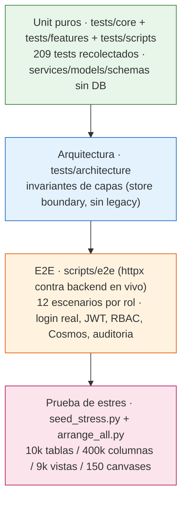
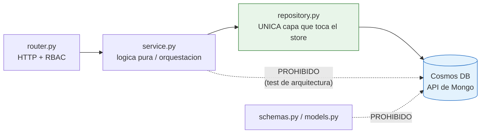
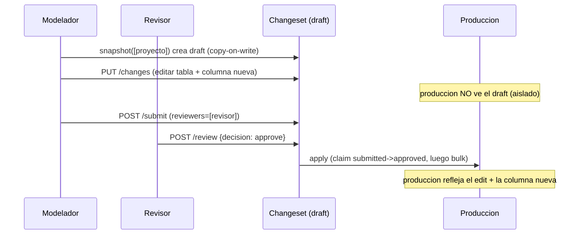
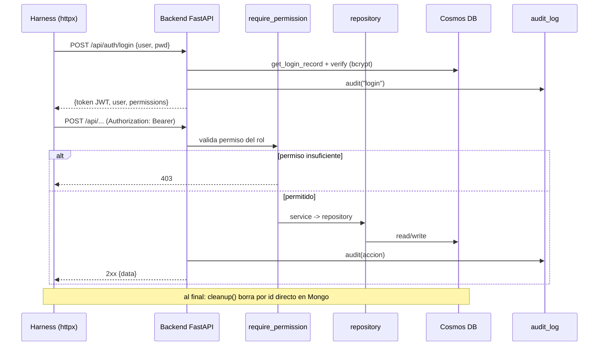
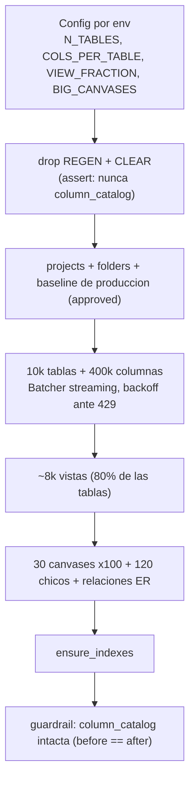
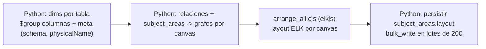

# Testing del backend — Data Model Hub

Este documento describe la estrategia y la implementación completa de pruebas del backend `backend-data-model-hub` (FastAPI + Motor/Cosmos DB con API de Mongo). Cubre las cuatro capas de verificación que sostienen el proyecto: pruebas unitarias puras por feature, pruebas de arquitectura que fuerzan invariantes de capas, un harness E2E que ejercita el backend real por rol vía HTTP, y una prueba de estrés a escala real (10.000 tablas / 400.000 columnas). Todo el contenido está basado en el código real de `tests/`, `scripts/e2e/` y `scripts/seed_stress.py` / `arrange_all.py`.

---

## 1. Panorama general

El backend está organizado por features (`app/features/<feature>/{router,service,repository,schemas,models}.py`) sobre un núcleo compartido (`app/core/`). La estrategia de testing calca esa estructura: cada feature tiene su carpeta de tests, y las pruebas atacan preferentemente la lógica **pura** de `service.py` (sin base de datos) y los contratos de `models.py` / `schemas.py`.

La filosofía es una pirámide clásica:



Principios de diseño de las pruebas:

- **Unit puros con repositorios mockeados.** La lógica de negocio vive en funciones puras (`physicalize`, `overlay`, `structured_diff`, `table_rows`, `effective_permissions`, etc.) o en orquestadores async que se testean sustituyendo el `repository` por `AsyncMock` con `monkeypatch`. No se levanta Cosmos.
- **Invariantes de capas verificados por código.** Dos tests de arquitectura leen los archivos fuente y fallan si alguien filtra el store fuera de `repository.py` o si reaparecen árboles/features legacy.
- **E2E contra el backend real.** El harness loguea usuarios canónicos por rol, obtiene un JWT y ejercita el stack completo (RBAC → servicio → repositorio → Cosmos → auditoría), limpiando lo que crea.
- **Estrés reproducible.** Un seed sintético inserta cientos de miles de documentos en streaming, con tolerancia a throttling de Cosmos (429 / código 16500), para medir el comportamiento del reporting y del canvas a escala.

**Conteo confirmado:** `pytest --collect-only` recolecta **209 tests**. Este es el desglose por área:

| Área | Archivos | Tests |
|------|---------:|------:|
| `tests/core` (identidad, naming, versioning, config) | 7 | 33 |
| `tests/architecture` (invariantes de capas) | 2 | 4 |
| `tests/features` (todas las features) | 32 | 152 |
| `tests/scripts` (seed determinista) | 1 | 18 |
| `tests/test_smoke.py` (app + health) | 1 | 2 |
| **Total** | **43** | **209** |

---

## 2. Estructura del árbol de tests

```
tests/
├── conftest.py                      # fixture `client` (TestClient SIN lifespan → no toca Cosmos)
├── test_smoke.py                    # app.title + /api/health degradado sin DB
├── architecture/
│   ├── test_store_boundary.py       # el store solo se toca desde repository.py
│   └── test_no_legacy_features.py   # features y arboles legacy no vuelven
├── core/
│   ├── identity/                    # provider local/databricks, dependencies, models, dev_switch
│   ├── naming/test_engine.py        # logicalize / physicalize (case, separator, longest-match)
│   ├── versioning/test_overlay.py   # overlay(publicado + cambios) + summarize_diff
│   └── test_config.py               # defaults del seam de identidad
├── features/
│   ├── admin/                       # RBAC, guards anti-lockout, hash de password, auditoria
│   ├── auth/                        # permisos efectivos, login/lockout, current_principal token-first
│   ├── catalog/                     # columnas aditivas + derivacion de tipo desde dominio
│   ├── changesets/                  # politica de versionado, validacion de payloads, effective+search
│   ├── data_standards/              # diff/snapshot + apply/rollback versionado
│   ├── domains/                     # cascada de ParentDomain (filter, impact, namingTerm)
│   ├── folders/                     # descendant_ids (cascada) + modelo/rutas
│   ├── glossary/                    # rephysicalize, scope/wordType, to_mappings
│   ├── identity/                    # /api/me y /users (rutas)
│   ├── projects/                    # tables_in_area, layout, subject area aditiva
│   ├── relationships/               # versionado + cardinalidad simetrica
│   ├── reporting/                   # compiler QuerySpec, seguridad del cursor, table/column rows
│   ├── settings/                    # naming_config por scope (defaults + validacion)
│   ├── summary/                     # contadores del Home (global + por proyecto)
│   └── views/                       # campos aditivos de vista
└── scripts/
    └── test_seed_modeler.py         # integridad referencial del seed determinista
```

---

## 3. Estrategia por capa

### 3.1 Unit puros con repositorios mockeados

La mayoría de los 209 tests no tocan la base de datos. Hay dos patrones dominantes.

**Patrón A — función pura.** Se prueba directamente el algoritmo, sin `async` ni mocks. Ejemplo del motor de naming (`tests/core/naming/test_engine.py`):

```python
from app.core.naming.engine import logicalize, physicalize

DICT = {"monto": "MTO", "deuda": "DEU", "dólares": "USD", "tipo de cambio": "TPC"}

def test_physicalize_longest_match_multi_palabra():
    assert physicalize("tipo de cambio monto", DICT) == "TPC_MTO"

def test_physicalize_camel_ignora_separator():
    out = physicalize("monto deuda dólares", DICT, separator="_", case="camel")
    assert out == "mtoDeuUsd"

def test_logicalize_reversa():
    assert logicalize("MTO_DEU_USD", DICT) == "monto deuda dólares"
```

**Patrón B — orquestador async con `repository` mockeado.** El servicio conserva su lógica de guardas y máquina de estados, pero el acceso al store se reemplaza por `AsyncMock`. Ejemplo del cierre de un changeset (`tests/features/changesets/test_versioning_policy.py`), que valida que el publish **reclame el estado antes de tocar producción** (anti-condición de carrera):

```python
from unittest.mock import AsyncMock
from app.features.changesets import service

def test_apply_and_finalize_reclama_el_estado_antes_de_aplicar(monkeypatch):
    tr = AsyncMock(return_value=None)          # un withdraw concurrente ya se llevo el estado
    apply = AsyncMock()
    cm = AsyncMock(return_value={"canonical_tables": {"t1": {"op": "delete"}}})
    monkeypatch.setattr(service.repository, "transition", tr)
    monkeypatch.setattr(service.repository, "apply_changes", apply)
    monkeypatch.setattr(service.repository, "changes_map", cm)

    res = asyncio.run(service._apply_and_finalize("c1", {"status": "approved"}, "T1"))

    assert res is None
    apply.assert_not_awaited()   # produccion intacta: no se publicaron cambios retirados
    cm.assert_not_awaited()      # ni siquiera se leyeron los cambios
    assert tr.await_args.kwargs["expect"] == {"submittedAt": "T1"}   # claim condicionado (anti-ABA)
```

Este mismo archivo (28 tests, el más grande) cubre además: `next_version_label` (v1 → v11, case-insensitive), `record_approval` / `approval_outcome` (unanimidad: todos aprueban / cualquiera rechaza / parcial pendiente), `structured_diff` (buckets added/edited/deleted, impacto por relaciones, detección de conflicto contra producción por timestamp), `changes_in_cycle` (excluye escrituras posteriores al submit), `apply_plan` (orden por dependencia: tablas → columnas → relaciones), y los guards owner-only de `submit` / `reopen` / `add_change`, incluyendo el gate autoritativo que **rechaza payloads inválidos** tanto en la entrada (`add_change` → 422) como en el apply (revierte el claim y levanta `InvalidPayloadError`).

**El fixture `client`** (en `tests/conftest.py`) construye un `TestClient` **sin** usar el context manager, a propósito: así no se dispara el `lifespan` de la app y no se intenta conectar a Cosmos. Sirve para los smoke de rutas registradas y para `/api/me` / `/api/health`:

```python
@pytest.fixture
def client() -> TestClient:
    return TestClient(app)   # sin `with`: no hay lifespan, no hay conexion a DB
```

### 3.2 Tests de arquitectura (invariantes de capas)

Son dos archivos que no prueban comportamiento sino **estructura del código fuente**, para que la persistencia se mantenga intercambiable (swappable) y no reaparezca el backend viejo.

`tests/architecture/test_store_boundary.py` — el store (Motor/pymongo/`get_db`) solo puede tocarse desde `repository.py`; `service.py` y `schemas.py` deben permanecer agnósticos al store:

```python
FORBIDDEN = ("import motor", "from motor", "import pymongo", "from pymongo", "get_db")

def test_services_and_schemas_do_not_touch_the_store():
    offenders: list[str] = []
    for layer in ("service.py", "schemas.py"):
        for path in FEATURES.glob(f"*/{layer}"):
            text = path.read_text(encoding="utf-8")
            for needle in FORBIDDEN:
                if needle in text:
                    offenders.append(f"{path}: contiene '{needle}'")
    assert not offenders
```



`tests/architecture/test_no_legacy_features.py` — verifica que las features superadas (`canvas`, `metadata`, `excel_import`) y los árboles del backend pre-refactor (`api/`, `src/`) ya no existan, y que `projects` sea el nuevo (sin `ModelLevelDoc`).

### 3.3 E2E contra el backend en vivo

Ver la sección 5. Ejercita el stack real por HTTP con `httpx`, por rol, con limpieza determinista.

### 3.4 Prueba de estrés a escala

Ver la sección 6. `seed_stress.py` genera data sintética a escala real y `arrange_all.py` reorganiza los canvases con ELK.

---

## 4. Cómo correr las pruebas

Todas las dependencias de test están en `requirements-dev.txt` (`pytest>=8.0`, `httpx>=0.27`, además del runtime: `fastapi`, `motor`, `pydantic`, `bcrypt`, `pyjwt`, `sqlglot`). El intérprete del proyecto es `.venv/bin/python`.

### 4.1 Unit + arquitectura (pytest)

No requieren Cosmos ni variables de entorno. Ejemplos:

```bash
# Toda la suite (209 tests)
.venv/bin/python -m pytest

# Solo recolectar (verificar el conteo, ~0.1 s)
.venv/bin/python -m pytest --collect-only -q

# Un area completa
.venv/bin/python -m pytest tests/features/changesets -v
.venv/bin/python -m pytest tests/core/naming -v

# Solo los invariantes de arquitectura
.venv/bin/python -m pytest tests/architecture -v

# Un archivo o un test puntual
.venv/bin/python -m pytest tests/features/reporting/test_query_compiler.py
.venv/bin/python -m pytest tests/features/auth/test_auth.py::test_access_level_derivation

# Filtrar por nombre y salida corta
.venv/bin/python -m pytest -k "rephysicalize or cascade" -q
```

No hay `pytest.ini` ni `pyproject.toml`: pytest descubre todo bajo `tests/` con la convención `test_*.py` / `def test_*`. El `conftest.py` de la raíz de tests provee el fixture `client`.

### 4.2 Runner E2E

Requiere el backend levantado (por defecto `http://localhost:8000`) con la data del seed cargada (usuarios canónicos y una versión de producción base). Se invoca como módulo:

```bash
# Levantar el backend (en otra terminal)
.venv/bin/uvicorn app.main:app --port 8000

# Correr TODOS los escenarios en serie (imprime ===E2E_TOTAL===)
.venv/bin/python -m scripts.e2e.run_e2e all

# Un escenario puntual (imprime ===E2E_RESULT=== con JSON)
.venv/bin/python -m scripts.e2e.run_e2e s02_version_lifecycle

# Apuntar a otro backend
E2E_BASE=https://mi-app.azurewebsites.net .venv/bin/python -m scripts.e2e.run_e2e s01_rbac
```

El runner (`run_e2e.py`) ejecuta cada escenario, siempre llama a `cleanup()` en el `finally`, agrega passed/failed y sale con código 1 si algo falló (apto para automatización). La salida por escenario es un JSON con `passed/failed/total/elapsed_ms/checks`.

### 4.3 Seed y estrés

```bash
# Seed determinista (data chica y consistente para desarrollo/E2E)
.venv/bin/python scripts/seed_modeler.py

# Estrés a escala completa (10k tablas / 400k columnas)
.venv/bin/python scripts/seed_stress.py

# Estrés a escala reducida para pruebas rapidas
N_TABLES=100 BIG_CANVASES=2 .venv/bin/python scripts/seed_stress.py

# Reorganizar (auto-arrange) todos los canvases con ELK
.venv/bin/python scripts/arrange_all.py
```

---

## 5. Detalle de la cobertura unit por grupo

### 5.1 Auth (`tests/features/auth`, 14 tests)

Auth propia con bcrypt + JWT (HS256). Cubre:

- **Permisos efectivos (puro):** `effective_permissions` rellena todas las keys conocidas de `PERMISSIONS` y descarta las desconocidas; `access_level` deriva `full` / `edit` / `read` desde el set de permisos.
- **Login con lockout (repo + security + audit mockeados):** password correcta devuelve token + usuario enriquecido sin `passwordHash`; password incorrecta devuelve `None`, registra el intento fallido y audita `login_failed`; usuario inexistente o deshabilitado no entra; cuenta bloqueada (`lockedUntil` futuro) rechaza **aun con la contraseña correcta** y audita `login_locked`.
- **Revocación de sesión:** deshabilitar un usuario invalida su sesión activa (`resolve_session_user` → `None` → 403 en las dependencias) aunque el token siga vigente.
- **`current_principal` token-first:** con `Authorization: Bearer <jwt>` válido resuelve `source="session"`; token inválido → 401; sin token en modo local cae al seam de identidad; sin token con `REQUIRE_AUTH=true` → 401.
- **Falla-cerrado de config:** `assert_secure_config()` levanta `RuntimeError` si `REQUIRE_AUTH=true` con el `SECRET_KEY` de desarrollo; en dev solo advierte.

### 5.2 Admin / RBAC (`tests/features/admin`, 9 tests)

- Helpers puros: `initials`, `sanitize_permissions` (solo mantiene keys conocidas de `PERMISSIONS`).
- `create_user` hashea el password (nunca lo guarda en claro), agrega `initials` y audita `admin.user.create`.
- `update_user` / `upsert_role` aplican **solo los campos enviados** y sanean permisos.
- **Guards anti-lockout (invariante: siempre ≥1 admin activo):** no se puede eliminar al último admin, ni quitar `admin.manage` del último rol admin, ni borrar un rol con usuarios asignados (levantan `AdminGuardError` → 400).

### 5.3 Changesets / versionado (`tests/features/changesets`, 43 tests en 4 archivos)

Es el corazón del versionado (copy-on-write, requests, aprobaciones):

- **`test_versioning_policy.py` (28):** etiquetas de versión, aprobaciones/unanimidad, `structured_diff` con impacto y conflictos, máquina de estados (`submit`/`reopen`/`review` con guards owner-only y revisor-asignado), y el cierre atómico `_apply_and_finalize` (claim antes de aplicar, revert ante payload inválido o fallo de bulk, `current_production` prefiere la versión aplicada). Detalle en la sección 3.1.
- **`test_record.py` (9):** validación de payloads (`payload_error` / `validate_changes`) — un upsert de columna sin `tableId`/`physicalName`/`dataType` falla con mensaje legible que nombra el campo; los `delete` no validan payload; junta errores de todas las colecciones; y `_safe_path_part` bloquea inyección de dot-path de Mongo (rechaza `a.b` y `$set`).
- **`test_effective_search.py` (5):** búsqueda server-side sobre la vista efectiva (publicado + cambios del changeset): incluye entidades nuevas del changeset que matchean `q`, excluye las renombradas fuera del match (re-filtro post-overlay), aplica los deletes, ordena y capea por `limit`, y sin `q` conserva el contrato original.
- **`test_apply_plan.py` (1):** `apply_plan` linealiza el mapa de cambios a tuplas `(collection, id, op, payload)`.

### 5.4 Versioning overlay (`tests/core/versioning`, 5 tests)

`overlay(publicado, cambios)` es la primitiva de copy-on-write: un `upsert` modifica un existente o agrega uno nuevo, un `delete` lo quita, y sin cambios es identidad. `summarize_diff` clasifica en `added` / `modified` / `removed`.



Este flujo es exactamente el que valida el escenario E2E `s02_version_lifecycle`.

### 5.5 Data Standards (`tests/features/data_standards`, 6 tests)

Módulo de estándares versionado (dominios + diccionario + naming, con historial y rollback):

- `snapshot_of` / `build_diff` (puros): limpian campos y clasifican add / edit / remove (incluye cambios de tipo de dominio como `DECIMAL(18,2) → DECIMAL(20,4)`).
- `apply` (repos mockeados): registra una versión con `seq` incremental (`max_seq+1`) y `label` (`v17`), autor y `status="applied"`; el impacto agrega columnas de rephysicalize + `willUpdate` del dominio; un apply de solo-dominios **no** dispara el rephysicalize global.
- `rollback`: restaura el snapshot (dominios, diccionario, naming, UDP), corre rephysicalize + propagate y registra una nueva versión `kind="rollback"` con `revertsSeq`; versión inexistente → `None`.

### 5.6 Domains / cascada de ParentDomain (`tests/features/domains`, 8 tests)

- `cascade_filter(domain_id)`: el filtro autoritativo que garantiza que la cascada de re-tipado solo toque columnas del dominio **sin override manual** y no soft-deleted (`typeOverridden != True`, `flgactive != False`).
- `summarize_impact`: cuenta `willUpdate` (sin override) vs `overridden` y arma la lista plana para la UI.
- `namingTerm` aditivo en `ParentDomain` (invariante de persistencia: declarado en el modelo → sobrevive el round-trip; default `None` no-breaking).
- Smoke de rutas: `/api/domains/{id}/impact` (GET) y `/propagate` (POST) registradas.

### 5.7 Glossary + naming (`tests/features/glossary` 13 + `tests/core/naming` 15)

- **Motor de naming (`core/naming`, 15):** `physicalize` con longest-match multi-palabra, tokens no mapeados en mayúscula, `case` (`upper`/`lower`/`camel`) y `separator` configurables (incluido `""` para nombres de tabla tipo `CTARIESGO`), y `logicalize` inverso. `case` inválido levanta `ValueError`.
- **Glossary (`features/glossary`, 13):** `compute_rephysicalize` re-deriva el físico desde el `logicalName` y devuelve **solo** las entidades que cambian (usando separador/case del scope), salta las sin `logicalName`, y normaliza `_id` vs `id`; `to_mappings` arma el dict término→abbrev ignorando `scope`/`wordType`; invariantes de persistencia de `scope`/`wordType` en el modelo y el body; smoke de la ruta `/api/glossary/rephysicalize`.

### 5.8 Reporting (`tests/features/reporting`, 18 tests)

El motor de reporting traduce un `QuerySpec` a un pipeline de Mongo con whitelist:

- **Compiler (`test_query_compiler.py`, 7):** `build_match` traduce operadores (`eq`, `startsWith` con `re.escape`), resuelve UDP a paths embebidos (`udp.u1` → `udpValues.u1`), rechaza campos desconocidos (400) y operadores no válidos por tipo (422). El planner rechaza ordenar por campos sin índice (422, seguro a escala) y arma `group`/`sort` para campos indexados.
- **Seguridad del cursor (`test_query_security.py`, 3):** el cursor keyset (base64-JSON provisto por el cliente) va directo al `$match`, así que `_decode_cursor` **rechaza inyección de operadores de Mongo** (`{"$ne": null}`, `{"$regex": "(a+)+$"}` para evitar bypass y ReDoS) y cursores malformados.
- **Agregación pura (`test_table_rows.py`, 7):** `table_rows` calcula `columnCount`, `relationshipCount` (source o target), y las listas de `subjectAreas`/`projects` que referencian cada tabla; soporta filtros por schema/proyecto y combinados. `column_rows` resuelve el nombre del dominio y ordena por `(tableId, ordinal)`.
- Smoke: `/api/reporting/tables` y `/columns` registradas.

### 5.9 Resto de features

| Grupo | Tests | Qué cubre |
|-------|------:|-----------|
| `catalog` | 5 | Campos aditivos de columna (`isNullable`/`isPartition`/`description`, round-trip) + `derive_column` (hereda tipo del dominio, respeta override manual con `typeOverridden`). |
| `projects` | 5 | `tables_in_area` (filtra el pool a la subject area), layout y subject area aditiva. |
| `folders` | 7 | `descendant_ids` (cascada transitiva, tolera ciclos sin loop infinito) + modelo/rutas. |
| `relationships` | 3 | `relationships` y `views` están en `VERSIONED` (entran a changesets); cardinalidad simétrica por defecto (`one`/`many`) y `identifying=False`. |
| `views` | 5 | Campos aditivos de vista (persistencia). |
| `summary` | 6 | Contadores del Home: `count_global` passthrough y `count_for_project` (tablas distintas entre canvases, vistas y relaciones solo dentro del scope). |
| `settings` | 6 | `naming_config` por scope: seeding de defaults (`_to_doc`), rutas registradas y validación (scope/case inválidos levantan `ValueError`). |
| `identity` | 4 | Rutas `/api/me` (local y databricks por headers `X-Forwarded-*`) y `/users`. |
| `core/identity` | 10 | Providers local/databricks, factory por `AUTH_MODE`, `current_principal`, modelos. |
| `core/test_config` | 3 | Defaults del seam de identidad (`AUTH_MODE`, `LOCAL_DEV_USER`). |

### 5.10 Test del seed determinista (`tests/scripts/test_seed_modeler.py`, 18 tests)

Verifica la lógica pura de `scripts/seed_modeler.py` (`build_all()`) sin tocar la DB. Garantiza integridad referencial y contrato de modelos: todas las colecciones se generan y no están vacías; `column_catalog` (la colección del agente) nunca se incluye ni se borra; cardinalidades esperadas; cada doc tiene `_id` y `flgactive`; ids únicos; columnas → tablas y dominios existentes; cada tabla con exactamente 1 PK; endpoints de relaciones existen y la columna source pertenece a su tabla; canvases con `tableIds` y `layout` válidos; `changeset_changes` con `_id` determinista (`csId::collection::entityId`) apuntando a tablas reales; reviewers son usuarios simulados; naming/diccionario coherentes; y **todos los docs validan contra sus modelos Pydantic** (incluido el alias `schema` de tabla en el round-trip).

---

## 6. E2E — harness contra el backend real

### 6.1 Cómo funciona el harness (`scripts/e2e/harness.py`)

El harness ejercita el stack completo por HTTP: `login real → JWT → header Authorization → require_permission (RBAC) → servicio → repositorio → Cosmos → auditoría`. Piezas clave:

- **`Client(role)`** loguea al usuario canónico del rol vía `POST /api/auth/login`, guarda el token y lo pone en `Authorization: Bearer`. Los roles y credenciales:

| Rol lógico | Usuario | Password |
|-----------|---------|----------|
| admin | `admin` | `admin` |
| modelador | `carla` | `123456789` |
| modelador2 | `juan.castillo` | `123456789` |
| revisor | `beto` | `123456789` |
| revisor2 | `ana` | `123456789` |
| lector | `diego.torres` | `123456789` |

- **Helpers de fixtures** (`create_project`, `create_canvas`, `create_table`, `add_column`, `create_relationship`, `create_view`, `create_domain`, `snapshot`) hacen las mutaciones **vía API** y registran cada id creado.
- **`cleanup()`** borra por id directo en Mongo (hay entidades sin endpoint DELETE, como `canonical_tables`/`canonical_columns`), además de las columnas y `changeset_changes` derivados. Todo lo creado lleva un `TAG` único por proceso para poder barrer restos.
- **`Suite`** colecciona checks `(name, ok, detail)` y los vuelca como JSON (`===E2E_RESULT===`).

Ejemplo de login real (equivalente al que hace el harness) con curl:

```bash
# 1) login → token
curl -s -X POST http://localhost:8000/api/auth/login \
  -H "Content-Type: application/json" \
  -d '{"username":"carla","password":"123456789"}'
# → {"data":{"token":"<jwt>","user":{"role":"modelador","permissions":{...},"accessLevel":"edit"}}}

# 2) usar el token en un endpoint gateado por RBAC
curl -s http://localhost:8000/api/catalog/tables \
  -H "Authorization: Bearer <jwt>"

# 3) crear un draft (requiere model.edit) — un lector recibiria 403
curl -s -X POST http://localhost:8000/api/changesets/snapshot \
  -H "Authorization: Bearer <jwt>" -H "Content-Type: application/json" \
  -d '{"title":"mi draft","projectIds":["p1"]}'
```



### 6.2 Escenarios (`scripts/e2e/scenarios.py`)

Hay **12 escenarios** (`s01`–`s12`), cada uno aislado con tag único y auto-limpieza:

| Escenario | Foco | Qué valida |
|-----------|------|-----------|
| `s01_rbac` | Matriz de permisos por rol | Lector solo `model.view`+`export`; lector no puede snapshot (403), modelador sí; endpoints directos gateados; `standards.apply` y `admin/users` solo admin; `review.decide` fuera del modelador. |
| `s02_version_lifecycle` | Ciclo completo de versión | snapshot → editar tabla + columna nueva en el draft → producción aislada → submit → revisor aprueba → producción refleja el cambio; `current_production` apunta a la versión aplicada. |
| `s03_convergence` | Merge de dos drafts | Dos drafts editan la misma tabla; copy-on-write mantiene el override de cada uno; last-writer-wins al publicar B. |
| `s04_domain_cascade` | Cascada de ParentDomain (R7) | Cambio de dominio (DECIMAL→BIGINT) re-tipa las columnas sin override en producción; drafts sin override ven el valor publicado nuevo; restauración a DECIMAL. |
| `s05_udp_scope` | Alcance del rephysicalize | Lecturas del módulo a escala + dry-run **no destructivo** que mide cuántas columnas reescribiría un naming apply global (hallazgo de escala, sin escribir). |
| `s06_canvas_crud` | Canvas CRUD | Crear canvas, agregar/quitar tablas, guardar layout, verificar el diagrama, eliminar (404 al releer). |
| `s07_relationships` | Relaciones | Crear, listar, eliminar; verifica presencia/ausencia en el listado. |
| `s08_views` | Vistas (CTAS) | Crear, listar, editar, eliminar. |
| `s09_reporting` | Exactitud del reporting | Sobre un fixture conocido: `columnCount=3`, el canvas aparece en `subjectAreas`, `/reporting/columns` acotado devuelve 3 filas. |
| `s10_admin` | Users/roles CRUD + guards | Crear usuario, login, cambiar rol, deshabilitar (login 401), borrar rol con usuarios (400), reasignar y borrar. |
| `s11_audit` | Auditoría | Genera `login` y `login_failed`, verifica que el `audit_log` registra actor+acción+timestamp y que el lector no puede leerlo (403). |
| `s12_glossary_udp` | Glossary + UDP real | `/api/dictionary` viejo → 404; definir keys UDP versionadas por nivel (column/table); asignar `udpValues` vía changeset y publicar; rollback con fast-path que **no barre las 400k columnas** (`impact.columns == 0`). |

Cada escenario imprime un JSON como este (formato `Suite.summary()`):

```json
{
  "scenario": "s02_version_lifecycle",
  "tag": "E2E_a1b2c3d4",
  "passed": 9, "failed": 0, "total": 9,
  "elapsed_ms": 812,
  "checks": [{"name": "snapshot creó draft", "ok": true, "detail": ""}]
}
```

---

## 7. Prueba de estrés a escala

### 7.1 `seed_stress.py` — generación a escala

Genera data sintética configurable por variables de entorno para estresar el reporting y el canvas. Objetivo por defecto: **10.000 tablas** con ~40 columnas cada una (≈**400.000 columnas**), ~**8.000 vistas** (el 80% de las tablas), y canvases variados incluyendo **30 canvases grandes de 100 tablas** con relaciones entidad-relación (crow's-foot).

| Variable | Default | Significado |
|----------|--------:|-------------|
| `N_TABLES` | 10000 | Tablas canónicas |
| `COLS_PER_TABLE` | 40 | Columnas por tabla (≈400k) |
| `VIEW_FRACTION` | 0.8 | Fracción de tablas con vista |
| `N_PROJECTS` | 12 | Proyectos |
| `BIG_CANVASES` × `BIG_SIZE` | 30 × 100 | Canvases grandes |
| `SMALL_CANVASES` | 120 | Canvases chicos (8–40 tablas) |
| `BATCH` | 1000 | Tamaño de lote de inserción |

Características de robustez del seed:

- **Streaming por lotes** (`Batcher` + `insert_many(ordered=False)`) con bajo consumo de memoria y progreso.
- **Tolerancia a throttling de Cosmos**: detecta 429 / código 16500 / `RequestRateTooLarge` y reintenta el lote con backoff exponencial (0.5 s → hasta 20 s, 10 intentos).
- **Regenera** (drop) `projects`, `folders`, `subject_areas`, `canonical_tables`, `canonical_columns`, `relationships`, `views`; **limpia** `changesets` y `changeset_changes`; **preserva** usuarios, roles, estándares, dominios, glosario y naming; y **nunca toca** `column_catalog` (colección del agente), con un `assert` guardián.
- Inserta una **versión de producción baseline** (`approved` + `appliedAt`) para que el canvas pueda abrir el modelo y snapshotear desde producción.
- Recrea los índices correctos al final con `ensure_indexes`.



### 7.2 `arrange_all.py` — auto-arrange a escala

El seed deja las tablas en una grilla naïve donde las tablas de ~40 columnas (~1100 px de alto) se superponen. `arrange_all.py` reorganiza **todos** los canvases con el mismo motor (elkjs) y config que el botón "Autoarrange" del frontend. Pipeline mixto:



Estima el tamaño real de cada nodo (alto por número de columnas, ancho por el naming más largo, acotado 240–520 px como el CSS `.wk-node`), corre ELK por canvas vía `subprocess` y persiste `subject_areas.layout` con `bulk_write`.

### 7.3 Hallazgos de escala reflejados en las pruebas

Los escenarios E2E `s05` y `s12` están escritos deliberadamente para medir/documentar el comportamiento a escala **sin ejecutar operaciones destructivas** sobre las 400k columnas: `s05` hace un dry-run del rephysicalize (importa las funciones puras y cuenta cuántas columnas reescribiría), y `s12` verifica que el rollback de una definición UDP use un fast-path con `impact.columns == 0` en vez de barrer todo el catálogo.

---

## 8. Consideraciones de despliegue

El backend corre como una app FastAPI (ASGI, `uvicorn app.main:app`) en dos destinos posibles:

- **Azure App Service** (contenedor / Python), o
- **Databricks Apps** (con identidad por headers SSO `X-Forwarded-*` que el `DatabricksIdentityProvider` ya parsea).

### 8.1 Variables de entorno

| Variable | Default | Rol en producción |
|----------|---------|-------------------|
| `COSMOS_CONNECTION_STRING` | `""` | Cadena de conexión a Cosmos DB (API de Mongo). Obligatoria en cualquier entorno con DB. |
| `COSMOS_DATABASE` | `db_modeler` | Nombre de la base de datos. |
| `AUTH_MODE` | `local` | `local` (dev, usuario fake) o `databricks` (identidad por headers). El carril real de auth es el token JWT. |
| `REQUIRE_AUTH` | `false` | En producción **debe** ser `true`: obliga token válido y activa el falla-cerrado del `SECRET_KEY`. |
| `SECRET_KEY` | default inseguro | Clave de firma HS256 del JWT. Con `REQUIRE_AUTH=true`, arrancar con el default lanza `RuntimeError` (verificado por `test_assert_secure_config_falla_con_default_en_prod`). |
| `ACCESS_TOKEN_TTL_MIN` | `720` | Vida del token en minutos. |
| `LOCAL_DEV_USER` / `LOCAL_DEV_USERNAME` / `LOCAL_DEV_DISPLAY_NAME` | `dev@local` / `""` / `""` | Solo para `AUTH_MODE=local`. |
| `E2E_BASE` | `http://localhost:8000` | Base URL que apunta el runner E2E (útil para correr los escenarios contra un entorno desplegado). |

### 8.2 Base de datos (Azure Cosmos DB con API de Mongo)

- La persistencia usa **Motor** (driver async de Mongo) contra **Azure Cosmos DB con API de Mongo**. El acceso está confinado a los `repository.py` (invariante forzado por `tests/architecture/test_store_boundary.py`), lo que mantiene el store intercambiable.
- **Throttling (429 / código 16500):** Cosmos limita por RU/s. Los scripts de inserción a escala (`seed_stress.py`) ya reintentan con backoff exponencial. En producción, la carga masiva (por ejemplo one-shot de Erwin) va por script directo a las colecciones y conviene dimensionar los RU/s en consecuencia.
- **Índices:** se recrean con `ensure_indexes(db)` al arrancar el lifespan y al final de los seeds; el planner del reporting rechaza (422) ordenar por campos sin índice, así que los índices esperados deben existir para las consultas a escala.
- **Colección protegida:** `column_catalog` (usada por el agente de modelado) nunca debe ser borrada por los seeds; ambos scripts lo garantizan con `assert`/guardrail.
- **Sin lifespan no hay DB:** el `TestClient` de los unit tests se construye sin lifespan a propósito, y el `/api/health` reporta `degraded` con `db_connected: false` cuando no hay conexión — comportamiento verificado en `tests/test_smoke.py`.

---

## 9. Resumen de comandos

```bash
# Unit + arquitectura (209 tests, sin DB)
.venv/bin/python -m pytest
.venv/bin/python -m pytest tests/architecture -v
.venv/bin/python -m pytest tests/features/changesets -k versioning

# E2E (requiere backend en vivo con seed)
.venv/bin/uvicorn app.main:app --port 8000        # terminal 1
.venv/bin/python -m scripts.e2e.run_e2e all        # terminal 2
.venv/bin/python -m scripts.e2e.run_e2e s02_version_lifecycle

# Seed y estres
.venv/bin/python scripts/seed_modeler.py                          # data chica determinista
.venv/bin/python scripts/seed_stress.py                           # 10k tablas / 400k columnas
N_TABLES=100 BIG_CANVASES=2 .venv/bin/python scripts/seed_stress.py
.venv/bin/python scripts/arrange_all.py                           # auto-arrange con ELK
```

Archivos de referencia (rutas absolutas):

- Unit por feature: `/Users/carlosperez/Desktop/Projects/Agentes/GitHub/WebApp/MODELER/backend-data-model-hub/tests/`
- Arquitectura: `/Users/carlosperez/Desktop/Projects/Agentes/GitHub/WebApp/MODELER/backend-data-model-hub/tests/architecture/`
- Harness y escenarios E2E: `/Users/carlosperez/Desktop/Projects/Agentes/GitHub/WebApp/MODELER/backend-data-model-hub/scripts/e2e/`
- Estrés y auto-arrange: `/Users/carlosperez/Desktop/Projects/Agentes/GitHub/WebApp/MODELER/backend-data-model-hub/scripts/seed_stress.py` y `/Users/carlosperez/Desktop/Projects/Agentes/GitHub/WebApp/MODELER/backend-data-model-hub/scripts/arrange_all.py`
