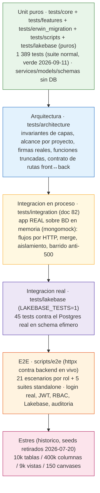
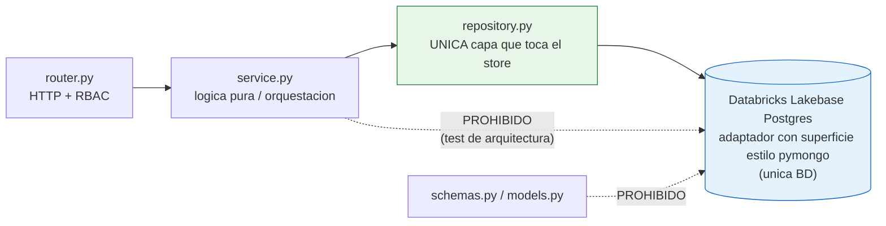
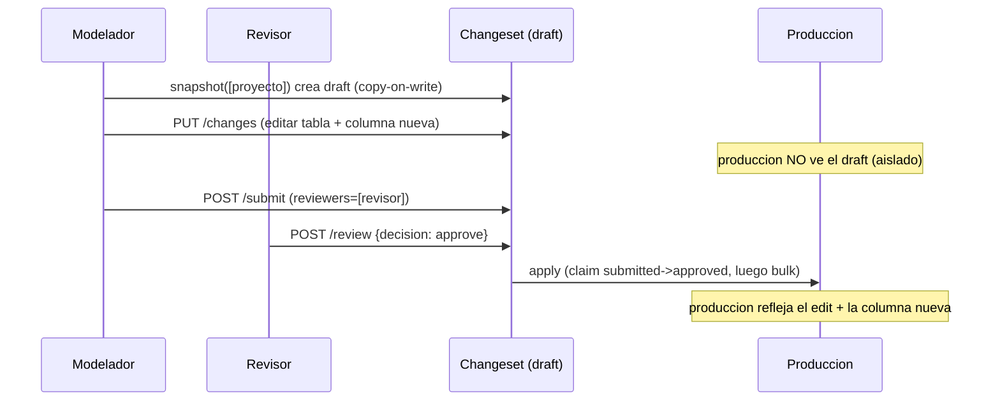
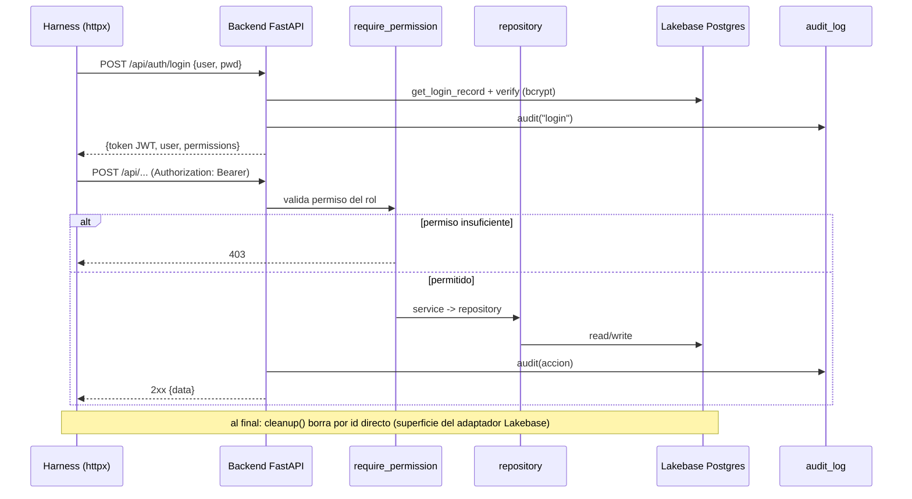
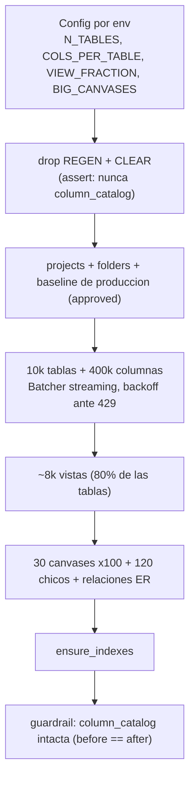
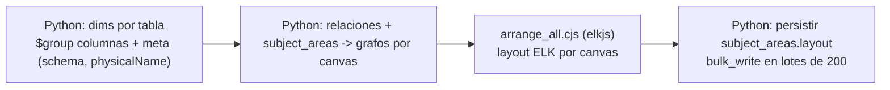

# Testing del backend — Data Model Hub

> **Actualizado: 2026-09-09** (doc 82: suite de integración en proceso sobre una BD en memoria + guardas de arquitectura — suite normal **1 294 tests**, verde).
>
> **Nota (2026-07-20):** los seeds y la prueba de estrés que se citan más abajo
> (`seed_modeler.py`, `seed_stress.py`, `seed_ddv_synthetic.py` y sus tests) se
> **retiraron** — el flujo vigente es únicamente XML → Lakebase
> (`scripts/README.md`). Esas secciones quedan como evidencia histórica de la
> validación a escala (resultados en `plan-implementacion/04-STRESS-TEST.md`).

Este documento describe la estrategia y la implementación completa de pruebas del backend `backend-data-model-hub` (FastAPI + Databricks Lakebase Postgres como **única** BD, vía un adaptador que emula la superficie de `pymongo` —`ReturnDocument`, `UpdateOne`, `DuplicateKeyError`— sin conectar a Mongo). Cubre las capas de verificación que sostienen el proyecto: pruebas unitarias puras por feature, pruebas de arquitectura que fuerzan invariantes de capas, una suite viva de integración del adaptador Lakebase contra el Postgres real, un harness E2E que ejercita el backend real por rol vía HTTP, y — como evidencia histórica — la prueba de estrés a escala real (10.000 tablas / 400.000 columnas). Todo el contenido está basado en el código real de `tests/`, `scripts/e2e/` y `scripts/arrange_all.py`.

---

## 1. Panorama general

El backend está organizado por features (`app/features/<feature>/{router,service,repository,schemas,models}.py`) sobre un núcleo compartido (`app/core/`). La estrategia de testing calca esa estructura: cada feature tiene su carpeta de tests, y las pruebas atacan preferentemente la lógica **pura** de `service.py` (sin base de datos) y los contratos de `models.py` / `schemas.py`.

La filosofía es una pirámide clásica:



Principios de diseño de las pruebas:

- **Unit puros con repositorios mockeados.** La lógica de negocio vive en funciones puras (`physicalize`, `overlay`, `structured_diff`, `table_rows`, `effective_permissions`, etc.) o en orquestadores async que se testean sustituyendo el `repository` por `AsyncMock` con `monkeypatch`. No se levanta ninguna base de datos.
- **Invariantes de capas verificados por código.** Los tests de arquitectura leen los archivos fuente y fallan si alguien filtra el store fuera de `repository.py`, si reaparecen árboles/features legacy o si vuelven los scripts backfill y las rutas retiradas en el doc 75 (`GET /api/me`, `logicalize`).
- **Alcance por proyecto (doc 75).** `tests/core/test_scope.py` fija el contrato de `app/core/scope.py` (`scoped`, `naming_id`, `assert_scoped_filter` → `MissingProjectError`); en `changesets`, `test_cross_project_guard.py` (referencias a entidades de otro proyecto → 409), `test_project_delete.py` (borrado por draft: `deletesProject`, cascada `cascade_delete`, 404/409 después) y `test_project_versions.py` (versiones y producción por proyecto); en `data_standards`, `test_copy_standards.py` (proyecto nuevo con `copyFrom`) y `test_scope_restore.py` (rollback acotado al proyecto); y `tests/lakebase/test_project_column.py` (puro, corre en la suite normal) cubre la traducción `projectId → project_id` del adaptador.
- **Integración en proceso (doc 82).** `tests/integration/` levanta la app FastAPI REAL (routers, RBAC, services, repositorios, guards de alcance) sobre `tests/support/fakedb.py`: `mongomock` con la fachada async del adaptador Lakebase (incluido el dialecto `$mergeObjects`). Cada request atraviesa el mismo código que en Databricks Apps; sólo el driver es falso. Es la capa que la suite unitaria (repos mockeados) no puede ver — donde vivieron los 500 del doc 80 (`TypeError`/`MissingProjectError` en líneas que ningún test ejecutaba con la firma real). Cubre el flujo completo de versionado por HTTP, el merge colaborativo, el aislamiento entre proyectos, un barrido de TODAS las rutas GET y las escrituras directas.
- **Guardas de firma y de contrato (docs 80/82).** `test_scoped_reads` (toda lectura de `published()` con alcance), `test_call_signatures` (toda llamada interna satisface la firma real), `test_function_bodies` (sin funciones truncadas ni código muerto tras `return`), `test_fake_signatures` (ningún fake de test congela una firma vieja) y `test_front_routes` (toda llamada del front hermano tiene ruta en el backend; se salta si el front no está al lado).
- **Integración real del adaptador.** La suite viva `tests/lakebase/test_adapter_live.py` (45 tests) pega al Postgres real de Lakebase en un schema efímero `dmh_test_<rand>` que se dropea al final; solo corre con `LAKEBASE_TESTS=1`, por eso no entra en el `pytest` normal.
- **E2E contra el backend real.** El harness loguea usuarios canónicos por rol, obtiene un JWT y ejercita el stack completo (RBAC → servicio → repositorio → Lakebase → auditoría), limpiando lo que crea.
- **Estrés reproducible (histórico).** Un seed sintético insertaba cientos de miles de documentos en streaming para medir el comportamiento del reporting y del canvas a escala (retirado 2026-07-20; ver la nota de cabecera y la sección 7).

**Conteo confirmado (2026-09-17, doc 91):** la suite normal son **1 390 tests** (verde; el desglose por área de abajo es la foto del doc 88 con 1 389 — desde entonces: +16 del doc 90, −24 del parser/endpoint de custom SQL retirados en el doc 91 y +9 nuevos de views/kit). `pytest tests/ --collect-only -q` recolecta **1 434** porque incluye además los **45** de la suite viva del adaptador Lakebase (que sin `LAKEBASE_TESTS=1` se saltan como skipped). Este es el desglose por área:

| Área | Archivos | Tests |
|------|---------:|------:|
| `tests/core` (config, ratelimit, indexes, db, identidad, naming, versioning, facets, **scope**, orden de display de columnas) | 13 | 63 |
| `tests/architecture` (invariantes de capas, legado retirado, alcance, firmas, funciones truncadas, fakes, rutas front↔back) | 7 | 16 |
| `tests/integration` (app real sobre BD en memoria: flujos por HTTP, merge, aislamiento, barrido anti-500, escrituras directas — doc 82) | 6 | 23 |
| `tests/features` (todas las features; incluye los de `bulk_upload`, docs 55/78/87, `health`, el repositorio de changesets contra la BD falsa y, doc 88, la cascada de membresía y el historial de solicitudes) | 151 | 1 126 |
| `tests/erwin_migration` (kit de migración multi-archivo, facetas, orden único, built-ins) | 9 | 97 |
| `tests/scripts` (orquestadores: `run_migration` con convención + carriles, `create_admin`, `databricks/workdir`, `seed_ddl_export_rules` y `seed_upload_profiles` por proyecto, `reset_for_migration`) | 6 | 51 |
| `tests/test_smoke.py` (app + health) | 1 | 2 |
| `tests/lakebase/test_translate.py` + `test_project_column.py` (traducción pura; corren en la suite normal) | 2 | 11 |
| **Subtotal — suite normal** | **195** | **1 389** |
| `tests/lakebase/test_adapter_live.py` (suite viva, solo con `LAKEBASE_TESTS=1`) | 1 | 45 |
| **Total recolectado** | **196** | **1 434** |

La carga masiva desde Excel (`tests/features/bulk_upload/`, 24 archivos) sigue el patrón de la casa: `normalize`/`datatypes`/`parser`/`report`/`planner_*`/`policies`/`udp_facets` son puros (workbook YA interpretado por un perfil, armado a mano con `helpers.py`); doc 87 suma `planner_views` (vistas `_vu` normal + DAC, esquema `_vu`, columnas efectivas en orden de display, vista existente intacta, canvas) y `planner_upsert` (invariante: nunca `delete`, lo no mencionado no aparece), más el proyecto destino en `planner_structure` (`upload_targets` / `resolve_base_folder`), `service` y `router` (`GET …/uploads/targets`); los perfiles de carga (doc 78) prueban puro el modelo (`profiles_model`: catálogo + `validate_profile`), el built-in (`builtin_profile` contra el catálogo fijo de UDPs), `suggest`, `rules` y `profile_apply` (hojas, fila de cabecera, cabeceras, políticas), y con mocks el repositorio scoped (`profiles_repository`), el service (`profiles_service`: nombre único, 422, default único) y el router (`profiles_router`, con `project_client`); `loader`/`service` mockean los repositories y el `changesets.service` con `AsyncMock`, y `router` sobreescribe el permiso `model.edit` con `dependency_overrides`.

---

## 2. Estructura del árbol de tests

```
tests/
├── conftest.py                      # fixture `client` (TestClient SIN lifespan → no toca la BD)
├── test_smoke.py                    # app.title + /api/health degradado sin DB
├── support/
│   └── fakedb.py                    # BD en memoria (mongomock + fachada async del adaptador, $mergeObjects) — doc 82
├── integration/                     # app REAL sobre la BD falsa, por HTTP (doc 82) — 5 archivos, 22 tests
│   ├── conftest.py                  # roles de caja + usuarios por rol, cliente `api(user)`, `build_world` (proyecto con v2 publicada)
│   ├── test_publish_flow.py         # snapshot → cambios → submit → diff → Change details → approve → historial → compare → rollback → asof
│   ├── test_collaboration_merge.py  # merge tipo git: pull automático, conflicto por objeto, granularidad por columna
│   ├── test_project_isolation.py    # nombres repetidos entre proyectos, guard anti-cruce, estándares/rollback acotados, borrado por draft
│   ├── test_no_500_sweep.py         # TODAS las rutas GET + POST de sólo lectura sin 5xx (UNSUPPORTED_BY_FAKE explícito)
│   └── test_direct_writes.py        # escrituras directas: estructura, catálogo, vistas, relaciones, estándares, admin, reporting
├── architecture/
│   ├── test_store_boundary.py       # el store solo se toca desde repository.py
│   ├── test_no_legacy_features.py   # features/arboles legacy, scripts backfill y rutas retiradas (docs 75/82) no vuelven
│   ├── test_scoped_reads.py         # toda lectura de published() lleva alcance de proyecto (doc 80)
│   ├── test_call_signatures.py      # toda llamada interna satisface la firma real de su destino (doc 80)
│   ├── test_function_bodies.py      # sin funciones truncadas ni código muerto tras return (doc 82)
│   ├── test_fake_signatures.py      # ningún fake de test congela una firma vieja (doc 82)
│   └── test_front_routes.py         # toda llamada del front hermano tiene ruta en el backend (doc 82)
├── core/
│   ├── db/test_indexes.py           # indices del adaptador
│   ├── identity/                    # provider local/databricks, dependencies, models, dev_switch (4 archivos)
│   ├── naming/test_engine.py        # physicalize (case, separator, longest-match)
│   ├── versioning/test_overlay.py   # overlay(publicado + cambios) + summarize_diff
│   ├── test_config.py               # defaults del seam de identidad
│   ├── test_facets.py               # contrato de facetas logico/fisico (doc 69)
│   ├── test_indexes.py              # ensure_indexes idempotente
│   ├── test_ratelimit_key.py        # key del rate limiter = primera IP de X-Forwarded-For
│   └── test_scope.py                # alcance por proyecto: scoped / naming_id / assert_scoped_filter (doc 75)
├── erwin_migration/                 # kit multi-archivo XML → Lakebase (9 archivos, 89 tests)
│   ├── test_parser_and_quality.py   # parser streaming + gate quality
│   ├── test_subtype_parser_quality.py  # subcategorias supertipo/subtipo (doc 53)
│   ├── test_policies_merge.py       # reglas R1-R8: adopcion por clave natural, score de uso, ids por proyecto
│   ├── test_migrate_merge.py        # migrate contra BD fake (merge incremental end-to-end, proyecto primero)
│   ├── test_migrate_facets.py       # facetas logico/fisico en la carga (doc 69)
│   ├── test_migrate_override.py     # override fisico persistido (doc 68)
│   ├── test_column_order.py         # orden unico de columnas (doc 74)
│   ├── test_standard_udps.py        # catalogo FIJO de UDPs (doc 61 r2)
│   └── test_udp_allowed_values.py   # allowedValues de UDP list completos (no truncados a lo usado)
├── features/                        # 133 archivos · 959 tests
│   ├── admin/           (1)         # RBAC, guards anti-lockout, hash de password, auditoria
│   ├── auth/            (3)         # permisos efectivos, login/lockout, token-first + warmup SSO + SSO login
│   ├── bulk_upload/     (24)        # carga masiva desde Excel (docs 55/78/87): normalize, parser, planners (tablas, columnas, estructura, vistas, upsert), perfiles, loader, service, router
│   ├── catalog/         (9)         # columnas aditivas, derivacion de tipo, search_columns, usage, search_model,
│   │                                # inventory, inspect, list_tables por esquema, campos de faceta
│   ├── changesets/      (33)        # politica de versionado, payloads, effective+search, duplicados, cascada de membresía + historial de solicitudes (doc 88),
│   │                                # schemas versionados, diffdetail, rollback a cualquier version, compare,
│   │                                # lote de cambios (doc 39), asof, historial, acceso (doc 70 §12),
│   │                                # guard cross-project, borrado de proyecto y versiones por proyecto (doc 75)
│   ├── data_standards/  (5)         # diff/snapshot + apply/rollback versionado + guards de glossary/lock
│   │                                # + copia de bloques al crear proyecto + restore acotado al proyecto (doc 75)
│   ├── ddl_rules/       (10)        # motor de reglas del DDL Export (incluye golden tests del render)
│   ├── domains/         (6)         # cascada de ParentDomain (filter, impact, propagate, namingTerm, tipos)
│   ├── folders/         (2)         # descendant_ids (cascada) + modelo/rutas
│   ├── glossary/        (9)         # rephysicalize, scope, validate, lock/unlock, guards CRUD
│   ├── identity/        (1)         # /api/users (ruta)
│   ├── projects/        (6)         # diagrama (tablas y vistas), layout, subject area aditiva + UDP,
│   │                                # ciclo de vida (crear directo + copyFrom + v1; counts)
│   ├── relationships/   (6)         # normalizacion v2 (parent/child+pairs), impact, links cross-canvas, subcat
│   ├── reporting/       (13)        # compiler QuerySpec, seguridad del cursor, rows, filters, facets, insights,
│   │                                # saved reports por proyecto
│   ├── schemas/         (1)         # servicio de la entidad schemas (guard de uso, unicidad por proyecto)
│   ├── settings/        (1)         # naming_config por (proyecto, scope) (defaults + validacion)
│   ├── summary/         (2)         # contadores del Home (global + por proyecto)
│   ├── udp/             (4)         # niveles/facetas de definiciones UDP + alcance por proyecto
│   └── views/           (11)        # vistas versionadas, multifuente, custom SQL, validacion, queries por canvas
├── lakebase/
│   ├── test_adapter_live.py         # suite VIVA del adaptador (45) — solo con LAKEBASE_TESTS=1
│   ├── test_project_column.py       # traduccion projectId → columna generada project_id (5, pura — doc 75 D19)
│   └── test_translate.py            # traduccion de updates PURA (6) — $mergeObjects (doc 56)
└── scripts/                         # run_migration (convención + carriles), create_admin, databricks/workdir, seed_ddl_export_rules (por proyecto), reset_for_migration
```

---

## 3. Estrategia por capa

### 3.1 Unit puros con repositorios mockeados

Los 1 141 tests de la suite normal no tocan la base de datos. Hay dos patrones dominantes.

**Patrón A — función pura.** Se prueba directamente el algoritmo, sin `async` ni mocks. Ejemplo del motor de naming (`tests/core/naming/test_engine.py`):

```python
from app.core.naming.engine import physicalize

DICT = {"monto": "MTO", "deuda": "DEU", "dólares": "USD", "tipo de cambio": "TPC"}

def test_physicalize_longest_match_multi_palabra():
    assert physicalize("tipo de cambio monto", DICT) == "TPC_MTO"

def test_physicalize_token_no_mapeado_va_en_mayuscula():
    assert physicalize("monto neto", DICT) == "MTO_NETO"

def test_physicalize_camel_ignora_separator():
    out = physicalize("monto deuda dólares", DICT, separator="_", case="camel")
    assert out == "mtoDeuUsd"
```

**Patrón B — orquestador async con `repository` mockeado.** El servicio conserva su lógica de guardas y máquina de estados, pero el acceso al store se reemplaza por `AsyncMock`. Ejemplo del cierre de un changeset (`tests/features/changesets/test_versioning_policy.py`), que valida que el publish **reclame el estado antes de tocar producción** (anti-condición de carrera):

```python
from unittest.mock import AsyncMock
from app.features.changesets import service

def test_apply_and_finalize_reclama_el_estado_antes_de_aplicar(monkeypatch):
    tr = AsyncMock(return_value=None)          # un withdraw concurrente ya se llevo el estado
    apply = AsyncMock()
    cm = AsyncMock(return_value={"canonical_tables": {"t1": {"op": "delete"}}})
    monkeypatch.setattr(service.repository, "transition", tr)
    monkeypatch.setattr(service.repository, "apply_changes", apply)
    monkeypatch.setattr(service.repository, "changes_map", cm)

    res = asyncio.run(service._apply_and_finalize("c1", {"status": "approved"}, "T1"))

    assert res is None
    apply.assert_not_awaited()   # produccion intacta: no se publicaron cambios retirados
    cm.assert_not_awaited()      # ni siquiera se leyeron los cambios
    assert tr.await_args.kwargs["expect"] == {"submittedAt": "T1"}   # claim condicionado (anti-ABA)
```

Este mismo archivo (30 tests, el más grande) cubre además: `next_version_label` (v1 → v11, case-insensitive), `record_approval` / `approval_outcome` (unanimidad: todos aprueban / cualquiera rechaza / parcial pendiente), `structured_diff` (buckets added/edited/deleted, impacto por relaciones, detección de conflicto contra producción por timestamp), `changes_in_cycle` (excluye escrituras posteriores al submit), `apply_plan` (orden por dependencia: tablas → columnas → relaciones), y los guards owner-only de `submit` / `reopen` / `add_change`, incluyendo el gate autoritativo que **rechaza payloads inválidos** tanto en la entrada (`add_change` → 422) como en el apply (revierte el claim y levanta `InvalidPayloadError`).

**El fixture `client`** (en `tests/conftest.py`) construye un `TestClient` **sin** usar el context manager, a propósito: así no se dispara el `lifespan` de la app y no se intenta conectar a la base de datos. Sirve para los smoke de rutas registradas y para `/api/users` / `/api/health`:

```python
@pytest.fixture
def client() -> TestClient:
    return TestClient(app)   # sin `with`: no hay lifespan, no hay conexion a DB
```

### 3.2 Tests de arquitectura (invariantes de capas)

Son dos archivos que no prueban comportamiento sino **estructura del código fuente**, para que la persistencia se mantenga intercambiable (swappable) y no reaparezca el backend viejo.

`tests/architecture/test_store_boundary.py` — el store (importar `motor`/`pymongo`, o usar `get_db`) solo puede tocarse desde `repository.py`; `service.py` y `schemas.py` deben permanecer agnósticos al store. El guard sigue vetando `motor`/`pymongo` para que ni siquiera reaparezca el import del driver:

```python
FORBIDDEN = ("import motor", "from motor", "import pymongo", "from pymongo", "get_db")

def test_services_and_schemas_do_not_touch_the_store():
    offenders: list[str] = []
    for layer in ("service.py", "schemas.py"):
        for path in FEATURES.glob(f"*/{layer}"):
            text = path.read_text(encoding="utf-8")
            for needle in FORBIDDEN:
                if needle in text:
                    offenders.append(f"{path}: contiene '{needle}'")
    assert not offenders
```



`tests/architecture/test_no_legacy_features.py` — verifica que las features superadas (`canvas`, `metadata`, `excel_import`) y los árboles del backend pre-refactor (`api/`, `src/`) ya no existan, y que `projects` sea el nuevo (sin `ModelLevelDoc`).

### 3.3 Capas incorporadas entre 2026-07-20 y 2026-07-31

- **Golden tests del motor de reglas DDL** (`tests/features/ddl_rules/`, 110 tests en 10 archivos). El motor es puro (sin BD), así que se testea entero por entrada/salida; `test_pipeline_golden.py` fija el **render determinista**: mismo contexto + mismas reglas → salida byte-identical (orden `(priority DESC, name ASC)`, tblproperties/tags en orden alfabético). Los demás archivos cubren el DSL de condiciones (allowlist AST de sqlglot), generadores con toposort, render por columna, tags/tblproperties, los 5 checks de validación y el versionado de reglas dentro de `standards_versions`.
- **Tests puros de `diffdetail`** (`tests/features/changesets/test_diffdetail.py`, 13). El diff ANTES→DESPUÉS por campo del popup de review: `before` = doc publicado (o la imagen estampada si el changeset ya fue aplicado), exclusión de ruido (`updatedAt`, `layout`, …) y resolución de referencias a NOMBRE (dominios, UDP, tablas de una relación).
- **Merge de la migración multi-archivo** (`tests/erwin_migration/`, hoy 89 en 9 archivos; el núcleo original): `test_policies_merge.py` (8) valida las reglas puras de resolución — adopción por clave natural `schema + nombre físico`, conflicto → score de uso con update-in-place, alias de duplicados internos, dedup de FKs; `test_migrate_merge.py` (9) corre `migrate` completo contra una **BD fake en memoria** (merge incremental end-to-end sin Lakebase); más parser/quality (11) y allowedValues de UDP (4).
- **Key del rate limiter** (`tests/core/test_ratelimit_key.py`, 4): la key toma la **primera IP de `X-Forwarded-For`** con fallback al peer. Sin esto, detrás de los proxies de Databricks Apps el límite de login (5/minute) keyeaba por la IP del proxy y era global para todos los usuarios.

### 3.4 Suite viva del adaptador Lakebase (integración real)

`tests/lakebase/test_adapter_live.py` (**44 tests**) es la única capa de pytest que toca una base de datos real: pega al Postgres de Lakebase en un **schema efímero `dmh_test_<rand>`** que se dropea al final, así que no ensucia el schema productivo `dmh`. Cubre la superficie estilo pymongo del adaptador (find/update/bulk_write/aggregate/…) y los shapes de pipeline reales del reporting con fixtures sintéticas. Está gateada con `pytest.mark.skipif`: sin `LAKEBASE_TESTS=1` los 44 tests se saltan, por eso el `pytest` normal reporta 841 passed + 44 skipped.

```bash
LAKEBASE_TESTS=1 .venv/bin/python -m pytest tests/lakebase -q   # 44 vivos + 6 puros contra el Postgres real
```

### 3.5 E2E contra el backend en vivo

Ver la sección 6. Ejercita el stack real por HTTP con `httpx`, por rol, con limpieza determinista.

### 3.6 Prueba de estrés a escala (histórico)

Ver la sección 7. `seed_stress.py` generaba data sintética a escala real (script retirado 2026-07-20); `arrange_all.py` sigue vigente y reorganiza los canvases con ELK.

### 3.7 Integración en proceso + guardas de cableado (doc 82)

**Por qué existe.** Los 500 de producción del 2026-09-09 (doc 80 §3/§8 y el `diff/details` reportado ese día) eran `TypeError`/`MissingProjectError` en líneas que NINGÚN test ejecutaba con las firmas reales: la suite unitaria mockea los repositorios, y los fakes certificaban la firma anterior al doc 75. `tests/integration/` cierra esa brecha sin Lakebase ni Docker: la app FastAPI real — routers, `require_permission`/`write_guard`, services, repositorios, `scoped()`/`assert_scoped_filter`, modelos — con UN solo reemplazo, el driver de BD.

**La BD falsa (`tests/support/fakedb.py`).** `FakeDb` envuelve `mongomock` con la fachada async de `app/core/db/lakebase/collection.py`: cursores `find(...).sort().skip().limit().to_list()`, métodos awaitables, `bulk_write` por-op (los objetos de pymongo ≥ 4.10 no entran al `bulk_write` de mongomock), `create_index` tolerante al wildcard `$**` y el dialecto propio `$mergeObjects` traducido a un `$set` del objeto mergeado. Mide el CABLEADO, no el SQL: para el SQL real sigue la suite viva (§3.4).

**Fixtures (`tests/integration/conftest.py`).** `fake_db` instala la BD en `app.core.db.client._pg_db` y siembra los 4 roles de caja (`scripts/create_admin.build_roles()`) y usuarios por rol (`admin`, `ana`/`carla` modeladoras, `beto` revisor, `diego` lector) que entran por el seam local `X-Dev-User`; `api(user)` desempaqueta el envelope y falla con el body legible; `build_world()` deja un proyecto con su `v2` publicada (esquema, carpeta, canvas, dos tablas, columnas, relación, vista) con ids deterministas por prefijo.

**Qué cubre.** `test_publish_flow` (el ciclo completo por HTTP, incluidos `diff/details`, historial, compare, `asof:`, rollback, withdraw/reject/reopen), `test_collaboration_merge` (dos drafts desde la misma producción: pull automático, conflicto sólo en el objeto compartido, granularidad por columna), `test_project_isolation` (guard anti-cruce, unicidad por proyecto, estándares y rollback acotados, `copyFrom`, borrado por draft con cascada), `test_no_500_sweep` (todas las rutas GET con parámetros reales + POST de sólo lectura; una ruta que el fake no pueda ejecutar debe listarse en `UNSUPPORTED_BY_FAKE`, hoy vacío) y `test_direct_writes` (endpoints directos de estructura, catálogo, vistas, relaciones, estándares, admin y reporting).

**Guardas nuevas.** `test_function_bodies` (una función con retorno anotado y sin `return` — la forma del corte de `earliest_applied` en el doc 75 — o código tras un `return` acusan), `test_fake_signatures` (un `monkeypatch.setattr` cuyo fake no acepta la firma real acusa) y `test_front_routes` (cada `apiGet/apiPost/…` de `../web-data-model-hub/src` debe existir en `app.routes`; se salta sin el front al lado). Las cinco guardas de cableado (con `test_scoped_reads` y `test_call_signatures` del doc 80) fueron verificadas rompiendo el código y viendo que acusan la línea exacta.

```bash
.venv/bin/pytest -q tests/integration              # ~0,8 s, sin BD real
.venv/bin/pytest -q tests/architecture             # guardas estáticas
```

---

## 4. Cómo correr las pruebas

Todas las dependencias de test están en `requirements-dev.txt` (`pytest>=8.0`, `httpx>=0.27`, además del runtime pineado con `==` — política 2026-07-31 —: `fastapi 0.136.1`, `pydantic 2.13.4`, `asyncpg 0.31.0`, `databricks-sdk 0.121.0`, `bcrypt 5.0.0`, `pyjwt 2.12.1`, `sqlglot 30.12.0`; `pymongo 4.17.0` aporta **solo** el vocabulario de operaciones/errores que el adaptador Lakebase emula, sin conectar a Mongo). El intérprete del proyecto es `.venv/bin/python`.

### 4.1 Unit + arquitectura (pytest)

No requieren base de datos ni variables de entorno. Ejemplos:

```bash
# Toda la suite normal (841 passed; los 44 vivos salen como skipped sin LAKEBASE_TESTS)
.venv/bin/python -m pytest -q

# Solo recolectar (verificar el conteo: 885 = 841 + 44 vivos, ~0.2 s)
.venv/bin/python -m pytest tests/ --collect-only -q

# Suite viva del adaptador Lakebase (44 + 6 puros, requiere el Postgres real alcanzable)
LAKEBASE_TESTS=1 .venv/bin/python -m pytest tests/lakebase -q

# Un area completa
.venv/bin/python -m pytest tests/features/changesets -v
.venv/bin/python -m pytest tests/core/naming -v
.venv/bin/python -m pytest tests/erwin_migration -v

# Solo los invariantes de arquitectura
.venv/bin/python -m pytest tests/architecture -v

# Un archivo o un test puntual
.venv/bin/python -m pytest tests/features/reporting/test_query_compiler.py
.venv/bin/python -m pytest tests/features/auth/test_auth.py::test_access_level_derivation

# Filtrar por nombre y salida corta
.venv/bin/python -m pytest -k "rephysicalize or cascade" -q
```

No hay `pytest.ini` ni `pyproject.toml`: pytest descubre todo bajo `tests/` con la convención `test_*.py` / `def test_*`. El `conftest.py` de la raíz de tests provee el fixture `client`.

### 4.2 Runner E2E

Requiere el backend levantado (por defecto `http://localhost:8000`, configurable con la variable `E2E_BASE`) contra una BD que tenga los usuarios canónicos del harness y una versión de producción aplicada (el marcador que crea `scripts/mark_base_version.py`). Se invoca como módulo:

```bash
# Levantar el backend (en otra terminal)
.venv/bin/uvicorn app.main:app --port 8000

# Correr TODOS los escenarios (s01–s21) en serie (imprime ===E2E_TOTAL===)
.venv/bin/python -m scripts.e2e.run_e2e all

# Un escenario puntual (imprime ===E2E_RESULT=== con JSON)
.venv/bin/python -m scripts.e2e.run_e2e s02_version_lifecycle

# Apuntar a otro backend
E2E_BASE=https://mi-backend.databricksapps.com .venv/bin/python -m scripts.e2e.run_e2e s01_rbac

# Suites standalone (fuera del runner; van fijas a http://localhost:8000
# y loguean admin/admin + el revisor T1238)
.venv/bin/python scripts/e2e/e2e_schemas.py
.venv/bin/python scripts/e2e/e2e_relationships.py
.venv/bin/python scripts/e2e/e2e_rollback.py
.venv/bin/python scripts/e2e/e2e_views_versionadas.py
.venv/bin/python scripts/e2e/e2e_estructura_versionada.py
```

El runner (`run_e2e.py`) ejecuta cada escenario, siempre llama a `cleanup()` en el `finally`, agrega passed/failed y sale con código 1 si algo falló (apto para automatización). La salida por escenario es un JSON con `passed/failed/total/elapsed_ms/checks`.

### 4.3 Seed y estrés

```bash
# (seeds y estrés retirados 2026-07-20 — ver nota de cabecera)

# Reorganizar (auto-arrange) los canvases con ELK
# Requiere node + elkjs (instalado en el repo del frontend)
.venv/bin/python scripts/arrange_all.py                                        # todos los canvases
.venv/bin/python scripts/arrange_all.py --project "Modelo de Datos DDV_FISICO" # solo un proyecto
```

---

## 5. Detalle de la cobertura unit por grupo

### 5.1 Auth (`tests/features/auth`, 41 tests en 3 archivos)

Auth propia con bcrypt + JWT (HS256). `test_auth.py` (16) + `test_warmup.py` (7, el endpoint `GET /api/auth/warmup/{next_b64}`: decodificación base64url del `next` en el path y validación del destino de redirect). Cubre:

- **Permisos efectivos (puro):** `effective_permissions` rellena todas las keys conocidas de `PERMISSIONS` y descarta las desconocidas; `access_level` deriva `full` / `edit` / `read` desde el set de permisos.
- **Login con lockout (repo + security + audit mockeados):** password correcta devuelve token + usuario enriquecido sin `passwordHash`; password incorrecta devuelve `None`, registra el intento fallido y audita `login_failed`; usuario inexistente o deshabilitado no entra; cuenta bloqueada (`lockedUntil` futuro) rechaza **aun con la contraseña correcta** y audita `login_locked`.
- **Revocación de sesión:** deshabilitar un usuario invalida su sesión activa (`resolve_session_user` → `None` → 403 en las dependencias) aunque el token siga vigente.
- **`current_principal` token-first:** con `Authorization: Bearer <jwt>` válido resuelve `source="session"`; token inválido → 401; sin token en modo local cae al seam de identidad; sin token con `REQUIRE_AUTH=true` → 401.
- **Falla-cerrado de config:** `assert_secure_config()` levanta `RuntimeError` si `REQUIRE_AUTH=true` con el `SECRET_KEY` de desarrollo; en dev solo advierte.

### 5.2 Admin / RBAC (`tests/features/admin`, 12 tests)

- Helpers puros: `initials`, `sanitize_permissions` (solo mantiene keys conocidas de `PERMISSIONS`).
- `create_user` hashea el password (nunca lo guarda en claro), agrega `initials` y audita `admin.user.create`.
- `update_user` / `upsert_role` aplican **solo los campos enviados** y sanean permisos.
- **Guards anti-lockout (invariante: siempre ≥1 admin activo):** no se puede eliminar al último admin, ni quitar `admin.manage` del último rol admin, ni borrar un rol con usuarios asignados (levantan `AdminGuardError` → 400).

### 5.3 Changesets / versionado (`tests/features/changesets`, 224 tests en 26 archivos)

Es el corazón del versionado (copy-on-write, requests, aprobaciones). Los archivos fundacionales:

- **`test_versioning_policy.py` (30):** etiquetas de versión, aprobaciones/unanimidad, `structured_diff` con impacto y conflictos, máquina de estados (`submit`/`reopen`/`review` con guards owner-only y revisor-asignado), y el cierre atómico `_apply_and_finalize` (claim antes de aplicar, revert ante payload inválido o fallo de bulk, `current_production` prefiere la versión aplicada). Detalle en la sección 3.1.
- **`test_record.py` (9):** validación de payloads (`payload_error` / `validate_changes`) — un upsert de columna sin `tableId`/`physicalName`/`dataType` falla con mensaje legible que nombra el campo; los `delete` no validan payload; junta errores de todas las colecciones; y `_safe_path_part` bloquea inyección de dot-path de Mongo (rechaza `a.b` y `$set`).
- **`test_effective_search.py` (5):** búsqueda server-side sobre la vista efectiva (publicado + cambios del changeset): incluye entidades nuevas del changeset que matchean `q`, excluye las renombradas fuera del match (re-filtro post-overlay), aplica los deletes, ordena y capea por `limit`, y sin `q` conserva el contrato original.
- **`test_apply_plan.py` (2):** `apply_plan` linealiza el mapa de cambios a tuplas `(collection, id, op, payload)` en orden por dependencia.
- **Guards de duplicados (`test_duplicates.py` 10 + `test_add_change_duplicates.py` 7 + `test_publish_duplicates.py` 4):** unicidad de nombre físico por schema tanto al registrar el cambio (`add_change`) como al publicar.
- **Schemas versionados (`test_schema_versioning.py` 19 + `test_effective_schema.py` 5):** rename de esquema propagado server-side dentro del draft (conservando el `kind` del doc 44), delete con guard de uso, y filtro `schema` sobre la vista efectiva.
- **`test_diffdetail.py` (13):** el diff ANTES→DESPUÉS por campo del review (ver sección 3.3).
- **`test_rollback_any_and_tree.py` (7):** rollback a CUALQUIER versión aplicada (draft inverso que deshace las posteriores) y árbol jerárquico Proyecto→…→Columnas del review.
- **Proyectos independientes (doc 75):** `test_cross_project_guard.py` (I1/I2: `payload.projectId` estampado por el servidor; referencias a tablas/dominios/esquemas de otro proyecto → 409; en `projects` sólo la entidad `cs.projectId`), `test_project_delete.py` (D5: el cambio `projects/<pid> delete` marca `deletesProject`, `diff.impact.deletesProject` con conteos, `cascade_delete` al aplicar, `ProjectDeletedError` → 409 después) y `test_project_versions.py` (D2: `versionLabel` por proyecto, `list_versions(projectId)`, `current_production` del proyecto, compare sólo dentro del mismo proyecto).
- **Resto:** `test_bulk_changes.py` (doc 39), `test_asof.py` (changeset virtual `asof:<versionId>`, doc 70), `test_entity_history.py` / `test_history_views.py` (doc 51), `test_access.py` (`versions.view_all`, doc 70 §12), `test_version_compare.py` (doc 65), `test_physical_override_stamp.py` (doc 68), `test_custom_sql_changeset.py` (doc 61), `test_relationship_key_guard.py` (doc 47), `test_published_projection.py`, `test_set_approval.py` (doc 56), `test_diffdetail_udp_facet.py` (doc 69).

### 5.4 Versioning overlay (`tests/core/versioning`, 5 tests)

`overlay(publicado, cambios)` es la primitiva de copy-on-write: un `upsert` modifica un existente o agrega uno nuevo, un `delete` lo quita, y sin cambios es identidad. `summarize_diff` clasifica en `added` / `modified` / `removed`.



Este flujo es exactamente el que valida el escenario E2E `s02_version_lifecycle`.

### 5.5 Data Standards (`tests/features/data_standards`, 37 tests en 5 archivos)

Módulo de estándares versionado (dominios + diccionario + naming + reglas DDL, con historial y rollback). `test_standards.py` (6) cubre el núcleo; `test_apply_glossary_guards.py` (9) los guards del glosario en el apply (término locked → 409, términos nuevos pasan por validación); `test_rollback_lock_guard.py` (12) que el rollback jamás pisa ni elimina términos hoy bloqueados (el lock vigente nunca se revierte):

- `snapshot_of` / `build_diff` (puros): limpian campos y clasifican add / edit / remove (incluye cambios de tipo de dominio como `DECIMAL(18,2) → DECIMAL(20,4)`).
- `apply` (repos mockeados): registra una versión con `seq` incremental (`max_seq+1`) y `label` (`v17`), autor y `status="applied"`; el impacto agrega columnas de rephysicalize + `willUpdate` del dominio; un apply de solo-dominios **no** dispara el rephysicalize global.
- `rollback`: restaura el snapshot (dominios, diccionario, naming, UDP), corre rephysicalize + propagate y registra una nueva versión `kind="rollback"` con `revertsSeq`; versión inexistente → `None`.
- **Por proyecto (doc 75):** `test_copy_standards.py` (`bootstrap_project`/`copy_standards`: un proyecto nuevo nace vacío o copia bloques `glossary`/`domains`/`udp`/`naming`/`ddl` de otro con ids nuevos y refs a UDP remapeadas, versión `kind=copy`; bloque desconocido → 422) y `test_scope_restore.py` (el restore de un proyecto sólo toca sus colecciones y re-physicaliza sólo sus tablas/columnas).

### 5.6 Domains / cascada de ParentDomain (`tests/features/domains`, 25 tests en 6 archivos)

- `cascade_filter(domain_id)`: el filtro autoritativo que garantiza que la cascada de re-tipado solo toque columnas del dominio **sin override manual** y no soft-deleted (`typeOverridden != True`, `flgactive != False`).
- `summarize_impact`: cuenta `willUpdate` (sin override) vs `overridden` y arma la lista plana para la UI.
- `namingTerm` aditivo en `ParentDomain` (invariante de persistencia: declarado en el modelo → sobrevive el round-trip; default `None` no-breaking).
- Smoke de rutas: `/api/projects/{pid}/domains/{id}/impact` (GET) y `/propagate` (POST) registradas.

### 5.7 Glossary + naming (`tests/features/glossary` 47 + `tests/core/naming` 13)

- **Motor de naming (`core/naming`, 13):** `physicalize` con longest-match multi-palabra, tokens no mapeados en mayúscula, `case` (`upper`/`lower`/`camel`) y `separator` configurables (incluido `""` para nombres de tabla tipo `CTARIESGO`). `case` inválido levanta `ValueError`. (`logicalize` se retiró en el doc 75 D14.)
- **Glossary (`features/glossary`, 47 en 9 archivos):** `compute_rephysicalize` re-deriva el físico desde el `logicalName` y devuelve **solo** las entidades que cambian (usando separador/case del scope), salta las sin `logicalName`, y normaliza `_id` vs `id`; `to_mappings` arma el dict término→abbrev ignorando `scope`; invariante de persistencia de `scope` en el modelo y el body (un `wordType` viejo se descarta, doc 94); guards del CRUD (`test_crud_guards.py`); validación de nombres contra el glosario en sus tres capas (`test_validate_pure.py` / `test_validate_service.py` / `test_validate_route.py`); y el lock/unlock de términos (campos de lock + endpoints `/{entry_id}/lock` y `/unlock`, solo `admin.manage`).

### 5.8 Reporting (`tests/features/reporting`, 59 tests en 13 archivos)

El motor de reporting traduce un `QuerySpec` a un pipeline de Mongo con whitelist:

- **Compiler (`test_query_compiler.py`, 7):** `build_match` traduce operadores (`eq`, `startsWith` con `re.escape`), resuelve UDP a paths embebidos (`udp.u1` → `udpValues.u1`), rechaza campos desconocidos (400) y operadores no válidos por tipo (422). El planner rechaza ordenar por campos sin índice (422, seguro a escala) y arma `group`/`sort` para campos indexados.
- **Seguridad del cursor (`test_query_security.py`, 3):** el cursor keyset (base64-JSON provisto por el cliente) va directo al `$match`, así que `_decode_cursor` **rechaza inyección de operadores de Mongo** (`{"$ne": null}`, `{"$regex": "(a+)+$"}` para evitar bypass y ReDoS) y cursores malformados.
- **Agregación pura (`test_table_rows.py`, 7):** `table_rows` calcula `columnCount`, `relationshipCount` (source o target), y las listas de `subjectAreas`/`projects` que referencian cada tabla; soporta filtros por schema/proyecto y combinados. `column_rows` resuelve el nombre del dominio y ordena por `(tableId, ordinal)`.
- **Resto:** entidades del modelo de reporting (`test_models_entity.py` — incluye la entidad virtual `view_columns`), filas de vistas (`test_view_rows.py`), catálogo de columnas de vista (`test_view_columns_catalog.py`), guard de facets con `re.escape` anti-ReDoS (`test_facets_guard.py`), cobertura UDP por canvas y por faceta (`test_udp_coverage_canvas.py`, `test_udp_coverage_view.py`, `test_udp_facet_names.py`), opciones de filtro del reporte (`test_filter_options.py`, doc 70), **saved reports por proyecto** (`test_saved_reports.py`, doc 75: `projectId` obligatorio e igual al del spec; un reporte no cambia de proyecto) y smoke de rutas (`test_routes.py`). Doc 75: `QuerySpec.projectId` es obligatorio y el executor antepone el alcance del proyecto a todo `$match`.

### 5.9 Resto de features

| Grupo | Tests | Qué cubre |
|-------|------:|-----------|
| `catalog` | 46 | Campos aditivos de columna (`isNullable`/`isPartition`/`description`, round-trip) + `derive_column` (hereda tipo del dominio, respeta override manual con `typeOverridden`) + `search_columns` / `search_model` (⌘K) / `project_inventory` / `inspect` (docs 70–72) + `list_tables` por esquema + usage de tabla — todo acotado al proyecto (doc 75). |
| `projects` | 21 | Diagrama con overlay (tablas y vistas del draft), layout, subject area aditiva y UDP de canvas + **ciclo de vida** (`test_lifecycle.py`, doc 75: crear directo con nombre único → estándares + `v1`; `copyFrom`; `counts`; sin `PUT/DELETE` directos). |
| `folders` | 7 | `descendant_ids` (cascada transitiva, tolera ciclos sin loop infinito) + modelo/rutas. |
| `relationships` | 35 | Normalización al shape v2 (`parent/child + pairs`, acepta payload legacy `source/target`), impacto por columna, links cross-canvas, subcategorías (doc 53), y que `relationships`/`views` estén en `VERSIONED` (entran a changesets). |
| `views` | 61 | Vistas versionadas: campos aditivos, multifuente (`sources[]` con descripciones por vista y columna), modo Personalizada (`customSql`, doc 61), validación de payload y queries por canvas/tabla. |
| `schemas` | 14 | Servicio de la entidad `schemas` (CRUD con guard de uso; unicidad por proyecto, doc 75). |
| `summary` | 5 | Contadores del Home: `count_global` passthrough y `count_for_project` (conteos directos por `projectId`, doc 75). |
| `settings` | 8 | `naming_config` por (proyecto, scope): seeding de defaults (`_to_doc`), `_id = <pid>:<scope>`, rutas registradas y validación (scope/case inválidos levantan `ValueError`). |
| `udp` | 13 | Niveles y facetas (`view`) de las definiciones UDP activas + alcance por proyecto. |
| `ddl_rules` | 110 | Motor de reglas del DDL Export completo, incluidos los golden tests del render determinista (detalle en la sección 3.3). |
| `identity` | 2 | Ruta `/api/users` (con `can=`). (`/api/me` se retiró en el doc 75 D14.) |
| `core/identity` | 10 | Providers local/databricks, factory por `AUTH_MODE`, `current_principal`, modelos. |
| `core/test_config` | 3 | Defaults del seam de identidad (`AUTH_MODE`, `LOCAL_DEV_USER`). |
| `core/test_ratelimit_key` | 4 | Key del rate limiter: primera IP de `X-Forwarded-For`, fallback al peer (sección 3.3). |
| `core/test_scope` | 6 | Alcance por proyecto (doc 75): `scoped` exige `projectId`, `naming_id`, `assert_scoped_filter` sólo acepta `projectId`/`_id`/`tableId` en colecciones de `PROJECT_SCOPED`. |
| `core/test_facets` | 6 | Contrato de facetas lógico/físico (doc 69). |
| `core` índices | 3 | `ensure_indexes` idempotente (`core/test_indexes.py`, 2) + índices del adaptador (`core/db/test_indexes.py`, 1). |

### 5.10 Tests del kit de migración Erwin (`tests/erwin_migration`, 89 tests en 9 archivos · `tests/scripts`, 24 en 3)

Reemplazan desde 2026-07-24 al viejo test del seed determinista (`tests/scripts/test_seed_modeler.py`, retirado 2026-07-20 junto con su script — ver la nota de cabecera). Verifican el kit multi-archivo XML → Lakebase sin tocar la BD real:

- **`test_parser_and_quality.py`** (+ `test_subtype_parser_quality.py`, doc 53): el parser streaming de Erwin (`erwin_parser.py`) y el gate 1 de calidad (`quality.py`) sobre fixtures XML.
- **`test_policies_merge.py`:** las reglas puras de resolución del merge (`policies.py`): adopción por clave natural `schema + nombre físico` case-insensitive, conflicto de versiones resuelto por score de uso (`2×relaciones + 1×canvases + 1×vistas`, empate → gana la existente), alias de duplicados internos, dedup de relaciones por clave natural e ids namespaceados por proyecto (`project_scoped_id`, doc 75).
- **`test_migrate_merge.py`:** `migrate` completo contra una BD fake en memoria — merge incremental end-to-end: proyecto resuelto PRIMERO y `projectId` en todo doc (doc 75), adopción con el mismo `_id` dentro del proyecto, update-in-place cuando gana la entrante, fusión de folders/canvases homónimos, unión distinta de estándares (`domain_conflicts`) y reasignación de particiones por orden físico.
- **`test_migrate_facets.py`, `test_migrate_override.py`, `test_column_order.py`, `test_standard_udps.py`, `test_udp_allowed_values.py`:** facetas lógico/físico (doc 69), override físico persistido (doc 68), orden único de columnas (doc 74), catálogo FIJO de UDPs (doc 61 r2) y `allowedValues` completos desde `tag_Udp_Values_List`.
- **`tests/scripts/test_run_migration.py`:** el orquestador por **convención** (doc 77): `project_of`/`plan_files`/`group_by_project` (subcarpeta = un proyecto, `.xml` suelto = un proyecto, `DiscoveryError` por colisión carpeta/archivo o de casing), las ETAPAS con sus carriles (`oneshot_stages`/`append_stages`, un carril por proyecto, archivos en orden dentro del carril, peso y orden de despacho) y `execute` con carriles reales —una `threading.Barrier` prueba que corren a la vez, y hay casos de gate en rojo que deja terminar los carriles y aborta lo que sigue, de `core` en rojo que no frena al resto, y de `--jobs 1` = secuencial—; `test_create_admin.py` (whitelist SSO: admins vs. modeladores, listas vacías, dedupe, normalización); `test_databricks_workdir.py` (el `rm -rf` del notebook: guard de ruta, `..`, raíz permitida, verificación por tamaño); `test_seed_ddl_export_rules.py` (`--project` / `--all-projects`, `select_projects`, skip si ya hay reglas); `test_reset_for_migration.py`.

---

## 6. E2E — harness contra el backend real

> **Pendiente (doc 75, 2026-09-08):** el harness y los escenarios de `scripts/e2e/` fueron escritos contra la API anterior al doc 75 y todavía usan rutas globales (`/api/catalog/tables`, `/api/standards/apply`, `/api/domains`, `/api/versions/published`) y `projectIds` en el snapshot. Antes de volver a correrlos hay que adaptarlos al alcance por proyecto (`/api/projects/{pid}/…`, `projectId` en el snapshot, un proyecto por escenario). La prueba viva del refactor es la del §11 del doc 75 (UI), no esta suite.

### 6.1 Cómo funciona el harness (`scripts/e2e/harness.py`)

El harness ejercita el stack completo por HTTP: `login real → JWT → header Authorization → require_permission (RBAC) → servicio → repositorio → Lakebase → auditoría`. La base a atacar se configura con la variable `E2E_BASE` (default `http://localhost:8000`). Piezas clave:

- **`Client(role)`** loguea al usuario canónico del rol vía `POST /api/auth/login`, guarda el token y lo pone en `Authorization: Bearer`. Los roles y credenciales:

| Rol lógico | Usuario | Password |
|-----------|---------|----------|
| admin | `admin` | `admin` |
| modelador | `carla` | `123456789` |
| modelador2 | `juan.castillo` | `123456789` |
| revisor | `beto` | `123456789` |
| revisor2 | `ana` | `123456789` |
| lector | `diego.torres` | `123456789` |

- **Helpers de fixtures** (`create_project`, `create_canvas`, `create_table`, `add_column`, `create_relationship`, `create_view`, `create_domain`, `snapshot`) hacen las mutaciones **vía API** y registran cada id creado.
- **`cleanup()`** borra por id directo contra la BD vía la superficie (estilo pymongo) del adaptador Lakebase (hay entidades sin endpoint DELETE, como `canonical_tables`/`canonical_columns`), además de las columnas y `changeset_changes` derivados. Todo lo creado lleva un `TAG` único por proceso para poder barrer restos.
- **`Suite`** colecciona checks `(name, ok, detail)` y los vuelca como JSON (`===E2E_RESULT===`).

Ejemplo de login real (equivalente al que hace el harness) con curl:

```bash
# 1) login → token
curl -s -X POST http://localhost:8000/api/auth/login \
  -H "Content-Type: application/json" \
  -d '{"username":"carla","password":"123456789"}'
# → {"data":{"token":"<jwt>","user":{"role":"modelador","permissions":{...},"accessLevel":"edit"}}}

# 2) usar el token en un endpoint gateado por RBAC
curl -s http://localhost:8000/api/projects/p1/catalog/tables \
  -H "Authorization: Bearer <jwt>"

# 3) crear un draft del proyecto (requiere model.edit) — un lector recibiria 403
curl -s -X POST http://localhost:8000/api/changesets/snapshot \
  -H "Authorization: Bearer <jwt>" -H "Content-Type: application/json" \
  -d '{"title":"mi draft","projectId":"p1"}'
```



### 6.2 Escenarios (`scripts/e2e/scenarios.py`)

Hay **21 escenarios** (`s01`–`s21`), cada uno aislado con tag único y auto-limpieza:

| Escenario | Foco | Qué valida |
|-----------|------|-----------|
| `s01_rbac` | Matriz de permisos por rol | Lector solo `model.view`+`export`; lector no puede snapshot (403), modelador sí; endpoints directos gateados; `standards.apply` y `admin/users` solo admin; `review.decide` fuera del modelador. |
| `s02_version_lifecycle` | Ciclo completo de versión | snapshot → editar tabla + columna nueva en el draft → producción aislada → submit → revisor aprueba → producción refleja el cambio; `current_production` apunta a la versión aplicada. |
| `s03_convergence` | Merge de dos drafts | Dos drafts editan la misma tabla; copy-on-write mantiene el override de cada uno; last-writer-wins al publicar B. |
| `s04_domain_cascade` | Cascada de ParentDomain (R7) | Cambio de dominio (DECIMAL→BIGINT) re-tipa las columnas sin override en producción; drafts sin override ven el valor publicado nuevo; restauración a DECIMAL. |
| `s05_udp_scope` | Alcance del rephysicalize | Lecturas del módulo a escala + dry-run **no destructivo** que mide cuántas columnas reescribiría un naming apply global (hallazgo de escala, sin escribir). |
| `s06_canvas_crud` | Canvas CRUD | Crear canvas, agregar/quitar tablas, guardar layout, verificar el diagrama, eliminar (404 al releer). |
| `s07_relationships` | Relaciones | Crear, listar, eliminar; verifica presencia/ausencia en el listado. |
| `s08_views` | Vistas (CTAS) | Crear, listar, editar, eliminar. |
| `s09_reporting` | Exactitud del reporting | Sobre un fixture conocido: `columnCount=3`, el canvas aparece en `subjectAreas`, `/reporting/columns` acotado devuelve 3 filas. |
| `s10_admin` | Users/roles CRUD + guards | Crear usuario, login, cambiar rol, deshabilitar (login 401), borrar rol con usuarios (400), reasignar y borrar. |
| `s11_audit` | Auditoría | Genera `login` y `login_failed`, verifica que el `audit_log` registra actor+acción+timestamp y que el lector no puede leerlo (403). |
| `s12_glossary_udp` | Glossary + UDP real | `/api/dictionary` viejo → 404; definir keys UDP versionadas por nivel (column/table); asignar `udpValues` vía changeset y publicar; rollback con fast-path que **no barre las 400k columnas** (`impact.columns == 0`). |
| `s13_guardas_duplicados` | Guards de nombres duplicados | El draft no puede registrar tabla/columna con nombre físico ya publicado o pendiente (case-insensitive); el re-chequeo del publish atrapa la carrera → 409. |
| `s14_impacto_eliminacion` | Impacto previo a eliminar | Usage de tabla + `GET /relationships/impact` por columna (enriquecido con `tabla.columna` del otro extremo) + `GET /relationships/links` con los canvases donde la relación es visible. |
| `s15_glosario_validacion_lock` | Validación de glosario + lock | Validación de nombres contra el corpus publicado (palabra ya usada → conflicto con tabla/columna; frase inexistente y substring parcial → OK); lock/unlock de términos solo admin, ambos auditados. |
| `s16_domain_impact` | Impacto de dominio | `GET /domains/{id}/impact`: cuenta modelos (canvases) afectados, lista tablas con nombre + columnas + `overridden`, y el filtro `q` acota a la tabla buscada. |
| `s17_vistas_multifuente` | Vistas multifuente | Vista con varias fuentes (`sources[]` conserva `castType`/alias), aparece en el diagrama con `showOnCanvas`, desaparece al apagar el flag, y el payload legacy (`sourceTableIds`) se normaliza al grabarse. |
| `s18_udp_canvas_models` | UDP a nivel canvas | Definición con `level=canvas`; el reporting filtra models por UDP de canvas, expone `models.tableCount` derivado en el catálogo y el insight udp-coverage lista la key de canvas. |
| `s19_bulk_changes` | Lote de cambios (doc 39) | `PUT /changes/bulk`: tabla+columnas en un lote (effective las muestra); dup intra-lote → 409 sin grabar NADA; payload inválido y colección no versionada → 422; no-owner → 403; cascada de deletes en lote (effective deja de mostrar la tabla, producción intacta pre-publish). |
| `s20_composite_key_relationships` | Relaciones con llave compuesta (doc 47) | La relación debe migrar la llave COMPLETA del padre (N=N): pares incompletos → 409; llave completa + columnas hijas en el mismo lote → 200 y effective trae los pares. |
| `s21_bulk_upload` | Carga masiva desde Excel (doc 55) | `POST /uploads` → job `validated` con reporte limpio (2 tablas, 2 columnas, 1 canvas a crear); job de otro usuario → 403; `apply` → `applied` con 1 canvas afectado, tablas/columnas en effective (la PK primera en el orden único, `ordinal` 0 — doc 94) y producción intacta; tipo inválido → reporte con error y `apply` 409; re-carga idéntica → todo `unchanged`; `DELETE` del job → 200. |

Cada escenario imprime un JSON como este (formato `Suite.summary()`):

```json
{
  "scenario": "s02_version_lifecycle",
  "tag": "E2E_a1b2c3d4",
  "passed": 9, "failed": 0, "total": 9,
  "elapsed_ms": 812,
  "checks": [{"name": "snapshot creó draft", "ok": true, "detail": ""}]
}
```

### 6.3 Suites E2E standalone

Además del runner hay **5 suites standalone** en `scripts/e2e/`, escritas como scripts lineales (checks impresos + `exit 1` si algo falla). A diferencia del harness, van fijas a `http://localhost:8000` (no leen `E2E_BASE`) y loguean `admin`/`admin` más el revisor `T1238`:

| Suite | Qué valida |
|-------|-----------|
| `e2e_schemas.py` | La entidad `schemas` versionada: crear en draft (producción no lo ve), rename dentro del draft, delete de un esquema en uso → 409, publish y rollback. |
| `e2e_relationships.py` | Relaciones v2: relación compuesta (2 pares, identifying) vía recordChange, normalización del payload legacy `source/target`, toggle a non-identifying, publish, impact por columna y rollback. |
| `e2e_rollback.py` | Rollback de versiones (semántica del doc 27): publish con imágenes previas → rollback → draft inverso → aprobar → la entidad vuelve a su estado original; 409 si la versión publicada no tiene imágenes previas. |
| `e2e_views_versionadas.py` | Vistas versionadas: crear vía recordChange sobre una tabla real publicada, efectivo la muestra y producción no, publish y rollback. |
| `e2e_estructura_versionada.py` | Estructura versionada (fix del doc 16): proyecto + folder + canvas + tabla + columna registrados EN el changeset, invisibles en producción hasta aprobar. |

---

## 7. Prueba de estrés a escala (histórico)

Los seeds de estrés se **retiraron el 2026-07-20** (ver la nota de cabecera); esta sección queda como evidencia histórica de la validación a escala (resultados en `plan-implementacion/04-STRESS-TEST.md`). `arrange_all.py` es la excepción: sigue vigente como herramienta permanente (sección 7.2).

### 7.1 `seed_stress.py` — generación a escala (retirado)

Generaba data sintética configurable por variables de entorno para estresar el reporting y el canvas. Objetivo por defecto: **10.000 tablas** con ~40 columnas cada una (≈**400.000 columnas**), ~**8.000 vistas** (el 80% de las tablas), y canvases variados incluyendo **30 canvases grandes de 100 tablas** con relaciones entidad-relación (crow's-foot).

| Variable | Default | Significado |
|----------|--------:|-------------|
| `N_TABLES` | 10000 | Tablas canónicas |
| `COLS_PER_TABLE` | 40 | Columnas por tabla (≈400k) |
| `VIEW_FRACTION` | 0.8 | Fracción de tablas con vista |
| `N_PROJECTS` | 12 | Proyectos |
| `BIG_CANVASES` × `BIG_SIZE` | 30 × 100 | Canvases grandes |
| `SMALL_CANVASES` | 120 | Canvases chicos (8–40 tablas) |
| `BATCH` | 1000 | Tamaño de lote de inserción |

Características de robustez del seed:

- **Streaming por lotes** (`Batcher` + `insert_many(ordered=False)`) con bajo consumo de memoria y progreso.
- **Tolerancia a throttling**: detectaba errores transitorios de rate-limit y reintentaba el lote con backoff exponencial (0.5 s → hasta 20 s, 10 intentos).
- **Regenera** (drop) `projects`, `folders`, `subject_areas`, `canonical_tables`, `canonical_columns`, `relationships`, `views`; **limpia** `changesets` y `changeset_changes`; **preserva** usuarios, roles, estándares, dominios, glosario y naming; y **nunca tocaba** `column_catalog` (colección del planteamiento inicial con agente, retirada en doc 54), con un `assert` guardián.
- Inserta una **versión de producción baseline** (`approved` + `appliedAt`) para que el canvas pueda abrir el modelo y snapshotear desde producción.
- Recrea los índices correctos al final con `ensure_indexes`.



### 7.2 `arrange_all.py` — auto-arrange a escala (VIGENTE)

`arrange_all.py` sigue siendo herramienta permanente del kit (se usa después de cada carga Erwin, cuya grilla inicial deja tablas de ~40 columnas superpuestas). Reorganiza los canvases con el mismo motor (elkjs) y config que el botón "Autoarrange" del frontend; **requiere `node` con `elkjs`** (instalado en el repo del frontend) y acepta `--project` para limitar el layout a un proyecto. Pipeline mixto:



Estima el tamaño real de cada nodo (alto por número de columnas, ancho por el naming más largo, acotado 240–520 px como el CSS `.wk-node`), corre ELK por canvas vía `subprocess` y persiste `subject_areas.layout` con `bulk_write`.

### 7.3 Hallazgos de escala reflejados en las pruebas

Los escenarios E2E `s05` y `s12` están escritos deliberadamente para medir/documentar el comportamiento a escala **sin ejecutar operaciones destructivas** sobre las 400k columnas: `s05` hace un dry-run del rephysicalize (importa las funciones puras y cuenta cuántas columnas reescribiría), y `s12` verifica que el rollback de una definición UDP use un fast-path con `impact.columns == 0` en vez de barrer todo el catálogo.

---

## 8. Consideraciones de despliegue

El backend corre como una app FastAPI (ASGI, `uvicorn app.main:app`) desplegada como **Databricks App** en el workspace corporativo, vía bundle (`databricks.yml` + GitHub Actions); la identidad por headers SSO `X-Forwarded-*` la parsea el `DatabricksIdentityProvider`. El detalle completo del deploy está en [despliegue.md](despliegue.md).

### 8.1 Variables de entorno

Las relevantes para correr y probar el backend (inventario completo en [despliegue.md](despliegue.md)):

| Variable | Default | Rol |
|----------|---------|-----|
| `LAKEBASE_ENDPOINT` | `""` | Ruta lógica `projects/…/branches/…/endpoints/…`; obligatoria (Lakebase es la única BD). |
| `LAKEBASE_PGSCHEMA` | `dmh` | Schema Postgres donde viven las colecciones. |
| `PGHOST` / `PGPORT` / `PGDATABASE` | `""` / `5432` / `databricks_postgres` | `PGHOST` vacío se auto-resuelve vía SDK desde `LAKEBASE_ENDPOINT`. |
| `PGUSER` / `PGPASSWORD` | `""` | `PGUSER` cae a `DATABRICKS_CLIENT_ID`; `PGPASSWORD` fijo es el escape hatch sin SDK (scripts). |
| `DATABRICKS_HOST` / `DATABRICKS_TOKEN` | `""` | Workspace del SDK; PAT en dev local (en Apps el SP entra por OAuth M2M). |
| `AUTH_MODE` | `local` | `local` (dev, usuario fake) o `databricks` (identidad por headers). El carril real de auth es el token JWT. |
| `REQUIRE_AUTH` | `false` | En producción **debe** ser `true`: obliga token válido y activa el falla-cerrado del `SECRET_KEY`. |
| `SECRET_KEY` | default inseguro | Clave de firma HS256 del JWT. Con `REQUIRE_AUTH=true`, arrancar con el default lanza `RuntimeError` (verificado por `test_assert_secure_config_falla_con_default_en_prod`). |
| `ACCESS_TOKEN_TTL_MIN` | `720` | Vida del token en minutos. |
| `RATE_LIMIT_ENABLED` | `""` (apagado) | Activa el rate limit del login fuera de producción (con `REQUIRE_AUTH=true` ya queda activo solo). |
| `LOCAL_DEV_USER` / `LOCAL_DEV_USERNAME` / `LOCAL_DEV_DISPLAY_NAME` | `dev@local` / `""` / `""` | Solo para `AUTH_MODE=local`. |
| `LAKEBASE_TESTS` | — | `=1` habilita la suite viva del adaptador (`tests/lakebase`, 43 tests). |
| `E2E_BASE` | `http://localhost:8000` | Base URL que apunta el runner E2E (útil para correr los escenarios contra un entorno desplegado). |
| `COSMOS_CONNECTION_STRING` / `COSMOS_DATABASE` | `""` / `db_modeler` | **Solo legacy**: camino `DB_BACKEND=cosmos` (rollback dormido). |

### 8.2 Base de datos (Databricks Lakebase Postgres)

- La persistencia productiva es **Databricks Lakebase Postgres** a través del adaptador `app/core/db/lakebase/` que expone una superficie async estilo `pymongo`: cada "colección" es una tabla `(id text PRIMARY KEY, doc jsonb)` en el schema `LAKEBASE_PGSCHEMA`. El acceso está confinado a los `repository.py` (invariante forzado por `tests/architecture/test_store_boundary.py`), lo que mantiene el store intercambiable detrás de una superficie única (`get_db()`).
- **El adaptador tiene su propia suite viva** (`tests/lakebase/test_adapter_live.py`, 43 tests con `LAKEBASE_TESTS=1`) que valida esa superficie contra el Postgres real en un schema efímero (sección 3.4).
- **Credenciales rotativas:** el password de Postgres es un token OAuth de ~60 minutos que la app acuña sola vía `databricks-sdk` (caché de 50 min); el pool asyncpg pide token fresco por conexión y tolera el wake del compute (scale-to-zero).
- **Índices:** se recrean con `ensure_indexes(db)` al arrancar el lifespan; el planner del reporting rechaza (422) ordenar por campos sin índice, así que los índices esperados deben existir para las consultas a escala.
- **Colección retirada:** `column_catalog` (del planteamiento inicial con agente de modelado) ya no existe para la plataforma (doc 54): el adaptador no la pre-crea y el reset destructivo (`scripts/reset_for_migration.py`) la elimina junto con todo el schema.
- **Sin lifespan no hay DB:** el `TestClient` de los unit tests se construye sin lifespan a propósito, y el `/api/health` reporta `degraded` con `db_connected: false` cuando no hay conexión — comportamiento verificado en `tests/test_smoke.py`.
- **Cosmos DB (legacy):** el camino `DB_BACKEND=cosmos` (Motor contra Azure Cosmos DB con API de Mongo) se conserva en código como rollback dormido; el throttling por RU/s (429 / código 16500) que condicionó a los seeds de estrés era de esa época.

---

## 9. Resumen de comandos

```bash
# Suite normal (598 tests, sin DB; los 43 vivos salen skipped)
.venv/bin/python -m pytest -q
.venv/bin/python -m pytest tests/architecture -v
.venv/bin/python -m pytest tests/features/changesets -k versioning

# Verificar el conteo total (641 = 598 + 43 vivos)
.venv/bin/python -m pytest tests/ --collect-only -q

# Suite viva del adaptador Lakebase (43, contra el Postgres real)
LAKEBASE_TESTS=1 .venv/bin/python -m pytest tests/lakebase -q

# E2E (requiere backend en vivo con usuarios canónicos y versión base aplicada)
.venv/bin/uvicorn app.main:app --port 8000         # terminal 1
.venv/bin/python -m scripts.e2e.run_e2e all        # terminal 2 (s01–s19)
.venv/bin/python -m scripts.e2e.run_e2e s02_version_lifecycle
.venv/bin/python scripts/e2e/e2e_schemas.py        # suites standalone (ver seccion 6.3)

# Auto-arrange de canvases con ELK (requiere node + elkjs; los seeds/estrés se retiraron)
.venv/bin/python scripts/arrange_all.py
.venv/bin/python scripts/arrange_all.py --project "Modelo de Datos DDV_FISICO"
```

Archivos de referencia (rutas absolutas):

- Unit por feature: `/Users/carlosperez/Desktop/Projects/Agentes/GitHub/WebApp/MODELER/backend-data-model-hub/tests/`
- Arquitectura: `/Users/carlosperez/Desktop/Projects/Agentes/GitHub/WebApp/MODELER/backend-data-model-hub/tests/architecture/`
- Suite viva del adaptador: `/Users/carlosperez/Desktop/Projects/Agentes/GitHub/WebApp/MODELER/backend-data-model-hub/tests/lakebase/test_adapter_live.py`
- Kit de migración (tests): `/Users/carlosperez/Desktop/Projects/Agentes/GitHub/WebApp/MODELER/backend-data-model-hub/tests/erwin_migration/`
- Harness y escenarios E2E: `/Users/carlosperez/Desktop/Projects/Agentes/GitHub/WebApp/MODELER/backend-data-model-hub/scripts/e2e/`
- Auto-arrange: `/Users/carlosperez/Desktop/Projects/Agentes/GitHub/WebApp/MODELER/backend-data-model-hub/scripts/arrange_all.py`
