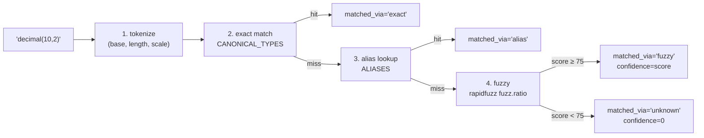

# Scripts y utilidades

> Este backend **no expone tools de LLM** — el pipeline conversacional y sus
> tools (guidelines, conversión a markdown, etc.) viven en el servicio separado
> `app-agents-modeler`. Acá solo hay scripts CLI de mantenimiento/migración y la
> lógica determinista del Excel-import.

---

## 1. Scripts (`scripts/`)

Scripts standalone que se ejecutan a mano contra Cosmos DB. Asumen
`COSMOS_CONNECTION_STRING` en el `.env` y el venv local con pymongo/Motor +
Pydantic. Se invocan como módulo desde la raíz del repo.

### 1.1 `migrate_to_project_centric.py`

**Propósito**: migración one-shot del esquema **model-centric → project-centric**
(Aurora). Transforma el esquema legacy (`models` / `model_tables` /
`model_relationships` / `model_views`, sharded por `modelId`) en el nuevo:

- Los modelos de cada proyecto se vuelven **layers** (ModelLevels) embebidos en
  el proyecto.
- El `domainCatalog` de cada modelo se vuelve **domains** a nivel proyecto
  (verticales).
- Las tablas pasan a `project_tables` (shard `projectId`), etiquetadas con
  `layer`/`domain`/`subdomain`, con sus `model_views` embebidas como `views[]` SQL.
- Las relaciones pasan a `project_relationships` con la forma anidada
  `source`/`target`/`cardinality`.
- Siembra el proyecto demo **Lakehouse** (ver §1.2).
- Purga los soft-deleted y dropea las colecciones legacy.

**Uso**:

```bash
# Preview sin escribir (igual hace backup)
python -m scripts.migrate_to_project_centric --dry-run

# Aplicar (hace backup a scripts/_backup_<ts>.json primero)
python -m scripts.migrate_to_project_centric

# Aplicar sin sembrar el demo ni purgar lo legacy
python -m scripts.migrate_to_project_centric --no-seed --no-purge
```

| Flag | Efecto |
|---|---|
| `--dry-run` | preview only, no escribe (el backup igual se toma) |
| `--no-seed` | omite el seed del demo Lakehouse |
| `--no-purge` | conserva los docs soft-deleted y las colecciones legacy |

**Idempotente**: un proyecto que ya tiene `project_tables` se salta; el seed de
Lakehouse se omite si ya existe. Siempre hace **backup** previo a
`scripts/_backup_<ts>.json` (queda fuera de git). Secuencia segura recomendada:
`--dry-run` → revisar → aplicar `--no-purge` → verificar → re-correr para purgar.

### 1.2 `seed_lakehouse.py`

**Propósito**: arma el proyecto demo **Lakehouse** — port Python de `seedModel()`
del prototipo (`newStyleWeb/Redesign/app/data.js`). Produce un proyecto completo
en el esquema project-centric:

- Layers `RDV` · `UDV` · `DDV` (engine `databricks_sql`).
- Dominios verticales `Finanzas` · `Clientes` · `Riesgo` (con owner/steward/
  sensibilidad).
- 14 tablas con relaciones FK y algunas vistas SQL por rol.

Respeta la convención de id de columna `<tableId>.<colName>` y la forma de los
endpoints de relación, verbatim del prototipo, para que el seed renderice igual
que el diseño.

**Superficie**: `build_lakehouse()` → `(project_doc, table_docs, relationship_docs)`.
El wrapping de Mongo (`projectId`, `flgactive`, timestamps) lo agrega quien lo
invoca (el script de migración). No se ejecuta solo; lo usa
`migrate_to_project_centric` (salvo `--no-seed`).

> Los scripts legacy `backfill_column_ids.py` y `prune_dangling_relationships.py`
> fueron eliminados: la safety-net de ids vive ahora en runtime
> (`canvas/repository._ensure_column_ids`) y la migración project-centric purga las
> relaciones huérfanas como parte del proceso.

---

## 2. Pipeline determinista del Excel-import (`app/features/excel_import/`)

Funciones puras que el endpoint `/api/excel-import/preview` invoca para producir
el preview. Sin LLM, sin estado entre requests.

### 2.1 `reader.read_workbook(file_stream)`

Lee un xlsx con `openpyxl` en modo read-only y devuelve `RawWorkbook`
(`sheets`, `table_descriptions`, `warnings`).

**Reglas**:
- La **primera fila de cada hoja es header** y se descarta (contrato explícito;
  sin heurística de "detectar header").
- Lectura por **posición** (A=nombre, B=tipo, C=descripción opcional).
- La hoja `tablesdescriptions` (case-insensitive) se separa y devuelve como
  `dict[name → description]`.
- Filas con celda A vacía se saltan; hojas vacías producen `warnings` (no abortan).

### 2.2 `normalizer.normalize_type(raw)`

Pipeline determinista en 4 pasos: `tokenize → exact → alias → fuzzy`.



`NormalizedType` (frozen dataclass): `canonical`, `raw`, `length`, `scale`,
`confidence` (0-100), `matched_via`.

**Por qué `fuzz.ratio` (Levenshtein puro) y no `fuzz.WRatio`**: WRatio infla el
score cuando una opción está contenida en el input (`"datatime"` contiene
`"time"` → 90 espurio). `ratio` penaliza inserciones/borrados simétricamente, lo
que corrige typos sin saltar a un tipo más corto por substring.

### 2.3 `service.parse_workbook(file_bytes)`

Orquestador puro: `read_workbook` → por hoja `_build_preview_table` (split del
nombre + `normalize_type` + match de descripción) → `ExcelPreview`. Emite
warnings por entradas de `TablesDescriptions` sin match.

Ver `doc/workflow.md` para el detalle completo del pipeline.

---

## 3. Patrón general

| Decisión | Razón |
|---|---|
| **Funciones puras, no clases** | Más fáciles de testear; sin estado entre requests. |
| **No raise sobre input degenerado** | El preview siempre se debe poder renderizar; los problemas se reportan como `warnings` o `matched_via="unknown"`. |
| **dataclasses con `slots=True`** | Estructuras intermedias rápidas y tipadas. |
| **Lecturas por posición** | Contrato estable y predecible; sin "detección mágica" de headers. |

---

## 4. Cómo agregar un alias / tipo canónico nuevo

1. **Frontend** — agregar el tipo a `web-data-model-hub/src/types/model.ts::COLUMN_DATA_TYPES`.
2. **Backend canonical** — agregar en `app/features/excel_import/normalizer.py::CANONICAL_TYPES`.
3. **Backend alias** (si aplica) — agregar en `ALIASES` solo si es un sinónimo NO
   ambiguo (las variantes con typo las atrapa el paso fuzzy).
4. **Verificar**:
   ```bash
   .venv/bin/python -c "from app.features.excel_import import normalize_type; print(normalize_type('tu_tipo_nuevo'))"
   # → matched_via='exact', confidence=100
   ```

`CANONICAL_TYPES` debe quedar alineado con `COLUMN_DATA_TYPES` del frontend.
