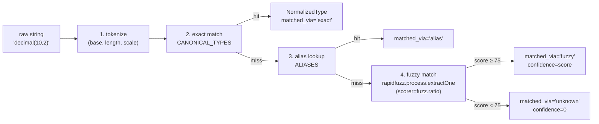

# Scripts y utilidades

> Este backend **no expone tools de LLM** — las tools de Agent Framework
> que usaba el pipeline anterior (`query_guidelines`, `get_all_guidelines`,
> `parse_excel_file`, `convert_to_markdown`) viven ahora en el servicio
> separado `app-agents-modeler`. Acá solo hay scripts CLI de mantenimiento
> y la lógica determinista del Excel-import.

---

## 1. Scripts de mantenimiento (`scripts/`)

Scripts standalone que se ejecutan a mano contra Cosmos DB. Todos
asumen que `COSMOS_CONNECTION_STRING` está en el `.env` y que el venv
local tiene Motor + Pydantic.

### 1.1 `backfill_column_ids.py`

**Propósito**: stampea un UUID en cualquier columna persistida que no
tenga `id`. Es la contraparte server-side de
`web-data-model-hub/src/lib/columnRef.ts::ensureColumnId` — corre una
sola vez como migración cuando se introdujo el `TableColumn.id` estable.

**Uso**:

```bash
.venv/bin/python -m scripts.backfill_column_ids
```

**Idempotencia**: las columnas que ya tienen `id` string no-vacío se
saltan. Se puede correr múltiples veces sin efecto.

> Aunque el script ya corrió en producción, el código del runtime
> mantiene la safety-net `models_db._ensure_column_ids` para futuros
> imports/scripts que olviden stampear ids.

### 1.2 `prune_dangling_relationships.py`

**Propósito**: elimina `RelationshipDoc` cuya `sourceColumn` /
`targetColumn` ya no apuntan a una columna existente (por ejemplo,
cuando una migración a mano borró la columna pero no la relación).

**Uso**:

```bash
.venv/bin/python -m scripts.prune_dangling_relationships
```

Hace soft-delete (`flgactive=false`) — los registros se conservan en DB
para auditoría.

---

## 2. Pipeline determinista del Excel-import (`src/excel_import/`)

No son "tools" en el sentido del Agent Framework, pero son las funciones
puras que el endpoint `/api/excel-import/preview` invoca para producir
el preview.

### 2.1 `workbook_reader.read_workbook(file_stream)`

**Archivo**: `src/excel_import/workbook_reader.py`

Lee un workbook xlsx con `openpyxl` en modo read-only y devuelve
`RawWorkbook` (dataclass):

```python
@dataclass(slots=True)
class RawWorkbook:
    sheets: list[RawSheet]
    table_descriptions: dict[str, str]
    warnings: list[str]
```

**Reglas**:

- **La primera fila de cada hoja es siempre header** y se descarta.
  Contrato explícito con el usuario — no hay heurística "detectar si la
  primera fila es header".
- Lectura por **posición** (A=nombre, B=tipo, C=descripción opcional).
  No se intenta matchear headers — el formato es estable y predecible.
- La hoja `tablesdescriptions` (match case-insensitive) se separa del
  resto y se devuelve como `dict[sheet_name -> description]`.
- Filas con celda A vacía se saltan (no tienen sentido sin nombre de
  columna).
- Hojas vacías o sin filas de datos producen una entrada en `warnings`
  pero no abortan el parse.

### 2.2 `type_normalizer.normalize_type(raw)`

**Archivo**: `src/excel_import/type_normalizer.py`

**Prototipo**:

```python
def normalize_type(raw: str | None, *, threshold: float = FUZZY_THRESHOLD) -> NormalizedType:
    ...
```

**Pipeline determinista** (4 pasos en orden fijo, sin árboles de `if`):



**`NormalizedType`** (frozen dataclass):

| Campo | Tipo | Notas |
|---|---|---|
| `canonical` | `str` | Tipo canónico final o, si `matched_via=unknown`, la base original en minúsculas. |
| `raw` | `str` | Input original sin tocar. |
| `length` | `int \| None` | Primer argumento entre paréntesis (`varchar(50)` → 50). |
| `scale` | `int \| None` | Segundo argumento (`decimal(10, 2)` → 2). |
| `confidence` | `float` | 0-100. 100 si exact/alias, score de rapidfuzz si fuzzy, 0 si unknown. |
| `matched_via` | `Literal["exact", "alias", "fuzzy", "unknown", "empty"]` | Qué paso del pipeline produjo el resultado. |

**Comportamiento ante input degenerado**:

- `normalize_type(None)` → `canonical="varchar"`, `matched_via="empty"`.
- `normalize_type("")` → idem.
- `normalize_type("   foo   ")` → `_collapse_whitespace` + lowercase, base
  `"foo"`, fuzzy → probablemente `"unknown"`.

**Por qué `fuzz.ratio` (Levenshtein puro) en lugar de `fuzz.WRatio`**:
WRatio infla el score cuando una opción está contenida en el input
(`"datatime"` contiene `"time"` → score espurio de 90). `fuzz.ratio`
penaliza inserciones y borrados simétricamente, que es lo que queremos
para corregir typos sin saltar a un tipo más corto por substring.

### 2.3 `service.parse_workbook(file_bytes)`

**Archivo**: `src/excel_import/service.py`

Orquestador puro. Pega las piezas anteriores:

```python
def parse_workbook(file_bytes: bytes) -> ExcelPreview:
    raw = read_workbook(BytesIO(file_bytes))
    tables = [_build_preview_table(sheet, raw.table_descriptions) for sheet in raw.sheets]
    warnings = list(raw.warnings)
    if raw.table_descriptions:
        _emit_unmatched_description_warnings(tables, raw.table_descriptions, warnings)
    return ExcelPreview(
        tables=tables,
        tableDescriptionsFound=bool(raw.table_descriptions),
        warnings=warnings,
    )
```

**Helpers internos**:

- `_split_sheet_name("dbo.Customer")` → `("dbo", "Customer")`.
  `"a.b.c"` → `("a", "b.c")` (solo el primer punto separa).
  `".Customer"` o `"dbo."` → `(None, raw)` (más conservador que aceptar
  schema vacío).
- `_match_table_description(sheet_name, schema, table_name, descriptions)`:
  intenta match case-insensitive en este orden:
  1. `sheet_name` exacto.
  2. `schema.table_name` reconstruido.
  3. `table_name` solo.
- `_emit_unmatched_description_warnings`: emite warnings por cada
  entrada de `TablesDescriptions` que no matcheó ninguna hoja — útil
  para detectar typos en el nombre.

---

## 3. Patrón general

Los scripts y la lógica del Excel-import comparten un par de decisiones:

| Decisión | Razón |
|---|---|
| **Funciones puras, no clases** | Más fáciles de testear. El módulo no acumula estado entre requests. |
| **No raise sobre input degenerado** | El preview siempre se debe poder renderizar. Los errores se reportan como `warnings` o como `matched_via="unknown"`. |
| **dataclasses con `slots=True`** | Estructuras intermedias rápidas y con tipos estables (`RawWorkbook`, `RawSheet`, `RawColumnRow`, `NormalizedType`). |
| **Lecturas por posición** | El contrato es estable y predecible. Sin "detección mágica" de headers que falle silenciosamente cuando el usuario renombra una columna. |

---

## 4. Cómo agregar un alias / tipo canónico nuevo

Pasos en orden:

1. **Frontend** — agregar el tipo a `web-data-model-hub/src/types/model.ts`:
   ```typescript
   export const COLUMN_DATA_TYPES = [
     // ...existentes
     'tu_tipo_nuevo',
   ] as const;
   ```
2. **Backend canonical** — agregar en
   `src/excel_import/type_normalizer.py::CANONICAL_TYPES`.
3. **Backend alias** (si aplica) — agregar en `ALIASES` solo si es un
   sinónimo NO ambiguo (`mi_tipo_alias → tu_tipo_nuevo`).
   **No** agregar variantes con typo: el paso fuzzy las atrapa solo.
4. **Verificación rápida**:
   ```bash
   .venv/bin/python -c "from src.excel_import import normalize_type; print(normalize_type('tu_tipo_nuevo'))"
   ```
   Debe devolver `matched_via='exact'` y `confidence=100`.

Si después de agregar un alias el threshold rechaza variantes razonables,
bajar `FUZZY_THRESHOLD` con cuidado y validar con casos negativos
(`foo`, `bar`, etc.) que no produzcan falsos positivos.
