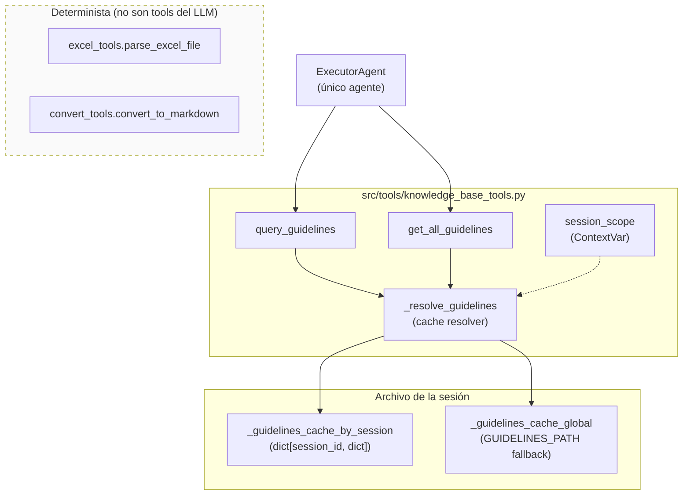
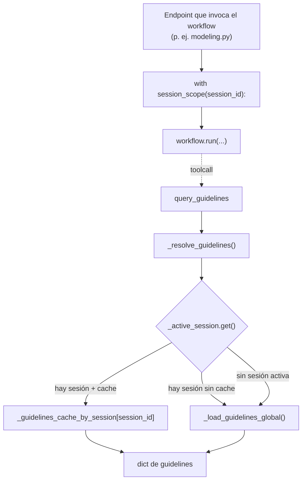

# Referencia de Tools

> Las tools son funciones decoradas con `@tool` del Microsoft Agent
> Framework. El **único agente** del sistema (`ExecutorAgent`) las
> invoca durante su ejecución para acceder a los lineamientos
> corporativos cargados por el usuario en la sesión activa.
>
> Tras el rediseño del pipeline, el inventario de tools se redujo de
> 6 → 2. Las tools de catálogo (`search_column_catalog` /
> `add_column_to_catalog`) y la tool legacy `parse_excel_file` se
> retiraron — su trabajo lo hace código Python determinista en
> `src/processing/` y `src/tools/excel_tools.py` (que ahora se invoca
> directamente desde el endpoint, no como tool).
>
> Todas las tools usan `approval_mode="never_require"` (sin
> aprobación manual del usuario por toolcall).

---

## 1. Mapa actual



---

## 2. `query_guidelines`

**Archivo**: `src/tools/knowledge_base_tools.py`
**Usada por**: `ExecutorAgent`
**Prototipo**:

```python
@tool(approval_mode="never_require")
def query_guidelines(topic: str) -> str: ...
```

### Descripción
Consulta los lineamientos corporativos de modelamiento por tema
específico. Funciona contra los guidelines de la **sesión activa**
(resueltos vía `ContextVar`); si la sesión no cargó un archivo,
cae a los globales (`GUIDELINES_PATH`).

### Parámetros

| Parámetro | Tipo | Descripción |
|-----------|------|-------------|
| `topic` | `str` | Tema a consultar. Ejemplos: `naming_conventions`, `audit_columns`, `data_type_mappings`, `primary_key_conventions`, `foreign_key_conventions`, `general_rules`. También motores: `databricks_sql`, `sqlserver`, etc. |

### Estrategia de búsqueda (cuando los guidelines son JSON)

1. **Match directo** sobre las keys del JSON (`naming_conventions`,
   `audit_columns`, etc.).
2. **Match por motor** dentro de `data_type_mappings[topic]`.
3. **Match por keywords** sustring sobre keys y JSON serializado.

### Retorno
JSON string con el subset relevante. Si nada matchea, devuelve
`{"message": "No se encontraron lineamientos para el tema: ..."}`.

### Comportamiento sobre formatos no-JSON

- **Markdown / texto plano** (`.md`, `.txt`, o `.docx` / `.pdf`
  convertidos por Docling): hace match línea-a-línea por substring.
  No es ideal — recomendable que el usuario suba el archivo en JSON
  cuando sea posible.
- **XLSX**: retorna el sheet entero como lista de dicts.

---

## 3. `get_all_guidelines`

**Archivo**: `src/tools/knowledge_base_tools.py`
**Usada por**: `ExecutorAgent`
**Prototipo**:

```python
@tool(approval_mode="never_require")
def get_all_guidelines() -> str: ...
```

### Descripción
Devuelve todos los lineamientos completos serializados en JSON. Es la
primera tool que el `ExecutorAgent` invoca al recibir un prompt — el
prompt explícitamente le pide hacerlo *una sola vez* para tener el
contexto completo y luego operar en memoria.

### Parámetros
Ninguno.

### Retorno
JSON string con el contenido completo del archivo de lineamientos
(JSON tal cual, o `{format, content}` para formatos textuales,
o `{format: "xlsx", sheets}` para Excel).

---

## 4. Resolución de guidelines (cómo encuentran el contenido)

El módulo `knowledge_base_tools.py` mantiene **dos caches** y las
combina con un `ContextVar`:



| Helper | Propósito |
|--------|-----------|
| `set_session_guidelines(session_id, dict)` | Guarda el contenido procesado al subir el archivo en `POST /conversations/{id}/guidelines`. |
| `get_session_guidelines(session_id)` | Lectura directa del cache (sin pasar por ContextVar). |
| `clear_session_guidelines(session_id)` | Limpieza al borrar la sesión (`DELETE /conversations/{id}`). |
| `session_scope(session_id)` | Context manager que setea el `ContextVar` durante la ejecución del workflow. **Imprescindible** envolver `workflow.run` con esto, sino las tools no encontrarán los guidelines de la sesión. |
| `process_guidelines_file(path)` | API pública para procesar un archivo a dict consumible. |

---

## 5. `parse_excel_file` (uso interno, ya no es tool del LLM)

**Archivo**: `src/tools/excel_tools.py`
**Usada por**: `api/routes/modeling.py` directamente (no por agentes)

### Descripción
Parsea un `.xlsx` donde **cada pestaña es una tabla** y cada fila una
columna. Es 100 % determinista — el LLM nunca toca el Excel crudo, lo
recibe ya estructurado en el prompt.

### Por qué dejó de ser tool

En el rediseño actual el endpoint extrae el Excel ANTES de invocar
el LLM y lanza un workflow por tabla. El LLM solo ve los dicts ya
parseados, así que tener `parse_excel_file` como tool sería ruido —
la dejamos como función Python invocable con `parse_excel_file.func(...)`
(`.func` es la salida del decorator `@tool`).

### Parámetros

| Parámetro | Tipo | Descripción |
|-----------|------|-------------|
| `file_path` | `str` | Ruta absoluta o relativa al `.xlsx`. |

### Retorno (JSON string)

```json
{
  "tables": [
    {
      "table_name": "Customers",
      "columns": [
        {
          "column_name": "customer_id",
          "functional_definition": "Identificador único del cliente",
          "data_type_hint": "BIGINT",
          "is_nullable": false,
          "notes": ""
        }
      ]
    }
  ],
  "total_tables": 1
}
```

### Header matching flexible

| Campo interno | Aliases reconocidos |
|---------------|---------------------|
| `column_name` | `column`, `columna`, `nombre`, `nombre_columna`, `col_name`, `field`, `campo` |
| `functional_definition` | `definicion`, `definicion_funcional`, `definition`, `descripcion`, `description`, `desc`, `funcional` |
| `data_type_hint` | `data_type`, `tipo`, `tipo_dato`, `type`, `type_hint`, `datatype` |
| `is_nullable` | `nullable`, `nulo`, `permite_nulos`, `null`, `nulable` |
| `notes` | `notas`, `observaciones`, `comentarios`, `comments`, `note` |

Si no se detecta `functional_definition` por header, asume que la
columna A del Excel es el nombre y la B la definición.

### Errores

```json
{"error": "Archivo no encontrado: ..."}
{"error": "Formato no soportado: .csv. Solo .xlsx"}
{"error": "No se encontraron tablas válidas en el archivo Excel."}
```

---

## 6. `convert_to_markdown` (uso interno)

**Archivo**: `src/tools/convert_tools.py`
**Usada por**: `knowledge_base_tools._process_guidelines_path` cuando
recibe `.docx` o `.pdf`

### Descripción
Convierte documentos `.pdf` o `.docx` a Markdown estructurado usando
Docling. Implementa caché en disco: si el archivo de origen no cambió
desde la última conversión (mismo `mtime`), reutiliza el `.md`
generado al lado del original.

### Parámetros

| Parámetro | Tipo | Descripción |
|-----------|------|-------------|
| `file_path` | `str` | Ruta al `.pdf` o `.docx`. |

### Retorno
String con el Markdown convertido. Si la conversión falla, devuelve
un mensaje de error sin lanzar excepción (las tools no propagan
excepciones — el LLM tiene que poder leer el resultado).

### Por qué no es tool del LLM en el flujo actual

`convert_to_markdown` se ejecuta automáticamente cuando el upload de
guidelines detecta `.pdf` / `.docx`. El LLM ya recibe el contenido
en formato Markdown a través de `query_guidelines` /
`get_all_guidelines`, sin necesidad de invocar la conversión él
mismo.

---

## 7. Diferencias con el pipeline anterior

| Item | Antes | Ahora |
|------|-------|-------|
| Agentes | `ExecutorAgent` + `QAValidatorAgent` + `ConversationalAgent` | solo `ExecutorAgent` |
| Tools por agente | 3 + 5 + 1 (9 tools en total) | 2 |
| `parse_excel_file` | tool del `ConversationalAgent` | función Python en el endpoint |
| `search_column_catalog` | tool del QA agent (Jaccard sobre JSON) | retirada — sustituida por vector search en `build_prompt` |
| `add_column_to_catalog` | tool del QA agent | retirada (catalog upsert se hace fuera del camino caliente) |
| `convert_to_markdown` | tool del Executor / QA | helper interno, ejecutado al subir guidelines |

El criterio del rediseño: **lo determinista NO debe ser tool**.
Cada toolcall paga latencia (ida y vuelta al LLM) y consume tokens
del rate limiter. Cuando el resultado de la tool es totalmente
predictible (como parsear un Excel) sale más barato resolverlo en
código Python y meter el output como contexto del prompt.
