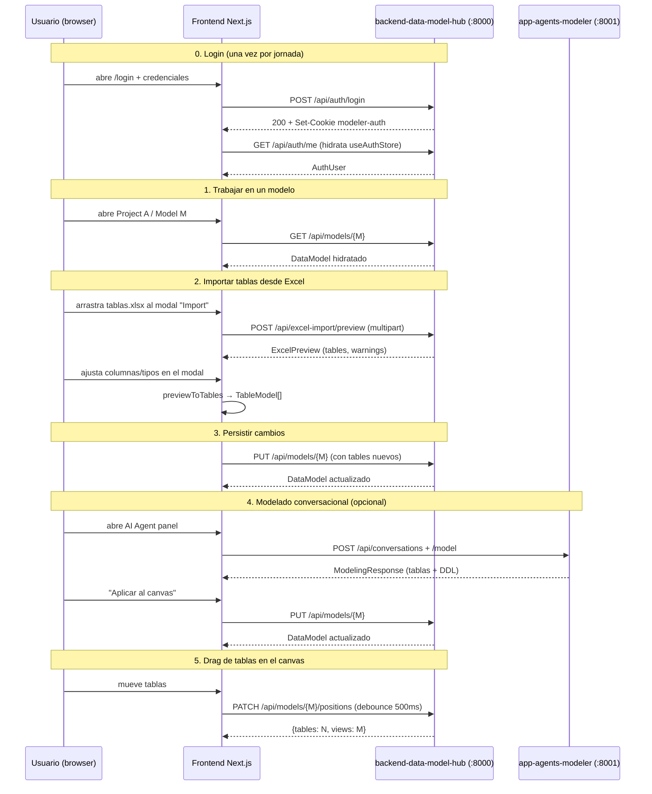

# Guía de uso

> Este backend se opera **exclusivamente como API HTTP**. Toda la
> interacción real ocurre desde el frontend Next.js o llamando directo
> a los endpoints REST con `curl` / Postman / etc.

---

## 1. Arrancar el servidor

### Desarrollo

```bash
# 1. Crear venv con Python 3.12 (una sola vez)
/opt/homebrew/bin/python3.12 -m venv .venv
source .venv/bin/activate
pip install -r requirements.txt

# 2. Configurar .env (ver doc/configuration.md)
cp .env.example .env
$EDITOR .env
# Variables críticas: COSMOS_CONNECTION_STRING + AUTH_SECRET

# 3. Arrancar con autoreload
uvicorn api.main:app --host 0.0.0.0 --port 8000 --reload
# o equivalente:
python -m api.main
```

Por defecto escucha en `0.0.0.0:8000`. La OpenAPI auto-generada queda en
`http://localhost:8000/docs`.

### Verificación rápida

```bash
curl http://localhost:8000/api/health
```

Respuesta esperada:

```json
{
  "status": "ok",
  "version": "1.0.0",
  "db_connected": true
}
```

Si `db_connected: false`, los endpoints que toquen Cosmos devuelven 500.
Verifica `COSMOS_CONNECTION_STRING` en `.env` y reiniciá el proceso.

---

## 2. Flujo end-to-end típico (desde el frontend)



---

## 3. Llamadas con `curl` (para diagnóstico)

> Todos los ejemplos asumen que ya hiciste login y tenés `cookies.txt`
> con el cookie `modeler-auth`.

### 3.1 Health

```bash
curl http://localhost:8000/api/health
```

### 3.2 Auth

```bash
# Login (escribe el cookie en cookies.txt)
curl -c cookies.txt -X POST http://localhost:8000/api/auth/login \
  -H 'Content-Type: application/json' \
  -d '{"username":"admin","password":"dogadmin2019"}'

# Quién soy
curl -b cookies.txt http://localhost:8000/api/auth/me

# Logout
curl -b cookies.txt -X POST http://localhost:8000/api/auth/logout
```

### 3.3 Proyectos

```bash
# Listar proyectos visibles para el usuario
curl -b cookies.txt http://localhost:8000/api/projects

# Crear proyecto (admin only)
curl -b cookies.txt -X POST http://localhost:8000/api/projects \
  -H 'Content-Type: application/json' \
  -d '{"name":"Sales","description":"Sales analytics"}'

# Detalle (con permisos)
curl -b cookies.txt http://localhost:8000/api/projects/<uuid>

# Actualizar (edit access)
curl -b cookies.txt -X PUT http://localhost:8000/api/projects/<uuid> \
  -H 'Content-Type: application/json' \
  -d '{"description":"Updated description"}'

# Borrar (admin only — cascade a modelos)
curl -b cookies.txt -X DELETE http://localhost:8000/api/projects/<uuid>
```

### 3.4 Modelos

```bash
# Listar modelos de un proyecto (lightweight, solo count de tablas)
curl -b cookies.txt 'http://localhost:8000/api/models?projectId=<uuid>'

# Listar con tablas/relationships/views completos
curl -b cookies.txt 'http://localhost:8000/api/models?projectId=<uuid>&full=true'

# Modelo hidratado por id
curl -b cookies.txt http://localhost:8000/api/models/<modelId>

# Crear modelo
curl -b cookies.txt -X POST http://localhost:8000/api/models \
  -H 'Content-Type: application/json' \
  -d '{
        "projectId": "<projectUuid>",
        "name": "My Model",
        "engine": "postgresql",
        "tables": [],
        "relationships": [],
        "views": [],
        "domainCatalog": []
      }'

# Actualizar (PUT parcial)
curl -b cookies.txt -X PUT http://localhost:8000/api/models/<modelId> \
  -H 'Content-Type: application/json' \
  -d '{"name":"Renamed Model"}'

# Patch de posiciones (solo el campo position)
curl -b cookies.txt -X PATCH http://localhost:8000/api/models/<modelId>/positions \
  -H 'Content-Type: application/json' \
  -d '{
        "tables": {
          "<tableId-1>": {"x": 100, "y": 200},
          "<tableId-2>": {"x": 500, "y": 200}
        }
      }'

# Soft-delete
curl -b cookies.txt -X DELETE http://localhost:8000/api/models/<modelId>
```

### 3.5 Excel-import

```bash
# Preview de un workbook
curl -b cookies.txt -X POST http://localhost:8000/api/excel-import/preview \
  -F "file=@./tablas.xlsx"
```

Response:

```json
{
  "success": true,
  "data": {
    "tables": [
      {
        "sheetName": "dbo.Customer",
        "schema": "dbo",
        "name": "Customer",
        "description": "Clientes B2B",
        "columns": [
          {
            "name": "id",
            "dataType": "bigint",
            "rawDataType": "BIGINT",
            "length": null,
            "scale": null,
            "functionalDefinition": "Identificador único",
            "typeConfidence": 100,
            "typeMatchedVia": "exact"
          },
          {
            "name": "amount",
            "dataType": "decimal",
            "rawDataType": "decximam(10,2)",
            "length": 10,
            "scale": 2,
            "functionalDefinition": "Monto",
            "typeConfidence": 87,
            "typeMatchedVia": "fuzzy"
          }
        ]
      }
    ],
    "tableDescriptionsFound": true,
    "warnings": []
  }
}
```

### 3.6 Admin de usuarios

```bash
# Listar usuarios (admin only)
curl -b cookies.txt http://localhost:8000/api/admin/users

# Crear usuario
curl -b cookies.txt -X POST http://localhost:8000/api/admin/users \
  -H 'Content-Type: application/json' \
  -d '{
        "username": "alice",
        "password": "s3cret123",
        "role": "editor",
        "isActive": true,
        "permissions": [
          {"scope": "project", "projectId": "<uuid>", "level": "edit"}
        ]
      }'

# Actualizar (password queda con el actual si se omite)
curl -b cookies.txt -X PUT http://localhost:8000/api/admin/users/<userId> \
  -H 'Content-Type: application/json' \
  -d '{"isActive": false}'

# Hard-delete (no se puede borrar uno mismo)
curl -b cookies.txt -X DELETE http://localhost:8000/api/admin/users/<userId>
```

---

## 4. Formato del Excel para `/api/excel-import/preview`

### 4.1 Reglas

- **Cada hoja es una tabla**. El nombre de la hoja puede llevar schema
  con el separador `.`:
  - `dbo.Customer` → schema=`dbo`, table=`Customer`
  - `Customer` → schema=`None`, table=`Customer`
  - `a.b.c` → schema=`a`, table=`b.c` (solo el primer `.` separa)
- **La primera fila es header obligatoria** (se descarta).
- **Lectura por posición** dentro de cada hoja:

| Columna A | Columna B | Columna C |
|---|---|---|
| nombre de la columna | tipo de dato (con o sin parámetros) | descripción funcional (opcional) |

Ejemplo:

| (A) name | (B) type | (C) description |
|---|---|---|
| customer_id | BIGINT | Identificador único |
| full_name | VARCHAR(120) | Nombre completo |
| amount | decimal(10, 2) | Monto de la operación |
| created_at | timestamp | Fecha de creación |

### 4.2 Hoja opcional `TablesDescriptions`

Si existe (case-insensitive: `TablesDescriptions`, `tablesdescriptions`,
etc.), el backend la lee y matchea cada fila con la tabla correspondiente:

| TableName | TableDescription |
|---|---|
| dbo.Customer | Clientes B2B con datos de facturación |
| Order | Cabecera de órdenes de venta |

Estrategia de match (case-insensitive, en orden):
1. `sheetName` exacto.
2. `schema.table_name` reconstruido.
3. `table_name` solo.

Si una entrada de `TablesDescriptions` no matchea ninguna hoja, el
backend la reporta en `warnings` para que el usuario detecte el typo.

### 4.3 Normalización de tipos

| Input del usuario | Resultado |
|---|---|
| `BIGINT` | `bigint` (matched_via=`exact`) |
| `int` | `integer` (matched_via=`alias`) |
| `decimal(10, 2)` | `decimal`, length=10, scale=2 (matched_via=`exact`) |
| `VARCHAR(50)` | `varchar`, length=50 (matched_via=`exact`) |
| `decximam(10,2)` | `decimal`, length=10, scale=2 (matched_via=`fuzzy`, confidence≈86) |
| `datatime` | `datetime` (matched_via=`fuzzy`) |
| `variant` (Snowflake-only) | `variant` (matched_via=`unknown`, confidence=0) |
| `(vacío)` | `varchar` (matched_via=`empty`) |

Los `unknown` no rompen el import — el frontend los pinta con badge
naranja y el usuario corrige en el modal antes de aplicar al canvas.

---

## 5. Operación: monitorear errores

### Logging estructurado

`LOG_FORMAT=json` produce una línea por evento, ideal para Loki /
Datadog / cualquier colector de logs:

```json
{"level":"info","time":"...","logger":"api.main","message":"request started","request_id":"a1b2c3d4e5f6","method":"POST","path":"/api/excel-import/preview"}
{"level":"info","time":"...","logger":"api.main","message":"request completed","request_id":"a1b2c3d4e5f6","method":"POST","path":"/api/excel-import/preview","status":200,"ms":143}
```

Eventos clave para alertar:

| Mensaje | Cuándo aparece |
|---|---|
| `motor db connection failed` | En lifespan, Cosmos DB no responde |
| `request crashed` | Un handler levantó excepción no controlada |
| `excel parse failed` | openpyxl falló al abrir el archivo (probablemente corrupto) |

El `X-Request-ID` que se devuelve en el response permite buscar el
request en los logs sin ambigüedad.

---

## 6. Troubleshooting

### "Login se queda colgado / 401 silencioso"

Causa típica: `AUTH_SECRET` distinto entre el `.env` del frontend y el
del backend.

**Verifica**:

```bash
grep -E '^AUTH_SECRET' web-data-model-hub/.env backend-data-model-hub/.env
```

Ambos valores deben ser idénticos. Si uno está vacío y el otro custom,
se rompe.

### `403 Forbidden` en `/api/projects/{id}`

El usuario está autenticado pero no tiene `permissions` con `projectId`
igual al proyecto solicitado. Como admin, edita los permisos en
`/admin/users` o, si no podés entrar al frontend, asigna manualmente en
Cosmos DB:

```javascript
db.users.updateOne(
  { username: "<user>" },
  { $push: { permissions: { scope: "project", projectId: "<uuid>", level: "edit" } } }
)
```

### `500` en cualquier endpoint que toque DB

`GET /api/health` → `db_connected: false`. La causa es que Motor no
pudo conectar a Cosmos. Verifica en este orden:

1. `COSMOS_CONNECTION_STRING` está completo (incluye `tls=true` y
   `authMechanism=SCRAM-SHA-256`).
2. La IP del servidor está habilitada en el firewall de Cosmos DB
   (vCore).
3. La connection string no expiró (rotación de keys).

Después de corregir, **reiniciá el proceso** — la conexión se intenta
solo en el lifespan.

### `400 Could not parse Excel file: ...` en el preview

Causas comunes:
- El archivo está corrupto o no es un xlsx real (rename de `.csv` a `.xlsx`).
- El archivo está protegido con contraseña.
- El archivo es xlsb (Excel binario) — no soportado por openpyxl.

Solución: re-exportar desde Excel como `.xlsx` "estándar".

### `413 File too large`

Tope hardcodeado: 10 MB en `api/routes/excel_import.py::_MAX_UPLOAD_BYTES`.
Un xlsx normal con decenas de miles de columnas pesa mucho menos — si
estás chocando este límite, probablemente el archivo tiene imágenes /
datos embedded que conviene limpiar.

### Bootstrap admin no aparece en DB

El bootstrap se dispara solo en el handler de `/api/auth/login`. Si
nunca llamaste al endpoint, el admin no existe todavía. Hacé un login
con `admin / dogadmin2019` y se crea en ese mismo request.
