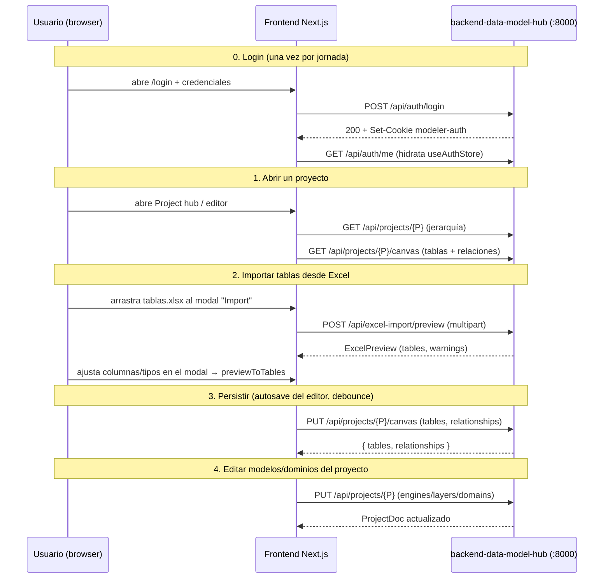

# Guía de uso

> Este backend se opera **exclusivamente como API HTTP**. Toda la
> interacción real ocurre desde el frontend Next.js o llamando directo
> a los endpoints REST con `curl` / Postman / etc.

---

## 1. Arrancar el servidor

### Desarrollo

```bash
# 1. Crear venv con Python 3.12 (una sola vez)
/opt/homebrew/bin/python3.12 -m venv .venv
source .venv/bin/activate
pip install -r requirements.txt

# 2. Configurar .env (ver doc/configuration.md)
cp .env.example .env
$EDITOR .env
# Variables críticas: COSMOS_CONNECTION_STRING + AUTH_SECRET

# 3. Arrancar con autoreload
uvicorn api.main:app --host 0.0.0.0 --port 8000 --reload
# o equivalente:
python -m api.main
```

Por defecto escucha en `0.0.0.0:8000`. La OpenAPI auto-generada queda en
`http://localhost:8000/docs`.

### Verificación rápida

```bash
curl http://localhost:8000/api/health
# → {"status":"ok","version":"1.0.0","db_connected":true}
```

Si `db_connected: false`, los endpoints que toquen Cosmos devuelven 500.
Verifica `COSMOS_CONNECTION_STRING` en `.env` y reiniciá el proceso.

---

## 2. Mapa de endpoints

| Método | Ruta | Auth | Qué hace |
|---|---|---|---|
| GET | `/api/health` | público | liveness + `db_connected` |
| POST | `/api/auth/login` | público | login → `Set-Cookie modeler-auth` |
| POST | `/api/auth/logout` | público | limpia la cookie |
| GET | `/api/auth/me` | cookie | usuario actual (401 si no hay sesión) |
| GET | `/api/projects` | sesión | proyectos visibles (filtrado por permisos) |
| POST | `/api/projects` | **admin** | crea proyecto (+ engines/layers/domains opcionales) |
| GET | `/api/projects/{id}` | view | proyecto con su jerarquía embebida |
| PUT | `/api/projects/{id}` | edit | actualiza nombre/descr y **engines/layers/domains** |
| DELETE | `/api/projects/{id}` | **admin** | soft-delete + cascade al canvas |
| GET | `/api/projects/{id}/canvas` | view | `{ tables, relationships }` hidratado |
| PUT | `/api/projects/{id}/canvas` | edit | reemplaza tablas y/o relaciones en bloque |
| PATCH | `/api/projects/{id}/positions` | edit | persiste posiciones `{tableId: {x,y}}` |
| GET | `/api/admin/users` | **admin** | lista usuarios |
| POST/PUT/DELETE | `/api/admin/users[/{id}]` | **admin** | CRUD usuarios + permisos |
| POST | `/api/excel-import/preview` | sesión | preview normalizado de un `.xlsx` |

> No hay `/api/models*`: el canvas del proyecto reemplazó a la antigua
> colección `models`.

---

## 3. Flujo end-to-end típico (desde el frontend)



---

## 4. Llamadas con `curl` (para diagnóstico)

> Los ejemplos asumen un `cookies.txt` con el cookie `modeler-auth`.

### 4.1 Auth

```bash
# Login (escribe el cookie en cookies.txt)
curl -c cookies.txt -X POST http://localhost:8000/api/auth/login \
  -H 'Content-Type: application/json' \
  -d '{"username":"admin","password":"dogadmin2019"}'

curl -b cookies.txt http://localhost:8000/api/auth/me
curl -b cookies.txt -X POST http://localhost:8000/api/auth/logout
```

### 4.2 Proyectos

```bash
# Listar proyectos visibles
curl -b cookies.txt http://localhost:8000/api/projects

# Crear proyecto (admin) — engines/layers/domains opcionales
curl -b cookies.txt -X POST http://localhost:8000/api/projects \
  -H 'Content-Type: application/json' \
  -d '{"name":"Lakehouse","description":"Repo de datos","engines":["databricks_sql"]}'

# Detalle (incluye layers/domains embebidos)
curl -b cookies.txt http://localhost:8000/api/projects/<uuid>

# Actualizar jerarquía (niveles + dominios)
curl -b cookies.txt -X PUT http://localhost:8000/api/projects/<uuid> \
  -H 'Content-Type: application/json' \
  -d '{
        "layers":[
          {"id":"rdv","name":"RDV","full":"Raw Data Vault","color":"#0e7490","order":0,"engine":"databricks_sql"},
          {"id":"udv","name":"UDV","full":"Unified Data Vault","color":"#4f46e5","order":1}
        ],
        "domains":[
          {"id":"finanzas","name":"Finanzas","color":"#0d9488","owner":"M. Torres",
           "sensitivity":"Confidential","subdomains":["Tarjetas","Savings"],"layers":["rdv","udv"]}
        ]
      }'

# Borrar (admin — cascade al canvas)
curl -b cookies.txt -X DELETE http://localhost:8000/api/projects/<uuid>
```

### 4.3 Canvas (tablas + relaciones)

```bash
# Hidratar el canvas
curl -b cookies.txt http://localhost:8000/api/projects/<uuid>/canvas

# Reemplazar tablas + relaciones en bloque
curl -b cookies.txt -X PUT http://localhost:8000/api/projects/<uuid>/canvas \
  -H 'Content-Type: application/json' \
  -d '{
        "tables":[
          {"id":"t1","schema":"rdv","name":"h_cliente","layer":"rdv","domain":"finanzas",
           "columns":[{"id":"c1","name":"id_cliente","dataType":"bigint","isPrimaryKey":true}],
           "views":[]}
        ],
        "relationships":[]
      }'

# Persistir posiciones del canvas (endpoint liviano)
curl -b cookies.txt -X PATCH http://localhost:8000/api/projects/<uuid>/positions \
  -H 'Content-Type: application/json' \
  -d '{"tables":{"t1":{"x":120,"y":80}}}'
```

### 4.4 Excel-import

```bash
curl -b cookies.txt -X POST http://localhost:8000/api/excel-import/preview \
  -F "file=@./tablas.xlsx"
```

Response (resumen):

```json
{
  "success": true,
  "data": {
    "tables": [{
      "sheetName": "dbo.Customer", "schema": "dbo", "name": "Customer",
      "description": "Clientes B2B",
      "columns": [
        {"name":"id","dataType":"bigint","rawDataType":"BIGINT","typeConfidence":100,"typeMatchedVia":"exact"},
        {"name":"amount","dataType":"decimal","rawDataType":"decximam(10,2)","length":10,"scale":2,"typeConfidence":87,"typeMatchedVia":"fuzzy"}
      ]
    }],
    "tableDescriptionsFound": true,
    "warnings": []
  }
}
```

### 4.5 Admin de usuarios

```bash
curl -b cookies.txt http://localhost:8000/api/admin/users

# Crear usuario con permiso por PROYECTO
curl -b cookies.txt -X POST http://localhost:8000/api/admin/users \
  -H 'Content-Type: application/json' \
  -d '{
        "username":"alice","password":"s3cret123","role":"editor","isActive":true,
        "permissions":[{"projectId":"<uuid>","level":"edit"}]
      }'

# Actualizar (password queda igual si se omite)
curl -b cookies.txt -X PUT http://localhost:8000/api/admin/users/<userId> \
  -H 'Content-Type: application/json' -d '{"isActive": false}'

# Hard-delete (no se puede borrar uno mismo)
curl -b cookies.txt -X DELETE http://localhost:8000/api/admin/users/<userId>
```

---

## 5. Formato del Excel para `/api/excel-import/preview`

### 5.1 Reglas

- **Cada hoja es una tabla**. El nombre de la hoja puede llevar schema con `.`:
  `dbo.Customer` → schema=`dbo`, table=`Customer`; `a.b.c` → `("a","b.c")`
  (solo el primer `.` separa).
- **La primera fila es header obligatoria** (se descarta).
- **Lectura por posición**: A=nombre, B=tipo (con o sin paréntesis), C=descripción (opcional).

| (A) name | (B) type | (C) description |
|---|---|---|
| customer_id | BIGINT | Identificador único |
| amount | decimal(10, 2) | Monto de la operación |

### 5.2 Hoja opcional `TablesDescriptions`

Si existe (case-insensitive), el backend la lee y matchea cada fila con su tabla
(por `sheetName`, `schema.table` o `table`). Las entradas sin match se reportan
en `warnings`.

### 5.3 Normalización de tipos

| Input | Resultado |
|---|---|
| `BIGINT` | `bigint` (exact) |
| `int` | `integer` (alias) |
| `decimal(10, 2)` | `decimal`, len=10, scale=2 (exact) |
| `decximam(10,2)` | `decimal` (fuzzy, conf≈86) |
| `variant` (Snowflake) | `variant` (unknown, conf=0) |
| `(vacío)` | `varchar` (empty) |

Los `unknown` no rompen el import — el usuario corrige en el modal antes de
aplicar al canvas. Ver `doc/workflow.md`.

---

## 6. Operación: monitorear errores

`LOG_FORMAT=json` produce una línea por evento (ideal para Loki / Datadog). Cada
request loguea inicio/fin con `request_id` (también devuelto en `X-Request-ID`).

| Mensaje | Cuándo aparece |
|---|---|
| `motor db connection failed` | En lifespan: Cosmos no responde |
| `request crashed` | Un handler levantó excepción no controlada |
| `excel parse failed` | openpyxl falló (archivo corrupto / protegido) |

---

## 7. Troubleshooting

### "Login se queda colgado / 401 silencioso"
Causa típica: `AUTH_SECRET` distinto entre los dos `.env`.

```bash
grep -E '^AUTH_SECRET' web-data-model-hub/.env backend-data-model-hub/.env
```

Ambos valores deben ser idénticos.

### `403 Forbidden` en `/api/projects/{id}` (o su canvas)
El usuario está autenticado pero no tiene un `permissions` con ese `projectId`.
Como admin, asignalo en `/admin/users`, o directo en Cosmos:

```javascript
db.users.updateOne(
  { username: "<user>" },
  { $push: { permissions: { projectId: "<uuid>", level: "edit" } } }
)
```

### `500` en cualquier endpoint que toque DB
`GET /api/health` → `db_connected: false`. Verifica, en orden:
1. `COSMOS_CONNECTION_STRING` completo (incluye `tls=true` y `authMechanism=SCRAM-SHA-256`).
2. La IP del servidor habilitada en el firewall de Cosmos (vCore).
3. La connection string no expiró (rotación de keys).

Después de corregir, **reiniciá el proceso** (la conexión se intenta solo en el lifespan).

### `400 Could not parse Excel file: ...`
Archivo corrupto, protegido con contraseña, o `.xlsb` (no soportado por openpyxl).
Re-exportar como `.xlsx` estándar.

### Bootstrap admin no aparece en DB
Se dispara solo en el handler de `/api/auth/login`. Hacé un login con
`admin / dogadmin2019` y se crea en ese mismo request.
