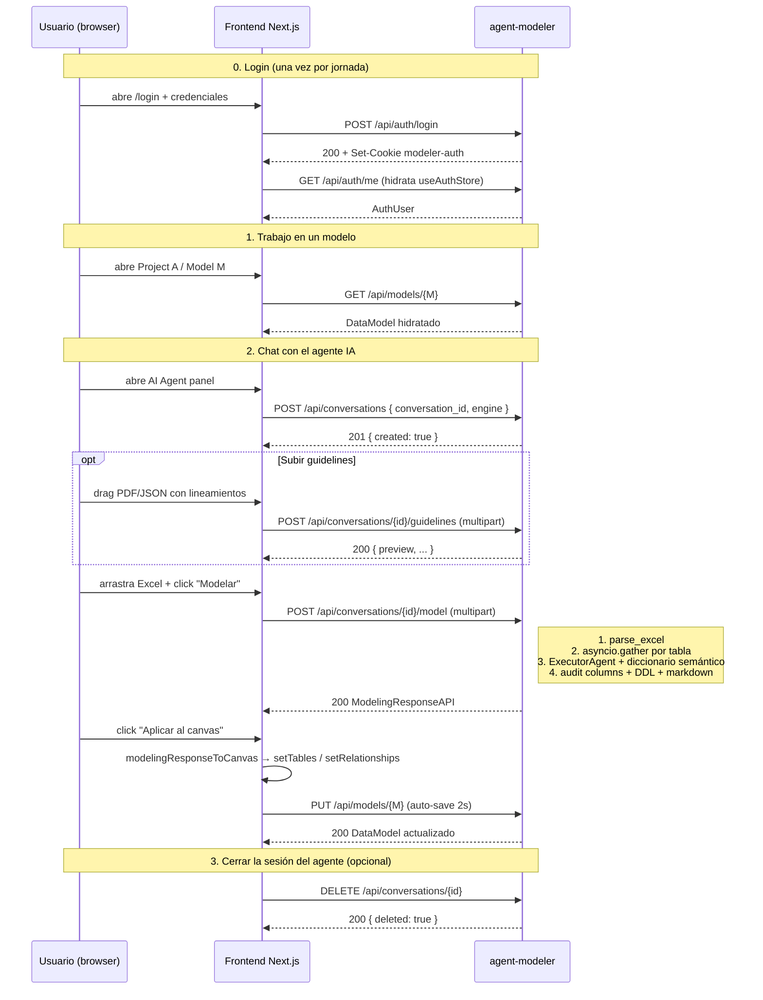

# Guía de Uso

> El backend `agent-modeler` se opera **exclusivamente como API HTTP**.
> El CLI legacy (`python -m src.main`) fue retirado del flujo principal
> en el rediseño. Toda la interacción real ocurre desde el frontend
> Next.js o llamando directo a los endpoints REST.

---

## 1. Arrancar el servidor

### Desarrollo

```bash
# 1. Crear venv y dependencias (una sola vez)
python3.12 -m venv .venv
source .venv/bin/activate
pip install -r requirements.txt

# 2. Configurar .env (ver doc/configuration.md)
cp .env.example .env
$EDITOR .env

# 3. Arrancar FastAPI con autoreload
python -m api.main
```

Por defecto escucha en `0.0.0.0:8000`. La docs OpenAPI queda en
`http://localhost:8000/docs`.

### Verificación rápida

```bash
curl http://localhost:8000/api/health
```

Respuesta esperada:

```json
{
  "status": "ok",
  "version": "2.0.0",
  "foundry_connected": true,
  "default_engine": "databricks_sql",
  "active_conversations": 0
}
```

Si `foundry_connected: false`, el resto de los endpoints LLM responde
503 — verifica las variables de Service Principal y `FOUNDRY_*` en
`.env`.

---

## 2. Flujo end-to-end típico (desde el frontend)



---

## 3. Llamadas con `curl` (para diagnóstico)

> Todos los ejemplos asumen que ya hiciste login y tienes `cookies.txt`
> con el cookie `modeler-auth`. Para crear el cookie:
>
> ```bash
> curl -c cookies.txt -X POST http://localhost:8000/api/auth/login \
>   -H 'Content-Type: application/json' \
>   -d '{"username":"admin","password":"dogadmin2019"}'
> ```

### 3.1 Health

```bash
curl http://localhost:8000/api/health
curl http://localhost:8000/api/engines
```

### 3.2 Auth

```bash
# Login (escribe el cookie en cookies.txt)
curl -c cookies.txt -X POST http://localhost:8000/api/auth/login \
  -H 'Content-Type: application/json' \
  -d '{"username":"admin","password":"dogadmin2019"}'

# Quién soy
curl -b cookies.txt http://localhost:8000/api/auth/me

# Logout
curl -b cookies.txt -X POST http://localhost:8000/api/auth/logout
```

### 3.3 Proyectos y modelos

```bash
# Listar proyectos visibles para el usuario
curl -b cookies.txt http://localhost:8000/api/projects

# Crear proyecto (admin only)
curl -b cookies.txt -X POST http://localhost:8000/api/projects \
  -H 'Content-Type: application/json' \
  -d '{"name":"Sales","description":"Sales analytics"}'

# Listar modelos de un proyecto
curl -b cookies.txt 'http://localhost:8000/api/models?projectId=<uuid>'

# Modelo hidratado (tablas + relationships + views)
curl -b cookies.txt http://localhost:8000/api/models/<modelId>
```

### 3.4 Conversación + modelado

```bash
# Generar UUID v4 (usa el comando que prefieras)
CID=$(uuidgen | tr 'A-Z' 'a-z')

# Crear conversación
curl -b cookies.txt -X POST http://localhost:8000/api/conversations \
  -H 'Content-Type: application/json' \
  -d "{\"conversation_id\":\"${CID}\",\"engine\":\"databricks_sql\"}"

# Subir guidelines (opcional, recomendado)
curl -b cookies.txt -X POST \
  "http://localhost:8000/api/conversations/${CID}/guidelines" \
  -F "file=@./mis-guidelines.json"

# Lanzar el modelado a partir de un Excel
curl -b cookies.txt -X POST \
  "http://localhost:8000/api/conversations/${CID}/model" \
  -F "excel_file=@./tablas.xlsx" \
  -F "engine=databricks_sql"

# Releer el último modelo sin reejecutar el LLM
curl -b cookies.txt "http://localhost:8000/api/conversations/${CID}/model"

# Cerrar la conversación
curl -b cookies.txt -X DELETE "http://localhost:8000/api/conversations/${CID}"
```

---

## 4. Formato del Excel de input

Una pestaña por tabla. Cabeceras flexibles (ver `tools.md::parse_excel_file`).
Mínimo viable: columna A = nombre, columna B = tipo, columna C =
definición funcional.

| Columna A | Columna B | Columna C |
|-----------|-----------|-----------|
| customer_id | BIGINT | Identificador único del cliente |
| full_name | VARCHAR | Nombre completo del cliente |
| email | VARCHAR | Correo electrónico de contacto |
| signup_date | TIMESTAMP | Fecha de alta en el sistema |

> El `column_name` del Excel es **provisional**: el agente lo convierte
> al nombre físico final aplicando las convenciones de los guidelines
> (snake_case, prefijos, longitud máxima, etc.) y, si la definición
> funcional matchea con alta similitud al diccionario semántico
> histórico, **fuerza el reuso del nombre canónico** del catálogo.

---

## 5. Operación: monitorear concurrencia y errores

### Logging estructurado

`LOG_FORMAT=json` produce una línea por evento, ideal para Loki /
Datadog / cualquier colector de logs:

```json
{"level":"info","time":"...","logger":"api.main","message":"request started","request_id":"a1b2c3d4e5f6","method":"POST","path":"/api/conversations/.../model","conversation_id":"550e..."}
{"level":"info","time":"...","logger":"src.api.modeling","message":"excel parsed","conversation_id":"550e...","tables_parsed":3,"total_columns":42}
{"level":"info","time":"...","logger":"src.api.modeling","message":"table modelled","conversation_id":"550e...","table_input":"Customers","table_output":"tbl_customers","cols_in":15,"cols_out":18,"ms":4123}
{"level":"info","time":"...","logger":"src.api.modeling","message":"pipeline finished","conversation_id":"550e...","turn":1,"engine":"databricks_sql","ms":11542,"tables_in":3,"tables_out":3,"failed":0}
```

Eventos clave para alertar:

| Mensaje | Cuándo aparece |
|---------|----------------|
| `motor db connection failed` | en lifespan, Cosmos DB no responde |
| `foundry connection failed` | en lifespan, Foundry no responde |
| `rate limit reached, waiting` | el rate limiter se quedó sin cupo en la ventana |
| `rate limit hit, retrying` | Foundry devolvió 429, vamos a reintentar |
| `rate limit retries exhausted` | Foundry siguió devolviendo 429 tras N reintentos — la tabla falló |
| `table workflow raised` / `table workflow returned error` | una tabla particular dentro del turno falló — el response sigue con las que sí salieron |

### Métricas operativas mínimas (sin instrumentación formal)

Se obtienen contando sobre los logs:

- **Latencia por tabla**: `ms` en el evento `table modelled`.
- **Latencia por turno**: `ms` en `pipeline finished`.
- **% turnos con fallos parciales**: `failed > 0` en `pipeline finished`.
- **Saturación del rate limiter**: frecuencia de `rate limit reached, waiting`.

---

## 6. Troubleshooting

### "Login se queda colgado"

Causa típica: `AUTH_SECRET` distinto entre el `.env` del frontend y el
del backend. El cookie firmado por uno no se valida con el otro y
cada request termina en 401 silencioso.

**Verifica**:

```bash
grep -E '^AUTH_SECRET' web-data-model-hub/.env agent-modeler/.env
```

Ambos valores deben ser idénticos. Si uno está vacío, ambos caen al
fallback dev y funcionará — pero si uno está custom y el otro no,
se rompe.

### `403 Forbidden` en `/api/projects`

El usuario está autenticado pero no tiene `permissions` con
`projectId` igual al proyecto solicitado. Como admin, edita los
permisos en `/admin/users` o, si no podés entrar al frontend,
asigna manualmente en Cosmos DB:

```javascript
db.users.updateOne(
  { username: "<user>" },
  { $push: { permissions: { scope: "project", projectId: "<uuid>", level: "edit" } } }
)
```

### `503 Azure AI Foundry no está conectado`

`get_chat_client` falla en lifespan y el endpoint detecta `app.state.chat_client = None`.

**Verifica** en este orden:

1. `FOUNDRY_PROJECT_ENDPOINT` apunta a un proyecto válido.
2. El Service Principal (`APP_AZURE_*`) tiene rol sobre el recurso.
3. La red del servidor permite hablar a `*.services.ai.azure.com`.

Reiniciar el proceso reintenta la conexión.

### Modelado devuelve `500: Ninguna tabla pudo ser modelada`

Todas las tablas fallaron en paralelo. Posibles causas (ver logs):

- **429 sostenido**: bajar `LLM_RPM_CAP` o `PER_TABLE_PARALLELISM`.
- **Excel mal formateado**: el log `excel parsed` tiene
  `tables_parsed=0` → no se reconocieron columnas válidas en ninguna
  pestaña.
- **Token quota agotado**: el LLM responde con un error que `_is_rate_limit_error`
  no detecta. Subir `LOG_LEVEL=DEBUG` revela el mensaje original.

### `422` al crear conversación con `conversation_id` no UUID

El frontend envía algo que no es un UUID v4 estricto. Usa
`crypto.randomUUID()` (browser) o `uuid.uuid4()` (server). El backend
valida con regex.

### El agente "olvida" los guidelines del turno anterior

El cache vive **solo en memoria del proceso** y por sesión. Si el
backend se reinicia, las guidelines se pierden y el frontend debe
volver a subirlas. La sesión sigue viva mientras el proceso esté
arriba (no hay TTL hoy — cualquiera puede agregar uno con un
`asyncio.create_task` periódico que limpie sesiones muertas).
