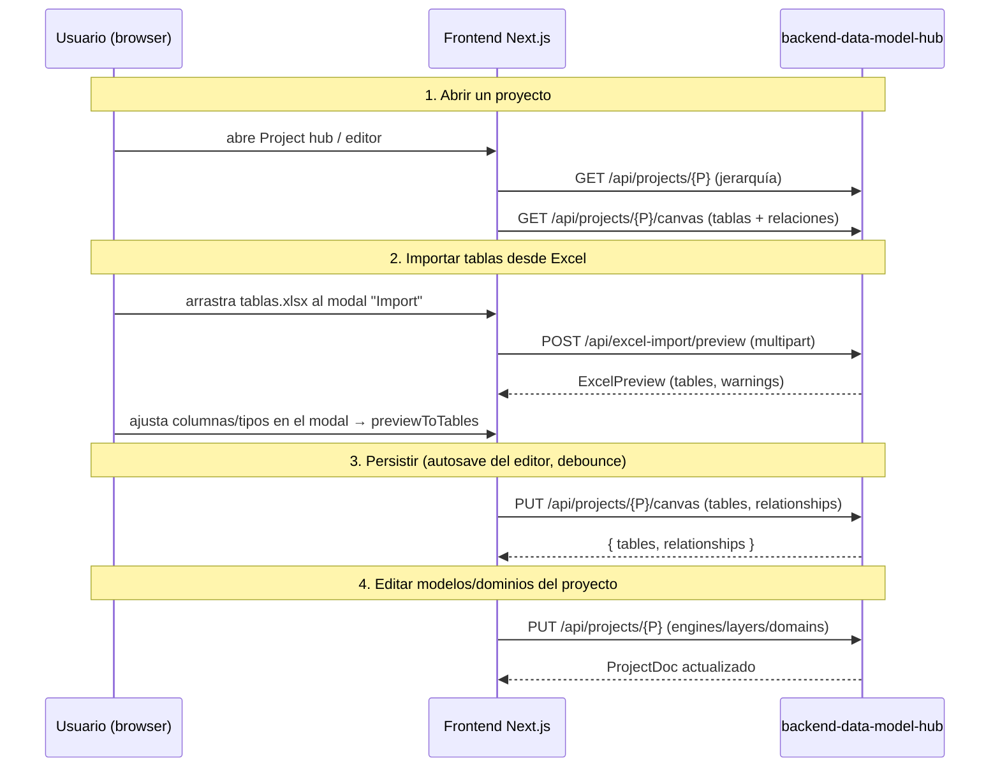

# Guía de uso

> Este backend se opera **exclusivamente como API HTTP**. Toda la interacción
> real ocurre desde el frontend Next.js o llamando directo a los endpoints REST
> con `curl` / Postman. **MVP sin auth**: los endpoints son abiertos (no hay
> login ni cookies).

---

## 1. Arrancar el servidor

### Desarrollo

```bash
# 1. venv con Python 3.12 (una sola vez)
/opt/homebrew/bin/python3.12 -m venv .venv && source .venv/bin/activate
pip install -r requirements.txt

# 2. .env (ver doc/configuration.md) — solo COSMOS_CONNECTION_STRING es crítico
cp .env.example .env && $EDITOR .env

# 3. Arrancar con autoreload
uvicorn app.main:app --host 0.0.0.0 --port 8000 --reload
```

Escucha en `0.0.0.0:8000`. OpenAPI auto-generada en `http://localhost:8000/docs`.

### Verificación rápida

```bash
curl http://localhost:8000/api/health
# → {"status":"ok","version":"1.0.0","db_connected":true}
```

Si `db_connected: false`, los endpoints que toquen Cosmos devuelven 500. Verifica
`COSMOS_CONNECTION_STRING` y reiniciá el proceso.

---

## 2. Mapa de endpoints (todos abiertos)

| Método | Ruta | Qué hace |
|---|---|---|
| GET | `/api/health` | liveness + `db_connected` |
| GET | `/api/projects` | lista todos los proyectos |
| POST | `/api/projects` | crea proyecto (+ engines/layers/domains opcionales) |
| GET | `/api/projects/{id}` | proyecto con su jerarquía embebida |
| PUT | `/api/projects/{id}` | actualiza nombre/descr y **engines/layers/domains** |
| DELETE | `/api/projects/{id}` | soft-delete + cascade al canvas |
| GET | `/api/projects/{id}/canvas` | `{ tables, relationships }` hidratado |
| PUT | `/api/projects/{id}/canvas` | reemplaza tablas y/o relaciones en bloque |
| PATCH | `/api/projects/{id}/positions` | persiste posiciones `{tableId: {x,y}}` |
| GET/POST/PUT/DELETE | `/api/metadata/semantic-types[/{id}]` | catálogo de Semantic Types |
| GET/POST/PUT/DELETE | `/api/metadata/udps[/{id}]` | catálogo de UDPs |
| POST | `/api/excel-import/preview` | preview normalizado de un `.xlsx` |

> No hay `/api/auth/*`, `/api/admin/users*` ni `/api/models*`: la auth/permisos se
> quitaron (MVP abierto) y el canvas reemplazó a la antigua colección `models`.

---

## 3. Flujo end-to-end típico (desde el frontend)



---

## 4. Llamadas con `curl` (para diagnóstico)

### 4.1 Proyectos

```bash
# Listar
curl http://localhost:8000/api/projects

# Crear — engines/layers/domains opcionales
curl -X POST http://localhost:8000/api/projects \
  -H 'Content-Type: application/json' \
  -d '{"name":"Lakehouse","description":"Repo de datos","engines":["databricks_sql"]}'

# Detalle / actualizar jerarquía / borrar
curl http://localhost:8000/api/projects/<uuid>
curl -X PUT http://localhost:8000/api/projects/<uuid> \
  -H 'Content-Type: application/json' \
  -d '{"layers":[{"id":"rdv","name":"RDV","full":"Raw Data Vault","order":0}]}'
curl -X DELETE http://localhost:8000/api/projects/<uuid>
```

### 4.2 Canvas (tablas + relaciones)

```bash
curl http://localhost:8000/api/projects/<uuid>/canvas

curl -X PUT http://localhost:8000/api/projects/<uuid>/canvas \
  -H 'Content-Type: application/json' \
  -d '{
        "tables":[
          {"id":"t1","schema":"rdv","name":"h_cliente","layer":"rdv","domain":"finanzas",
           "columns":[{"id":"c1","name":"id_cliente","dataType":"bigint","isPrimaryKey":true}],
           "views":[]}
        ],
        "relationships":[]
      }'

curl -X PATCH http://localhost:8000/api/projects/<uuid>/positions \
  -H 'Content-Type: application/json' \
  -d '{"tables":{"t1":{"x":120,"y":80}}}'
```

### 4.3 Metadata (Semantic Types / UDP)

```bash
curl http://localhost:8000/api/metadata/semantic-types
curl http://localhost:8000/api/metadata/udps
curl -X POST http://localhost:8000/api/metadata/semantic-types \
  -H 'Content-Type: application/json' \
  -d '{"name":"Monto","dataType":"decimal","tags":[]}'
```

### 4.4 Excel-import

```bash
curl -X POST http://localhost:8000/api/excel-import/preview -F "file=@./tablas.xlsx"
```

Response (resumen):

```json
{
  "success": true,
  "data": {
    "tables": [{
      "sheetName": "dbo.Customer", "schema": "dbo", "name": "Customer",
      "description": "Clientes B2B",
      "columns": [
        {"name":"id","dataType":"bigint","rawDataType":"BIGINT","typeConfidence":100,"typeMatchedVia":"exact"},
        {"name":"amount","dataType":"decimal","rawDataType":"decximam(10,2)","length":10,"scale":2,"typeConfidence":87,"typeMatchedVia":"fuzzy"}
      ]
    }],
    "tableDescriptionsFound": true,
    "warnings": []
  }
}
```

---

## 5. Formato del Excel para `/api/excel-import/preview`

- **Cada hoja es una tabla**. El nombre puede llevar schema con `.`:
  `dbo.Customer` → schema=`dbo`, table=`Customer` (solo el primer `.` separa).
- **La primera fila es header obligatoria** (se descarta).
- **Lectura por posición**: A=nombre, B=tipo (con o sin paréntesis), C=descripción (opcional).

| (A) name | (B) type | (C) description |
|---|---|---|
| customer_id | BIGINT | Identificador único |
| amount | decimal(10, 2) | Monto de la operación |

Hoja opcional `TablesDescriptions` (case-insensitive): se matchea con cada tabla;
las entradas sin match van a `warnings`.

| Input | Resultado |
|---|---|
| `BIGINT` | `bigint` (exact) |
| `int` | `integer` (alias) |
| `decimal(10, 2)` | `decimal`, len=10, scale=2 (exact) |
| `decximam(10,2)` | `decimal` (fuzzy, conf≈86) |
| `(vacío)` | `varchar` (empty) |

Los `unknown` no rompen el import — el usuario corrige en el modal antes de
aplicar al canvas. Ver `doc/workflow.md`.

---

## 6. Operación: monitorear errores

`LOG_FORMAT=json` produce una línea por evento (ideal para Loki / Datadog). Cada
request loguea inicio/fin con `request_id` (también devuelto en `X-Request-ID`).

| Mensaje | Cuándo aparece |
|---|---|
| `motor db connection failed` | En lifespan: Cosmos no responde |
| `request crashed` | Un handler levantó excepción no controlada |
| `excel parse failed` | openpyxl falló (archivo corrupto / protegido) |

---

## 7. Troubleshooting

### `500` en cualquier endpoint que toque DB
`GET /api/health` → `db_connected: false`. Verifica, en orden:
1. `COSMOS_CONNECTION_STRING` completo (`tls=true`, `authMechanism=SCRAM-SHA-256`).
2. La red del servidor habilitada en el firewall de Cosmos (vCore). En Databricks
   Apps con Cosmos abierto a todas las redes, no aplica.
3. La connection string no expiró (rotación de keys).

Después de corregir, **reiniciá el proceso** (la conexión se intenta solo en el lifespan).

### `{"detail":"Not Found"}` al abrir `/`
Es normal: no hay ruta en `/`. La API vive en `/api/*` (probá `/api/health`).

### `400 Could not parse Excel file: ...`
Archivo corrupto, protegido con contraseña, o `.xlsb` (no soportado por openpyxl).
Re-exportar como `.xlsx` estándar.
