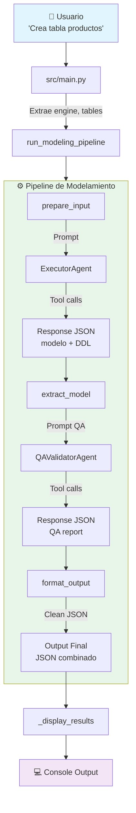

# Workflow y Pipeline de Modelamiento

## Visión general

El pipeline de modelamiento se implementa como un **grafo dirigido** usando `WorkflowBuilder` del Microsoft Agent Framework. El grafo consta de 5 nodos que procesan secuencialmente el input del usuario hasta producir un modelo validado con DDL y reporte de calidad.

**Archivo**: `src/workflow/graph.py`

---

## Grafo del pipeline

```mermaid
flowchart LR
    subgraph Input["📥 Input"]
        JSON["JSON Input<br/>{tables, engine, relaciones}"]
    end

    subgraph Node1["⚙️ prepare_input<br/><i>Executor custom</i>"]
        N1["• Parsea JSON<br/>• Extrae datos<br/>• Guarda en Context<br/>• Construye prompt"]
    end

    subgraph Node2["🤖 ExecutorAgent<br/><i>Agent del framework</i>"]
        N2["• Llama query_guidelines<br/>• Genera modelo<br/>• Genera DDL<br/>• Responde JSON"]
    end

    subgraph Node3["⚙️ extract_model<br/><i>Executor custom</i>"]
        N3["• Almacena en ctx.state<br/>• Extrae JSON<br/>• Prepara prompt QA"]
    end

    subgraph Node4["🤖 QAValidatorAgent<br/><i>Agent del framework</i>"]
        N4["• search_column_catalog<br/>• add_column_to_catalog<br/>• Valida lineamientos<br/>• Regenera DDL<br/>• Calcula quality_score"]
    end

    subgraph Node5["⚙️ format_output<br/><i>Executor custom</i>"]
        N5["• Limpia JSON<br/>• Combina modelo + QA<br/>• yield_output"]
    end

    subgraph Output["📤 Output"]
        OUT["JSON Final<br/>{engine, generated_model, qa_validation}"]
    end

    JSON --> N1 --> N2 --> N3 --> N4 --> N5 --> OUT

    style Node1 fill:#e3f2fd
    style Node2 fill:#e8f5e9
    style Node3 fill:#e3f2fd
    style Node4 fill:#fff3e0
    style Node5 fill:#e3f2fd
    style Input fill:#e1f5fe
    style Output fill:#ffebee
```



---

## Nodos del pipeline

### 1. `prepare_input` (Executor)

**Entrada**: JSON string con datos del usuario.

**Proceso**:
1. Parsea el JSON de entrada.
2. Extrae: `tables`, `user_text`, `target_engine`, `relationships`, `history` (opcional), `last_model` (opcional).
3. Construye un prompt Markdown estructurado con secciones (cada sección solo aparece si tiene contenido):
   - `## HISTORIAL DE CONVERSACIÓN PREVIA` — mensajes previos del usuario y del agente, formateados como `**Usuario:** ...` / `**Agente:** ...`. Solo aparece si la API pasó `history` no vacío.
   - `## MODELO ACTUAL` — el último `last_model` serializado en JSON dentro de un fence ` ```json ... ``` `. Solo aparece si la API pasó `last_model` no vacío. Indica al agente que parta de ese estado y aplique solo los cambios de la solicitud actual.
   - `## SOLICITUD DE MODELAMIENTO DE DATOS` — motor destino.
   - `## CONTEXTO DEL USUARIO` — texto libre.
   - `## TABLAS A MODELAR` — tablas, conteos totales y resumen de columnas (nombre, definición, tipo, nullable, notas).
   - `## RELACIONES ENTRE TABLAS` — FK declaradas por el usuario.
   - `## INSTRUCCIONES` — pasos para el ExecutorAgent, incluyendo: respetar el `MODELO ACTUAL` cuando exista y no eliminar tablas/columnas previas salvo que el usuario lo pida.
4. Guarda `input_data` y `target_engine` en `WorkflowContext`.
5. Envía `AgentExecutorRequest` con el prompt.

**`session_id` (campo opcional fuera del prompt)**: si el caller (la API) pasa `session_id` dentro de `input_data`, `run_modeling_pipeline` envuelve la ejecución en `session_scope(session_id)` para que las tools `query_guidelines` y `get_all_guidelines` resuelvan al cache de esa sesión. El `session_id` **no se serializa en el prompt** — el LLM no lo ve.

**Formato del input JSON**:
```json
{
  "user_text": "Crea una tabla de productos...",
  "tables": [
    {
      "table_name": "productos",
      "columns": [
        {
          "column_name": "nombre",
          "functional_definition": "Nombre del producto",
          "data_type_hint": "VARCHAR",
          "is_nullable": false,
          "notes": ""
        }
      ]
    }
  ],
  "target_engine": "postgresql",
  "relationships": ["productos tiene FK hacia categorias"]
}
```

### 2. `ExecutorAgent` (Agent)

**Entrada**: prompt Markdown del paso anterior.

**Proceso**:
1. Lee el prompt con la solicitud de modelamiento y el conteo de tablas/columnas.
2. Invoca obligatoriamente `get_all_guidelines` para obtener lineamientos corporativos, convirtiendo (de ser necesario) los DOCX/PDF nativos.
3. Genera el modelo de datos completo mediante análisis de reglas extraídas:
   - Aplica nomenclaturas de tablas dinámicamente según indique la KB.
   - Aplica prefijos estándar de columnas y tipado según las guías.
   - Preserva absolutamente el 100% de las columnas requeridas garantizando **Fidelidad Estricta**.
   - Agrega columnas de auditoría establecidas obligatoriamente por los lineamientos.
   - Claves primarias y foráneas inferidas y tipadas.
   - DDL ejecutable.
4. Responde con JSON estructurado.

**Salida**: JSON del modelo generado (puede contener markdown fences o texto preamble).

### 3. `extract_model` (Executor)

**Entrada**: `AgentExecutorResponse` del ExecutorAgent.

**Proceso**:
1. Obtiene `response.agent_response.text`.
2. Guarda el modelo raw en `ctx.state["generated_model"]`.
3. Construye prompt de validación para QAValidatorAgent con:
   - El modelo generado completo.
   - El motor de BD.
   - Instrucciones de validación detalladas (7 pasos).
4. Envía `AgentExecutorRequest` con el prompt de QA.

### 4. `QAValidatorAgent` (Agent)

**Entrada**: prompt con modelo a validar + instrucciones.

**Proceso**:
1. Consulta lineamientos con `query_guidelines`.
2. Para cada columna del modelo:
   - Llama a `search_column_catalog` con la definición funcional.
   - Si match ≥ 0.5 → reemplaza nombre.
   - Si no hay match → llama a `add_column_to_catalog`.
3. Verifica cumplimiento de lineamientos (naming, tipos, auditoría, PK).
4. Regenera DDL si hubo correcciones.
5. Calcula quality_score (0-100).
6. Responde con JSON del QA report.

**Salida**: JSON con tablas corregidas + qa_report.

### 5. `format_output` (Executor)

**Entrada**: `AgentExecutorResponse` del QAValidatorAgent.

**Proceso**:
1. Obtiene resultado QA y modelo original del estado.
2. Aplica `_extract_json_from_text` para limpiar ambas respuestas.
3. Construye JSON final:
```json
{
  "engine": "postgresql",
  "generated_model": "{ ... JSON limpio del modelo ... }",
  "qa_validation": "{ ... JSON limpio del QA report ... }"
}
```
4. Emite resultado con `ctx.yield_output`.

---

## Estado del workflow (WorkflowContext)

El estado se gestiona con `ctx.set_state()` y `ctx.get_state()`:

| Clave | Tipo | Establecido por | Consumido por |
|-------|------|-----------------|---------------|
| `input_data` | `dict` | `prepare_input` | (disponible) |
| `target_engine` | `str` | `prepare_input` | `extract_model`, `format_output` |
| `generated_model` | `str` | `extract_model` | `format_output` |

---

## Extracción robusta de JSON

### Problema
Los LLMs frecuentemente producen respuestas con:
- Texto preamble antes del JSON ("Aquí está el modelo generado:\n```json\n{...}")
- Markdown fences (`` ```json ... ``` ``)
- Trailing commas (`{"key": "value",}`)
- Texto después del JSON

### Solución: `_extract_json_from_text(text)`

Tres estrategias progresivas:

**Caso 1 — JSON en fences**:
```
Busca: ```json\n{...}\n```
Extrae contenido entre fences.
```

**Caso 2 — JSON puro**:
```
Si el texto empieza con {, intenta parsear directamente.
Si falla, busca el último } balanceado (conteo de profundidad).
```

**Caso 3 — JSON embebido en texto**:
```
Busca primer { y último } en todo el texto.
Extrae la subcadena y valida.
```

En cada caso, si el parse directo falla, aplica `_fix_trailing_commas` y reintenta.

### `_fix_trailing_commas(text)`
Regex: `r',\s*([}\]])'` → elimina comas antes de `}` o `]`.

---

## Creación y ejecución

### Crear el workflow

```python
from src.workflow.graph import create_modeling_workflow
from src.agents.factory import get_chat_client

client = get_chat_client()
workflow = create_modeling_workflow(client)
```

Internamente, `create_modeling_workflow`:
1. Crea `ExecutorAgent` y `QAValidatorAgent` con el cliente compartido.
2. Construye el grafo con `WorkflowBuilder`:
```python
workflow = (
    WorkflowBuilder(start_executor=prepare_input)
    .add_edge(prepare_input, executor_agent)
    .add_edge(executor_agent, extract_model)
    .add_edge(extract_model, qa_agent)
    .add_edge(qa_agent, format_output)
    .build()
)
```

### Ejecutar el pipeline

```python
from src.workflow.graph import run_modeling_pipeline

result = await run_modeling_pipeline(client, input_data)
# result = {"engine": "...", "generated_model": "...", "qa_validation": "..."}
```

La función `run_modeling_pipeline`:
1. Crea el workflow.
2. Serializa input a JSON.
3. Ejecuta `workflow.run(input_json)`.
4. Extrae outputs del resultado.
5. Retorna dict parseado o `{"error": "..."}`.

---

## Flujo de datos completo



**Detalle del flujo paso a paso:**

| Paso | Componente | Acción |
|------|------------|--------|
| 1 | `main.py` | Extrae `engine="postgresql"`, construye `input_data` |
| 2 | `prepare_input` | Construye prompt enriquecido exigiendo métricas de *Fidelidad*: "## TABLAS A MODELAR (1 tablas, 19 columnas)\n..." |
| 3 | `ExecutorAgent` | Convierte y Llama `get_all_guidelines`, analiza la DB y genera modelo + DDL íntegro |
| 4 | `extract_model` | Almacena en `ctx.state`, prepara prompt QA |
| 5 | `QAValidatorAgent` | Llama `search_column_catalog`, valida, estandariza |
| 6 | `format_output` | Limpia JSON con `_extract_json_from_text`, combina resultados |
| 7 | `_display_results` | Rich tables, DDL panels, QA score panel |

---

## Integración con la API REST (multi-turno)

La función `run_modeling_pipeline` recibe un dict con campos adicionales cuando es llamada desde la API:

```python
input_data = {
    # Campos base (también usados por CLI)
    "user_text": str,
    "tables": list[dict],
    "target_engine": str,
    "relationships": list[str],

    # Campos adicionales inyectados por la API
    "history": list[{"role": str, "content": str}],  # historial de la sesión
    "last_model": dict | None,   # último modelo generado (si hubo turno previo)
    "session_id": str,           # UUID de la sesión (para ContextVar de guidelines)
}
```

**`session_id`** se saca del dict antes de serializar a JSON para el prompt:
```python
payload = {k: v for k, v in input_data.items() if k != "session_id"}
input_json = json.dumps(payload, ensure_ascii=False)

with session_scope(session_id):  # ContextVar activo durante toda la ejecución
    events = await workflow.run(input_json)
```

Esto garantiza que el LLM nunca reciba el `session_id` en su contexto, mientras las tools de guidelines lo resuelven transparentemente.

---

## Normalización de Relaciones

El `QAValidatorAgent` a veces devuelve `relationships` como lista de dicts en lugar de strings. El `response_builder.py` normaliza defensivamente:

```python
def _normalize_relationship(item: Any) -> str:
    if isinstance(item, str):
        return item
    if isinstance(item, dict):
        from_t = item.get("from_table") or item.get("source_table") or ""
        to_t   = item.get("to_table")   or item.get("target_table") or ""
        # ... construye "tabla_a.col → tabla_b.col [tipo] — descripción"
    return str(item)

# Aplicado en todos los puntos de lectura:
relationships = [_normalize_relationship(r) for r in (raw.get("relationships") or [])]
```
