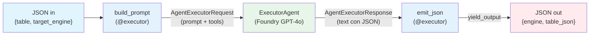
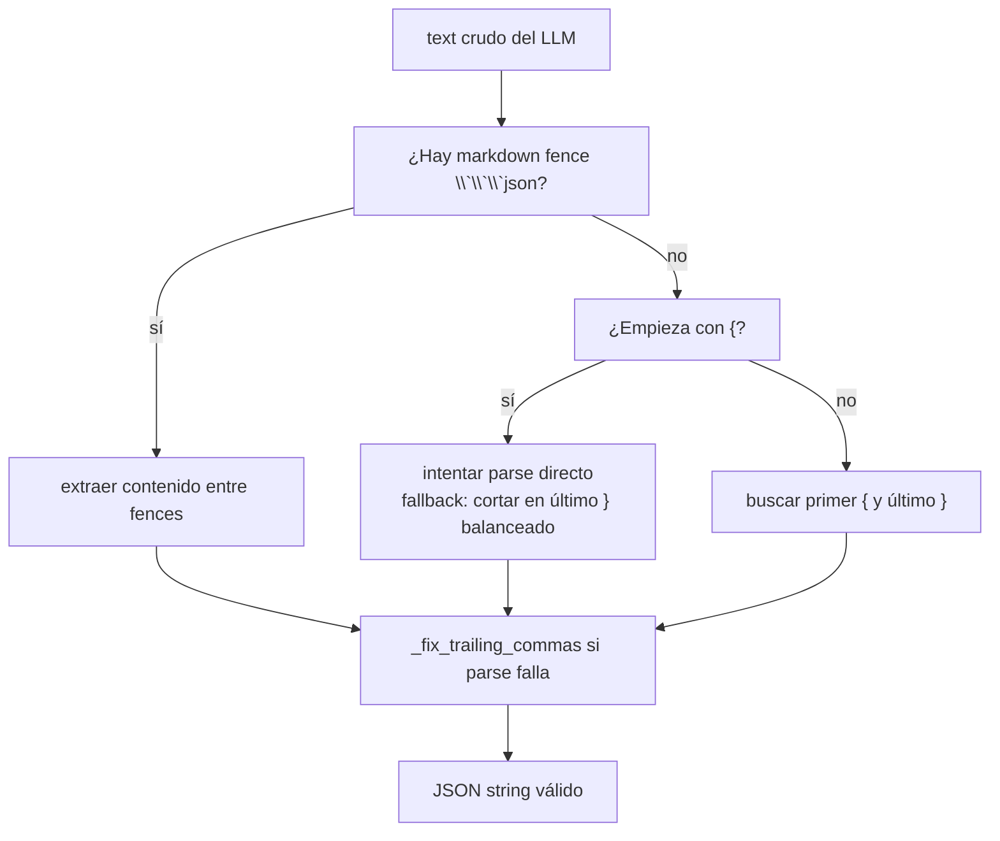
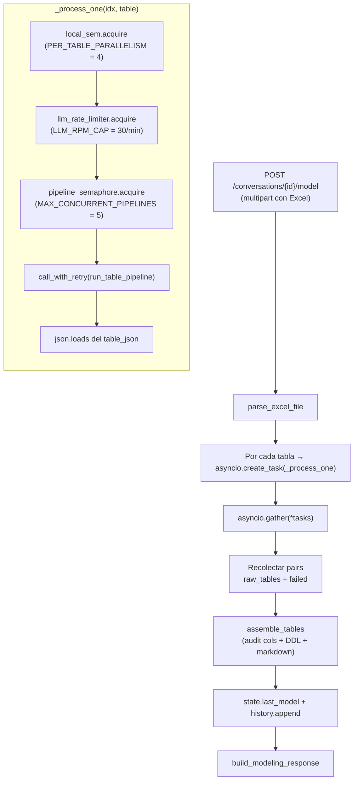
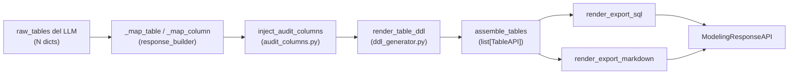

# Workflow de Modelamiento

> El pipeline de modelamiento se rediseñó por completo. Donde antes
> había un grafo de 5 nodos con dos agentes, ahora hay un grafo de
> **3 nodos** con un único agente que procesa **una sola tabla por
> ejecución**. La concurrencia entre tablas vive afuera del workflow,
> en `api/routes/modeling.py`.

**Archivo principal**: `src/workflow/graph.py`

---

## 1. El grafo



Construcción (`create_modeling_workflow`):

```python
WorkflowBuilder(start_executor=build_prompt)
    .add_edge(build_prompt, executor_agent)
    .add_edge(executor_agent, emit_json)
    .build()
```

---

## 2. Nodos en detalle

### 2.1 `build_prompt` (executor)

**Entrada**: JSON string con

```json
{
  "table": {
    "table_name": "Customers",            // provisional, viene del Excel
    "table_description": "Clientes B2B",
    "columns": [
      {
        "column_name": "id",
        "data_type_hint": "BIGINT",
        "functional_definition": "Identificador único del cliente"
      }
    ]
  },
  "target_engine": "databricks_sql"
}
```

**Proceso**:

1. Parse del JSON. Si está malformado, envía un mensaje cortés al
   agente para que devuelva `{}` y termine.
2. **Vector search del diccionario semántico** (`_build_semantic_dict`):
   - Embeb las definiciones funcionales no vacías en un solo batch.
   - Por cada una, busca matches en `column_catalog` con similitud
     ≥ `VECTOR_SIMILARITY_THRESHOLD` (default 0.85).
   - Si hay matches, agrega al prompt una sección "DICCIONARIO
     SEMÁNTICO MANDATORIO" con el formato:
     ```
     - Definicion: "<def>" -> Nombre EXACTO: `<nombre>` | Tipo: <type> | Similitud: 0.92
     ```
3. Construye el prompt en Markdown con secciones:
   - `## SOLICITUD` — motor destino.
   - `## TABLA A MODELAR` — nombre provisional, descripción.
   - `## COLUMNAS DEL INPUT (N)` — bullets con `name (type) — definicion`.
   - `## DICCIONARIO SEMANTICO MANDATORIO` (opcional, solo si hubo matches).
   - `## INSTRUCCIONES` — 4 puntos: respeto al diccionario, llamar
     `get_all_guidelines` una vez, devolver SOLO JSON sin DDL ni
     audit columns.
4. Guarda en `ctx.state` el `target_engine` y el `input_table_name`.
5. Envía `AgentExecutorRequest(messages=[Message("user", contents=[prompt])])`.

> El **diccionario semántico es el corazón del rediseño**: garantiza
> que columnas con la misma semántica se nombren igual entre tablas y
> entre modelos, sin pagar el costo de un agente QA por cada
> ejecución.

### 2.2 `ExecutorAgent` (agent)

**Tools disponibles** (de `src/tools/knowledge_base_tools.py`):
`query_guidelines`, `get_all_guidelines`.

**Comportamiento esperado** (instruido por el system prompt en
`src/agents/instructions.py`):

1. Llamar `get_all_guidelines()` una sola vez al recibir el prompt
   para tener los lineamientos en contexto.
2. Decidir nombres físicos basándose 100 % en las **definiciones
   funcionales** (los nombres provisionales del Excel son orientativos).
3. Respetar el diccionario semántico mandatorio cuando exista.
4. Aplicar prefijos / sufijos / tipos según los lineamientos.
5. Devolver JSON plano (sin wrapper `tables`):
   ```json
   {
     "table_name": "tbl_customers",
     "table_description": "...",
     "columns": [
       {
         "column_name": "id_customer",
         "data_type": "BIGINT",
         "is_pk": true,
         "nullable": false,
         "functional_definition": "...",
         "notes": ""
       }
     ],
     "notes": ""
   }
   ```
6. **No** incluir DDL, **no** incluir audit columns, **no** incluir
   relaciones — todo eso se agrega después en Python.

**Configuración del agente** (`src/agents/factory.py`):

| Param | Valor | Razón |
|-------|-------|-------|
| `temperature` | `0.1` | tarea estructural, no creativa |
| `max_tokens` | `8000` (default) | output ~500 tokens / tabla; el techo deja margen |
| `model` | `settings.FOUNDRY_MODEL` (default `gpt-4o`) | |

### 2.3 `emit_json` (executor)

**Entrada**: `AgentExecutorResponse` del agente.

**Proceso**:

1. `response.agent_response.text` → texto crudo del LLM (puede traer
   markdown fences, preamble, trailing commas).
2. `_extract_json_from_text` aplica una serie de heurísticas
   tolerantes (ver §3) para devolver un JSON string válido.
3. `ctx.yield_output(json.dumps({"engine": ..., "table_json": cleaned}))`.

---

## 3. Extracción robusta de JSON

`_extract_json_from_text(text)` aplica estrategias en este orden:



`_fix_trailing_commas` aplica regex `r",\s*([}\]])"` → elimina
comas espurias antes de `}` o `]` (el LLM ocasionalmente las pone
imitando estilo "humano").

---

## 4. La concurrencia vive afuera del workflow

`api/routes/modeling.py::generate_model` es quien orquesta la
ejecución de **N workflows en paralelo** (uno por tabla del Excel):



**Política de fallos parciales**: si una tabla falla, las demás
siguen. El response devuelve solo las que salieron, y el `summary`
del turno guardado en `state.history` deja constancia de las que
fallaron. El cliente puede reintentar pasándole solo el subset
fallido en otro Excel.

**Si fallan todas**: 500 con detalle "Ninguna tabla pudo ser
modelada".

---

## 5. Reintentos con backoff (429)

`call_with_retry` envuelve cada `run_table_pipeline` con detección
de rate limits:

| Intento | Backoff base (s) | Con jitter (×40 %) |
|---------|------------------|---------------------|
| 1 | 5 | 5–7 |
| 2 | 15 | 15–21 |
| 3 | 30 | 30–42 |
| 4 | 45 | 45–63 |

Total worst-case: ~80–130 s para una sola tabla. Si después de los
4 reintentos sigue fallando, la tabla queda en `failed`.

`_is_rate_limit_error` identifica el 429 por substrings (`"429"`,
`"rate_limit_exceeded"`, `"rate limit"`, `"too many requests"`)
porque la SDK envuelve el error original en una `Exception` genérica
y el tipo concreto cambia entre versiones.

---

## 6. Estado del workflow (`WorkflowContext`)

| Clave | Set por | Leída por |
|-------|---------|-----------|
| `target_engine` | `build_prompt` | `emit_json` |
| `input_table_name` | `build_prompt` | (debug / logs) |

El estado es por-ejecución del workflow (no compartido entre tablas
ni entre turnos).

---

## 7. Aislamiento de guidelines por sesión

`run_table_pipeline` envuelve la ejecución del workflow con
`session_scope(session_id)` (ver `src/tools/knowledge_base_tools.py`):

```python
async def run_table_pipeline(client, table, target_engine, *, session_id=None):
    workflow = create_modeling_workflow(client)
    payload = {"table": table, "target_engine": target_engine}
    input_json = json.dumps(payload, ensure_ascii=False)

    with session_scope(session_id):
        events = await workflow.run(input_json)
        outputs = events.get_outputs()
    ...
```

Dentro del scope, las tools `query_guidelines` y `get_all_guidelines`
resuelven al cache de la sesión vía `ContextVar`. **Sin** el
`session_scope`, las tools caerían al cache global (`GUIDELINES_PATH`)
ignorando el archivo que el usuario subió en el chat — es la causa
más sutil de "el agente parece no usar mis guidelines".

---

## 8. Procesamiento determinista post-LLM

Una vez que las N tablas vuelven del workflow, el endpoint encadena
operaciones puras de Python en `src/processing/`:



| Paso | Determinismo | Notas |
|------|--------------|-------|
| `_map_column` | 100 % | tolerante a nombres legacy del LLM (`is_primary_key` ↔ `is_pk`, etc.). |
| `inject_audit_columns` | 100 % | salta tablas `r*` y `t*`; idempotente si el LLM ya emitió audit cols. |
| `render_table_ddl` | 100 % por motor | un dialecto por engine (`databricks_sql`, `cosmosdb`, `sqlserver`, `postgresql`, `mysql`). |
| `render_export_markdown` | 100 % | formatea el modelo en MD para descarga / preview. |

Esto es lo que hace que la latencia y el contenido del response sean
predecibles: si el LLM produjo el mismo JSON, el response final es
exactamente el mismo string.

---

## 9. Lo que el rediseño dejó fuera (intencionalmente)

| Componente eliminado | Razón |
|----------------------|-------|
| `QAValidatorAgent` | Doblaba latencia y costo, regularmente revertía decisiones correctas. La calidad la garantiza ahora el diccionario semántico mandatorio + el revisor humano. |
| `_normalize_relationship` | El backend ya no devuelve relationships del LLM (siempre `[]`). Las relaciones las modela el usuario en el canvas. |
| `prepare_input` con `history` y `last_model` | El multi-turno con memoria de modelo se simplificó a "un Excel = un turno". El historial textual sigue guardándose en `state.history` para auditoría, pero no se inyecta en el prompt — cada turno es independiente. |
| `extract_model` | Ya no había una segunda pasada a un agente, así que el nodo intermedio sobraba. |
| `format_output` con merge QA | Reemplazado por el ensamblado determinista en Python (`assemble_tables`). |
