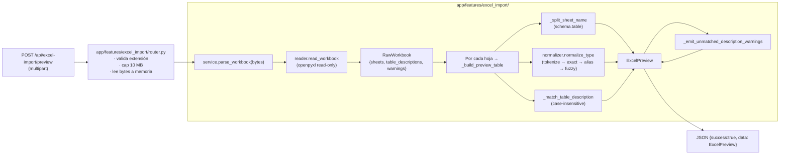
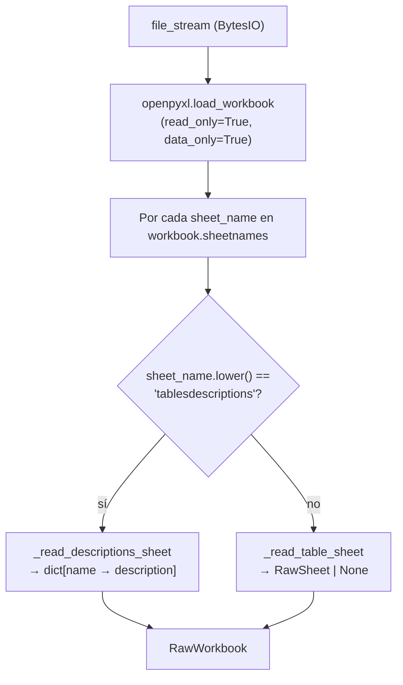
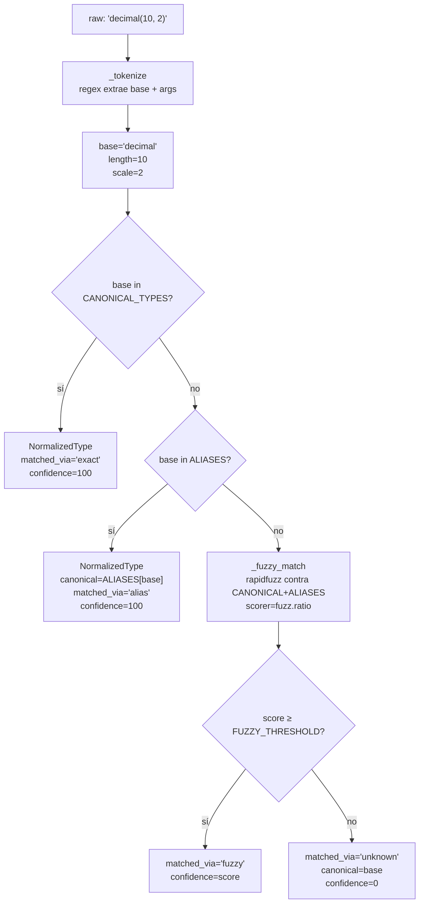

# Workflow: import desde Excel

> Este backend ya **no orquesta el pipeline LLM** (eso vive en
> `app-agents-modeler`). El único "workflow" relevante acá es el
> Excel-import: bytes subidos → preview normalizado.
>
> Es 100 % determinista, sin LLM, con un único responsable por paso.
> El frontend usa el preview para hidratar el modal de import, deja
> que el usuario revise/corrija y luego persiste las tablas resultantes
> con `PUT /api/projects/{id}/canvas`.

**Endpoint**: `POST /api/excel-import/preview` (multipart/form-data) — abierto (MVP sin auth)
**Tope de upload**: 10 MB (`_MAX_UPLOAD_BYTES`)
**Extensiones aceptadas**: `.xlsx`, `.xlsm`

---

## 1. Vista de alto nivel



---

## 2. Paso 1 — Lectura cruda (`reader.read_workbook`)

Responsabilidad acotada: abrir el archivo con `openpyxl` en modo
read-only y devolver estructuras simples (`RawSheet`, `RawColumnRow`,
`RawWorkbook`). **Cero lógica de negocio acá**.



**Reglas que aplica este paso**:

| Regla | Razón |
|---|---|
| La primera fila se descarta sin mirar contenido | Contrato explícito: la primera fila es siempre header. Sin "detectar header" mágico. |
| Lectura por **posición** (A=name, B=type, C=description) | Predecible, no rompe si el usuario renombra el header. |
| Filas con A vacío se saltan | Sin nombre de columna, la fila no tiene sentido. Cubre filas vacías intercaladas. |
| Hoja vacía → warning, sigue con el resto | El preview siempre se debe poder renderizar. |
| Hoja con solo header → warning | Idem. |
| `read_only=True` | El usuario puede subir workbooks de cualquier tamaño; no necesitamos mantener todo el modelo editable en memoria. |
| `data_only=True` | Si la celda tiene una fórmula, leemos el último valor cacheado (no la fórmula como string). |

**Hoja `TablesDescriptions`**:

- Match case-insensitive con la constante `TABLE_DESCRIPTIONS_SHEET = "tablesdescriptions"`.
- Header validado por posición + `"table"` / `"name"` / `"desc"` en
  substring; si no coincide, se emite warning pero se lee igual A/B.
- Filas con `TableName` o `TableDescription` vacíos se saltan.

---

## 3. Paso 2 — Split del nombre de hoja (`_split_sheet_name`)

```python
def _split_sheet_name(sheet_name: str) -> tuple[str | None, str]:
    raw = sheet_name.strip()
    if "." not in raw:
        return None, raw
    schema, _, table = raw.partition(".")
    schema = schema.strip()
    table = table.strip()
    if not schema or not table:
        return None, raw
    return schema, table
```

| Input | Output |
|---|---|
| `"dbo.Customer"` | `("dbo", "Customer")` |
| `"Customer"` | `(None, "Customer")` |
| `"a.b.c"` | `("a", "b.c")` *(solo el primer `.` separa)* |
| `".Customer"` | `(None, ".Customer")` *(conservador)* |
| `"dbo."` | `(None, "dbo.")` *(idem)* |
| `"  dbo.Customer  "` | `("dbo", "Customer")` |

---

## 4. Paso 3 — Normalización del tipo (`normalize_type`)

Pipeline determinista en 4 pasos:



### 4.1 `_tokenize`

Regex `_TYPE_TOKEN_RE` permisiva:

```python
_TYPE_TOKEN_RE = re.compile(
    r"""
    ^\s*
    (?P<base>[A-Za-z][A-Za-z0-9 _]*?)
    \s*
    (?:\(\s*(?P<args>[^)]*)\s*\))?
    \s*$
    """,
    re.VERBOSE,
)
```

| Input | base | length | scale |
|---|---|---|---|
| `"VARCHAR(50)"` | `"varchar"` | 50 | None |
| `"decimal(10, 2)"` | `"decimal"` | 10 | 2 |
| `"character varying(120)"` | `"character varying"` | 120 | None |
| `"int"` | `"int"` | None | None |
| `"  Bigint  "` | `"bigint"` | None | None |
| `"weird-thing"` | `"weird-thing"` | None | None *(regex no matchea — fallback a lowercase)* |

Argumentos no numéricos (`VARCHAR(MAX)`) se ignoran silenciosamente.

### 4.2 Paso exact — `CANONICAL_TYPES`

```python
CANONICAL_TYPES: tuple[str, ...] = (
    "integer", "bigint", "smallint", "tinyint",
    "float", "double", "real", "decimal", "numeric", "money",
    "varchar", "char", "text", "nvarchar", "string",
    "boolean",
    "date", "datetime", "timestamp", "timestamptz", "time",
    "binary", "varbinary", "blob", "bytes",
    "json", "jsonb", "xml", "uuid",
    "array", "map", "struct",
)
```

Alineado con `web-data-model-hub/src/types/model.ts::COLUMN_DATA_TYPES`.
Cualquier cambio acá requiere cambio allá.

### 4.3 Paso alias — `ALIASES`

```python
ALIASES: dict[str, str] = {
    # Enteros
    "int": "integer",
    "int2": "smallint",
    "int4": "integer",
    "int8": "bigint",
    "long": "bigint",
    "short": "smallint",
    "byte": "tinyint",
    # Booleano
    "bool": "boolean",
    # Texto
    "str": "string",
    "character": "char",
    "character varying": "varchar",
    "char varying": "varchar",
    "nchar": "char",
    # Tiempo
    "timestamp with time zone": "timestamptz",
    "timestamp without time zone": "timestamp",
    # Binario
    "bytea": "binary",
}
```

> **Regla**: la tabla de alias contiene solo sinónimos NO ambiguos. Las
> variantes con typo (`decximam`, `datatime`) se atrapan en el paso
> fuzzy. Mantener `ALIASES` chica evita drift silencioso.

### 4.4 Paso fuzzy — `_fuzzy_match`

```python
def _fuzzy_match(base: str, *, threshold: float) -> tuple[str | None, float]:
    universe = list(CANONICAL_TYPES) + list(ALIASES.keys())
    result = process.extractOne(base, universe, scorer=fuzz.ratio)
    if result is None:
        return None, 0.0
    match, score, _ = result
    if score < threshold:
        return None, 0.0
    canonical = ALIASES.get(match, match)
    return canonical, float(score)
```

**Por qué `fuzz.ratio` (Levenshtein puro) y no `fuzz.WRatio`**:

WRatio inflaba el score cuando una opción está contenida dentro del
input. Ejemplo histórico que motivó el cambio:

| Input | Con `WRatio` | Con `ratio` |
|---|---|---|
| `"datatime"` vs `"time"` | 90 *(match espurio)* | 33 *(correcto: descartado)* |
| `"datatime"` vs `"datetime"` | 87 | 87 |

Con `ratio`, `"datatime"` resuelve a `"datetime"` como queremos.

**Umbral**: `FUZZY_THRESHOLD = 75.0`. Calibrado para que:

| Caso | Score aprox | Aceptado |
|---|---|---|
| `decximam` → `decimal` | ~86 | ✓ |
| `datatime` → `datetime` | ~87 | ✓ |
| `varian` → `?` | <75 | ✗ (queda unknown) |
| `foobarbaz` → `?` | <75 | ✗ |

### 4.5 Paso unknown

Cuando nada matchea, se devuelve la base original en minúsculas con
`matched_via="unknown"`, `confidence=0`. El frontend lo muestra con
badge naranja y el usuario puede:
- Editar el dropdown del tipo en el modal.
- Si es un tipo nuevo y legítimo, agregarlo a `CANONICAL_TYPES` (ver
  `doc/tools.md::Cómo agregar un alias / tipo canónico nuevo`).

---

## 5. Paso 4 — Match de descripciones (`_match_table_description`)

Para cada tabla parseada, intenta encontrar su descripción en la hoja
`TablesDescriptions` con tres niveles de fallback (case-insensitive):

```python
candidates = [sheet_name.lower()]
if schema:
    candidates.append(f"{schema}.{table_name}".lower())
candidates.append(table_name.lower())

for candidate in candidates:
    if candidate in normalized_descriptions:
        return normalized_descriptions[candidate]
return None
```

Caso típico:

| Hoja | TablesDescriptions key | Match resuelve por |
|---|---|---|
| `dbo.Customer` | `"dbo.Customer"` | candidato 1 |
| `dbo.Customer` | `"Customer"` | candidato 3 |
| `Customer` | `"Customer"` | candidato 1 |
| `dbo.Customer` | `"dbo.cliente"` | sin match → `None` |

Las entradas de `TablesDescriptions` que no encontraron a quién
matchear se reportan en `warnings`:

```
TablesDescriptions row "OldTable" did not match any sheet — description ignored.
```

---

## 6. Lo que **no** hace este pipeline

| Operación | Por qué no |
|---|---|
| Generar DDL | No es responsabilidad del preview. El usuario edita en el modal y luego el frontend persiste el modelo; la generación de DDL la hace el frontend o el agente. |
| Inferir relaciones FK | El backend no propone relaciones — eso lo hace el frontend / el usuario. |
| Aplicar audit columns | Las audit columns se aplican según lineamientos que viven en `app-agents-modeler`. |
| Embedding / vector search | Sin LLM. La normalización de tipos es Levenshtein puro. |
| Persistencia automática | El preview no escribe nada en Cosmos. El frontend dispara `PUT /api/projects/{id}/canvas` con las tablas resultantes después de la revisión humana. |

Esto mantiene el endpoint **rápido, predecible y reentrante**: re-subir
el mismo archivo dos veces produce exactamente el mismo preview.

---

## 7. Errores y comportamiento ante fallos

| Caso | Respuesta |
|---|---|
| Sin filename / extensión inválida | `400 Unsupported file type` |
| Archivo vacío | `400 Empty file` |
| Archivo > 10 MB | `413 File too large` |
| `openpyxl` falla (archivo corrupto, protegido, formato xlsb) | `400 Could not parse Excel file: <detalle>` |
| Hojas vacías o sin columnas | 200 con `warnings` que las listan; el resto de hojas se procesa |
| Entrada de `TablesDescriptions` sin match | 200 con warning; la entrada se ignora |
| Tipo `variant` (Snowflake-only) | 200 con `matched_via="unknown"`; el usuario corrige en el modal |

El backend nunca propaga excepciones al cliente — `app/features/excel_import/router.py`
las captura todas como `400 Could not parse Excel file: <exc>` y loguea
el stack con `log.exception`.

---

## 8. Cómo testear localmente

```bash
# 1. Asegurate de tener el .venv del backend activado
source backend-data-model-hub/.venv/bin/activate

# 2. Probar normalize_type sin levantar servidor
python -c "
from app.features.excel_import import normalize_type
for raw in ['BIGINT', 'int', 'decimal(10,2)', 'decximam(10,2)', 'datatime', 'variant', '']:
    n = normalize_type(raw)
    print(f'{raw!r:30s} → canonical={n.canonical:12s} via={n.matched_via:8s} conf={n.confidence:6.1f} len={n.length} scale={n.scale}')
"

# 3. Probar parse_workbook con un archivo real
python -c "
from app.features.excel_import import parse_workbook
with open('/tmp/test.xlsx', 'rb') as f:
    preview = parse_workbook(f.read())
print(preview.model_dump_json(by_alias=True, indent=2))
"
```

Si modificás `CANONICAL_TYPES`, `ALIASES` o `FUZZY_THRESHOLD`, validá
con casos negativos (`foobar`, `xyz`, etc.) que no produzcan falsos
positivos antes de mergear.
